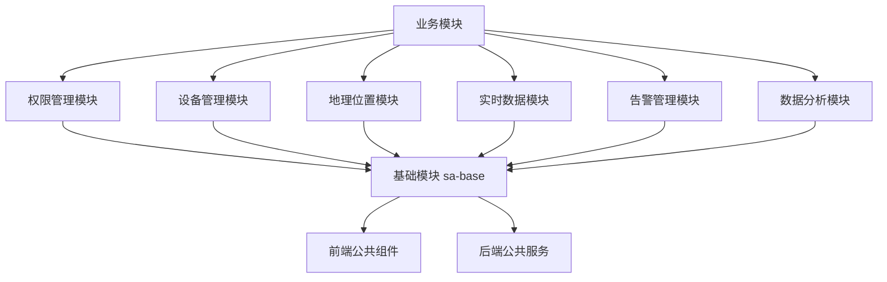

# SmartAdmin 公共模块使用指南

> **📋 版本**: v1.0.0
> **📋 创建时间**: 2025-01-10
> **📋 说明**: 本指南介绍SmartAdmin项目公共模块的使用方法和最佳实践

---

## 📖 概述

SmartAdmin公共模块体系为项目提供了统一的、可复用的功能组件，确保各业务模块的一致性和开发效率。通过使用这些公共模块，可以避免功能重复、代码冗余，并确保全局一致性。

### 公共模块体系



---

## 🔐 权限管理模块 (smart-permission)

### 模块简介
提供统一的5级安全级别权限控制功能，支持数据权限隔离、临时权限管理和权限审计。

### 快速开始

#### 1. 添加依赖

```xml
<!-- pom.xml -->
<dependency>
    <groupId>net.lab1024.sa</groupId>
    <artifactId>smart-permission</artifactId>
    <version>1.0.0</version>
</dependency>
```

#### 2. 后端使用

```java
// Controller中使用权限注解
@RestController
@RequestMapping("/api/demo")
public class DemoController {

    @GetMapping("/data")
    @SaCheckPermission("demo:data:view")
    public ResponseDTO<List<DataVO>> getData() {
        // 业务逻辑
        return ResponseDTO.ok(data);
    }

    @PostMapping("/data")
    @SaCheckPermission("demo:data:add")
    public ResponseDTO<String> addData(@Valid @RequestBody DataCreateDTO dto) {
        // 业务逻辑
        return ResponseDTO.ok();
    }
}

// Service中验证数据权限
@Service
public class DemoService {

    @Resource
    private SecurityLevelService securityLevelService;

    public List<DataVO> queryData(DataQueryDTO queryDTO) {
        Long userId = SmartRequestUtil.getCurrentUserId();

        // 验证安全级别
        Integer userLevel = securityLevelService.getUserSecurityLevel(userId);
        if (userLevel < getRequiredSecurityLevel()) {
            throw new SmartException("权限不足");
        }

        // 验证数据权限
        DataPermissionScope scope = dataPermissionService.getUserDataPermission(userId);
        queryDTO.setDataPermissionScope(scope);

        return demoDao.queryData(queryDTO);
    }
}
```

#### 3. 前端使用

```javascript
// store/permission.js
import { defineStore } from 'pinia'
import { permissionApi } from '/@/api/permission'

export const usePermissionStore = defineStore('permission', {
  state: () => ({
    userSecurityLevel: null,
    permissions: new Map()
  }),

  actions: {
    async initPermissions() {
      const result = await permissionApi.getSecurityLevels()
      this.securityLevels = result.data

      const levelResult = await permissionApi.getUserSecurityLevel(SmartUser.getUserId())
      this.userSecurityLevel = levelResult.data
    },

    async validatePermission(permissionCode, dataScope = null) {
      const result = await permissionApi.validatePermission(permissionCode, dataScope)
      return result.data
    }
  }
})
```

```vue
<!-- 权限组件使用 -->
<template>
  <div>
    <a-button v-permission="['demo:data:add']" @click="handleAdd">
      新增数据
    </a-button>

    <a-button v-permission="['demo:data:edit']" @click="handleEdit">
      编辑数据
    </a-button>

    <!-- 5级安全级别选择器 -->
    <SecurityLevelSelector
      v-model:value="securityLevel"
      :max-allowed-level="userSecurityLevel"
    />
  </div>
</template>
```

### 最佳实践

1. **权限编码规范**: 使用 `module:action` 格式，如 `user:view`, `device:control`
2. **安全级别验证**: 在业务逻辑中验证用户安全级别
3. **数据权限过滤**: 使用数据权限过滤器过滤查询结果
4. **权限缓存**: 合理使用权限缓存提高性能

---

## 🏢 设备管理模块 (smart-device)

### 模块简介
提供统一的设备注册、配置、监控、控制功能，支持多种设备类型和协议。

### 快速开始

#### 1. 添加依赖

```xml
<dependency>
    <groupId>net.lab1024.sa</groupId>
    <artifactId>smart-device</artifactId>
    <version>1.0.0</version>
</dependency>
```

#### 2. 后端使用

```java
// Controller中使用设备管理
@RestController
@RequestMapping("/api/device")
public class DeviceController {

    @Resource
    private DeviceService deviceService;

    @PostMapping("/control/{deviceId}")
    @SaCheckPermission("device:control")
    public ResponseDTO<String> controlDevice(
            @PathVariable Long deviceId,
            @Valid @RequestBody DeviceControlDTO controlDTO) {
        deviceService.controlDevice(deviceId, controlDTO);
        return ResponseDTO.ok();
    }

    @GetMapping("/monitor/{deviceId}")
    @SaCheckPermission("device:monitor")
    public ResponseDTO<List<DeviceMonitorVO>> getDeviceMonitor(@PathVariable Long deviceId) {
        List<DeviceMonitorVO> monitorData = deviceService.getDeviceMonitor(deviceId);
        return ResponseDTO.ok(monitorData);
    }
}

// 实现自定义设备协议
@Component
public class CustomDeviceProtocol implements DeviceProtocol {

    @Override
    public DeviceType getSupportedDeviceType() {
        return DeviceType.CUSTOM;
    }

    @Override
    public DeviceControlResult controlDevice(DeviceEntity device, DeviceControlDTO controlDTO) {
        // 实现自定义设备控制逻辑
        try {
            // 调用设备SDK或API
            CustomDeviceClient client = getClient(device);
            boolean success = client.executeCommand(controlDTO.getCommand());

            return success
                ? DeviceControlResult.success("控制成功")
                : DeviceControlResult.fail("控制失败");
        } catch (Exception e) {
            return DeviceControlResult.fail("控制异常: " + e.getMessage());
        }
    }
}
```

#### 3. 前端使用

```javascript
// store/device.js
import { defineStore } from 'pinia'
import { deviceApi } from '/@/api/device'

export const useDeviceStore = defineStore('device', {
  state: () => ({
    devices: [],
    deviceStatusMap: new Map(),
    selectedDevices: []
  }),

  actions: {
    async fetchDevices() {
      const result = await deviceApi.queryPage({ pageNum: 1, pageSize: 100 })
      this.devices = result.data.records
    },

    async controlDevice(deviceId, controlType, controlData) {
      const result = await deviceApi.controlDevice(deviceId, {
        controlType,
        controlData
      })
      return result.data
    },

    updateDeviceStatus(deviceId, status) {
      this.deviceStatusMap.set(deviceId, status)
    }
  }
})
```

```vue
<!-- 设备状态卡片组件 -->
<template>
  <DeviceStatusCard
    :device="device"
    :monitor-data="monitorData"
    @select="handleDeviceSelect"
    @refresh="handleRefresh"
  />
</template>

<script setup>
import { useDeviceStore } from '/@/store/device'
import DeviceStatusCard from '/@/components/device/DeviceStatusCard.vue'

const deviceStore = useDeviceStore()

const handleDeviceSelect = (deviceId) => {
  deviceStore.selectDevices([deviceId])
}

const handleRefresh = () => {
  deviceStore.fetchDevices()
}
</script>
```

### 最佳实践

1. **设备协议扩展**: 实现 `DeviceProtocol` 接口支持新设备类型
2. **状态缓存**: 使用WebSocket实时更新设备状态
3. **连接池管理**: 合理管理设备连接池避免资源浪费
4. **故障处理**: 完善的设备故障检测和恢复机制

---

## 📍 地理位置模块 (smart-location)

### 模块简介
提供统一的GPS定位、地理围栏、位置验证等功能，支持多种定位方式和精度控制。

### 快速开始

#### 1. 添加依赖

```xml
<dependency>
    <groupId>net.lab1024.sa</groupId>
    <artifactId>smart-location</artifactId>
    <version>1.0.0</version>
</dependency>
```

#### 2. 后端使用

```java
// Controller中使用位置服务
@RestController
@RequestMapping("/api/location")
public class LocationController {

    @Resource
    private LocationService locationService;

    @PostMapping("/report")
    @SaCheckLogin
    public ResponseDTO<String> reportLocation(@Valid @RequestBody LocationReportDTO reportDTO) {
        Long userId = SmartRequestUtil.getCurrentUserId();
        locationService.reportLocation(userId, reportDTO);
        return ResponseDTO.ok();
    }

    @PostMapping("/validate")
    @SaCheckLogin
    public ResponseDTO<LocationValidationVO> validateLocation(
            @Valid @RequestBody LocationValidationDTO validationDTO) {
        Long userId = SmartRequestUtil.getCurrentUserId();
        LocationValidationVO result = locationService.validateLocation(userId, validationDTO);
        return ResponseDTO.ok(result);
    }
}

// 地理围栏事件处理
@Component
public class GeofenceEventHandler {

    @EventListener
    public void handleGeofenceEvent(GeofenceEvent event) {
        if (event.getEventType() == GeofenceEventType.ENTER) {
            // 处理进入围栏事件
            handleEnterGeofence(event);
        } else if (event.getEventType() == GeofenceEventType.EXIT) {
            // 处理离开围栏事件
            handleExitGeofence(event);
        }
    }
}
```

#### 3. 前端使用

```javascript
// store/location.js
import { defineStore } from 'pinia'
import { locationApi } from '/@/api/location'

export const useLocationStore = defineStore('location', {
  state: () => ({
    currentLocation: null,
    geofences: [],
    locationStatus: {
      isWatching: false
    }
  }),

  actions: {
    async reportLocation(locationData) {
      const result = await locationApi.reportLocation({
        latitude: locationData.latitude,
        longitude: locationData.longitude,
        accuracy: locationData.accuracy,
        locationType: 'GPS',
        timestamp: locationData.timestamp
      })

      this.currentLocation = locationData
      return result.data
    },

    startLocationWatch() {
      if (!navigator.geolocation) return

      this.locationStatus.isWatching = true

      const watchId = navigator.geolocation.watchPosition(
        (position) => {
          const locationData = {
            latitude: position.coords.latitude,
            longitude: position.coords.longitude,
            accuracy: position.coords.accuracy,
            timestamp: position.timestamp
          }
          this.reportLocation(locationData)
        },
        (error) => {
          console.error('定位失败:', error)
        },
        {
          enableHighAccuracy: true,
          timeout: 10000,
          maximumAge: 30000
        }
      )

      this.locationStatus.watchId = watchId
    },

    stopLocationWatch() {
      if (this.locationStatus.watchId) {
        navigator.geolocation.clearWatch(this.locationStatus.watchId)
        this.locationStatus.watchId = null
      }
      this.locationStatus.isWatching = false
    }
  }
})
```

```vue
<!-- 地理围栏地图组件 -->
<template>
  <GeofenceMap
    :height="'400px'"
    :editable="true"
    @geofence-select="handleGeofenceSelect"
    @geofence-update="handleGeofenceUpdate"
  />
</template>

<script setup>
import { useLocationStore } from '/@/store/location'
import GeofenceMap from '/@/components/location/GeofenceMap.vue'

const locationStore = useLocationStore()

const handleGeofenceSelect = (geofence) => {
  console.log('选中围栏:', geofence)
}

const handleGeofenceUpdate = (geofence) => {
  locationStore.fetchGeofences()
}
</script>
```

### 最佳实践

1. **定位精度控制**: 根据业务需求选择合适的定位精度
2. **位置缓存**: 合理缓存位置数据提高查询性能
3. **地理围栏优化**: 使用空间索引提高围栏检测效率
4. **隐私保护**: 确保位置数据的安全和隐私保护

---

## ⏰ 实时数据模块 (smart-realtime)

### 模块简介
提供统一的实时数据推送、缓存管理、数据同步等功能，支持WebSocket、SSE等多种实时通信方式。

### 快速开始

#### 1. 添加依赖

```xml
<dependency>
    <groupId>net.lab1024.sa</groupId>
    <artifactId>smart-realtime</artifactId>
    <version>1.0.0</version>
</dependency>
```

#### 2. 后端使用

```java
// Controller中使用实时数据服务
@RestController
@RequestMapping("/api/realtime")
public class RealtimeController {

    @Resource
    private RealtimeService realtimeService;

    @PostMapping("/subscribe")
    @SaCheckLogin
    public ResponseDTO<RealtimeSubscriptionVO> subscribe(@Valid @RequestBody RealtimeSubscriptionDTO subscriptionDTO) {
        Long userId = SmartRequestUtil.getCurrentUserId();
        RealtimeSubscriptionVO subscription = realtimeService.subscribe(userId, subscriptionDTO);
        return ResponseDTO.ok(subscription);
    }

    @PostMapping("/publish")
    @SaCheckPermission("realtime:publish")
    public ResponseDTO<String> publish(@Valid @RequestBody RealtimeMessageDTO messageDTO) {
        Long userId = SmartRequestUtil.getCurrentUserId();
        realtimeService.publish(userId, messageDTO);
        return ResponseDTO.ok();
    }
}

// 发布实时事件
@Service
public class DeviceStatusService {

    @Resource
    private RealtimeEventPublisher eventPublisher;

    public void updateDeviceStatus(Long deviceId, DeviceStatus status) {
        // 更新设备状态
        deviceDao.updateStatus(deviceId, status);

        // 发布实时事件
        RealtimeEvent event = RealtimeEvent.builder()
            .eventType("DEVICE_STATUS_UPDATE")
            .eventData(Map.of(
                "deviceId", deviceId,
                "status", status.getStatus(),
                "isOnline", status.getIsOnline(),
                "timestamp", System.currentTimeMillis()
            ))
            .build();

        eventPublisher.publishEvent(event);
    }
}
```

#### 3. 前端使用

```javascript
// composables/useWebSocket.js
export function useWebSocket(url, options = {}) {
  const { isConnected, connect, disconnect, send, subscribe } = useWebSocketCore(url, options)

  return {
    isConnected,
    connect,
    disconnect,
    send,
    subscribe
  }
}
```

```vue
<!-- 实时数据卡片组件 -->
<template>
  <RealtimeDataCard
    title="设备实时状态"
    :ws-url="wsUrl"
    topic="device:status"
    chart-type="line"
    @data-update="handleDataUpdate"
    @message-receive="handleMessageReceive"
  />
</template>

<script setup>
import { computed } from 'vue'
import { SmartUser } from '/@/utils/auth'
import RealtimeDataCard from '/@/components/realtime/RealtimeDataCard.vue'

const wsUrl = computed(() => {
  const token = SmartUser.getToken()
  return `/ws/realtime/user?token=${token}`
})

const handleDataUpdate = (update) => {
  console.log('数据更新:', update)
}

const handleMessageReceive = (message) => {
  console.log('收到消息:', message)
}
</script>
```

### 最佳实践

1. **连接管理**: 合理管理WebSocket连接，避免连接泄漏
2. **消息优先级**: 使用消息优先级确保重要消息优先处理
3. **重连机制**: 实现自动重连机制提高连接稳定性
4. **性能优化**: 合理使用缓存和批量处理提高性能

---

## 🚨 告警管理模块 (smart-alarm)

### 模块简介
提供统一的告警规则引擎、告警检测算法、告警通知服务等功能。

### 快速开始

#### 1. 添加依赖

```xml
<dependency>
    <groupId>net.lab1024.sa</groupId>
    <artifactId>smart-alarm</artifactId>
    <version>1.0.0</version>
</dependency>
```

#### 2. 后端使用

```java
// 创建告警规则
@Service
public class AlarmRuleService {

    @Resource
    private AlarmEngine alarmEngine;

    public void createAlarmRule(AlarmRuleCreateDTO createDTO) {
        AlarmRuleEntity rule = AlarmRuleEntity.builder()
            .ruleName(createDTO.getRuleName())
            .ruleType(createDTO.getRuleType())
            .triggerCondition(JsonUtils.toJsonString(createDTO.getTriggerCondition()))
            .notificationConfig(JsonUtils.toJsonString(createDTO.getNotificationConfig()))
            .status(1)
            .build();

        alarmRuleDao.insert(rule);

        // 注册告警规则到引擎
        alarmEngine.registerRule(rule);
    }
}

// 触发告警
@Service
public class DeviceMonitorService {

    @Resource
    private AlarmService alarmService;

    public void checkDeviceStatus(DeviceEntity device) {
        if (device.getStatus() == 0) { // 设备离线
            AlarmTriggerDTO triggerDTO = AlarmTriggerDTO.builder()
                .sourceType("DEVICE")
                .sourceId(device.getDeviceId())
                .alarmType("DEVICE_OFFLINE")
                .alarmLevel(2) // 警告级别
                .alarmData(Map.of(
                    "deviceName", device.getDeviceName(),
                    "deviceType", device.getDeviceType(),
                    "offlineTime", LocalDateTime.now()
                ))
                .build();

            alarmService.triggerAlarm(triggerDTO);
        }
    }
}
```

#### 3. 前端使用

```vue
<!-- 告警列表组件 -->
<template>
  <AlarmList
    :alarm-level="alarmLevel"
    :alarm-type="alarmType"
    @alarm-process="handleAlarmProcess"
  />
</template>

<script setup>
import { ref } from 'vue'
import AlarmList from '/@/components/alarm/AlarmList.vue'

const alarmLevel = ref(null)
const alarmType = ref(null)

const handleAlarmProcess = (alarmId, processResult) => {
  console.log('处理告警:', alarmId, processResult)
}
</script>
```

### 最佳实践

1. **告警规则**: 合理设计告警规则避免告警风暴
2. **告警升级**: 实现告警升级机制确保及时处理
3. **通知渠道**: 支持多种通知渠道确保告警触达
4. **告警分析**: 提供告警统计和分析功能

---

## 📈 数据分析模块 (smart-analytics)

### 模块简介
提供统一的数据分析引擎、统计报表生成、数据可视化等功能。

### 快速开始

#### 1. 添加依赖

```xml
<dependency>
    <groupId>net.lab1024.sa</groupId>
    <artifactId>smart-analytics</artifactId>
    <version>1.0.0</version>
</dependency>
```

#### 2. 后端使用

```java
// 数据分析服务
@Service
public class DataAnalyticsService {

    @Resource
    private StatisticsEngine statisticsEngine;

    public StatisticsResult generateStatistics(StatisticsRequest request) {
        return statisticsEngine.execute(request);
    }

    public ReportData generateReport(ReportRequest request) {
        // 生成报表数据
        ReportData reportData = ReportData.builder()
            .reportType(request.getReportType())
            .timeRange(request.getTimeRange())
            .filters(request.getFilters())
            .build();

        // 执行数据查询和分析
        return analyticsEngine.generateReport(reportData);
    }
}
```

#### 3. 前端使用

```vue
<!-- 数据分析组件 -->
<template>
  <div>
    <StatisticsCard
      :statistics-data="statisticsData"
      :loading="loading"
    />

    <AnalyticsChart
      :chart-type="chartType"
      :chart-data="chartData"
      :options="chartOptions"
    />
  </div>
</template>

<script setup>
import { ref, onMounted } from 'vue'
import { analyticsApi } from '/@/api/analytics'
import StatisticsCard from '/@/components/analytics/StatisticsCard.vue'
import AnalyticsChart from '/@/components/analytics/AnalyticsChart.vue'

const loading = ref(false)
const statisticsData = ref([])
const chartData = ref([])
const chartType = ref('line')
const chartOptions = ref({})

onMounted(async () => {
  loading.value = true
  try {
    const [statsResult, chartResult] = await Promise.all([
      analyticsApi.getStatistics(),
      analyticsApi.getChartData({ type: chartType.value })
    ])

    statisticsData.value = statsResult.data
    chartData.value = chartResult.data
  } finally {
    loading.value = false
  }
})
</script>
```

### 最佳实践

1. **数据缓存**: 合理使用数据缓存提高查询性能
2. **异步处理**: 使用异步处理避免阻塞主流程
3. **数据聚合**: 合理设计数据聚合策略
4. **可视化**: 选择合适的图表类型展示数据

---

## 🔧 模块集成指南

### 1. 项目配置

#### Maven依赖管理

```xml
<!-- 父 pom.xml -->
<dependencyManagement>
    <dependencies>
        <dependency>
            <groupId>net.lab1024.sa</groupId>
            <artifactId>smart-common-modules</artifactId>
            <version>1.0.0</version>
            <type>pom</type>
            <scope>import</scope>
        </dependency>
    </dependencies>
</dependencyManagement>

<!-- 业务模块 pom.xml -->
<dependencies>
    <dependency>
        <groupId>net.lab1024.sa</groupId>
        <artifactId>smart-permission</artifactId>
    </dependency>
    <dependency>
        <groupId>net.lab1024.sa</groupId>
        <artifactId>smart-device</artifactId>
    </dependency>
    <dependency>
        <groupId>net.lab1024.sa</groupId>
        <artifactId>smart-location</artifactId>
    </dependency>
    <dependency>
        <groupId>net.lab1024.sa</groupId>
        <artifactId>smart-realtime</artifactId>
    </dependency>
</dependencies>
```

#### Spring Boot配置

```yaml
# application.yml
smart:
  permission:
    enabled: true
    cache-type: redis
    security-levels:
      - TOP_SECRET:50
      - SECRET:40
      - CONFIDENTIAL:30
      - INTERNAL:20
      - PUBLIC:10

  device:
    enabled: true
    connection-pool:
      max-connections: 100
      initial-connections: 10
    heartbeat:
      interval: 30
      timeout: 10

  location:
    enabled: true
    gps:
      min-accuracy: 50
      max-age: 30
    geofence:
      tolerance-distance: 50
      dwell-time: 30

  realtime:
    enabled: true
    websocket:
      max-connections: 10000
      heartbeat-interval: 30
    message-queue:
      max-size: 100000
      consumer-threads: 10
```

### 2. 代码结构规范

#### 后端项目结构

```
src/main/java/net/lab1024/sa/{module}/
├── controller/           # 控制器层
├── service/             # 服务层
├── manager/             # 管理层（调用公共模块）
├── dao/                 # 数据访问层
└── entity/              # 实体层
```

#### 前端项目结构

```
src/
├── api/{module}/         # API接口
├── store/{module}/       # 状态管理
├── views/{module}/       # 页面组件
├── components/{module}/  # 公共组件
└── utils/               # 工具函数
```

### 3. 开发流程

#### 第一步：需求分析
- 确定业务模块需要哪些公共模块功能
- 评估现有公共模块是否满足需求
- 如需扩展，设计扩展方案

#### 第二步：模块集成
- 添加相应公共模块依赖
- 配置模块参数
- 实现业务逻辑

#### 第三步：测试验证
- 编写单元测试
- 编写集成测试
- 验证功能完整性

#### 第四步：部署上线
- 更新部署配置
- 监控模块运行状态
- 处理线上问题

---

## 📋 检查清单

### 开发前检查

- [ ] 是否已阅读相关公共模块文档？
- [ ] 是否已确认模块依赖关系？
- [ ] 是否已了解模块配置要求？
- [ ] 是否已制定集成方案？

### 开发中检查

- [ ] 是否正确使用公共模块API？
- [ ] 是否遵循模块设计规范？
- [ ] 是否处理模块异常情况？
- [ ] 是否进行单元测试？

### 部署前检查

- [ ] 模块配置是否正确？
- [ ] 依赖版本是否兼容？
- [ ] 性能指标是否达标？
- [ ] 监控是否配置完成？

---

## 🔗 相关文档

- [权限管理模块](./smart-permission.md)
- [设备管理模块](./smart-device.md)
- [地理位置模块](./smart-location.md)
- [实时数据模块](./smart-realtime.md)
- [告警管理模块](./smart-alarm.md)
- [数据分析模块](./smart-analytics.md)
- [综合开发规范文档](../DEV_STANDARDS.md)
- [项目开发指南](../PROJECT_GUIDE.md)

---

## 📞 技术支持

如有公共模块使用问题，请联系：

- **架构支持**: 架构师团队
- **开发支持**: 开发团队
- **运维支持**: 运维团队
- **文档支持**: 技术写作团队

---

*最后更新：2025-01-10*
*维护者：SmartAdmin开发团队*