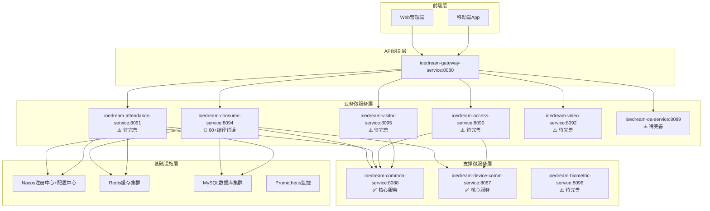
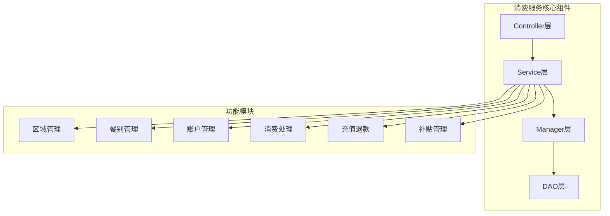
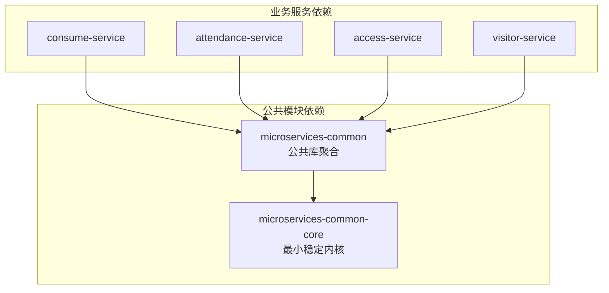
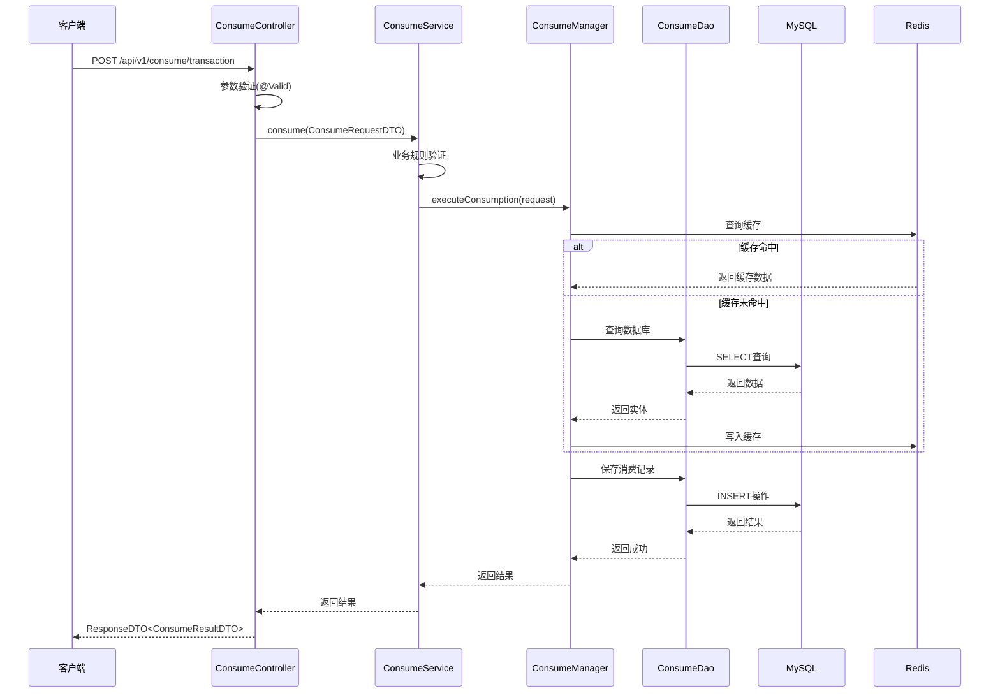
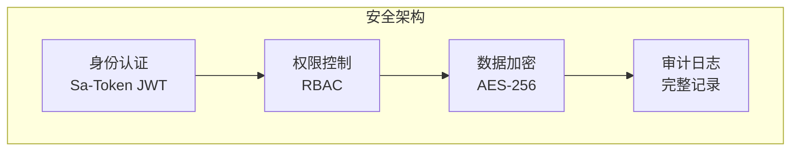
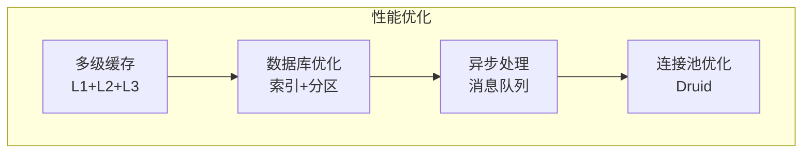
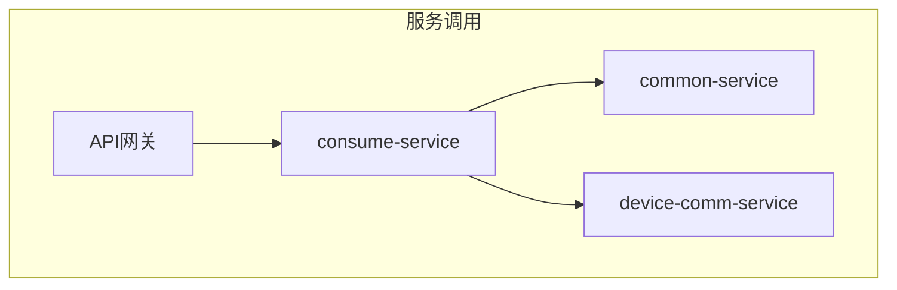

# 设计文档 - IOE-DREAM全面企业级实施计划

> **创建日期**: 2025-01-30  
> **文档版本**: v1.0.0  
> **项目**: IOE-DREAM智慧园区一卡通管理平台  
> **工作流阶段**: 阶段2 - Architect（架构阶段）

---

## 📋 架构概览

### 整体架构图



---

## 🏗️ 分层设计和核心组件

### 四层架构规范（强制执行）

所有微服务严格遵循四层架构规范：

```
┌─────────────────────────────────────────┐
│ Controller层 - 接口控制层                │
│ - 接收HTTP请求                           │
│ - 参数验证(@Valid)                       │
│ - 调用Service层                          │
│ - 封装ResponseDTO                        │
└─────────────────┬───────────────────────┘
                  │
┌─────────────────▼───────────────────────┐
│ Service层 - 核心业务层                   │
│ - 核心业务逻辑实现                        │
│ - 事务管理(@Transactional)               │
│ - 调用Manager层                          │
│ - 业务规则验证                            │
└─────────────────┬───────────────────────┘
                  │
┌─────────────────▼───────────────────────┐
│ Manager层 - 复杂流程管理层               │
│ - 复杂业务流程编排                        │
│ - 多DAO数据组装和计算                    │
│ - 缓存策略管理                            │
│ - 第三方服务集成                          │
└─────────────────┬───────────────────────┘
                  │
┌─────────────────▼───────────────────────┐
│ DAO层 - 数据访问层                       │
│ - 数据库CRUD操作                         │
│ - 复杂SQL查询实现                        │
│ - 继承BaseMapper<Entity>                │
│ - 数据库事务边界控制                      │
└─────────────────────────────────────────┘
```

---

## 📦 核心组件

### 1. 消费服务（consume-service）

#### 组件职责



#### 当前问题

- 🔴 **编译错误**: 60+编译错误（chonggou.txt详细列出）
- ⚠️ **实体不完整**: 多个实体字段缺失
- ⚠️ **DAO方法缺失**: AccountDao.deductBalance()缺失
- ⚠️ **类型不一致**: Service层类型错误

#### 修复方案

**阶段一：实体层完善**
- ConsumeRecordEntity：添加`recordId`, `paymentStatus`, `paymentMethod`
- PaymentRecordEntity：添加缺失Getter方法
- PaymentRefundRecordEntity：添加4个缺失字段
- QrCodeEntity：添加16个缺失字段
- ConsumeProductEntity：添加2个缺失字段

**阶段二：DAO层补全**
- AccountDao：添加`deductBalance`方法

**阶段三：Service层修复**
- PaymentRecordServiceImpl：修复类型错误
- OnlineConsumeFlow：修复类型错误

**阶段四：Controller层修复**
- MobileConsumeController：修复类型错误

### 2. 考勤服务（attendance-service）

#### 组件职责

- 班次管理
- 排班管理
- 考勤规则配置
- 打卡采集
- 考勤计算
- 异常处理
- 报表统计

#### 设计模式

**边缘识别+中心计算模式（Mode 3）**
- 设备端完成生物识别
- 服务器端完成排班匹配和统计

### 3. 门禁服务（access-service）

#### 组件职责

- 设备管理
- 权限管理
- 通行记录
- 实时监控
- 多模态认证
- 反潜回管理

#### 设计模式

**边缘自主验证模式（Mode 1）**
- 设备端完全自主完成验证
- 服务器端接收记录

### 4. 访客服务（visitor-service）

#### 组件职责

- 访客信息管理
- 预约管理
- 登记管理
- 身份验证
- 物流管理

#### 设计模式

**混合验证模式（Mode 4）**
- 临时访客：中心验证
- 常客：边缘验证

---

## 🔗 模块依赖关系图



**依赖规则**：
- ✅ 业务服务依赖microservices-common
- ✅ microservices-common依赖microservices-common-core
- ❌ 禁止业务服务直接依赖microservices-common-core
- ❌ 禁止循环依赖

---

## 🔌 接口契约定义

### RESTful API规范

#### 基础路径

```yaml
# 消费服务
base_url: /api/v1/consume

# 考勤服务
base_url: /api/v1/attendance

# 门禁服务
base_url: /api/v1/access

# 访客服务
base_url: /api/v1/visitor
```

#### 统一响应格式

```java
@Data
public class ResponseDTO<T> {
    private Integer code;      // 业务状态码
    private String message;    // 提示信息
    private T data;            // 响应数据
    private Long timestamp;    // 时间戳

    public static <T> ResponseDTO<T> ok(T data) {
        return new ResponseDTO<>(200, "success", data, System.currentTimeMillis());
    }

    public static <T> ResponseDTO<T> error(String code, String message) {
        return new ResponseDTO<>(Integer.parseInt(code), message, null, System.currentTimeMillis());
    }
}
```

#### 分页响应格式

```java
@Data
public class PageResult<T> {
    private List<T> list;      // 数据列表
    private Long total;        // 总记录数
    private Integer pageNum;   // 当前页码
    private Integer pageSize;  // 每页大小
    private Integer pages;     // 总页数
}
```

---

## 📊 数据流向图

### 消费处理流程



---

## ⚠️ 异常处理策略

### 统一异常处理

```java
@RestControllerAdvice
@Slf4j
public class GlobalExceptionHandler {

    /**
     * 业务异常处理
     */
    @ExceptionHandler(BusinessException.class)
    @ResponseStatus(HttpStatus.OK)
    public ResponseDTO<Void> handleBusinessException(BusinessException e) {
        log.warn("[业务异常] code={}, message={}", e.getCode(), e.getMessage());
        return ResponseDTO.error(e.getCode(), e.getMessage());
    }

    /**
     * 参数验证异常处理
     */
    @ExceptionHandler(MethodArgumentNotValidException.class)
    @ResponseStatus(HttpStatus.BAD_REQUEST)
    public ResponseDTO<Map<String, String>> handleValidationException(
            MethodArgumentNotValidException e) {
        Map<String, String> errors = e.getBindingResult().getFieldErrors().stream()
                .collect(Collectors.toMap(
                        FieldError::getField,
                        FieldError::getDefaultMessage,
                        (existing, replacement) -> existing
                ));
        return ResponseDTO.error("VALIDATION_ERROR", "参数验证失败", errors);
    }

    /**
     * 系统异常处理
     */
    @ExceptionHandler(Exception.class)
    @ResponseStatus(HttpStatus.INTERNAL_SERVER_ERROR)
    public ResponseDTO<Void> handleException(Exception e) {
        String traceId = MDC.get("traceId");
        log.error("[系统异常] traceId={}, error={}", traceId, e.getMessage(), e);
        return ResponseDTO.error("SYSTEM_ERROR", "系统内部错误，请稍后重试");
    }
}
```

### 异常分类

| 异常类型 | 状态码 | 处理方式 |
|---------|--------|---------|
| BusinessException | 200 | 返回业务错误码和消息 |
| ValidationException | 400 | 返回参数验证错误 |
| SystemException | 500 | 记录日志，返回通用错误 |
| AuthenticationException | 401 | 返回未认证错误 |
| AuthorizationException | 403 | 返回无权限错误 |

---

## 🔒 安全设计

### 安全架构



### 安全策略

1. **接口安全**
   - 所有接口必须进行身份认证
   - 关键接口进行权限校验
   - 敏感数据传输使用HTTPS

2. **数据安全**
   - 敏感数据加密存储
   - 数据库连接加密
   - 操作审计日志记录

3. **业务安全**
   - 账户余额操作需要事务保证
   - 消费记录不可篡改
   - 支持幂等性设计防止重复操作

---

## 📈 性能设计

### 性能优化策略



### 性能指标

| 指标类型 | 目标值 | 说明 |
|---------|--------|------|
| API响应时间 | ≤500ms | 95%请求响应时间 |
| 并发支持 | ≥500 TPS | 每秒事务处理量 |
| 数据库查询 | ≤100ms | 平均查询时间 |
| 缓存命中率 | ≥85% | 缓存命中率 |

---

## 🔄 集成设计

### 微服务间调用



**调用规则**：
- ✅ 南北向请求必须通过API网关
- ✅ 东西向请求通过GatewayServiceClient
- ❌ 禁止直接FeignClient调用（非白名单）

---

## ✅ 设计验证

### 架构合规性

- [x] 四层架构规范严格遵循
- [x] 依赖注入规范统一
- [x] DAO层命名规范统一
- [x] Jakarta包名规范统一
- [x] 异常处理机制完善

### 设计可行性

- [x] 技术方案可实现
- [x] 与现有系统无冲突
- [x] 接口定义完整
- [x] 数据模型合理
- [x] 性能要求可达到

---

**📝 文档维护**: IOE-DREAM架构团队 | 2025-01-30  
**版本**: v1.0.0 - 架构设计版本  
**状态**: ✅ 架构设计完成，可以进入下一阶段
