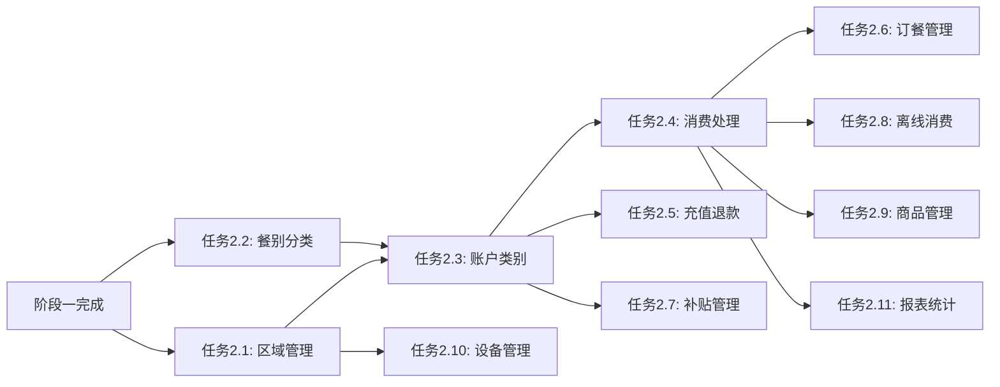

# 阶段二任务拆分 - 消费服务功能完善

> **创建日期**: 2025-01-30  
> **阶段**: 阶段二 - 消费服务功能完善（P1）  
> **状态**: 🟡 规划中  
> **依据文档**: `documentation/业务模块/04-消费管理模块/`

---

## 📋 任务概览

**总体目标**: 基于业务模块文档，完善消费服务11个子模块的功能实现

**优先级分布**:

- **P0级**: 5个子模块（区域管理、餐别分类、账户类别、消费处理、充值退款）
- **P1级**: 5个子模块（订餐管理、补贴管理、离线消费、商品管理、设备管理）
- **P2级**: 1个子模块（报表统计）

**预计工作量**: 20小时（约2-3个工作日）

---

## 🎯 P0级任务（立即执行）

### 任务2.1：区域管理模块完善

**优先级**: 🔴 P0  
**预计时间**: 2小时

**输入契约**:

- 前置依赖: 阶段一编译修复完成 ✅
- 输入数据: `ConsumeAreaEntity`、`ConsumeAreaDao`
- 环境依赖: MySQL、Redis

**输出契约**:

- 输出数据: 完整的区域管理功能
- 交付物:
  - `ConsumeAreaController` - 区域CRUD接口
  - `ConsumeAreaService` - 区域业务逻辑
  - `ConsumeAreaManager` - 区域缓存管理
- 验收标准:
  - ✅ 支持多级区域层级结构（园区→楼栋→楼层→区域）
  - ✅ 支持经营模式配置（餐别制/超市制/混合）
  - ✅ 区域树结构Redis缓存（TTL 30分钟）
  - ✅ 单元测试覆盖率≥80%

**实现约束**:

- 技术栈: Spring Boot 3.5.8、MyBatis-Plus、Redis
- 接口规范: RESTful API，统一ResponseDTO
- 质量要求: 符合CLAUDE.md规范

**详细需求**（基于文档）:

- 多级区域层级管理
- 经营模式配置（manage_mode: 1-餐别制, 2-超市制, 3-混合）
- 定值金额配置（fixed_value_config: JSON格式）
- 餐别分类关联
- GPS位置信息（已添加gpsLocation字段）

**代码检查清单**:

- [ ] `ConsumeAreaController` 实现CRUD接口
- [ ] `ConsumeAreaService` 实现业务逻辑
- [ ] `ConsumeAreaManager` 实现缓存管理
- [ ] 区域树结构查询优化
- [ ] Redis缓存策略实现

---

### 任务2.2：餐别分类模块完善

**优先级**: 🔴 P0  
**预计时间**: 1.5小时

**输入契约**:

- 前置依赖: 任务2.1（区域管理）
- 输入数据: `MealTypeEntity`、`MealTypeDao`
- 环境依赖: MySQL

**输出契约**:

- 输出数据: 完整的餐别分类功能
- 交付物:
  - `MealTypeController` - 餐别CRUD接口
  - `MealTypeService` - 餐别业务逻辑
- 验收标准:
  - ✅ 二级餐别分类体系（一级：早餐/午餐/晚餐，二级：具体餐别）
  - ✅ 餐别时间配置（开始时间、结束时间）
  - ✅ 餐别消费限额配置
  - ✅ 单元测试覆盖率≥80%

**详细需求**（基于文档）:

- 二级餐别分类体系
- 餐别时间配置（pickupStartTime, pickupEndTime）
- 餐别消费限额
- 餐别与区域关联

---

### 任务2.3：账户类别与消费模式模块完善

**优先级**: 🔴 P0  
**预计时间**: 2小时

**输入契约**:

- 前置依赖: 任务2.1、2.2
- 输入数据: `AccountEntity`、`AccountKindEntity`
- 环境依赖: MySQL、Redis

**输出契约**:

- 输出数据: 完整的账户类别和消费模式配置
- 交付物:
  - `AccountController` - 账户管理接口
  - `AccountService` - 账户业务逻辑
  - `AccountManager` - 账户余额管理
- 验收标准:
  - ✅ 支持6种消费模式（固定金额/自由金额/计量计费/商品模式/订餐模式/智能模式）
  - ✅ 账户类型管理（现金账户、补贴账户）
  - ✅ 余额查询和操作
  - ✅ 账户权限验证
  - ✅ 单元测试覆盖率≥80%

**详细需求**（基于文档）:

- 账户类别定义
- 消费模式配置（consumeMode）
- 账户权限验证
- 余额管理

---

### 任务2.4：消费处理模块完善

**优先级**: 🔴 P0  
**预计时间**: 4小时

**输入契约**:

- 前置依赖: 任务2.1、2.2、2.3
- 输入数据: `ConsumeRecordEntity`、`ConsumeTransactionEntity`
- 环境依赖: MySQL、Redis、Seata

**输出契约**:

- 输出数据: 完整的7步消费处理流程
- 交付物:
  - `ConsumeController` - 消费接口
  - `ConsumeService` - 消费业务逻辑
  - `ConsumeManager` - 消费流程编排
  - SAGA分布式事务实现
- 验收标准:
  - ✅ 7步消费处理流程完整实现
  - ✅ SAGA分布式事务（正向操作+补偿操作）
  - ✅ 并发控制（乐观锁+分布式锁）
  - ✅ 幂等性设计（交易号唯一）
  - ✅ 单元测试覆盖率≥85%

**详细需求**（基于文档）:

- 7步处理流程：
  1. 身份识别与账户验证
  2. 区域权限验证
  3. 消费模式判断
  4. 金额计算
  5. 余额检查与扣款
  6. 交易记录生成
  7. 统计更新与通知
- SAGA事务流程（正向+补偿）
- 并发控制（乐观锁、分布式锁）
- 幂等性设计

---

### 任务2.5：充值退款模块完善

**优先级**: 🔴 P0  
**预计时间**: 2.5小时

**输入契约**:

- 前置依赖: 任务2.3（账户管理）
- 输入数据: `RechargeRecordEntity`、`RefundRecordEntity`
- 环境依赖: MySQL、Seata

**输出契约**:

- 输出数据: 完整的充值和退款功能
- 交付物:
  - `RechargeController` - 充值接口
  - `RefundController` - 退款接口
  - `RechargeService` - 充值业务逻辑
  - `RefundService` - 退款业务逻辑
- 验收标准:
  - ✅ 多种充值方式（现金、转账、线上支付）
  - ✅ 退款申请流程（审批流程）
  - ✅ 退款处理（第三方支付退款、账户余额退款）
  - ✅ 交易流水完整记录
  - ✅ 单元测试覆盖率≥80%

**详细需求**（基于文档）:

- 充值方式：现金、转账、线上支付（微信/支付宝）
- 退款申请：支持审批流程
- 退款处理：第三方支付退款、账户余额退款
- 交易流水记录

---

## 🟡 P1级任务（快速执行）

### 任务2.6：订餐管理模块完善

**优先级**: 🟡 P1  
**预计时间**: 2小时

**验收标准**:

- ✅ 订餐预约功能
- ✅ 取餐核销功能
- ✅ 订单状态管理
- ✅ 单元测试覆盖率≥75%

---

### 任务2.7：补贴管理模块完善

**优先级**: 🟡 P1  
**预计时间**: 2小时

**验收标准**:

- ✅ 补贴发放功能
- ✅ 补贴使用规则
- ✅ 补贴账户管理
- ✅ 单元测试覆盖率≥75%

---

### 任务2.8：离线消费模块完善

**优先级**: 🟡 P1  
**预计时间**: 1.5小时

**验收标准**:

- ✅ 离线消费记录保存
- ✅ 离线记录同步机制
- ✅ 冲突检测和处理
- ✅ 单元测试覆盖率≥75%

**说明**: 基础功能已在`OfflineSyncManager`中实现，需要完善业务逻辑。

---

### 任务2.9：商品管理模块完善

**优先级**: 🟡 P1  
**预计时间**: 2小时

**验收标准**:

- ✅ 商品CRUD功能
- ✅ 商品分类管理
- ✅ 商品价格管理
- ✅ 商品库存管理（可选）
- ✅ 单元测试覆盖率≥75%

---

### 任务2.10：设备管理模块完善

**优先级**: 🟡 P1  
**预计时间**: 1.5小时

**验收标准**:

- ✅ 消费设备管理
- ✅ 设备状态监控
- ✅ 设备配置下发
- ✅ 单元测试覆盖率≥75%

**说明**: 设备管理主要通过`ioedream-device-comm-service`，本服务主要负责设备配置。

---

## 🔵 P2级任务（后续执行）

### 任务2.11：报表统计模块完善

**优先级**: 🔵 P2  
**预计时间**: 2小时

**验收标准**:

- ✅ 消费统计报表
- ✅ 财务报表
- ✅ 区域统计报表
- ✅ 单元测试覆盖率≥70%

---

## 📊 任务依赖关系图

---

## 📋 实施检查清单

### 代码质量要求

- [ ] 所有代码符合CLAUDE.md规范
- [ ] 使用@Resource依赖注入
- [ ] 使用@Mapper注解
- [ ] 使用jakarta包名
- [ ] 遵循四层架构边界
- [ ] 完整的异常处理
- [ ] 完善的日志记录

### 功能完整性

- [ ] P0级任务全部完成
- [ ] P1级任务完成≥80%
- [ ] 所有接口有完整的Swagger文档
- [ ] 所有接口有单元测试

### 性能要求

- [ ] API响应时间≤500ms（95%请求）
- [ ] 关键查询使用缓存
- [ ] 数据库查询优化（索引覆盖）

---

## 🎯 验收标准

### 功能验收

- [ ] 所有P0级模块功能完整
- [ ] 所有API接口可正常调用
- [ ] 业务流程正确无误

### 质量验收

- [ ] 单元测试覆盖率≥80%（核心业务≥90%）
- [ ] 代码规范符合度100%
- [ ] 静态代码检查无高危问题

### 文档验收

- [ ] API文档完整（Swagger）
- [ ] 关键方法有完整注释
- [ ] 设计文档更新

---

**📝 文档维护**: IOE-DREAM架构团队 | 2025-01-30  
**版本**: v1.0.0 - 阶段二任务拆分版本

