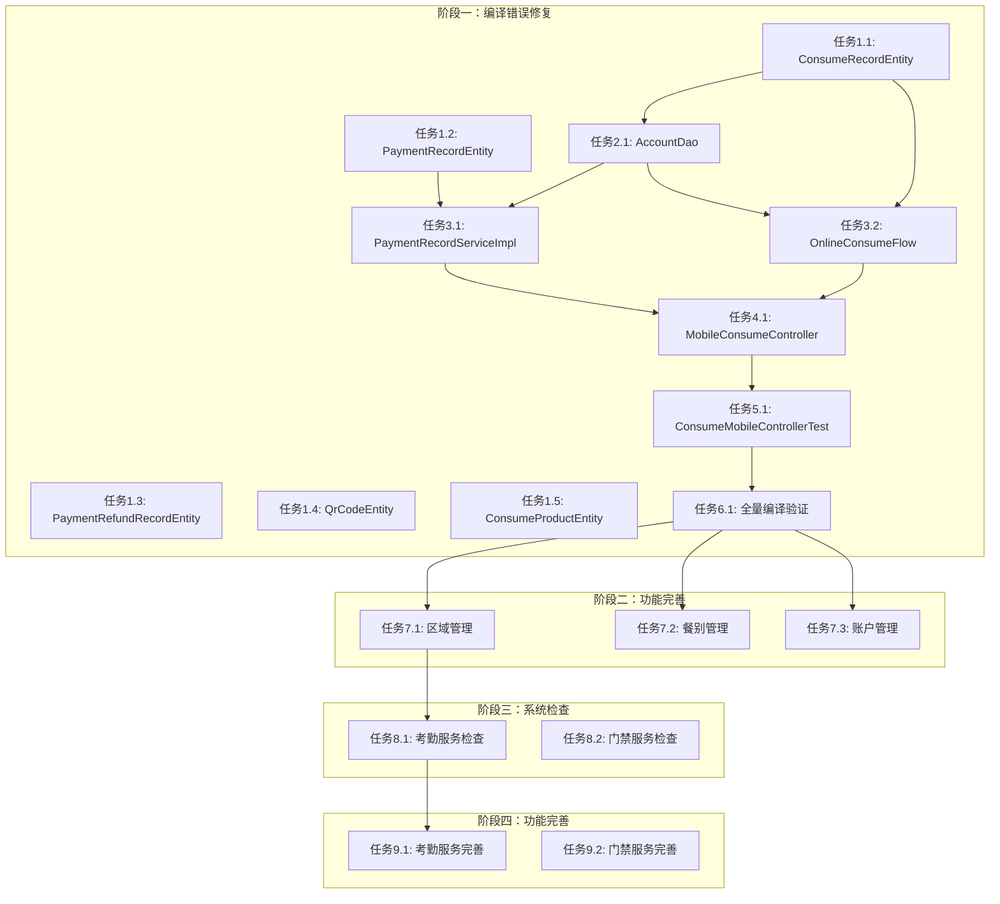

# 任务拆分文档 - IOE-DREAM全面企业级实施计划

> **创建日期**: 2025-01-30  
> **文档版本**: v1.0.0  
> **项目**: IOE-DREAM智慧园区一卡通管理平台  
> **工作流阶段**: 阶段3 - Atomize（原子化阶段）

---

## 📋 任务列表

### 阶段一：消费服务编译错误修复（P0 - 立即执行）

#### 任务1.1：ConsumeRecordEntity字段补全

**输入契约**：

- 前置依赖：无
- 输入数据：ConsumeRecordEntity.java文件
- 环境依赖：Java 17 + Maven

**输出契约**：

- 输出数据：完整的ConsumeRecordEntity实体类
- 交付物：
  - ConsumeRecordEntity.java（添加3个字段）
  - 数据库迁移脚本（如果需要）
- 验收标准：
  - `recordId`字段存在（兼容字段，@TableField(exist = false)）
  - `paymentStatus`字段存在（Integer类型，枚举值）
  - `paymentMethod`字段存在（Integer类型，枚举值）
  - 编译通过，无错误
  - 所有Getter/Setter方法存在

**实现约束**：

- 技术栈：Java 17 + MyBatis-Plus + Lombok
- 接口规范：遵循CLAUDE.md规范
- 质量要求：
  - 字段命名遵循驼峰命名
  - 添加完整的JavaDoc注释
  - 添加@Schema注解

**依赖关系**：

- 后置任务：任务1.2, 任务1.3, 任务1.4, 任务1.5（可以并行）
- 并行任务：无

---

#### 任务1.2：PaymentRecordEntity缺失方法补全

**输入契约**：

- 前置依赖：无
- 输入数据：PaymentRecordEntity.java文件
- 环境依赖：Java 17 + Maven

**输出契约**：

- 输出数据：完整的PaymentRecordEntity实体类
- 交付物：
  - PaymentRecordEntity.java（添加显式Getter方法）
- 验收标准：
  - `paymentFee`的显式Getter方法存在
  - `settlementAmount`的计算方法存在
  - 编译通过，无错误

**实现约束**：

- 技术栈：Java 17 + MyBatis-Plus + Lombok
- 接口规范：遵循CLAUDE.md规范
- 质量要求：方法逻辑正确，注释完整

**依赖关系**：

- 后置任务：任务3.1（PaymentRecordServiceImpl类型修复）
- 并行任务：任务1.1, 任务1.3, 任务1.4, 任务1.5

---

#### 任务1.3：PaymentRefundRecordEntity字段补全

**输入契约**：

- 前置依赖：无
- 输入数据：PaymentRefundRecordEntity.java文件
- 环境依赖：Java 17 + Maven

**输出契约**：

- 输出数据：完整的PaymentRefundRecordEntity实体类
- 交付物：
  - PaymentRefundRecordEntity.java（添加4个字段）
  - 数据库迁移脚本（如果需要）
- 验收标准：
  - `refundTransactionNo`字段存在
  - `applyTime`字段存在
  - `actualRefundAmount`字段存在
  - `refundType`字段存在
  - 编译通过，无错误

**实现约束**：

- 技术栈：Java 17 + MyBatis-Plus + Lombok
- 接口规范：遵循CLAUDE.md规范
- 质量要求：字段类型正确，注释完整

**依赖关系**：

- 后置任务：无
- 并行任务：任务1.1, 任务1.2, 任务1.4, 任务1.5

---

#### 任务1.4：QrCodeEntity完整重构

**输入契约**：

- 前置依赖：无
- 输入数据：QrCodeEntity.java文件
- 环境依赖：Java 17 + Maven

**输出契约**：

- 输出数据：完整的QrCodeEntity实体类
- 交付物：
  - QrCodeEntity.java（添加16个缺失字段）
  - 数据库迁移脚本（如果需要）
- 验收标准：
  - 16个缺失字段全部添加
  - 字段类型正确
  - 编译通过，无错误
  - 所有Getter/Setter方法存在

**实现约束**：

- 技术栈：Java 17 + MyBatis-Plus + Lombok
- 接口规范：遵循CLAUDE.md规范
- 质量要求：
  - 字段分组合理（业务字段、安全字段、关联字段等）
  - 注释完整
  - 符合业务模块文档设计

**依赖关系**：

- 后置任务：无
- 并行任务：任务1.1, 任务1.2, 任务1.3, 任务1.5

---

#### 任务1.5：ConsumeProductEntity字段补全

**输入契约**：

- 前置依赖：无
- 输入数据：ConsumeProductEntity.java文件
- 环境依赖：Java 17 + Maven

**输出契约**：

- 输出数据：完整的ConsumeProductEntity实体类
- 交付物：
  - ConsumeProductEntity.java（添加2个字段）
  - 数据库迁移脚本（如果需要）
- 验收标准：
  - `available`字段存在
  - `areaIds`字段存在（JSON格式）
  - 编译通过，无错误

**实现约束**：

- 技术栈：Java 17 + MyBatis-Plus + Lombok
- 接口规范：遵循CLAUDE.md规范
- 质量要求：字段类型正确，注释完整

**依赖关系**：

- 后置任务：无
- 并行任务：任务1.1, 任务1.2, 任务1.3, 任务1.4

---

#### 任务2.1：AccountDao方法补全

**输入契约**：

- 前置依赖：任务1.1（ConsumeRecordEntity补全）
- 输入数据：AccountDao.java文件
- 环境依赖：Java 17 + Maven + MyBatis-Plus

**输出契约**：

- 输出数据：完整的AccountDao接口
- 交付物：
  - AccountDao.java（添加deductBalance方法）
- 验收标准：
  - `deductBalance`方法存在
  - 方法参数正确（accountId, amount, version）
  - 使用乐观锁实现
  - 编译通过，无错误

**实现约束**：

- 技术栈：Java 17 + MyBatis-Plus
- 接口规范：
  - 使用@Update注解
  - 使用乐观锁（version字段）
  - 参数使用@Param注解
- 质量要求：
  - SQL语句正确
  - 注释完整
  - 事务处理正确

**依赖关系**：

- 后置任务：任务3.1, 任务3.2（Service层可能使用）
- 并行任务：无

---

#### 任务3.1：PaymentRecordServiceImpl类型修复

**输入契约**：

- 前置依赖：任务1.2（PaymentRecordEntity补全）
- 输入数据：PaymentRecordServiceImpl.java文件
- 环境依赖：Java 17 + Maven

**输出契约**：

- 输出数据：修复后的PaymentRecordServiceImpl类
- 交付物：
  - PaymentRecordServiceImpl.java（修复类型错误）
- 验收标准：
  - 第121行：userId类型修复（移除trim()调用或修正类型）
  - 第333行：transactionNo类型修复
  - 编译通过，无错误
  - 逻辑正确，无运行时错误

**实现约束**：

- 技术栈：Java 17 + Spring Boot
- 接口规范：遵循CLAUDE.md规范
- 质量要求：
  - 类型转换安全
  - 异常处理完善
  - 注释说明修复原因

**依赖关系**：

- 后置任务：任务4.1（Controller层可能依赖）
- 并行任务：任务3.2

---

#### 任务3.2：OnlineConsumeFlow类型修复

**输入契约**：

- 前置依赖：任务1.1（ConsumeRecordEntity补全）
- 输入数据：OnlineConsumeFlow.java文件
- 环境依赖：Java 17 + Maven

**输出契约**：

- 输出数据：修复后的OnlineConsumeFlow类
- 交付物：
  - OnlineConsumeFlow.java（修复类型错误）
- 验收标准：
  - 第89行：deviceId类型修复
  - 编译通过，无错误
  - 逻辑正确，无运行时错误

**实现约束**：

- 技术栈：Java 17 + Spring Boot
- 接口规范：遵循CLAUDE.md规范
- 质量要求：
  - 类型转换安全
  - 异常处理完善
  - 注释说明修复原因

**依赖关系**：

- 后置任务：任务4.1（Controller层可能依赖）
- 并行任务：任务3.1

---

#### 任务4.1：MobileConsumeController类型修复

**输入契约**：

- 前置依赖：任务3.1, 任务3.2（Service层修复完成）
- 输入数据：MobileConsumeController.java文件
- 环境依赖：Java 17 + Maven

**输出契约**：

- 输出数据：修复后的MobileConsumeController类
- 交付物：
  - MobileConsumeController.java（修复类型错误）
- 验收标准：
  - 第362-363行：三元表达式类型修复
  - 第428行：类型转换修复
  - 编译通过，无错误
  - 逻辑正确，无运行时错误

**实现约束**：

- 技术栈：Java 17 + Spring Boot
- 接口规范：遵循CLAUDE.md规范
- 质量要求：
  - 类型转换安全
  - 异常处理完善
  - 注释说明修复原因

**依赖关系**：

- 后置任务：任务5.1（测试类修复）
- 并行任务：无

---

#### 任务5.1：ConsumeMobileControllerTest导入修复

**输入契约**：

- 前置依赖：任务4.1（Controller层修复完成）
- 输入数据：ConsumeMobileControllerTest.java文件
- 环境依赖：Java 17 + Maven + JUnit

**输出契约**：

- 输出数据：修复后的测试类
- 交付物：
  - ConsumeMobileControllerTest.java（修复导入语句）
- 验收标准：
  - 所有导入语句正确
  - 编译通过，无错误
  - 测试可以运行（不一定全部通过，但可以编译）

**实现约束**：

- 技术栈：Java 17 + JUnit 5
- 接口规范：遵循CLAUDE.md规范
- 质量要求：导入路径正确，注释完整

**依赖关系**：

- 后置任务：任务6.1（全量编译验证）
- 并行任务：无

---

#### 任务6.1：全量编译验证

**输入契约**：

- 前置依赖：所有阶段一任务完成
- 输入数据：整个consume-service项目
- 环境依赖：Java 17 + Maven

**输出契约**：

- 输出数据：编译结果报告
- 交付物：
  - 编译错误报告（如果有）
  - 修复后的代码
- 验收标准：
  - 0个编译错误
  - 0个编译警告（P0级别）
  - Maven编译100%通过

**实现约束**：

- 技术栈：Java 17 + Maven
- 接口规范：遵循CLAUDE.md规范
- 质量要求：
  - 所有代码符合规范
  - 所有测试可以编译

**依赖关系**：

- 后置任务：阶段二（消费服务功能完善）
- 并行任务：无

---

### 阶段二：消费服务功能完善（P0 - 立即执行）

#### 任务7.1：区域管理模块完善

**输入契约**：

- 前置依赖：阶段一完成（编译通过）
- 输入数据：区域管理相关文档和现有代码
- 环境依赖：Java 17 + Maven + MySQL

**输出契约**：

- 输出数据：完整的区域管理功能
- 交付物：
  - ConsumeAreaController.java（完善）
  - ConsumeAreaService.java（完善）
  - ConsumeAreaManager.java（完善）
  - ConsumeAreaDao.java（完善）
  - ConsumeAreaEntity.java（完善）
  - 单元测试
  - API文档
- 验收标准：
  - 完整的CRUD功能
  - 区域设备绑定功能
  - 区域权限管理功能
  - 测试覆盖率≥80%
  - API文档完整

**实现约束**：

- 技术栈：Java 17 + Spring Boot + MyBatis-Plus
- 接口规范：遵循CLAUDE.md和业务模块文档
- 质量要求：
  - 四层架构严格遵循
  - 完整的异常处理
  - 完整的日志记录

**依赖关系**：

- 后置任务：无（可以并行）
- 并行任务：任务7.2-7.9

---

#### 任务7.2-7.9：其他功能模块完善

（类似任务7.1的结构，包括：餐别管理、账户管理、消费处理、充值退款、补贴管理、离线消费、商品管理、报表统计）

---

### 阶段三：其他服务系统检查（P1 - 快速执行）

#### 任务8.1：考勤服务系统检查

**输入契约**：

- 前置依赖：阶段二完成（可选）
- 输入数据：attendance-service项目代码
- 环境依赖：Java 17 + Maven

**输出契约**：

- 输出数据：检查报告
- 交付物：
  - 编译错误报告
  - 代码规范检查报告
  - 架构合规性检查报告
  - 功能完整性检查报告
- 验收标准：
  - 检查报告完整
  - 问题清单清晰
  - 优先级明确

**实现约束**：

- 技术栈：代码扫描工具 + 人工检查
- 接口规范：遵循CLAUDE.md规范
- 质量要求：检查全面，不遗漏问题

**依赖关系**：

- 后置任务：任务9.1（考勤服务功能完善）
- 并行任务：任务8.2-8.4

---

#### 任务8.2-8.4：其他服务系统检查

（门禁服务、访客服务、视频服务、OA服务）

---

### 阶段四：其他服务功能完善（P1 - 快速执行）

#### 任务9.1-9.4：基于检查结果进行修复和完善

（考勤服务、门禁服务、访客服务等）

---

## 📊 任务依赖关系图

---

## ✅ 任务验收标准汇总

### 阶段一验收标准

- [ ] 所有实体类字段完整
- [ ] 所有DAO方法存在
- [ ] 所有Service方法类型匹配
- [ ] 所有Controller无类型错误
- [ ] 所有测试类导入正确
- [ ] Maven编译100%通过
- [ ] 0个编译错误
- [ ] 0个编译警告（P0级别）

### 阶段二验收标准

- [ ] 所有功能模块完整实现
- [ ] 测试覆盖率≥80%
- [ ] API文档完整
- [ ] 代码规范100%符合

### 阶段三验收标准

- [ ] 所有服务检查完成
- [ ] 检查报告完整
- [ ] 问题清单清晰

### 阶段四验收标准

- [ ] 所有服务编译通过
- [ ] 所有服务功能完善
- [ ] 整体验收通过

---

**📝 文档维护**: IOE-DREAM架构团队 | 2025-01-30  
**版本**: v1.0.0 - 任务拆分版本  
**状态**: ✅ 任务拆分完成，可以进入下一阶段
