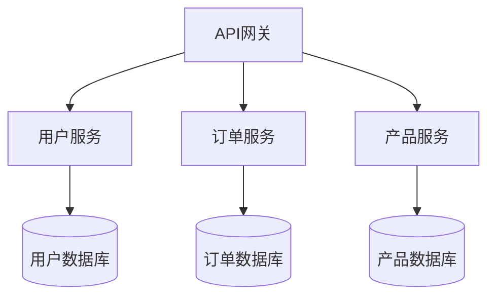
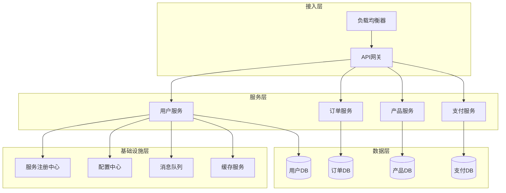
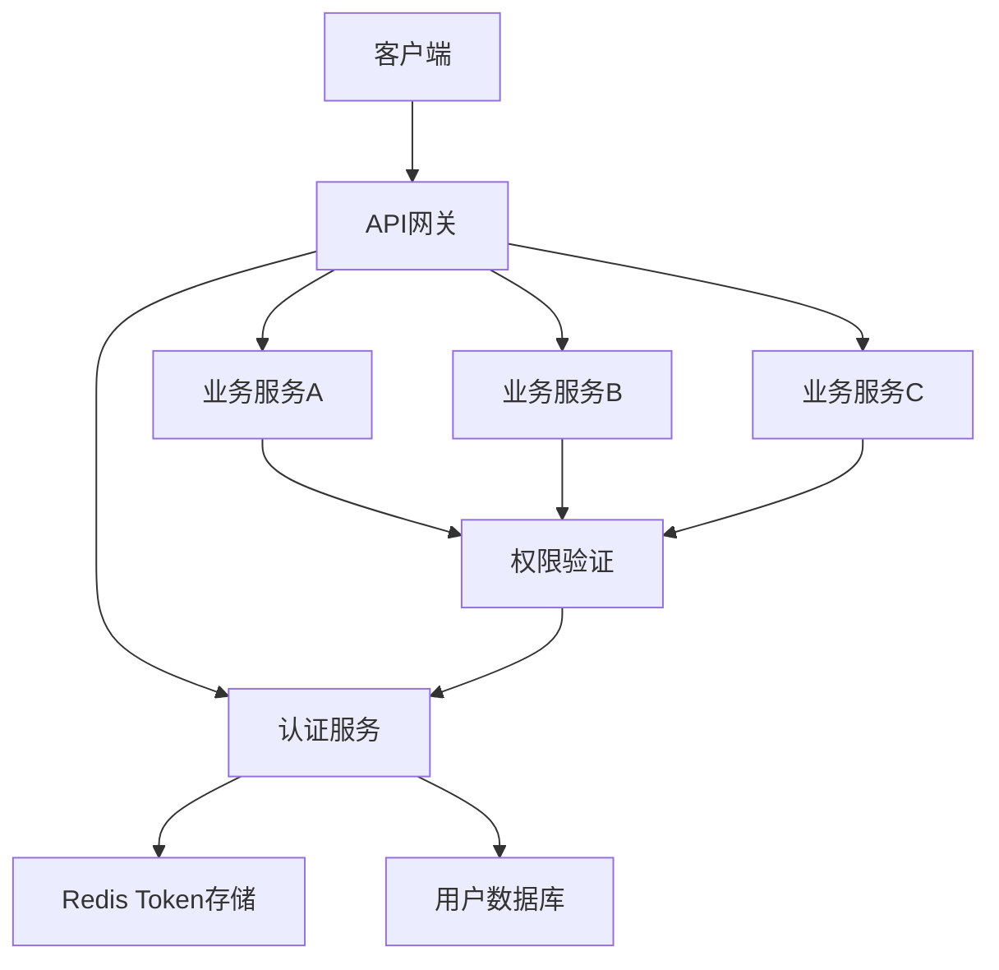
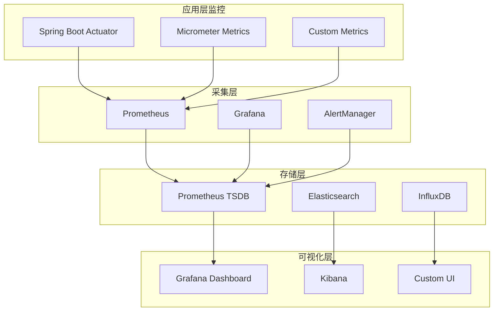

# IOE-DREAM 微服务架构设计标准

> **版本**: v1.0.0
> **发布日期**: 2025-11-30
> **适用范围**: IOE-DREAM智能管理系统所有微服务架构设计
> **目标**: 建立企业级微服务架构标准，确保高可用、高并发、可扩展性

---

## 📖 目录

1. [架构原则](#架构原则)
2. [服务拆分规范](#服务拆分规范)
3. [技术架构规范](#技术架构规范)
4. [数据架构规范](#数据架构规范)
5. [安全架构规范](#安全架构规范)
6. [性能架构规范](#性能架构规范)
7. [监控架构规范](#监控架构规范)
8. [部署架构规范](#部署架构规范)

---

## 🎯 架构原则

### 1.1 核心设计原则

#### 1.1.1 高内聚低耦合
- **高内聚**: 单个微服务内部功能高度相关，单一业务职责
- **低耦合**: 服务之间通过标准化接口通信，避免直接依赖
- **边界清晰**: 明确定义服务边界，避免职责重叠

#### 1.1.2 单一数据源


#### 1.1.3 自治性
- **技术自治**: 每个服务可以选择最适合的技术栈
- **数据自治**: 每个服务拥有独立的数据库
- **部署自治**: 每个服务可以独立部署和扩展

#### 1.1.4 容错设计
- **故障隔离**: 单个服务故障不影响其他服务
- **优雅降级**: 核心服务故障时提供基础功能
- **熔断机制**: 防止级联故障

### 1.2 架构分层



---

## 🔧 服务拆分规范

### 2.1 服务拆分原则

#### 2.1.1 业务领域驱动
- 按业务能力拆分：用户、订单、产品、支付等
- 按数据模型拆分：每个服务拥有独立的数据模型
- 按团队结构拆分：Conway定律指导，沟通成本与团队数量成正比

#### 2.1.2 服务粒度控制
```yaml
# 推荐的服务粒度
小服务: 5-15个API端点，1-3个核心业务实体
中服务: 15-30个API端点，3-8个核心业务实体
大服务: 30-50个API端点，8-15个核心业务实体

# 避免的服务
- 微服务癌：过度拆分，服务间频繁调用
- 单体巨石：服务过于庞大，违背微服务初衷
```

#### 2.1.3 服务边界识别
```java
// 用户服务边界示例
@Service
public class UserService {
    // ✅ 包含的功能
    - 用户注册/登录/注销
    - 用户信息管理
    - 用户权限验证
    - 用户状态管理

    // ❌ 不包含的功能
    - 订单创建 (属于订单服务)
    - 产品管理 (属于产品服务)
    - 支付处理 (属于支付服务)
}
```

### 2.2 服务通信模式

#### 2.2.1 同步通信
```java
// REST API调用
@RestController
public class OrderController {

    @Autowired
    private UserServiceClient userServiceClient;

    @PostMapping("/orders")
    public ApiResponse<OrderVO> createOrder(@Valid @RequestBody OrderCreateDTO dto) {
        // 同步调用用户服务验证用户
        UserVO user = userServiceClient.getUserById(dto.getUserId());
        if (user == null) {
            throw new BusinessErrorException(ErrorCode.USER_NOT_FOUND);
        }

        // 创建订单逻辑
        return orderService.createOrder(dto);
    }
}
```

#### 2.2.2 异步通信
```java
// 事件驱动架构
@Service
public class OrderServiceImpl implements OrderService {

    @Autowired
    private RabbitTemplate rabbitTemplate;

    @Transactional
    public OrderVO createOrder(OrderCreateDTO dto) {
        // 创建订单
        OrderEntity order = buildOrder(dto);
        orderMapper.insert(order);

        // 发布订单创建事件
        OrderCreatedEvent event = OrderCreatedEvent.builder()
                .orderId(order.getId())
                .userId(order.getUserId())
                .amount(order.getAmount())
                .build();

        rabbitTemplate.convertAndSend("order.exchange", "order.created", event);

        return convertToVO(order);
    }
}

// 事件监听
@RabbitListener(queues = "notification.queue")
public void handleOrderCreatedEvent(OrderCreatedEvent event) {
    // 发送订单创建通知
    notificationService.sendOrderNotification(event);
}
```

#### 2.2.3 服务间调用最佳实践
```java
@Component
public class UserServiceClient {

    private final UserServiceFeignClient feignClient;
    private final CircuitBreaker circuitBreaker;

    public UserServiceClient(UserServiceFeignClient feignClient) {
        this.feignClient = feignClient;
        this.circuitBreaker = CircuitBreaker.ofDefaults("userService");
    }

    /**
     * 获取用户信息（带熔断保护）
     */
    public Optional<UserVO> getUserById(Long userId) {
        return circuitBreaker.executeSupplier(() -> {
            try {
                ApiResponse<UserVO> response = feignClient.getUserById(userId);
                return Optional.ofNullable(response.getData());
            } catch (Exception e) {
                log.warn("调用用户服务失败: userId={}, error={}", userId, e.getMessage());
                return Optional.empty();
            }
        });
    }

    /**
     * 批量获取用户信息（降级处理）
     */
    public Map<Long, UserVO> getUsersByIds(List<Long> userIds) {
        Map<Long, UserVO> result = new HashMap<>();

        try {
            // 分批调用，避免单次请求过大
            Lists.partition(userIds, 100).forEach(batch -> {
                ApiResponse<List<UserVO>> response = feignClient.getUsersByIds(batch);
                if (response.getData() != null) {
                    response.getData().forEach(user -> result.put(user.getId(), user));
                }
            });
        } catch (Exception e) {
            log.error("批量获取用户信息失败", e);
            // 返回空结果，让调用方决定如何处理
        }

        return result;
    }
}
```

---

## 🏗️ 技术架构规范

### 3.1 技术栈标准

#### 3.1.1 核心框架
```yaml
开发框架:
  - Spring Boot: 3.5.7
  - Spring Cloud: 2023.0.3
  - Spring Cloud Alibaba: 2022.0.0.0

服务治理:
  - 服务注册: Nacos Discovery
  - 配置管理: Nacos Config
  - 服务网关: Spring Cloud Gateway
  - 负载均衡: LoadBalancer
  - 熔断器: Sentinel
  - 限流: Sentinel

数据访问:
  - ORM框架: MyBatis Plus 3.5.7
  - 数据库: MySQL 8.0.33
  - 连接池: Druid 1.2.21
  - 缓存: Redis 7.2+
  - 搜索: Elasticsearch 8.12+

消息队列:
  - 消息中间件: RabbitMQ 3.12+
  - 消息流: Apache Kafka 3.6+

监控运维:
  - 监控: Micrometer + Prometheus
  - 链路追踪: Spring Cloud Sleuth
  - 日志: Logback + ELK Stack
  - 健康检查: Spring Boot Actuator
```

#### 3.1.2 服务模板结构
```
ioedream-{service-name}/
├── src/main/java/net/lab1024/sa/{service}/
│   ├── {ServiceName}Application.java          # 启动类
│   ├── config/                                # 配置类
│   │   ├── WebConfig.java                     # Web配置
│   │   ├── SecurityConfig.java               # 安全配置
│   │   └── RedisConfig.java                   # Redis配置
│   ├── controller/                            # 控制器层
│   │   ├── {ServiceName}Controller.java
│   │   └── admin/                             # 管理接口
│   ├── service/                               # 服务层
│   │   ├── {ServiceName}Service.java
│   │   └── impl/
│   │       └── {ServiceName}ServiceImpl.java
│   ├── manager/                               # 领域服务层
│   │   └── {DomainName}Manager.java
│   ├── dao/                                   # 数据访问层
│   │   ├── {EntityName}Mapper.java
│   │   └── {EntityName}Mapper.xml
│   ├── domain/                                # 领域模型
│   │   ├── entity/                           # 实体类
│   │   ├── vo/                               # 视图对象
│   │   ├── dto/                              # 数据传输对象
│   │   └── query/                            # 查询对象
│   └── common/                                # 公共类
│       ├── constant/                         # 常量定义
│       ├── enums/                            # 枚举类
│       ├── exception/                        # 异常类
│       └── util/                             # 工具类
├── src/main/resources/
│   ├── application.yml                         # 配置文件
│   ├── application-dev.yml                    # 开发环境配置
│   ├── application-test.yml                   # 测试环境配置
│   ├── application-prod.yml                   # 生产环境配置
│   ├── mapper/                               # MyBatis映射文件
│   └── static/                               # 静态资源
└── src/test/                                 # 测试代码
    └── java/net/lab1024/sa/{service}/test/
```

### 3.2 服务配置规范

#### 3.2.1 标准配置结构
```yaml
# application.yml
server:
  port: ${SERVER_PORT:8080}
  servlet:
    context-path: /api
  tomcat:
    max-threads: 200
    min-spare-threads: 10
    connection-timeout: 20000

spring:
  application:
    name: ${SERVICE_NAME}
  profiles:
    active: ${SPRING_PROFILES_ACTIVE:dev}

  # 数据源配置
  datasource:
    type: com.alibaba.druid.pool.DruidDataSource
    driver-class-name: com.mysql.cj.jdbc.Driver
    url: jdbc:mysql://${DB_HOST:localhost}:${DB_PORT:3306}/${DB_NAME:ioedream}?useUnicode=true&characterEncoding=utf8&serverTimezone=Asia/Shanghai&useSSL=false
    username: ${DB_USERNAME:root}
    password: ${DB_PASSWORD:123456}
    druid:
      initial-size: 5
      min-idle: 5
      max-active: 20
      max-wait: 60000
      time-between-eviction-runs-millis: 60000
      min-evictable-idle-time-millis: 300000
      validation-query: SELECT 1
      test-while-idle: true
      test-on-borrow: false
      test-on-return: false

  # Redis配置
  data:
    redis:
      host: ${REDIS_HOST:localhost}
      port: ${REDIS_PORT:6379}
      password: ${REDIS_PASSWORD:}
      database: ${REDIS_DATABASE:0}
      timeout: 3000ms
      lettuce:
        pool:
          max-active: 20
          max-idle: 10
          min-idle: 5
          max-wait: 3000ms

  # 消息队列配置
  rabbitmq:
    host: ${RABBITMQ_HOST:localhost}
    port: ${RABBITMQ_PORT:5672}
    username: ${RABBITMQ_USERNAME:guest}
    password: ${RABBITMQ_PASSWORD:guest}
    virtual-host: ${RABBITMQ_VHOST:/}
    connection-timeout: 15000
    publisher-confirms: true
    publisher-returns: true
    template:
      retry:
        enabled: true
        initial-interval: 1000
        max-attempts: 3
        max-interval: 10000
        multiplier: 1.0

# MyBatis Plus配置
mybatis-plus:
  configuration:
    map-underscore-to-camel-case: true
    cache-enabled: false
    log-impl: org.apache.ibatis.logging.slf4j.Slf4jImpl
  global-config:
    db-config:
      id-type: auto
      logic-delete-field: deletedFlag
      logic-delete-value: 1
      logic-not-delete-value: 0
      version-field: version
  mapper-locations: classpath*:/mapper/**/*.xml

# Actuator监控配置
management:
  endpoints:
    web:
      exposure:
        include: health,info,metrics,prometheus
  endpoint:
    health:
      show-details: always
      show-components: always
  metrics:
    export:
      prometheus:
        enabled: true

# 日志配置
logging:
  level:
    root: INFO
    net.lab1024.sa: DEBUG
    org.springframework.web: DEBUG
  pattern:
    console: "%d{yyyy-MM-dd HH:mm:ss.SSS} [%thread] %-5level [%logger{36}] - %msg%n"
```

#### 3.2.2 环境特定配置
```yaml
# application-dev.yml
spring:
  cloud:
    nacos:
      discovery:
        server-addr: ${NACOS_SERVER_ADDR:127.0.0.1:8848}
        namespace: ${NACOS_NAMESPACE:dev}
        group: ${NACOS_GROUP:DEFAULT_GROUP}
      config:
        server-addr: ${NACOS_SERVER_ADDR:127.0.0.1:8848}
        namespace: ${NACOS_NAMESPACE:dev}
        group: ${NACOS_GROUP:DEFAULT_GROUP}
        file-extension: yaml
        shared-configs:
          - data-id: common-config.yml
            group: DEFAULT_GROUP
            refresh: true

# application-prod.yml
spring:
  cloud:
    nacos:
      discovery:
        server-addr: ${NACOS_SERVER_ADDR:nacos.ioedream.com:8848}
        namespace: ${NACOS_NAMESPACE:prod}
        group: ${NACOS_GROUP:PROD_GROUP}
      config:
        server-addr: ${NACOS_SERVER_ADDR:nacos.ioedream.com:8848}
        namespace: ${NACOS_NAMESPACE:prod}
        group: ${NACOS_GROUP:PROD_GROUP}
        file-extension: yaml

logging:
  level:
    root: WARN
    net.lab1024.sa: INFO
  file:
    name: logs/${spring.application.name}.log
    max-size: 100MB
    max-history: 30
```

---

## 🗄️ 数据架构规范

### 4.1 数据存储设计

#### 4.1.1 数据库设计原则
```sql
-- 1. 每个微服务独立的数据库
-- 2. 表命名规范：业务模块_具体功能
-- 3. 字段命名规范：使用下划线分隔
-- 4. 必须包含审计字段
-- 5. 使用逻辑删除而非物理删除
-- 6. 使用乐观锁处理并发更新

-- 示例：用户服务数据库表结构
CREATE TABLE `user_info` (
  `id` BIGINT PRIMARY KEY AUTO_INCREMENT COMMENT '主键ID',
  `user_name` VARCHAR(50) NOT NULL COMMENT '用户名',
  `email` VARCHAR(100) NOT NULL COMMENT '邮箱',
  `phone` VARCHAR(20) COMMENT '手机号',
  `password` VARCHAR(255) NOT NULL COMMENT '密码（加密存储）',
  `status` TINYINT DEFAULT 1 COMMENT '状态（0：禁用，1：启用）',
  `user_type` TINYINT DEFAULT 1 COMMENT '用户类型（1：普通用户，2：企业用户）',
  `last_login_time` DATETIME COMMENT '最后登录时间',
  `login_count` INT DEFAULT 0 COMMENT '登录次数',

  -- 审计字段
  `create_user_id` BIGINT COMMENT '创建人ID',
  `create_time` DATETIME DEFAULT CURRENT_TIMESTAMP COMMENT '创建时间',
  `update_user_id` BIGINT COMMENT '更新人ID',
  `update_time` DATETIME DEFAULT CURRENT_TIMESTAMP ON UPDATE CURRENT_TIMESTAMP COMMENT '更新时间',
  `deleted_flag` TINYINT DEFAULT 0 COMMENT '删除标志（0：未删除，1：已删除）',
  `version` INT DEFAULT 1 COMMENT '版本号（乐观锁）',

  UNIQUE KEY `uk_user_name` (`user_name`),
  UNIQUE KEY `uk_email` (`email`),
  KEY `idx_phone` (`phone`),
  KEY `idx_status` (`status`),
  KEY `idx_create_time` (`create_time`)
) ENGINE=InnoDB DEFAULT CHARSET=utf8mb4 COLLATE=utf8mb4_unicode_ci COMMENT='用户信息表';
```

#### 4.1.2 数据分片策略
```yaml
# 水平分片配置
spring:
  shardingsphere:
    datasource:
      names: ds0,ds1
      ds0:
        type: com.zaxxer.hikari.HikariDataSource
        driver-class-name: com.mysql.cj.jdbc.Driver
        jdbc-url: jdbc:mysql://localhost:3306/user_db_0
        username: root
        password: 123456
      ds1:
        type: com.zaxxer.hikari.HikariDataSource
        driver-class-name: com.mysql.cj.jdbc.Driver
        jdbc-url: jdbc:mysql://localhost:3306/user_db_1
        username: root
        password: 123456

    sharding:
      tables:
        user_info:
          actual-data-nodes: ds$->{0..1}.user_info_$->{0..3}
          table-strategy:
            inline:
              sharding-column: id
              algorithm-expression: user_info_$->{id % 4}
          database-strategy:
            inline:
              sharding-column: user_type
              algorithm-expression: ds$->{user_type % 2}
```

#### 4.1.3 缓存架构设计
```java
@Component
public class UserCacheManager {

    private final RedisTemplate<String, Object> redisTemplate;
    private final LoadingCache<Long, UserVO> localCache;

    public UserCacheManager(RedisTemplate<String, Object> redisTemplate) {
        this.redisTemplate = redisTemplate;

        // 本地缓存配置
        this.localCache = Caffeine.newBuilder()
                .maximumSize(1000)
                .expireAfterWrite(5, TimeUnit.MINUTES)
                .refreshAfterWrite(3, TimeUnit.MINUTES)
                .build(this::loadUserFromDatabase);
    }

    /**
     * 多级缓存获取用户
     */
    public UserVO getUser(Long userId) {
        // 1. 先查本地缓存
        UserVO user = localCache.getIfPresent(userId);
        if (user != null) {
            return user;
        }

        // 2. 查Redis缓存
        String cacheKey = "user:info:" + userId;
        user = (UserVO) redisTemplate.opsForValue().get(cacheKey);
        if (user != null) {
            localCache.put(userId, user);
            return user;
        }

        // 3. 查数据库并回填缓存
        return localCache.get(userId);
    }

    /**
     * 更新用户（多级缓存失效）
     */
    public void updateUser(UserVO user) {
        // 更新数据库
        // TODO: 调用service更新数据库

        // 失效本地缓存
        localCache.invalidate(user.getId());

        // 失效Redis缓存
        String cacheKey = "user:info:" + user.getId();
        redisTemplate.delete(cacheKey);

        // 预热缓存
        localCache.refresh(user.getId());
    }

    private UserVO loadUserFromDatabase(Long userId) {
        // TODO: 从数据库加载用户
        return null;
    }
}
```

### 4.2 数据一致性保证

#### 4.2.1 分布式事务方案
```java
@Service
@Transactional
public class OrderServiceImpl implements OrderService {

    @Autowired
    private UserClient userClient;

    @Autowired
    private ProductClient productClient;

    @Autowired
    private PaymentClient paymentClient;

    /**
     * 订单创建（TCC分布式事务）
     */
    @GlobalTransactional(rollbackFor = Exception.class)
    public OrderVO createOrder(OrderCreateDTO dto) {
        // 1. Try阶段 - 预扣库存
        boolean inventoryReserved = productClient.reserveInventory(
                dto.getProductId(), dto.getQuantity());
        if (!inventoryReserved) {
            throw new BusinessErrorException(ErrorCode.INVENTORY_INSUFFICIENT);
        }

        // 2. Try阶段 - 冻结用户资金
        boolean fundFrozen = userClient.freezeFund(
                dto.getUserId(), dto.getTotalAmount());
        if (!fundFrozen) {
            // 取消库存预留
            productClient.cancelInventoryReservation(
                    dto.getProductId(), dto.getQuantity());
            throw new BusinessErrorException(ErrorCode.FUND_INSUFFICIENT);
        }

        try {
            // 3. Confirm阶段 - 创建订单
            OrderEntity order = buildOrder(dto);
            orderMapper.insert(order);

            // 4. Confirm阶段 - 确认库存扣减
            productClient.confirmInventoryDeduction(
                    dto.getProductId(), dto.getQuantity());

            // 5. Confirm阶段 - 确认资金扣减
            userClient.confirmFundDeduction(
                    dto.getUserId(), dto.getTotalAmount());

            return convertToVO(order);

        } catch (Exception e) {
            // 6. Cancel阶段 - 回滚所有操作
            userClient.cancelFundFreeze(dto.getUserId(), dto.getTotalAmount());
            productClient.cancelInventoryReservation(
                    dto.getProductId(), dto.getQuantity());
            throw e;
        }
    }
}
```

#### 4.2.2 事件驱动一致性
```java
@Component
public class OrderEventHandler {

    @Autowired
    private UserService userService;

    @Autowired
    private NotificationService notificationService;

    /**
     * 处理订单创建事件（最终一致性）
     */
    @EventListener
    @Async
    public void handleOrderCreated(OrderCreatedEvent event) {
        try {
            // 1. 更新用户订单统计
            userService.incrementUserOrderCount(event.getUserId());

            // 2. 发送订单创建通知
            UserVO user = userService.getUserById(event.getUserId());
            if (user != null) {
                notificationService.sendOrderNotification(user, event);
            }

        } catch (Exception e) {
            log.error("处理订单创建事件失败: orderId={}", event.getOrderId(), e);
            // 记录到重试队列，后续重试
            retryService.submitRetry("order-created", event);
        }
    }

    /**
     * 处理订单支付事件
     */
    @EventListener
    @Async
    public void handleOrderPaid(OrderPaidEvent event) {
        try {
            // 1. 更新用户消费统计
            userService.updateUserConsumption(
                    event.getUserId(), event.getAmount());

            // 2. 触发积分奖励
            pointService.addUserPoint(
                    event.getUserId(), calculateRewardPoints(event.getAmount()));

            // 3. 发送支付成功通知
            notificationService.sendPaymentSuccessNotification(event);

        } catch (Exception e) {
            log.error("处理订单支付事件失败: orderId={}", event.getOrderId(), e);
            retryService.submitRetry("order-paid", event);
        }
    }
}
```

---

## 🛡️ 安全架构规范

### 5.1 认证授权架构

#### 5.1.1 统一认证中心


#### 5.1.2 Sa-Token认证配置
```java
@Configuration
@EnableConfigurationProperties(SaTokenProperties.class)
public class SaTokenConfiguration {

    /**
     * Sa-Token权限认证配置
     */
    @Bean
    public SaTokenConfig getSaTokenConfig() {
        SaTokenConfig config = new SaTokenConfig();

        // Token配置
        config.setTokenName("Authorization");
        config.setTokenTimeout(24 * 60 * 60); // 24小时
        config.setActiveTimeout(-1); // 不自动冻结
        config.setIsConcurrent(false); // 不允许并发登录
        config.setIsShare(false); // 不共享Token
        config.setTokenStyle("uuid"); // Token风格

        // Cookie配置
        config.setCookieDomain("ioedream.com");
        config.setCookiePath("/");
        config.setCookieSecure(true);
        config.setCookieHttpOnly(true);

        return config;
    }

    /**
     * 拦截器配置
     */
    @Bean
    public SaInterceptor getSaInterceptor() {
        return new SaInterceptor(handle -> {
            // 登录验证
            SaRouter.match("/**")
                    .notMatch("/api/v1/auth/**")
                    .notMatch("/actuator/health")
                    .check(r -> StpUtil.checkLogin());

            // 权限验证
            SaRouter.match("/api/v1/admin/**")
                    .check(r -> StpUtil.checkRole("admin"));

            // 动态权限验证
            SaRouter.match("/api/v1/users/**")
                    .check(r -> StpUtil.checkPermission("user:manage"));

            // 接口限流
            SaRouter.match("/api/v1/sensitive/**")
                    .check(r -> StpUtil.checkRateLimit("sensitive-api", 10, 60));
        });
    }

    /**
     * 注解鉴权配置
     */
    @Bean
    public SaAnnotationInterceptor getSaAnnotationInterceptor() {
        return new SaAnnotationInterceptor();
    }
}
```

#### 5.1.3 权限控制模型
```java
/**
 * RBAC权限模型
 */
@Data
@Entity
@Table(name = "rbac_permission")
@ApiModel(description = "权限实体")
public class PermissionEntity extends BaseEntity {

    /**
     * 权限编码
     */
    @ApiModelProperty(value = "权限编码")
    @TableField("permission_code")
    private String permissionCode;

    /**
     * 权限名称
     */
    @ApiModelProperty(value = "权限名称")
    @TableField("permission_name")
    private String permissionName;

    /**
     * 权限类型（1：菜单，2：按钮，3：接口）
     */
    @ApiModelProperty(value = "权限类型")
    @TableField("permission_type")
    private Integer permissionType;

    /**
     * 资源路径
     */
    @ApiModelProperty(value = "资源路径")
    @TableField("resource_path")
    private String resourcePath;

    /**
     * 请求方法
     */
    @ApiModelProperty(value = "请求方法")
    @TableField("request_method")
    private String requestMethod;

    /**
     * 父权限ID
     */
    @ApiModelProperty(value = "父权限ID")
    @TableField("parent_id")
    private Long parentId;

    /**
     * 排序
     */
    @ApiModelProperty(value = "排序")
    @TableField("sort_order")
    private Integer sortOrder;
}

/**
 * 权限验证切面
 */
@Aspect
@Component
@Slf4j
public class PermissionAspect {

    @Autowired
    private PermissionService permissionService;

    /**
     * 权限验证切面
     */
    @Around("@annotation(requirePermission)")
    public Object checkPermission(ProceedingJoinPoint joinPoint, RequirePermission requirePermission) throws Throwable {
        // 获取当前用户
        Long userId = StpUtil.getLoginIdAsLong();

        // 获取权限编码
        String permissionCode = requirePermission.value();

        // 验证权限
        boolean hasPermission = permissionService.checkUserPermission(userId, permissionCode);
        if (!hasPermission) {
            log.warn("用户无权限访问，userId={}, permissionCode={}", userId, permissionCode);
            throw new PermissionDeniedException("权限不足");
        }

        log.info("权限验证通过，userId={}, permissionCode={}", userId, permissionCode);
        return joinPoint.proceed();
    }
}
```

### 5.2 数据安全架构

#### 5.2.1 数据加密策略
```java
@Component
public class DataEncryptionService {

    private final AESUtil aesUtil;
    private final RSAUtil rsaUtil;

    /**
     * 敏感字段加密
     */
    public String encryptSensitiveData(String data) {
        if (StringUtils.isEmpty(data)) {
            return data;
        }

        // 根据数据类型选择加密算法
        if (isHighlySensitive(data)) {
            return rsaUtil.encrypt(data); // 高敏感数据使用RSA加密
        } else {
            return aesUtil.encrypt(data);  // 一般敏感数据使用AES加密
        }
    }

    /**
     * 敏感字段解密
     */
    public String decryptSensitiveData(String encryptedData) {
        if (StringUtils.isEmpty(encryptedData)) {
            return encryptedData;
        }

        try {
            // 尝试AES解密
            return aesUtil.decrypt(encryptedData);
        } catch (Exception e) {
            // AES解密失败，尝试RSA解密
            return rsaUtil.decrypt(encryptedData);
        }
    }
}

/**
 * 数据脱敏处理器
 */
@Component
public class DataMaskingProcessor {

    /**
     * 邮箱脱敏
     */
    public String maskEmail(String email) {
        if (StringUtils.isEmpty(email)) {
            return email;
        }
        int atIndex = email.indexOf("@");
        if (atIndex <= 1) {
            return email;
        }
        String username = email.substring(0, atIndex);
        String domain = email.substring(atIndex);

        if (username.length() <= 2) {
            return username.charAt(0) + "***" + domain;
        }

        return username.charAt(0) + "***" + username.charAt(username.length() - 1) + domain;
    }

    /**
     * 手机号脱敏
     */
    public String maskPhone(String phone) {
        if (StringUtils.isEmpty(phone) || phone.length() < 7) {
            return phone;
        }
        return phone.substring(0, 3) + "****" + phone.substring(7);
    }

    /**
     * 身份证脱敏
     */
    public String maskIdCard(String idCard) {
        if (StringUtils.isEmpty(idCard) || idCard.length() < 8) {
            return idCard;
        }
        return idCard.substring(0, 4) + "**********" + idCard.substring(idCard.length() - 4);
    }
}
```

#### 5.2.2 接口安全防护
```java
@Component
public class ApiSecurityFilter implements Filter {

    @Autowired
    private RateLimiter rateLimiter;

    @Override
    public void doFilter(ServletRequest request, ServletResponse response, FilterChain chain)
            throws IOException, ServletException {

        HttpServletRequest httpRequest = (HttpServletRequest) request;
        HttpServletResponse httpResponse = (HttpServletResponse) response;

        // 1. IP白名单检查
        if (!isAllowedIp(httpRequest.getRemoteAddr())) {
            sendErrorResponse(httpResponse, 403, "IP地址不在白名单中");
            return;
        }

        // 2. 请求频率限制
        String clientId = getClientId(httpRequest);
        if (!rateLimiter.tryAcquire(clientId)) {
            sendErrorResponse(httpResponse, 429, "请求过于频繁，请稍后重试");
            return;
        }

        // 3. 请求参数校验
        if (!validateRequest(httpRequest)) {
            sendErrorResponse(httpResponse, 400, "请求参数不合法");
            return;
        }

        // 4. 防止SQL注入
        if (containsSqlInjection(httpRequest)) {
            sendErrorResponse(httpResponse, 400, "请求包含非法字符");
            return;
        }

        chain.doFilter(request, response);
    }

    private boolean isAllowedIp(String ip) {
        // 实现IP白名单检查逻辑
        Set<String> allowedIps = getWhiteListIps();
        return allowedIps.contains(ip) || isPrivateIp(ip);
    }

    private boolean validateRequest(HttpServletRequest request) {
        // 检查必要的Header
        String userAgent = request.getHeader("User-Agent");
        if (StringUtils.isEmpty(userAgent)) {
            return false;
        }

        // 检查请求大小
        int contentLength = request.getContentLength();
        if (contentLength > 10 * 1024 * 1024) { // 10MB限制
            return false;
        }

        return true;
    }

    private boolean containsSqlInjection(HttpServletRequest request) {
        String[] sqlPatterns = {
            "('|(\\-\\-)|(/\\*\\*))",
            "(\\b(SELECT|INSERT|UPDATE|DELETE|DROP|CREATE|ALTER|EXEC|UNION|SCRIPT)\\b)"
        };

        Enumeration<String> parameterNames = request.getParameterNames();
        while (parameterNames.hasMoreElements()) {
            String paramName = parameterNames.nextElement();
            String[] paramValues = request.getParameterValues(paramName);

            if (paramValues != null) {
                for (String paramValue : paramValues) {
                    for (String pattern : sqlPatterns) {
                        if (paramValue.toUpperCase().matches(pattern)) {
                            return true;
                        }
                    }
                }
            }
        }

        return false;
    }
}
```

---

## ⚡ 性能架构规范

### 6.1 高并发设计

#### 6.1.1 连接池配置
```yaml
# 数据库连接池配置
spring:
  datasource:
    druid:
      # 基本配置
      initial-size: 5          # 初始连接数
      min-idle: 5             # 最小空闲连接数
      max-active: 20           # 最大连接数
      max-wait: 60000         # 获取连接等待超时时间

      # 连接有效性检查
      validation-query: SELECT 1
      test-while-idle: true    # 空闲时检查连接有效性
      test-on-borrow: false    # 借用时不检查（影响性能）
      test-on-return: false    # 归还时不检查

      # 连接回收配置
      time-between-eviction-runs-millis: 60000     # 空闲连接回收间隔
      min-evictable-idle-time-millis: 300000       # 连接最小空闲时间

      # 监控配置
      filters: stat,wall,slf4j
      web-stat-filter:
        enabled: true
        url-pattern: /*
        exclusions: "*.js,*.gif,*.jpg,*.png,*.css,*.ico,/druid/*"

# Redis连接池配置
  data:
    redis:
      lettuce:
        pool:
          max-active: 20          # 最大连接数
          max-idle: 10           # 最大空闲连接数
          min-idle: 5            # 最小空闲连接数
          max-wait: 3000         # 获取连接等待时间
          time-between-eviction-runs: 30000
          min-evictable-idle-time-millis: 60000
```

#### 6.1.2 异步处理架构
```java
@Configuration
@EnableAsync
public class AsyncConfiguration {

    /**
     * 核心业务线程池
     */
    @Bean("coreTaskExecutor")
    public ThreadPoolTaskExecutor coreTaskExecutor() {
        ThreadPoolTaskExecutor executor = new ThreadPoolTaskExecutor();

        // 核心线程数：CPU核心数
        executor.setCorePoolSize(Runtime.getRuntime().availableProcessors());

        // 最大线程数：CPU核心数 * 2
        executor.setMaxPoolSize(Runtime.getRuntime().availableProcessors() * 2);

        // 队列容量
        executor.setQueueCapacity(200);

        // 线程名前缀
        executor.setThreadNamePrefix("core-task-");

        // 拒绝策略：调用线程执行
        executor.setRejectedExecutionHandler(new ThreadPoolExecutor.CallerRunsPolicy());

        // 等待所有任务完成后再关闭线程池
        executor.setWaitForTasksToCompleteOnShutdown(true);
        executor.setAwaitTerminationSeconds(60);

        executor.initialize();
        return executor;
    }

    /**
     * IO密集型线程池
     */
    @Bean("ioTaskExecutor")
    public ThreadPoolTaskExecutor ioTaskExecutor() {
        ThreadPoolTaskExecutor executor = new ThreadPoolTaskExecutor();

        executor.setCorePoolSize(20);
        executor.setMaxPoolSize(50);
        executor.setQueueCapacity(1000);
        executor.setThreadNamePrefix("io-task-");
        executor.setRejectedExecutionHandler(new ThreadPoolExecutor.CallerRunsPolicy());
        executor.setWaitForTasksToCompleteOnShutdown(true);
        executor.setAwaitTerminationSeconds(30);

        executor.initialize();
        return executor;
    }

    /**
     * 定时任务线程池
     */
    @Bean("scheduledTaskExecutor")
    public ThreadPoolTaskExecutor scheduledTaskExecutor() {
        ThreadPoolTaskExecutor executor = new ThreadPoolTaskExecutor();

        executor.setCorePoolSize(5);
        executor.setMaxPoolSize(10);
        executor.setQueueCapacity(100);
        executor.setThreadNamePrefix("scheduled-task-");
        executor.setRejectedExecutionHandler(new ThreadPoolExecutor.AbortPolicy());
        executor.setWaitForTasksToCompleteOnShutdown(true);
        executor.setAwaitTerminationSeconds(10);

        executor.initialize();
        return executor;
    }
}

/**
 * 异步服务示例
 */
@Service
@Slf4j
public class NotificationService {

    /**
     * 异步发送邮件
     */
    @Async("coreTaskExecutor")
    public CompletableFuture<Void> sendEmailAsync(EmailNotificationDTO dto) {
        try {
            log.info("开始发送邮件：{}", dto.getEmail());

            // 发送邮件逻辑
            emailSender.send(dto);

            log.info("邮件发送成功：{}", dto.getEmail());
            return CompletableFuture.completedFuture(null);

        } catch (Exception e) {
            log.error("邮件发送失败：{}", dto.getEmail(), e);
            return CompletableFuture.failedFuture(e);
        }
    }

    /**
     * 异步批量处理
     */
    @Async("ioTaskExecutor")
    public CompletableFuture<BatchResult> processBatchAsync(List<BatchItem> items) {
        BatchResult result = new BatchResult();

        try {
            for (BatchItem item : items) {
                try {
                    processItem(item);
                    result.incrementSuccess();
                } catch (Exception e) {
                    log.error("处理批次项失败：{}", item.getId(), e);
                    result.addFailure(item.getId(), e.getMessage());
                }
            }

            return CompletableFuture.completedFuture(result);

        } catch (Exception e) {
            log.error("批量处理失败", e);
            return CompletableFuture.failedFuture(e);
        }
    }
}
```

#### 6.1.3 缓存架构
```java
/**
 * 多级缓存管理器
 */
@Component
public class MultiLevelCacheManager {

    private final RedisTemplate<String, Object> redisTemplate;
    private final Cache<String, Object> caffeineCache;
    private final CacheMetrics cacheMetrics;

    public MultiLevelCacheManager(RedisTemplate<String, Object> redisTemplate) {
        this.redisTemplate = redisTemplate;
        this.cacheMetrics = new CacheMetrics();

        // Caffeine本地缓存配置
        this.caffeineCache = Caffeine.newBuilder()
                .maximumSize(10000)
                .expireAfterWrite(10, TimeUnit.MINUTES)
                .refreshAfterWrite(5, TimeUnit.MINUTES)
                .recordStats() // 启用统计
                .removalListener(this::onCacheRemoval)
                .build();
    }

    /**
     * 获取缓存（L1 -> L2 -> DB）
     */
    public <T> T get(String key, Class<T> clazz, Supplier<T> loader) {
        // 1. L1缓存（本地缓存）
        T value = (T) caffeineCache.getIfPresent(key);
        if (value != null) {
            cacheMetrics.recordHit("L1");
            return value;
        }

        // 2. L2缓存（Redis缓存）
        try {
            value = (T) redisTemplate.opsForValue().get(key);
            if (value != null) {
                cacheMetrics.recordHit("L2");
                caffeineCache.put(key, value);
                return value;
            }
        } catch (Exception e) {
            log.warn("Redis缓存访问失败：{}", key, e);
        }

        // 3. 数据库加载
        value = loader.get();
        if (value != null) {
            put(key, value);
        }

        cacheMetrics.recordMiss();
        return value;
    }

    /**
     * 设置缓存（L1 + L2）
     */
    public void put(String key, Object value) {
        try {
            // 设置L1缓存
            caffeineCache.put(key, value);

            // 设置L2缓存（带过期时间）
            redisTemplate.opsForValue().set(key, value, Duration.ofMinutes(30));

            cacheMetrics.recordPut();

        } catch (Exception e) {
            log.error("缓存设置失败：{}", key, e);
        }
    }

    /**
     * 删除缓存（L1 + L2）
     */
    public void evict(String key) {
        try {
            // 删除L1缓存
            caffeineCache.invalidate(key);

            // 删除L2缓存
            redisTemplate.delete(key);

            cacheMetrics.recordEvict();

        } catch (Exception e) {
            log.error("缓存删除失败：{}", key, e);
        }
    }

    /**
     * 批量预加载
     */
    public void warmUp(Map<String, Supplier<?>> loaders) {
        loaders.entrySet().parallelStream().forEach(entry -> {
            try {
                Object value = entry.getValue().get();
                if (value != null) {
                    put(entry.getKey(), value);
                }
            } catch (Exception e) {
                log.error("缓存预加载失败：{}", entry.getKey(), e);
            }
        });

        log.info("缓存预加载完成，数量：{}", loaders.size());
    }

    /**
     * 获取缓存统计信息
     */
    public CacheStats getStats() {
        return CacheStats.builder()
                .l1Size(caffeineCache.estimatedSize())
                .l1HitRate(caffeineCache.stats().hitRate())
                .l1HitCount(caffeineCache.stats().hitCount())
                .l1MissCount(caffeineCache.stats().missCount())
                .l2HitCount(cacheMetrics.getL2HitCount())
                .l2MissCount(cacheMetrics.getL2MissCount())
                .build();
    }

    private void onCacheRemoval(String key, Object value, RemovalCause cause) {
        log.debug("缓存被移除：key={}, cause={}", key, cause);
    }
}
```

### 6.2 性能监控

#### 6.2.1 性能指标收集
```java
@Component
public class PerformanceMonitor {

    private final MeterRegistry meterRegistry;
    private final Timer.Sample sample;

    public PerformanceMonitor(MeterRegistry meterRegistry) {
        this.meterRegistry = meterRegistry;
        this.sample = Timer.start(meterRegistry);
    }

    /**
     * 记录方法执行时间
     */
    public <T> T recordExecutionTime(String operationName, Supplier<T> operation) {
        Timer.Sample timerSample = Timer.start(meterRegistry);
        try {
            T result = operation.get();
            timerSample.stop(Timer.builder("method.execution.time")
                    .tag("operation", operationName)
                    .description("方法执行时间")
                    .register(meterRegistry));
            return result;
        } catch (Exception e) {
            timerSample.stop(Timer.builder("method.execution.time")
                    .tag("operation", operationName)
                    .tag("status", "error")
                    .description("方法执行时间")
                    .register(meterRegistry));

            // 记录错误计数
            meterRegistry.counter("method.error.count")
                    .tag("operation", operationName)
                    .increment();

            throw e;
        }
    }

    /**
     * 记录数据库操作性能
     */
    public void recordDatabaseOperation(String operation, String table, long duration) {
        Timer.builder("database.operation.duration")
                .tag("operation", operation)
                .tag("table", table)
                .description("数据库操作耗时")
                .register(meterRegistry)
                .record(duration, TimeUnit.MILLISECONDS);
    }

    /**
     * 记录缓存操作
     */
    public void recordCacheOperation(String operation, String cacheType, boolean hit) {
        meterRegistry.counter("cache.operation.count")
                .tag("operation", operation)
                .tag("cache.type", cacheType)
                .tag("result", hit ? "hit" : "miss")
                .increment();
    }

    /**
     * 记录API调用
     */
    public void recordApiCall(String endpoint, String method, int statusCode, long duration) {
        // 记录响应时间
        Timer.builder("api.response.time")
                .tag("endpoint", endpoint)
                .tag("method", method)
                .tag("status", String.valueOf(statusCode))
                .description("API响应时间")
                .register(meterRegistry)
                .record(duration, TimeUnit.MILLISECONDS);

        // 记录请求计数
        meterRegistry.counter("api.request.count")
                .tag("endpoint", endpoint)
                .tag("method", method)
                .tag("status", String.valueOf(statusCode))
                .increment();
    }
}
```

---

## 📊 监控架构规范

### 7.1 监控体系设计

#### 7.1.1 监控架构图


#### 7.1.2 监控指标定义
```java
@Component
public class BusinessMetrics {

    private final MeterRegistry meterRegistry;
    private final Counter userRegistrationCounter;
    private final Counter orderCreationCounter;
    private final Timer orderProcessingTimer;
    private final Gauge activeUserGauge;

    public BusinessMetrics(MeterRegistry meterRegistry, UserService userService) {
        this.meterRegistry = meterRegistry;

        // 业务计数器
        this.userRegistrationCounter = Counter.builder("business.user.registration.count")
                .description("用户注册总数")
                .register(meterRegistry);

        this.orderCreationCounter = Counter.builder("business.order.creation.count")
                .description("订单创建总数")
                .register(meterRegistry);

        // 业务计时器
        this.orderProcessingTimer = Timer.builder("business.order.processing.duration")
                .description("订单处理耗时")
                .register(meterRegistry);

        // 业务仪表盘
        this.activeUserGauge = Gauge.builder("business.user.active.count")
                .description("活跃用户数")
                .register(meterRegistry, userService, UserService::getActiveUserCount);
    }

    /**
     * 记录用户注册
     */
    public void recordUserRegistration(String userType) {
        userRegistrationCounter.increment(Tags.of("user.type", userType));
    }

    /**
     * 记录订单创建
     */
    public void recordOrderCreation(String orderType, BigDecimal amount) {
        orderCreationCounter.increment(Tags.of("order.type", orderType));

        // 记录订单金额分布
        meterRegistry.counter("business.order.amount.count")
                .tag("range", getAmountRange(amount))
                .increment();
    }

    /**
     * 记录订单处理时间
     */
    public Timer.Sample startOrderProcessing() {
        return Timer.start(meterRegistry);
    }

    public void recordOrderProcessing(Timer.Sample sample, String status) {
        sample.stop(Timer.builder("business.order.processing.duration")
                .tag("status", status)
                .register(meterRegistry));
    }

    private String getAmountRange(BigDecimal amount) {
        if (amount.compareTo(new BigDecimal("100")) < 0) {
            return "0-100";
        } else if (amount.compareTo(new BigDecimal("500")) < 0) {
            return "100-500";
        } else if (amount.compareTo(new BigDecimal("1000")) < 0) {
            return "500-1000";
        } else {
            return "1000+";
        }
    }
}
```

#### 7.1.3 健康检查配置
```java
@Component
public class CompositeHealthIndicator implements HealthIndicator {

    private final List<HealthIndicator> healthIndicators;

    public CompositeHealthIndicator(
            DatabaseHealthIndicator databaseHealthIndicator,
            RedisHealthIndicator redisHealthIndicator,
            ExternalServiceHealthIndicator externalServiceHealthIndicator) {
        this.healthIndicators = Arrays.asList(
                databaseHealthIndicator,
                redisHealthIndicator,
                externalServiceHealthIndicator
        );
    }

    @Override
    public Health health() {
        Health.Builder builder = new Health.Builder();

        boolean allHealthy = true;
        Map<String, Object> details = new HashMap<>();

        for (HealthIndicator indicator : healthIndicators) {
            Health health = indicator.health();
            String indicatorName = getIndicatorName(indicator);

            details.put(indicatorName, health.getDetails());

            if (health.getStatus() != Status.UP) {
                allHealthy = false;
                builder.down();
            }
        }

        builder.withDetails(details);

        if (allHealthy) {
            builder.up();
        }

        return builder.build();
    }

    private String getIndicatorName(HealthIndicator indicator) {
        return indicator.getClass().getSimpleName().replace("HealthIndicator", "");
    }
}
```

### 7.2 链路追踪

#### 7.2.1 Sleuth配置
```yaml
# 链路追踪配置
spring:
  sleuth:
    sampler:
      probability: 1.0  # 采样率100%
    zipkin:
      base-url: ${ZIPKIN_BASE_URL:http://localhost:9411}

  cloud:
    openfeign:
      httpclient:
        enabled: true

# Zipkin配置
management:
  tracing:
    sampling:
      probability: 1.0
  zipkin:
    tracing:
      endpoint: ${ZIPKIN_BASE_URL:http://localhost:9411}/api/v2/spans
```

#### 7.2.2 自定义追踪
```java
@Component
@Slf4j
public class CustomTracingService {

    private final Tracer tracer;

    public CustomTracingService(Tracer tracer) {
        this.tracer = tracer;
    }

    /**
     * 创建自定义span
     */
    public Span startSpan(String operationName) {
        Span span = tracer.nextSpan();
        span.name(operationName);
        span.start();
        return span;
    }

    /**
     * 执行带追踪的业务操作
     */
    public <T> T traceOperation(String operationName, Supplier<T> operation) {
        Span span = startSpan(operationName);

        try (Tracer.SpanInScope ws = tracer.withSpanInScope(span)) {
            log.info("开始执行业务操作：{}", operationName);

            T result = operation.get();

            span.tag("operation.status", "success");
            log.info("业务操作执行成功：{}", operationName);

            return result;

        } catch (Exception e) {
            span.tag("operation.status", "error");
            span.tag("error.message", e.getMessage());
            log.error("业务操作执行失败：{}", operationName, e);
            throw e;
        } finally {
            span.end();
        }
    }

    /**
     * 添加业务标签
     */
    public void addTag(Span span, String key, String value) {
        span.tag(key, value);
    }

    /**
     * 添加事件日志
     */
    public void addEvent(Span span, String eventName, Map<String, Object> eventData) {
        Map<String, Object> eventMap = new HashMap<>();
        eventMap.put("event", eventName);
        eventMap.putAll(eventData);

        span.event(eventMap.toString());
    }
}
```

---

## 🚀 部署架构规范

### 8.1 容器化部署

#### 8.1.1 标准Dockerfile
```dockerfile
# 多阶段构建
FROM maven:3.9-openjdk-17 AS builder

WORKDIR /app
COPY pom.xml .
COPY src ./src

# 构建应用
RUN mvn clean package -DskipTests

# 运行时镜像
FROM openjdk:17-jre-slim

# 安装必要工具
RUN apt-get update && apt-get install -y \
    curl \
    wget \
    && rm -rf /var/lib/apt/lists/*

# 创建应用用户
RUN groupadd -r appuser && useradd -r -g appuser appuser

# 设置工作目录
WORKDIR /app

# 复制jar包
COPY --from=builder /app/target/ioedream-user-service-*.jar app.jar

# 设置权限
RUN chown -R appuser:appuser /app
USER appuser

# 暴露端口
EXPOSE 8081

# 健康检查
HEALTHCHECK --interval=30s --timeout=10s --start-period=60s --retries=3 \
    CMD curl -f http://localhost:8081/actuator/health || exit 1

# JVM参数
ENV JAVA_OPTS="-Xms512m -Xmx1024m -XX:+UseG1GC -XX:+UseContainerSupport -XX:MaxRAMPercentage=75.0"

# 启动应用
ENTRYPOINT ["sh", "-c", "java $JAVA_OPTS -Djava.security.egd=file:/dev/./urandom -jar app.jar"]
```

#### 8.1.2 Docker Compose配置
```yaml
version: '3.8'

services:
  # 应用服务
  user-service:
    build: ./ioedream-user-service
    container_name: ioedream-user-service
    ports:
      - "8081:8081"
    environment:
      - SPRING_PROFILES_ACTIVE=${SPRING_PROFILES_ACTIVE:prod}
      - NACOS_SERVER_ADDR=${NACOS_SERVER_ADDR:nacos:8848}
      - DB_HOST=${DB_HOST:mysql}
      - DB_PORT=${DB_PORT:3306}
      - DB_NAME=${DB_NAME:user_db}
      - DB_USERNAME=${DB_USERNAME:user}
      - DB_PASSWORD=${DB_PASSWORD:password123}
      - REDIS_HOST=${REDIS_HOST:redis}
      - REDIS_PORT=${REDIS_PORT:6379}
    depends_on:
      - mysql
      - redis
      - nacos
    networks:
      - ioe-dream-network
    volumes:
      - ./logs:/app/logs
    restart: unless-stopped
    deploy:
      resources:
        limits:
          memory: 1G
          cpus: '1.0'
        reservations:
          memory: 512M
          cpus: '0.5'

  # 数据库服务
  mysql:
    image: mysql:8.0.33
    container_name: ioedream-mysql
    ports:
      - "3306:3306"
    environment:
      - MYSQL_ROOT_PASSWORD=${MYSQL_ROOT_PASSWORD:mysql123}
      - MYSQL_DATABASE=${MYSQL_DATABASE:ioedream}
      - MYSQL_USER=${MYSQL_USER:app}
      - MYSQL_PASSWORD=${MYSQL_PASSWORD:app123}
    volumes:
      - mysql-data:/var/lib/mysql
      - ./init/sql:/docker-entrypoint-initdb.d
      - ./mysql/conf:/etc/mysql/conf.d
    networks:
      - ioe-dream-network
    restart: unless-stopped
    command: --default-authentication-plugin=mysql_native_password

  # Redis服务
  redis:
    image: redis:7.2.3-alpine
    container_name: ioedream-redis
    ports:
      - "6379:6379"
    volumes:
      - redis-data:/data
      - ./redis/redis.conf:/usr/local/etc/redis/redis.conf
    networks:
      - ioe-dream-network
    restart: unless-stopped
    command: redis-server /usr/local/etc/redis/redis.conf

  # Nacos服务
  nacos:
    image: nacos/nacos-server:v2.3.0
    container_name: ioedream-nacos
    ports:
      - "8848:8848"
      - "9848:9848"
    environment:
      - MODE=standalone
      - SPRING_DATASOURCE_PLATFORM=mysql
      - MYSQL_SERVICE_HOST=mysql
      - MYSQL_SERVICE_DB_NAME=nacos
      - MYSQL_SERVICE_USER=${MYSQL_USER:app}
      - MYSQL_SERVICE_PASSWORD=${MYSQL_PASSWORD:app123}
      - NACOS_AUTH_ENABLE=true
      - NACOS_AUTH_TOKEN=SecretKey012345678901234567890123456789012345678901234567890123456789
      - JVM_XMS=512m
      - JVM_XMX=512m
      - JVM_XMN=256m
    volumes:
      - ./nacos/logs:/home/nacos/logs
    depends_on:
      - mysql
    networks:
      - ioe-dream-network
    restart: unless-stopped

  # Prometheus监控
  prometheus:
    image: prom/prometheus:v2.45.0
    container_name: ioedream-prometheus
    ports:
      - "9090:9090"
    volumes:
      - ./prometheus/prometheus.yml:/etc/prometheus/prometheus.yml
      - prometheus-data:/prometheus
    networks:
      - ioe-dream-network
    restart: unless-stopped

  # Grafana可视化
  grafana:
    image: grafana/grafana:10.2.0
    container_name: ioedream-grafana
    ports:
      - "3000:3000"
    environment:
      - GF_SECURITY_ADMIN_PASSWORD=${GRAFANA_PASSWORD:admin123}
    volumes:
      - grafana-data:/var/lib/grafana
      - ./grafana/dashboards:/etc/grafana/provisioning/dashboards
      - ./grafana/datasources:/etc/grafana/provisioning/datasources
    networks:
      - ioe-dream-network
    restart: unless-stopped

volumes:
  mysql-data:
  redis-data:
  prometheus-data:
  grafana-data:

networks:
  ioe-dream-network:
    driver: bridge
    ipam:
      config:
        - subnet: 172.20.0.0/16
```

### 8.2 Kubernetes部署

#### 8.2.1 部署配置
```yaml
apiVersion: apps/v1
kind: Deployment
metadata:
  name: user-service
  namespace: ioe-dream
  labels:
    app: user-service
    version: v1.0.0
spec:
  replicas: 3
  strategy:
    type: RollingUpdate
    rollingUpdate:
      maxSurge: 1
      maxUnavailable: 0
  selector:
    matchLabels:
      app: user-service
  template:
    metadata:
      labels:
        app: user-service
        version: v1.0.0
    spec:
      containers:
      - name: user-service
        image: ioedream/user-service:1.0.0
        ports:
        - containerPort: 8081
          name: http
        env:
        - name: SPRING_PROFILES_ACTIVE
          value: "prod"
        - name: NACOS_SERVER_ADDR
          value: "nacos-service:8848"
        - name: DB_HOST
          valueFrom:
            secretKeyRef:
              name: db-secret
              key: host
        - name: DB_USERNAME
          valueFrom:
            secretKeyRef:
              name: db-secret
              key: username
        - name: DB_PASSWORD
          valueFrom:
            secretKeyRef:
              name: db-secret
              key: password
        resources:
          requests:
            memory: "512Mi"
            cpu: "500m"
          limits:
            memory: "1Gi"
            cpu: "1000m"
        livenessProbe:
          httpGet:
            path: /actuator/health
            port: 8081
          initialDelaySeconds: 60
          periodSeconds: 30
          timeoutSeconds: 10
          failureThreshold: 3
        readinessProbe:
          httpGet:
            path: /actuator/health/readiness
            port: 8081
          initialDelaySeconds: 30
          periodSeconds: 10
          timeoutSeconds: 5
          failureThreshold: 3
        lifecycle:
          preStop:
            exec:
              command: ["/bin/sh", "-c", "curl -X POST http://localhost:8081/actuator/shutdown"]
      terminationGracePeriodSeconds: 30

---
apiVersion: v1
kind: Service
metadata:
  name: user-service
  namespace: ioe-dream
  labels:
    app: user-service
spec:
  selector:
    app: user-service
  ports:
  - protocol: TCP
    port: 8081
    targetPort: 8081
    name: http
  type: ClusterIP

---
apiVersion: networking.k8s.io/v1
kind: Ingress
metadata:
  name: user-service-ingress
  namespace: ioe-dream
  annotations:
    nginx.ingress.kubernetes.io/rewrite-target: /
    nginx.ingress.kubernetes.io/ssl-redirect: "true"
    nginx.ingress.kubernetes.io/rate-limit: "100"
    nginx.ingress.kubernetes.io/rate-limit-window: "1m"
spec:
  tls:
  - hosts:
    - api.ioedream.com
    secretName: ioe-dream-tls
  rules:
  - host: api.ioedream.com
    http:
      paths:
      - path: /api/v1/users
        pathType: Prefix
        backend:
          service:
            name: user-service
            port:
              number: 8081

---
apiVersion: policy/v1
kind: PodDisruptionBudget
metadata:
  name: user-service-pdb
  namespace: ioe-dream
spec:
  minAvailable: 2
  selector:
    matchLabels:
      app: user-service

---
apiVersion: autoscaling/v2
kind: HorizontalPodAutoscaler
metadata:
  name: user-service-hpa
  namespace: ioe-dream
spec:
  scaleTargetRef:
    apiVersion: apps/v1
    kind: Deployment
    name: user-service
  minReplicas: 2
  maxReplicas: 10
  metrics:
  - type: Resource
    resource:
      name: cpu
      target:
        type: Utilization
        averageUtilization: 70
  - type: Resource
    resource:
      name: memory
      target:
        type: Utilization
        averageUtilization: 80
```

---

## 📋 附录

### A. 架构检查清单

#### A.1 服务设计检查
- [ ] 服务边界是否清晰
- [ ] 数据模型是否独立
- [ ] API设计是否RESTful
- [ ] 错误处理是否完善
- [ ] 日志记录是否充分
- [ ] 监控指标是否完整

#### A.2 性能设计检查
- [ ] 数据库索引是否合理
- [ ] 缓存策略是否有效
- [ ] 连接池配置是否合适
- [ ] 异步处理是否必要
- [ ] 批量操作是否优化

#### A.3 安全设计检查
- [ ] 认证授权是否完善
- [ ] 敏感数据是否加密
- [ ] SQL注入防护是否存在
- [ ] XSS防护是否实施
- [ ] CSRF防护是否配置

#### A.4 运维设计检查
- [ ] 健康检查是否配置
- [ ] 日志收集是否完整
- [ ] 监控告警是否设置
- [ ] 部署流程是否自动化
- [ ] 备份策略是否制定

### B. 架构决策记录（ADR）

#### B.1 ADR-001: 微服务架构选择
**状态**: 已接受
**日期**: 2025-11-30
**决策**: 采用微服务架构而非单体架构
**理由**:
- 支持独立部署和扩展
- 技术栈多样化
- 团队并行开发
- 故障隔离性好

**后果**:
- 增加了系统复杂性
- 需要服务治理机制
- 网络开销增加
- 分布式事务处理复杂

#### B.2 ADR-002: 数据一致性方案
**状态**: 已接受
**日期**: 2025-11-30
**决策**: 采用事件驱动最终一致性
**理由**:
- 避免强一致性带来的性能问题
- 提高系统可用性
- 支持异步处理
- 降低服务间耦合

**后果**:
- 需要处理数据延迟
- 需要补偿机制
- 调试复杂性增加
- 业务逻辑需要适应最终一致性

---

> **文档维护**: 本架构设计标准由IOE-DREAM技术团队维护，所有架构决策必须通过ADR记录。
> **更新频率**: 每季度评审一次，根据实际运行情况进行调整优化。
> **生效日期**: 2025年11月30日

---

*🎯 遵循本架构标准，构建高可用、高性能、可扩展的微服务系统！*