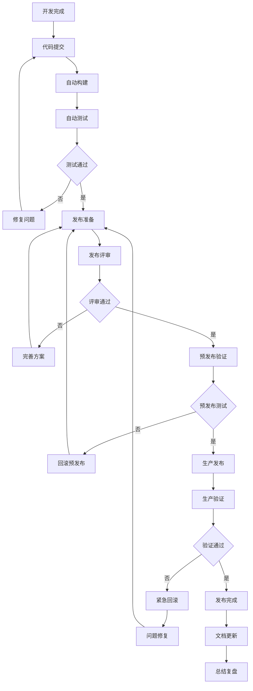

# 发布流程规范（权威文档）

> **📋 文档版本**: v4.0.0 (整合版)
> **📋 文档职责**: SmartAdmin项目的唯一发布流程规范权威来源，确保安全、稳定、高效的代码部署。

## ⚠️ 发布流程铁律（不可违反）

### 🚫 绝对禁止
```markdown
❌ 禁止跳过测试直接发布到生产环境
❌ 禁止在生产环境直接调试代码
❌ 禁止缺少回滚方案的发布
❌ 禁止发布期间不进行监控
❌ 禁止缺少发布文档的变更
❌ 禁止非工作时间进行重大发布
❌ 禁止发布后不进行验证
❌ 禁止缺少用户通知的发布
```

### ✅ 必须执行
```markdown
✅ 必须通过完整的测试流程
✅ 必须制定详细的发布计划
✅ 必须准备回滚方案
✅ 必须进行发布前检查
✅ 必须实时监控发布过程
✅ 必须进行发布后验证
✅ 必须通知相关人员
✅ 必须记录发布过程和结果
```

## 🔄 发布流程架构

### 标准发布流程


### 环境分层策略
```markdown
🏗️ 环境架构：
├── 开发环境 (dev)
│   ├── 用途：日常开发调试
│   ├── 数据：测试数据
│   ├── 发布频率：每次提交
│   └── 自动化：完全自动化
├── 测试环境 (test)
│   ├── 用途：功能测试、集成测试
│   ├── 数据：模拟生产数据
│   ├── 发布频率：每日构建
│   └── 自动化：自动构建部署
├── 预发布环境 (pre)
│   ├── 用途：生产前验证、性能测试
│   ├── 数据：生产数据副本
│   ├── 发布频率：发布前部署
│   └── 自动化：半自动部署
└── 生产环境 (prod)
    ├── 用途：正式对外服务
    ├── 数据：真实用户数据
    ├── 发布频率：定期发布
    └── 自动化：手动触发发布
```

## 📋 发布前检查清单

### 代码质量检查
```markdown
#### 1. 测试验证
- [ ] 单元测试覆盖率 ≥ 80%
- [ ] 集成测试全部通过
- [ ] 性能测试满足要求
- [ ] 安全扫描无高危漏洞
- [ ] 代码评审已通过

#### 2. 功能验证
- [ ] 新功能完整测试
- [ ] 旧功能回归测试
- [ ] 边界条件测试
- [ ] 异常场景测试
- [ ] 用户体验测试

#### 3. 性能验证
- [ ] 接口响应时间 ≤ 500ms
- [ ] 数据库查询优化
- [ ] 内存使用正常
- [ ] CPU使用率 ≤ 70%
- [ ] 并发测试通过

#### 4. 安全验证
- [ ] SQL注入测试
- [ ] XSS攻击测试
- [ ] CSRF防护测试
- [ ] 权限控制测试
- [ ] 敏感数据加密
```

### 配置检查
```markdown
#### 1. 环境配置
- [ ] 数据库连接配置正确
- [ ] Redis连接配置正确
- [ ] 第三方服务配置正确
- [ ] 日志级别配置正确
- [ ] 监控配置正确

#### 2. 依赖检查
- [ ] Maven依赖无冲突
- [ ] 版本兼容性验证
- [ ] 安全漏洞检查
- [ ] 许可证合规检查

#### 3. 资源检查
- [ ] 服务器资源充足
- [ ] 数据库空间充足
- [ ] 网络带宽充足
- [ ] 备份空间充足
```

## 🚀 自动化发布配置

### Jenkins流水线配置
```groovy
// Jenkinsfile
pipeline {
    agent any

    parameters {
        choice(
            name: 'ENVIRONMENT',
            choices: ['dev', 'test', 'pre', 'prod'],
            description: '选择发布环境'
        )
        string(
            name: 'BRANCH',
            defaultValue: 'develop',
            description: '选择发布分支'
        )
        booleanParam(
            name: 'SKIP_TESTS',
            defaultValue: false,
            description: '是否跳过测试（仅限紧急情况）'
        )
    }

    environment {
        DOCKER_REGISTRY = 'registry.example.com'
        APP_NAME = 'smart-admin'
        MAVEN_OPTS = '-Dmaven.repo.local=${JENKINS_HOME}/.m2/repository'
    }

    stages {
        stage('准备阶段') {
            steps {
                script {
                    echo "开始发布 ${params.ENVIRONMENT} 环境"
                    echo "发布分支: ${params.BRANCH}"
                    currentBuild.displayName = "${params.ENVIRONMENT}-${params.BRANCH}-${BUILD_NUMBER}"
                }

                // 清理工作空间
                cleanWs()

                // 拉取代码
                git branch: params.BRANCH, url: 'https://github.com/smart-admin/smart-admin.git'
            }
        }

        stage('代码检查') {
            when {
                not { params.SKIP_TESTS }
            }
            parallel {
                stage('静态代码分析') {
                    steps {
                        sh 'mvn sonar:sonar -Dsonar.projectKey=smart-admin'
                    }
                }

                stage('安全扫描') {
                    steps {
                        sh 'mvn dependency-check:check'
                        sh 'trivy fs --format table -o trivy-report.txt .'
                    }
                }
            }
        }

        stage('构建测试') {
            when {
                not { params.SKIP_TESTS }
            }
            steps {
                sh 'mvn clean compile test'

                // 生成测试报告
                junit 'target/surefire-reports/*.xml'

                // 生成覆盖率报告
                publishHTML([
                    allowMissing: false,
                    alwaysLinkToLastBuild: true,
                    keepAll: true,
                    reportDir: 'target/site/jacoco',
                    reportFiles: 'index.html',
                    reportName: 'Coverage Report'
                ])
            }
        }

        stage('构建镜像') {
            steps {
                script {
                    def imageTag = "${env.DOCKER_REGISTRY}/${env.APP_NAME}:${params.BRANCH}-${BUILD_NUMBER}"

                    // 构建应用
                    sh 'mvn clean package -DskipTests'

                    // 构建Docker镜像
                    sh """
                        docker build -t ${imageTag} .
                        docker push ${imageTag}
                    """

                    // 保存镜像标签供后续使用
                    env.IMAGE_TAG = imageTag
                }
            }
        }

        stage('部署到环境') {
            steps {
                script {
                    switch(params.ENVIRONMENT) {
                        case 'dev':
                            deployToDev()
                            break
                        case 'test':
                            deployToTest()
                            break
                        case 'pre':
                            deployToPre()
                            break
                        case 'prod':
                            input message: '确认发布到生产环境？', ok: '确认发布'
                            deployToProd()
                            break
                    }
                }
            }
        }

        stage('部署后验证') {
            steps {
                script {
                    // 等待服务启动
                    sleep(time: 30, unit: 'SECONDS')

                    // 健康检查
                    def healthUrl = getHealthCheckUrl(params.ENVIRONMENT)
                    sh "curl -f ${healthUrl} || exit 1"

                    // 运行冒烟测试
                    sh "mvn test -Dsmoke.test.env=${params.ENVIRONMENT}"

                    // 发送通知
                    sendNotification(params.ENVIRONMENT, 'SUCCESS')
                }
            }
        }
    }

    post {
        success {
            echo '发布成功！'
            archiveArtifacts artifacts: 'target/*.jar', fingerprint: true
        }

        failure {
            echo '发布失败！'

            // 发送失败通知
            sendNotification(params.ENVIRONMENT, 'FAILURE')

            // 自动回滚（仅限生产环境）
            if (params.ENVIRONMENT == 'prod') {
                echo '执行自动回滚...'
                rollback(params.ENVIRONMENT)
            }
        }

        always {
            // 清理Docker镜像
            sh 'docker rmi ${env.IMAGE_TAG} || true'

            // 清理工作空间
            cleanWs()
        }
    }
}

// 部署函数
def deployToDev() {
    sh """
        kubectl apply -f k8s/dev/ -n smart-admin-dev
        kubectl rollout status deployment/smart-admin -n smart-admin-dev
    """
}

def deployToTest() {
    sh """
        kubectl apply -f k8s/test/ -n smart-admin-test
        kubectl rollout status deployment/smart-admin -n smart-admin-test
    """
}

def deployToPre() {
    sh """
        kubectl apply -f k8s/pre/ -n smart-admin-pre
        kubectl rollout status deployment/smart-admin -n smart-admin-pre
    """
}

def deployToProd() {
    sh """
        kubectl apply -f k8s/prod/ -n smart-admin-prod
        kubectl rollout status deployment/smart-admin -n smart-admin-prod
    """
}

// 回滚函数
def rollback(environment) {
    sh """
        kubectl rollout undo deployment/smart-admin -n smart-admin-${environment}
        kubectl rollout status deployment/smart-admin -n smart-admin-${environment}
    """
}

// 健康检查URL
def getHealthCheckUrl(env) {
    def urls = [
        'dev': 'http://dev.smartadmin.com/actuator/health',
        'test': 'http://test.smartadmin.com/actuator/health',
        'pre': 'http://pre.smartadmin.com/actuator/health',
        'prod': 'http://smartadmin.com/actuator/health'
    ]
    return urls[env]
}

// 通知函数
def sendNotification(env, status) {
    def color = status == 'SUCCESS' ? 'good' : 'danger'
    def message = status == 'SUCCESS' ?
        "✅ SmartAdmin ${env} 环境发布成功" :
        "❌ SmartAdmin ${env} 环境发布失败"

    slackSend(
        channel: '#deployments',
        color: color,
        message: message,
        teamDomain: 'smart-admin',
        tokenCredentialId: 'slack-token'
    )
}
```

### Dockerfile配置
```dockerfile
# Dockerfile
FROM openjdk:17-jre-slim

# 设置时区
ENV TZ=Asia/Shanghai
RUN ln -snf /usr/share/zoneinfo/$TZ /etc/localtime && echo $TZ > /etc/timezone

# 创建应用目录
WORKDIR /app

# 复制应用文件
COPY target/smart-admin-*.jar app.jar

# 创建非root用户
RUN groupadd -r appuser && useradd -r -g appuser appuser
RUN chown -R appuser:appuser /app
USER appuser

# 设置JVM参数
ENV JAVA_OPTS="-Xms512m -Xmx1024m -XX:+UseG1GC -XX:+UseContainerSupport -XX:MaxRAMPercentage=75.0"

# 健康检查
HEALTHCHECK --interval=30s --timeout=10s --start-period=60s --retries=3 \
    CMD curl -f http://localhost:8080/actuator/health || exit 1

# 暴露端口
EXPOSE 8080

# 启动命令
ENTRYPOINT ["sh", "-c", "java $JAVA_OPTS -jar app.jar"]
```

## 📊 发布监控和告警

### Prometheus监控配置
```yaml
# prometheus.yml
global:
  scrape_interval: 15s
  evaluation_interval: 15s

rule_files:
  - "deployment_rules.yml"

scrape_configs:
  - job_name: 'smart-admin'
    metrics_path: '/actuator/prometheus'
    static_configs:
      - targets:
        - 'smart-admin-prod:8080'
        - 'smart-admin-pre:8080'

alerting:
  alertmanagers:
    - static_configs:
        - targets:
          - alertmanager:9093
```

### 发布监控规则
```yaml
# deployment_rules.yml
groups:
  - name: deployment.rules
    rules:
      # 服务可用性监控
      - alert: ServiceDown
        expr: up{job="smart-admin"} == 0
        for: 1m
        labels:
          severity: critical
        annotations:
          summary: "SmartAdmin服务不可用"
          description: "SmartAdmin服务已停止运行超过1分钟"

      # 响应时间监控
      - alert: HighResponseTime
        expr: http_request_duration_seconds{quantile="0.95"} > 1
        for: 5m
        labels:
          severity: warning
        annotations:
          summary: "响应时间过长"
          description: "95%请求响应时间超过1秒"

      # 错误率监控
      - alert: HighErrorRate
        expr: rate(http_requests_total{status=~"5.."}[5m]) > 0.1
        for: 2m
        labels:
          severity: critical
        annotations:
          summary: "错误率过高"
          description: "5xx错误率超过10%"

      # 内存使用监控
      - alert: HighMemoryUsage
        expr: (jvm_memory_used_bytes / jvm_memory_max_bytes) > 0.8
        for: 5m
        labels:
          severity: warning
        annotations:
          summary: "内存使用率过高"
          description: "JVM内存使用率超过80%"

      # 数据库连接监控
      - alert: DatabaseConnectionPoolExhausted
        expr: hikaricp_connections_active / hikaricp_connections_max > 0.9
        for: 2m
        labels:
          severity: critical
        annotations:
          summary: "数据库连接池即将耗尽"
          description: "数据库连接池使用率超过90%"
```

## 🔄 回滚策略

### 自动回滚配置
```bash
#!/bin/bash
# rollback.sh - 回滚脚本

set -e

# 配置参数
ENVIRONMENT=${1:-prod}
NAMESPACE="smart-admin-${ENVIRONMENT}"
DEPLOYMENT="smart-admin"

# 颜色定义
RED='\033[0;31m'
GREEN='\033[0;32m'
YELLOW='\033[1;33m'
NC='\033[0m'

# 日志函数
log_info() {
    echo -e "${GREEN}[INFO]${NC} $1"
}

log_warn() {
    echo -e "${YELLOW}[WARN]${NC} $1"
}

log_error() {
    echo -e "${RED}[ERROR]${NC} $1"
}

# 检查环境
check_environment() {
    log_info "检查 ${ENVIRONMENT} 环境..."

    if ! kubectl get namespace ${NAMESPACE} > /dev/null 2>&1; then
        log_error "命名空间 ${NAMESPACE} 不存在"
        exit 1
    fi

    if ! kubectl get deployment ${DEPLOYMENT} -n ${NAMESPACE} > /dev/null 2>&1; then
        log_error "部署 ${DEPLOYMENT} 不存在"
        exit 1
    fi

    log_info "环境检查通过"
}

# 获取当前版本
get_current_version() {
    kubectl get deployment ${DEPLOYMENT} -n ${NAMESPACE} -o jsonpath='{.spec.template.spec.containers[0].image}'
}

# 获取历史版本
get_revision_history() {
    kubectl rollout history deployment ${DEPLOYMENT} -n ${NAMESPACE}
}

# 执行回滚
perform_rollback() {
    local revision=${1:-}

    log_info "开始回滚 ${ENVIRONMENT} 环境..."

    if [[ -n "$revision" ]]; then
        log_info "回滚到指定版本: ${revision}"
        kubectl rollout undo deployment ${DEPLOYMENT} -n ${NAMESPACE} --to-revision=${revision}
    else
        log_info "回滚到上一个版本"
        kubectl rollout undo deployment ${DEPLOYMENT} -n ${NAMESPACE}
    fi

    # 等待回滚完成
    log_info "等待回滚完成..."
    kubectl rollout status deployment ${DEPLOYMENT} -n ${NAMESPACE} --timeout=300s

    if [[ $? -eq 0 ]]; then
        log_info "回滚成功"
        return 0
    else
        log_error "回滚失败"
        return 1
    fi
}

# 验证回滚
verify_rollback() {
    log_info "验证回滚结果..."

    # 获取新版本
    local new_version=$(get_current_version)
    log_info "当前版本: ${new_version}"

    # 健康检查
    local health_url="http://smart-admin-${ENVIRONMENT}.example.com/actuator/health"

    for i in {1..30}; do
        if curl -f ${health_url} > /dev/null 2>&1; then
            log_info "健康检查通过"
            return 0
        fi
        log_info "等待服务启动... (${i}/30)"
        sleep 10
    done

    log_error "健康检查失败"
    return 1
}

# 发送通知
send_notification() {
    local status=${1:-SUCCESS}
    local current_version=$(get_current_version)

    local message
    if [[ "$status" == "SUCCESS" ]]; then
        message="✅ SmartAdmin ${ENVIRONMENT} 环境回滚成功"
        message="$message\n当前版本: ${current_version}"
    else
        message="❌ SmartAdmin ${ENVIRONMENT} 环境回滚失败"
        message="$message\n请立即检查服务状态"
    fi

    # 发送Slack通知
    curl -X POST -H 'Content-type: application/json' \
        --data "{\"text\":\"$message\"}" \
        ${SLACK_WEBHOOK_URL}
}

# 主函数
main() {
    log_info "SmartAdmin 回滚脚本启动"
    log_info "目标环境: ${ENVIRONMENT}"

    # 检查参数
    if [[ "$ENVIRONMENT" != "dev" && "$ENVIRONMENT" != "test" && "$ENVIRONMENT" != "pre" && "$ENVIRONMENT" != "prod" ]]; then
        log_error "无效的环境参数: ${ENVIRONMENT}"
        log_error "支持的环境: dev, test, pre, prod"
        exit 1
    fi

    # 执行回滚流程
    check_environment

    local revision=${2:-}
    if perform_rollback "$revision"; then
        if verify_rollback; then
            send_notification "SUCCESS"
            log_info "回滚流程完成"
            exit 0
        else
            send_notification "FAILURE"
            log_error "回滚验证失败"
            exit 1
        fi
    else
        send_notification "FAILURE"
        log_error "回滚执行失败"
        exit 1
    fi
}

# 执行主函数
main "$@"
```

## 📋 发布文档模板

### 发布通知模板
```markdown
# 🚀 SmartAdmin 发布通知

## 📋 基本信息
- **发布版本**: v4.0.1
- **发布环境**: 生产环境
- **发布时间**: 2024-01-15 02:00-03:00
- **发布负责人**: 张三
- **发布类型**: 功能发布

## 🔄 变更内容
### 新增功能
- 用户管理模块优化
- 新增数据导出功能
- 性能优化改进

### 修复问题
- 修复用户登录异常问题
- 修复数据分页显示问题
- 修复内存泄漏问题

### 技术改进
- 升级Spring Boot版本
- 优化数据库查询
- 增强安全防护

## ⚠️ 注意事项
- 发布期间可能出现短暂服务中断
- 用户需要重新登录
- 建议备份重要数据

## 📞 联系方式
- 技术负责人: 张三 (13800138000)
- 运维负责人: 李四 (13800138001)
- 紧急联系: 王五 (13800138002)

## 📊 发布结果
- 发布状态: ✅ 成功
- 回滚操作: 未执行
- 问题记录: 无

---

*SmartAdmin 运维团队*
```

---

**🎯 核心原则**：
1. **安全第一** - 确保发布过程安全可控
2. **自动化优先** - 减少人工干预，提高效率
3. **监控全程** - 实时监控发布状态
4. **快速回滚** - 出现问题时快速回滚
5. **文档完整** - 记录完整的发布过程

**📖 相关文档**：
- [代码评审规范](./代码评审规范.md) - 发布前代码质量保证
- [测试规范](../04-质量保障层/测试规范.md) - 发布前测试验证
- [多环境配置规范](../01-核心规范层/多环境配置规范.md) - 环境配置管理