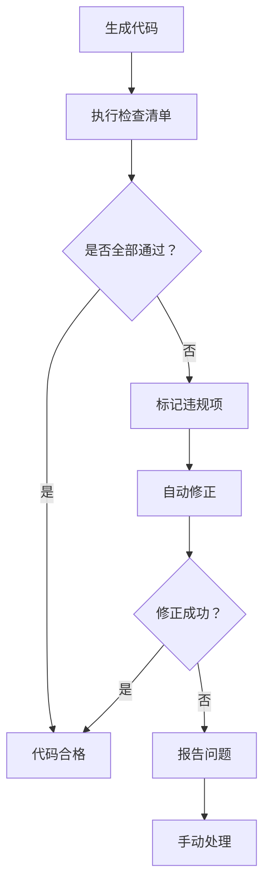

# AI约束检查清单（权威文档）

> **📋 文档版本**: v4.0.0 (整合版)
> **📋 文档职责**: 为AI开发助手提供详细的代码自检清单，确保生成的代码100%符合SmartAdmin规范。

## 🎯 检查清单概述

### 检查流程


### 检查分类和权重
```markdown
🔴 强制检查（权重100%，必须通过）：
   - 架构约束检查（30分）
   - 命名规范检查（25分）
   - API规范检查（20分）
   - 安全规范检查（25分）

🟡 推荐检查（权重70%，建议通过）：
   - 代码质量检查（40分）
   - 性能优化检查（30分）
   - 最佳实践检查（30分）

🟢 可选检查（权重30%，提示建议）：
   - 代码风格检查（50分）
   - 文档完整性检查（50分）
```

## 🔴 强制检查清单（100分）

### 1. 架构约束检查（30分）

#### 1.1 类继承关系检查（8分）
```yaml
check_arch_001:
  title: "类继承关系检查"
  description: "检查类是否继承正确的基类"
  score: 8
  requirements:
    - "Controller类不能继承Service相关类"
    - "Service类不能继承Controller相关类"
    - "Manager类不能直接访问数据库"
    - "Repository类不能包含业务逻辑"
  validation:
    - "检查import语句中是否有违规导入"
    - "检查类声明extends是否合规"
    - "检查方法调用是否跨层"
  failure_action: "BLOCKER"
```

#### 1.2 依赖注入检查（8分）
```yaml
check_arch_002:
  title: "依赖注入检查"
  description: "检查依赖注入是否使用@Resource"
  score: 8
  requirements:
    - "所有依赖注入必须使用@Resource注解"
    - "禁止使用@Autowired注解"
    - "禁止字段注入使用构造函数注入"
  validation:
    - "扫描所有@Resource注解"
    - "检查是否存在@Autowired注解"
    - "验证注入方式是否正确"
  patterns:
    valid: "@Resource"
    invalid: "@Autowired"
  failure_action: "BLOCKER"
```

#### 1.3 跨层访问检查（6分）
```yaml
check_arch_003:
  title: "跨层访问检查"
  description: "检查是否存在跨层直接访问"
  score: 6
  requirements:
    - "Controller不能直接访问Repository/Dao"
    - "Controller不能直接访问数据库"
    - "Service不能直接访问Repository/Dao"
    - "Manager不能处理HTTP请求"
  validation:
    - "分析import语句检查跨层导入"
    - "检查方法调用链是否合规"
    - "验证依赖关系是否正确"
  failure_action: "BLOCKER"
```

#### 1.4 事务边界检查（4分）
```yaml
check_arch_004:
  title: "事务边界检查"
  description: "检查@Transactional注解位置"
  score: 4
  requirements:
    - "@Transactional只能在Service方法上使用"
    - "Controller方法不能有@Transactional注解"
    - "Manager方法不能有@Transactional注解"
    - "Repository方法不能有@Transactional注解"
  validation:
    - "扫描所有@Transactional注解"
    - "检查注解所在类和方法"
    - "验证事务边界是否正确"
  failure_action: "BLOCKER"
```

#### 1.5 分层职责检查（4分）
```yaml
check_arch_005:
  title: "分层职责检查"
  description: "检查每层是否履行正确职责"
  score: 4
  requirements:
    - "Controller只负责参数验证和响应封装"
    - "Service负责业务逻辑和事务管理"
    - "Manager负责复杂业务和缓存管理"
    - "Repository只负责数据访问"
  validation:
    - "分析每层代码内容"
    - "检查是否存在职责越界"
    - "验证业务逻辑是否在正确层"
  failure_action: "BLOCKER"
```

### 2. 命名规范检查（25分）

#### 2.1 类命名检查（10分）
```yaml
check_naming_001:
  title: "Controller类命名检查"
  description: "检查Controller类命名是否规范"
  score: 3
  pattern: "^[A-Z][a-zA-Z0-9]*Controller$"
  examples:
    valid: ["UserController", "EmployeeController", "OrderController"]
    invalid: ["userController", "UserControllerImpl", "UserControllerService"]
  validation:
    - "检查类名是否符合模式"
    - "验证命名是否语义化"
  failure_action: "BLOCKER"

check_naming_002:
  title: "Service类命名检查"
  description: "检查Service类命名是否规范"
  score: 3
  pattern: "^[A-Z][a-zA-Z0-9]*Service$"
  examples:
    valid: ["UserService", "EmployeeService", "OrderService"]
    invalid: ["userService", "UserServiceImpl", "UserServiceManager"]
  failure_action: "BLOCKER"

check_naming_003:
  title: "Manager类命名检查"
  description: "检查Manager类命名是否规范"
  score: 2
  pattern: "^[A-Z][a-zA-Z0-9]*Manager$"
  examples:
    valid: ["UserManager", "EmployeeManager", "OrderManager"]
  invalid: ["userManager", "UserManagerImpl", "UserManagerService"]
  failure_action: "BLOCKER"

check_naming_004:
  title: "Dao类命名检查"
  description: "检查Dao类命名是否规范"
  score: 2
  pattern: "^[A-Z][a-zA-Z0-9]*Dao$"
  examples:
    valid: ["UserDao", "EmployeeDao", "OrderDao"]
    invalid: ["userDao", "UserDaoImpl", "UserDaoMapper"]
  failure_action: "BLOCKER"
```

#### 2.2 字段命名检查（8分）
```yaml
check_naming_005:
  title: "主键字段命名检查"
  description: "检查主键字段命名是否规范"
  score: 4
  pattern: "^[a-z]+Id$"
  examples:
    valid: ["userId", "orderId", "employeeId"]
    invalid: ["user_id", "UserID", "user_id", "id"]
  validation:
    - "检查Entity主键字段"
    - "验证VO主键字段"
    - "检查Form主键字段"
  failure_action: "BLOCKER"

check_naming_006:
  title: "表名命名检查"
  description: "检查表名是否规范"
  score: 4
  pattern: "^t_[a-z]+_[a-z]+$"
  examples:
    valid: ["t_user_info", "t_business_order", "t_system_config"]
    invalid: ["user", "tUser", "user_table", "T_USER_INFO"]
  validation:
    - "检查@TableName注解"
    - "验证数据库映射"
  failure_action: "BLOCKER"
```

#### 2.3 Form/VO命名检查（7分）
```yaml
check_naming_007:
  title: "Form类命名检查"
  description: "检查Form类命名是否规范"
  score: 4
  pattern: "^[A-Z][a-zA-Z0-9]*Form$"
  examples:
    valid: ["UserAddForm", "UserUpdateForm", "UserQueryForm"]
    invalid: ["UserForm", "UserDTO", "UserRequest"]
  validation:
    - "检查Form类名模式"
    - "验证命名语义化"
  failure_action: "BLOCKER"

check_naming_008:
  title: "VO类命名检查"
  description: "检查VO类命名是否规范"
  score: 3
  pattern: "^[A-Z][a-zA-Z0-9]*VO$"
  examples:
    valid: ["UserVO", "EmployeeVO", "OrderVO"]
    invalid: ["UserDto", "UserView", "UserModel"]
  failure_action: "BLOCKER"
```

### 3. API规范检查（20分）

#### 3.1 API路径检查（6分）
```yaml
check_api_001:
  title: "API路径规范检查"
  description: "检查API路径是否符合规范"
  score: 6
  pattern: "^/api/[a-z]+/[a-z]+$"
  examples:
    valid: ["/api/user/add", "/api/order/update", "/api/employee/delete"]
    invalid: ["/user/add", "/api/User/Add", "/api/user/addUser"]
  validation:
    - "检查@RequestMapping路径"
    - "验证路径格式"
    - "检查HTTP方法映射"
  failure_action: "BLOCKER"
```

#### 3.2 HTTP方法检查（5分）
```yaml
check_api_002:
  title: "HTTP方法规范检查"
  description: "检查HTTP方法使用是否规范"
  score: 5
  requirements:
    - "查询用GET方法"
    - "添加用POST方法"
    - "更新用POST方法"
    - "删除用POST方法"
  mapping:
    query: "GET"
    add: "POST"
    update: "POST"
    delete: "POST"
  validation:
    - "检查方法注解"
    - "验证操作类型匹配"
  failure_action: "BLOCKER"
```

#### 3.3 响应格式检查（5分）
```yaml
check_api_003:
  title: "响应格式规范检查"
  description: "检查响应格式是否符合规范"
  score: 5
  format: "ResponseDTO<T>"
  requirements:
    - "必须返回ResponseDTO格式"
    - "成功返回ResponseDTO.ok()"
    - "失败返回ResponseDTO.error()"
  validation:
    - "检查方法返回类型"
    - "验证响应构造方式"
  failure_action: "BLOCKER"
```

#### 3.4 权限控制检查（4分）
```yaml
check_api_004:
  title: "权限控制规范检查"
  description: "检查权限控制是否配置"
  score: 4
  requirements:
    - "必须使用@SaCheckPermission注解"
    - "权限格式为{module}:{action}"
    - "Controller类必须有@SaCheckLogin"
  validation:
    - "检查权限注解"
    - "验证权限格式"
    - "检查登录验证"
  failure_action: "BLOCKER"
```

### 4. 安全规范检查（25分）

#### 4.1 输入验证检查（8分）
```yaml
check_sec_001:
  title: "输入验证规范检查"
  description: "检查输入验证是否完整"
  score: 8
  requirements:
    - "必须使用@Valid注解"
    - "必填字段用@NotBlank或@NotNull"
    - "长度限制用@Length注解"
    - "格式验证用@Pattern注解"
  annotations:
    required: ["@Valid", "@NotBlank", "@NotNull"]
    optional: ["@Length", "@Pattern", "@Email", "@Min", "@Max"]
  validation:
    - "检查参数验证注解"
    - "验证验证规则完整性"
    - "检查错误信息定义"
  failure_action: "BLOCKER"
```

#### 4.2 密码安全检查（6分）
```yaml
check_sec_002:
  title: "密码安全规范检查"
  description: "检查密码处理是否安全"
  score: 6
  requirements:
    - "密码必须使用BCrypt加密"
    - "传输过程必须HTTPS"
    - "日志中不能输出密码"
    - "密码字段必须有复杂度验证"
  encryption: "BCrypt"
  validation:
    - "检查密码加密方式"
    - "验证密码复杂度规则"
    - "检查日志脱敏处理"
  failure_action: "BLOCKER"
```

#### 4.3 SQL注入防护检查（6分）
```yaml
check_sec_003:
  title: "SQL注入防护检查"
  description: "检查SQL注入防护措施"
  score: 6
  requirements:
    - "必须使用预编译SQL"
    - "禁止字符串拼接SQL"
    - "MyBatis必须使用#{}占位符"
    - "禁止使用${}拼接"
  validation:
    - "检查SQL语句构造"
    - "验证参数绑定方式"
    - "分析MyBatis映射文件"
  failure_action: "BLOCKER"
```

#### 4.4 敏感信息处理检查（5分）
```yaml
check_sec_004:
  title: "敏感信息处理检查"
  description: "检查敏感信息处理是否规范"
  score: 5
  requirements:
    - "敏感字段必须脱敏显示"
    - "日志不能输出敏感信息"
    - "配置文件敏感信息加密"
    - "API响应不返回敏感信息"
  sensitive_fields: ["password", "token", "secret", "key", "salt"]
  validation:
    - "检查敏感字段定义"
    - "验证脱敏处理逻辑"
    - "分析日志输出内容"
  failure_action: "BLOCKER"
```

## 🟡 推荐检查清单（70分）

### 5. 代码质量检查（40分）

#### 5.1 方法长度检查（10分）
```yaml
check_quality_001:
  title: "方法长度检查"
  description: "检查方法长度是否合理"
  score: 10
  max_lines: 50
  levels:
    good: "≤ 30行"
    acceptable: "31-50行"
    warning: "51-80行"
    error: "> 80行"
  validation:
    - "统计方法有效行数"
    - "检查复杂度分布"
  failure_action: "WARNING"
```

#### 5.2 圈复杂度检查（10分）
```yaml
check_quality_002:
  title: "圈复杂度检查"
  description: "检查圈复杂度是否达标"
  score: 10
  max_complexity: 10
  levels:
    good: "≤ 5"
    acceptable: "6-10"
    warning: "11-15"
    error: "> 15"
  validation:
    - "计算圈复杂度"
    - "分析控制流"
  failure_action: "WARNING"
```

#### 5.3 异常处理检查（10分）
```yaml
check_quality_003:
  title: "异常处理检查"
  description: "检查异常处理是否完善"
  score: 10
  requirements:
    - "必须处理受检异常"
    - "异常信息要明确"
    - "不能忽略异常"
    - "要有适当的日志记录"
  validation:
    - "检查try-catch块"
    - "分析异常处理逻辑"
    - "验证日志记录"
  failure_action: "WARNING"
```

#### 5.4 代码重复检查（10分）
```yaml
check_quality_004:
  title: "代码重复检查"
  description: "检查是否存在重复代码"
  score: 10
  max_duplication: 3
  validation:
    - "分析代码相似度"
    - "检查重复逻辑"
    - "识别可抽取代码"
  failure_action: "WARNING"
```

### 6. 性能优化检查（30分）

#### 6.1 数据库性能检查（15分）
```yaml
check_perf_001:
  title: "数据库性能检查"
  description: "检查数据库操作性能"
  score: 15
  requirements:
    - "查询必须有索引支持"
    - "避免N+1查询问题"
    - "批量操作要控制大小"
    - "分页查询要优化"
  validation:
    - "分析SQL执行计划"
    - "检查查询模式"
    - "验证批量操作"
  failure_action: "WARNING"
```

#### 6.2 缓存使用检查（15分）
```yaml
check_perf_002:
  title: "缓存使用检查"
  description: "检查缓存使用是否合理"
  score: 15
  requirements:
    - "热点数据要有缓存"
    - "缓存更新策略合理"
    - "避免缓存穿透"
    - "缓存时间设置合理"
  validation:
    - "检查缓存注解"
    - "分析缓存策略"
    - "验证缓存配置"
  failure_action: "WARNING"
```

## 🟢 可选检查清单（30分）

### 7. 代码风格检查（15分）
```yaml
check_style_001:
  title: "注释规范检查"
  description: "检查注释是否规范"
  score: 8
  requirements:
    - "公共方法必须有JavaDoc"
    - "复杂逻辑要有注释"
    - "注释要清晰准确"
  validation:
    - "检查JavaDoc注释"
    - "分析注释质量"
  failure_action: "SUGGESTION"

check_style_002:
  title: "日志规范检查"
  description: "检查日志记录是否规范"
  score: 7
  requirements:
    - "关键操作要有日志"
    - "日志级别要合适"
    - "日志信息要有意义"
  validation:
    - "检查日志记录点"
    - "分析日志内容"
  failure_action: "SUGGESTION"
```

### 8. 文档完整性检查（15分）
```yaml
check_doc_001:
  title: "API文档检查"
  description: "检查API文档是否完整"
  score: 10
  requirements:
    - "接口要有Swagger注解"
    - "参数说明要完整"
    - "响应示例要准确"
  validation:
    - "检查Swagger注解"
    - "验证文档完整性"
  failure_action: "SUGGESTION"

check_doc_002:
  title: "README文档检查"
  description: "检查README文档是否完整"
  score: 5
  requirements:
    - "项目介绍要清晰"
    - "使用说明要详细"
    - "部署指南要完整"
  validation:
    - "检查README内容"
    - "验证文档质量"
  failure_action: "SUGGESTION"
```

## 📊 检查结果评估

### 评分标准
```markdown
优秀：90-100分 - 代码质量极高，可以直接使用
良好：80-89分 - 代码质量较好，小幅修改后可用
合格：70-79分 - 代码基本达标，需要部分修改
不合格：< 70分 - 代码问题较多，需要重新生成
```

### 修正策略
```markdown
🔴 强制项失败：
   - 立即停止生成
   - 重新分析需求
   - 再次生成代码

🟡 推荐项失败：
   - 标记问题点
   - 提供修正建议
   - 支持手动调整

🟢 可选项失败：
   - 记录改进建议
   - 不影响功能使用
   - 可后续优化
```

### 报告格式
```yaml
code_quality_report:
  total_score: 85
  grade: "良好"
  details:
    mandatory_checks:
      passed: 18
      failed: 2
      score: 80
    recommended_checks:
      passed: 6
      failed: 2
      score: 65
    optional_checks:
      passed: 3
      failed: 1
      score: 70
  issues:
    - level: "BLOCKER"
      category: "命名规范"
      description: "Controller类名不符合规范"
      suggestion: "将类名改为UserController"
    - level: "WARNING"
      category: "性能优化"
      description: "查询缺少索引支持"
      suggestion: "为查询字段添加索引"
```

---

**🎯 使用说明**：
1. **逐项检查** - 严格按照清单逐项检查
2. **记录问题** - 详细记录每个检查项的结果
3. **优先处理** - 优先处理BLOCKER级别的问题
4. **持续改进** - 根据检查结果不断优化代码质量

**📖 相关文档**：
- [AI开发指令集](./AI开发指令集.md) - AI开发指令
- [架构规范](../01-核心规范层/架构规范.md) - 架构设计标准
- [编码规范](../01-核心规范层/编码规范.md) - 编码标准规范