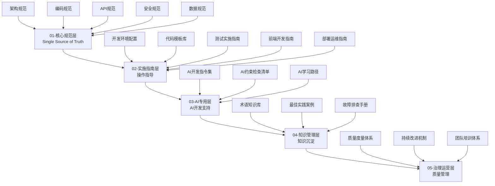

# SmartAdmin规范体系 v4.0

> **版本**: 4.0.0
> **发布日期**: 2024-11-09
> **文档状态**: 🟢 正式版本
> **维护团队**: SmartAdmin规范治理委员会

## 📋 文档体系概述

SmartAdmin规范体系v4是整合了v1、v2、v3精华内容的**统一权威规范**，采用五层治理架构设计，为SmartAdmin项目提供完整的企业级开发规范指导。

### 🏗️ 五层治理架构



### 🎯 核心设计原则

1. **Single Source of Truth** - 每个规范内容只有一个权威来源
2. **职责边界清晰** - 各层级职责明确，避免重叠和模糊
3. **AI原生支持** - 专门针对AI辅助开发优化
4. **持续迭代改进** - 建立完善的维护和更新机制
5. **企业级标准** - 达到企业级开发规范的专业水准

### 📚 文档导航

#### 🎯 核心规范层 - 权威技术规范
- [架构规范](./01-核心规范层/架构规范.md) - 四层架构、微服务设计、技术选型
- [编码规范](./01-核心规范层/编码规范.md) - Java编码标准、代码质量要求
- [API规范](./01-核心规范层/API规范.md) - RESTful API设计、接口规范
- [安全规范](./01-核心规范层/安全规范.md) - 安全要求、漏洞防护、审计日志
- [数据规范](./01-核心规范层/数据规范.md) - 数据库设计、缓存架构、数据处理

#### 🛠️ 实施指南层 - 具体操作指导
- [开发环境配置](./02-实施指南层/开发环境配置.md) - 环境搭建、工具配置
- [代码模板库](./02-实施指南层/代码模板库.md) - Controller、Service、Mapper模板
- [测试实施指南](./02-实施指南层/测试实施指南.md) - 单元测试、集成测试、性能测试
- [前端开发指南](./02-实施指南层/前端开发指南.md) - Vue3开发规范、组件标准
- [部署运维指南](./02-实施指南层/部署运维指南.md) - 部署流程、监控告警、运维操作

#### 🤖 AI专用层 - AI开发支持
- [AI开发指令集](./03-AI专用层/AI开发指令集.md) - AI辅助开发指令、约束规则
- [AI约束检查清单](./03-AI专用层/AI约束检查清单.md) - AI代码审查、质量检查
- [AI学习路径](./03-AI专用层/AI学习路径.md) - AI能力培养、技能提升

#### 📚 知识管理层 - 知识沉淀与分享
- [术语知识库](./04-知识管理层/术语知识库.md) - 统一术语、概念定义
- [最佳实践案例](./04-知识管理层/最佳实践案例.md) - 实际项目经验、典型场景
- [故障排查手册](./04-知识管理层/故障排查手册.md) - 常见问题、解决方案

#### 📊 治理运营层 - 质量管理与持续改进
- [质量度量体系](./05-治理运营层/质量度量体系.md) - 质量指标、度量标准
- [持续改进机制](./05-治理运营层/持续改进机制.md) - 反馈收集、版本管理
- [团队培训体系](./05-治理运营层/团队培训体系.md) - 技能培训、知识传承

### 🔄 版本演进历史

| 版本 | 发布日期 | 主要特性 | 状态 |
|------|----------|----------|------|
| v1.0 | 2024-10-01 | 基础规范体系，全面覆盖 | 🚫 已废弃 |
| v2.0 | 2024-10-15 | 精简优化，AI友好，增加质量工具 | 🚫 已废弃 |
| v3.0 | 2024-11-01 | 五层架构，AI专用化，治理运营 | 🚫 已废弃 |
| **v4.0** | **2024-11-09** | **精华整合，统一权威，企业级标准** | **🟢 当前版本** |

### 📖 使用指南

#### 👥 不同角色的阅读路径

**架构师**：
1. 架构规范 → 2. 数据规范 → 3. 最佳实践案例 → 4. 质量度量体系

**后端开发**：
1. 编码规范 → 2. API规范 → 3. 开发环境配置 → 4. 代码模板库

**前端开发**：
1. 前端开发指南 → 2. API规范 → 3. 代码模板库 → 4. 安全规范

**测试工程师**：
1. 测试实施指南 → 2. 安全规范 → 3. 故障排查手册 → 4. 质量度量体系

**运维工程师**：
1. 部署运维指南 → 2. 架构规范 → 3. 持续改进机制 → 4. 故障排查手册

**AI辅助开发**：
1. AI开发指令集 → 2. AI约束检查清单 → 3. 对应核心规范 → 4. 代码模板库

#### 📋 文档引用规范

```markdown
# 引用核心规范
架构设计详见：[架构规范 - 四层架构设计](./01-核心规范层/架构规范.md#四层架构设计)

# 引用实施指南
开发环境搭建详见：[开发环境配置 - 环境要求](./02-实施指南层/开发环境配置.md#环境要求)

# 引用AI专用内容
AI约束规则详见：[AI约束检查清单 - 代码质量检查](./03-AI专用层/AI约束检查清单.md#代码质量检查)
```

### 🚀 快速开始

1. **新团队成员**：阅读 [团队培训体系](./05-治理运营层/团队培训体系.md)
2. **项目启动**：参考 [架构规范](./01-核心规范层/架构规范.md) 和 [开发环境配置](./02-实施指南层/开发环境配置.md)
3. **日常开发**：遵循 [编码规范](./01-核心规范层/编码规范.md) 和 [API规范](./01-核心规范层/API规范.md)
4. **AI辅助开发**：使用 [AI开发指令集](./03-AI专用层/AI开发指令集.md) 和 [AI约束检查清单](./03-AI专用层/AI约束检查清单.md)

### 📞 反馈与支持

- **文档问题**：通过 [持续改进机制](./05-治理运营层/持续改进机制.md) 反馈
- **规范疑问**：联系SmartAdmin规范治理委员会
- **改进建议**：提交Issue或Pull Request

---

**🎯 SmartAdmin规范体系v4 - 统一、权威、专业的企业级开发规范**

**📋 本版本特性**：
- ✅ 整合v1项目管理精华、v2质量工具、v3架构优势
- ✅ 消除重复内容，建立Single Source of Truth
- ✅ 职责边界清晰，五层架构设计
- ✅ AI原生支持，企业级标准
- ✅ 完善的维护和持续改进机制