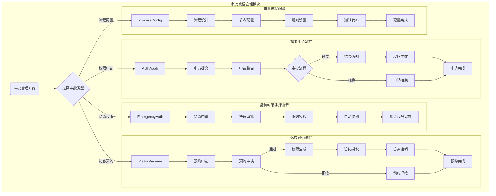

# ZKBioSecurity-ACC门禁系统 - 审批流程管理模块流程图

## 审批流程管理模块流程图

## 流程说明

### 权限申请流程
1. **申请提交**：用户提交权限申请，填写申请理由和所需权限
2. **申请路由**：系统根据申请内容自动路由到相应的审批人
3. **审批流程**：按预设流程进行多级审批
4. **结果通知**：审批完成后通知申请人结果
5. **权限生效**：审批通过后立即生效权限
6. **申请拒绝**：审批拒绝时记录拒绝理由

### 访客预约流程
1. **预约申请**：访客或被访人提交访问预约申请
2. **预约审核**：相关负责人审核访客预约申请
3. **权限生成**：审核通过后生成临时访问权限
4. **访问授权**：在指定时间范围内授权访客访问
5. **访离注销**：访客离开后自动注销访问权限

### 紧急权限处理流程
1. **紧急申请**：紧急情况下提交权限申请
2. **快速审批**：通过简化流程进行快速审批
3. **临时授权**：授予临时访问权限
4. **自动过期**：临时权限在指定时间后自动过期

### 审批流程配置流程
1. **流程设计**：设计新的审批流程
2. **节点配置**：配置审批节点和处理人
3. **规则设置**：设置审批规则和条件
4. **测试发布**：测试流程并正式发布

## 审批流程类型
1. **标准审批**：常规权限申请，需多级审批
2. **快速审批**：简单权限申请，简化审批流程
3. **紧急审批**：紧急情况下的审批流程
4. **自动审批**：符合条件的申请自动通过

## 审批节点类型
1. **串行审批**：按顺序逐级审批
2. **并行审批**：多个审批人同时审批
3. **会签审批**：所有审批人都需同意
4. **或签审批**：任意一个审批人同意即可

## 审批超时处理
- **提醒机制**：审批超时前提醒审批人
- **自动转交**：超时后自动转交给上级
- **自动通过**：简单申请超时后自动通过
- **升级处理**：重要申请超时后升级处理

## 关键控制点
- 审批流程必须完整记录每个环节
- 审批权限必须与岗位职能匹配
- 紧急审批需要事后补全审批流程
- 审批结果必须及时生效到相关系统
- 审批历史必须完整保存不可篡改

## 性能指标
- 审批提交响应时间：≤ 2秒
- 审批流程处理时间：≤ 24小时
- 紧急审批处理时间：≤ 30分钟
- 权限生效延迟：≤ 1分钟
- 审批通知发送延迟：≤ 30秒

## 注意事项
- 审批流程配置需要充分测试才能正式使用
- 访客权限需要严格控制访问时间和范围
- 紧急权限需要建立完善的事后审计机制
- 审批数据包含敏感信息，需要严格保护
- 审批系统需要支持移动端审批功能