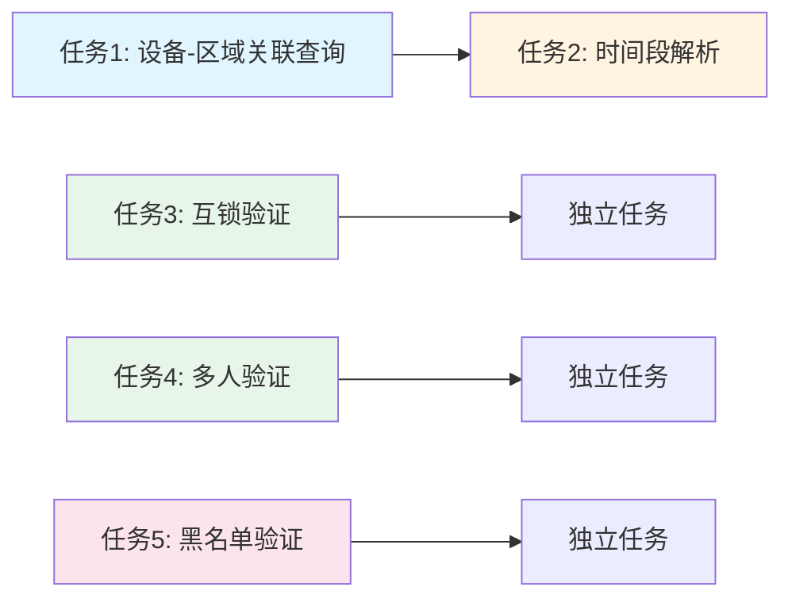

# 任务拆分文档 - 门禁模块完善

## 任务列表

### 任务1：设备-区域关联查询完善

#### 输入契约
- 前置依赖：GatewayServiceClient已配置
- 输入数据：设备序列号（serialNumber）或设备ID（deviceId）
- 环境依赖：common-service正常运行

#### 输出契约
- 输出数据：DeviceEntity对象（包含areaId）
- 交付物：
  - `AccessVerificationManager.getAreaIdByDeviceId()`方法完善
  - `AccessBackendAuthController.getDeviceIdBySerialNumber()`方法完善
  - `AccessBackendAuthController.getAreaIdByDeviceId()`方法完善
- 验收标准：
  - 能正确通过序列号查询设备
  - 能正确通过设备ID查询设备
  - 能正确获取区域ID
  - 异常处理完善

#### 实现约束
- 技术栈：GatewayServiceClient, Jackson
- 接口规范：使用`/api/v1/device/{deviceId}`或`/api/v1/device/serial/{serialNumber}`
- 质量要求：异常处理完善，日志记录完整

#### 依赖关系
- 后置任务：任务2（时间段验证需要区域ID）
- 并行任务：无

---

### 任务2：时间段解析完善

#### 输入契约
- 前置依赖：任务1完成（需要区域ID）
- 输入数据：UserAreaPermissionEntity.accessTimes JSON字符串
- 环境依赖：Jackson JSON解析库

#### 输出契约
- 输出数据：时间段验证结果（boolean）
- 交付物：
  - `AccessVerificationManager.verifyTimePeriod()`方法完善
  - 时间段解析工具类（可选）
- 验收标准：
  - JSON解析正确
  - 多时间段支持
  - 工作日判断正确
  - 时间比较准确

#### 实现约束
- 技术栈：Jackson, LocalTime
- 接口规范：JSON格式 `[{"startTime": "08:00", "endTime": "18:00", "days": [1,2,3,4,5]}]`
- 质量要求：边界条件处理完善，异常处理完善

#### 依赖关系
- 前置任务：任务1
- 后置任务：无
- 并行任务：任务3

---

### 任务3：互锁验证逻辑完善

#### 输入契约
- 前置依赖：数据库表`t_access_interlock_record`已创建
- 输入数据：设备ID（deviceId），区域ID（areaId）
- 环境依赖：AreaAccessExtDao, InterlockRecordDao

#### 输出契约
- 输出数据：互锁验证结果（boolean）
- 交付物：
  - `AccessVerificationManager.verifyInterlock()`方法完善
  - InterlockRecordDao接口（如果不存在）
  - InterlockRecordEntity实体类（如果不存在）
- 验收标准：
  - 互锁组配置正确解析
  - 锁定/解锁机制正常工作
  - 超时处理正常
  - 并发访问正常

#### 实现约束
- 技术栈：Jackson, MyBatis-Plus, Redis（可选）
- 接口规范：extConfig JSON格式 `{"interlockGroups": [{"groupId": 1, "deviceIds": [1001, 1002]}]}`
- 质量要求：线程安全，超时处理完善

#### 依赖关系
- 前置任务：无
- 后置任务：无
- 并行任务：任务2, 任务4

---

### 任务4：多人验证逻辑完善

#### 输入契约
- 前置依赖：数据库表`t_access_multi_person_record`已创建
- 输入数据：AccessVerificationRequest（包含userId, areaId, deviceId）
- 环境依赖：MultiPersonRecordDao, AreaAccessExtDao

#### 输出契约
- 输出数据：VerificationResult（包含验证状态）
- 交付物：
  - `AccessVerificationManager.verifyMultiPerson()`方法完善
  - `AccessVerificationManager.isMultiPersonRequired()`方法完善
  - MultiPersonRecordDao接口（如果不存在）
  - MultiPersonRecordEntity实体类（如果不存在）
- 验收标准：
  - 会话管理正常
  - 人数统计准确
  - 超时清理正常
  - 并发访问正常

#### 实现约束
- 技术栈：UUID, MyBatis-Plus, 定时任务
- 接口规范：extConfig JSON格式 `{"multiPersonRequired": true, "requiredCount": 2}`
- 质量要求：线程安全，超时处理完善，定时任务正常

#### 依赖关系
- 前置任务：无
- 后置任务：无
- 并行任务：任务2, 任务3

---

### 任务5：黑名单验证逻辑完善

#### 输入契约
- 前置依赖：GatewayServiceClient已配置
- 输入数据：用户ID（userId）
- 环境依赖：common-service正常运行

#### 输出契约
- 输出数据：黑名单验证结果（boolean）
- 交付物：
  - `AccessVerificationManager.isBlacklisted()`方法完善
- 验收标准：
  - 能正确查询用户信息
  - 能正确判断用户状态
  - 异常处理完善
  - 缓存优化（可选）

#### 实现约束
- 技术栈：GatewayServiceClient, Jackson
- 接口规范：使用`/api/v1/user/{userId}`查询用户信息
- 质量要求：异常处理完善，降级策略完善

#### 依赖关系
- 前置任务：无
- 后置任务：无
- 并行任务：任务1, 任务2, 任务3, 任务4

---

## 依赖关系图

## 执行顺序建议

**第一阶段**（必须顺序执行）：
1. 任务1：设备-区域关联查询完善
2. 任务2：时间段解析完善

**第二阶段**（可并行执行）：
3. 任务3：互锁验证逻辑完善
4. 任务4：多人验证逻辑完善
5. 任务5：黑名单验证逻辑完善
