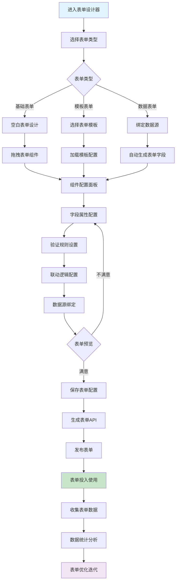
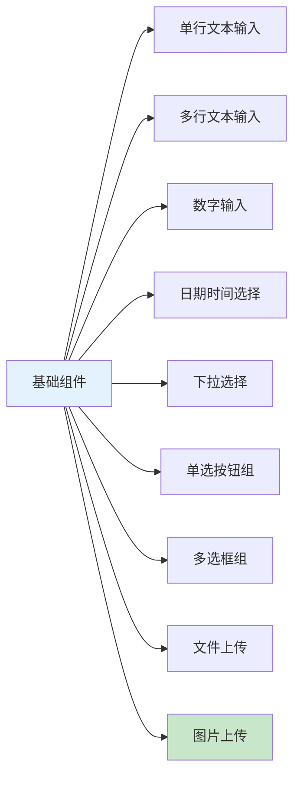
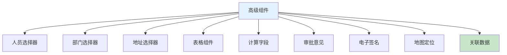
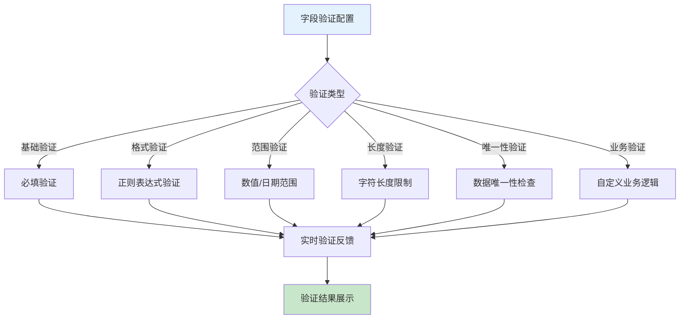
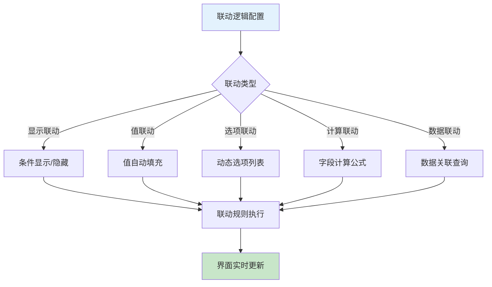
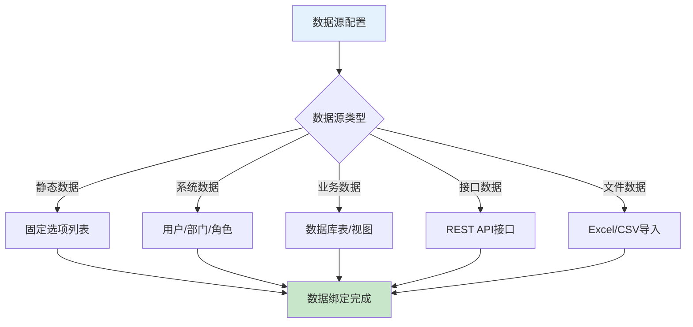

# 低代码表单设计器业务流程图

> **创建时间**: 2025-12-16
> **流程类型**: OA工作流核心功能
> **优先级**: P0 - 核心架构功能
> **适用范围**: 企业级表单设计与配置

---

## 📋 功能概述

低代码表单设计器是OA工作流系统的核心功能，提供可视化表单设计、字段配置、验证规则、联动逻辑等完整的企业级表单构建能力，支持业务人员无需编程即可创建复杂的业务表单。

### 核心特点
- **拖拽式设计**: 可视化拖拽表单组件，所见即所得
- **丰富组件库**: 30+种表单组件，满足各种业务需求
- **动态联动**: 支持字段间智能联动和条件显示
- **数据绑定**: 与后端数据源自动绑定，支持CRUD操作
- **移动适配**: 自动生成响应式表单，完美适配移动端

---

## 🔄 表单设计器完整流程图



---

## 📊 表单组件库架构

### 1. 基础输入组件



#### 组件配置矩阵

| 组件类型 | 数据类型 | 验证规则 | 移动端适配 | 常用场景 |
|---------|---------|---------|-----------|---------|
| **文本输入** | String | 必填、长度、格式 | ✅ 完美适配 | 姓名、地址、描述 |
| **数字输入** | Number | 范围、精度、步长 | ✅ 数字键盘 | 年龄、金额、数量 |
| **日期选择** | Date | 日期范围、格式 | ✅ 原生选择器 | 生日、截止日期 |
| **下拉选择** | String | 必填、选项范围 | ✅ 原生选择器 | 部门、性别、类型 |
| **文件上传** | File | 文件类型、大小限制 | ✅ 相机/相册 | 证件、合同、证明 |
| **图片上传** | Image | 图片格式、尺寸 | ✅ 拍照/相册 | 头像、现场照片 |

### 2. 高级业务组件



#### 高级组件特性

| 组件名称 | 数据源 | 联动能力 | 业务场景 | 配置复杂度 |
|---------|--------|---------|---------|-----------|
| **人员选择器** | 用户系统 | ✅ 部门联动 | 审批人、负责人 | 中等 |
| **部门选择器** | 组织架构 | ✅ 级联选择 | 所属部门、成本中心 | 简单 |
| **地址选择器** | 地址库 | ✅ 省市区联动 | 联系地址、送货地址 | 简单 |
| **表格组件** | 动态数据 | ✅ 行列计算 | 明细列表、批量录入 | 复杂 |
| **计算字段** | 公式引擎 | ✅ 实时计算 | 金额计算、统计汇总 | 中等 |
| **审批意见** | 审批系统 | ✅ 必填验证 | 审批流程嵌入 | 简单 |
| **电子签名** | 签名系统 | ✅ 手写识别 | 合同签署、确认单 | 中等 |
| **地图定位** | 地图服务 | ✅ 地址解析 | 位置记录、路线规划 | 中等 |
| **关联数据** | 业务数据 | ✅ 数据联动 | 关联订单、关联项目 | 复杂 |

---

## 🎛️ 表单配置面板设计

### 1. 字段属性配置


#### 配置属性详解

| 属性类别 | 配置项 | 说明 | 示例 |
|---------|--------|------|------|
| **基础属性** | 字段ID、字段名、字段类型 | 唯一标识和基础信息 | user_name, 用户姓名, text |
| **显示属性** | 标签、占位符、帮助文本 | 用户界面显示文本 | 请输入用户姓名 |
| **验证属性** | 必填、长度、格式、正则表达式 | 数据验证规则 | 必填, 2-20个字符, 中英文数字 |
| **联动属性** | 显示条件、联动字段、计算公式 | 字段间逻辑关系 | 当部门为技术部时显示技术等级 |
| **数据属性** | 默认值、数据源、绑定字段 | 数据绑定和默认值 | 默认值=当前用户, 绑定用户表 |

### 2. 验证规则引擎



#### 内置验证规则

| 验证类型 | 规则名称 | 配置参数 | 错误提示 |
|---------|---------|---------|---------|
| **必填验证** | required | true/false | 此字段为必填项 |
| **长度验证** | minLength | 2 | 最少输入2个字符 |
| **长度验证** | maxLength | 50 | 最多输入50个字符 |
| **格式验证** | pattern | /^[u4e00-u9fa5]+$/ | 请输入中文 |
| **数值验证** | min | 0 | 数值不能小于0 |
| **数值验证** | max | 100 | 数值不能大于100 |
| **邮箱验证** | email | true | 请输入有效的邮箱地址 |
| **手机验证** | phone | true | 请输入有效的手机号码 |
| **唯一验证** | unique | user.email | 邮箱已存在 |

---

## 🔄 动态联动逻辑

### 1. 字段联动类型



#### 联动逻辑示例

| 联动类型 | 触发条件 | 执行动作 | 业务场景 |
|---------|---------|---------|---------|
| **显示联动** | 部门=技术部 | 显示技术等级字段 | 根据部门显示相关字段 |
| **值联动** | 选择员工 | 自动填充邮箱电话 | 员工信息自动填充 |
| **选项联动** | 选择省份 | 加载城市列表 | 级联地址选择 |
| **计算联动** | 数量×单价 | 自动计算总金额 | 费用自动计算 |
| **数据联动** | 输入产品编号 | 查询产品信息 | 产品信息关联显示 |

### 2. 联动规则配置

```javascript
// 联动规则配置示例
{
  "formId": "expense_reimbursement",
  "rules": [
    {
      "id": "rule_001",
      "name": "部门技术等级显示",
      "trigger": {
        "field": "department",
        "condition": "equals",
        "value": "技术部"
      },
      "actions": [
        {
          "type": "show",
          "target": "technical_level"
        },
        {
          "type": "required",
          "target": "technical_level",
          "value": true
        }
      ]
    },
    {
      "id": "rule_002",
      "name": "员工信息自动填充",
      "trigger": {
        "field": "employee_id",
        "condition": "not_empty"
      },
      "actions": [
        {
          "type": "setValue",
          "target": "employee_name",
          "source": "employee.name"
        },
        {
          "type": "setValue",
          "target": "employee_email",
          "source": "employee.email"
        },
        {
          "type": "setValue",
          "target": "employee_phone",
          "source": "employee.phone"
        }
      ]
    },
    {
      "id": "rule_003",
      "name": "报销金额计算",
      "trigger": {
        "field": "quantity,unit_price",
        "condition": "any_change"
      },
      "actions": [
        {
          "type": "calculate",
          "target": "total_amount",
          "formula": "quantity * unit_price"
        }
      ]
    }
  ]
}
```

---

## 📱 移动端表单适配

### 1. 响应式表单设计


### 2. 移动端特殊功能

| 功能特性 | 实现方式 | 用户体验 | 技术方案 |
|---------|---------|---------|---------|
| **触摸优化** | 增大点击区域 | 操作更便捷 | CSS媒体查询 |
| **键盘适配** | 自动调用数字键盘 | 输入更高效 | input type属性 |
| **拍照上传** | 调用相机/相册 | 上传更快捷 | HTML5 File API |
| **语音输入** | 语音识别输入 | 输入更轻松 | Web Speech API |
| **定位服务** | GPS自动定位 | 位置自动获取 | Geolocation API |
| **手势操作** | 滑动、长按操作 | 交互更自然 | Touch Events |

---

## 🔗 数据源集成

### 1. 数据源类型



### 2. 数据源配置示例

| 数据源类型 | 配置方式 | 使用场景 | 实时性 |
|-----------|---------|---------|--------|
| **用户数据源** | system://users | 人员选择器 | 实时 |
| **部门数据源** | system://departments | 部门选择器 | 实时 |
| **产品数据源** | database://products | 产品信息关联 | 实时 |
| **地区数据源** | static://regions | 地址级联选择 | 静态 |
| **API数据源** | api://external/service | 第三方数据集成 | 实时 |

---

## 🛠️ 技术实现架构

### 1. 前端设计器架构

```typescript
// 表单设计器核心类
class FormBuilder {
  private components: FormComponent[] = [];
  private validationRules: ValidationRule[] = [];
  private linkageRules: LinkageRule[] = [];
  private dataSource: DataSourceConfig;

  // 添加组件
  addComponent(component: FormComponent): void {
    this.components.push(component);
    this.renderComponent(component);
  }

  // 配置验证规则
  addValidationRule(rule: ValidationRule): void {
    this.validationRules.push(rule);
    this.bindValidation(rule);
  }

  // 配置联动规则
  addLinkageRule(rule: LinkageRule): void {
    this.linkageRules.push(rule);
    this.bindLinkage(rule);
  }

  // 预览表单
  previewForm(): FormPreview {
    return new FormPreview(this.components, this.validationRules);
  }

  // 保存表单配置
  saveConfiguration(): FormConfiguration {
    return {
      components: this.components,
      validations: this.validationRules,
      linkages: this.linkageRules,
      dataSource: this.dataSource
    };
  }
}
```

### 2. 后端表单引擎

```java
@Service
public class FormEngineService {

    @Autowired
    private FormDefinitionDao formDefinitionDao;

    @Autowired
    private FormValidationService validationService;

    @Autowired
    private FormLinkageService linkageService;

    /**
     * 动态渲染表单
     */
    public FormRenderResult renderForm(String formId, Map<String, Object> formData) {
        // 获取表单定义
        FormDefinitionEntity formDef = formDefinitionDao.selectById(formId);

        // 应用联动规则
        Map<String, Object> processedData = linkageService.processLinkages(
            formDef.getLinkageRules(), formData);

        // 渲染表单组件
        List<FormComponent> components = renderComponents(formDef.getComponents());

        return FormRenderResult.builder()
                .components(components)
                .formData(processedData)
                .validationRules(formDef.getValidationRules())
                .build();
    }

    /**
     * 表单数据提交
     */
    public FormSubmitResult submitForm(String formId, Map<String, Object> formData) {
        // 验证表单数据
        ValidationResult validation = validationService.validate(formId, formData);
        if (!validation.isValid()) {
            return FormSubmitResult.failure(validation.getErrors());
        }

        // 保存表单数据
        String dataId = saveFormData(formId, formData);

        // 触发表单事件
        triggerFormEvents(formId, dataId, formData);

        return FormSubmitResult.success(dataId);
    }
}
```

### 3. 联动引擎实现

```java
@Component
public class FormLinkageEngine {

    /**
     * 执行联动规则
     */
    public Map<String, Object> executeLinkages(
            List<LinkageRule> rules,
            Map<String, Object> formData,
            String triggerField) {

        Map<String, Object> result = new HashMap<>(formData);

        for (LinkageRule rule : rules) {
            if (shouldExecuteRule(rule, triggerField, formData)) {
                executeRule(rule, result);
            }
        }

        return result;
    }

    /**
     * 执行单个联动规则
     */
    private void executeRule(LinkageRule rule, Map<String, Object> formData) {
        switch (rule.getActionType()) {
            case SHOW_HIDE:
                handleShowHideAction(rule, formData);
                break;
            case SET_VALUE:
                handleSetValueAction(rule, formData);
                break;
            case UPDATE_OPTIONS:
                handleUpdateOptionsAction(rule, formData);
                break;
            case CALCULATE:
                handleCalculateAction(rule, formData);
                break;
            case DATA_QUERY:
                handleDataQueryAction(rule, formData);
                break;
        }
    }
}
```

---

## 📊 性能优化策略

### 1. 前端性能优化

| 优化策略 | 实现方案 | 性能提升 | 实施难度 |
|---------|---------|---------|---------|
| **组件懒加载** | 按需加载表单组件 | 减少30%初始加载时间 | 中等 |
| **虚拟滚动** | 大型表单虚拟化渲染 | 支持1000+字段 | 复杂 |
| **缓存策略** | 组件配置缓存 | 减少50%网络请求 | 简单 |
| **防抖处理** | 输入防抖验证 | 减少80%无效验证 | 简单 |
| **批量操作** | 批量字段更新 | 提升60%操作效率 | 中等 |

### 2. 后端性能优化

```java
@Configuration
public class FormEngineCacheConfig {

    /**
     * 表单定义缓存
     */
    @Bean
    @Cacheable(value = "formDefinition", key = "#formId")
    public FormDefinitionEntity getFormDefinition(String formId) {
        return formDefinitionDao.selectById(formId);
    }

    /**
     * 验证规则缓存
     */
    @Bean
    @Cacheable(value = "validationRules", key = "#formId")
    public List<ValidationRule> getValidationRules(String formId) {
        return validationRuleDao.findByFormId(formId);
    }

    /**
     * 联动规则缓存
     */
    @Bean
    @Cacheable(value = "linkageRules", key = "#formId")
    public List<LinkageRule> getLinkageRules(String formId) {
        return linkageRuleDao.findByFormId(formId);
    }
}
```

---

## 📋 使用指南

### 1. 表单设计器使用流程

1. **登录OA系统** → 进入"表单设计器"模块
2. **创建新表单** → 选择表单类型或模板
3. **拖拽组件** → 从组件库拖拽到设计区域
4. **配置属性** → 设置字段属性和验证规则
5. **配置联动** → 设置字段间联动逻辑
6. **数据绑定** → 配置数据源和绑定关系
7. **预览测试** → 实时预览表单效果
8. **保存发布** → 保存表单配置并发布使用

### 2. 表单配置最佳实践

| 最佳实践 | 具体说明 | 预期效果 |
|---------|---------|---------|
| **字段命名规范** | 使用统一的字段命名规范 | 提高可维护性 |
| **合理使用联动** | 避免过度复杂的联动逻辑 | 提升用户体验 |
| **验证规则完善** | 设置完整的验证规则 | 保证数据质量 |
| **移动端优先** | 优先考虑移动端使用场景 | 提升使用覆盖率 |
| **性能优化** | 合理使用缓存和懒加载 | 提升系统性能 |

---

## 🔄 版本更新记录

| 版本 | 更新时间 | 更新内容 | 更新人 |
|------|---------|---------|--------|
| **v1.0.0** | 2025-12-16 | 初始版本，表单设计器核心功能 | 产品团队 |
| **v1.0.1** | 待更新 | 增加更多高级组件库 | 技术团队 |
| **v1.0.2** | 待更新 | 优化移动端适配体验 | 前端团队 |

---

**文档状态**: ✅ 已完成
**适用版本**: IOE-DREAM v2.0.0+
**维护责任人**: 产品部 + 技术架构团队
**最后审核**: 2025-12-16