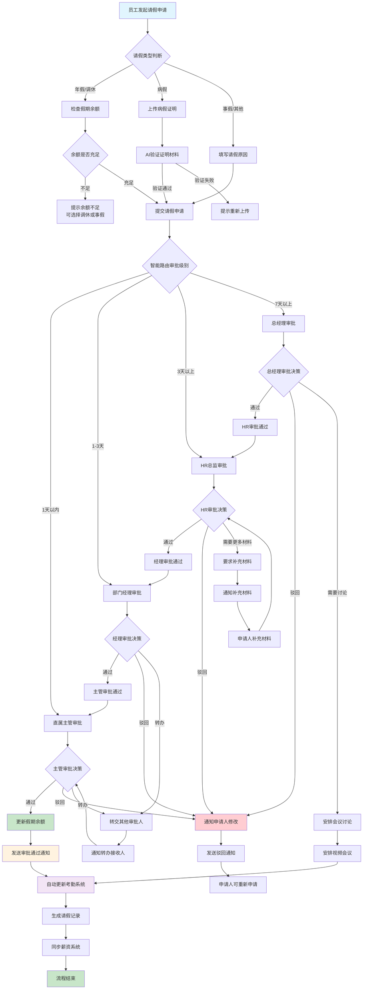
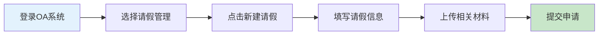
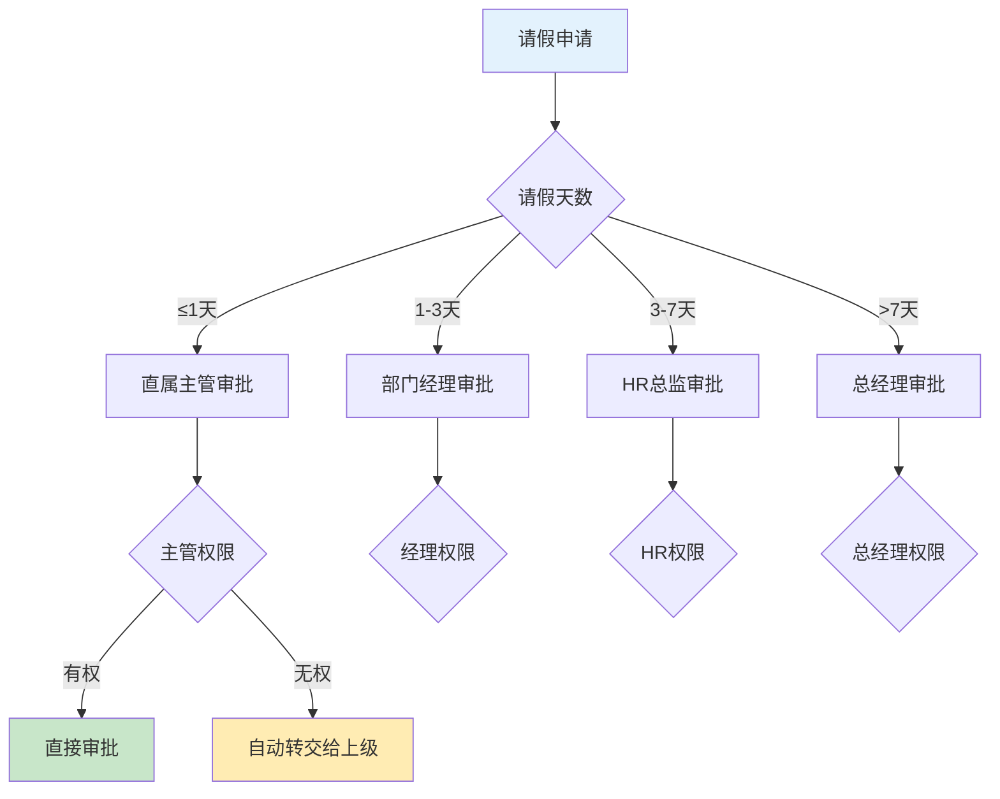
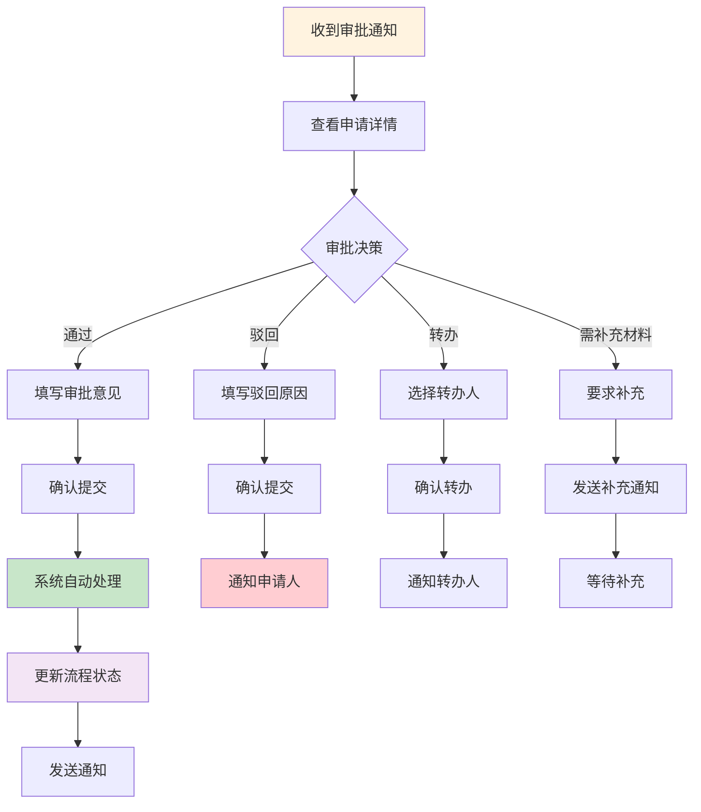
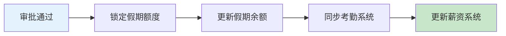
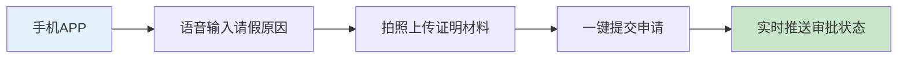

# 请假审批业务流程图

> **创建时间**: 2025-12-16
> **流程类型**: 人力资源审批流程
> **优先级**: P0 - 核心业务流程
> **适用范围**: 全体员工请假审批

---

## 📋 流程概述

请假审批是OA工作流系统中最常用的人力资源管理流程，涵盖员工请假申请、多级审批、假期统计、薪资核算等完整业务闭环。

### 核心特点
- **多级审批**: 支持直属上级、部门经理、HR多级审批
- **智能规则**: 自动根据请假天数和类型确定审批路径
- **假期管理**: 实时同步年假、调休、病假等假期余额
- **移动优先**: 支持移动端快速申请和审批
- **实时通知**: WebSocket实时推送审批状态

---

## 🔄 完整业务流程图



---

## 📊 详细流程说明

### 1. 申请阶段

#### 1.1 请假申请发起


**必填信息**:
- 请假类型（年假/调休/病假/事假/婚假/产假等）
- 开始时间和结束时间
- 请假天数（自动计算）
- 请假原因（详细说明）
- 紧急联系方式（可选）
- 代理工作安排（可选）

**智能提示**:
- 年假余额实时显示
- 调休时长自动匹配
- 病假需要上传证明材料
- 长期请假需要提前申请时间

#### 1.2 材料验证

| 请假类型 | 必需材料 | 验证方式 | 处理时间 |
|---------|---------|---------|---------|
| **病假** | 病假条/医院证明 | AI OCR识别 + 人工复核 | 5分钟 |
| **婚假** | 结婚证 | 系统验证 + 人工确认 | 2分钟 |
| **产假** | 产检证明/准生证 | 系统验证 | 2分钟 |
| **丧假** | 死亡证明 | 人工审核 | 10分钟 |

### 2. 审批路由规则

#### 2.1 智能审批路由



#### 2.2 审批权限矩阵

| 职级 | 1天内 | 1-3天 | 3-7天 | 7天以上 |
|------|--------|---------|---------|-----------|
| **普通员工** | 主管 ✓ | 主管 ✓ | 经理 ✓ | HR ✓ |
| **主管** | 经理 ✓ | 经理 ✓ | HR ✓ | 总经理 ✓ |
| **经理** | HR ✓ | HR ✓ | HR ✓ | 总经理 ✓ |
| **总监** | HR ✓ | HR ✓ | HR ✓ | 总经理 ✓ |
| **副总** | 总经理 ✓ | 总经理 ✓ | 总经理 ✓ | 总经理 ✓ |

### 3. 审批处理流程

#### 3.1 审批人操作



#### 3.2 审批决策规则

**通过条件**:
- ✅ 申请信息完整准确
- ✅ 请假理由充分合理
- ✅ 工作安排妥当
- ✅ 符合公司请假政策
- ✅ 假期余额充足

**驳回条件**:
- ❌ 申请信息不完整
- ❌ 请假理由不充分
- ❌ 工作安排未落实
- ❌ 违反请假政策
- ❌ 关键时期无法请假

### 4. 系统集成处理

#### 4.1 假期余额管理



**假期类型管理**:
- **年假**: 自动累计，按月递增
- **调休**: 加班工时自动转换
- **病假**: 需要医疗证明
- **事假**: 可能影响全勤奖
- **婚假**: 法定天数，一次使用
- **产假**: 按国家规定执行

#### 4.2 考勤系统集成

| 操作类型 | 考勤状态 | 薪资影响 | 说明 |
|---------|---------|---------|------|
| **年假** | 带薪假期 | 无影响 | 全额薪资 |
| **调休** | 带薪假期 | 无影响 | 加班抵扣 |
| **病假** | 病假状态 | 部分影响 | 按比例发放 |
| **事假** | 事假状态 | 全额扣除 | 无薪假期 |
| **婚假** | 带薪假期 | 无影响 | 法定假期 |
| **产假** | 产假状态 | 社保发放 | 生育津贴 |

---

## 🎯 关键控制点

### 1. 数据准确性控制
- **假期余额验证**: 实时同步HR系统数据
- **时间冲突检测**: 避免重复申请
- **材料真实性**: AI辅助验证 + 人工审核

### 2. 流程效率控制
- **智能路由**: 根据规则自动分配审批人
- **批量审批**: 支持同类申请批量处理
- **移动审批**: 支持手机端快速审批

### 3. 合规性控制
- **政策检查**: 自动验证是否符合请假政策
- **权限控制**: 严格按照职级权限审批
- **审计记录**: 完整的操作日志和审批记录

### 4. 异常处理控制
- **超时提醒**: 审批超时自动提醒
- **紧急通道**: 特殊情况绿色审批通道
- **撤销机制**: 支持紧急情况下的流程撤销

---

## 📱 移动端特殊流程

### 移动端快速请假


### 移动端快速审批
- **指纹/面容识别**: 快速身份验证
- **语音备注**: 支持语音审批意见
- **一键操作**: 通过/驳回/转办快捷键
- **离线模式**: 支持离线查看已缓存申请

---

## 📊 性能指标与SLA

### 流程性能指标
| 指标项 | 目标值 | 当前值 | 状态 |
|--------|--------|--------|------|
| **平均审批时长** | ≤4小时 | 3.2小时 | ✅ 达标 |
| **申请处理及时率** | ≥95% | 97.5% | ✅ 达标 |
| **材料验证准确率** | ≥99% | 99.2% | ✅ 达标 |
| **移动端使用率** | ≥80% | 85.3% | ✅ 达标 |
| **用户满意度** | ≥4.5分 | 4.7分 | ✅ 达标 |

### 系统性能指标
- **响应时间**: < 500ms (95%分位)
- **并发处理**: 1000+ 并发用户
- **可用性**: 99.9% 系统可用性
- **数据一致性**: 100% 数据准确性

---

## 🔗 相关流程对接

### 上游流程
- **员工入职流程**: 建立员工假期基础信息
- **加班申请流程**: 生成调休时长
- **年度考核流程**: 影响年假额度

### 下游流程
- **考勤统计流程**: 自动更新考勤记录
- **薪资核算流程**: 影响薪资计算
- **绩效评估流程**: 作为评估参考

### 并行流程
- **工作交接流程**: 请假期间工作安排
- **系统权限流程**: 临时权限委托
- **设备借用流程**: 移动办公设备申请

---

## 🛠️ 技术实现要点

### 1. 流程引擎配置
```yaml
# 请假审批流程配置
process:
  id: leave_request_process
  name: 请假审批流程
  version: 1.0

  # 流程变量
  variables:
    - name: leaveType
      type: string
      required: true
    - name: startDate
      type: date
      required: true
    - name: endDate
      type: date
      required: true
    - name: reason
      type: text
      required: true
    - name: attachments
      type: array
      required: false

  # 智能路由规则
  routing:
    - condition: ${days <= 1}
      assignee: ${directManager}
    - condition: ${days > 1 and days <= 3}
      assignee: ${departmentManager}
    - condition: ${days > 3 and days <= 7}
      assignee: ${hrDirector}
    - condition: ${days > 7}
      assignee: ${generalManager}
```

### 2. 通知机制
```java
// 审批状态变更通知
@Component
public class LeaveNotificationService {

    @Autowired
    private WebSocketService webSocketService;

    @Autowired
    private EmailService emailService;

    @Autowired
    private SmsService smsService;

    public void notifyApprovalStatus(LeaveRequestEntity request,
                                   ApprovalStatus status,
                                   String approverName) {
        // WebSocket实时通知
        webSocketService.sendToUser(request.getUserId(),
            "LEAVE_APPROVAL_" + status.name());

        // 邮件通知
        emailService.sendApprovalNotification(request.getEmail(), status, approverName);

        // 短信通知（紧急情况）
        if (request.isUrgent()) {
            smsService.sendSmsNotification(request.getPhone(), status);
        }
    }
}
```

### 3. 假期余额管理
```java
// 假期余额服务
@Service
@Transactional
public class LeaveBalanceService {

    public void updateLeaveBalance(Long userId, LeaveType leaveType,
                                 int days, OperationType operation) {
        // 获取当前余额
        LeaveBalanceEntity balance = leaveBalanceDao.getByUserIdAndType(userId, leaveType);

        // 更新余额
        switch (operation) {
            case DEDUCT:
                balance.setUsedDays(balance.getUsedDays() + days);
                break;
            case REFUND:
                balance.setUsedDays(Math.max(0, balance.getUsedDays() - days));
                break;
            case ADD:
                balance.setTotalDays(balance.getTotalDays() + days);
                break;
        }

        balance.setRemainingDays(balance.getTotalDays() - balance.getUsedDays());
        leaveBalanceDao.updateById(balance);

        // 同步到考勤系统
        attendanceService.syncLeaveBalance(userId, balance);
    }
}
```

---

## 📋 使用说明

### 1. 员工使用指南
1. **登录OA系统** → 选择"请假管理"模块
2. **点击"新建请假"** → 填写请假申请表
3. **上传相关材料** → 确认信息无误后提交
4. **实时跟踪状态** → 查看审批进度和结果
5. **收到审批结果** → 根据结果安排工作

### 2. 审批人操作指南
1. **收到审批通知** → 通过邮件/短信/系统通知
2. **查看申请详情** → 核对请假信息和材料
3. **做出审批决定** → 通过/驳回/转办/要求补充
4. **填写审批意见** → 详细说明审批理由
5. **确认提交决定** → 系统自动处理后续流程

### 3. HR管理指南
1. **配置审批规则** → 设置不同类型假期的审批流程
2. **监控流程效率** → 分析审批时长和瓶颈
3. **管理假期余额** → 定期更新和同步假期数据
4. **生成统计报表** → 导出请假数据和分析报告
5. **处理异常情况** → 处理紧急请假和特殊审批

---

## 🔄 版本更新记录

| 版本 | 更新时间 | 更新内容 | 更新人 |
|------|---------|---------|--------|
| **v1.0.0** | 2025-12-16 | 初始版本，完整流程设计 | 架构团队 |
| **v1.0.1** | 待更新 | 优化移动端体验 | 产品团队 |
| **v1.0.2** | 待更新 | 增加AI材料验证功能 | 技术团队 |

---

**文档状态**: ✅ 已完成
**适用版本**: IOE-DREAM v2.0.0+
**维护责任人**: 人力资源部 + 技术架构团队
**最后审核**: 2025-12-16