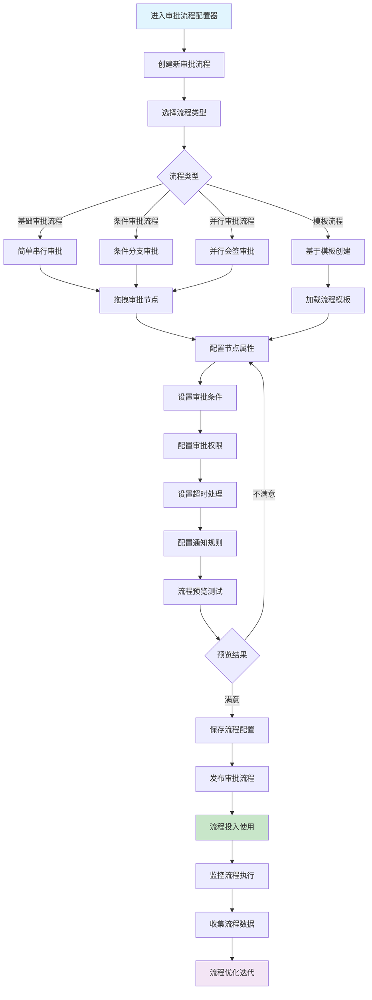
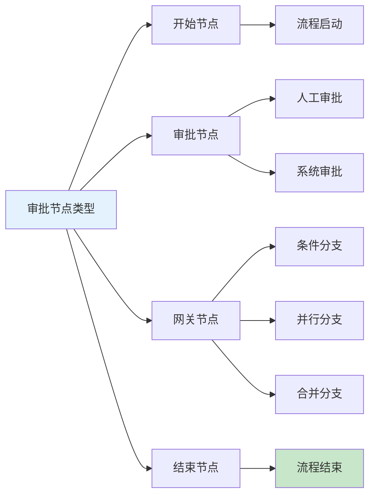
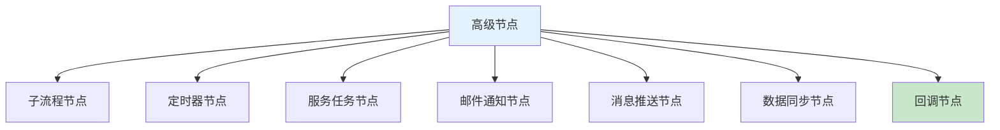
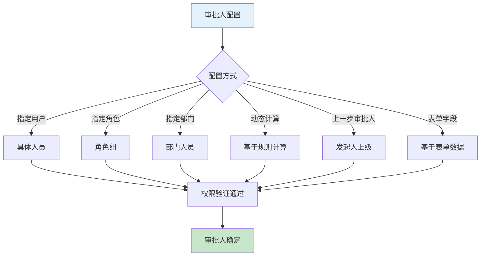
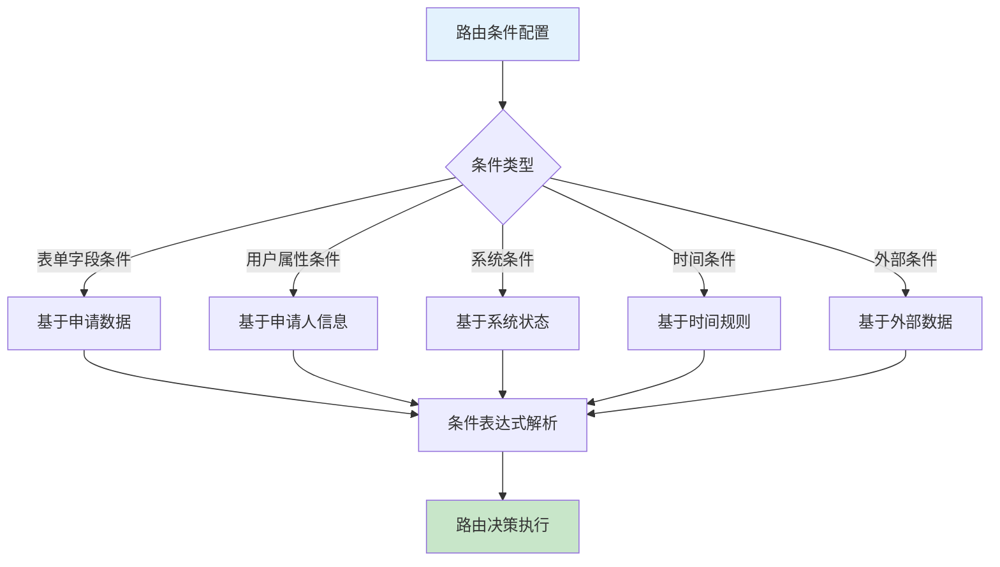
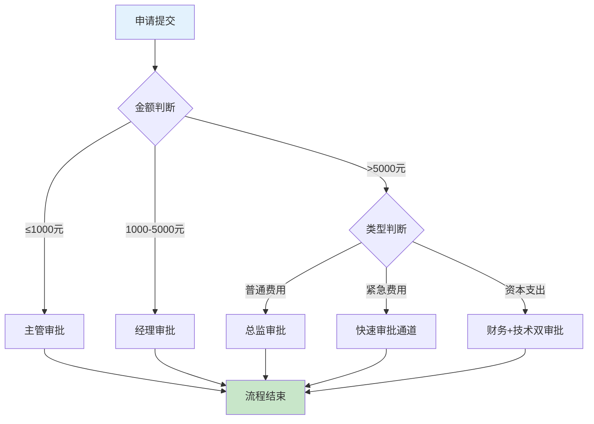
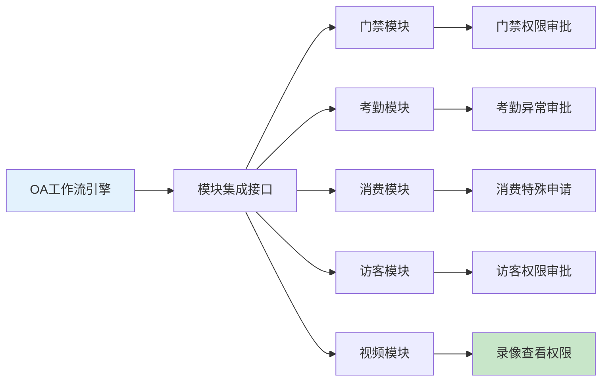
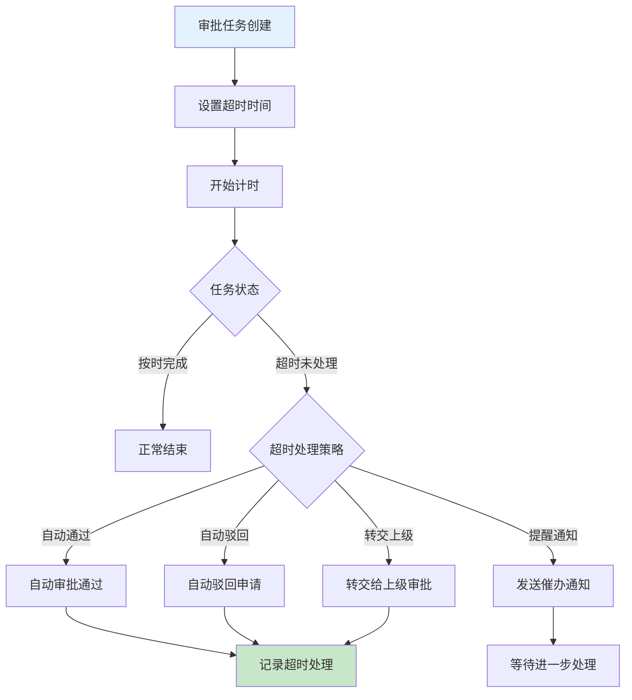
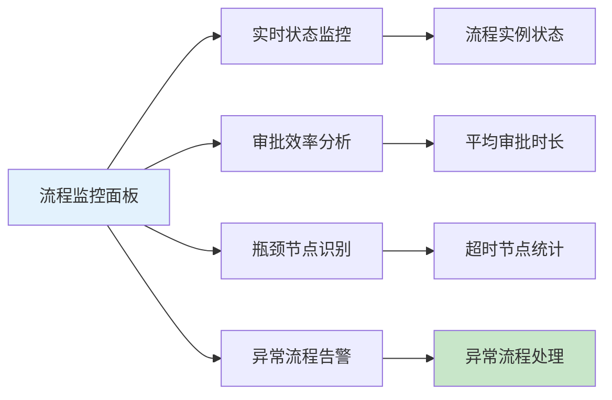

# 审批流程配置器业务流程图

> **创建时间**: 2025-12-16
> **流程类型**: OA工作流核心功能
> **优先级**: P0 - 核心架构功能
> **适用范围**: 企业级审批流程设计与配置

---

## 📋 功能概述

审批流程配置器是OA工作流系统的核心引擎，提供可视化审批流程设计、节点配置、条件路由、权限控制、超时处理等完整的企业级审批流程构建能力，支持业务人员无需编程即可创建复杂的审批流程。

### 核心特点
- **可视化流程设计**: 拖拽式流程节点设计，所见即所得
- **智能路由引擎**: 基于条件自动路由审批流程
- **灵活权限控制**: 精细化审批权限和角色管理
- **多级审批支持**: 支持串行、并行、条件分支等多种审批模式
- **跨系统集成**: 与其他业务模块无缝集成，支持跨模块审批

---

## 🔄 审批流程配置器完整流程图



---

## 📊 审批节点类型详解

### 1. 基础审批节点



#### 节点功能矩阵

| 节点类型 | 功能描述 | 配置复杂度 | 使用场景 | 执行方式 |
|---------|---------|-----------|---------|---------|
| **开始节点** | 流程起点，发起申请 | 简单 | 所有流程 | 自动执行 |
| **审批节点** | 人工审批决策 | 中等 | 需要人工决策 | 人工执行 |
| **系统节点** | 系统自动处理 | 简单 | 自动化处理 | 系统执行 |
| **条件网关** | 基于条件分支 | 中等 | 条件判断 | 系统执行 |
| **并行网关** | 并行处理分支 | 复杂 | 需要多人会签 | 系统执行 |
| **合并网关** | 合并并行分支 | 复杂 | 汇总并行结果 | 系统执行 |
| **结束节点** | 流程终点 | 简单 | 所有流程 | 自动执行 |

### 2. 高级审批节点



#### 高级节点特性

| 节点名称 | 技术实现 | 集成能力 | 业务价值 | 配置难度 |
|-----------|---------|---------|---------|----------|
| **子流程节点** | 调用其他审批流程 | ✅ 支持嵌套调用 | 流程复用，提高效率 | 复杂 |
| **定时器节点** | 延时执行和超时处理 | ✅ 定时任务集成 | 自动化超时处理 | 中等 |
| **服务任务节点** | 调用外部API服务 | ✅ REST API集成 | 系统间数据交互 | 中等 |
| **邮件通知节点** | 自动发送邮件通知 | ✅ 邮件系统集成 | 及时通知相关人员 | 简单 |
| **消息推送节点** | 实时消息推送 | ✅ WebSocket集成 | 实时状态通知 | 简单 |
| **数据同步节点** | 同步数据到其他系统 | ✅ 数据库集成 | 数据一致性保证 | 中等 |
| **回调节点** | 等待外部回调 | ✅ 第三方集成 | 异步处理支持 | 复杂 |

---

## 🎛️ 审批权限配置

### 1. 审批人配置方式



#### 审批人配置策略

| 配置策略 | 实现方式 | 适用场景 | 灵活性 | 维护成本 |
|---------|---------|---------|--------|----------|
| **指定用户** | 直接选择用户 | 固定审批人员 | 低 | 低 |
| **角色配置** | 按角色选择 | 同角色多人审批 | 中 | 中 |
| **部门配置** | 按部门层级 | 组织结构审批 | 高 | 低 |
| **动态计算** | 基于业务规则 | 复杂业务逻辑 | 很高 | 高 |
| **上级审批** | 组织关系 | 逐级审批 | 中 | 低 |
| **表单字段** | 数据驱动 | 基于申请内容动态分配 | 很高 | 中 |

### 2. 审批权限矩阵

```javascript
// 审批权限配置示例
{
  "processId": "expense_approval",
  "nodes": [
    {
      "nodeId": "manager_approval",
      "nodeName": "部门经理审批",
      "assigneeType": "department_manager",
      "assigneeValue": "${applicant.departmentId}",
      "permissions": {
        "canApprove": true,
        "canReject": true,
        "canDelegate": true,
        "canTransfer": true,
        "canViewAttachments": true
      },
      "conditions": {
        "amount": {
          "operator": "<=",
          "value": 5000
        }
      }
    },
    {
      "nodeId": "director_approval",
      "nodeName": "总监审批",
      "assigneeType": "role",
      "assigneeValue": "FINANCE_DIRECTOR",
      "permissions": {
        "canApprove": true,
        "canReject": true,
        "canDelegate": false,
        "canTransfer": true,
        "canViewAttachments": true
      },
      "conditions": {
        "amount": {
          "operator": ">",
          "value": 5000
        }
      }
    }
  ]
}
```

---

## 🔄 条件路由引擎

### 1. 路由条件类型



#### 路由条件示例

| 条件类型 | 表达式示例 | 说明 | 应用场景 |
|---------|-----------|------|---------|
| **数值比较** | ${amount} > 10000 | 金额大于1万 | 大额报销特殊审批 |
| **字符串匹配** | ${type} == 'URGENT' | 类型为紧急 | 紧急申请快速通道 |
| **包含判断** | ${department} contains '技术' | 部门包含技术 | 技术部门特殊流程 |
| **日期范围** | ${submitDate} between '2024-01-01' and '2024-12-31' | 年度内申请 | 年度预算控制 |
| **用户级别** | ${applicant.level} >= 3 | 申请人级别3级以上 | 高级人员简化流程 |
| **系统状态** | ${system.maintenance} == false | 非系统维护期 | 避免维护期审批 |

### 2. 复杂路由配置



---

## 📱 跨模块审批联动

### 1. 模块集成架构



### 2. 跨模块审批场景

| 集成模块 | 审批场景 | 触发条件 | 审批流程 | 处理结果 |
|---------|---------|---------|---------|---------|
| **门禁模块** | 特殊门禁权限 | 访问限制区域 | 部门经理+安保 | 临时门禁授权 |
| **考勤模块** | 异常考勤处理 | 考勤异常数据 | HR+部门经理 | 考勤记录修正 |
| **消费模块** | 大额消费申请 | 单次消费>1000元 | 财务+申请人 | 消费预授权 |
| **访客模块** | VIP访客接待 | 重要访客申请 | 接待部门+安保 | 访客通行权限 |
| **视频模块** | 录像查看权限 | 查看敏感录像 | 法务+部门主管 | 临时查看授权 |

---

## ⏰ 超时处理机制

### 1. 超时处理策略



#### 超时处理配置

| 处理策略 | 适用场景 | 配置参数 | 风险等级 |
|---------|---------|---------|---------|
| **自动通过** | 低风险审批 | 超时时间=24小时 | 低 |
| **自动驳回** | 时效性强审批 | 超时时间=4小时 | 中 |
| **转交上级** | 重要审批 | 超时时间=8小时 | 低 |
| **催办通知** | 一般审批 | 超时时间=12小时 | 低 |
| **升级处理** | 紧急审批 | 超时时间=2小时 | 中 |

### 2. 提醒通知机制

```java
@Component
public class ApprovalTimeoutService {

    @Scheduled(fixedRate = 300000) // 5分钟检查一次
    public void checkTimeoutTasks() {
        List<ApprovalTask> timeoutTasks = approvalTaskDao.findTimeoutTasks();

        for (ApprovalTask task : timeoutTasks) {
            TimeoutConfig config = getTimeoutConfig(task.getProcessId());

            switch (config.getAction()) {
                case AUTO_APPROVE:
                    autoApproveTask(task);
                    break;
                case AUTO_REJECT:
                    autoRejectTask(task);
                    break;
                case ESCALATE:
                    escalateTask(task);
                    break;
                case NOTIFY:
                    sendTimeoutNotification(task);
                    break;
            }
        }
    }
}
```

---

## 📊 流程监控与分析

### 1. 流程执行监控



### 2. 关键监控指标

| 监控指标 | 计算方式 | 目标值 | 告警阈值 |
|---------|---------|--------|---------|
| **平均审批时长** | 总审批时长÷审批数量 | ≤24小时 | >48小时 |
| **审批及时率** | 按时完成数÷总审批数 | ≥90% | <85% |
| **流程完成率** | 完成流程数÷启动流程数 | ≥95% | <90% |
| **超时处理率** | 超时处理数÷超时任务数 | ≥80% | <70% |
| **用户满意度** | 用户评分平均分 | ≥4.5分 | <4.0分 |

---

## 🛠️ 技术实现架构

### 1. 流程引擎核心

```java
@Service
public class ApprovalProcessEngine {

    @Autowired
    private ProcessDefinitionService definitionService;

    @Autowired
    private ProcessInstanceService instanceService;

    @Autowired
    private TaskService taskService;

    /**
     * 启动审批流程
     */
    public ProcessInstance startProcess(String processId, Map<String, Object> variables) {
        // 获取流程定义
        ProcessDefinition definition = definitionService.getProcessDefinition(processId);

        // 创建流程实例
        ProcessInstance instance = instanceService.createInstance(definition, variables);

        // 执行开始节点
        executeStartNode(instance);

        // 路由到第一个审批节点
        routeToNextNode(instance);

        return instance;
    }

    /**
     * 完成审批任务
     */
    public void completeTask(String taskId, Map<String, Object> variables) {
        ApprovalTask task = taskService.getTask(taskId);

        // 验证审批权限
        validateApprovalPermission(task, getCurrentUser());

        // 执行审批动作
        executeApprovalAction(task, variables);

        // 路由到下一节点
        routeToNextNode(task.getProcessInstance());

        // 检查流程是否结束
        checkProcessCompletion(task.getProcessInstance());
    }
}
```

### 2. 条件路由引擎

```java
@Component
public class ConditionRoutingEngine {

    /**
     * 执行条件路由
     */
    public String route(String processId, Map<String, Object> variables) {
        // 获取当前节点的路由规则
        List<RouteRule> rules = routingRuleDao.findByProcessId(processId);

        // 遍历路由规则
        for (RouteRule rule : rules) {
            if (evaluateCondition(rule.getCondition(), variables)) {
                return rule.getTargetNodeId();
            }
        }

        // 默认路由
        return getDefaultRoute(processId);
    }

    /**
     * 评估路由条件
     */
    private boolean evaluateCondition(String condition, Map<String, Object> variables) {
        // 使用表达式引擎解析条件
        Expression expression = expressionEngine.parseExpression(condition);
        return expression.evaluate(variables, Boolean.class);
    }
}
```

---

## 📋 使用指南

### 1. 流程配置步骤

1. **登录OA系统** → 进入"审批流程配置器"
2. **创建新流程** → 选择流程类型或模板
3. **拖拽节点** → 设计流程结构和节点
4. **配置节点** → 设置每个节点的属性和权限
5. **设置路由** → 配置节点间的流转条件
6. **配置通知** → 设置审批状态通知规则
7. **测试流程** → 使用测试数据验证流程
8. **发布流程** → 将配置好的流程发布使用

### 2. 最佳实践建议

| 实践建议 | 具体说明 | 预期收益 |
|---------|---------|---------|
| **流程简化** | 避免过度复杂的审批流程 | 提升审批效率 |
| **权限分离** | 审批权限和申请权限分离 | 保证审批公正性 |
| **超时控制** | 合理设置审批超时时间 | 避免流程积压 |
| **异常处理** | 完善的异常情况处理机制 | 提高流程鲁棒性 |
| **数据分析** | 定期分析流程执行数据 | 持续优化流程设计 |

---

## 🔄 版本更新记录

| 版本 | 更新时间 | 更新内容 | 更新人 |
|------|---------|---------|--------|
| **v1.0.0** | 2025-12-16 | 初始版本，审批流程配置器核心功能 | 产品团队 |
| **v1.0.1** | 待更新 | 增加更多跨模块集成能力 | 技术团队 |
| **v1.0.2** | 待更新 | 优化条件路由引擎性能 | 架构团队 |

---

**文档状态**: ✅ 已完成
**适用版本**: IOE-DREAM v2.0.0+
**维护责任人**: 产品部 + 技术架构团队
**最后审核**: 2025-12-16