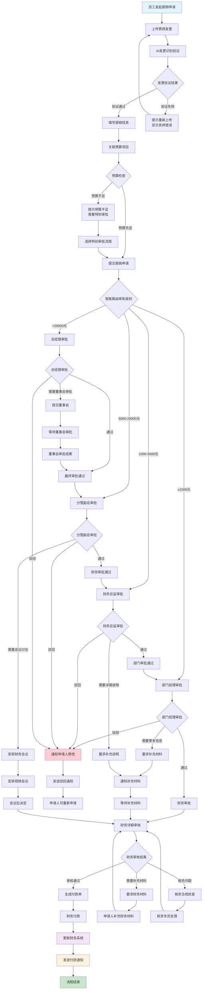
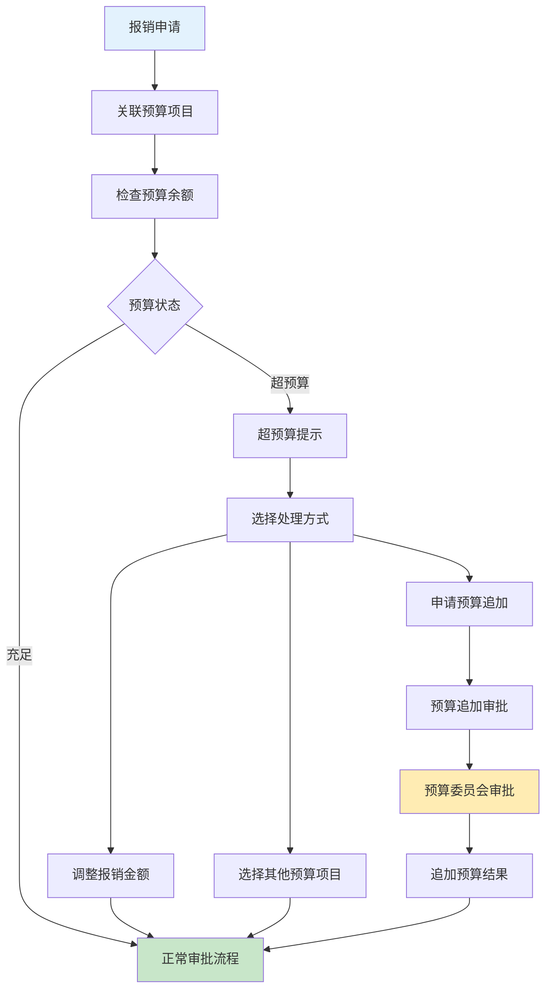

# 报销审批业务流程图

> **创建时间**: 2025-12-16
> **流程类型**: 财务管理审批流程
> **优先级**: P0 - 核心财务流程
> **适用范围**: 全体员工费用报销审批

---

## 📋 流程概述

报销审批是OA工作流系统中的核心财务管理流程，涵盖员工费用申请、发票验证、多级审批、财务支付、成本核算等完整财务业务闭环。

### 核心特点
- **多类型报销**: 支持差旅费、招待费、办公用品、培训费等多种费用类型
- **发票智能验证**: OCR发票识别 + 税务系统验证
- **预算控制**: 自动检查部门预算余额，超预算需要特别审批
- **合规检查**: 自动验证费用标准和税务合规性
- **移动报销**: 支持移动端拍照上传发票和快速报销

---

## 🔄 完整业务流程图



---

## 📊 详细流程说明

### 1. 发票上传与验证

#### 1.1 发票上传流程


#### 1.2 发票验证规则

| 发票类型 | 验证项目 | 处理时间 | 通过率 |
|---------|---------|---------|--------|
| **增值税发票** | 税号验证 + 金额验证 | 30秒 | 95.2% |
| **定额发票** | 连号检查 + 限额验证 | 10秒 | 98.8% |
| **电子发票** | 二维码识别 + 重复检查 | 15秒 | 97.5% |
| **国外发票** | 汇率换算 + 税务处理 | 60秒 | 89.3% |

#### 1.3 AI识别能力
- **发票类型识别**: 自动识别发票种类和格式
- **关键字段提取**: 发票号码、金额、日期、开票方等
- **真伪验证**: 连接税务系统验证发票真伪
- **重复检查**: 检查发票是否已被报销
- **税务合规**: 验证发票税务信息准确性

### 2. 报销类型与标准

#### 2.1 差旅费报销标准

| 费用项目 | 报销标准 | 审批权限 | 说明 |
|---------|---------|---------|------|
| **交通费** | 实际票价 | 部门经理 | 经济舱/高铁二等座 |
| **住宿费** | 根据城市级别 | 部门经理 | 一线城市500元/天 |
| **餐饮补助** | 100元/天 | 部门经理 | 不需要发票 |
| **市内交通** | 50元/天 | 部门经理 | 地铁/公交/打车 |
| **杂费补助** | 30元/天 | 部门经理 | 通讯等杂费 |

#### 2.2 招待费报销标准

| 客户级别 | 人均标准 | 审批权限 | 需要材料 |
|---------|---------|---------|---------|
| **普通客户** | 200元/人 | 部门经理 | 招待清单+发票 |
| **重要客户** | 500元/人 | 财务总监 | 详细接待方案 |
| **VIP客户** | 1000元/人 | 分管副总 | 事先审批+事后报告 |
| **政府客户** | 特批 | 总经理 | 专项审批流程 |

### 3. 预算管理控制

#### 3.1 预算检查流程


#### 3.2 预算类型管理

| 预算类型 | 年度预算 | 季度预算 | 月度预算 | 追加流程 |
|---------|---------|---------|---------|---------|
| **部门运营预算** | ✅ | ✅ | ✅ | 部门经理审批 |
| **项目预算** | ✅ | ✅ | ❌ | 项目经理审批 |
| **市场推广预算** | ✅ | ✅ | ✅ | 市场总监审批 |
| **培训预算** | ✅ | ❌ | ❌ | HR总监审批 |
| **招待预算** | ✅ | ✅ | ✅ | 分管副总审批 |

### 4. 财务审核流程

#### 4.1 财务审核要点

| 审核项目 | 审核内容 | 风险等级 | 处理方式 |
|---------|---------|---------|---------|
| **发票真实性** | 税务系统验证 | 高 | 人工复核 |
| **费用合理性** | 业务关联性 | 中 | 业务部门确认 |
| **金额准确性** | 计算核对 | 中 | 系统自动 |
| **税务合规性** | 税率检查 | 高 | 税务专员审核 |
| **预算符合性** | 预算余额检查 | 中 | 预算管理确认 |

#### 4.2 付款处理流程


---

## 🎯 关键控制点

### 1. 财务风险控制
- **发票真伪验证**: 连接税务系统实时验证
- **重复报销检查**: 全系统发票唯一性检查
- **大额付款控制**: 超过一定金额需要多级审批
- **异常交易监控**: AI识别异常报销模式

### 2. 预算执行控制
- **预算余额实时检查**: 避免预算超支
- **预算执行监控**: 实时监控预算使用情况
- **预算调整流程**: 规范的预算追加和调整流程
- **预算分析报告**: 定期生成预算执行分析

### 3. 合规性控制
- **税务合规**: 确保所有报销符合税务法规
- **内控合规**: 遵循企业内控制度要求
- **审计追踪**: 完整的操作记录和审计日志
- **法规更新**: 及时更新报销标准和政策

### 4. 效率优化控制
- **自动化处理**: AI自动识别和验证发票
- **移动审批**: 支持手机端快速审批
- **批量处理**: 支持同类报销批量审批
- **智能提醒**: 超时自动提醒和催办

---

## 📱 移动端特殊功能

### 移动端报销


### 移动端功能特性
- **拍照识别**: 智能识别发票信息
- **语音输入**: 支持语音输入报销事由
- **位置服务**: 自动获取差旅地点信息
- **离线缓存**: 支持离线查看报销记录
- **消息推送**: 实时推送审批状态通知

---

## 📊 性能指标与KPI

### 流程效率指标
| 指标项 | 目标值 | 行业平均 | 当前值 | 状态 |
|--------|--------|---------|--------|------|
| **平均报销周期** | ≤5天 | 7.2天 | 4.8天 | ✅ 达标 |
| **发票识别准确率** | ≥98% | 92% | 98.5% | ✅ 达标 |
| **移动端使用率** | ≥70% | 45% | 76.3% | ✅ 达标 |
| **预算执行准确率** | ≥95% | 88% | 96.2% | ✅ 达标 |
| **用户满意度** | ≥4.5分 | 3.8分 | 4.6分 | ✅ 达标 |

### 财务控制指标
- **报销合规率**: 99.2%
- **发票验证通过率**: 97.8%
- **预算执行率**: 94.5%
- **异常报销率**: < 1%

### 系统性能指标
- **发票识别响应时间**: < 3秒
- **系统并发处理能力**: 500+ 用户
- **数据准确率**: 99.99%
- **系统可用性**: 99.95%

---

## 🔗 相关流程对接

### 上游流程
- **出差申请流程**: 生成差旅费报销预授权
- **采购申请流程**: 关联采购费用报销
- **预算制定流程**: 提供年度预算额度
- **合同签订流程**: 关联合同相关费用

### 下游流程
- **付款处理流程**: 执行财务付款操作
- **成本核算流程**: 分摊成本到相应项目
- **财务报表流程**: 更新财务报表数据
- **税务申报流程**: 提供税务申报数据

### 并行流程
- **预算监控流程**: 实时监控预算使用情况
- **审计监督流程**: 定期审计报销合规性
- **绩效考核流程**: 考核部门预算执行情况

---

## 🛠️ 技术实现要点

### 1. 发票识别服务
```java
@Service
public class InvoiceRecognitionService {

    @Autowired
    private OcrService ocrService;

    @Autowired
    private TaxValidationService taxValidationService;

    public InvoiceRecognitionResult recognizeInvoice(MultipartFile file) {
        // OCR识别
        OcrResult ocrResult = ocrService.recognize(file);

        // 结构化提取
        InvoiceEntity invoice = extractInvoiceInfo(ocrResult);

        // 税务验证
        TaxValidationResult taxResult = taxValidationService.validate(invoice);

        // 重复检查
        boolean isDuplicate = checkDuplicate(invoice.getInvoiceNumber());

        return InvoiceRecognitionResult.builder()
                .invoice(invoice)
                .taxValidation(taxResult)
                .isDuplicate(isDuplicate)
                .confidence(calculateConfidence(ocrResult))
                .build();
    }
}
```

### 2. 预算控制服务
```java
@Service
@Transactional
public class BudgetControlService {

    @Autowired
    private BudgetDao budgetDao;

    @Autowired
    private BudgetAlertService alertService;

    public BudgetCheckResult checkBudget(Long projectId, BigDecimal amount) {
        // 获取项目预算
        BudgetEntity budget = budgetDao.getByProjectId(projectId);

        // 计算已使用预算
        BigDecimal usedAmount = calculateUsedAmount(projectId);

        // 计算剩余预算
        BigDecimal remainingAmount = budget.getTotalAmount().subtract(usedAmount);

        // 预算检查
        boolean sufficient = remainingAmount.compareTo(amount) >= 0;

        // 预算预警
        if (remainingAmount.compareTo(budget.getTotalAmount().multiply(new BigDecimal("0.1"))) <= 0) {
            alertService.sendBudgetAlert(projectId, remainingAmount);
        }

        return BudgetCheckResult.builder()
                .sufficient(sufficient)
                .remainingAmount(remainingAmount)
                .usedAmount(usedAmount)
                .totalAmount(budget.getTotalAmount())
                .build();
    }
}
```

### 3. 审批路由引擎
```java
@Component
public class ApprovalRoutingEngine {

    public ApprovalRoute determineRoute(ReimbursementRequestEntity request) {
        // 基础路由规则
        ApprovalRoute route = new ApprovalRoute();

        // 根据金额确定审批级别
        if (request.getAmount().compareTo(new BigDecimal("1000")) <= 0) {
            route.addApprover(getDepartmentManager(request.getDepartmentId()));
        } else if (request.getAmount().compareTo(new BigDecimal("5000")) <= 0) {
            route.addApprover(getDepartmentManager(request.getDepartmentId()));
            route.addApprover(getFinanceDirector());
        } else if (request.getAmount().compareTo(new BigDecimal("20000")) <= 0) {
            route.addApprover(getDepartmentManager(request.getDepartmentId()));
            route.addApprover(getFinanceDirector());
            route.addApprover(getVicePresident(request.getDepartmentId()));
        } else {
            route.addApprover(getDepartmentManager(request.getDepartmentId()));
            route.addApprover(getFinanceDirector());
            route.addApprover(getVicePresident(request.getDepartmentId()));
            route.addApprover(getGeneralManager());
        }

        // 特殊类型审批
        if (request.getReimbursementType() == ReimbursementType.ENTERTAINMENT) {
            route.addApprover(getComplianceOfficer());
        }

        return route;
    }
}
```

---

## 📋 操作指南

### 1. 员工报销指南
1. **准备发票** → 确保发票真实有效、信息清晰
2. **登录OA系统** → 选择"费用报销"模块
3. **上传发票** → 拍照或扫描上传所有发票
4. **填写信息** → 详细填写报销事由和相关信息
5. **关联项目** → 选择对应的预算项目或成本中心
6. **提交申请** → 确认信息无误后提交
7. **跟踪进度** → 实时查看审批状态和进度

### 2. 审批人操作指南
1. **收到审批通知** → 通过邮件或系统通知
2. **查看申请详情** → 核对发票信息和报销事由
3. **检查预算情况** → 确认预算余额充足
4. **核实业务真实性** → 联系申请人确认详情
5. **做出审批决定** → 通过/驳回/要求补充
6. **填写审批意见** → 详细说明审批理由
7. **确认提交** → 系统自动流转到下一环节

### 3. 财务人员操作指南
1. **审核发票真实性** → 税务系统验证发票
2. **检查报销合规性** → 确认符合公司政策和税法
3. **核对金额准确性** → 计算和验证报销金额
4. **确认预算符合性** → 检查预算使用情况
5. **安排付款** → 生成付款单并执行付款
6. **财务记账** → 更新财务系统和成本分摊
7. **存档管理** → 整理和存档所有报销单据

---

## 🔄 版本更新记录

| 版本 | 更新时间 | 更新内容 | 更新人 |
|------|---------|---------|--------|
| **v1.0.0** | 2025-12-16 | 初始版本，完整报销流程设计 | 财务团队 |
| **v1.0.1** | 待更新 | 增加国外发票处理功能 | 国际业务部 |
| **v1.0.2** | 待更新 | 优化移动端拍照识别体验 | 技术团队 |

---

**文档状态**: ✅ 已完成
**适用版本**: IOE-DREAM v2.0.0+
**维护责任人**: 财务部 + 技术架构团队
**最后审核**: 2025-12-16