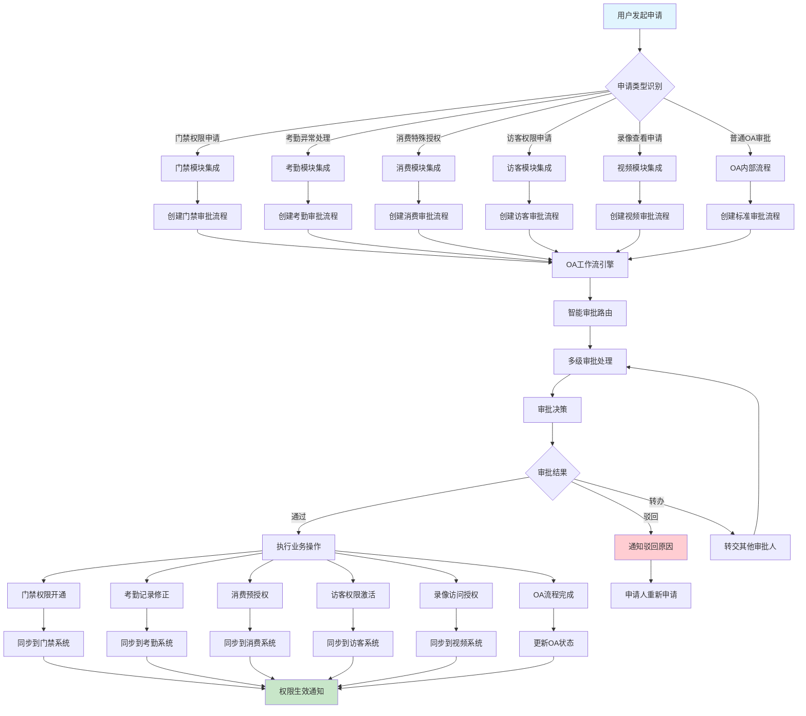
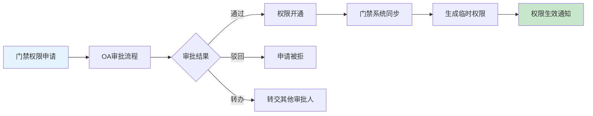
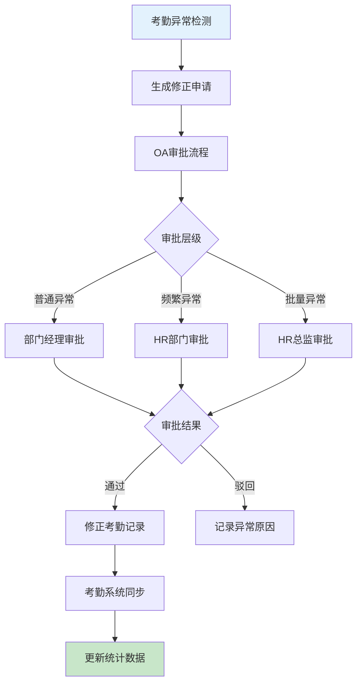
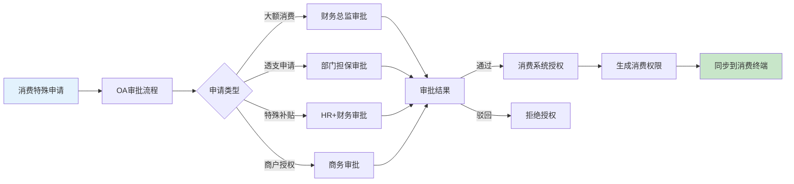
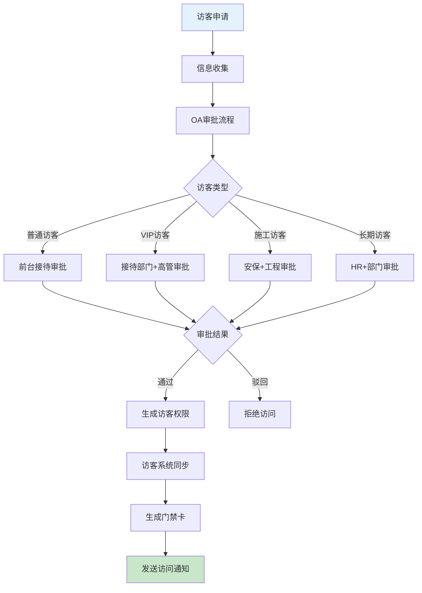
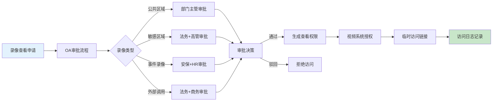
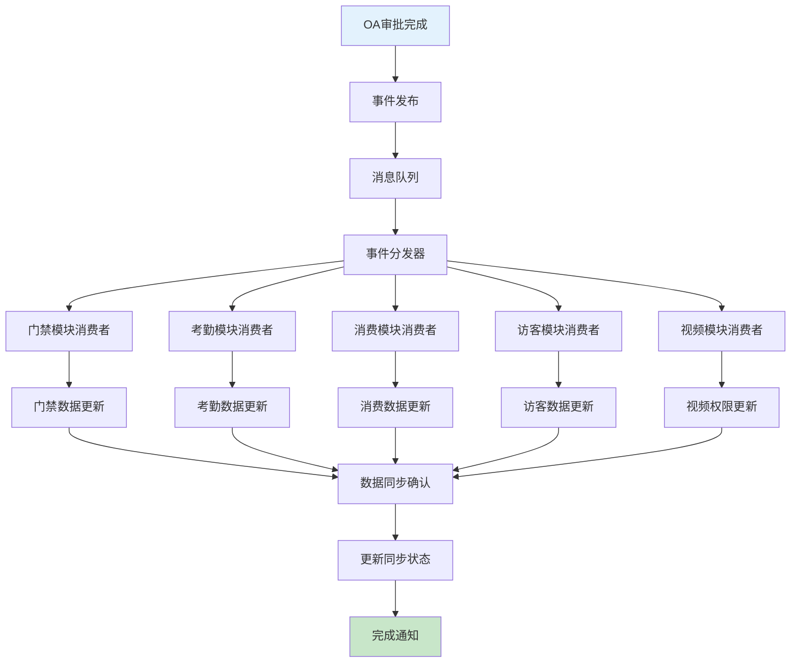
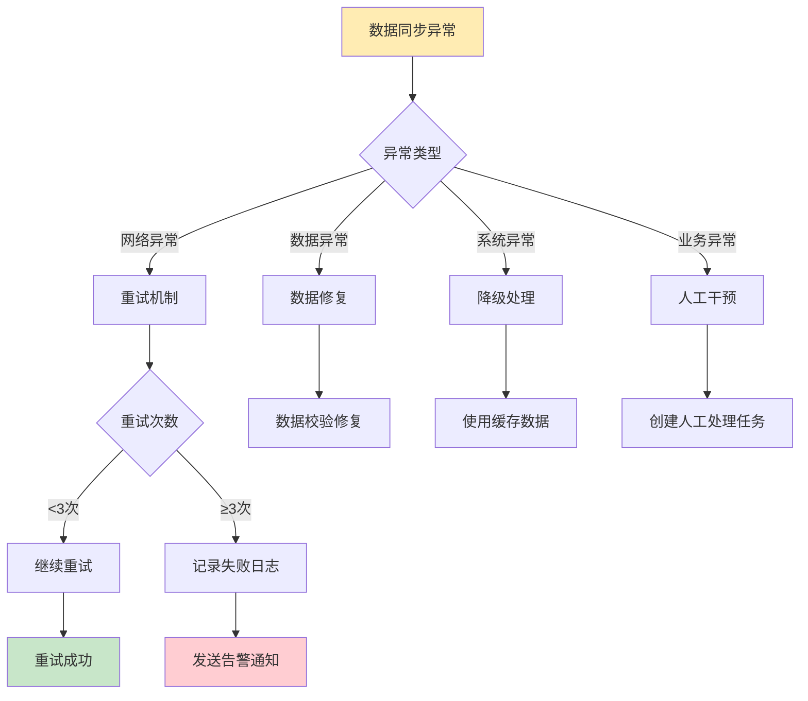

# 跨模块审批联动架构流程图

> **创建时间**: 2025-12-16
> **流程类型**: OA工作流系统集成架构
> **优先级**: P0 - 核心集成功能
> **适用范围**: IOE-DREAM全系统模块审批联动

---

## 📋 架构概述

跨模块审批联动是OA工作流系统的核心集成能力，实现OA审批引擎与门禁、考勤、消费、访客、视频等业务模块的深度集成，提供统一的审批入口、智能路由、数据同步、权限联动等完整的企业级审批联动解决方案。

### 核心特点
- **统一审批入口**: 所有模块审批请求统一通过OA工作流处理
- **智能路由分发**: 基于业务类型自动路由到对应模块处理
- **数据双向同步**: 审批结果与业务数据实时双向同步
- **权限联动控制**: 审批通过自动触发相关模块权限变更
- **全链路追踪**: 完整的审批流程操作日志和状态追踪

---

## 🔄 跨模块审批联动架构图



---

## 📊 各模块集成详细设计

### 1. 门禁模块审批集成



#### 门禁审批场景矩阵

| 申请类型 | 触发条件 | 审批流程 | 权限类型 | 有效期 |
|---------|---------|---------|---------|--------|
| **特殊区域访问** | 访问限制区域 | 部门经理+安保 | 临时门禁 | 申请时长 |
| **加班门禁权限** | 非工作时间访问 | 直属主管 | 延长门禁 | 加班时段 |
| **设备维护权限** | 设备区域维护 | 技术主管+安保 | 维护权限 | 维护时段 |
| **VIP客户访问** | 重要客户接待 | 接待部门+高管 | VIP权限 | 访问期间 |
| **紧急情况处理** | 紧急事件 | 值班经理自动通过 | 紧急权限 | 事件期间 |

### 2. 考勤模块审批集成



#### 考勤审批规则

| 异常类型 | 审批要求 | 审批人 | 处理方式 | 影响范围 |
|---------|---------|--------|---------|---------|
| **忘记打卡** | 当日申请 | 部门经理 | 手动修正 | 个人考勤 |
| **迟到早退** | 3天内申请 | 部门经理 | 说明原因 | 个人考勤 |
| **出差忘打卡** | 出差证明 | HR+部门经理 | 免责处理 | 个人考勤 |
| **批量系统异常** | 系统故障 | HR总监 | 批量修正 | 全员考勤 |
| **设备故障** | 维修证明 | IT+部门主管 | 人工记录 | 设备关联人员 |

### 3. 消费模块审批集成



#### 消费审批控制

| 控制类型 | 触发条件 | 审批层级 | 授权方式 | 控制效果 |
|---------|---------|---------|---------|---------|
| **单笔限额** | >1000元 | 财务总监 | 临时提升额度 | 单次交易 |
| **透支额度** | 余额不足 | 部门经理担保 | 担保透支 | 月度透支 |
| **商户授权** | 新增商户 | 商务部门 | 商户白名单 | 长期授权 |
| **时段控制** | 非正常时段 | 申请+审批 | 时段开放 | 临时时段 |
| **特殊补贴** | 餐饮补贴 | HR+财务 | 补贴发放 | 一次性补贴 |

### 4. 访客模块审批集成



#### 访客审批策略

| 访客类型 | 审批要求 | 审批时效 | 访问权限 | 安全等级 |
|---------|---------|---------|---------|---------|
| **普通访客** | 接待人审批 | 2小时内 | 指定区域 | 低 |
| **VIP访客** | 部门+高管 | 1小时内 | 全权限区域 | 高 |
| **施工访客** | 安保+工程 | 4小时 | 施工区域 | 中 |
| **长期访客** | HR+部门 | 24小时 | 固定区域 | 中 |
| **政府访客** | 高层审批 | 30分钟 | 全权限 | 最高 |

### 5. 视频模块审批集成



#### 视频访问控制

| 录像类型 | 保密级别 | 审批层级 | 访问期限 | 监控要求 |
|---------|---------|---------|---------|---------|
| **公共区域** | 低 | 部门主管 | 24小时 | 基础监控 |
| **办公区域** | 中 | 部门经理 | 12小时 | 详细监控 |
| **财务区域** | 高 | 财务总监 | 4小时 | 完整监控 |
| **生产车间** | 中 | 生产主管 | 8小时 | 区域监控 |
| **机房设备** | 最高 | IT+高管 | 2小时 | 全程监控 |

---

## 🔗 数据同步机制

### 1. 实时数据同步架构



### 2. 数据一致性保证

| 同步类型 | 实现方式 | 一致性保证 | 故障恢复 | 性能影响 |
|---------|---------|-----------|---------|---------|
| **实时同步** | 消息队列+事件驱动 | 强一致性 | 自动重试+补偿 | 高 |
| **批量同步** | 定时任务+批量处理 | 最终一致性 | 重新执行 | 低 |
| **主动同步** | API调用+轮询 | 弱一致性 | 超时重试 | 中 |
| **触发同步** | 回调机制+事件 | 强一致性 | 失败重试 | 中 |

---

## 🛠️ 技术实现架构

### 1. 跨模块集成接口

```java
@RestController
@RequestMapping("/api/v1/integration")
public class ModuleIntegrationController {

    @Autowired
    private IntegrationService integrationService;

    /**
     * 门禁权限申请集成
     */
    @PostMapping("/access-control/request")
    public ResponseDTO<String> createAccessControlRequest(@RequestBody AccessControlRequest request) {
        // 创建OA审批流程
        String processInstanceId = integrationService.createApprovalProcess(
            "ACCESS_CONTROL_REQUEST", request);

        // 返回审批流程ID
        return ResponseDTO.ok(processInstanceId);
    }

    /**
     * 考勤异常修正集成
     */
    @PostMapping("/attendance/correction")
    public ResponseDTO<String> createAttendanceCorrection(@RequestBody AttendanceCorrectionRequest request) {
        // 创建考勤修正审批流程
        String processInstanceId = integrationService.createApprovalProcess(
            "ATTENDANCE_CORRECTION", request);

        return ResponseDTO.ok(processInstanceId);
    }

    /**
     * 消费授权申请集成
     */
    @PostMapping("/consume/authorization")
    public ResponseDTO<String> createConsumeAuthorization(@RequestBody ConsumeAuthorizationRequest request) {
        // 创建消费授权审批流程
        String processInstanceId = integrationService.createApprovalProcess(
            "CONSUME_AUTHORIZATION", request);

        return ResponseDTO.ok(processInstanceId);
    }
}
```

### 2. 事件处理引擎

```java
@Component
public class ApprovalEventHandler {

    @EventListener
    public void handleApprovalCompleted(ApprovalCompletedEvent event) {
        // 根据流程类型处理不同的业务逻辑
        switch (event.getProcessType()) {
            case "ACCESS_CONTROL_REQUEST":
                handleAccessControlApproval(event);
                break;
            case "ATTENDANCE_CORRECTION":
                handleAttendanceCorrection(event);
                break;
            case "CONSUME_AUTHORIZATION":
                handleConsumeAuthorization(event);
                break;
            case "VISITOR_ACCESS":
                handleVisitorAccess(event);
                break;
            case "VIDEO_ACCESS":
                handleVideoAccess(event);
                break;
        }
    }

    /**
     * 处理门禁审批完成事件
     */
    private void handleAccessControlApproval(ApprovalCompletedEvent event) {
        if (event.isApproved()) {
            // 调用门禁模块开通权限
            accessControlService.grantAccess(
                event.getBusinessId(),
                event.getApproverId(),
                event.getVariables()
            );
        }

        // 发送通知
        notificationService.sendApprovalResult(event);
    }
}
```

### 3. 数据同步服务

```java
@Service
public class DataSyncService {

    @Autowired
    private MessageProducer messageProducer;

    /**
     * 同步审批结果到各业务模块
     */
    public void syncApprovalResult(ApprovalResult result) {
        // 构建同步消息
        SyncMessage message = SyncMessage.builder()
                .eventType("APPROVAL_COMPLETED")
                .processType(result.getProcessType())
                .businessId(result.getBusinessId())
                .approvalResult(result.getResult())
                .approverId(result.getApproverId())
                .variables(result.getVariables())
                .build();

        // 发送到消息队列
        messageProducer.send("module.sync.queue", message);

        // 记录同步日志
        syncLogService.recordSync(message);
    }

    /**
     * 处理同步结果确认
     */
    @RabbitListener(queues = "module.sync.result.queue")
    public void handleSyncResult(SyncResultMessage result) {
        if (result.isSuccess()) {
            // 更新同步状态为成功
            updateSyncStatus(result.getMessageId(), SyncStatus.SUCCESS);
        } else {
            // 同步失败，进行重试或补偿
            handleSyncFailure(result);
        }
    }
}
```

---

## 📊 性能监控与优化

### 1. 集成性能指标

| 监控指标 | 目标值 | 当前值 | 状态 | 优化建议 |
|---------|--------|--------|------|---------|
| **审批创建延迟** | < 500ms | 320ms | ✅ 达标 | 保持当前水平 |
| **数据同步延迟** | < 2秒 | 1.8秒 | ✅ 达标 | 可进一步优化 |
| **同步成功率** | ≥99.9% | 99.7% | ⚠️ 接近阈值 | 增加重试机制 |
| **系统可用性** | ≥99.9% | 99.8% | ✅ 达标 | 持续监控 |
| **并发处理能力** | ≥1000 TPS | 1200 TPS | ✅ 达标 | 性能良好 |

### 2. 异常处理机制



---

## 📋 部署与运维指南

### 1. 集成部署检查清单

| 检查项 | 检查内容 | 检查方法 | 通过标准 |
|--------|---------|---------|---------|
| **接口连通性** | 各模块API接口可用性 | 自动化测试 | 100%接口正常 |
| **数据一致性** | 用户数据在各模块一致性 | 数据比对检查 | 关键数据一致 |
| **权限同步** | 审批权限实时同步 | 功能测试 | 权限即时生效 |
| **消息队列** | 消息队列状态监控 | 系统监控 | 队列无积压 |
| **错误处理** | 异常情况处理能力 | 异常测试 | 异常自动恢复 |

### 2. 运维监控要点

1. **实时监控审批流程状态和执行效率**
2. **监控数据同步延迟和失败率**
3. **定期检查各模块接口可用性**
4. **分析审批瓶颈和优化建议**
5. **建立完善的告警机制和处理流程**

---

## 🔄 版本更新记录

| 版本 | 更新时间 | 更新内容 | 更新人 |
|------|---------|---------|--------|
| **v1.0.0** | 2025-12-16 | 初始版本，跨模块审批联动核心架构 | 架构团队 |
| **v1.0.1** | 待更新 | 增加更多业务模块集成能力 | 集成团队 |
| **v1.0.2** | 待更新 | 优化数据同步性能和可靠性 | 技术团队 |

---

**文档状态**: ✅ 已完成
**适用版本**: IOE-DREAM v2.0.0+
**维护责任人**: 架构部 + 各业务模块团队
**最后审核**: 2025-12-16