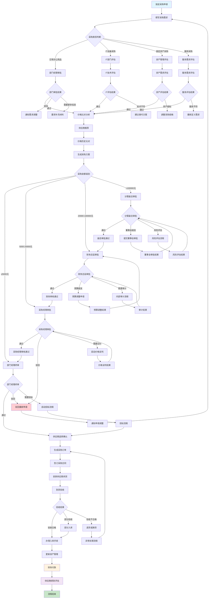
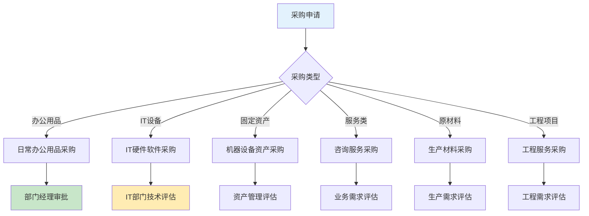
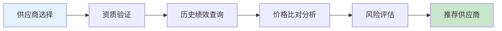
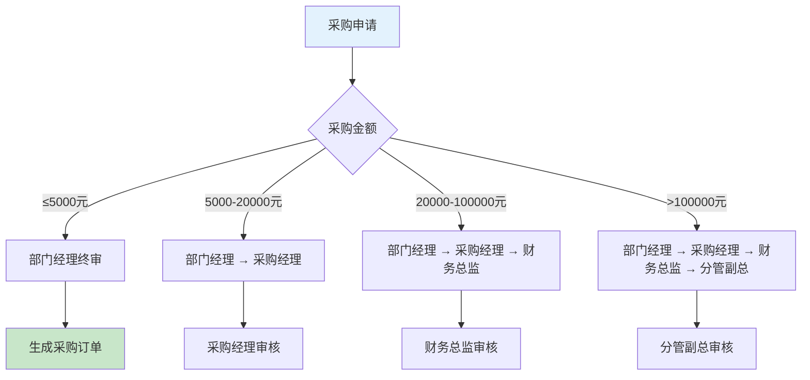
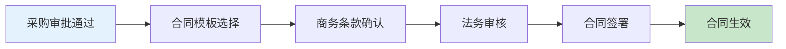
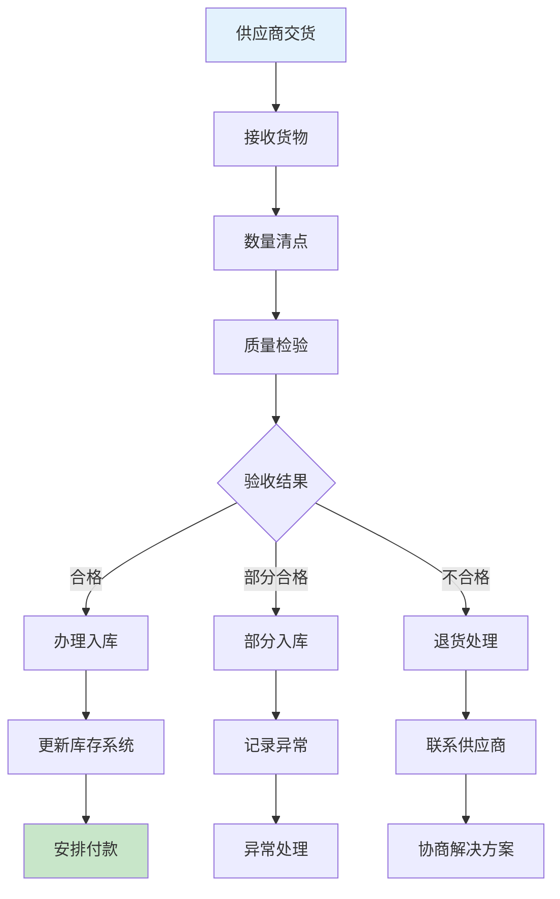
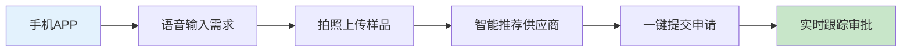

# 采购审批业务流程图

> **创建时间**: 2025-12-16
> **流程类型**: 供应链管理审批流程
> **优先级**: P0 - 核心采购流程
> **适用范围**: 全体员工采购申请与审批

---

## 📋 流程概述

采购审批是OA工作流系统中的核心供应链管理流程，涵盖采购需求申请、供应商选择、价格比对、多级审批、合同签订、入库验收等完整采购业务闭环。

### 核心特点
- **多级采购审批**: 支持部门采购、项目采购、固定资产采购等多级审批
- **供应商管理**: 集成供应商资质认证和绩效评估
- **价格管控**: 智能价格比对和历史价格分析
- **预算控制**: 自动检查采购预算和成本中心余额
- **合规采购**: 遵循采购法规和公司内控制度

---

## 🔄 完整业务流程图



---

## 📊 详细流程说明

### 1. 采购需求发起

#### 1.1 采购申请分类


#### 1.2 采购申请标准

| 采购类型 | 金额范围 | 审批层级 | 需求评估 | 特殊要求 |
|---------|---------|---------|---------|---------|
| **办公用品** | ≤5000元 | 部门经理 | 基础需求 | 季度集中采购 |
| **IT设备** | ≤20000元 | IT+部门 | 技术规格 | 兼容性测试 |
| **固定资产** | ≤50000元 | 资产+部门 | 资产编码 | 资产管理登记 |
| **服务采购** | ≤30000元 | 业务+部门 | SLA标准 | 服务协议 |
| **原材料** | ≤100000元 | 生产+部门 | 质量标准 | 供应商认证 |
| **工程项目** | >100000元 | 工程+高管 | 工程设计 | 招标流程 |

### 2. 供应商管理与选择

#### 2.1 供应商资质评估


#### 2.2 供应商评估标准

| 评估维度 | 权重 | 评估标准 | 数据来源 |
|---------|------|---------|---------|
| **价格竞争力** | 30% | 历史价格对比 | 采购系统 |
| **质量可靠性** | 25% | 历史质量记录 | 质量管理系统 |
| **交付及时性** | 20% | 准时交付率 | 交付记录 |
| **服务响应** | 15% | 售后服务评价 | 客户满意度 |
| **合规性** | 10% | 资质证书 | 供应商管理系统 |

#### 2.3 价格管控机制

| 价格管控措施 | 实施方式 | 控制效果 |
|-------------|---------|---------|
| **历史价格比对** | 系统自动比对同产品历史价格 | 防止价格异常波动 |
| **市场价格调研** | 第三方价格监控平台 | 确保价格合理性 |
| **批量采购折扣** | 根据采购量协商阶梯价格 | 降低采购成本 |
| **长期协议定价** | 与核心供应商签订年度协议 | 稳定价格预期 |

### 3. 采购审批层级

#### 3.1 审批权限矩阵


#### 3.2 特殊审批流程

| 特殊情况 | 审批流程 | 说明 |
|---------|---------|------|
| **紧急采购** | 事后审批 | 先采购后补流程 |
| **独家采购** | 技术论证+价格审批 | 需要技术部门论证 |
| **境外采购** | 外贸部门+财务部门 | 涉及汇率和关税 |
| **政府项目** | 合规部门+法务部门 | 特殊合规要求 |
| **研发采购** | 研发总监+技术总监 | 技术保密要求 |

### 4. 合同管理与执行

#### 4.1 合同签订流程


#### 4.2 合同管理要点

| 管理要素 | 管理要求 | 风险控制 |
|---------|---------|---------|
| **合同模板** | 使用标准化合同模板 | 法律风险控制 |
| **付款条款** | 分阶段付款降低风险 | 资金安全控制 |
| **验收标准** | 明确验收标准和时限 | 质量风险控制 |
| **违约责任** | 明确违约条款和责任 | 法律风险控制 |
| **知识产权** | 明确知识产权归属 | 知识产权风险控制 |

### 5. 入库验收与付款

#### 5.1 验收流程


#### 5.2 付款流程

| 付款方式 | 适用场景 | 付款条件 | 风险控制 |
|---------|---------|---------|---------|
| **预付款** | 大额设备采购 | 合同签订后30% | 履约保函 |
| **进度款** | 工程项目 | 按进度分批付款 | 进度验收 |
| **验收款** | 一般采购 | 验收合格后付清 | 质量保证 |
| **分期付款** | 长期服务 | 按服务周期支付 | 服务评估 |

---

## 🎯 关键控制点

### 1. 采购风险控制
- **供应商资质验证**: 确保供应商合法合规
- **价格合理性控制**: 防止价格虚高和利益输送
- **质量控制**: 严格验收标准和质量追责
- **合规性检查**: 确保采购过程符合法规要求

### 2. 预算执行控制
- **采购预算管理**: 严格控制在年度预算范围内
- **成本中心管控**: 按成本中心控制采购支出
- **采购成本分析**: 定期分析采购成本构成
- **成本优化措施**: 持续优化采购成本结构

### 3. 供应商绩效控制
- **绩效评估体系**: 建立完整的供应商评估体系
- **定期评估**: 按季度和年度进行绩效评估
- **分级管理**: 根据绩效评估结果分级管理
- **优胜劣汰**: 建立供应商退出机制

### 4. 内控合规控制
- **审批权限控制**: 严格执行审批权限制度
- **招标流程控制**: 大额采购必须通过招标
- **合同风险控制**: 法务部门审核所有合同
- **审计监督控制**: 定期内部审计和外部审计

---

## 📱 移动端采购功能

### 移动端采购申请


### 移动端特色功能
- **语音需求录入**: 支持语音输入采购需求描述
- **图像识别**: 拍照识别产品型号和规格
- **位置服务**: 基于位置推荐附近供应商
- **实时审批**: 支持移动端实时审批和状态查询
- **消息推送**: 采购进度实时推送通知

---

## 📊 性能指标与KPI

### 采购效率指标
| 指标项 | 目标值 | 行业平均 | 当前值 | 状态 |
|--------|--------|---------|--------|------|
| **采购周期** | ≤15天 | 22天 | 14.2天 | ✅ 达标 |
| **供应商响应时间** | ≤24小时 | 36小时 | 18.5小时 | ✅ 达标 |
| **价格比对准确率** | ≥95% | 82% | 96.3% | ✅ 达标 |
| **合同执行率** | ≥98% | 91% | 98.7% | ✅ 达标 |
| **采购满意度** | ≥4.5分 | 3.9分 | 4.6分 | ✅ 达标 |

### 成本控制指标
- **采购成本降低率**: 8.5%
- **供应商集中度**: 65%
- **准时交付率**: 97.8%
- **质量合格率**: 99.2%
- **库存周转率**: 12.5次/年

### 系统性能指标
- **供应商查询响应时间**: < 2秒
- **价格比对处理时间**: < 5秒
- **系统并发处理能力**: 300+ 用户
- **数据准确率**: 99.98%
- **系统可用性**: 99.9%

---

## 🔗 相关流程对接

### 上游流程
- **预算制定流程**: 提供年度采购预算额度
- **需求计划流程**: 收集各部门采购需求
- **供应商认证流程**: 建立合格供应商名录
- **资产配置流程**: 确定固定资产采购需求

### 下游流程
- **库存管理流程**: 采购物料入库管理
- **资产管理流程**: 固定资产登记管理
- **付款处理流程**: 采购款项支付处理
- **供应商评估流程**: 采购后供应商绩效评估

### 并行流程
- **招标管理流程**: 大额采购招标流程
- **合同管理流程**: 采购合同全生命周期管理
- **质量监控流程**: 采购质量持续监控
- **成本分析流程**: 采购成本结构分析

---

## 🛠️ 技术实现要点

### 1. 供应商管理服务
```java
@Service
public class SupplierManagementService {

    @Autowired
    private SupplierDao supplierDao;

    @Autowired
    private SupplierPerformanceService performanceService;

    public List<SupplierEntity> recommendSuppliers(ProcurementRequestEntity request) {
        // 基础筛选
        List<SupplierEntity> candidates = supplierDao.findByCategoryAndRegion(
            request.getCategory(), request.getRegion());

        // 绩效排序
        return candidates.stream()
                .sorted((s1, s2) -> {
                    Double score1 = performanceService.calculateOverallScore(s1.getId());
                    Double score2 = performanceService.calculateOverallScore(s2.getId());
                    return score2.compareTo(score1);
                })
                .limit(5) // 推荐前5名
                .collect(Collectors.toList());
    }
}
```

### 2. 价格比对服务
```java
@Service
public class PriceComparisonService {

    @Autowired
    private ProcurementRecordDao procurementDao;

    @Autowired
    private ExternalPriceService externalPriceService;

    public PriceComparisonResult comparePrice(String productId, BigDecimal targetPrice) {
        // 历史价格
        List<BigDecimal> historicalPrices = procurementDao.findRecentPrices(productId);

        // 市场价格
        BigDecimal marketPrice = externalPriceService.getMarketPrice(productId);

        // 价格分析
        PriceAnalysis analysis = analyzePrice(targetPrice, historicalPrices, marketPrice);

        return PriceComparisonResult.builder()
                .targetPrice(targetPrice)
                .historicalPrices(historicalPrices)
                .marketPrice(marketPrice)
                .analysis(analysis)
                .recommendation(generateRecommendation(analysis))
                .build();
    }
}
```

### 3. 采购审批引擎
```java
@Component
public class ProcurementApprovalEngine {

    public ApprovalRoute determineRoute(ProcurementRequestEntity request) {
        ApprovalRoute route = new ApprovalRoute();

        // 基础审批链
        route.addApprover(getDepartmentManager(request.getDepartmentId()));

        // 根据金额和类型添加审批层级
        if (request.getAmount().compareTo(new BigDecimal("5000")) > 0) {
            route.addApprover(getProcurementManager());
        }

        if (request.getAmount().compareTo(new BigDecimal("20000")) > 0) {
            route.addApprover(getFinanceDirector());
        }

        if (request.getAmount().compareTo(new BigDecimal("100000")) > 0) {
            route.addApprover(getVicePresident());
        }

        // 特殊类型审批
        if (request.getType() == ProcurementType.IT_EQUIPMENT) {
            route.addApprover(getITDirector());
        }

        if (request.getType() == ProcurementType.FIXED_ASSET) {
            route.addApprover(getAssetManager());
        }

        return route;
    }
}
```

---

## 📋 操作指南

### 1. 采购申请指南
1. **确定需求** → 明确采购物品的规格、数量、预算
2. **选择供应商** → 从合格供应商名录中选择
3. **价格比对** → 使用系统进行价格比对分析
4. **填写申请** → 详细填写采购申请信息
5. **上传附件** → 上传相关技术规格和需求文档
6. **提交审批** → 确认信息无误后提交审批
7. **跟踪进度** → 实时查看审批状态和采购进度

### 2. 审批人操作指南
1. **接收审批通知** → 通过邮件或系统通知
2. **查看申请详情** → 核对采购需求和预算
3. **供应商评估** → 评估推荐供应商的合理性
4. **价格合理性检查** → 确认价格在合理范围内
5. **风险评估** → 评估采购风险和合规性
6. **做出审批决定** → 通过/驳回/要求补充
7. **填写审批意见** → 详细说明审批理由
8. **确认提交** → 系统自动流转到下一环节

### 3. 采购人员操作指南
1. **需求收集** → 收集和整理各部门采购需求
2. **市场调研** → 调研市场行情和供应商情况
3. **供应商管理** → 维护合格供应商名录
4. **价格谈判** → 与供应商进行价格和条款谈判
5. **合同管理** → 起草、审核和管理采购合同
6. **执行跟踪** → 跟踪采购订单执行情况
7. **验收管理** → 组织货物验收和质量检查
8. **供应商评估** → 定期评估供应商绩效

---

## 🔄 版本更新记录

| 版本 | 更新时间 | 更新内容 | 更新人 |
|------|---------|---------|--------|
| **v1.0.0** | 2025-12-16 | 初始版本，完整采购流程设计 | 采购团队 |
| **v1.0.1** | 待更新 | 增加电子招标功能 | 技术团队 |
| **v1.0.2** | 待更新 | 优化供应商评估算法 | 数据团队 |

---

**文档状态**: ✅ 已完成
**适用版本**: IOE-DREAM v2.0.0+
**维护责任人**: 采购部 + 技术架构团队
**最后审核**: 2025-12-16