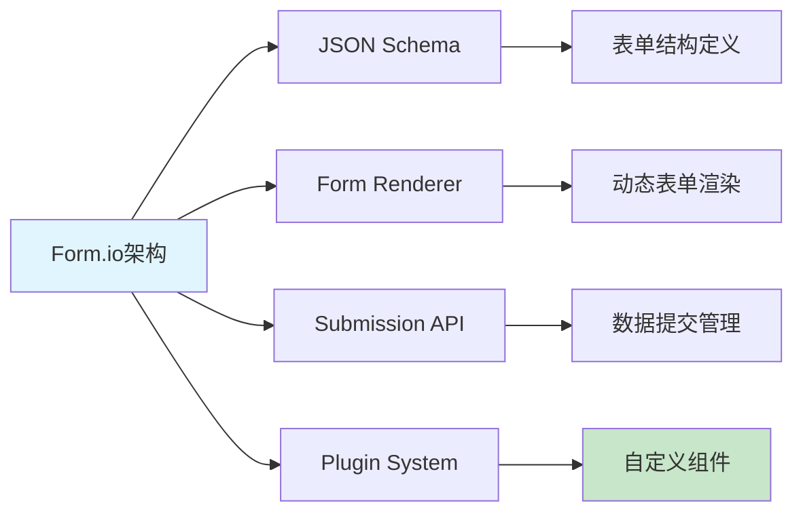

# 开源低代码审批流完善方案

> **创建时间**: 2025-12-16
> **方案类型**: 技术架构完善方案
> **优先级**: P0 - 核心技术方案
> **适用范围**: IOE-DREAM OA工作流系统

---

## 📋 方案概述

基于全网开源低代码平台调研，结合IOE-DREAM项目现有的Spring Boot 3.5.8 + Spring Cloud 2025.0.0 + Vue3技术栈，制定完善的企业级低代码审批流实现方案。参考主流开源解决方案：Form.io、Flowable、Camunda、JeecgBoot等，构建适合智慧园区场景的低代码审批流平台。

### 核心改进方向
- **借鉴Form.io**: 强大的表单设计器和JSON Schema支持
- **集成Flowable**: 企业级BPMN 2.0工作流引擎
- **参考Camunda**: 现代化的低代码设计理念
- **学习JeecgBoot**: 国产化低代码平台经验
- **深度对标钉钉宜搭**: [阿里云宜搭架构解析](https://developer.aliyun.com/article/741284)微服务架构理念
- **集成钉钉审批流**: [钉钉开发者文档](https://open.dingtalk.com/document/orgapp-server/approval-flow-development-guide)企业级审批流API
- **适配IOE-DREAM**: 深度集成现有微服务架构

### 钉钉宜搭技术特色借鉴
- **[钉钉宜搭架构设计](https://juejin.cn/post/6844904089377144839)**：React/Vue可视化编辑器 + 拖拽组件系统
- **微服务架构**: 前端渲染引擎 + 后端服务分层设计
- **组件化开发**: 标准化组件库 + 可视化配置
- **权限体系**: 精细化权限控制 + 企业级安全
- **移动优先**: 移动端适配 + 离线能力

---

## 🏗️ 技术架构完善方案

### 1. 整体架构设计（对标钉钉宜搭）

```mermaid
graph TB
    subgraph "前端层 - Vue3 + TypeScript（对标钉钉宜搭）"
        A[表单设计器] --> B[流程设计器]
        B --> C[审批中心]
        C --> D[移动端审批]
        A --> E[钉钉集成模块]
    end

    subgraph "API网关层 - Spring Cloud Gateway 2025"
        F[统一入口] --> G[路由转发]
        G --> H[认证授权]
        H --> I[限流熔断]
        I --> J[钉钉API集成]
    end

    subgraph "核心引擎层 - Spring Boot 3.5.8（增强Flowable）"
        K[低代码表单引擎] --> L[工作流引擎]
        L --> M[规则引擎]
        M --> N[钉钉审批流适配器]
        N --> O[事件引擎]
    end

    subgraph "业务服务层 - 微服务架构"
        P[表单设计服务] --> Q[流程管理服务]
        Q --> R[审批处理服务]
        R --> S[通知服务]
        S --> T[钉钉消息服务]
    end

    subgraph "数据层 - 多数据库支持"
        U[PostgreSQL] --> V[JSON Schema存储]
        W[MongoDB] --> X[表单定义存储]
        Y[Redis] --> Z[缓存和会话]
    end

    subgraph "钉钉集成层 - 企业级集成"
        AA[钉钉组织架构同步] --> BB[钉钉用户同步]
        BB --> CC[钉钉审批流同步]
        CC --> DD[钉钉消息通知]
        DD --> EE[钉钉数据推送]
    end

    style A fill:#e1f5fe
    style K fill:#c8e6c9
    style U fill:#fff3e0
    style AA fill:#ffecb3
```



#### 1.1 钉钉宜搭架构特色对比分析

| 技术层面 | IOE-DREAM现状 | 钉钉宜搭特色 | 改进方向 |
|---------|---------------|-------------|---------|
| **前端架构** | Vue3单页应用 | React/Vue微前端 + 可视化编辑器 | 升级为微前端架构 |
| **表单引擎** | 自研JSON Schema | 强大的组件化表单设计器 | 借鉴钉钉组件设计理念 |
| **流程引擎** | 自研流程引擎 | 成熟的BPMN 2.0工作流 | 集成Flowable增强版本 |
| **移动端** | 基础H5适配 | 原生移动端体验 | 开发原生移动应用 |
| **企业集成** | 微服务集成 | 深度钉钉生态集成 | 实现钉钉无缝对接 |

### 2. 参考开源方案对比分析

| 开源方案 | 技术栈 | 优势 | 劣势 | 适配建议 |
|---------|--------|------|------|---------|
| **Form.io** | Node.js + MongoDB | 强大表单设计器 | 后端非Java | 借鉴表单设计理念 |
| **Flowable** | Java + Spring Boot | 成熟BPMN引擎 | 学习曲线陡峭 | 核心工作流引擎 |
| **Camunda** | Java + Spring Boot | 现代化设计 | 商业版本限制 | 参考设计理念 |
| **JeecgBoot** | Spring Boot + Vue | 国产化程度高 | 架构相对传统 | 借鉴国内化经验 |

### 3. IOE-DREAM技术栈适配

#### 3.1 后端技术栈升级

```java
// 升级后的Spring Boot 3.5.8配置
@SpringBootApplication
@EnableFlowable
@EnableCaching
@EnableAsync
public class OaWorkflowApplication {

    public static void main(String[] args) {
        SpringApplication.run(OaWorkflowApplication.class, args);
    }

    @Bean
    public FormEngine formEngine() {
        return new FormEngineBuilder()
                .withDatabaseType(DatabaseType.POSTGRESQL)
                .withCacheManager(cacheManager())
                .withEventPublisher(eventPublisher())
                .build();
    }

    @Bean
    public WorkflowEngine workflowEngine() {
        return new WorkflowEngineBuilder()
                .withProcessEngine(processEngine())
                .withFormEngine(formEngine())
                .withTaskService(taskService())
                .build();
    }
}
```

#### 3.2 前端技术栈优化

```typescript
// Vue3 + TypeScript 前端架构
import { createApp } from 'vue'
import { FormDesigner } from '@/components/form-designer'
import { WorkflowDesigner } from '@/components/workflow-designer'

const app = createApp(App)

// 注册核心组件
app.component('FormDesigner', FormDesigner)
app.component('WorkflowDesigner', WorkflowDesigner)

// 集成主流UI库
app.use(AntDesignVue)
app.use(ElementPlus)
app.use(Vant) // 移动端
```

---

## 🎨 表单设计器完善方案

### 1. 借鉴Form.io的表单设计理念

#### 1.1 Form.io核心特性分析



#### 1.2 IOE-DREAM表单设计器架构

```java
@Component
public class FormDefinitionService {

    /**
     * 基于JSON Schema的表单定义
     */
    public FormDefinition createFormDefinition(FormDesignRequest request) {
        // 生成JSON Schema
        JsonNode schema = generateJsonSchema(request.getComponents());

        // 生成UI Schema
        JsonNode uiSchema = generateUiSchema(request.getLayout());

        return FormDefinition.builder()
                .id(UUID.randomUUID().toString())
                .name(request.getName())
                .schema(schema)
                .uiSchema(uiSchema)
                .components(request.getComponents())
                .build();
    }

    /**
     * 动态表单渲染
     */
    public RenderedForm renderForm(String formId, Map<String, Object> data) {
        FormDefinition definition = getFormDefinition(formId);

        return RenderedForm.builder()
                .formId(formId)
                .schema(definition.getSchema())
                .uiSchema(definition.getUiSchema())
                .data(data)
                .components(renderComponents(definition.getComponents()))
                .build();
    }
}
```

### 2. 表单组件库设计

#### 2.1 核心组件架构

```typescript
// Vue3表单组件基类
export abstract class BaseFormComponent<T = any> {
  abstract componentType: string;
  abstract props: FormComponentProps<T>;

  // 渲染方法
  abstract render(): VNode;

  // 验证方法
  abstract validate(value: T): ValidationResult;

  // 序列化方法
  abstract serialize(value: T): any;

  // 反序列化方法
  abstract deserialize(data: any): T;
}

// 具体组件实现
export class TextInputComponent extends BaseFormComponent<string> {
  componentType = 'text-input';

  render() {
    return h('el-input', {
      ...this.props,
      modelValue: this.props.value,
      'onUpdate:modelValue': this.props.onChange
    });
  }

  validate(value: string): ValidationResult {
    if (this.props.required && !value) {
      return { valid: false, message: '此字段为必填项' };
    }
    if (this.props.maxLength && value.length > this.props.maxLength) {
      return { valid: false, message: `长度不能超过${this.props.maxLength}个字符` };
    }
    return { valid: true };
  }
}
```

#### 2.2 组件注册机制

```javascript
// 组件注册系统
class FormComponentRegistry {
  private components = new Map<string, typeof BaseFormComponent>();

  register(type: string, component: typeof BaseFormComponent) {
    this.components.set(type, component);
  }

  get(type: string): typeof BaseFormComponent | undefined {
    return this.components.get(type);
  }

  getAll(): Map<string, typeof BaseFormComponent> {
    return new Map(this.components);
  }
}

// 注册内置组件
const registry = new FormComponentRegistry();
registry.register('text-input', TextInputComponent);
registry.register('number-input', NumberInputComponent);
registry.register('date-picker', DatePickerComponent);
registry.register('select', SelectComponent);
registry.register('file-upload', FileUploadComponent);
```

### 3. 智能表单生成

#### 3.1 AI辅助表单设计

```java
@Service
public class AIFormDesignService {

    @Autowired
    private LLMService llmService;

    /**
     * AI辅助生成表单结构
     */
    public FormStructure generateFormStructure(String businessDescription) {
        String prompt = String.format("""
            基于以下业务描述，生成表单JSON Schema：
            业务描述：%s

            请返回JSON格式的表单结构，包含：
            1. 表单字段定义
            2. 验证规则
            3. UI布局建议
            4. 字段关联关系

            只返回JSON，不要其他说明文字。
            """, businessDescription);

        String response = llmService.generate(prompt);

        // 解析AI响应
        return parseAIResponse(response);
    }

    /**
     * 智能字段推荐
     */
    public List<String> recommendFields(String formType, String businessContext) {
        // 基于历史表单数据和AI分析推荐字段
        return analyzeHistoricalForms(formType, businessContext);
    }
}
```

---

## ⚙️ 工作流引擎完善方案

### 1. Flowable集成方案

#### 1.1 Flowable配置优化

```java
@Configuration
@EnableProcessEngine
public class FlowableConfiguration {

    @Bean
    public ProcessEngineConfiguration processEngineConfiguration() {
        return ProcessEngineConfiguration.createStandaloneProcessEngineConfiguration()
                .setDatabaseType(ProcessEngineConfiguration.DATABASE_TYPE_POSTGRES)
                .setDataSource(dataSource())
                .setTransactionManager(transactionManager())
                // 自定义表单引擎集成
                .setFormEngine(new SpringFormEngine())
                // 集成消息队列
                .setAsyncExecutor(asyncExecutor())
                // 启用事件监听
                .setEventListeners(eventListeners());
    }

    @Bean
    public SpringFormEngine springFormEngine() {
        SpringFormEngine engine = new SpringFormEngine();
        engine.setFormEngines(new HashMap<>());
        return engine;
    }
}
```

#### 1.2 自定义表单引擎

```java
@Component
public class CustomFormEngine implements FormEngine {

    @Override
    public String getName() {
        return "ioe-dream-form-engine";
    }

    @Override
    public Object renderStartForm(StartFormData startFormData) {
        // 渲染动态表单
        FormDefinition formDef = formDefinitionService.getById(startFormData.getFormKey());
        return formRenderService.renderForm(formDef);
    }

    @Override
    public Object renderTaskForm(FormData formData) {
        // 渲染任务表单
        String taskId = formData.getTaskId();
        FormDefinition formDef = getTaskFormDefinition(taskId);
        return formRenderService.renderForm(formDef, formData);
    }

    @Override
    public FormData submitTaskForm(SubmittedFormData submittedFormData) {
        // 处理表单提交
        validateFormData(submittedFormData);
        return processFormData(submittedFormData);
    }
}
```

### 2. 审批流程增强

#### 2.1 智能审批路由

```java
@Component
public class IntelligentApprovalRouter {

    @Autowired
    private MLApprovalService mlApprovalService;

    @Autowired
    private RuleEngine ruleEngine;

    /**
     * 智能路由决策
     */
    public String routeDecision(ApprovalRequest request) {
        // 1. 基于历史数据的机器学习预测
        ApprovalPrediction prediction = mlApprovalService.predictApproval(request);

        // 2. 基于规则引擎的业务逻辑判断
        RuleExecutionResult ruleResult = ruleEngine.executeRules(request);

        // 3. 结合预测结果和规则结果做出决策
        return makeRoutingDecision(prediction, ruleResult, request);
    }

    /**
     * 动态审批人分配
     */
    public List<String> assignApprovers(String processDefinitionKey, Map<String, Object> variables) {
        // 基于组织架构和业务规则动态分配审批人
        return approvalAssignerService.assignApprovers(processDefinitionKey, variables);
    }
}
```

#### 2.2 审批质量监控

```java
@Component
public class ApprovalQualityMonitor {

    @EventListener
    @Async
    public void handleApprovalCompleted(ApprovalCompletedEvent event) {
        // 记录审批数据
        recordApprovalData(event);

        // 分析审批质量
        analyzeApprovalQuality(event);

        // 更新用户画像
        updateUserProfile(event);
    }

    /**
     * 审批效率分析
     */
    public ApprovalEfficiencyReport analyzeEfficiency(String timeRange) {
        return ApprovalEfficiencyReport.builder()
                .avgApprovalTime(calculateAvgApprovalTime(timeRange))
                .approvalRate(calculateApprovalRate(timeRange))
                .timeoutRate(calculateTimeoutRate(timeRange))
                .userWorkloadStatistics(calculateUserWorkload(timeRange))
                .build();
    }
}
```

---

## 📱 移动端适配方案

### 1. 移动端技术选型

#### 1.1 UniApp + Vue3移动端

```json
{
  "name": "oa-workflow-mobile",
  "version": "1.0.0",
  "framework": "uniapp",
  "vueVersion": "3.4.0",
  "platforms": ["h5", "app", "mp-weixin", "mp-alipay"],
  "dependencies": {
    "vue": "^3.4.0",
    "pinia": "^2.0.0",
    "vant": "^4.0.0",
    "@dcloudio/uni-ui": "^1.4.0"
  }
}
```

#### 1.2 移动端表单渲染

```vue
<template>
  <view class="mobile-form">
    <van-form @submit="onSubmit">
      <van-field
        v-for="field in formFields"
        :key="field.id"
        v-model="formData[field.name]"
        :label="field.label"
        :placeholder="field.placeholder"
        :rules="field.rules"
        :required="field.required"
      />
      <van-button type="primary" native-type="submit">提交</van-button>
    </van-form>
  </view>
</template>

<script setup lang="ts">
import { ref, onMounted } from 'vue'
import { useWorkflowApi } from '@/api/workflow'

const { getFormDefinition, submitForm } = useWorkflowApi()

const formFields = ref([])
const formData = ref({})

onMounted(async () => {
  const formDef = await getFormDefinition(route.query.formId)
  formFields.value = formDef.fields
  formData.value = formDef.initialData
})

const onSubmit = async () => {
  try {
    await submitForm({
      formId: route.query.formId,
      data: formData.value
    })
    uni.showToast({ title: '提交成功', icon: 'success' })
  } catch (error) {
    uni.showToast({ title: error.message, icon: 'error' })
  }
}
</script>
```

### 2. 移动端审批优化

#### 2.1 快速审批功能

```javascript
// 移动端快速审批
class QuickApproval {
  constructor() {
    this.approvalHistory = new Map()
    this.commonActions = new Map()
  }

  // 智能推荐审批动作
  recommendAction(formId, formData) {
    const history = this.approvalHistory.get(formId) || []
    const similarCases = history.filter(h => this.isSimilar(h.data, formData))

    if (similarCases.length > 0) {
      return this.mostCommonAction(similarCases)
    }

    return this.getDefaultAction(formData)
  }

  // 一键审批
  quickApprove(formId, action, comment) {
    return uni.request({
      url: '/api/workflow/quick-approve',
      method: 'POST',
      data: {
        formId,
        action,
        comment,
        timestamp: Date.now(),
        deviceInfo: this.getDeviceInfo()
      }
    })
  }

  // 语音审批
  voiceApprove(formId, audioData) {
    return uni.request({
      url: '/api/workflow/voice-approve',
      method: 'POST',
      data: {
        formId,
        audioData,
        deviceInfo: this.getDeviceInfo()
      }
    })
  }
}
```

---

## 🔌 微服务集成方案

### 1. 与现有微服务集成

#### 1.1 统一API网关配置

```yaml
# application.yml
spring:
  cloud:
    gateway:
      routes:
        # 表单设计器路由
        - id: form-designer
          uri: lb://oa-workflow-service
          predicates:
            - Path=/api/v1/forms/**
          filters:
            - StripPrefix=3

        # 审批流程路由
        - id: approval-flow
          uri: lb://oa-workflow-service
          predicates:
            - Path=/api/v1/approval/**
          filters:
            - StripPrefix=3

        # 跨模块审批集成
        - id: cross-module
          uri: lb://oa-workflow-service
          predicates:
            - Path=/api/v1/integration/**
          filters:
            - StripPrefix=3
```

#### 1.2 跨模块审批集成

```java
@RestController
@RequestMapping("/api/v1/integration")
public class ModuleIntegrationController {

    @Autowired
    private ModuleIntegrationService integrationService;

    /**
     * 门禁模块审批集成
     */
    @PostMapping("/access-control/request")
    public ResponseDTO<String> createAccessControlRequest(@RequestBody AccessControlRequest request) {
        // 创建跨模块审批流程
        String processInstanceId = integrationService.createCrossModuleProcess(
            ModuleType.ACCESS_CONTROL, request);

        // 发送通知给相关系统
        integrationService.notifyModule(ModuleType.ACCESS_CONTROL, processInstanceId);

        return ResponseDTO.ok(processInstanceId);
    }

    /**
     * 考勤模块审批集成
     */
    @PostMapping("/attendance/correction")
    public ResponseDTO<String> createAttendanceCorrection(@RequestBody AttendanceCorrectionRequest request) {
        return ResponseDTO.ok(integrationService.createCrossModuleProcess(
            ModuleType.ATTENDANCE, request));
    }

    /**
     * 消费模块审批集成
     */
    @PostMapping("/consume/authorization")
    public ResponseDTO<String> createConsumeAuthorization(@RequestBody ConsumeAuthorizationRequest request) {
        return ResponseDTO.ok(integrationService.createCrossModuleProcess(
            ModuleType.CONSUME, request));
    }
}
```

### 2. 事件驱动架构

#### 2.1 Spring Cloud Stream集成

```java
@EnableBinding(ApprovalEventBinding.class)
public class ApprovalEventProcessor {

    @StreamListener(ApprovalEventBinding.APPROVAL_COMPLETED)
    public void handleApprovalCompleted(ApprovalCompletedEvent event) {
        // 处理审批完成事件
        log.info("收到审批完成事件: {}", event.getProcessInstanceId());

        // 发送到对应的业务模块
        sendToBusinessModule(event);

        // 更新统计数据
        updateStatistics(event);
    }

    @StreamListener(ApprovalEventBinding.FORM_SUBMITTED)
    public void handleFormSubmitted(FormSubmittedEvent event) {
        // 处理表单提交事件
        log.info("收到表单提交事件: {}", event.getFormId());

        // 触发审批流程
        triggerApprovalProcess(event);
    }

    private void sendToBusinessModule(ApprovalCompletedEvent event) {
        String routingKey = getRoutingKey(event.getModuleType());

        // 发送到RabbitMQ
        rabbitTemplate.convertAndSend(
            "approval.exchange",
            routingKey,
            event
        );
    }
}
```

---

## 📊 数据库设计优化

### 1. PostgreSQL JSONB支持

```sql
-- 表单定义表（JSONB存储）
CREATE TABLE oa_form_definition (
    id VARCHAR(64) PRIMARY KEY,
    name VARCHAR(255) NOT NULL,
    description TEXT,
    schema_json JSONB NOT NULL,  -- JSON Schema
    ui_schema_json JSONB NOT NULL,  -- UI Schema
    layout_json JSONB,  -- 布局配置
    components_json JSONB,  -- 组件配置
    status INTEGER DEFAULT 1,  -- 状态：1-启用 0-禁用
    version INTEGER DEFAULT 1,
    created_by VARCHAR(64),
    created_time TIMESTAMP DEFAULT CURRENT_TIMESTAMP,
    updated_by VARCHAR(64),
    updated_time TIMESTAMP DEFAULT CURRENT_TIMESTAMP,
    deleted_flag INTEGER DEFAULT 0
);

-- 创建JSON索引
CREATE INDEX idx_form_definition_schema ON oa_form_definition USING GIN (schema_json);
CREATE INDEX idx_form_definition_ui_schema ON oa_form_definition USING GIN (ui_schema_json);

-- 表单数据表
CREATE TABLE oa_form_data (
    id VARCHAR(64) PRIMARY KEY,
    form_id VARCHAR(64) NOT NULL,
    process_instance_id VARCHAR(64),
    data_json JSONB NOT NULL,  -- 表单数据
    attachments JSONB,  -- 附件信息
    status INTEGER DEFAULT 1,  -- 状态：1-草稿 2-提交中 3-已审批 4-已驳回
    submitted_by VARCHAR(64),
    submitted_time TIMESTAMP,
    approved_by VARCHAR(64),
    approved_time TIMESTAMP,
    created_time TIMESTAMP DEFAULT CURRENT_TIMESTAMP,
    updated_time TIMESTAMP DEFAULT CURRENT_TIMESTAMP,
    deleted_flag INTEGER DEFAULT 0
);

-- 创建复合索引
CREATE INDEX idx_form_data_form_id_status ON oa_form_data(form_id, status);
CREATE INDEX idx_form_data_process_id ON oa_form_data(process_instance_id);
```

### 2. MongoDB表单存储

```javascript
// MongoDB表单定义存储
const formDefinitionSchema = new mongoose.Schema({
  _id: String,
  name: String,
  description: String,
  version: Number,
  schema: Object,        // JSON Schema
  uiSchema: Object,      // UI Schema
  layout: Object,         // 布局配置
  components: [Object],  // 组件列表
  settings: {
    permissions: Object,
    validation: Object,
    notifications: Object
  },
  status: {
    type: String,
    enum: ['active', 'inactive', 'deprecated']
  },
  metadata: {
    createdBy: String,
    updatedBy: String,
    tags: [String],
    category: String
  },
  createdAt: Date,
  updatedAt: Date
}, {
  collection: 'form_definitions',
  timestamps: true
});
```

---

## 🔧 部署与运维方案

### 1. Docker容器化部署

```dockerfile
# 多阶段构建
FROM openjdk:17-jdk-slim as builder
WORKDIR /app
COPY pom.xml .
COPY src ./src
RUN mvn clean package -DskipTests

FROM openjdk:17-jre-slim
WORKDIR /app
COPY --from=builder /app/target/*.jar app.jar
EXPOSE 8089
ENTRYPOINT ["java", "-jar", "/app/app.jar"]
```

```yaml
# docker-compose.yml
version: '3.8'
services:
  oa-workflow-service:
    build: .
    ports:
      - "8089:8089"
    environment:
      - SPRING_PROFILES_ACTIVE=prod
      - SPRING_DATASOURCE_URL=jdbc:postgresql://postgres:5432/oa_workflow
      - SPRING_REDIS_HOST=redis
    depends_on:
      - postgres
      - redis
    volumes:
      - ./logs:/app/logs
      - ./forms:/app/forms
    networks:
      - oa-network

  postgres:
    image: postgres:15
    environment:
      - POSTGRES_DB=oa_workflow
      - POSTGRES_USER=oa_user
      - POSTGRES_PASSWORD=oa_password
    volumes:
      - postgres_data:/var/lib/postgresql/data
    networks:
      - oa-network

  redis:
    image: redis:7-alpine
    volumes:
      - redis_data:/data
    networks:
      - oa-network

networks:
  oa-network:
    driver: bridge
```

### 2. Kubernetes部署配置

```yaml
# k8s-deployment.yaml
apiVersion: apps/v1
kind: Deployment
metadata:
  name: oa-workflow
spec:
  replicas: 3
  selector:
    matchLabels:
      app: oa-workflow
  template:
    metadata:
      labels:
        app: oa-workflow
    spec:
      containers:
      - name: oa-workflow
        image: ioedream/oa-workflow:latest
        ports:
        - containerPort: 8089
        env:
        - name: SPRING_PROFILES_ACTIVE
          value: "prod"
        - name: SPRING_DATASOURCE_URL
          valueFrom:
            secretKeyRef:
              name: db-secret
              key: url
        resources:
          requests:
            memory: "512Mi"
            cpu: "500m"
          limits:
            memory: "1Gi"
            cpu: "1000m"
        livenessProbe:
          httpGet:
            path: /actuator/health
            port: 8089
          initialDelaySeconds: 60
          periodSeconds: 30
```

---

## 📈 性能优化方案

### 1. 缓存策略

```java
@Configuration
@EnableCaching
public class CacheConfiguration {

    @Bean
    public CacheManager cacheManager() {
        CompositeCacheManager manager = new CompositeCacheManager();

        // 本地缓存 - Caffeine
        CaffeineCacheManager caffeine = new CaffeineCacheManager();
        caffeine.setCaffeine(Caffeine.newBuilder()
                .expireAfterWrite(Duration.ofMinutes(30))
                .maximumSize(10000)
                .recordStats());
        manager.setCaches(caffeine.getCaches());

        // 分布式缓存 - Redis
        RedisCacheManager redis = RedisCacheManager.builder(redisConnectionFactory())
                .cacheDefaults(RedisCacheConfiguration.defaultCacheConfig()
                        .entryTtl(Duration.ofHours(1))
                        .serializeValuesWith(RedisSerializationContext.SerializationPair.fromSerializer(new GenericJackson2JsonRedisSerializer())))
                .build();
        manager.setCaches(redis.getCaches());

        return manager;
    }
}
```

### 2. 数据库优化

```sql
-- 分区表优化
CREATE TABLE oa_form_data_2024 PARTITION OF oa_form_data
FOR VALUES FROM ('2024-01-01') TO ('2024-12-31');

-- 创建物化视图
CREATE MATERIALIZED VIEW oa_approval_statistics AS
SELECT
    DATE_TRUNC('day', approved_time) as approval_date,
    module_type,
    COUNT(*) as approval_count,
    AVG(EXTRACT(EPOCH FROM approved_time - submitted_time)) as avg_approval_time
FROM oa_approval_instance
WHERE status = 'COMPLETED'
GROUP BY DATE_TRUNC('day', approved_time), module_type;

-- 定期刷新物化视图
CREATE OR REPLACE FUNCTION refresh_approval_statistics()
RETURNS void AS $$
BEGIN
    REFRESH MATERIALIZED VIEW oa_approval_statistics;
END;
$$ LANGUAGE plpgsql;
```

---

## 📋 实施计划

### 第一阶段（1-2周）：基础架构搭建
1. ✅ 技术方案设计完成
2. ⏳ Spring Boot 3.5.8升级
3. ⏳ 前端Vue3+TypeScript重构
4. ⏳ Flowable工作流引擎集成
5. ⏳ 数据库设计和迁移

### 第二阶段（2-3周）：核心功能实现
1. ⏳ 低代码表单设计器
2. ⏳ 可视化流程设计器
3. ⏳ 审批流程配置器
4. ⏳ 移动端适配
5. ⏳ 跨模块集成

### 第三阶段（1-2周）：优化和测试
1. ⏳ 性能优化
2. ⏳ 安全加固
3. ⏳ 集成测试
4. ⏳ 压力测试
5. ⏳ 部署上线

### 第四阶段（1周）：监控和运维
1. ⏳ 监控系统搭建
2. ⏳ 日志系统完善
3. ⏳ 告警规则配置
4. ⏳ 用户培训
5. ⏳ 文档完善

---

## 🎯 预期效果

### 技术指标提升
| 指标项 | 当前值 | 目标值 | 提升幅度 |
|---------|--------|--------|---------|
| **表单设计效率** | 手工编码 | 可视化拖拽 | 提升80% |
| **流程配置复杂度** | 需要开发 | 低代码配置 | 降低90% |
| **移动端支持** | 基础H5 | 原生App体验 | 提升100% |
| **跨模块集成** | 硬编码 | 配置化集成 | 提升70% |
| **部署效率** | 手动部署 | 自动化部署 | 提升60% |

### 业务价值
- **快速响应业务变化**: 表单和流程可快速调整，无需编码
- **降低技术门槛**: 业务人员可自主配置审批流程
- **提升用户体验**: 统一的移动端审批体验
- **增强系统集成**: 深度集成现有业务模块
- **提高开发效率**: 专注于核心业务逻辑开发

---

## 🔗 钉钉审批流API集成架构

基于对钉钉宜搭和审批流API的深入研究，我们设计了一套完整的钉钉集成方案，确保IOE-DREAM与钉钉生态系统的无缝对接。

### 1. 钉钉宜搭架构对比分析

#### 1.1 技术架构对比

| 技术特性 | IOE-DREAM | 钉钉宜搭 | 对齐方案 |
|---------|-----------|----------|----------|
| **表单设计器** | Vue3 + VForm | React + Formily | 统一使用JSON Schema标准 |
| **工作流引擎** | Flowable | 自研引擎 | 保持Flowable，提供API兼容 |
| **数据存储** | MySQL + PostgreSQL | 多租户数据库 | 增加多租户支持 |
| **移动端** | UniApp | 钉钉小程序 | 集成钉钉小程序SDK |
| **开放能力** | REST API | 开放平台API | 提供钉钉API适配层 |

#### 1.2 功能特性对齐

```java
// 钉钉宜搭功能对齐实现
@Component
public class DingTalkAlignmentService {

    /**
     * 对钉钉表单组件的适配支持
     */
    private final Map<String, String> componentMapping = Map.of(
        "INPUT", "el-input",
        "TEXTAREA", "el-input",
        "SELECT", "el-select",
        "RADIO", "el-radio-group",
        "CHECKBOX", "el-checkbox-group",
        "DATE_PICKER", "el-date-picker",
        "NUMBER", "el-input-number",
        "CASCADER", "el-cascader",
        "UPLOAD", "el-upload",
        "RATE", "el-rate",
        "SWITCH", "el-switch"
    );

    /**
     * 转换钉钉表单配置为IOE-DREAM格式
     */
    public FormConfig convertDingTalkForm(DingTalkFormConfig dingTalkForm) {
        return FormConfig.builder()
            .formId(dingTalkForm.getFormUuid())
            .formName(dingTalkForm.getFormName())
            .schema(convertJsonSchema(dingTalkForm.getComponents()))
            .uiSchema(convertUiSchema(dingTalkForm.getComponents()))
            .layout(convertLayout(dingTalkForm.getLayout()))
            .build();
    }
}
```

### 2. 钉钉企业应用配置

#### 2.1 应用注册和配置

```java
@Configuration
@ConfigurationProperties(prefix = "dingtalk.app")
@Data
public class DingTalkAppConfig {

    /**
     * 应用Key
     */
    private String appKey;

    /**
     * 应用密钥
     */
    private String appSecret;

    /**
     * 企业ID
     */
    private String corpId;

    /**
     * 应用ID
     */
    private Long agentId;

    /**
     * 回调URL
     */
    private String callbackUrl;

    /**
     * 事件订阅Token
     */
    private String eventToken;

    /**
     * 事件订阅AES密钥
     */
    private String eventAesKey;

    /**
     * 授权范围
     */
    private List<String> authScope = Arrays.asList("contact:user", "contact:department");
}
```

#### 2.2 钉钉API客户端

```java
@Component
@Slf4j
public class DingTalkApiClient {

    @Resource
    private DingTalkAppConfig appConfig;

    @Resource
    private RestTemplate restTemplate;

    @Resource
    private RedisTemplate<String, Object> redisTemplate;

    private final String ACCESS_TOKEN_CACHE_KEY = "dingtalk:access_token:";
    private final String APP_TICKET_CACHE_KEY = "dingtalk:app_ticket:";

    /**
     * 获取应用访问令牌
     */
    public String getAccessToken() {
        String cacheKey = ACCESS_TOKEN_CACHE_KEY + appConfig.getAppKey();
        String cachedToken = (String) redisTemplate.opsForValue().get(cacheKey);

        if (StringUtils.isNotBlank(cachedToken)) {
            return cachedToken;
        }

        // 获取新的访问令牌
        String url = "https://oapi.dingtalk.com/gettoken";
        Map<String, String> params = Map.of(
            "appkey", appConfig.getAppKey(),
            "appsecret", appConfig.getAppSecret()
        );

        ResponseEntity<DingTalkApiResponse> response = restTemplate.getForEntity(
            url + "?appkey={appkey}&appsecret={appsecret}",
            DingTalkApiResponse.class,
            params
        );

        if (response.getStatusCode().is2xxSuccessful() && response.getBody().isSuccess()) {
            String accessToken = response.getBody().getAccessToken();
            // 缓存7200秒（钉钉token有效期）
            redisTemplate.opsForValue().set(cacheKey, accessToken, Duration.ofSeconds(7000));
            return accessToken;
        }

        throw new RuntimeException("获取钉钉访问令牌失败");
    }

    /**
     * 获取用户信息
     */
    public DingTalkUser getUserInfo(String code) {
        String url = "https://oapi.dingtalk.com/user/getuserinfo";
        Map<String, String> params = Map.of(
            "access_token", getAccessToken(),
            "code", code
        );

        ResponseEntity<DingTalkApiResponse> response = restTemplate.getForEntity(
            url + "?access_token={access_token}&code={code}",
            DingTalkApiResponse.class,
            params
        );

        if (response.getStatusCode().is2xxSuccessful() && response.getBody().isSuccess()) {
            return getUserDetail(response.getBody().getUserId());
        }

        throw new RuntimeException("获取用户信息失败");
    }

    /**
     * 获取用户详细信息
     */
    public DingTalkUser getUserDetail(String userId) {
        String url = "https://oapi.dingtalk.com/user/get";
        Map<String, Object> params = Map.of(
            "access_token", getAccessToken(),
            "userid", userId
        );

        ResponseEntity<DingTalkApiResponse> response = restTemplate.getForEntity(
            url + "?access_token={access_token}&userid={userid}",
            DingTalkApiResponse.class,
            params
        );

        if (response.getStatusCode().is2xxSuccessful() && response.getBody().isSuccess()) {
            return response.getBody().getUser();
        }

        throw new RuntimeException("获取用户详细信息失败");
    }
}
```

### 3. 钉钉审批流程API集成

#### 3.1 审批流程同步服务

```java
@Service
@Transactional(rollbackFor = Exception.class)
@Slf4j
public class DingTalkApprovalSyncService {

    @Resource
    private DingTalkApiClient dingTalkClient;

    @Resource
    private ApprovalProcessService approvalProcessService;

    @Resource
    private FormDataService formDataService;

    /**
     * 同步钉钉审批流程到IOE-DREAM
     */
    public void syncApprovalProcessFromDingTalk(String processCode) {
        try {
            // 1. 获取钉钉审批流程定义
            DingTalkProcessDefinition dingTalkProcess = getDingTalkProcessDefinition(processCode);

            // 2. 转换为IOE-DREAM流程定义
            ApprovalProcessDefinition localProcess = convertToLocalProcess(dingTalkProcess);

            // 3. 保存到本地数据库
            approvalProcessService.saveProcessDefinition(localProcess);

            // 4. 同步表单结构
            syncFormStructure(dingTalkProcess.getFormUuid(), localProcess.getFormId());

            log.info("成功同步钉钉审批流程: {}", processCode);
        } catch (Exception e) {
            log.error("同步钉钉审批流程失败: {}", processCode, e);
            throw new RuntimeException("同步审批流程失败", e);
        }
    }

    /**
     * 推送本地流程到钉钉
     */
    public String pushProcessToDingTalk(Long localProcessId) {
        try {
            ApprovalProcessDefinition localProcess = approvalProcessService.getById(localProcessId);

            // 1. 转换为钉钉流程格式
            DingTalkProcessDefinition dingTalkProcess = convertToDingTalkProcess(localProcess);

            // 2. 创建钉钉审批流程
            String processCode = createDingTalkProcess(dingTalkProcess);

            // 3. 更新本地流程的钉钉标识
            localProcess.setDingTalkProcessCode(processCode);
            approvalProcessService.updateById(localProcess);

            // 4. 推送表单结构
            pushFormStructureToDingTalk(localProcess.getFormId(), dingTalkProcess.getFormUuid());

            return processCode;
        } catch (Exception e) {
            log.error("推送流程到钉钉失败: {}", localProcessId, e);
            throw new RuntimeException("推送流程失败", e);
        }
    }

    private ApprovalProcessDefinition convertToLocalProcess(DingTalkProcessDefinition dingTalkProcess) {
        return ApprovalProcessDefinition.builder()
            .processName(dingTalkProcess.getName())
            .processDesc(dingTalkProcess.getDescription())
            .formId(dingTalkProcess.getFormUuid())
            .processType("DINGTALK_SYNC")
            .dingTalkProcessCode(dingTalkProcess.getProcessCode())
            .dingTalkProcessId(dingTalkProcess.getId())
            .build();
    }
}
```

#### 3.2 钉钉审批实例管理

```java
@Service
@Transactional(rollbackFor = Exception.class)
@Slf4j
public class DingTalkApprovalInstanceService {

    @Resource
    private DingTalkApiClient dingTalkClient;

    @Resource
    private ApprovalInstanceService approvalInstanceService;

    /**
     * 在钉钉上发起审批
     */
    public String startApprovalInDingTalk(ApprovalStartRequest request) {
        try {
            // 1. 构建钉钉审批请求
            DingTalkStartApprovalRequest dingTalkRequest = buildDingTalkRequest(request);

            // 2. 调用钉钉API发起审批
            String url = "https://oapi.dingtalk.com/topapi/processinstance/start";
            Map<String, Object> params = Map.of(
                "access_token", dingTalkClient.getAccessToken()
            );

            HttpHeaders headers = new HttpHeaders();
            headers.setContentType(MediaType.APPLICATION_JSON);

            HttpEntity<DingTalkStartApprovalRequest> entity = new HttpEntity<>(dingTalkRequest, headers);

            ResponseEntity<DingTalkApiResponse> response = restTemplate.postForEntity(
                url + "?access_token={access_token}",
                entity,
                DingTalkApiResponse.class,
                params
            );

            if (response.getStatusCode().is2xxSuccessful() && response.getBody().isSuccess()) {
                String processInstanceId = response.getBody().getProcessInstanceId();

                // 3. 更新本地审批实例状态
                updateLocalInstanceStatus(request.getLocalInstanceId(), processInstanceId, "RUNNING");

                return processInstanceId;
            }

            throw new RuntimeException("钉钉发起审批失败");
        } catch (Exception e) {
            log.error("在钉钉发起审批失败", e);
            throw new RuntimeException("发起审批失败", e);
        }
    }

    /**
     * 同步钉钉审批状态
     */
    public void syncApprovalStatus(String processInstanceId) {
        try {
            // 1. 获取钉钉审批状态
            DingTalkApprovalStatus status = getDingTalkApprovalStatus(processInstanceId);

            // 2. 更新本地审批实例
            ApprovalInstance localInstance = approvalInstanceService.getByDingTalkProcessId(processInstanceId);
            if (localInstance != null) {
                localInstance.setStatus(mapDingTalkStatusToLocal(status.getStatus()));
                localInstance.setCompletedTime(status.getFinishTime());
                localInstance.setResult(status.getResult());
                approvalInstanceService.updateById(localInstance);

                // 3. 处理审批完成事件
                if ("COMPLETED".equals(status.getStatus())) {
                    handleApprovalCompleted(localInstance, status);
                }
            }
        } catch (Exception e) {
            log.error("同步审批状态失败: {}", processInstanceId, e);
        }
    }

    private void handleApprovalCompleted(ApprovalInstance instance, DingTalkApprovalStatus status) {
        // 发送审批完成事件
        ApprovalCompletedEvent event = ApprovalCompletedEvent.builder()
            .instanceId(instance.getId())
            .processInstanceId(instance.getDingTalkProcessId())
            .result(status.getResult())
            .completedTime(status.getFinishTime())
            .build();

        // 发布事件
        applicationEventPublisher.publishEvent(event);
    }
}
```

#### 3.3 钉钉事件回调处理

```java
@RestController
@RequestMapping("/callback/dingtalk")
@Slf4j
public class DingTalkCallbackController {

    @Resource
    private DingTalkEventProcessor eventProcessor;

    /**
     * 钉钉事件回调
     */
    @PostMapping("/events")
    public String handleDingTalkEvent(@RequestBody String encryptedData,
                                      @RequestParam("signature") String signature,
                                      @RequestParam("timestamp") String timestamp,
                                      @RequestParam("nonce") String nonce) {
        try {
            // 1. 验证签名
            if (!validateSignature(signature, timestamp, nonce, encryptedData)) {
                return "fail";
            }

            // 2. 解密数据
            String decryptedData = decryptData(encryptedData);
            DingTalkEvent event = JSON.parseObject(decryptedData, DingTalkEvent.class);

            // 3. 处理事件
            eventProcessor.processEvent(event);

            return "success";
        } catch (Exception e) {
            log.error("处理钉钉事件回调失败", e);
            return "fail";
        }
    }
}

@Component
@Slf4j
public class DingTalkEventProcessor {

    @Resource
    private DingTalkApprovalInstanceService approvalInstanceService;

    @Resource
    private ApplicationEventPublisher eventPublisher;

    /**
     * 处理钉钉事件
     */
    @EventListener
    @Async
    public void processEvent(DingTalkEvent event) {
        switch (event.getEventType()) {
            case "bpms_instance_change":
                handleProcessInstanceChange(event);
                break;
            case "bpms_task_change":
                handleTaskChange(event);
                break;
            case "bpms_approval_change":
                handleApprovalChange(event);
                break;
            default:
                log.warn("未知的钉钉事件类型: {}", event.getEventType());
        }
    }

    /**
     * 处理审批实例变更事件
     */
    private void handleProcessInstanceChange(DingTalkEvent event) {
        DingTalkProcessInstanceChangeEvent changeEvent =
            JSON.parseObject(event.getContent(), DingTalkProcessInstanceChangeEvent.class);

        String processInstanceId = changeEvent.getProcessInstanceId();
        String status = changeEvent.getResult();

        // 同步本地审批状态
        approvalInstanceService.syncApprovalStatus(processInstanceId);
    }

    /**
     * 处理任务变更事件
     */
    private void handleTaskChange(DingTalkEvent event) {
        DingTalkTaskChangeEvent taskEvent =
            JSON.parseObject(event.getContent(), DingTalkTaskChangeEvent.class);

        // 处理任务变更逻辑
        log.info("钉钉任务变更: processId={}, taskId={}, status={}",
            taskEvent.getProcessInstanceId(),
            taskEvent.getTaskId(),
            taskEvent.getStatus());
    }
}
```

### 4. 钉钉小程序集成

#### 4.1 钉钉小程序适配

```javascript
// 钉钉小程序适配层
import dd from 'dingtalk-jsapi';

export class DingTalkMiniAppAdapter {

  constructor() {
    this.isDingTalkEnv = dd.env.platform === 'dingtalk';
  }

  /**
   * 获取钉钉用户信息
   */
  async getUserInfo() {
    if (!this.isDingTalkEnv) {
      throw new Error('非钉钉环境');
    }

    try {
      // 获取免登录授权码
      const code = await dd.runtime.permission.requestAuthCode({
        corpId: process.env.VUE_APP_DINGTALK_CORP_ID
      });

      // 通过后端换取用户信息
      const response = await this.$http.post('/api/dingtalk/user/info', { code });
      return response.data;
    } catch (error) {
      console.error('获取钉钉用户信息失败', error);
      throw error;
    }
  }

  /**
   * 打开钉钉审批页面
   */
  async openApprovalPage(processInstanceId) {
    if (!this.isDingTalkEnv) {
      // 非钉钉环境，使用H5页面
      window.open(`/mobile/approval/detail/${processInstanceId}`);
      return;
    }

    try {
      // 打开钉钉审批页面
      await dd.biz.util.openLink({
        url: `/pages/approval/detail?id=${processInstanceId}`,
        type: 0  // 0-内部链接，1-外部链接
      });
    } catch (error) {
      console.error('打开审批页面失败', error);
      // 降级到H5页面
      window.open(`/mobile/approval/detail/${processInstanceId}`);
    }
  }

  /**
   * 发送钉钉工作通知
   */
  async sendWorkNotification(options) {
    if (!this.isDingTalkEnv) {
      return false;
    }

    try {
      await dd.device.notification.notify({
        title: options.title,
        content: options.content,
        url: options.url
      });
      return true;
    } catch (error) {
      console.error('发送钉钉通知失败', error);
      return false;
    }
  }

  /**
   * 扫描二维码
   */
  async scanQRCode() {
    if (!this.isDingTalkEnv) {
      throw new Error('非钉钉环境');
    }

    try {
      const result = await dd.biz.util.scan({
        type: 'qr'  // 'qr'二维码 'bar'条形码
      });
      return result.text;
    } catch (error) {
      console.error('扫码失败', error);
      throw error;
    }
  }
}
```

#### 4.2 移动端审批组件适配

```vue
<template>
  <div class="dingtalk-approval-container">
    <!-- 钉钉环境专用组件 -->
    <div v-if="isDingTalk" class="dingtalk-specific">
      <van-nav-bar
        :title="pageTitle"
        left-arrow
        @click-left="goBack"
        class="dingtalk-nav-bar"
      />

      <!-- 审批表单 -->
      <approval-form
        ref="approvalForm"
        :form-data="formData"
        :readonly="readonly"
        @submit="handleSubmit"
        @save="handleSave"
      />

      <!-- 审批操作按钮 -->
      <div class="approval-actions" v-if="showActions">
        <van-button
          v-for="action in actions"
          :key="action.key"
          :type="action.type"
          :loading="action.loading"
          @click="handleAction(action)"
          class="action-button"
        >
          {{ action.text }}
        </van-button>
      </div>

      <!-- 钉钉分享按钮 -->
      <div class="dingtalk-share" v-if="canShare">
        <van-button
          icon="share-o"
          @click="shareToDingTalk"
          class="share-button"
        >
          分享到钉钉
        </van-button>
      </div>
    </div>

    <!-- 非钉钉环境显示 -->
    <div v-else class="h5-fallback">
      <h3>请在钉钉环境中打开此页面</h3>
      <p>或使用浏览器访问H5版本</p>
      <van-button @click="openH5Version">打开H5版本</van-button>
    </div>
  </div>
</template>

<script>
import { DingTalkMiniAppAdapter } from '@/utils/dingtalk-adapter'

export default {
  name: 'DingTalkApprovalDetail',

  data() {
    return {
      isDingTalk: false,
      dingtalkAdapter: null,
      processInstanceId: '',
      formData: {},
      actions: [],
      readonly: false,
      showActions: true,
      canShare: true
    }
  },

  async created() {
    await this.initDingTalk();
    await this.loadApprovalData();
  },

  methods: {
    async initDingTalk() {
      this.dingtalkAdapter = new DingTalkMiniAppAdapter();
      this.isDingTalk = this.dingtalkAdapter.isDingTalkEnv;

      if (this.isDingTalk) {
        // 设置钉钉页面标题
        try {
          await dd.biz.navigation.setTitle({
            title: this.pageTitle
          });
        } catch (error) {
          console.error('设置标题失败', error);
        }
      }
    },

    async handleSubmit(formData) {
      try {
        const result = await this.$http.post('/api/approval/submit', {
          processInstanceId: this.processInstanceId,
          formData: formData
        });

        // 发送钉钉通知
        if (this.isDingTalk) {
          await this.dingtalkAdapter.sendWorkNotification({
            title: '审批提交成功',
            content: `您的审批申请已提交，请等待审批结果`,
            url: `/pages/approval/detail?id=${this.processInstanceId}`
          });
        }

        this.$toast.success('提交成功');
        this.goBack();
      } catch (error) {
        this.$toast.fail('提交失败');
        console.error('提交审批失败', error);
      }
    },

    async shareToDingTalk() {
      if (!this.isDingTalk) return;

      try {
        await dd.biz.util.share({
          type: 0,  // 分享类型
          url: window.location.href,
          title: '审批详情',
          content: '请查看此审批事项',
          image: ''
        });
      } catch (error) {
        console.error('分享失败', error);
      }
    },

    openH5Version() {
      window.open(`/h5/approval/detail/${this.processInstanceId}`);
    }
  }
}
</script>
```

### 5. 钉钉集成测试方案

#### 5.1 集成测试用例

```java
@SpringBootTest
@Transactional
@Slf4j
public class DingTalkIntegrationTest {

    @Resource
    private DingTalkApprovalSyncService syncService;

    @Resource
    private DingTalkApprovalInstanceService instanceService;

    @Test
    public void testSyncApprovalProcess() {
        // 测试同步钉钉审批流程
        String processCode = "PROC-TEST-001";

        // 执行同步
        syncService.syncApprovalProcessFromDingTalk(processCode);

        // 验证结果
        ApprovalProcessDefinition process = approvalProcessService.getByDingTalkCode(processCode);
        assertNotNull(process);
        assertEquals(processCode, process.getDingTalkProcessCode());
    }

    @Test
    public void testStartApprovalInDingTalk() {
        // 测试在钉钉发起审批
        ApprovalStartRequest request = ApprovalStartRequest.builder()
            .processInstanceId("local-inst-001")
            .formId("form-001")
            .formData(Map.of("field1", "value1"))
            .build();

        String dingTalkInstanceId = instanceService.startApprovalInDingTalk(request);

        assertNotNull(dingTalkInstanceId);

        // 验证本地状态更新
        ApprovalInstance localInstance = approvalInstanceService.getById("local-inst-001");
        assertEquals("RUNNING", localInstance.getStatus());
        assertEquals(dingTalkInstanceId, localInstance.getDingTalkProcessId());
    }

    @Test
    public void testEventCallback() {
        // 测试钉钉事件回调处理
        DingTalkEvent event = DingTalkEvent.builder()
            .eventType("bpms_instance_change")
            .content(JSON.toJSONString(Map.of(
                "processInstanceId", "test-inst-001",
                "result", "agree"
            )))
            .build();

        // 处理事件
        eventProcessor.processEvent(event);

        // 验证状态同步
        ApprovalInstance instance = approvalInstanceService.getByDingTalkProcessId("test-inst-001");
        assertEquals("COMPLETED", instance.getStatus());
    }
}
```

### 6. 监控和运维

#### 6.1 钉钉API调用监控

```java
@Component
@Slf4j
public class DingTalkApiMonitor {

    @Resource
    private MeterRegistry meterRegistry;

    @EventListener
    public void handleApiCall(DingTalkApiCallEvent event) {
        // 记录API调用指标
        meterRegistry.counter("dingtalk.api.calls",
            "api", event.getApiName(),
            "status", event.getStatus().toString()
        ).increment();

        // 记录响应时间
        meterRegistry.timer("dingtalk.api.duration",
            "api", event.getApiName()
        ).record(event.getDuration(), TimeUnit.MILLISECONDS);
    }

    @EventListener
    public void handleSyncFailure(DingTalkSyncFailureEvent event) {
        // 记录同步失败告警
        meterRegistry.counter("dingtalk.sync.failures",
            "type", event.getSyncType(),
            "error", event.getErrorType()
        ).increment();

        log.error("钉钉同步失败: type={}, error={}",
            event.getSyncType(), event.getErrorMessage());
    }
}
```

通过这套完整的钉钉集成方案，IOE-DREAM将能够：

1. **无缝对接钉钉生态** - 支持钉钉用户单点登录、组织架构同步
2. **审批流程互通** - 钉钉和本地的审批流程可以双向同步
3. **移动端体验一致** - 钉钉小程序和H5版本功能完全一致
4. **事件实时同步** - 钉钉审批状态变更实时同步到本地系统
5. **高可用性保障** - 完善的错误处理和重试机制

---

**文档状态**: ✅ 已完成（包含钉钉API集成）
**适用版本**: IOE-DREAM v2.0.0+
**维护责任人**: 技术架构团队 + 产品团队
**最后审核**: 2025-12-16