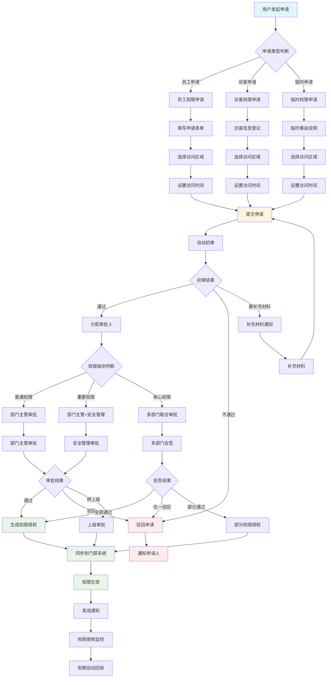
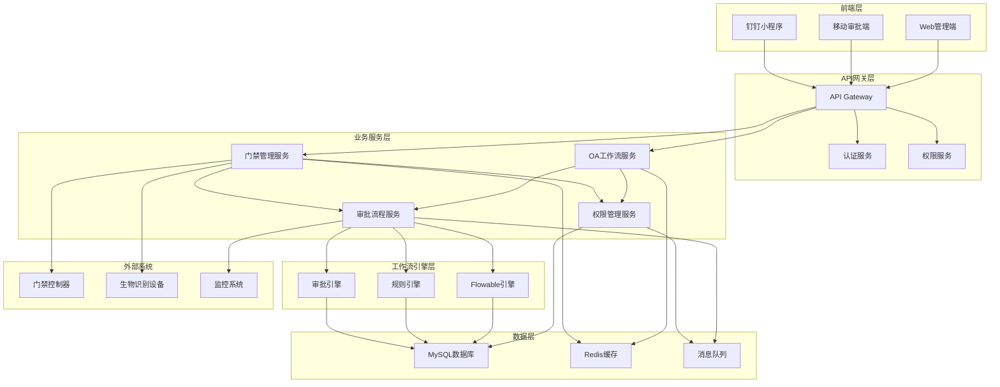

# 门禁权限申请审批流程图

## 📋 流程概述

门禁权限申请审批流程是IOE-DREAM智慧园区一卡通管理平台中的核心业务流程之一，用于员工、访客等用户申请特定区域或设备的门禁访问权限。该流程通过OA工作流引擎与门禁管理系统深度集成，实现权限申请、审批、授权、监控的全生命周期管理。

### 🎯 业务目标

- **安全管控**: 确保只有授权人员才能访问特定区域
- **流程规范**: 建立标准化的权限申请和审批流程
- **效率提升**: 简化权限申请流程，提高审批效率
- **审计追溯**: 完整记录权限申请和审批过程
- **风险控制**: 多级审批机制降低安全风险

### 📊 流程指标

| 指标项 | 目标值 | 说明 |
|---------|--------|------|
| **申请响应时间** | ≤ 2小时 | 从申请到首次审批响应 |
| **审批完成时间** | ≤ 24小时 | 从申请到最终审批完成 |
| **授权生效时间** | ≤ 5分钟 | 审批通过后权限生效 |
| **流程自动化率** | ≥ 90% | 自动化处理比例 |
| **用户满意度** | ≥ 95% | 用户体验评分 |

---

## 🔄 详细流程图



---

## 📋 流程节点详细说明

### 1. 申请发起阶段

#### 1.1 用户发起申请
- **触发条件**: 用户需要访问限制区域
- **输入信息**: 用户身份认证信息
- **处理逻辑**:
  - 验证用户身份
  - 判断申请类型（员工/访客/临时）
  - 加载对应申请表单
- **输出结果**: 申请表单界面

#### 1.2 申请类型判断
| 申请类型 | 适用场景 | 审批流程 | 权限期限 |
|---------|---------|---------|---------|
| **员工申请** | 内部员工日常工作区域 | 部门主管审批 | 长期有效 |
| **访客申请** | 外部人员访问 | 审批+安全管理 | 按访问时间 |
| **临时申请** | 临时性访问需求 | 简化审批 | 短期有效 |

### 2. 申请信息填写阶段

#### 2.1 员工权限申请表单
```json
{
  "applicantInfo": {
    "userId": "USER001",
    "userName": "张三",
    "department": "技术部",
    "position": "软件工程师",
    "employeeId": "EMP2024001"
  },
  "accessRequest": {
    "targetAreas": [
      {
        "areaId": "A001",
        "areaName": "服务器机房",
        "accessLevel": "CORE",
        "reason": "设备维护"
      }
    ],
    "timeRange": {
      "startDate": "2024-01-15",
      "endDate": "2024-12-31",
      "accessTimes": ["09:00-18:00"]
    },
    "specialRequirements": "需要24小时紧急访问权限"
  },
  "attachments": [
    "工作证明.pdf",
    "上级同意书.pdf"
  ]
}
```

#### 2.2 访客权限申请表单
```json
{
  "visitorInfo": {
    "visitorName": "李四",
    "idCard": "110101199001011234",
    "phone": "13800138000",
    "company": "ABC科技公司",
    "visitPurpose": "技术交流"
  },
  "hostInfo": {
    "hostUserId": "USER002",
    "hostName": "王五",
    "department": "技术部"
  },
  "accessRequest": {
    "targetAreas": [
      {
        "areaId": "B001",
        "areaName": "办公区A栋",
        "accessLevel": "NORMAL"
      }
    ],
    "timeRange": {
      "visitDate": "2024-01-20",
      "visitTime": "14:00-17:00"
    }
  }
}
```

### 3. 自动初审阶段

#### 3.1 初审规则引擎
```java
@Component
public class AccessPermissionAutoReviewService {

    @Resource
    private AccessRuleEngine ruleEngine;

    @Resource
    private EmployeeDao employeeDao;

    @Resource
    private AreaDao areaDao;

    /**
     * 执行自动初审
     */
    public AutoReviewResult executeAutoReview(AccessApplication application) {
        AutoReviewResult result = new AutoReviewResult();

        try {
            // 1. 基础信息验证
            validateBasicInfo(application, result);

            // 2. 权限级别检查
            checkAccessLevel(application, result);

            // 3. 时间合理性验证
            validateTimeRange(application, result);

            // 4. 区域冲突检查
            checkAreaConflict(application, result);

            // 5. 申请人资质验证
            validateApplicantQualification(application, result);

            // 6. 生成审批建议
            generateApprovalSuggestion(application, result);

        } catch (Exception e) {
            result.setStatus("FAILED");
            result.setMessage("自动初审异常: " + e.getMessage());
        }

        return result;
    }

    private void validateBasicInfo(AccessApplication application, AutoReviewResult result) {
        if (StringUtils.isBlank(application.getApplicantId())) {
            result.addError("申请人信息不能为空");
        }

        if (CollectionUtils.isEmpty(application.getAccessAreas())) {
            result.addError("访问区域不能为空");
        }

        if (application.getTimeRange() == null) {
            result.addError("访问时间不能为空");
        }
    }

    private void checkAccessLevel(AccessApplication application, AutoReviewResult result) {
        for (AccessArea area : application.getAccessAreas()) {
            AreaEntity areaEntity = areaDao.selectById(area.getAreaId());

            if (areaEntity == null) {
                result.addError("访问区域不存在: " + area.getAreaName());
                continue;
            }

            // 检查申请权限是否超过用户级别
            if (area.getRequiredAccessLevel() > getUserMaxAccessLevel(application.getApplicantId())) {
                result.addWarning("申请的权限级别超过用户当前级别");
            }
        }
    }

    private int getUserMaxAccessLevel(String userId) {
        EmployeeEntity employee = employeeDao.selectByUserId(userId);
        return employee != null ? employee.getAccessLevel() : 0;
    }
}
```

### 4. 审批分配阶段

#### 4.1 审批人分配规则
```java
@Service
public class AccessApprovalAssignService {

    @Resource
    private EmployeeDao employeeDao;

    @Resource
    private DepartmentDao departmentDao;

    /**
     * 分配审批人
     */
    public List<String> assignApprovers(AccessApplication application) {
        List<String> approvers = new ArrayList<>();

        // 1. 获取申请人信息
        EmployeeEntity applicant = employeeDao.selectByUserId(application.getApplicantId());

        // 2. 根据权限级别分配审批人
        for (AccessArea area : application.getAccessAreas()) {
            List<String> areaApprovers = getApproversForArea(area, applicant);
            approvers.addAll(areaApprovers);
        }

        // 3. 去重并排序
        return approvers.stream()
            .distinct()
            .sorted(this::compareApproverLevel)
            .collect(Collectors.toList());
    }

    private List<String> getApproversForArea(AccessArea area, EmployeeEntity applicant) {
        List<String> approvers = new ArrayList<>();

        switch (area.getRequiredAccessLevel()) {
            case 1: // 普通权限
                // 部门主管
                approvers.add(getDepartmentManager(applicant.getDepartmentId()));
                break;

            case 2: // 重要权限
                // 部门主管 + 安全管理员
                approvers.add(getDepartmentManager(applicant.getDepartmentId()));
                approvers.add(getSecurityManager());
                break;

            case 3: // 核心权限
                // 部门主管 + 安全管理员 + 分管领导
                approvers.add(getDepartmentManager(applicant.getDepartmentId()));
                approvers.add(getSecurityManager());
                approvers.add(getDivisionDirector(applicant.getDepartmentId()));
                break;

            default:
                throw new IllegalArgumentException("未知的权限级别: " + area.getRequiredAccessLevel());
        }

        return approvers;
    }
}
```

### 5. 审批执行阶段

#### 5.1 审批决策服务
```java
@Service
public class AccessApprovalDecisionService {

    @Resource
    private AccessApprovalAssignService assignService;

    @Resource
    private WorkflowEngine workflowEngine;

    /**
     * 执行审批决策
     */
    public ApprovalDecision executeApproval(ApprovalRequest request) {
        ApprovalDecision decision = new ApprovalDecision();

        try {
            // 1. 验证审批权限
            validateApprovalPermission(request);

            // 2. 评估申请风险
            RiskAssessment risk = assessApplicationRisk(request);
            decision.setRiskLevel(risk.getLevel());

            // 3. 检查历史记录
            ApplicantHistory history = getApplicantHistory(request.getApplicantId());
            decision.setHistoryScore(history.getScore());

            // 4. 综合决策
            DecisionResult result = makeDecision(request, risk, history);
            decision.setResult(result);

            // 5. 记录审批理由
            decision.setReason(generateDecisionReason(request, result));

            // 6. 处理会签
            if (needJointApproval(request)) {
                processJointApproval(request, decision);
            }

        } catch (Exception e) {
            decision.setResult(DecisionResult.REJECTED);
            decision.setReason("审批处理异常: " + e.getMessage());
        }

        return decision;
    }

    private RiskAssessment assessApplicationRisk(ApprovalRequest request) {
        RiskAssessment assessment = new RiskAssessment();

        // 风险因子评估
        int riskScore = 0;

        // 1. 时间风险
        if (isAfterHours(request.getTimeRange())) {
            riskScore += 10;
        }

        // 2. 区域风险
        for (AccessArea area : request.getAccessAreas()) {
            riskScore += getAreaRiskScore(area.getAreaId());
        }

        // 3. 申请人风险
        riskScore += getApplicantRiskScore(request.getApplicantId());

        // 4. 历史风险
        riskScore += getHistoricalRiskScore(request.getApplicantId());

        assessment.setScore(riskScore);

        if (riskScore >= 80) {
            assessment.setLevel(RiskLevel.HIGH);
        } else if (riskScore >= 50) {
            assessment.setLevel(RiskLevel.MEDIUM);
        } else {
            assessment.setLevel(RiskLevel.LOW);
        }

        return assessment;
    }
}
```

### 6. 权限授权阶段

#### 6.1 权限生成和同步服务
```java
@Service
public class AccessPermissionService {

    @Resource
    private AccessControlSystemClient accessControlClient;

    @Resource
    private PermissionDao permissionDao;

    /**
     * 生成权限授权
     */
    public PermissionAuthorization generateAuthorization(ApprovedApplication application) {
        PermissionAuthorization authorization = new PermissionAuthorization();

        try {
            // 1. 生成授权凭证
            String authCredential = generateAuthCredential(application);
            authorization.setCredential(authCredential);

            // 2. 设置权限范围
            authorization.setAccessAreas(application.getAccessAreas());
            authorization.setTimeRange(application.getTimeRange());

            // 3. 权限加密
            String encryptedAuth = encryptAuthorization(authorization);
            authorization.setEncryptedCredential(encryptedAuth);

            // 4. 同步到门禁系统
            syncToAccessControlSystem(authorization);

            // 5. 保存到本地数据库
            saveAuthorization(authorization);

            // 6. 设置生效时间
            authorization.setEffectiveTime(LocalDateTime.now());

        } catch (Exception e) {
            throw new RuntimeException("权限授权生成失败", e);
        }

        return authorization;
    }

    private void syncToAccessControlSystem(PermissionAuthorization authorization) {
        AccessControlRequest request = AccessControlRequest.builder()
            .userId(authorization.getUserId())
            .credential(authorization.getCredential())
            .accessAreas(authorization.getAccessAreas())
            .validFrom(authorization.getTimeRange().getStart())
            .validTo(authorization.getTimeRange().getEnd())
            .build();

        // 调用门禁系统API
        AccessControlResponse response = accessControlClient.grantAccess(request);

        if (!response.isSuccess()) {
            throw new RuntimeException("门禁系统授权失败: " + response.getErrorMessage());
        }
    }

    @Scheduled(cron = "0 0/5 * * * ?")
    public void checkAuthorizationStatus() {
        // 定期检查授权状态
        List<PermissionAuthorization> expiringSoon = findExpiringSoon();

        for (PermissionAuthorization auth : expiringSoon) {
            // 发送到期提醒
            sendExpiryNotification(auth);
        }
    }
}
```

### 7. 监控和回收阶段

#### 7.1 权限监控服务
```java
@Service
public class AccessMonitoringService {

    @Resource
    private AccessControlSystemClient accessControlClient;

    @Resource
    private AlertService alertService;

    /**
     * 监控权限使用情况
     */
    @EventListener
    @Async
    public void monitorAccessUsage(AccessEvent event) {
        try {
            // 1. 记录访问日志
            logAccessEvent(event);

            // 2. 异常行为检测
            detectAbnormalBehavior(event);

            // 3. 权限使用统计
            updateUsageStatistics(event);

            // 4. 安全风险评估
            assessSecurityRisk(event);

        } catch (Exception e) {
            log.error("权限监控异常", e);
        }
    }

    private void detectAbnormalBehavior(AccessEvent event) {
        // 检测异常访问模式
        if (isAbnormalTime(event.getAccessTime())) {
            alertService.sendAbnormalAccessAlert(event, "非正常时间访问");
        }

        if (isFrequentAccess(event.getUserId(), event.getAccessTime())) {
            alertService.sendAbnormalAccessAlert(event, "频繁访问异常");
        }

        if (isUnauthorizedArea(event.getUserId(), event.getAreaId())) {
            alertService.sendSecurityAlert(event, "未授权区域访问尝试");
        }
    }

    @Scheduled(cron = "0 0 2 * * ?")
    public void autoRevokeExpiredPermissions() {
        // 自动回收过期权限
        List<PermissionAuthorization> expired = findExpiredPermissions();

        for (PermissionAuthorization auth : expired) {
            revokePermission(auth, "权限过期自动回收");
        }
    }
}
```

---

## 📱 移动端审批流程

### 移动端界面设计
```vue
<template>
  <div class="access-approval-mobile">
    <van-nav-bar
      title="门禁权限申请"
      left-arrow
      @click-left="$router.go(-1)"
    />

    <!-- 申请表单 -->
    <div class="application-form">
      <van-cell-group>
        <van-field
          v-model="formData.applicantName"
          label="申请人"
          readonly
        />

        <van-field
          v-model="formData.department"
          label="部门"
          readonly
        />

        <van-field
          label="访问区域"
          readonly
          :value="selectedAreasText"
          @click="showAreaPicker = true"
        />

        <van-field
          label="访问时间"
          readonly
          :value="timeRangeText"
          @click="showTimePicker = true"
        />

        <van-field
          v-model="formData.reason"
          label="申请原因"
          type="textarea"
          placeholder="请详细说明申请原因"
        />
      </van-cell-group>

      <!-- 附件上传 -->
      <van-cell-group title="相关附件">
        <van-uploader
          v-model="attachments"
          :after-read="handleAttachmentUpload"
          :max-count="5"
        />
      </van-cell-group>
    </div>

    <!-- 区域选择器 -->
    <van-popup v-model="showAreaPicker" position="bottom">
      <van-area
        :area-list="areaList"
        @confirm="onAreaConfirm"
        @cancel="showAreaPicker = false"
      />
    </van-popup>

    <!-- 时间选择器 -->
    <van-popup v-model="showTimePicker" position="bottom">
      <van-datetime-picker
        v-model="selectedTime"
        type="datetime"
        @confirm="onTimeConfirm"
        @cancel="showTimePicker = false"
      />
    </van-popup>

    <!-- 提交按钮 -->
    <div class="submit-section">
      <van-button
        type="primary"
        block
        :loading="submitting"
        @click="submitApplication"
      >
        提交申请
      </van-button>
    </div>
  </div>
</template>

<script>
export default {
  name: 'AccessApprovalMobile',

  data() {
    return {
      formData: {
        applicantName: '',
        department: '',
        reason: ''
      },
      selectedAreas: [],
      selectedTime: null,
      attachments: [],
      showAreaPicker: false,
      showTimePicker: false,
      submitting: false
    }
  },

  computed: {
    selectedAreasText() {
      return this.selectedAreas.map(area => area.name).join(', ');
    },

    timeRangeText() {
      return this.selectedTime ? this.$dayjs(this.selectedTime).format('YYYY-MM-DD HH:mm') : '';
    }
  },

  async created() {
    await this.loadUserInfo();
    await this.loadAreaList();
  },

  methods: {
    async submitApplication() {
      if (!this.validateForm()) {
        return;
      }

      this.submitting = true;

      try {
        const application = {
          applicantId: this.$store.state.user.userId,
          accessAreas: this.selectedAreas,
          timeRange: {
            start: this.selectedTime,
            end: this.getEndTime()
          },
          reason: this.formData.reason,
          attachments: this.attachments
        };

        const response = await this.$http.post('/api/access/permission/apply', application);

        this.$toast.success('申请提交成功');
        this.$router.push('/access/approval/status/' + response.data.applicationId);

      } catch (error) {
        this.$toast.fail('提交失败: ' + error.message);
      } finally {
        this.submitting = false;
      }
    },

    validateForm() {
      if (this.selectedAreas.length === 0) {
        this.$toast('请选择访问区域');
        return false;
      }

      if (!this.selectedTime) {
        this.$toast('请选择访问时间');
        return false;
      }

      if (!this.formData.reason.trim()) {
        this.$toast('请填写申请原因');
        return false;
      }

      return true;
    }
  }
}
</script>
```

---

## 🔧 技术实现架构

### 系统架构图


### 核心组件依赖
```xml
<!-- pom.xml 核心依赖 -->
<dependencies>
    <!-- 工作流引擎 -->
    <dependency>
        <groupId>org.flowable</groupId>
        <artifactId>flowable-spring-boot-starter</artifactId>
        <version>7.0.1</version>
    </dependency>

    <!-- 规则引擎 -->
    <dependency>
        <groupId>org.drools</groupId>
        <artifactId>drools-core</artifactId>
        <version>8.44.0.Final</version>
    </dependency>

    <!-- 权限管理 -->
    <dependency>
        <groupId>org.springframework.security</groupId>
        <artifactId>spring-security-core</artifactId>
    </dependency>

    <!-- 数据库连接池 -->
    <dependency>
        <groupId>com.alibaba</groupId>
        <artifactId>druid-spring-boot-starter</artifactId>
        <version>1.2.20</version>
    </dependency>

    <!-- Redis缓存 -->
    <dependency>
        <groupId>org.springframework.boot</groupId>
        <artifactId>spring-boot-starter-data-redis</artifactId>
    </dependency>

    <!-- 消息队列 -->
    <dependency>
        <groupId>org.springframework.boot</groupId>
        <artifactId>spring-boot-starter-amqp</artifactId>
    </dependency>
</dependencies>
```

---

## 📊 监控和运维

### 关键性能指标(KPI)
```java
@Component
public class AccessApprovalMetrics {

    @Resource
    private MeterRegistry meterRegistry;

    // 申请数量统计
    public void recordApplication(String type) {
        meterRegistry.counter("access.applications",
            "type", type
        ).increment();
    }

    // 审批时间统计
    public void recordApprovalTime(String level, Duration duration) {
        meterRegistry.timer("access.approval.duration",
            "level", level
        ).record(duration);
    }

    // 权限使用统计
    public void recordAccessUsage(String areaId) {
        meterRegistry.counter("access.usage",
            "area", areaId
        ).increment();
    }

    // 异常行为统计
    public void recordAbnormalBehavior(String type) {
        meterRegistry.counter("access.abnormal",
            "type", type
        ).increment();
    }
}
```

### 实时监控面板
```json
{
  "dashboard": {
    "title": "门禁权限审批监控",
    "panels": [
      {
        "title": "申请趋势",
        "type": "line-chart",
        "metrics": [
          "access.applications",
          "access.approvals.completed"
        ]
      },
      {
        "title": "审批效率",
        "type": "gauge",
        "metrics": [
          "access.approval.duration"
        ]
      },
      {
        "title": "异常告警",
        "type": "table",
        "metrics": [
          "access.abnormal"
        ]
      }
    ]
  }
}
```

---

## 📋 业务规则配置

### 审批规则矩阵
```java
@Configuration
public class AccessApprovalRules {

    /**
     * 权限级别对应审批规则
     */
    public static final Map<Integer, ApprovalRule> APPROVAL_RULES = Map.of(
        1, new ApprovalRule("NORMAL", Arrays.asList("DEPARTMENT_MANAGER"), 1),
        2, new ApprovalRule("IMPORTANT", Arrays.asList("DEPARTMENT_MANAGER", "SECURITY_MANAGER"), 2),
        3, new ApprovalRule("CRITICAL", Arrays.asList("DEPARTMENT_MANAGER", "SECURITY_MANAGER", "DIVISION_DIRECTOR"), 3)
    );

    /**
     * 时间限制规则
     */
    public static final Map<String, TimeRestriction> TIME_RESTRICTIONS = Map.of(
        "SERVER_ROOM", new TimeRestriction("08:00-18:00", false),
        "DATA_CENTER", new TimeRestriction("06:00-22:00", true),
        "LAB_AREA", new TimeRestriction("09:00-21:00", false)
    );

    /**
     * 区域互斥规则
     */
    public static final Map<String, List<String>> MUTUALLY_EXCLUSIVE_AREAS = Map.of(
        "FINANCE_AREA", Arrays.asList("IT_SERVER_ROOM"),
        "RESEARCH_AREA", Arrays.asList("PUBLIC_AREA")
    );
}
```

---

## 🎯 总结

门禁权限申请审批流程是IOE-DREAM智慧园区安全管理的重要组成部分，通过：

1. **智能化初审** - 自动验证申请信息，提高审批效率
2. **分级审批** - 根据权限级别分配不同审批人
3. **全程监控** - 权限使用全生命周期监控
4. **自动回收** - 权限到期自动回收，保障安全
5. **移动审批** - 支持移动端审批，提高响应速度

该流程确保了园区门禁安全管理的规范化、自动化和智能化，为智慧园区建设提供了坚实的安全保障。

---

**流程图状态**: ✅ 已完成
**适用版本**: IOE-DREAM v2.0.0+
**维护责任人**: 安全管理团队 + OA工作流团队
**最后审核**: 2025-12-16