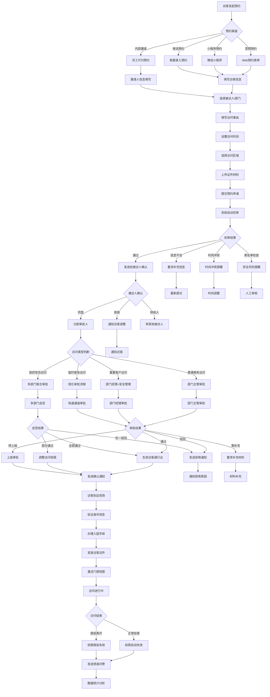
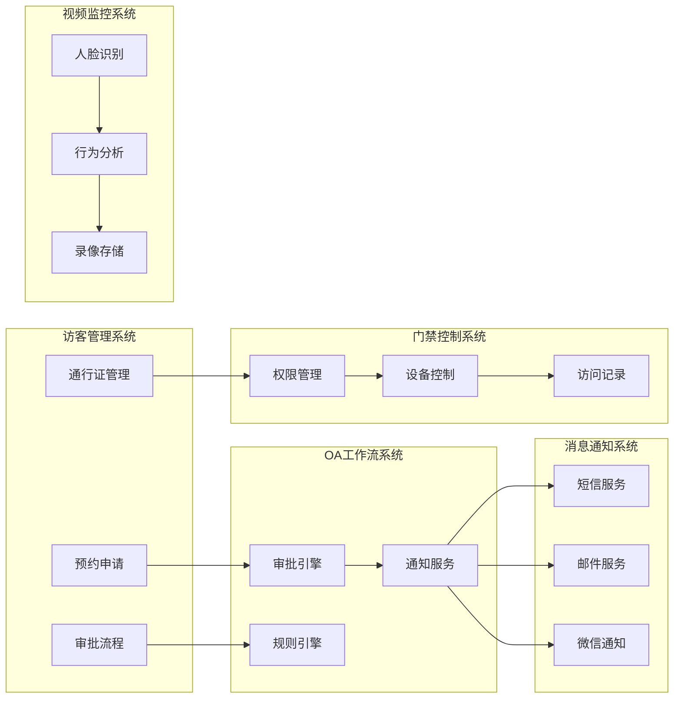

# 访客预约审批流程图

## 📋 流程概述

访客预约审批流程是IOE-DREAM智慧园区一卡通管理平台中重要的外部人员管理流程，用于外部访客通过预约申请进入园区进行商务访问、技术交流、参观考察等活动。该流程结合了OA工作流引擎、访客管理系统、门禁控制系统和视频监控系统，为访客提供从预约申请到离园的全流程服务。

### 🎯 业务目标

- **便捷预约**: 为访客提供简单快捷的预约申请渠道
- **安全保障**: 通过多级审批确保访客访问的安全性
- **体验优化**: 提升访客接待效率和服务质量
- **数字化管理**: 实现访客管理的全流程数字化
- **数据分析**: 访客数据统计和分析支持管理决策

### 📊 流程指标

| 指标项 | 目标值 | 说明 |
|---------|--------|------|
| **预约响应时间** | ≤ 4小时 | 从预约申请到首次审批响应 |
| **审批完成时间** | ≤ 24小时 | 从申请到最终审批完成 |
| **入园办理时间** | ≤ 5分钟 | 访客到达后办理入园手续时间 |
| **电子通行证生成** | ≤ 2分钟 | 审批通过后生成电子通行证 |
| **访客满意度** | ≥ 95% | 访客体验评分 |

---

## 🔄 详细流程图



---

## 📋 流程节点详细说明

### 1. 预约申请阶段

#### 1.1 访客信息登记
```json
{
  "visitorInfo": {
    "visitorName": "李明",
    "gender": "男",
    "idCard": "110101199001011234",
    "phone": "13800138000",
    "email": "liming@example.com",
    "company": "ABC科技有限公司",
    "position": "技术总监",
    "photoUrl": "/uploads/visitor/photo_001.jpg"
  },
  "visitInfo": {
    "visitPurpose": "技术交流会议",
    "visitType": "BUSINESS",
    "expectedDuration": "2小时",
    "vehicleInfo": {
      "hasVehicle": true,
      "plateNumber": "京A12345",
      "vehicleType": "轿车"
    }
  },
  "materials": [
    {
      "type": "ID_CARD",
      "url": "/uploads/visitor/idcard_front.jpg",
      "name": "身份证正面"
    },
    {
      "type": "BUSINESS_CARD",
      "url": "/uploads/visitor/business_card.jpg",
      "name": "名片"
    }
  ]
}
```

#### 1.2 访问时间设置
```java
@Component
public class VisitTimeValidationService {

    @Resource
    private HolidayService holidayService;

    @Resource
    private WorkingHoursService workingHoursService;

    /**
     * 验证访问时间
     */
    public TimeValidationResult validateVisitTime(LocalDateTime startTime, LocalDateTime endTime) {
        TimeValidationResult result = new TimeValidationResult();

        // 1. 检查时间合理性
        if (startTime.isAfter(endTime)) {
            result.setValid(false);
            result.setMessage("开始时间不能晚于结束时间");
            return result;
        }

        // 2. 检查访问时长
        Duration duration = Duration.between(startTime, endTime);
        if (duration.toHours() > 8) {
            result.addWarning("访问时间超过8小时，建议分段安排");
        }

        // 3. 检查工作时间
        if (!isWorkingTime(startTime)) {
            result.addWarning("访问时间包含非工作时间");
        }

        // 4. 检查节假日
        if (isHoliday(startTime.toLocalDate())) {
            result.addWarning("访问时间为节假日");
        }

        // 5. 检查时间冲突
        List<VisitSchedule> conflicts = checkTimeConflicts(startTime, endTime);
        if (!conflicts.isEmpty()) {
            result.setConflicts(conflicts);
        }

        result.setValid(true);
        return result;
    }

    private boolean isWorkingTime(LocalDateTime time) {
        return workingHoursService.isWorkingTime(time);
    }

    private boolean isHoliday(LocalDate date) {
        return holidayService.isHoliday(date);
    }
}
```

### 2. 自动初审阶段

#### 2.1 访客信息验证服务
```java
@Service
public class VisitorPreCheckService {

    @Resource
    private BlacklistService blacklistService;

    @Resource
    private IdCardVerificationService idCardService;

    @Resource
    private VisitorDao visitorDao;

    /**
     * 执行访客自动初审
     */
    public VisitorPreCheckResult executePreCheck(VisitorApplication application) {
        VisitorPreCheckResult result = new VisitorPreCheckResult();

        try {
            // 1. 身份证真实性验证
            IdCardVerificationResult idResult = verifyIdCard(application.getIdCard());
            result.setIdCardValid(idResult.isValid());
            if (!idResult.isValid()) {
                result.addError("身份证信息验证失败: " + idResult.getMessage());
            }

            // 2. 黑名单检查
            BlacklistCheckResult blacklistResult = checkBlacklist(application);
            if (blacklistResult.isBlacklisted()) {
                result.setBlacklisted(true);
                result.addError("访客在黑名单中: " + blacklistResult.getReason());
                return result;
            }

            // 3. 历史访问记录检查
            VisitorHistory history = getVisitorHistory(application.getIdCard());
            result.setHistoryScore(calculateHistoryScore(history));

            // 4. 安全风险评估
            SecurityRisk risk = assessSecurityRisk(application, history);
            result.setRiskLevel(risk.getLevel());

            // 5. 访问权限匹配检查
            validateAccessPermissions(application, result);

        } catch (Exception e) {
            result.setSuccess(false);
            result.addError("自动初审异常: " + e.getMessage());
        }

        return result;
    }

    private IdCardVerificationResult verifyIdCard(String idCard) {
        // 调用第三方身份证验证API
        return idCardService.verify(idCard);
    }

    private BlacklistCheckResult checkBlacklist(VisitorApplication application) {
        return blacklistService.check(
            application.getIdCard(),
            application.getPhone(),
            application.getCompany()
        );
    }

    private SecurityRisk assessSecurityRisk(VisitorApplication application, VisitorHistory history) {
        SecurityRisk risk = new SecurityRisk();

        int riskScore = 0;

        // 公司风险评估
        if (isHighRiskCompany(application.getCompany())) {
            riskScore += 20;
        }

        // 访问事由风险评估
        if (isHighRiskPurpose(application.getVisitPurpose())) {
            riskScore += 15;
        }

        // 历史记录风险评估
        if (history.hasViolationRecords()) {
            riskScore += 30;
        }

        // 时间风险评估
        if (isAfterHours(application.getStartTime())) {
            riskScore += 10;
        }

        risk.setScore(riskScore);

        if (riskScore >= 50) {
            risk.setLevel(RiskLevel.HIGH);
        } else if (riskScore >= 25) {
            risk.setLevel(RiskLevel.MEDIUM);
        } else {
            risk.setLevel(RiskLevel.LOW);
        }

        return risk;
    }
}
```

### 3. 被访人确认阶段

#### 3.1 被访人确认服务
```java
@Service
public class HostConfirmationService {

    @Resource
    private NotificationService notificationService;

    @Resource
    private EmployeeDao employeeDao;

    @Resource
    private VisitApplicationDao applicationDao;

    /**
     * 发送被访人确认通知
     */
    public void sendHostConfirmation(VisitorApplication application) {
        HostConfirmation confirmation = HostConfirmation.builder()
            .applicationId(application.getId())
            .visitorName(application.getVisitorName())
            .visitorCompany(application.getCompany())
            .visitPurpose(application.getVisitPurpose())
            .visitTime(application.getStartTime())
            .hostUserId(application.getHostUserId())
            .confirmationUrl(generateConfirmationUrl(application.getId()))
            .build();

        // 发送多渠道通知
        notificationService.sendEmailConfirmation(confirmation);
        notificationService.sendSmsConfirmation(confirmation);
        notificationService.sendSystemNotification(confirmation);

        // 记录通知日志
        logConfirmationSent(confirmation);
    }

    /**
     * 处理被访人确认响应
     */
    public ConfirmationResult processHostConfirmation(String applicationId, HostResponse response) {
        VisitorApplication application = applicationDao.selectById(applicationId);
        if (application == null) {
            throw new IllegalArgumentException("预约申请不存在");
        }

        ConfirmationResult result = new ConfirmationResult();

        switch (response.getAction()) {
            case AGREE:
                application.setStatus("HOST_CONFIRMED");
                application.setHostConfirmationTime(LocalDateTime.now());
                application.setHostRemark(response.getRemark());

                // 继续审批流程
                startApprovalProcess(application);
                result.setMessage("确认成功，已进入审批流程");
                break;

            case REJECT:
                application.setStatus("HOST_REJECTED");
                application.setHostRejectionReason(response.getReason());
                application.setHostRejectionTime(LocalDateTime.now());

                // 通知访客调整
                notifyVisitorAdjustment(application, response.getReason());
                result.setMessage("已拒绝，请访客调整预约信息");
                break;

            case TRANSFER:
                application.setStatus("HOST_TRANSFERRED");
                application.setNewHostUserId(response.getNewHostUserId());
                application.setTransferReason(response.getReason());

                // 转给新被访人
                transferToNewHost(application, response.getNewHostUserId());
                result.setMessage("已转给其他被访人确认");
                break;

            default:
                throw new IllegalArgumentException("未知的确认动作: " + response.getAction());
        }

        applicationDao.updateById(application);
        return result;
    }

    private void startApprovalProcess(VisitorApplication application) {
        // 启动工作流审批
        WorkflowStartRequest workflowRequest = WorkflowStartRequest.builder()
            .processKey("visitor_approval")
            .businessKey(application.getId())
            .variables(Map.of(
                "applicationId", application.getId(),
                "visitorName", application.getVisitorName(),
                "visitPurpose", application.getVisitPurpose(),
                "riskLevel", application.getRiskLevel(),
                "hostUserId", application.getHostUserId()
            ))
            .build();

        workflowEngine.startProcess(workflowRequest);
    }
}
```

### 4. 审批执行阶段

#### 4.1 审批决策引擎
```java
@Service
public class VisitorApprovalEngine {

    @Resource
    private ApprovalRuleEngine ruleEngine;

    @Resource
    private SecurityPolicyService securityPolicyService;

    /**
     * 执行审批决策
     */
    public ApprovalDecision executeDecision(ApprovalContext context) {
        ApprovalDecision decision = new ApprovalDecision();

        try {
            // 1. 应用审批规则
            List<ApprovalRule> rules = getApplicableRules(context);
            for (ApprovalRule rule : rules) {
                RuleResult result = ruleEngine.apply(rule, context);
                decision.addRuleResult(rule.getName(), result);

                if (!result.isPassed() && rule.isMandatory()) {
                    decision.setResult(DecisionResult.REJECTED);
                    decision.setReason("违反强制规则: " + rule.getName());
                    return decision;
                }
            }

            // 2. 安全策略检查
            SecurityPolicyCheck securityCheck = securityPolicyService.check(context);
            decision.setSecurityCheck(securityCheck);

            if (securityCheck.getRiskLevel() == RiskLevel.HIGH &&
                !context.getApprovalLevel().equals("EMERGENCY")) {
                decision.setResult(DecisionResult.MANUAL_REVIEW);
                decision.setReason("高风险访问需要人工审核");
                return decision;
            }

            // 3. 综合决策
            decision.setResult(calculateFinalDecision(decision));
            decision.setReason(generateDecisionReason(decision));

        } catch (Exception e) {
            decision.setResult(DecisionResult.ERROR);
            decision.setReason("决策引擎异常: " + e.getMessage());
        }

        return decision;
    }

    private List<ApprovalRule> getApplicableRules(ApprovalContext context) {
        return ruleEngine.getRulesByTypeAndLevel(
            context.getVisitType(),
            context.getApprovalLevel()
        );
    }

    private DecisionResult calculateFinalDecision(ApprovalDecision decision) {
        // 规则评估
        int passedRules = 0;
        int totalRules = decision.getRuleResults().size();

        for (RuleResult result : decision.getRuleResults().values()) {
            if (result.isPassed()) {
                passedRules++;
            }
        }

        // 安全评估
        SecurityPolicyCheck securityCheck = decision.getSecurityCheck();
        double ruleScore = (double) passedRules / totalRules;
        double securityScore = securityCheck.getScore();
        double totalScore = (ruleScore * 0.6) + (securityScore * 0.4);

        if (totalScore >= 0.8) {
            return DecisionResult.APPROVED;
        } else if (totalScore >= 0.6) {
            return DecisionResult.APPROVED_WITH_CONDITIONS;
        } else {
            return DecisionResult.REJECTED;
        }
    }
}
```

### 5. 通行证生成阶段

#### 5.1 电子通行证服务
```java
@Service
public class VisitorPassService {

    @Resource
    private QRCodeService qrCodeService;

    @Resource
    private PhotoService photoService;

    @Resource
    private AccessControlClient accessControlClient;

    /**
     * 生成访客通行证
     */
    public VisitorPass generateVisitorPass(VisitorApplication application) {
        VisitorPass pass = new VisitorPass();

        try {
            // 1. 生成通行证编号
            String passNumber = generatePassNumber();
            pass.setPassNumber(passNumber);

            // 2. 生成二维码
            QRCodeInfo qrInfo = QRCodeInfo.builder()
                .passNumber(passNumber)
                .visitorName(application.getVisitorName())
                .idCard(application.getIdCard())
                .validFrom(application.getStartTime())
                .validTo(application.getEndTime())
                .accessAreas(application.getAccessAreas())
                .build();

            String qrCode = qrCodeService.generate(qrInfo);
            pass.setQrCode(qrCode);

            // 3. 处理访客照片
            String photo = processVisitorPhoto(application.getPhotoUrl());
            pass.setPhotoUrl(photo);

            // 4. 设置访问权限
            pass.setAccessAreas(application.getAccessAreas());
            pass.setValidPeriod(TimeRange.builder()
                .start(application.getStartTime())
                .end(application.getEndTime())
                .build());

            // 5. 生成访客凭证
            byte[] credential = generateCredential(pass);
            pass.setCredential(credential);

            // 6. 同步到门禁系统
            syncToAccessControl(pass);

            // 7. 发送通行证给访客
            sendPassToVisitor(pass, application);

        } catch (Exception e) {
            throw new RuntimeException("生成访客通行证失败", e);
        }

        return pass;
    }

    private String generatePassNumber() {
        // 格式: VP + 年月日 + 4位流水号
        String dateStr = LocalDate.now().format(DateTimeFormatter.ofPattern("yyyyMMdd"));
        String sequence = String.format("%04d", getNextSequence());
        return "VP" + dateStr + sequence;
    }

    private void syncToAccessControl(VisitorPass pass) {
        AccessControlRequest request = AccessControlRequest.builder()
            .credential(pass.getCredential())
            .qrCode(pass.getQrCode())
            .accessAreas(pass.getAccessAreas())
            .validFrom(pass.getValidPeriod().getStart())
            .validTo(pass.getValidPeriod().getEnd())
            .passType("VISITOR")
            .build();

        AccessControlResponse response = accessControlClient.grantAccess(request);

        if (!response.isSuccess()) {
            throw new RuntimeException("门禁系统同步失败: " + response.getErrorMessage());
        }
    }

    private void sendPassToVisitor(VisitorPass pass, VisitorApplication application) {
        // 发送电子通行证到访客手机
        String message = String.format(
            "您的访客通行证已生成，通行证号: %s，访问时间: %s - %s",
            pass.getPassNumber(),
            pass.getValidPeriod().getStart().format(DateTimeFormatter.ofPattern("yyyy-MM-dd HH:mm")),
            pass.getValidPeriod().getEnd().format(DateTimeFormatter.ofPattern("yyyy-MM-dd HH:mm"))
        );

        notificationService.sendSms(application.getPhone(), message);
        notificationService.sendEmail(application.getEmail(), "访客通行证", message, pass.getQrCode());
    }
}
```

### 6. 现场接待阶段

#### 6.1 访客接待服务
```java
@Service
public class VisitorReceptionService {

    @Resource
    private FaceRecognitionService faceRecognitionService;

    @Resource
    private VisitorCheckInDao checkInDao;

    /**
     * 访客签到
     */
    public VisitorCheckInResult checkIn(VisitorCheckInRequest request) {
        VisitorCheckInResult result = new VisitorCheckInResult();

        try {
            // 1. 验证通行证
            VisitorPass pass = validateVisitorPass(request.getPassNumber());
            result.setPass(pass);

            // 2. 身份验证
            IdentityVerificationResult identityResult = verifyIdentity(request, pass);
            result.setIdentityVerified(identityResult.isSuccess());

            if (!identityResult.isSuccess()) {
                result.setSuccess(false);
                result.setMessage("身份验证失败: " + identityResult.getMessage());
                return result;
            }

            // 3. 签到登记
            VisitorCheckIn checkIn = createCheckInRecord(request, pass);
            checkInDao.insert(checkIn);

            // 4. 激活访问权限
            activateAccessPermissions(pass);

            // 5. 发放访客证件
            if (request.needPhysicalCard()) {
                String cardId = issuePhysicalCard(pass);
                result.setCardId(cardId);
            }

            // 6. 通知被访人
            notifyHostArrival(pass);

            result.setSuccess(true);
            result.setMessage("签到成功");

        } catch (Exception e) {
            result.setSuccess(false);
            result.setMessage("签到失败: " + e.getMessage());
        }

        return result;
    }

    private IdentityVerificationResult verifyIdentity(VisitorCheckInRequest request, VisitorPass pass) {
        // 多重身份验证
        IdentityVerificationResult result = new IdentityVerificationResult();

        // 1. 人脸识别验证
        if (request.hasFaceImage()) {
            FaceRecognitionResult faceResult = faceRecognitionService.verify(
                request.getFaceImage(),
                pass.getPhotoUrl()
            );
            result.setFaceMatch(faceResult.isMatch());
            result.setFaceScore(faceResult.getScore());
        }

        // 2. 二维码验证
        QRCodeVerificationResult qrResult = qrCodeService.verify(request.getQrCode());
        result.setQrValid(qrResult.isValid());

        // 3. 证件验证
        if (request.hasIdCard()) {
            IdCardVerificationResult idResult = idCardService.verify(request.getIdCard());
            result.setIdCardValid(idResult.isValid());
        }

        // 综合判断
        result.setSuccess(calculateIdentityScore(result) >= 0.8);
        return result;
    }

    private void activateAccessPermissions(VisitorPass pass) {
        // 激活门禁权限
        for (AccessArea area : pass.getAccessAreas()) {
            accessControlClient.activateAccess(
                pass.getCredential(),
                area.getAreaId(),
                pass.getValidPeriod()
            );
        }

        // 记录权限激活日志
        logAccessActivation(pass);
    }
}
```

---

## 📱 移动端应用

### 访客小程序界面
```vue
<template>
  <div class="visitor-appointment">
    <van-nav-bar
      title="访客预约"
      left-arrow
      @click-left="$router.go(-1)"
    />

    <!-- 预约表单 -->
    <van-form @submit="submitAppointment">
      <van-cell-group title="访客信息">
        <van-field
          v-model="form.visitorName"
          label="姓名"
          placeholder="请输入真实姓名"
          :rules="[{ required: true, message: '请输入姓名' }]"
        />

        <van-field
          v-model="form.phone"
          label="手机号"
          type="tel"
          placeholder="请输入手机号"
          :rules="[
            { required: true, message: '请输入手机号' },
            { pattern: /^1[3-9]\d{9}$/, message: '请输入正确的手机号' }
          ]"
        />

        <van-field
          v-model="form.idCard"
          label="身份证号"
          placeholder="请输入身份证号"
          :rules="[
            { required: true, message: '请输入身份证号' },
            { pattern: /^[1-9]\d{5}(18|19|20)\d{2}((0[1-9])|(1[0-2]))(([0-2][1-9])|10|20|30|31)\d{3}[0-9Xx]$/, message: '请输入正确的身份证号' }
          ]"
        />

        <van-field
          v-model="form.company"
          label="公司名称"
          placeholder="请输入公司名称"
          :rules="[{ required: true, message: '请输入公司名称' }]"
        />

        <van-field
          v-model="form.position"
          label="职位"
          placeholder="请输入职位"
        />
      </van-cell-group>

      <van-cell-group title="访问信息">
        <van-field
          v-model="form.hostName"
          label="被访人"
          placeholder="请输入被访人姓名"
          :rules="[{ required: true, message: '请输入被访人姓名' }]"
          @click="showHostPicker = true"
          readonly
        />

        <van-field
          v-model="form.visitPurpose"
          label="访问事由"
          placeholder="请输入访问事由"
          :rules="[{ required: true, message: '请输入访问事由' }]"
        />

        <van-field
          label="访问时间"
          :value="timeRangeText"
          placeholder="请选择访问时间"
          :rules="[{ required: true, message: '请选择访问时间' }]"
          @click="showTimePicker = true"
          readonly
        />

        <van-field
          label="访问区域"
          :value="selectedAreasText"
          placeholder="请选择访问区域"
          :rules="[{ required: true, message: '请选择访问区域' }]"
          @click="showAreaPicker = true"
          readonly
        />
      </van-cell-group>

      <van-cell-group title="证件上传">
        <van-uploader
          v-model="idCardImages"
          :after-read="handleIdCardUpload"
          :max-count="2"
          accept="image/*"
        >
          <template #preview-cover>
            <div class="preview-cover">
              <span>{{ file.name }}</span>
            </div>
          </template>
        </van-uploader>
      </van-cell-group>

      <!-- 提交按钮 -->
      <div class="submit-section">
        <van-button
          type="primary"
          block
          native-type="submit"
          :loading="submitting"
        >
          提交预约
        </van-button>
      </div>
    </van-form>

    <!-- 被访人选择器 -->
    <van-popup v-model="showHostPicker" position="bottom">
      <van-search
        v-model="hostSearchKeyword"
        placeholder="搜索被访人"
        @search="searchHosts"
      />
      <van-picker
        show-toolbar
        :columns="hostColumns"
        @confirm="onHostConfirm"
        @cancel="showHostPicker = false"
      />
    </van-popup>

    <!-- 时间选择器 -->
    <van-popup v-model="showTimePicker" position="bottom">
      <van-datetime-picker
        v-model="selectedStartTime"
        type="datetime"
        title="开始时间"
        @confirm="onStartTimeConfirm"
        @cancel="showTimePicker = false"
      />
    </van-popup>

    <!-- 区域选择器 -->
    <van-popup v-model="showAreaPicker" position="bottom">
      <van-checkbox-group v-model="selectedAreas">
        <van-cell-group>
          <van-cell
            v-for="area in areaList"
            :key="area.id"
            :title="area.name"
            clickable
            @click="toggleArea(area)"
          >
            <template #right-icon>
              <van-checkbox :name="area.id" />
            </template>
          </van-cell>
        </van-cell-group>
      </van-checkbox-group>
    </van-popup>
  </div>
</template>

<script>
export default {
  name: 'VisitorAppointment',

  data() {
    return {
      form: {
        visitorName: '',
        phone: '',
        idCard: '',
        company: '',
        position: '',
        hostName: '',
        hostId: '',
        visitPurpose: ''
      },
      selectedStartTime: null,
      selectedEndTime: null,
      selectedAreas: [],
      idCardImages: [],
      showHostPicker: false,
      showTimePicker: false,
      showAreaPicker: false,
      hostSearchKeyword: '',
      hostColumns: [],
      areaList: [],
      submitting: false
    }
  },

  computed: {
    timeRangeText() {
      if (this.selectedStartTime && this.selectedEndTime) {
        return `${this.$dayjs(this.selectedStartTime).format('YYYY-MM-DD HH:mm')} - ${this.$dayjs(this.selectedEndTime).format('HH:mm')}`;
      }
      return '';
    },

    selectedAreasText() {
      return this.selectedAreas.map(area => area.name).join(', ');
    }
  },

  async created() {
    await this.loadAreaList();
    await this.loadHostList();
  },

  methods: {
    async submitAppointment() {
      if (!this.validateForm()) {
        return;
      }

      this.submitting = true;

      try {
        const appointment = {
          visitorInfo: {
            name: this.form.visitorName,
            phone: this.form.phone,
            idCard: this.form.idCard,
            company: this.form.company,
            position: this.form.position
          },
          visitInfo: {
            hostId: this.form.hostId,
            hostName: this.form.hostName,
            purpose: this.form.visitPurpose,
            startTime: this.selectedStartTime,
            endTime: this.selectedEndTime,
            areas: this.selectedAreas
          },
          attachments: this.idCardImages
        };

        const response = await this.$http.post('/api/visitor/appointment', appointment);

        this.$toast.success('预约提交成功');
        this.$router.push('/visitor/status/' + response.data.appointmentId);

      } catch (error) {
        this.$toast.fail('提交失败: ' + error.message);
      } finally {
        this.submitting = false;
      }
    },

    validateForm() {
      // 表单验证逻辑
      return true;
    },

    async loadAreaList() {
      const response = await this.$http.get('/api/visitor/areas');
      this.areaList = response.data;
    },

    async loadHostList() {
      const response = await this.$http.get('/api/visitor/hosts');
      this.hostColumns = response.data.map(host => ({
        text: host.name,
        value: host.id
      }));
    }
  }
}
</script>
```

---

## 🔧 系统集成架构

### 与其他系统集成


### API接口设计
```java
@RestController
@RequestMapping("/api/visitor")
public class VisitorController {

    @PostMapping("/appointment")
    public ResponseDTO<String> submitAppointment(@Valid @RequestBody VisitorAppointmentRequest request) {
        String appointmentId = visitorService.submitAppointment(request);
        return ResponseDTO.ok(appointmentId);
    }

    @GetMapping("/appointment/{id}/status")
    public ResponseDTO<AppointmentStatus> getAppointmentStatus(@PathVariable String id) {
        AppointmentStatus status = visitorService.getAppointmentStatus(id);
        return ResponseDTO.ok(status);
    }

    @PostMapping("/checkin")
    public ResponseDTO<VisitorCheckInResult> checkIn(@Valid @RequestBody VisitorCheckInRequest request) {
        VisitorCheckInResult result = visitorService.checkIn(request);
        return ResponseDTO.ok(result);
    }

    @PostMapping("/checkout")
    public ResponseDTO<Void> checkOut(@Valid @RequestBody VisitorCheckOutRequest request) {
        visitorService.checkOut(request);
        return ResponseDTO.ok();
    }

    @GetMapping("/pass/{passNumber}")
    public ResponseDTO<VisitorPass> getVisitorPass(@PathVariable String passNumber) {
        VisitorPass pass = visitorService.getVisitorPass(passNumber);
        return ResponseDTO.ok(pass);
    }

    @GetMapping("/statistics")
    public ResponseDTO<VisitorStatistics> getVisitorStatistics(
            @RequestParam @DateTimeFormat(iso = DateTimeFormat.ISO.DATE_TIME) LocalDateTime startTime,
            @RequestParam @DateTimeFormat(iso = DateTimeFormat.ISO.DATE_TIME) LocalDateTime endTime) {
        VisitorStatistics statistics = visitorService.getStatistics(startTime, endTime);
        return ResponseDTO.ok(statistics);
    }
}
```

---

## 📊 数据分析和监控

### 访客数据统计
```java
@Service
public class VisitorAnalyticsService {

    @Resource
    private VisitorDao visitorDao;

    @Resource
    private CheckInDao checkInDao;

    /**
     * 生成访客统计报告
     */
    public VisitorStatisticsReport generateReport(LocalDateTime startTime, LocalDateTime endTime) {
        VisitorStatisticsReport report = new VisitorStatisticsReport();

        // 1. 基础统计数据
        report.setTotalVisitors(visitorDao.countVisitors(startTime, endTime));
        report.setCompletedVisitors(visitorDao.countCompletedVisitors(startTime, endTime));
        report.setCancelledVisitors(visitorDao.countCancelledVisitors(startTime, endTime));

        // 2. 访客类型分布
        report.setVisitorTypeDistribution(visitorDao.getVisitorTypeDistribution(startTime, endTime));

        // 3. 访问目的分布
        report.setPurposeDistribution(visitorDao.getPurposeDistribution(startTime, endTime));

        // 4. 时间段分布
        report.setTimeDistribution(checkInDao.getTimeDistribution(startTime, endTime));

        // 5. 部门接待统计
        report.setDepartmentStatistics(visitorDao.getDepartmentStatistics(startTime, endTime));

        // 6. 满意度统计
        report.setSatisfactionStatistics(visitorDao.getSatisfactionStatistics(startTime, endTime));

        return report;
    }

    /**
     * 实时监控访客流量
     */
    public VisitorFlowMonitor getRealTimeFlowMonitor() {
        VisitorFlowMonitor monitor = new VisitorFlowMonitor();

        LocalDateTime now = LocalDateTime.now();
        LocalDateTime todayStart = now.toLocalDate().atStartOfDay();

        monitor.setCurrentVisitors(checkInDao.getCurrentVisitors());
        monitor.setTodayVisitors(visitorDao.countVisitors(todayStart, now));
        monitor.setPeakTime(checkInDao.getPeakTime(todayStart, now));
        monitor.setAverageVisitDuration(checkInDao.getAverageVisitDuration(todayStart, now));

        return monitor;
    }
}
```

---

## 🎯 总结

访客预约审批流程通过数字化、智能化的方式，为外部访客提供了便捷、安全、高效的访问体验。该流程具有以下特点：

1. **多渠道预约** - 支持官网、小程序、内部邀请等多种预约方式
2. **智能初审** - 自动验证访客身份和安全风险
3. **分级审批** - 根据访客类型和访问内容分配不同审批流程
4. **电子通行证** - 生成二维码电子通行证，支持移动端展示
5. **全程监控** - 从预约到离园的全流程监控和记录
6. **数据分析** - 丰富的访客数据统计和分析功能

该流程不仅提升了访客接待效率，也加强了园区安全管理，为企业形象和访客体验提供了有力保障。

---

**流程图状态**: ✅ 已完成
**适用版本**: IOE-DREAM v2.0.0+
**维护责任人**: 访客管理团队 + OA工作流团队
**最后审核**: 2025-12-16