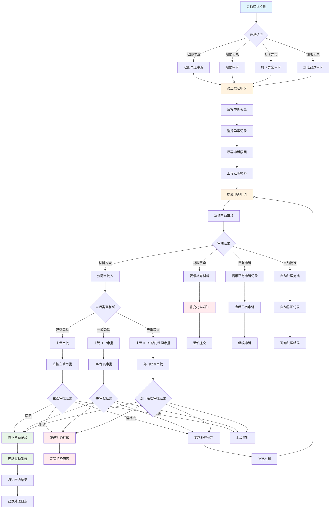
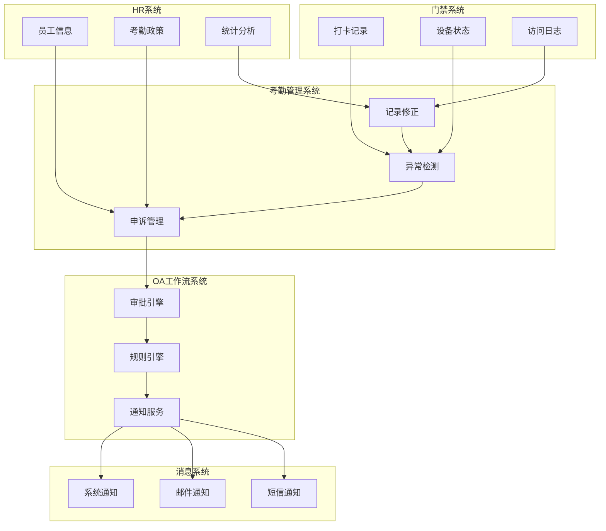

# 考勤异常申诉审批流程图

## 📋 流程概述

考勤异常申诉审批流程是IOE-DREAM智慧园区一卡通管理平台中人力资源管理的重要组成部分，用于员工对考勤异常记录（如迟到、早退、缺勤、打卡异常等）进行申诉和审批。该流程通过OA工作流引擎与考勤管理系统深度集成，确保考勤异常处理的公平性、准确性和可追溯性。

### 🎯 业务目标

- **公平处理**: 为员工提供申诉渠道，确保考勤处理公平公正
- **准确性提升**: 通过申诉机制修正考勤记录错误
- **流程规范**: 建立标准化的考勤异常处理流程
- **数据完整**: 保证考勤数据的准确性和完整性
- **管理优化**: 通过异常数据分析优化考勤管理制度

### 📊 流程指标

| 指标项 | 目标值 | 说明 |
|---------|--------|------|
| **申诉响应时间** | ≤ 4小时 | 从申诉到首次审批响应 |
| **审批完成时间** | ≤ 48小时 | 从申诉到最终审批完成 |
| **申诉处理准确率** | ≥ 98% | 申诉处理的准确率 |
| **员工满意度** | ≥ 90% | 员工对申诉处理的满意度 |
| **流程自动化率** | ≥ 85% | 自动化处理比例 |

---

## 🔄 详细流程图



---

## 📋 流程节点详细说明

### 1. 考勤异常检测阶段

#### 1.1 异常类型识别
```java
@Component
public class AttendanceAnomalyDetector {

    @Resource
    private AttendanceRuleEngine ruleEngine;

    @Resource
    private CheckRecordDao checkRecordDao;

    /**
     * 检测考勤异常
     */
    public List<AttendanceAnomaly> detectAnomalies(Long userId, LocalDate date) {
        List<AttendanceAnomaly> anomalies = new ArrayList<>();

        // 1. 获取当日打卡记录
        List<CheckRecord> checkRecords = checkRecordDao.selectByUserIdAndDate(userId, date);

        // 2. 应用检测规则
        for (AttendanceRule rule : ruleEngine.getApplicableRules(userId)) {
            AnomalyDetectionResult result = ruleEngine.detect(rule, checkRecords);

            if (result.isAnomaly()) {
                AttendanceAnomaly anomaly = createAnomaly(userId, date, rule, result);
                anomalies.add(anomaly);
            }
        }

        return anomalies;
    }

    private AttendanceAnomaly createAnomaly(Long userId, LocalDate date, AttendanceRule rule, AnomalyDetectionResult result) {
        return AttendanceAnomaly.builder()
            .userId(userId)
            .anomalyDate(date)
            .anomalyType(rule.getAnomalyType())
            .anomalyLevel(rule.getAnomalyLevel())
            .originalTime(result.getActualTime())
            .expectedTime(result.getExpectedTime())
            .deviationMinutes(result.getDeviationMinutes())
            .description(result.getDescription())
            .autoDetected(true)
            .createTime(LocalDateTime.now())
            .build();
    }
}
```

### 2. 申诉申请阶段

#### 2.1 申诉表单设计
```json
{
  "appealInfo": {
    "appealId": "APPEAL20241216001",
    "userId": "USER001",
    "userName": "张三",
    "department": "技术部",
    "position": "软件工程师",
    "appealDate": "2024-12-16"
  },
  "anomalyRecord": {
    "anomalyId": "ANOMALY001",
    "anomalyType": "LATE",
    "anomalyDate": "2024-12-15",
    "originalCheckTime": "09:15:00",
    "expectedCheckTime": "09:00:00",
    "deviationMinutes": 15
  },
  "appealContent": {
    "appealReason": "因公司班车延误导致迟到",
    "appealType": "TRANSPORT_ISSUE",
    "detailedDescription": "今日公司班车在东三环路发生交通事故，导致延误15分钟到达公司",
    "expectedCorrection": "将记录修正为正常打卡",
    "evidenceType": ["BUS_ACCIDENT_PHOTO", "TRAFFIC_REPORT"]
  },
  "attachments": [
    {
      "type": "BUS_ACCIDENT_PHOTO",
      "name": "交通事故现场照片.jpg",
      "url": "/uploads/appeal/bus_accident_001.jpg"
    },
    {
      "type": "TRAFFIC_REPORT",
      "name": "交警事故认定书.pdf",
      "url": "/uploads/appeal/traffic_report_001.pdf"
    }
  ]
}
```

#### 2.2 申诉申请服务
```java
@Service
public class AttendanceAppealService {

    @Resource
    private AttendanceAnomalyDao anomalyDao;

    @Resource
    private AppealApplicationDao appealDao;

    @Resource
    private WorkflowEngine workflowEngine;

    /**
     * 提交申诉申请
     */
    public AppealApplicationResult submitAppeal(AppealApplicationRequest request) {
        AppealApplicationResult result = new AppealApplicationResult();

        try {
            // 1. 验证申诉资格
            validateAppealEligibility(request);

            // 2. 检查重复申诉
            checkDuplicateAppeal(request);

            // 3. 保存申诉申请
            AppealApplication appeal = createAppealApplication(request);
            appealDao.insert(appeal);

            // 4. 更新异常记录状态
            updateAnomalyStatus(request.getAnomalyId(), "APPEALED");

            // 5. 启动审批流程
            String processInstanceId = startApprovalProcess(appeal);
            appeal.setProcessInstanceId(processInstanceId);
            appealDao.updateById(appeal);

            // 6. 发送确认通知
            sendAppealConfirmation(appeal);

            result.setSuccess(true);
            result.setAppealId(appeal.getId());
            result.setMessage("申诉申请提交成功");

        } catch (Exception e) {
            result.setSuccess(false);
            result.setMessage("申诉申请失败: " + e.getMessage());
        }

        return result;
    }

    private void validateAppealEligibility(AppealApplicationRequest request) {
        // 1. 检查异常记录是否存在
        AttendanceAnomaly anomaly = anomalyDao.selectById(request.getAnomalyId());
        if (anomaly == null) {
            throw new IllegalArgumentException("异常记录不存在");
        }

        // 2. 检查申诉时间限制
        LocalDateTime appealDeadline = anomaly.getCreateTime().plusDays(7);
        if (LocalDateTime.now().isAfter(appealDeadline)) {
            throw new IllegalArgumentException("申诉时间已过，异常记录发生超过7天");
        }

        // 3. 检查申诉权限
        if (!request.getUserId().equals(anomaly.getUserId())) {
            throw new IllegalArgumentException("只能对自己的异常记录发起申诉");
        }
    }

    private String startApprovalProcess(AppealApplication appeal) {
        WorkflowStartRequest workflowRequest = WorkflowStartRequest.builder()
            .processKey("attendance_appeal")
            .businessKey(appeal.getId())
            .variables(Map.of(
                "appealId", appeal.getId(),
                "userId", appeal.getUserId(),
                "anomalyType", appeal.getAnomalyType(),
                "anomalyLevel", appeal.getAnomalyLevel(),
                "appealType", appeal.getAppealType()
            ))
            .build();

        return workflowEngine.startProcess(workflowRequest);
    }
}
```

### 3. 自动审核阶段

#### 3.1 自动审核服务
```java
@Service
public class AppealAutoReviewService {

    @Resource
    private AppealRuleEngine ruleEngine;

    @Resource
    private AttendancePolicyService policyService;

    /**
     * 执行自动审核
     */
    public AutoReviewResult executeAutoReview(AppealApplication appeal) {
        AutoReviewResult result = new AutoReviewResult();

        try {
            // 1. 材料完整性检查
            checkMaterialCompleteness(appeal, result);

            // 2. 申诉理由合理性验证
            validateAppealReason(appeal, result);

            // 3. 证据有效性验证
            validateEvidence(appeal, result);

            // 4. 政策符合性检查
            checkPolicyCompliance(appeal, result);

            // 5. 历史申诉记录分析
            analyzeAppealHistory(appeal, result);

            // 6. 风险评估
            assessAppealRisk(appeal, result);

            // 7. 生成审核建议
            generateReviewSuggestion(appeal, result);

        } catch (Exception e) {
            result.setSuccess(false);
            result.addError("自动审核异常: " + e.getMessage());
        }

        return result;
    }

    private void checkMaterialCompleteness(AppealApplication appeal, AutoReviewResult result) {
        // 1. 必填材料检查
        List<MaterialType> requiredMaterials = getRequiredMaterials(appeal.getAppealType());
        for (MaterialType type : requiredMaterials) {
            if (!hasMaterialOfType(appeal.getAttachments(), type)) {
                result.addError("缺少必需材料: " + type.getDescription());
            }
        }

        // 2. 材料质量检查
        for (AppealAttachment attachment : appeal.getAttachments()) {
            MaterialQuality quality = assessMaterialQuality(attachment);
            if (quality.getScore() < 60) {
                result.addWarning("材料质量较低: " + attachment.getName());
            }
        }
    }

    private void validateAppealReason(AppealApplication appeal, AutoReviewResult result) {
        // 1. 申诉理由模板匹配
        ReasonTemplateMatch templateMatch = matchReasonTemplate(appeal.getAppealReason());
        result.setTemplateMatch(templateMatch);

        // 2. 申诉理由合理性评分
        double reasonScore = calculateReasonScore(appeal.getDetailedDescription());
        result.setReasonScore(reasonScore);

        if (reasonScore < 50) {
            result.addWarning("申诉理由描述不够详细");
        }
    }

    private void validateEvidence(AppealApplication appeal, AutoReviewResult result) {
        for (AppealAttachment attachment : appeal.getAttachments()) {
            EvidenceValidation validation = validateAttachmentEvidence(attachment);
            result.addEvidenceValidation(attachment.getType(), validation);

            if (!validation.isValid()) {
                result.addError("证据验证失败: " + validation.getErrorMessage());
            }
        }
    }

    private void checkPolicyCompliance(AppealApplication appeal, AutoReviewResult result) {
        AttendancePolicy policy = policyService.getApplicablePolicy(appeal.getUserId());

        PolicyComplianceCheck complianceCheck = policy.checkCompliance(appeal);
        result.setPolicyCompliance(complianceCheck);

        if (!complianceCheck.isCompliant()) {
            result.addWarning("申诉不完全符合考勤政策要求");
        }
    }

    private void analyzeAppealHistory(AppealApplication appeal, AutoReviewResult result) {
        // 获取用户历史申诉记录
        List<AppealApplication> history = appealDao.selectByUserId(appeal.getUserId());

        AppealHistoryAnalysis analysis = analyzeAppealHistory(history, appeal);
        result.setHistoryAnalysis(analysis);

        // 检查是否有频繁申诉模式
        if (analysis.getFrequencyScore() > 80) {
            result.addWarning("该用户申诉频率较高，需要重点关注");
        }
    }
}
```

### 4. 审批分配阶段

#### 4.1 审批人分配策略
```java
@Service
public class AppealApprovalAssignService {

    @Resource
    private EmployeeDao employeeDao;

    @Resource
    private DepartmentDao departmentDao;

    @Resource
    private HREmployeeDao hrEmployeeDao;

    /**
     * 分配审批人
     */
    public List<String> assignApprovers(AppealApplication appeal) {
        List<String> approvers = new ArrayList<>();

        // 1. 获取申诉人信息
        EmployeeEntity employee = employeeDao.selectByUserId(appeal.getUserId());

        // 2. 根据异常级别分配审批人
        switch (appeal.getAnomalyLevel()) {
            case 1: // 轻微异常
                approvers.addAll(assignMinorAnomalyApprovers(employee, appeal));
                break;

            case 2: // 一般异常
                approvers.addAll(assignNormalAnomalyApprovers(employee, appeal));
                break;

            case 3: // 严重异常
                approvers.addAll(assignSevereAnomalyApprovers(employee, appeal));
                break;

            default:
                throw new IllegalArgumentException("未知的异常级别: " + appeal.getAnomalyLevel());
        }

        // 3. 去重并排序
        return approvers.stream()
            .distinct()
            .sorted(this::compareApproverLevel)
            .collect(Collectors.toList());
    }

    private List<String> assignMinorAnomalyApprovers(EmployeeEntity employee, AppealApplication appeal) {
        List<String> approvers = new ArrayList<>();

        // 直接主管
        String managerId = getDirectManager(employee.getDepartmentId());
        approvers.add(managerId);

        // 如果是交通问题，可以跳过HR审批
        if (!isTransportIssue(appeal.getAppealType())) {
            approvers.add(getHRApprover());
        }

        return approvers;
    }

    private List<String> assignNormalAnomalyApprovers(EmployeeEntity employee, AppealApplication appeal) {
        List<String> approvers = new ArrayList<>();

        // 直接主管
        approvers.add(getDirectManager(employee.getDepartmentId()));

        // HR专员
        approvers.add(getHRApprover());

        // 如果涉及加班或特殊情况，需要部门经理
        if (involvesOvertime(appeal.getAppealType())) {
            approvers.add(getDepartmentManager(employee.getDepartmentId()));
        }

        return approvers;
    }

    private List<String> assignSevereAnomalyApprovers(EmployeeEntity employee, AppealApplication appeal) {
        List<String> approvers = new ArrayList<>();

        // 直接主管
        approvers.add(getDirectManager(employee.getDepartmentId()));

        // HR经理
        approvers.add(getHRManager());

        // 部门经理
        approvers.add(getDepartmentManager(employee.getDepartmentId()));

        // 如果是核心员工，需要分管领导
        if (isCoreEmployee(employee)) {
            approvers.add(getDivisionDirector(employee.getDepartmentId()));
        }

        return approvers;
    }

    private String getDirectManager(Long departmentId) {
        DepartmentEntity department = departmentDao.selectById(departmentId);
        return department != null ? department.getManagerId() : null;
    }

    private String getHRApprover() {
        // 根据HR部门的轮班规则分配HR专员
        return hrEmployeeDao.getCurrentDutyHR();
    }
}
```

### 5. 审批决策阶段

#### 5.1 审批决策服务
```java
@Service
public class AppealApprovalDecisionService {

    @Resource
    private AttendanceRuleEngine ruleEngine;

    @Resource
    private AttendancePolicyService policyService;

    /**
     * 执行审批决策
     */
    public ApprovalDecision executeDecision(ApprovalRequest request) {
        ApprovalDecision decision = new ApprovalDecision();

        try {
            // 1. 获取申诉详情
            AppealApplication appeal = appealDao.selectById(request.getAppealId());

            // 2. 验证审批权限
            validateApprovalPermission(request, appeal);

            // 3. 应用审批规则
            applyApprovalRules(request, appeal, decision);

            // 4. 政策合规性检查
            checkPolicyCompliance(appeal, decision);

            // 5. 历史行为分析
            analyzeHistoricalBehavior(appeal, decision);

            // 6. 综合决策
            makeComprehensiveDecision(appeal, decision);

            // 7. 生成处理建议
            generateProcessingSuggestions(appeal, decision);

        } catch (Exception e) {
            decision.setResult(DecisionResult.ERROR);
            decision.setReason("审批决策异常: " + e.getMessage());
        }

        return decision;
    }

    private void applyApprovalRules(ApprovalRequest request, AppealApplication appeal, ApprovalDecision decision) {
        List<ApprovalRule> rules = ruleEngine.getApprovalRules(
            appeal.getAnomalyType(),
            appeal.getAnomalyLevel(),
            request.getApproverRole()
        );

        for (ApprovalRule rule : rules) {
            RuleResult result = ruleEngine.apply(rule, Map.of(
                "appeal", appeal,
                "request", request
            ));

            decision.addRuleResult(rule.getName(), result);

            // 检查强制规则
            if (rule.isMandatory() && !result.isPassed()) {
                decision.setResult(DecisionResult.REJECTED);
                decision.setReason("违反强制规则: " + rule.getName());
                return;
            }
        }
    }

    private void checkPolicyCompliance(AppealApplication appeal, ApprovalDecision decision) {
        AttendancePolicy policy = policyService.getApplicablePolicy(appeal.getUserId());

        PolicyComplianceCheck compliance = policy.checkAppealCompliance(appeal);
        decision.setPolicyCompliance(compliance);

        // 如果严重违反政策，直接拒绝
        if (compliance.getViolationLevel() == ViolationLevel.SEVERE) {
            decision.setResult(DecisionResult.REJECTED);
            decision.setReason("严重违反考勤政策要求");
            return;
        }
    }

    private void analyzeHistoricalBehavior(AppealApplication appeal, ApprovalDecision decision) {
        // 获取用户历史考勤记录
        List<AttendanceRecord> history = attendanceDao.getHistoryRecords(
            appeal.getUserId(),
            LocalDate.now().minusMonths(3),
            LocalDate.now()
        );

        // 获取用户历史申诉记录
        List<AppealApplication> appealHistory = appealDao.selectByUserId(
            appeal.getUserId()
        );

        HistoricalBehaviorAnalysis analysis = analyzeBehavior(history, appealHistory);
        decision.setBehaviorAnalysis(analysis);

        // 评估申诉可信度
        double credibilityScore = calculateCredibilityScore(appeal, analysis);
        decision.setCredibilityScore(credibilityScore);

        // 如果可信度过低，需要额外审核
        if (credibilityScore < 30) {
            decision.setRequireAdditionalReview(true);
            decision.addWarning("用户申诉可信度较低，建议额外审核");
        }
    }

    private void makeComprehensiveDecision(AppealApplication appeal, ApprovalDecision decision) {
        // 综合评分计算
        double ruleScore = calculateRuleScore(decision.getRuleResults());
        double policyScore = decision.getPolicyCompliance().getScore();
        double credibilityScore = decision.getCredibilityScore();
        double evidenceScore = calculateEvidenceScore(appeal);

        double totalScore = (
            ruleScore * 0.3 +
            policyScore * 0.25 +
            credibilityScore * 0.25 +
            evidenceScore * 0.2
        );

        // 决策阈值
        double approveThreshold = 70.0;
        double conditionalApproveThreshold = 50.0;

        if (totalScore >= approveThreshold) {
            decision.setResult(DecisionResult.APPROVED);
        } else if (totalScore >= conditionalApproveThreshold) {
            decision.setResult(DecisionResult.APPROVED_WITH_CONDITIONS);
        } else {
            decision.setResult(DecisionResult.REJECTED);
        }

        decision.setTotalScore(totalScore);
    }

    private void generateProcessingSuggestions(AppealApplication appeal, ApprovalDecision decision) {
        List<String> suggestions = new ArrayList<>();

        switch (decision.getResult()) {
            case APPROVED:
                suggestions.add("同意申诉，修正考勤记录");
                suggestions.add("更新考勤统计数据");
                break;

            case APPROVED_WITH_CONDITIONS:
                suggestions.add("有条件同意，需要补充材料");
                suggestions.add("设置后续关注");
                break;

            case REJECTED:
                suggestions.add("拒绝申诉，维持原记录");
                suggestions.add("与员工沟通解释原因");
                break;
        }

        decision.setSuggestions(suggestions);
    }
}
```

### 6. 记录修正阶段

#### 6.1 考勤记录修正服务
```java
@Service
public class AttendanceRecordCorrectionService {

    @Resource
    private AttendanceRecordDao attendanceRecordDao;

    @Resource
    private CheckRecordDao checkRecordDao;

    @Resource
    private AttendanceStatisticsService statisticsService;

    /**
     * 修正考勤记录
     */
    public CorrectionResult correctAttendanceRecord(AppealApplication appeal, ApprovalDecision decision) {
        CorrectionResult result = new CorrectionResult();

        try {
            // 1. 验证修正权限
            validateCorrectionPermission(decision);

            // 2. 执行记录修正
            switch (appeal.getAnomalyType()) {
                case LATE:
                case EARLY_LEAVE:
                    result = correctCheckInOutTime(appeal, decision);
                    break;

                case ABSENCE:
                    result = correctAbsenceRecord(appeal, decision);
                    break;

                case MISSING_CHECK:
                    result = addMissingCheckRecord(appeal, decision);
                    break;

                case OVERTIME_ERROR:
                    result = correctOvertimeRecord(appeal, decision);
                    break;

                default:
                    throw new IllegalArgumentException("未知的异常类型: " + appeal.getAnomalyType());
            }

            // 3. 更新统计信息
            updateAttendanceStatistics(appeal);

            // 4. 记录修正日志
            logCorrection(appeal, decision, result);

        } catch (Exception e) {
            result.setSuccess(false);
            result.setMessage("考勤记录修正失败: " + e.getMessage());
        }

        return result;
    }

    private CorrectionResult correctCheckInOutTime(AppealApplication appeal, ApprovalDecision decision) {
        CorrectionResult result = new CorrectionResult();

        // 1. 获取原始打卡记录
        CheckRecord originalRecord = checkRecordDao.selectById(appeal.getAnomalyRecordId());
        if (originalRecord == null) {
            throw new IllegalArgumentException("原始打卡记录不存在");
        }

        // 2. 根据审批决定修正时间
        LocalDateTime correctedTime = calculateCorrectedTime(appeal, decision, originalRecord);

        // 3. 更新打卡记录
        originalRecord.setCorrectedTime(correctedTime);
        originalRecord.setCorrectionReason(decision.getReason());
        originalRecord.setCorrectedBy(decision.getApproverId());
        originalRecord.setCorrectionTime(LocalDateTime.now());

        int updated = checkRecordDao.updateById(originalRecord);
        result.setSuccess(updated > 0);

        // 4. 重新计算考勤状态
        recalculateAttendanceStatus(originalRecord.getUserId(), originalRecord.getCheckDate());

        if (result.isSuccess()) {
            result.setMessage("打卡时间修正成功");
        } else {
            result.setMessage("打卡时间修正失败");
        }

        return result;
    }

    private LocalDateTime calculateCorrectedTime(AppealApplication appeal, ApprovalDecision decision, CheckRecord originalRecord) {
        // 根据申诉类型和审批决定计算修正时间
        switch (appeal.getAppealType()) {
            case TRANSPORT_ISSUE:
                // 交通问题，修正为正常时间
                return getExpectedCheckTime(originalRecord.getCheckType(), originalRecord.getCheckDate());

            case SYSTEM_ERROR:
                // 系统错误，根据员工说明修正
                return parseEmployeeProvidedTime(appeal.getDetailedDescription());

            case WORK_RELATED:
                // 工作相关，允许一定的时间偏差
                return adjustForWorkRelatedIssue(originalRecord, appeal);

            default:
                // 其他情况，保持原时间或轻微调整
                return originalRecord.getCheckTime();
        }
    }

    private void updateAttendanceStatistics(AppealApplication appeal) {
        // 更新个人考勤统计
        statisticsService.updatePersonalStatistics(
            appeal.getUserId(),
            appeal.getAnomalyDate()
        );

        // 更新部门考勤统计
        statisticsService.updateDepartmentStatistics(
            appeal.getDepartment(),
            appeal.getAnomalyDate()
        );

        // 更新全公司考勤统计
        statisticsService.updateCompanyStatistics(appeal.getAnomalyDate());
    }

    @Transactional
    public void logCorrection(AppealApplication appeal, ApprovalDecision decision, CorrectionResult result) {
        AppealCorrectionLog log = AppealCorrectionLog.builder()
            .appealId(appeal.getId())
            .anomalyId(appeal.getAnomalyId())
            .correctionType(appeal.getAnomalyType())
            .originalValue(appeal.getOriginalValue())
            .correctedValue(result.getCorrectedValue())
            .approverId(decision.getApproverId())
            .correctionReason(decision.getReason())
            .correctionTime(LocalDateTime.now())
            .build();

        appealCorrectionLogDao.insert(log);
    }
}
```

### 7. 数据分析和监控

#### 7.1 申诉统计分析服务
```java
@Service
public class AppealAnalyticsService {

    @Resource
    private AppealApplicationDao appealDao;

    @Resource
    private ApprovalDecisionDao decisionDao;

    /**
     * 生成申诉统计报告
     */
    public AppealStatisticsReport generateReport(LocalDateTime startTime, LocalDateTime endTime) {
        AppealStatisticsReport report = new AppealStatisticsReport();

        // 1. 基础统计数据
        report.setTotalAppeals(appealDao.countAppeals(startTime, endTime));
        report.setApprovedAppeals(appealDao.countAppealsByStatus(startTime, endTime, "APPROVED"));
        report.setRejectedAppeals(appealDao.countAppealsByStatus(startTime, endTime, "REJECTED"));
        report.setPendingAppeals(appealDao.countAppealsByStatus(startTime, endTime, "PENDING"));

        // 2. 申诉类型分布
        report.setAnomalyTypeDistribution(appealDao.getAnomalyTypeDistribution(startTime, endTime));

        // 3. 申诉原因分布
        report.setAppealReasonDistribution(appealDao.getAppealReasonDistribution(startTime, endTime));

        // 4. 部门申诉统计
        report.setDepartmentStatistics(appealDao.getDepartmentStatistics(startTime, endTime));

        // 5. 审批效率统计
        report.setApprovalEfficiency(calculateApprovalEfficiency(startTime, endTime));

        // 6. 申诉趋势分析
        report.setAppealTrend(analyzeAppealTrend(startTime, endTime));

        // 7. 高频申诉人员分析
        report.setFrequentAppealers(analyzeFrequentAppealers(startTime, endTime));

        return report;
    }

    /**
     * 实时监控申诉状态
     */
    public AppealMonitor getRealTimeMonitor() {
        AppealMonitor monitor = new AppealMonitor();

        LocalDateTime now = LocalDateTime.now();
        LocalDateTime todayStart = now.toLocalDate().atStartOfDay();

        monitor.setTodayAppeals(appealDao.countAppeals(todayStart, now));
        monitor.setPendingApprovals(appealDao.countAppealsByStatus(todayStart, now, "PENDING"));
        monitor.setOverdueAppeals(appealDao.countOverdueAppeals());
        monitor.setAverageApprovalTime(calculateAverageApprovalTime(todayStart, now));

        return monitor;
    }

    private ApprovalEfficiency calculateApprovalEfficiency(LocalDateTime startTime, LocalDateTime endTime) {
        List<AppealApplication> completedAppeals = appealDao.selectCompletedAppeals(startTime, endTime);

        if (completedAppeals.isEmpty()) {
            return new ApprovalEfficiency();
        }

        long totalProcessingTime = 0;
        Map<String, Integer> approverStats = new HashMap<>();

        for (AppealApplication appeal : completedAppeals) {
            long processingTime = Duration.between(appeal.getCreateTime(), appeal.getApprovalTime()).toMinutes();
            totalProcessingTime += processingTime;

            String approverId = appeal.getApproverId();
            approverStats.put(approverId, approverStats.getOrDefault(approverId, 0) + 1);
        }

        ApprovalEfficiency efficiency = new ApprovalEfficiency();
        efficiency.setAverageProcessingTime(totalProcessingTime / completedAppeals.size());
        efficiency.setTotalAppeals(completedAppeals.size());
        efficiency.setApproverStatistics(approverStats);

        return efficiency;
    }
}
```

---

## 📱 移动端应用

### 申诉申请移动界面
```vue
<template>
  <div class="attendance-appeal">
    <van-nav-bar
      title="考勤异常申诉"
      left-arrow
      @click-left="$router.go(-1)"
    />

    <!-- 异常记录选择 -->
    <van-cell-group title="选择异常记录">
      <van-cell
        :title="selectedAnomaly.description"
        :label="selectedAnomaly.date"
        :value="selectedAnomaly.deviation + '分钟'"
        is-link
        @click="showAnomalyPicker = true"
      />
    </van-cell-group>

    <!-- 申诉表单 -->
    <van-form @submit="submitAppeal">
      <van-cell-group title="申诉信息">
        <van-field
          v-model="form.appealReason"
          label="申诉原因"
          placeholder="请选择申诉原因"
          readonly
          @click="showReasonPicker = true"
        />

        <van-field
          v-model="form.detailedDescription"
          label="详细说明"
          type="textarea"
          placeholder="请详细描述申诉原因"
          :rules="[{ required: true, message: '请填写详细说明' }]"
        />

        <van-field
          label="期望处理"
          placeholder="请选择期望处理方式"
          readonly
          :value="expectedCorrectionText"
          @click="showCorrectionPicker = true"
        />
      </van-cell-group>

      <van-cell-group title="证明材料">
        <van-uploader
          v-model="attachments"
          :after-read="handleAttachmentUpload"
          :max-count="5"
          accept="image/*,.pdf"
        >
          <template #preview-cover>
            <div class="preview-cover">
              <span>{{ file.name }}</span>
            </div>
          </template>
        </van-uploader>
      </van-cell-group>

      <!-- 提交按钮 -->
      <div class="submit-section">
        <van-button
          type="primary"
          block
          native-type="submit"
          :loading="submitting"
        >
          提交申诉
        </van-button>
      </div>
    </van-form>

    <!-- 异常记录选择器 -->
    <van-popup v-model="showAnomalyPicker" position="bottom">
      <van-picker
        show-toolbar
        :columns="anomalyColumns"
        @confirm="onAnomalyConfirm"
        @cancel="showAnomalyPicker = false"
      />
    </van-popup>

    <!-- 申诉原因选择器 -->
    <van-popup v-model="showReasonPicker" position="bottom">
      <van-picker
        show-toolbar
        :columns="reasonColumns"
        @confirm="onReasonConfirm"
        @cancel="showReasonPicker = false"
      />
    </van-popup>

    <!-- 处理方式选择器 -->
    <van-popup v-model="showCorrectionPicker" position="bottom">
      <van-picker
        show-toolbar
        :columns="correctionColumns"
        @confirm="onCorrectionConfirm"
        @cancel="showCorrectionPicker = false"
      />
    </van-popup>
  </div>
</template>

<script>
export default {
  name: 'AttendanceAppeal',

  data() {
    return {
      form: {
        appealReason: '',
        detailedDescription: '',
        expectedCorrection: ''
      },
      selectedAnomaly: {},
      attachments: [],
      showAnomalyPicker: false,
      showReasonPicker: false,
      showCorrectionPicker: false,
      anomalyColumns: [],
      reasonColumns: [
        { text: '交通问题', value: 'TRANSPORT_ISSUE' },
        { text: '系统错误', value: 'SYSTEM_ERROR' },
        { text: '工作安排', value: 'WORK_RELATED' },
        { text: '个人原因', value: 'PERSONAL_REASON' }
      ],
      correctionColumns: [
        { text: '修正为正常', value: 'CORRECT_TO_NORMAL' },
        { text: '调整时间', value: 'ADJUST_TIME' },
        { text: '删除异常', value: 'DELETE_ANOMALY' }
      ],
      submitting: false
    }
  },

  computed: {
    expectedCorrectionText() {
      const option = this.correctionColumns.find(col => col.value === this.form.expectedCorrection);
      return option ? option.text : '';
    }
  },

  async created() {
    await this.loadAnomalyRecords();
  },

  methods: {
    async loadAnomalyRecords() {
      const response = await this.$http.get('/api/attendance/anomalies');
      this.anomalyColumns = response.data.map(anomaly => ({
        text: `${anomaly.date} ${anomaly.type} ${anomaly.deviation}分钟`,
        value: anomaly
      }));
    },

    async submitAppeal() {
      if (!this.validateForm()) {
        return;
      }

      this.submitting = true;

      try {
        const appeal = {
          anomalyId: this.selectedAnomaly.id,
          appealReason: this.form.appealReason,
          detailedDescription: this.form.detailedDescription,
          expectedCorrection: this.form.expectedCorrection,
          attachments: this.attachments
        };

        const response = await this.$http.post('/api/attendance/appeal', appeal);

        this.$toast.success('申诉提交成功');
        this.$router.push('/attendance/appeal/status/' + response.data.appealId);

      } catch (error) {
        this.$toast.fail('提交失败: ' + error.message);
      } finally {
        this.submitting = false;
      }
    },

    validateForm() {
      if (!this.selectedAnomaly.id) {
        this.$toast('请选择异常记录');
        return false;
      }

      if (!this.form.appealReason) {
        this.$toast('请选择申诉原因');
        return false;
      }

      if (!this.form.detailedDescription.trim()) {
        this.$toast('请填写详细说明');
        return false;
      }

      return true;
    }
  }
}
</script>
```

---

## 🔧 系统集成

### 与其他系统集成架构


---

## 📊 监控和告警

### 关键指标监控
```java
@Component
public class AppealMonitoringMetrics {

    @Resource
    private MeterRegistry meterRegistry;

    // 申诉数量统计
    public void recordAppeal(String type, String status) {
        meterRegistry.counter("attendance.appeals",
            "type", type,
            "status", status
        ).increment();
    }

    // 审批时间统计
    public void recordApprovalTime(String approverRole, Duration duration) {
        meterRegistry.timer("attendance.approval.duration",
            "role", approverRole
        ).record(duration);
    }

    // 修正结果统计
    public void recordCorrection(String originalType, String result) {
        meterRegistry.counter("attendance.corrections",
            "original_type", originalType,
            "result", result
        ).increment();
    }
}
```

---

## 🎯 总结

考勤异常申诉审批流程通过标准化、智能化的方式，为员工提供了公平、透明的考勤异常处理渠道。该流程具有以下特点：

1. **多维度检测** - 自动识别各类考勤异常，减少漏检
2. **智能审核** - 通过规则引擎和政策检查，提高审核效率
3. **分级审批** - 根据异常严重程度分配不同审批层级
4. **全程追溯** - 完整记录申诉处理过程，确保透明公正
5. **数据驱动** - 通过申诉数据分析优化考勤管理制度
6. **移动友好** - 支持移动端申诉和审批，提升用户体验

该流程不仅保障了员工权益，也提高了考勤管理的准确性和效率，为企业人力资源管理提供了有力支撑。

---

**流程图状态**: ✅ 已完成
**适用版本**: IOE-DREAM v2.0.0+
**维护责任人**: 考勤管理团队 + OA工作流团队
**最后审核**: 2025-12-16