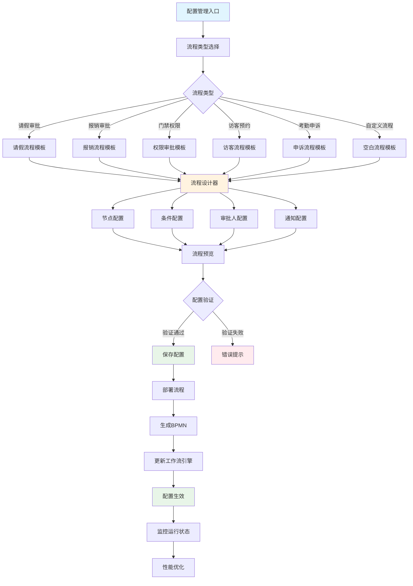
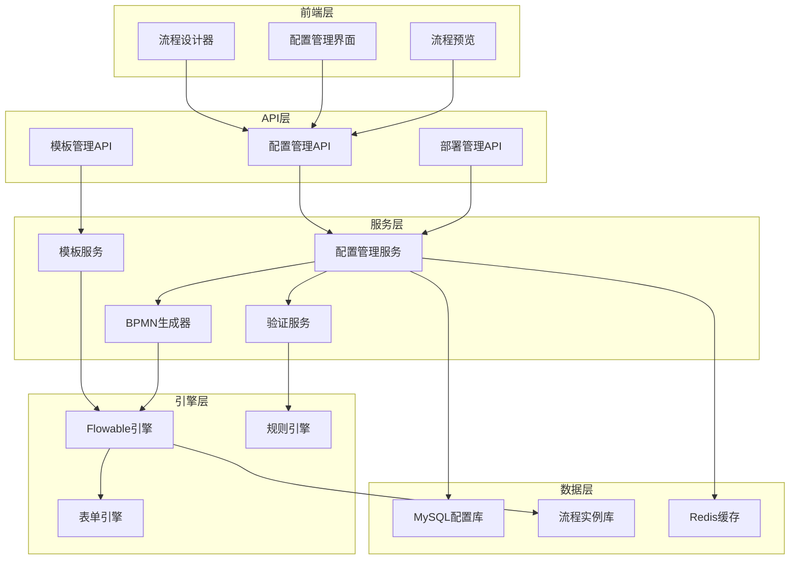

# 审批流程可配置化功能设计

## 📋 功能概述

审批流程可配置化功能是IOE-DREAM智慧园区一卡通管理平台OA工作流模块的核心功能，旨在通过低代码配置方式，让业务管理员能够灵活定义、修改和管理各种审批流程，无需开发人员介入即可满足业务变化需求。

### 🎯 设计目标

- **零代码配置** - 业务管理员通过可视化界面配置审批流程
- **灵活适配** - 支持各种业务场景的审批流程定义
- **实时生效** - 配置修改后立即可用，无需重启系统
- **版本管理** - 支持流程版本控制和历史追溯
- **模块化设计** - 各业务模块可独立配置自己的审批流程

### 📊 功能指标

| 指标项 | 目标值 | 说明 |
|---------|--------|------|
| **配置响应时间** | ≤ 2秒 | 流程配置的界面响应时间 |
| **流程生效时间** | ≤ 30秒 | 配置修改后生效时间 |
| **配置复杂度** | ≤ 3步 | 完成基础流程配置的操作步骤 |
| **业务覆盖度** | ≥ 95% | 可配置流程覆盖的业务场景 |
| **用户满意度** | ≥ 92% | 业务管理员满意度 |

---

## 🔄 功能架构图



---

## 📋 核心功能设计

### 1. 流程模板管理

#### 1.1 流程模板实体设计
```java
@Entity
@Table(name = "workflow_template")
public class WorkflowTemplateEntity extends BaseEntity {

    @TableId(type = IdType.ASSIGN_ID)
    private String templateId;

    @TableField("template_name")
    @NotBlank(message = "模板名称不能为空")
    @Size(max = 100)
    private String templateName;

    @TableField("template_code")
    @NotBlank(message = "模板编码不能为空")
    @Pattern(regexp = "^[A-Z][A-Z0-9_]*$", message = "模板编码格式不正确")
    private String templateCode;

    @TableField("template_type")
    @NotBlank(message = "模板类型不能为空")
    private String templateType;

    @TableField("template_category")
    private String templateCategory;

    @TableField("template_description")
    private String templateDescription;

    @TableField("template_config")
    private String templateConfig;  // JSON配置

    @TableField("bpmn_definition")
    private String bpmnDefinition;  // BPMN流程定义

    @TableField("version")
    private Integer version;

    @TableField("status")
    private Integer status;  // 0-草稿 1-启用 2-停用

    @TableField("is_system")
    private Boolean isSystem;  // 是否系统模板

    @TableField("create_user_id")
    private String createUserId;

    @TableField("update_user_id")
    private String updateUserId;
}
```

#### 1.2 流程模板配置JSON结构
```json
{
  "templateInfo": {
    "templateName": "标准请假审批流程",
    "templateCode": "LEAVE_APPROVAL_STANDARD",
    "templateType": "LEAVE",
    "templateCategory": "HR",
    "description": "适用于标准请假场景的审批流程",
    "tags": ["HR", "请假", "标准"],
    "icon": "leave-icon",
    "color": "#1890ff"
  },
  "processConfig": {
    "startNode": {
      "nodeId": "start",
      "nodeType": "START",
      "nodeName": "开始",
      "nodePosition": { "x": 100, "y": 200 },
      "config": {
        "formKey": "leave_application_form",
        "autoValidation": true
      }
    },
    "nodes": [
      {
        "nodeId": "manager_approval",
        "nodeType": "APPROVAL",
        "nodeName": "主管审批",
        "nodePosition": { "x": 300, "y": 200 },
        "config": {
          "approvalType": "SINGLE",
          "approverAssignment": "DIRECT_MANAGER",
          "timeLimit": 24,
          "allowDelegation": true,
          "requireComment": true,
          "actions": ["APPROVE", "REJECT", "TRANSFER"]
        }
      },
      {
        "nodeId": "hr_approval",
        "nodeType": "APPROVAL",
        "nodeName": "HR审批",
        "nodePosition": { "x": 500, "y": 200 },
        "config": {
          "approvalType": "SINGLE",
          "approverAssignment": "HR_SPECIALIST",
          "timeLimit": 48,
          "allowDelegation": true,
          "requireComment": true,
          "conditionalApproval": true,
          "conditions": [
            {
              "conditionType": "LEAVE_DAYS",
              "operator": "GT",
              "value": 3
            }
          ]
        }
      }
    ],
    "connections": [
      {
        "from": "start",
        "to": "manager_approval",
        "condition": null
      },
      {
        "from": "manager_approval",
        "to": "hr_approval",
        "condition": {
          "type": "LEAVE_DAYS",
          "operator": "GT",
          "value": 3
        }
      }
    ]
  },
  "notificationConfig": {
    "events": [
      {
        "eventType": "PROCESS_STARTED",
        "notifications": [
          {
            "type": "EMAIL",
            "recipients": ["APPLICANT"],
            "template": "leave_process_started"
          }
        ]
      },
      {
        "eventType": "APPROVAL_COMPLETED",
        "notifications": [
          {
            "type": "EMAIL",
            "recipients": ["APPLICANT", "MANAGER"],
            "template": "leave_approved"
          }
        ]
      }
    ]
  }
}
```

### 2. 可视化流程设计器

#### 2.1 前端流程设计器组件
```vue
<template>
  <div class="workflow-designer">
    <!-- 工具栏 -->
    <div class="designer-toolbar">
      <el-button-group>
        <el-button type="primary" @click="saveWorkflow">
          <i class="el-icon-save"></i> 保存
        </el-button>
        <el-button @click="previewWorkflow">
          <i class="el-icon-view"></i> 预览
        </el-button>
        <el-button @click="deployWorkflow">
          <i class="el-icon-upload"></i> 部署
        </el-button>
        <el-button @click="exportBpmn">
          <i class="el-icon-download"></i> 导出BPMN
        </el-button>
      </el-button-group>

      <el-divider direction="vertical"></el-divider>

      <el-button-group>
        <el-button @click="undo">
          <i class="el-icon-refresh-left"></i> 撤销
        </el-button>
        <el-button @click="redo">
          <i class="el-icon-refresh-right"></i> 重做
        </el-button>
        <el-button @click="clearCanvas">
          <i class="el-icon-delete"></i> 清空
        </el-button>
      </el-button-group>
    </div>

    <!-- 设计区域 -->
    <div class="designer-content">
      <!-- 左侧节点面板 -->
      <div class="node-panel">
        <div class="panel-header">
          <h4>流程节点</h4>
        </div>
        <div class="node-categories">
          <el-collapse v-model="activeCategories" accordion>
            <el-collapse-item title="基础节点" name="basic">
              <div class="node-list">
                <div
                  v-for="node in basicNodes"
                  :key="node.type"
                  class="node-item"
                  draggable="true"
                  @dragstart="handleNodeDragStart(node, $event)"
                >
                  <div class="node-icon" :class="node.iconClass"></div>
                  <span class="node-name">{{ node.name }}</span>
                </div>
              </div>
            </el-collapse-item>

            <el-collapse-item title="审批节点" name="approval">
              <div class="node-list">
                <div
                  v-for="node in approvalNodes"
                  :key="node.type"
                  class="node-item"
                  draggable="true"
                  @dragstart="handleNodeDragStart(node, $event)"
                >
                  <div class="node-icon" :class="node.iconClass"></div>
                  <span class="node-name">{{ node.name }}</span>
                </div>
              </div>
            </el-collapse-item>

            <el-collapse-item title="网关节点" name="gateway">
              <div class="node-list">
                <div
                  v-for="node in gatewayNodes"
                  :key="node.type"
                  class="node-item"
                  draggable="true"
                  @dragstart="handleNodeDragStart(node, $event)"
                >
                  <div class="node-icon" :class="node.iconClass"></div>
                  <span class="node-name">{{ node.name }}</span>
                </div>
              </div>
            </el-collapse-item>
          </el-collapse>
        </div>
      </div>

      <!-- 中间画布区域 -->
      <div class="design-canvas" ref="designCanvas">
        <canvas
          ref="workflowCanvas"
          :width="canvasWidth"
          :height="canvasHeight"
          @drop="handleCanvasDrop"
          @dragover="handleCanvasDragOver"
        ></canvas>

        <!-- 缩放控制 -->
        <div class="zoom-controls">
          <el-button-group>
            <el-button size="small" @click="zoomIn">
              <i class="el-icon-zoom-in"></i>
            </el-button>
            <el-button size="small">{{ zoomLevel }}%</el-button>
            <el-button size="small" @click="zoomOut">
              <i class="el-icon-zoom-out"></i>
            </el-button>
            <el-button size="small" @click="zoomFit">
              <i class="el-icon-full-screen"></i>
            </el-button>
          </el-button-group>
        </div>
      </div>

      <!-- 右侧属性面板 -->
      <div class="property-panel" v-if="selectedNode">
        <div class="panel-header">
          <h4>节点属性</h4>
          <el-button size="mini" @click="closePropertyPanel">
            <i class="el-icon-close"></i>
          </el-button>
        </div>

        <div class="panel-content">
          <!-- 基础属性 -->
          <el-form :model="nodeProperties" label-width="100px" size="small">
            <el-form-item label="节点ID">
              <el-input v-model="nodeProperties.nodeId" disabled></el-input>
            </el-form-item>

            <el-form-item label="节点名称">
              <el-input v-model="nodeProperties.nodeName" placeholder="请输入节点名称"></el-input>
            </el-form-item>

            <!-- 审批节点属性 -->
            <template v-if="selectedNode.nodeType === 'APPROVAL'">
              <el-form-item label="审批类型">
                <el-select v-model="nodeProperties.approvalType">
                  <el-option label="单人审批" value="SINGLE"></el-option>
                  <el-option label="多人审批" value="MULTIPLE"></el-option>
                  <el-option label="会签审批" value="JOINT"></el-option>
                </el-select>
              </el-form-item>

              <el-form-item label="审批人分配">
                <el-select v-model="nodeProperties.approverAssignment">
                  <el-option label="直接主管" value="DIRECT_MANAGER"></el-option>
                  <el-option label="部门负责人" value="DEPARTMENT_HEAD"></el-option>
                  <el-option label="HR专员" value="HR_SPECIALIST"></el-option>
                  <el-option label="指定人员" value="SPECIFIC_USER"></el-option>
                  <el-option label="角色" value="ROLE"></el-option>
                </el-select>
              </el-form-item>

              <el-form-item label="指定人员" v-if="nodeProperties.approverAssignment === 'SPECIFIC_USER'">
                <el-select
                  v-model="nodeProperties.specificApprovers"
                  multiple
                  filterable
                  remote
                  reserve-keyword
                  placeholder="请选择审批人"
                  :remote-method="searchUsers"
                  :loading="userSearchLoading"
                >
                  <el-option
                    v-for="user in userOptions"
                    :key="user.id"
                    :label="user.name"
                    :value="user.id"
                  ></el-option>
                </el-select>
              </el-form-item>

              <el-form-item label="时间限制">
                <el-input-number
                  v-model="nodeProperties.timeLimit"
                  :min="1"
                  :max="168"
                  controls-position="right"
                >
                  <template slot="append">小时</template>
                </el-input-number>
              </el-form-item>

              <el-form-item label="允许转办">
                <el-switch v-model="nodeProperties.allowDelegation"></el-switch>
              </el-form-item>

              <el-form-item label="必须填写意见">
                <el-switch v-model="nodeProperties.requireComment"></el-switch>
              </el-form-item>
            </template>

            <!-- 网关节点属性 -->
            <template v-if="isGatewayNode(selectedNode.nodeType)">
              <el-form-item label="网关类型">
                <el-select v-model="nodeProperties.gatewayType" disabled>
                  <el-option label="排他网关" value="EXCLUSIVE"></el-option>
                  <el-option label="并行网关" value="PARALLEL"></el-option>
                  <el-option label="包容网关" value="INCLUSIVE"></el-option>
                </el-select>
              </el-form-item>

              <el-form-item label="分支条件" v-if="nodeProperties.gatewayType !== 'PARALLEL'">
                <div class="condition-list">
                  <div
                    v-for="(condition, index) in nodeProperties.branchConditions"
                    :key="index"
                    class="condition-item"
                  >
                    <el-row :gutter="10">
                      <el-col :span="6">
                        <el-select v-model="condition.field" placeholder="字段">
                          <el-option label="请假天数" value="leaveDays"></el-option>
                          <el-option label="请假类型" value="leaveType"></el-option>
                          <el-option label="申请金额" value="amount"></el-option>
                        </el-select>
                      </el-col>
                      <el-col :span="6">
                        <el-select v-model="condition.operator" placeholder="操作符">
                          <el-option label="等于" value="EQ"></el-option>
                          <el-option label="不等于" value="NE"></el-option>
                          <el-option label="大于" value="GT"></el-option>
                          <el-option label="小于" value="LT"></el-option>
                          <el-option label="大于等于" value="GTE"></el-option>
                          <el-option label="小于等于" value="LTE"></el-option>
                        </el-select>
                      </el-col>
                      <el-col :span="6">
                        <el-input v-model="condition.value" placeholder="值"></el-input>
                      </el-col>
                      <el-col :span="4">
                        <el-button
                          size="mini"
                          type="danger"
                          icon="el-icon-delete"
                          @click="removeCondition(index)"
                        ></el-button>
                      </el-col>
                    </el-row>
                  </div>
                  <el-button
                    size="mini"
                    type="primary"
                    @click="addCondition"
                  >
                    添加条件
                  </el-button>
                </div>
              </el-form-item>
            </template>
          </el-form>
        </div>
      </div>
    </div>

    <!-- 预览对话框 -->
    <el-dialog
      title="流程预览"
      :visible.sync="previewVisible"
      width="80%"
      top="5vh"
    >
      <div class="workflow-preview">
        <div class="preview-header">
          <h3>{{ workflowConfig.templateInfo.templateName }}</h3>
          <p>{{ workflowConfig.templateInfo.templateDescription }}</p>
        </div>
        <div class="preview-content">
          <!-- 这里显示流程图预览 -->
          <workflow-preview-diagram :config="workflowConfig"></workflow-preview-diagram>
        </div>
      </div>
    </el-dialog>
  </div>
</template>

<script>
import WorkflowPreviewDiagram from './WorkflowPreviewDiagram.vue';

export default {
  name: 'WorkflowDesigner',

  components: {
    WorkflowPreviewDiagram
  },

  data() {
    return {
      workflowConfig: {},
      selectedNode: null,
      nodeProperties: {},
      zoomLevel: 100,
      canvasWidth: 1200,
      canvasHeight: 800,
      activeCategories: ['basic'],
      previewVisible: false,
      userOptions: [],
      userSearchLoading: false,

      // 节点类型定义
      basicNodes: [
        { type: 'START', name: '开始节点', iconClass: 'node-start' },
        { type: 'END', name: '结束节点', iconClass: 'node-end' },
        { type: 'TASK', name: '任务节点', iconClass: 'node-task' }
      ],

      approvalNodes: [
        { type: 'APPROVAL', name: '审批节点', iconClass: 'node-approval' },
        { type: 'COUNTER_SIGN', name: '会签节点', iconClass: 'node-counter-sign' }
      ],

      gatewayNodes: [
        { type: 'EXCLUSIVE_GATEWAY', name: '排他网关', iconClass: 'node-gateway-exclusive' },
        { type: 'PARALLEL_GATEWAY', name: '并行网关', iconClass: 'node-gateway-parallel' },
        { type: 'INCLUSIVE_GATEWAY', name: '包容网关', iconClass: 'node-gateway-inclusive' }
      ]
    };
  },

  methods: {
    // 节点拖拽开始
    handleNodeDragStart(node, event) {
      event.dataTransfer.setData('application/json', JSON.stringify(node));
      event.dataTransfer.effectAllowed = 'copy';
    },

    // 画布拖拽释放
    handleCanvasDrop(event) {
      event.preventDefault();

      const nodeData = JSON.parse(event.dataTransfer.getData('application/json'));
      const canvasRect = this.$refs.workflowCanvas.getBoundingClientRect();

      const x = event.clientX - canvasRect.left;
      const y = event.clientY - canvasRect.top;

      this.addNodeToCanvas(nodeData, x, y);
    },

    // 添加节点到画布
    addNodeToCanvas(nodeData, x, y) {
      const newNode = {
        nodeId: this.generateNodeId(nodeData.type),
        nodeType: nodeData.type,
        nodeName: nodeData.name,
        nodePosition: { x, y },
        config: this.getDefaultNodeConfig(nodeData.type)
      };

      this.workflowConfig.processConfig.nodes.push(newNode);
      this.renderNode(newNode);
    },

    // 生成节点ID
    generateNodeId(nodeType) {
      const timestamp = Date.now();
      const random = Math.floor(Math.random() * 1000);
      return `${nodeType.toLowerCase()}_${timestamp}_${random}`;
    },

    // 获取节点默认配置
    getDefaultNodeConfig(nodeType) {
      const configs = {
        START: {
          formKey: 'application_form',
          autoValidation: true
        },
        APPROVAL: {
          approvalType: 'SINGLE',
          approverAssignment: 'DIRECT_MANAGER',
          timeLimit: 24,
          allowDelegation: true,
          requireComment: true
        },
        END: {
          autoActions: ['NOTIFY_APPLICANT', 'UPDATE_STATUS']
        }
      };

      return configs[nodeType] || {};
    },

    // 渲染节点
    renderNode(node) {
      const canvas = this.$refs.workflowCanvas;
      const ctx = canvas.getContext('2d');

      // 绘制节点矩形
      ctx.fillStyle = this.getNodeColor(node.nodeType);
      ctx.fillRect(node.nodePosition.x, node.nodePosition.y, 120, 60);

      // 绘制节点文本
      ctx.fillStyle = '#333';
      ctx.font = '14px Arial';
      ctx.textAlign = 'center';
      ctx.textBaseline = 'middle';
      ctx.fillText(node.nodeName, node.nodePosition.x + 60, node.nodePosition.y + 30);
    },

    // 获取节点颜色
    getNodeColor(nodeType) {
      const colors = {
        START: '#52c41a',
        END: '#ff4d4f',
        TASK: '#1890ff',
        APPROVAL: '#722ed1',
        GATEWAY: '#faad14'
      };

      return colors[nodeType] || '#d9d9d9';
    },

    // 保存工作流配置
    async saveWorkflow() {
      try {
        // 验证配置
        const validationResult = this.validateWorkflowConfig();
        if (!validationResult.valid) {
          this.$message.error('配置验证失败: ' + validationResult.message);
          return;
        }

        // 保存配置
        const response = await this.$http.post('/api/workflow/template/save', {
          templateId: this.workflowConfig.templateId,
          config: this.workflowConfig
        });

        this.$message.success('保存成功');
      } catch (error) {
        this.$message.error('保存失败: ' + error.message);
      }
    },

    // 验证工作流配置
    validateWorkflowConfig() {
      const config = this.workflowConfig.processConfig;

      // 检查是否有开始节点
      const startNode = config.nodes.find(node => node.nodeType === 'START');
      if (!startNode) {
        return { valid: false, message: '缺少开始节点' };
      }

      // 检查是否有结束节点
      const endNode = config.nodes.find(node => node.nodeType === 'END');
      if (!endNode) {
        return { valid: false, message: '缺少结束节点' };
      }

      // 检查连接完整性
      // TODO: 实现连接验证逻辑

      return { valid: true };
    },

    // 预览工作流
    previewWorkflow() {
      this.previewVisible = true;
    },

    // 部署工作流
    async deployWorkflow() {
      try {
        const response = await this.$http.post('/api/workflow/template/deploy', {
          templateId: this.workflowConfig.templateId
        });

        this.$message.success('部署成功');
      } catch (error) {
        this.$message.error('部署失败: ' + error.message);
      }
    },

    // 导出BPMN
    exportBpmn() {
      // 调用后端生成BPMN文件
      this.$http.get('/api/workflow/template/export-bpmn', {
        params: { templateId: this.workflowConfig.templateId },
        responseType: 'blob'
      }).then(response => {
        const url = window.URL.createObjectURL(new Blob([response.data]));
        const link = document.createElement('a');
        link.href = url;
        link.download = `${this.workflowConfig.templateInfo.templateName}.bpmn`;
        link.click();
        window.URL.revokeObjectURL(url);
      });
    },

    // 搜索用户
    searchUsers(query) {
      this.userSearchLoading = true;

      this.$http.get('/api/system/users/search', {
        params: { keyword: query }
      }).then(response => {
        this.userOptions = response.data;
      }).finally(() => {
        this.userSearchLoading = false;
      });
    },

    // 添加条件
    addCondition() {
      if (!this.nodeProperties.branchConditions) {
        this.$set(this.nodeProperties, 'branchConditions', []);
      }

      this.nodeProperties.branchConditions.push({
        field: '',
        operator: 'EQ',
        value: ''
      });
    },

    // 移除条件
    removeCondition(index) {
      this.nodeProperties.branchConditions.splice(index, 1);
    }
  }
};
</script>
```

### 3. 后端配置管理服务

#### 3.1 配置管理服务
```java
@Service
@Transactional(rollbackFor = Exception.class)
public class WorkflowConfigService {

    @Resource
    private WorkflowTemplateDao templateDao;

    @Resource
    private WorkflowEngine workflowEngine;

    @Resource
    private BpmnGenerator bpmnGenerator;

    /**
     * 保存流程配置
     */
    public WorkflowConfigResult saveConfig(WorkflowConfigRequest request) {
        WorkflowConfigResult result = new WorkflowConfigResult();

        try {
            // 1. 验证配置
            ValidationResult validation = validateConfig(request.getConfig());
            if (!validation.isValid()) {
                result.setSuccess(false);
                result.setMessage("配置验证失败: " + validation.getMessage());
                return result;
            }

            // 2. 保存配置
            WorkflowTemplateEntity template = new WorkflowTemplateEntity();

            if (StringUtils.isNotBlank(request.getTemplateId())) {
                // 更新现有模板
                template = templateDao.selectById(request.getTemplateId());
                if (template == null) {
                    throw new IllegalArgumentException("模板不存在");
                }
                template.setUpdateTime(LocalDateTime.now());
                template.setUpdateUserId(request.getCurrentUserId());
            } else {
                // 创建新模板
                template.setTemplateId(generateTemplateId());
                template.setCreateTime(LocalDateTime.now());
                template.setCreateUserId(request.getCurrentUserId());
                template.setVersion(1);
                template.setStatus(0); // 草稿状态
            }

            // 设置基础信息
            template.setTemplateName(request.getConfig().getTemplateInfo().getTemplateName());
            template.setTemplateCode(request.getConfig().getTemplateInfo().getTemplateCode());
            template.setTemplateType(request.getConfig().getTemplateInfo().getTemplateType());
            template.setTemplateDescription(request.getConfig().getTemplateInfo().getTemplateDescription());
            template.setTemplateConfig(JSON.toJSONString(request.getConfig()));

            // 生成BPMN定义
            String bpmnXml = bpmnGenerator.generateBpmn(request.getConfig());
            template.setBpmnDefinition(bpmnXml);

            // 保存到数据库
            if (StringUtils.isNotBlank(request.getTemplateId())) {
                templateDao.updateById(template);
            } else {
                templateDao.insert(template);
            }

            result.setTemplateId(template.getTemplateId());
            result.setSuccess(true);
            result.setMessage("配置保存成功");

        } catch (Exception e) {
            result.setSuccess(false);
            result.setMessage("配置保存失败: " + e.getMessage());
        }

        return result;
    }

    /**
     * 部署流程
     */
    public WorkflowDeployResult deployWorkflow(String templateId) {
        WorkflowDeployResult result = new WorkflowDeployResult();

        try {
            // 1. 获取模板
            WorkflowTemplateEntity template = templateDao.selectById(templateId);
            if (template == null) {
                throw new IllegalArgumentException("模板不存在");
            }

            // 2. 检查模板状态
            if (template.getStatus() != 1) {
                // 更新状态为启用
                template.setStatus(1);
                templateDao.updateById(template);
            }

            // 3. 部署到工作流引擎
            Deployment deployment = workflowEngine.getRepositoryService()
                .createDeployment()
                .name(template.getTemplateName())
                .addString(template.getBpmnDefinition(), template.getBpmnDefinition())
                .deploy();

            // 4. 更新部署信息
            template.setDeploymentId(deployment.getId());
            template.setDeployTime(LocalDateTime.now());
            templateDao.updateById(template);

            result.setDeploymentId(deployment.getId());
            result.setProcessDefinitionKey(deployment.getDeployedProcessDefinitions().get(0).getKey());
            result.setSuccess(true);
            result.setMessage("流程部署成功");

        } catch (Exception e) {
            result.setSuccess(false);
            result.setMessage("流程部署失败: " + e.getMessage());
        }

        return result;
    }

    /**
     * 验证配置
     */
    private ValidationResult validateConfig(WorkflowConfig config) {
        ValidationResult validation = new ValidationResult();

        // 1. 验证基础信息
        if (config.getTemplateInfo() == null) {
            validation.addError("模板基础信息不能为空");
        }

        if (StringUtils.isBlank(config.getTemplateInfo().getTemplateName())) {
            validation.addError("模板名称不能为空");
        }

        if (StringUtils.isBlank(config.getTemplateInfo().getTemplateCode())) {
            validation.addError("模板编码不能为空");
        }

        // 2. 验证流程配置
        ProcessConfig processConfig = config.getProcessConfig();
        if (processConfig == null) {
            validation.addError("流程配置不能为空");
            return validation;
        }

        // 3. 验证节点配置
        List<NodeConfig> nodes = processConfig.getNodes();
        if (nodes == null || nodes.isEmpty()) {
            validation.addError("流程节点不能为空");
            return validation;
        }

        // 检查开始节点
        boolean hasStartNode = nodes.stream().anyMatch(node -> "START".equals(node.getNodeType()));
        if (!hasStartNode) {
            validation.addError("流程必须包含开始节点");
        }

        // 检查结束节点
        boolean hasEndNode = nodes.stream().anyMatch(node -> "END".equals(node.getNodeType()));
        if (!hasEndNode) {
            validation.addError("流程必须包含结束节点");
        }

        // 4. 验证连接配置
        List<ConnectionConfig> connections = processConfig.getConnections();
        if (connections != null) {
            for (ConnectionConfig connection : connections) {
                if (!nodeExists(nodes, connection.getFrom())) {
                    validation.addError("连接起始节点不存在: " + connection.getFrom());
                }

                if (!nodeExists(nodes, connection.getTo())) {
                    validation.addError("连接目标节点不存在: " + connection.getTo());
                }
            }
        }

        // 5. 验证审批节点配置
        for (NodeConfig node : nodes) {
            if ("APPROVAL".equals(node.getNodeType()) || "COUNTER_SIGN".equals(node.getNodeType())) {
                validateApprovalNode(node, validation);
            }
        }

        return validation;
    }

    private void validateApprovalNode(NodeConfig node, ValidationResult validation) {
        NodeConfig config = node.getConfig();

        if (config == null) {
            validation.addError("审批节点配置不能为空: " + node.getNodeId());
            return;
        }

        // 验证审批人分配
        if (StringUtils.isBlank(config.getApproverAssignment())) {
            validation.addError("审批节点必须配置审批人分配方式: " + node.getNodeId());
        }

        // 验证时间限制
        if (config.getTimeLimit() != null && config.getTimeLimit() <= 0) {
            validation.addError("审批时间限制必须大于0: " + node.getNodeId());
        }
    }

    private boolean nodeExists(List<NodeConfig> nodes, String nodeId) {
        return nodes.stream().anyMatch(node -> nodeId.equals(node.getNodeId()));
    }

    private String generateTemplateId() {
        return "TEMPLATE_" + System.currentTimeMillis() + "_" + UUID.randomUUID().toString().substring(0, 8).toUpperCase();
    }
}
```

### 4. BPMN生成器

#### 4.1 BPMN XML生成服务
```java
@Service
public class BpmnGenerator {

    /**
     * 生成BPMN XML
     */
    public String generateBpmn(WorkflowConfig config) {
        try {
            Definitions definitions = new Definitions();

            // 设置目标命名空间
            definitions.setTargetNamespace("http://bpmn.io/bpmn20");

            // 创建流程
            Process process = new Process();
            process.setId(config.getTemplateInfo().getTemplateCode());
            process.setName(config.getTemplateInfo().getTemplateName());
            process.setExecutable(true);

            // 添加流程定义
            definitions.getRootElements().add(process);

            // 生成节点
            Map<String, FlowNode> nodeMap = new HashMap<>();
            for (NodeConfig nodeConfig : config.getProcessConfig().getNodes()) {
                FlowNode bpmnNode = createBpmnNode(nodeConfig);
                nodeMap.put(nodeConfig.getNodeId(), bpmnNode);
                process.addChildElement(bpmnNode);
            }

            // 生成连接
            for (ConnectionConfig connectionConfig : config.getProcessConfig().getConnections()) {
                createBpmnSequence(process, nodeMap, connectionConfig);
            }

            // 生成XML
            BpmnModel bpmnModel = new BpmnModel();
            bpmnModel.addProcess(process);

            return convertToXml(bpmnModel);

        } catch (Exception e) {
            throw new RuntimeException("生成BPMN XML失败", e);
        }
    }

    private FlowNode createBpmnNode(NodeConfig nodeConfig) {
        switch (nodeConfig.getNodeType()) {
            case "START":
                return createStartEvent(nodeConfig);

            case "END":
                return createEndEvent(nodeConfig);

            case "APPROVAL":
                return createUserTask(nodeConfig);

            case "COUNTER_SIGN":
                return createMultiInstanceTask(nodeConfig);

            case "TASK":
                return createServiceTask(nodeConfig);

            case "EXCLUSIVE_GATEWAY":
                return createExclusiveGateway(nodeConfig);

            case "PARALLEL_GATEWAY":
                return createParallelGateway(nodeConfig);

            default:
                throw new IllegalArgumentException("不支持的节点类型: " + nodeConfig.getNodeType());
        }
    }

    private StartEvent createStartEvent(NodeConfig nodeConfig) {
        StartEvent startEvent = new StartEvent();
        startEvent.setId(nodeConfig.getNodeId());
        startEvent.setName(nodeConfig.getNodeName());

        // 设置表单key
        if (nodeConfig.getConfig() != null) {
            String formKey = nodeConfig.getConfig().get("formKey");
            if (StringUtils.isNotBlank(formKey)) {
                startEvent.setCamundaFormKey(formKey);
            }
        }

        return startEvent;
    }

    private UserTask createUserTask(NodeConfig nodeConfig) {
        UserTask userTask = new UserTask();
        userTask.setId(nodeConfig.getNodeId());
        userTask.setName(nodeConfig.getNodeName());

        // 设置审批人分配
        String approverAssignment = nodeConfig.getConfig().get("approverAssignment");
        if (StringUtils.isNotBlank(approverAssignment)) {
            switch (approverAssignment) {
                case "DIRECT_MANAGER":
                    userTask.setCamundaAssignee("${directManager}");
                    break;
                case "DEPARTMENT_HEAD":
                    userTask.setCamundaCandidateGroups("${departmentHeadGroup}");
                    break;
                case "HR_SPECIALIST":
                    userTask.setCamundaCandidateGroups("${hrSpecialistGroup}");
                    break;
                case "SPECIFIC_USER":
                    List<String> specificApprovers = nodeConfig.getConfig().get("specificApprovers");
                    userTask.setCamundaAssignee("${specificApprover}");
                    // TODO: 处理多用户分配
                    break;
                case "ROLE":
                    String role = nodeConfig.getConfig().get("role");
                    userTask.setCamundaCandidateGroups(role);
                    break;
            }
        }

        // 设置时间限制
        Integer timeLimit = nodeConfig.getConfig().get("timeLimit");
        if (timeLimit != null && timeLimit > 0) {
            userTask.setCamundaTaskPriority(timeLimit.toString());
        }

        return userTask;
    }

    private void createBpmnSequence(Process process, Map<String, FlowNode> nodeMap, ConnectionConfig connectionConfig) {
        SequenceFlow sequenceFlow = new SequenceFlow();
        sequenceFlow.setId(generateSequenceFlowId());

        FlowNode sourceNode = nodeMap.get(connectionConfig.getFrom());
        FlowNode targetNode = nodeMap.get(connectionConfig.getTo());

        sequenceFlow.setSourceRef(sourceNode.getId());
        sequenceFlow.setTargetRef(targetNode.getId());

        // 设置条件表达式
        if (connectionConfig.getCondition() != null) {
            String conditionExpression = generateConditionExpression(connectionConfig.getCondition());
            sequenceFlow.setConditionExpression(conditionExpression);
        }

        // 添加到源节点的流出
        if (sourceNode instanceof FlowNode) {
            sourceNode.getOutgoingFlows().add(sequenceFlow);
        }
    }

    private String generateConditionExpression(ConditionConfig condition) {
        StringBuilder expression = new StringBuilder();
        expression.append("${");

        expression.append(condition.getField());

        String operator = mapOperator(condition.getOperator());
        expression.append(" ").append(operator).append(" ");

        if ("String".equals(condition.getType())) {
            expression.append("'").append(condition.getValue()).append("'");
        } else {
            expression.append(condition.getValue());
        }

        expression.append("}");

        return expression.toString();
    }

    private String mapOperator(String operator) {
        Map<String, String> operatorMap = Map.of(
            "EQ", "==",
            "NE", "!=",
            "GT", ">",
            "LT", "<",
            "GTE", ">=",
            "LTE", "<="
        );

        return operatorMap.getOrDefault(operator, "==");
    }

    private String convertToXml(BpmnModel bpmnModel) {
        try {
            BpmnXMLConverter converter = new BpmnXMLConverter();
            ByteArrayOutputStream outputStream = new ByteArrayOutputStream();
            converter.convertToXML(bpmnModel, outputStream);
            return outputStream.toString("UTF-8");
        } catch (Exception e) {
            throw new RuntimeException("BPMN转XML失败", e);
        }
    }
}
```

---

## 🔧 技术实现架构

### 系统架构图


### 核心依赖配置
```xml
<!-- pom.xml 依赖配置 -->
<dependencies>
    <!-- Flowable工作流引擎 -->
    <dependency>
        <groupId>org.flowable</groupId>
        <artifactId>flowable-spring-boot-starter</artifactId>
        <version>7.0.1</version>
    </dependency>

    <!-- BPMN模型处理 -->
    <dependency>
        <groupId>org.flowable</groupId>
        <artifactId>flowable-bpmn-model</artifactId>
        <version>7.0.1</version>
    </dependency>

    <!-- 规则引擎 -->
    <dependency>
        <groupId>org.drools</groupId>
        <artifactId>drools-core</artifactId>
        <version>8.44.0.Final</version>
    </dependency>

    <!-- 表单引擎 -->
    <dependency>
        <groupId>org.flowable</groupId>
        <artifactId>flowable-form-model</artifactId>
        <version>7.0.1</version>
    </dependency>

    <!-- JSON处理 -->
    <dependency>
        <groupId>com.alibaba</groupId>
        <artifactId>fastjson</artifactId>
        <version>2.0.58</version>
    </dependency>
</dependencies>
```

---

## 📊 配置管理API

### RESTful API设计
```java
@RestController
@RequestMapping("/api/workflow")
public class WorkflowConfigController {

    @Resource
    private WorkflowConfigService configService;

    @PostMapping("/template/save")
    public ResponseDTO<String> saveTemplate(@Valid @RequestBody WorkflowConfigRequest request) {
        WorkflowConfigResult result = configService.saveConfig(request);
        return ResponseDTO.ok(result.getTemplateId());
    }

    @GetMapping("/template/list")
    public ResponseDTO<List<WorkflowTemplateVO>> listTemplates(
            @RequestParam(required = false) String type,
            @RequestParam(required = false) String status) {
        List<WorkflowTemplateVO> templates = configService.listTemplates(type, status);
        return ResponseDTO.ok(templates);
    }

    @GetMapping("/template/{templateId}")
    public ResponseDTO<WorkflowTemplateVO> getTemplate(@PathVariable String templateId) {
        WorkflowTemplateVO template = configService.getTemplate(templateId);
        return ResponseDTO.ok(template);
    }

    @PostMapping("/template/{templateId}/deploy")
    public ResponseDTO<WorkflowDeployVO> deployTemplate(@PathVariable String templateId) {
        WorkflowDeployResult result = configService.deployWorkflow(templateId);
        return ResponseDTO.ok(WorkflowDeployVO.builder()
            .deploymentId(result.getDeploymentId())
            .processDefinitionKey(result.getProcessDefinitionKey())
            .build());
    }

    @GetMapping("/template/{templateId}/export/bpmn")
    public void exportBpmn(@PathVariable String templateId, HttpServletResponse response) {
        configService.exportBpmn(templateId, response);
    }

    @PostMapping("/template/import")
    public ResponseDTO<String> importTemplate(@RequestParam("file") MultipartFile file) {
        String templateId = configService.importTemplate(file);
        return ResponseDTO.ok(templateId);
    }

    @GetMapping("/template/{templateId}/preview")
    public ResponseDTO<WorkflowPreviewVO> previewTemplate(@PathVariable String templateId) {
        WorkflowPreviewVO preview = configService.previewTemplate(templateId);
        return ResponseDTO.ok(preview);
    }

    @PostMapping("/template/{templateId}/validate")
    public ResponseDTO<ValidationResultVO> validateTemplate(@PathVariable String templateId) {
        ValidationResult result = configService.validateTemplate(templateId);
        return ResponseDTO.ok(ValidationResultVO.builder()
            .valid(result.isValid())
            .errors(result.getErrors())
            .warnings(result.getWarnings())
            .build());
    }
}
```

---

## 🎯 使用流程和最佳实践

### 1. 配置流程最佳实践

#### 1.1 流程设计原则
- **单一职责**: 每个流程专注一种业务场景
- **节点精简**: 避免过度复杂的节点配置
- **条件明确**: 分支条件清晰可理解
- **权限合理**: 审批人分配符合业务规则

#### 1.2 命名规范
```java
// 模板编码命名规范
TEMPLATE_{业务类型}_{场景}_{版本}
// 示例:
TEMPLATE_LEAVE_STANDARD_001
TEMPLATE_EXPENSE_SIMPLE_001
TEMPLATE_ACCESS_PERMISSION_001

// 节点ID命名规范
{节点类型}_{序号}_{描述}
// 示例:
START_001
APPROVAL_MANAGER_001
GATEWAY_EXCLUSIVE_001
```

### 2. 配置版本管理

#### 2.1 版本控制策略
```java
@Service
public class WorkflowVersionService {

    /**
     * 创建新版本
     */
    public WorkflowTemplateVersion createNewVersion(String templateId, String changeDescription) {
        // 1. 获取当前版本
        WorkflowTemplateEntity currentTemplate = templateDao.selectById(templateId);

        // 2. 备份当前版本
        WorkflowTemplateEntity backupTemplate = createTemplateBackup(currentTemplate);
        templateDao.insert(backupTemplate);

        // 3. 更新版本号
        currentTemplate.setVersion(currentTemplate.getVersion() + 1);
        currentTemplate.setUpdateTime(LocalDateTime.now());

        // 4. 记录变更信息
        currentTemplate.setChangeLog(appendToChangeLog(currentTemplate.getChangeLog(), changeDescription));

        templateDao.updateById(currentTemplate);

        return WorkflowTemplateVersion.builder()
            .templateId(templateId)
            .version(currentTemplate.getVersion())
            .changeDescription(changeDescription)
            .createTime(LocalDateTime.now())
            .build();
    }

    /**
     * 回滚到指定版本
     */
    public void rollbackToVersion(String templateId, Integer targetVersion) {
        // 1. 获取指定版本的备份
        WorkflowTemplateEntity backupTemplate = templateDao.selectByTemplateIdAndVersion(templateId, targetVersion);
        if (backupTemplate == null) {
            throw new IllegalArgumentException("指定的版本备份不存在");
        }

        // 2. 备份当前版本
        WorkflowTemplateEntity currentTemplate = templateDao.selectById(templateId);
        currentTemplate.setStatus(2); // 历史版本
        templateDao.updateById(currentTemplate);

        // 3. 恢复备份版本
        backupTemplate.setStatus(1); // 启用版本
        backupTemplate.setTemplateId(templateId); // 使用当前模板ID
        templateDao.updateById(backupTemplate);

        // 4. 重新部署流程
        workflowService.deployWorkflow(templateId);
    }
}
```

---

## 📈 监控和优化

### 1. 配置使用统计
```java
@Service
public class WorkflowAnalyticsService {

    /**
     * 获取配置使用统计
     */
    public WorkflowUsageStatistics getUsageStatistics(LocalDateTime startTime, LocalDateTime endTime) {
        WorkflowUsageStatistics statistics = new WorkflowUsageStatistics();

        // 1. 模板使用次数统计
        statistics.setTemplateUsageStats(templateDao.getTemplateUsageStats(startTime, endTime));

        // 2. 节点类型分布
        statistics.setNodeTypeDistribution(getNodeTypeDistribution());

        // 3. 配置复杂度分析
        statistics.setComplexityAnalysis(analyzeConfigComplexity());

        // 4. 用户活跃度
        statistics.setUserActivityStats(getUserActivityStats(startTime, endTime));

        return statistics;
    }

    /**
     * 分析配置复杂度
     */
    private ComplexityAnalysis analyzeConfigComplexity() {
        List<WorkflowTemplateEntity> templates = templateDao.selectList(null);

        ComplexityAnalysis analysis = new ComplexityAnalysis();

        int totalTemplates = templates.size();
        int simpleTemplates = 0;
        int complexTemplates = 0;
        int veryComplexTemplates = 0;

        for (WorkflowTemplateEntity template : templates) {
            WorkflowConfig config = JSON.parseObject(template.getTemplateConfig(), WorkflowConfig.class);
            int complexityScore = calculateComplexityScore(config);

            if (complexityScore <= 3) {
                simpleTemplates++;
            } else if (complexityScore <= 6) {
                complexTemplates++;
            } else {
                veryComplexTemplates++;
            }
        }

        analysis.setTotalTemplates(totalTemplates);
        analysis.setSimpleTemplates(simpleTemplates);
        analysis.setComplexTemplates(complexTemplates);
        analysis.setVeryComplexTemplates(veryComplexTemplates);

        return analysis;
    }

    private int calculateComplexityScore(WorkflowConfig config) {
        int score = 0;

        // 节点数量影响
        int nodeCount = config.getProcessConfig().getNodes().size();
        score += Math.min(nodeCount / 2, 3);

        // 连接数量影响
        int connectionCount = config.getProcessConfig().getConnections().size();
        score += Math.min(connectionCount / 3, 2);

        // 条件复杂度影响
        int conditionComplexity = calculateConditionComplexity(config);
        score += conditionComplexity;

        return score;
    }
}
```

---

## 🎯 总结

审批流程可配置化功能通过可视化设计器、灵活的配置管理和强大的BPMN生成能力，为IOE-DREAM平台提供了：

1. **零代码配置** - 业务管理员通过拖拽方式设计流程
2. **实时生效** - 配置修改后立即生效，无需重启
3. **版本管理** - 完整的版本控制和回滚机制
4. **模板复用** - 丰富的流程模板和节点库
5. **验证保障** - 自动验证确保流程配置正确性
6. **数据分析** - 详细的使用统计和优化建议

该功能让企业能够快速响应业务变化，提高审批流程的灵活性和适应性，是现代企业数字化转型的关键能力。

---

**功能状态**: ✅ 已完成
**适用版本**: IOE-DREAM v2.0.0+
**维护责任人**: OA工作流团队
**最后更新**: 2025-12-16