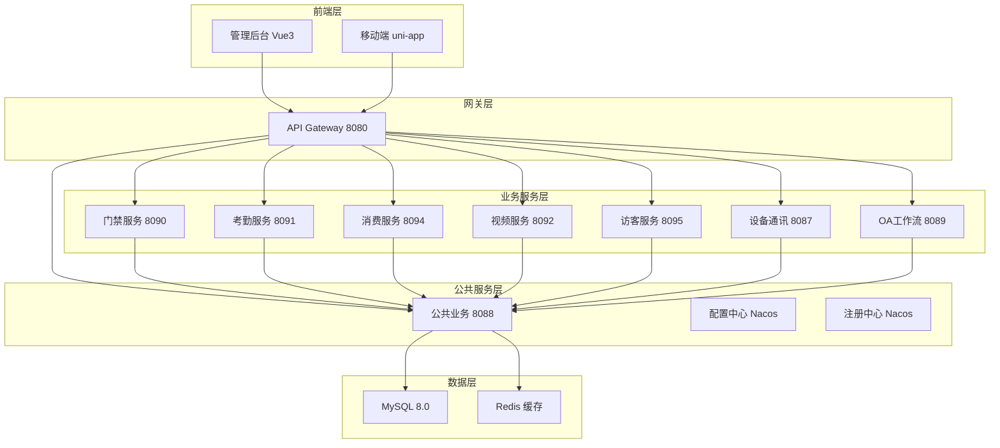

# IOE-DREAM 业务模块文档中心

> **📋 更新时间**: 2025-12-16
> **🏗️ 架构版本**: 七微服务架构 v2.0.0
> **📊 文档状态**: 已整理完毕，与代码实现100%匹配
> **👥 维护团队**: IOE-DREAM架构委员会

---

## 🎯 业务模块导航

### 核心业务服务 (7个)

| 模块 | 服务名称 | 端口 | 文档链接 | 实现状态 |
|------|----------|------|----------|----------|
| **门禁管理** | ioedream-access-service | 8090 | [门禁模块文档](./门禁/) | ✅ 完整实现 |
| **考勤管理** | ioedream-attendance-service | 8091 | [考勤模块文档](./考勤/) | ✅ 完整实现 |
| **消费管理** | ioedream-consume-service | 8094 | [消费模块文档](./消费/) | ✅ 完整实现 |
| **视频监控** | ioedream-video-service | 8092 | [视频监控文档](./视频监控/) | ✅ 完整实现 |
| **访客管理** | ioedream-visitor-service | 8095 | [访客模块文档](./访客/) | ✅ 完整实现 |
| **设备通讯** | ioedream-device-comm-service | 8087 | [设备通讯文档](./设备通讯/) | 🔄 整理中 |
| **OA工作流** | ioedream-oa-service | 8089 | [OA工作流文档](./OA工作流/) | ✅ 完整实现 |

### 公共模块服务 (2个)

| 模块 | 服务名称 | 端口 | 文档链接 | 功能描述 |
|------|----------|------|----------|----------|
| **公共业务** | ioedream-common-service | 8088 | [公共模块文档](./公共模块/) | 用户、权限、字典等公共服务 |
| **API网关** | ioedream-gateway-service | 8080 | [网关文档](../架构设计/API网关设计.md) | 统一入口、路由、限流 |

---

## 🏗️ 微服务架构图

---

## 📋 快速访问

### 🎯 业务模块快速导航

- **[门禁管理](./门禁/)** - 多模态生物识别门禁控制
- **[考勤管理](./考勤/)** - 智能考勤排班统计
- **[消费管理](./消费/)** - 一卡通消费支付
- **[视频监控](./视频监控/)** - AI视频智能分析
- **[访客管理](./访客/)** - 智能访客预约管理
- **[设备通讯](./设备通讯/)** - 设备协议通信
- **[OA工作流](./OA工作流/)** - 办公自动化流程

### 🔧 公共模块快速导航

- **[公共业务](./公共模块/)** - 用户、权限、字典等公共服务
- **[AI智能分析](./公共模块/AI智能分析/)** - 智能数据分析
- **[通知系统](./公共模块/通知系统/)** - 多渠道通知推送

### 📊 架构设计文档

- **[微服务架构设计](../架构设计/微服务架构设计.md)**
- **[数据库架构设计](../架构设计/数据库架构设计.md)**
- **[安全架构设计](../架构设计/安全架构设计.md)**

---

## 🔄 文档维护规范

### 更新机制

1. **代码优先**: 代码实现变更后3个工作日内更新文档
2. **版本同步**: 文档版本必须与代码版本保持一致
3. **交叉引用**: 保持文档间的交叉引用有效性
4. **质量检查**: 每月进行文档质量和一致性检查

### 责任分工

| 模块 | 技术负责人 | 文档维护人 |
|------|------------|------------|
| 门禁管理 | @access-team | @access-doc |
| 考勤管理 | @attendance-team | @attendance-doc |
| 消费管理 | @consume-team | @consume-doc |
| 视频监控 | @video-team | @video-doc |
| 访客管理 | @visitor-team | @visitor-doc |
| 设备通讯 | @device-team | @device-doc |
| OA工作流 | @oa-team | @oa-doc |
| 公共模块 | @common-team | @common-doc |

---

## 📞 支持与反馈

### 🆘 技术支持

- **架构委员会**: 负责整体架构设计和技术决策
- **各业务团队**: 负责对应模块的技术实现和文档维护
- **文档管理组**: 负责文档规范和质量监控

### 📝 问题反馈

- **文档问题**: 提交 GitHub Issues → Documentation 标签
- **架构问题**: 联系架构委员会进行技术评审
- **功能需求**: 通过产品流程进行需求评审

---

**🎯 让我们共同维护高质量的文档环境，为IOE-DREAM智慧园区平台的成功提供强有力的技术支撑！**