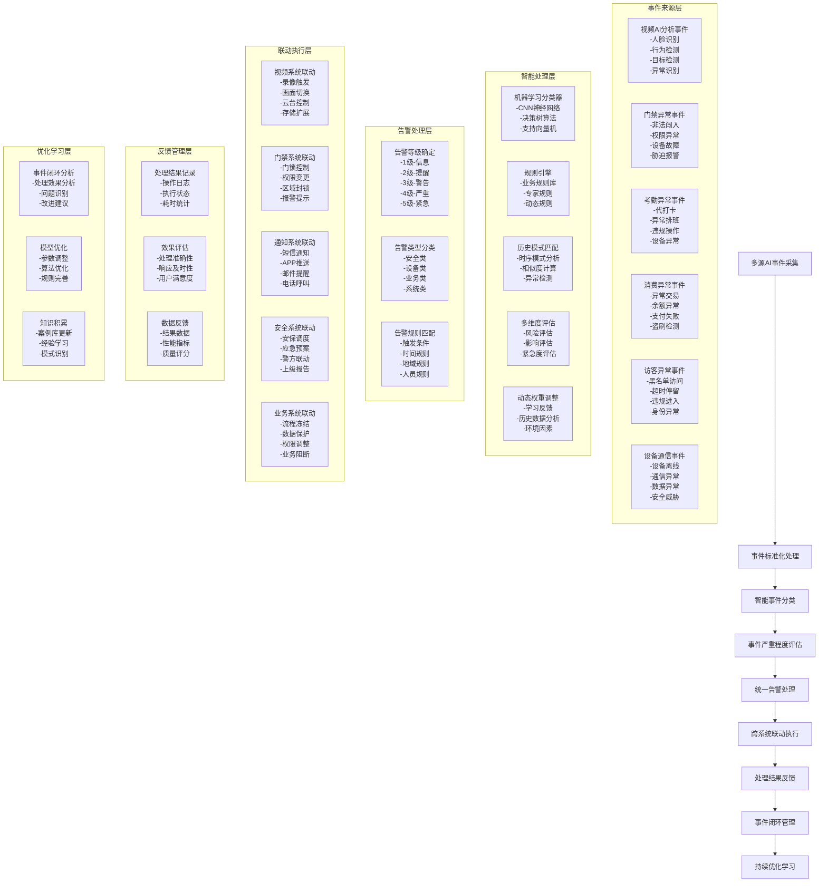
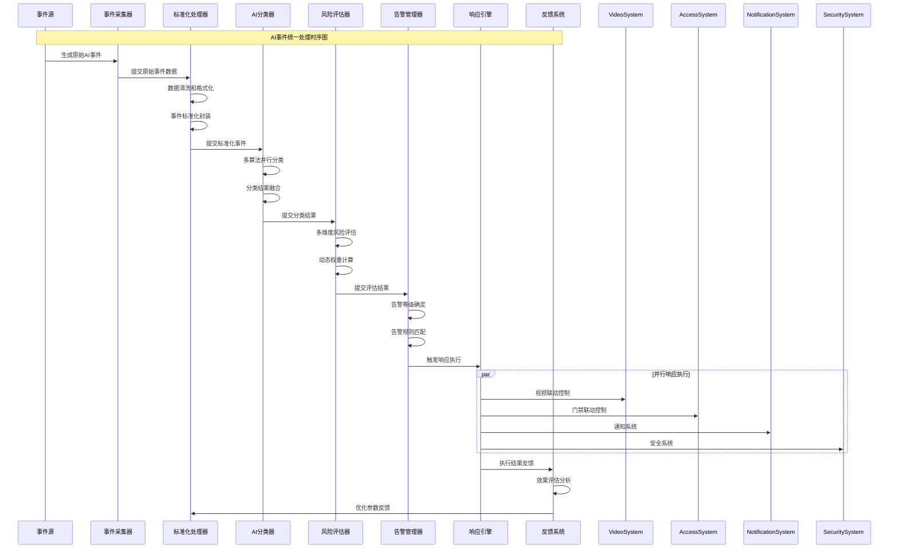
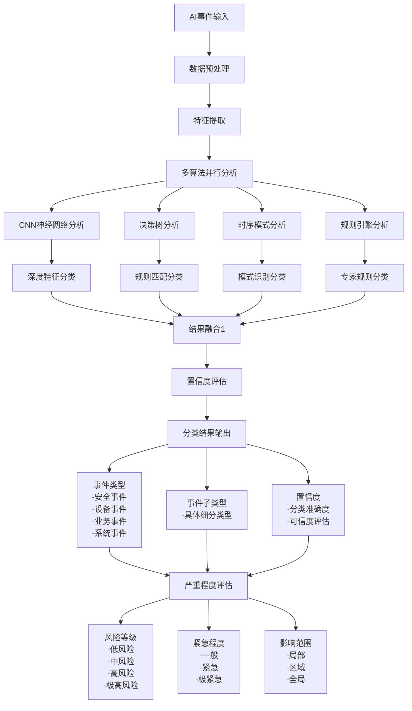
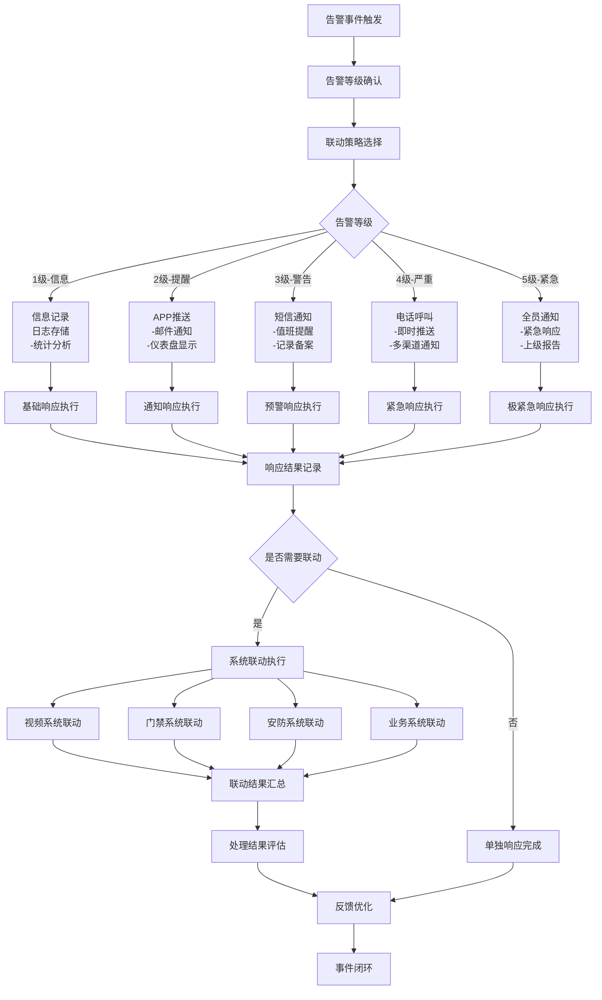

# IOE-DREAM AI事件管理统一业务流程图

## 📋 流程概述

AI事件管理统一业务流程是IOE-DREAM智能管理平台的核心流程，负责统一处理来自各业务模块的AI分析事件，实现跨系统的事件汇聚、智能分类、严重程度评估、统一告警处理和联动执行，确保所有AI事件都能得到及时、准确、智能化的处理。

## 🎯 业务目标

- **统一事件管理**：建立跨模块的AI事件统一管理机制
- **智能分类分级**：基于AI算法的事件智能分类和严重程度评估
- **快速响应联动**：实现毫秒级的事件响应和多系统联动执行
- **闭环处理管理**：确保事件处理结果可追溯、可评估、可优化

## 🔄 核心业务流程图

### 1. 整体业务流程架构

### 2. 详细事件处理流程

### 3. 事件分类决策流程

### 4. 告警联动执行流程

## 📊 关键KPI指标

### 处理性能指标
- **事件采集延迟**：< 100ms（99%的事件）
- **分类处理时间**：< 200ms（95%的事件）
- **风险评估时间**：< 150ms（98%的事件）
- **告警触发时间**：< 50ms（100%的事件）
- **联动响应时间**：< 1s（90%的联动）

### 准确性指标
- **事件分类准确率**：≥ 95%
- **风险评估准确率**：≥ 92%
- **误报率**：≤ 3%
- **漏报率**：≤ 1%
- **重复率**：≤ 2%

### 业务效果指标
- **事件处理覆盖率**：100%
- **自动处理率**：≥ 85%
- **按时处理率**：≥ 98%
- **用户满意度**：≥ 90%
- **问题解决率**：≥ 95%

## 🔧 技术实现要求

### 1. 系统架构要求
- **微服务架构**：事件采集、分类、评估、告警、响应分离
- **消息队列**：高并发事件处理，支持数万TPS
- **流处理框架**：实时事件流处理，支持窗口计算
- **AI算法平台**：多种算法集成，支持模型训练和部署

### 2. 数据处理要求
- **实时流处理**：支持毫秒级事件处理
- **批处理分析**：支持历史数据批量分析
- **数据融合**：多源数据实时融合和关联
- **数据治理**：完整的数据质量管控体系

### 3. 算法能力要求
- **机器学习**：支持监督学习、无监督学习、强化学习
- **深度学习**：CNN、RNN、Transformer等神经网络
- **时序分析**：支持时间序列数据分析和预测
- **规则引擎**：支持复杂业务规则配置和管理

### 4. 系统集成要求
- **API网关**：统一的接口管理和安全控制
- **服务注册发现**：动态服务发现和负载均衡
- **配置中心**：统一的配置管理和动态更新
- **监控告警**：全链路监控和智能告警

## 🚀 实施建议

### 第一阶段：基础平台建设（4周）
1. **事件采集平台**：建立统一的事件采集和标准化机制
2. **AI分类平台**：部署基础的分类算法和规则引擎
3. **风险评估引擎**：实现多维度风险评估模型
4. **基础告警系统**：实现基本的告警管理和通知功能

### 第二阶段：智能化升级（6周）
1. **高级算法集成**：集成更多AI算法和深度学习模型
2. **智能联动机制**：实现跨系统的智能联动和自动化处理
3. **预测分析能力**：实现事件预测和趋势分析
4. **自适应优化**：实现系统的自我学习和优化

### 第三阶段：生态完善（8周）
1. **开放平台建设**：支持第三方算法和系统集成
2. **智能决策支持**：提供数据驱动的决策支持
3. **业务流程自动化**：实现更高级的业务流程自动化
4. **持续优化体系**：建立完整的持续优化和学习体系

## 📈 预期效果

通过实施AI事件管理统一业务流程，预期将实现：

1. **响应效率提升**：事件响应时间缩短70%，自动化处理率提升至85%以上
2. **处理准确性提升**：事件分类准确率提升至95%，误报率控制在3%以内
3. **运营成本降低**：人工干预减少60%，运营效率提升80%
4. **安全能力增强**：异常事件检出率提升90%，安全防护能力全面提升
5. **用户体验优化**：系统智能化水平显著提升，用户满意度达到90%以上

## 🎯 结论

AI事件管理统一业务流程是IOE-DREAM智能管理平台的核心流程，通过建立统一的事件采集、智能分类、风险评估、告警处理和联动执行机制，将显著提升系统的智能化水平、响应速度和处理准确性，为企业级智慧安防管理提供强有力的技术支撑。