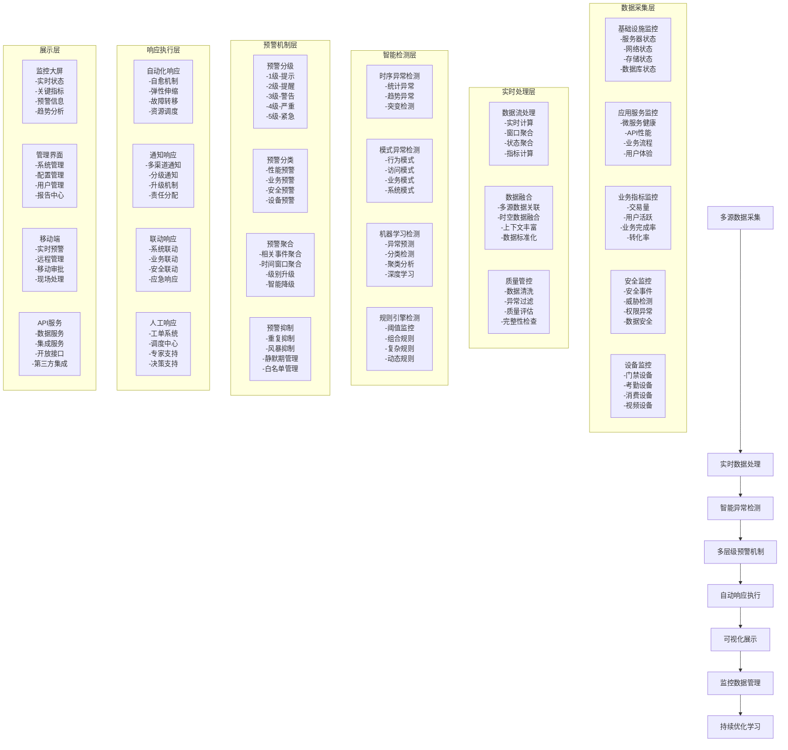
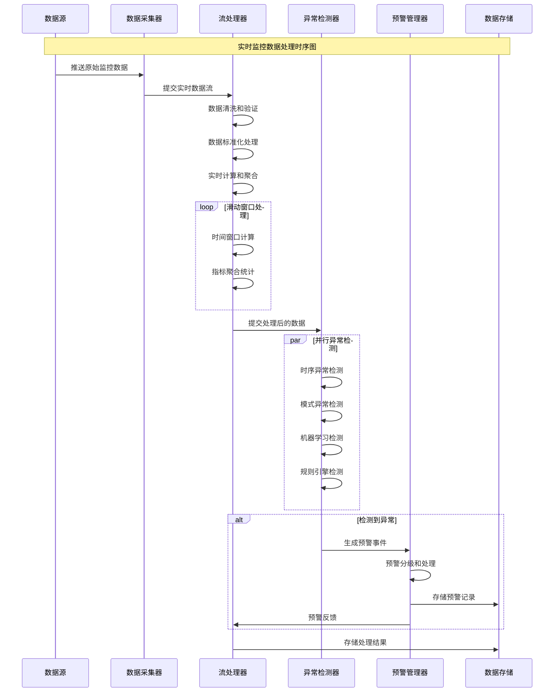
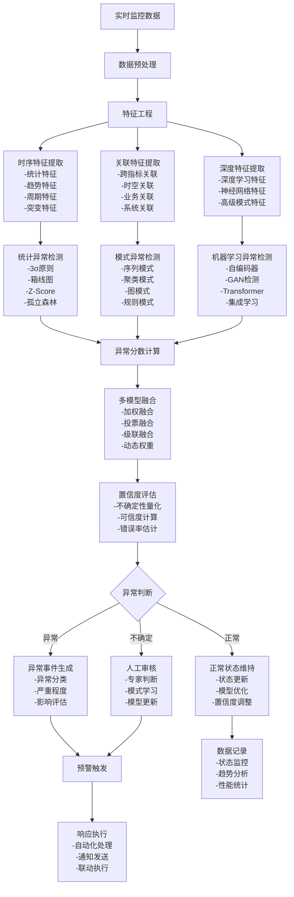
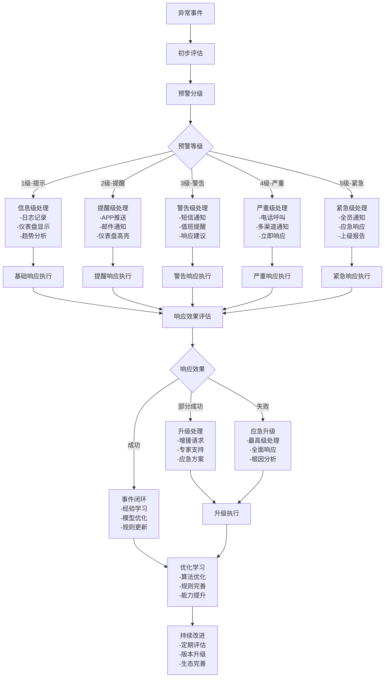
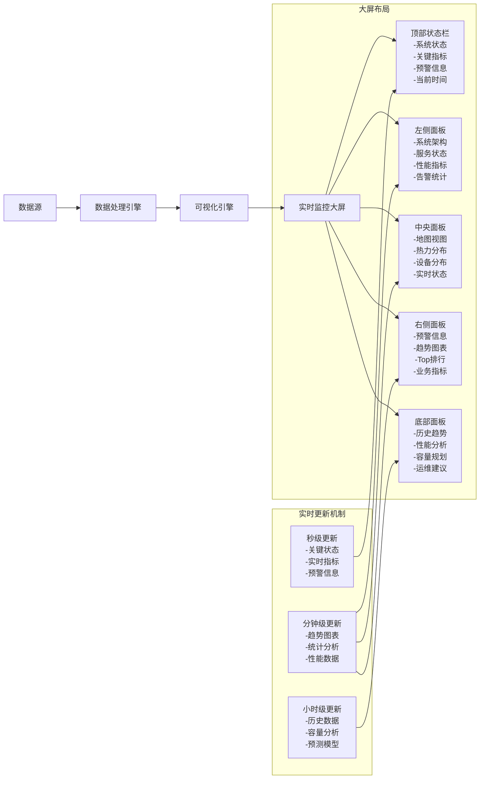

# IOE-DREAM 实时监控预警统一业务流程图

## 📋 流程概述

实时监控预警统一业务流程是IOE-DREAM智能管理平台的监控中枢，负责统一监控全系统的运行状态、业务指标、安全状况，实现实时数据采集、智能异常检测、多层级预警机制、自动响应执行和全方位的可视化展示，确保平台始终保持安全、稳定、高效的运行状态。

## 🎯 业务目标

- **全栈监控覆盖**：建立覆盖基础设施、应用、业务、安全的全栈监控体系
- **智能异常检测**：基于AI算法的智能异常检测和预警机制
- **实时预警响应**：实现秒级异常检测和多层级预警响应
- **可视化管控**：提供直观的实时监控大屏和管理界面

## 🔄 核心业务流程图

### 1. 整体监控架构流程

### 2. 实时数据处理流程

### 3. 智能异常检测流程

### 4. 多层级预警机制

### 5. 实时监控大屏展示流程

## 📊 关键监控指标

### 基础设施监控指标
- **服务器状态**：CPU使用率 ≤ 80%，内存使用率 ≤ 85%，磁盘使用率 ≤ 90%
- **网络状态**：带宽利用率 ≤ 70%，延迟 < 10ms，丢包率 < 0.1%
- **存储状态**：IOPS利用率 ≤ 80%，容量使用率 ≤ 85%
- **数据库状态**：连接数 ≤ 最大值的80%，查询响应时间 < 100ms

### 应用服务监控指标
- **服务健康度**：服务可用性 ≥ 99.9%，健康检查通过率 ≥ 99.5%
- **API性能**：响应时间 P95 < 500ms，错误率 < 1%，并发处理能力 ≥ 设计值的80%
- **业务流程**：流程完成率 ≥ 98%，处理时间符合设计标准
- **用户体验**：页面加载时间 < 3s，用户满意度 ≥ 4.5分

### 业务指标监控
- **交易量**：实时交易量、日交易量、峰值处理能力
- **用户活跃**：在线用户数、活跃用户数、用户行为分析
- **业务完成率**：各业务流程完成率、自动化处理率
- **转化率**：关键业务转化率、用户留存率、系统效率

### 安全监控指标
- **安全事件**：安全事件检出率 ≥ 95%，响应时间 < 1分钟
- **威胁检测**：威胁检测准确率 ≥ 90%，误报率 < 5%
- **权限异常**：权限异常检测率 ≥ 95%，权限变更及时性 < 5分钟
- **数据安全**：数据访问异常检测率 ≥ 99%，数据泄露风险 < 0.1%

### 设备监控指标
- **设备在线率**：设备在线率 ≥ 99%，设备故障率 < 1%
- **设备性能**：设备响应时间 < 200ms，处理成功率 ≥ 99%
- **通信状态**：通信成功率 ≥ 99.5%，通信延迟 < 100ms
- **设备状态**：设备完好率 ≥ 98%，维护及时性 < 2小时

## 🔧 技术实现要求

### 1. 数据采集架构
- **多源采集**：支持Agent、API、消息队列、日志文件等多种采集方式
- **实时采集**：支持毫秒级数据采集，采集延迟 < 100ms
- **数据质量**：完整的数据质量管控，数据准确率 ≥ 99.9%
- **可扩展性**：支持水平扩展，支持数万个监控节点

### 2. 流处理引擎
- **流处理框架**：Apache Flink、Apache Spark Streaming、Kafka Streams
- **窗口计算**：支持时间窗口、计数窗口、会话窗口
- **状态管理**：分布式状态管理，状态恢复时间 < 1分钟
- **容错机制**：完整的容错和恢复机制，故障恢复时间 < 30秒

### 3. 异常检测算法
- **时序分析**：支持多种时序异常检测算法
- **机器学习**：支持监督学习、无监督学习、强化学习
- **深度学习**：支持CNN、RNN、Transformer等深度学习模型
- **规则引擎**：支持复杂业务规则配置和管理

### 4. 预警通知系统
- **多渠道通知**：支持短信、邮件、APP推送、电话等多种通知方式
- **智能路由**：基于预警级别、时间、人员职责的智能路由
- **升级机制**：支持自动升级和手动升级，升级时间 < 1分钟
- **抑制管理**：支持重复抑制、风暴抑制、静默期管理

### 5. 可视化展示
- **实时大屏**：支持多屏幕联动、实时刷新、自定义布局
- **交互界面**：支持钻取分析、筛选查询、导出分享
- **移动端**：支持实时监控、远程管理、移动审批
- **API服务**：支持RESTful API、WebSocket、数据服务

## 🚀 实施建议

### 第一阶段：基础监控建设（6周）
1. **基础设施监控**：服务器、网络、存储、数据库基础监控
2. **应用服务监控**：微服务健康度、API性能、业务流程监控
3. **基础预警**：阈值监控、基础通知、简单可视化
4. **数据平台建设**：实时数据采集、存储、处理平台

### 第二阶段：智能监控升级（8周）
1. **异常检测升级**：引入机器学习算法和深度学习模型
2. **智能预警**：多层级预警机制、智能抑制、自动响应
3. **可视化升级**：实时大屏、交互界面、移动端应用
4. **自动化响应**：自动化故障处理、弹性伸缩、资源调度

### 第三阶段：全面监控完善（10周）
1. **全栈监控**：端到端监控、用户体验监控、业务链路监控
2. **预测分析**：趋势预测、容量规划、风险预警
3. **智能运维**：AIOps、智能诊断、自愈系统
4. **生态集成**：第三方工具集成、开放API、生态建设

## 📈 预期效果

通过实施实时监控预警统一业务流程，预期将实现：

1. **监控覆盖率提升**：从60%提升至95%以上的监控覆盖率
2. **异常检测准确率**：智能异常检测准确率提升至90%以上
3. **响应效率提升**：异常响应时间缩短80%，自动化处理率提升至85%以上
4. **运维成本降低**：人工监控成本降低60%，运维效率提升70%
5. **系统稳定性提升**：系统可用性提升至99.9%以上，故障恢复时间缩短至1分钟以内

## 🎯 结论

实时监控预警统一业务流程是IOE-DREAM智能管理平台的监控中枢，通过建立全栈监控体系、智能异常检测机制、多层级预警系统和自动化响应机制，将为平台提供全方位的实时监控、智能预警和自动响应能力，确保系统始终保持安全、稳定、高效的运行状态，为智慧园区管理提供强有力的技术保障。