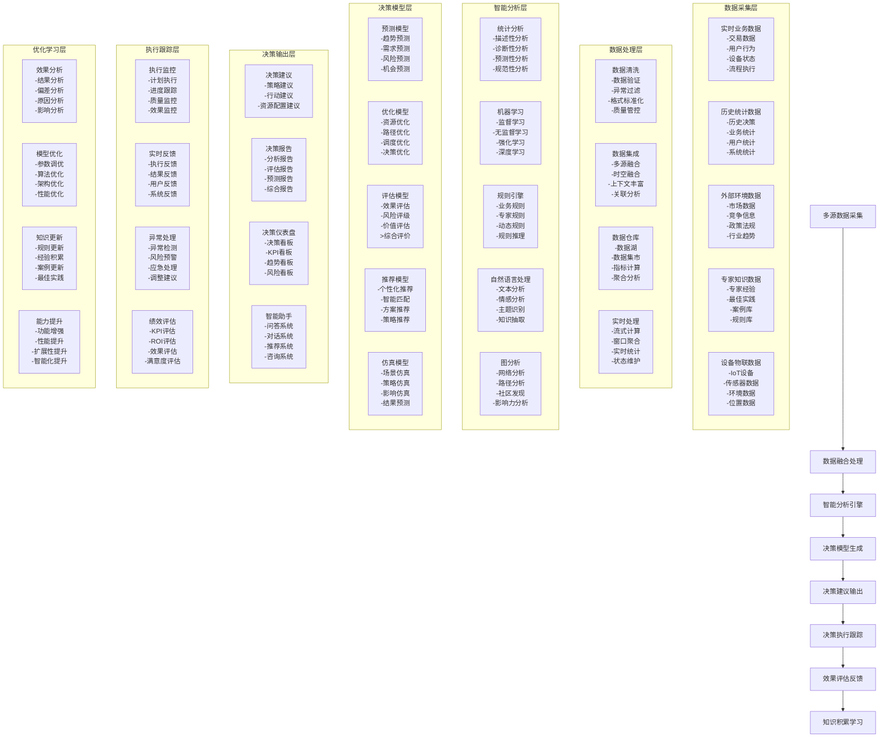
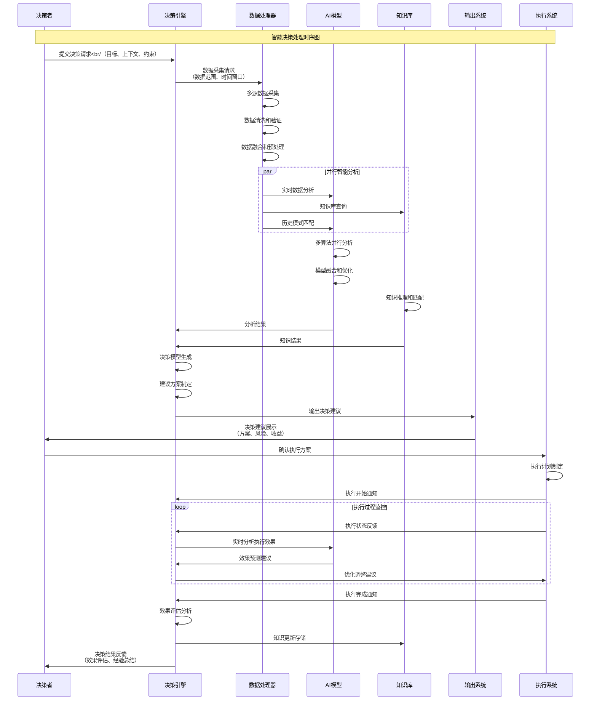
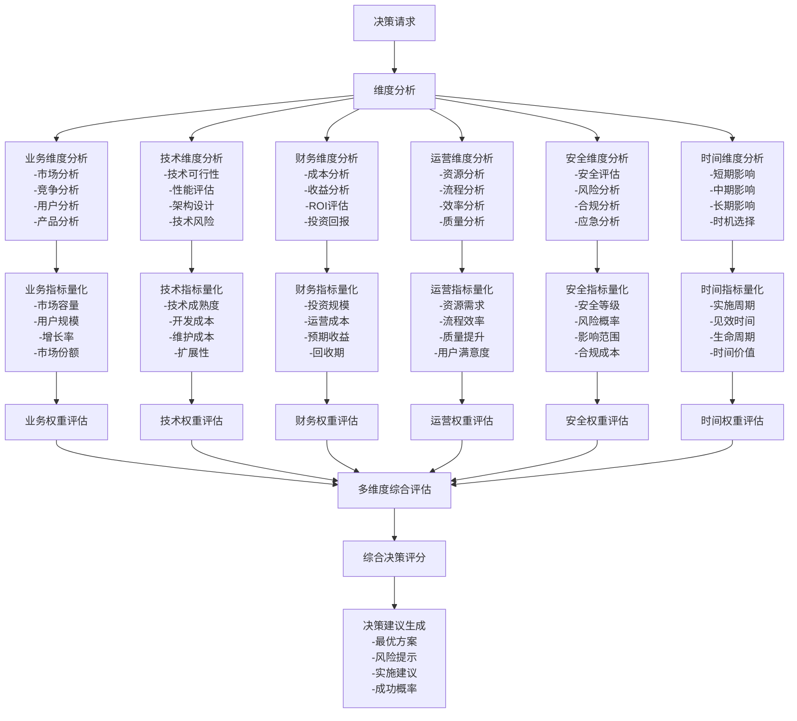
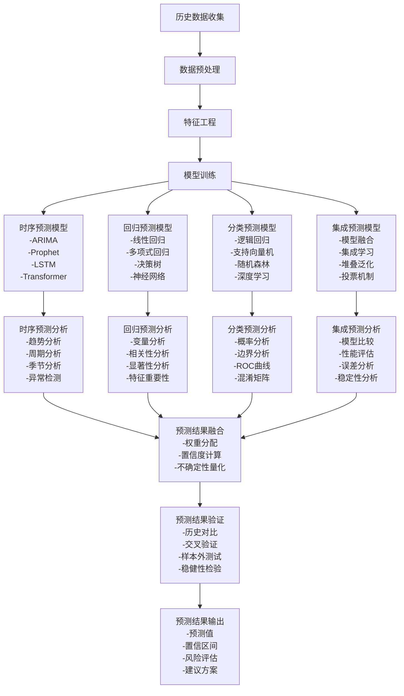
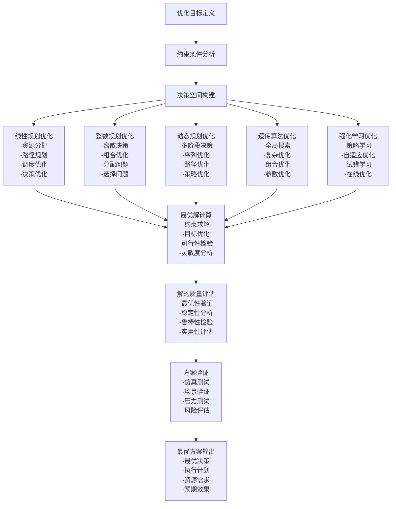

# IOE-DREAM 智能决策支持系统业务流程图

## 📋 流程概述

智能决策支持系统业务流程是IOE-DREAM智能管理平台的大脑中枢，负责基于实时数据分析、AI算法模型、业务规则引擎和历史经验知识，为管理决策提供数据驱动的智能支持，实现从数据采集到决策输出的全流程智能化，帮助管理者做出更准确、更及时、更科学的决策。

## 🎯 业务目标

- **数据驱动决策**：建立基于实时数据的决策支持机制，提升决策准确性
- **智能预测分析**：利用AI算法实现趋势预测、风险评估和机会识别
- **多维度分析**：提供业务、技术、安全、财务等多维度的决策分析
- **决策优化建议**：基于历史经验和实时数据，提供最优决策建议

## 🔄 核心业务流程图

### 1. 智能决策支持整体架构

### 2. 智能决策处理流程

### 3. 多维度决策分析流程

### 4. 预测分析模型流程

### 5. 优化决策引擎流程

## 📊 关键决策指标

### 决策准确性指标
- **预测准确率**：预测准确率 ≥ 85%，置信度 ≥ 80%
- **决策成功率**：决策建议采纳率 ≥ 70%，执行成功率 ≥ 80%
- **ROI准确率**：ROI预测误差 ≤ 20%，投资回报率 ≥ 预期的80%
- **风险控制率**：风险识别率 ≥ 90%，风险控制效果 ≥ 85%

### 决策效率指标
- **决策响应时间**：决策响应时间 ≤ 1小时，复杂决策 ≤ 24小时
- **分析处理速度**：数据分析处理时间 ≤ 10分钟，模型训练时间 ≤ 1小时
- **建议生成速度**：建议生成时间 ≤ 5分钟，报告生成时间 ≤ 30分钟
- **决策支持覆盖率**：决策场景覆盖率 ≥ 80%，决策支持功能完整性 ≥ 95%

### 业务影响指标
- **业务增长贡献**：决策贡献的业务增长率 ≥ 10%
- **成本优化效果**：成本优化效果 ≥ 15%，运营成本降低 ≥ 10%
- **效率提升效果**：决策效率提升 ≥ 30%，自动化处理率 ≥ 50%
- **用户满意度**：决策用户满意度 ≥ 4.5分，决策建议认可度 ≥ 70%

### 技术性能指标
- **数据覆盖率**：数据源覆盖率 ≥ 95%，数据准确性 ≥ 99%
- **模型性能**：模型准确率 ≥ 85%，预测精度 ≥ 80%
- **系统可用性**：系统可用性 ≥ 99.5%，响应时间 ≤ 1秒
- **扩展性指标**：支持决策场景数量 ≥ 100，并发处理能力 ≥ 1000TPS

## 🔧 技术实现要求

### 1. 数据平台架构
- **数据湖架构**：支持多源异构数据的统一存储和管理
- **数据仓库**：支持多维数据的聚合分析和OLAP查询
- **实时数据处理**：支持流式数据处理和实时分析
- **数据质量管控**：完整的数据质量检查和治理体系

### 2. AI算法平台
- **机器学习平台**：支持主流机器学习算法的自动化训练和部署
- **深度学习平台**：支持深度学习模型的训练和推理
- **模型管理**：支持模型版本管理、A/B测试、性能监控
- **算法优化**：支持超参数优化、模型压缩、加速优化

### 3. 知识管理系统
- **知识库构建**：支持专家知识、最佳实践、案例经验的统一管理
- **知识推理**：支持基于知识图谱的智能推理和关联分析
- **知识更新**：支持知识的自动抽取、更新和验证
- **知识服务**：支持知识的查询、检索、推荐和应用

### 4. 决策引擎系统
- **规则引擎**：支持复杂业务规则的配置、管理和执行
- **优化引擎**：支持多种优化算法的集成和选择
- **仿真引擎**：支持场景仿真、策略模拟、效果预测
- **推荐引擎**：支持个性化推荐和智能匹配

### 5. 可视化展示系统
- **决策仪表盘**：支持决策指标的多维度可视化展示
- **交互式分析**：支持钻取分析、多维交互、自定义报表
- **报告生成**：支持自动化报告生成和多格式输出
- **移动端支持**：支持移动设备的访问和操作

## 🚀 实施建议

### 第一阶段：基础平台建设（8周）
1. **数据平台建设**：数据湖、数据仓库、实时处理平台
2. **基础算法集成**：常用机器学习算法和深度学习模型
3. **知识库构建**：专家知识收集、整理、结构化存储
4. **基础决策功能**：简单决策模型、基础建议系统

### 第二阶段：智能能力升级（12周）
1. **高级算法集成**：集成更多AI算法和深度学习模型
2. **知识推理增强**：构建知识图谱，实现智能推理
3. **优化引擎集成**：集成多种优化算法，支持复杂决策
4. **智能助手开发**：开发智能对话和问答系统

### 第三阶段：生态完善（16周）
1. **生态系统建设**：构建开放的决策支持生态系统
2. **自动化升级**：实现决策流程的自动化和智能化
3. **个性定制**：支持个性化的决策偏好和定制化需求
4. **持续学习**：建立自我学习和持续改进机制

## 📈 预期效果

通过实施智能决策支持系统业务流程，预期将实现：

1. **决策质量提升**：决策准确率提升30%，决策成功率提升25%
2. **决策效率提升**：决策响应时间缩短50%，自动化决策率提升40%
3. **决策智能化水平**：AI驱动的决策比例提升至80%以上
4. **业务影响提升**：决策贡献的业务增长达到15%以上，成本优化效果达到20%以上

## 🎯 结论

智能决策支持系统业务流程是IOE-DREAM智能管理平台的智慧大脑，通过建立基于数据和AI的决策支持机制，将为管理者提供更准确、更及时、更科学的决策支持，显著提升平台的智能化水平和管理效率，为智慧园区运营提供强有力的决策支持保障。