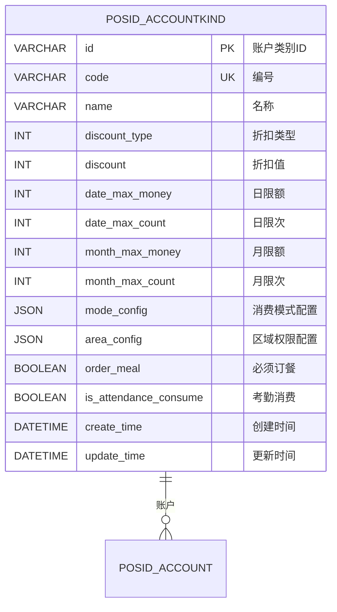
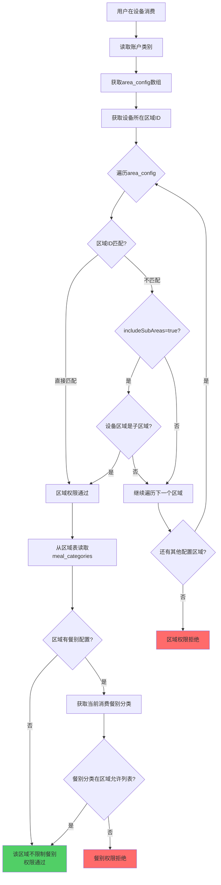

# 04-账户类别区域权限设计

## 📋 模块概述

**设计目标**：通过JSON字段在账户类别中直接配置区域权限，优化高频查询性能，同时提供完善的补偿机制应对各种场景。

**核心设计**：
- ✅ 账户类别通过 `area_config` JSON字段配置可用区域
- ✅ 区域本身已配置支持的餐别分类（在区域管理模块）
- ✅ 账户类别继承区域的餐别权限，可选择性过滤
- ✅ 提供反向索引和统计表应对低频查询场景

**设计理念**：
```
账户类别.area_config → 区域.meal_categories → 餐别分类 → 具体餐别
   (JSON配置)           (餐厅原有属性)
```

**补偿机制**：
- 🔄 Redis反向索引（应对反向查询）
- 📊 统计汇总表（应对报表需求）
- ✅ 数据一致性校验（定期校验任务）
- 🔙 SQL视图（应急降级方案）

---

## 🗄️ 数据模型设计

### 1. 主表结构



### 2. 补偿机制表结构

#### 2.1 区域使用统计表（应对报表需求）

```sql
-- ========================================
-- 区域使用统计表（每小时自动更新）
-- ========================================
CREATE TABLE POSID_AREA_USAGE_STAT (
    area_id VARCHAR(50) PRIMARY KEY COMMENT '区域ID',
    account_kind_ids TEXT COMMENT '使用该区域的账户类别ID（JSON数组）',
    account_kind_count INT DEFAULT 0 COMMENT '使用数量',
    include_sub_count INT DEFAULT 0 COMMENT '包含子区域的数量',
    last_update_time DATETIME COMMENT '最后更新时间',
    
    INDEX idx_update_time(last_update_time)
) ENGINE=InnoDB DEFAULT CHARSET=utf8mb4 COMMENT='区域使用统计表';

-- 更新SQL（定时任务执行）
INSERT INTO POSID_AREA_USAGE_STAT (area_id, account_kind_ids, account_kind_count, include_sub_count, last_update_time)
SELECT 
    a.id AS area_id,
    JSON_ARRAYAGG(ak.id) AS account_kind_ids,
    COUNT(ak.id) AS account_kind_count,
    SUM(CASE WHEN JSON_EXTRACT(area_config_item.value, '$.includeSubAreas') = true THEN 1 ELSE 0 END) AS include_sub_count,
    NOW() AS last_update_time
FROM POSID_AREA a
LEFT JOIN POSID_ACCOUNTKIND ak ON JSON_CONTAINS(
    ak.area_config, 
    JSON_OBJECT('areaId', a.id),
    '$'
)
GROUP BY a.id
ON DUPLICATE KEY UPDATE
    account_kind_ids = VALUES(account_kind_ids),
    account_kind_count = VALUES(account_kind_count),
    include_sub_count = VALUES(include_sub_count),
    last_update_time = VALUES(last_update_time);
```

#### 2.2 应急SQL视图（降级方案）

```sql
-- ========================================
-- 账户类别-区域关联视图（应急降级使用）
-- ========================================
CREATE VIEW V_POSID_ACCOUNTKIND_AREA AS
SELECT 
    ak.id AS account_kind_id,
    JSON_EXTRACT(area_item.value, '$.areaId') AS area_id,
    JSON_EXTRACT(area_item.value, '$.includeSubAreas') AS include_sub_areas,
    ak.update_time AS update_time
FROM POSID_ACCOUNTKIND ak
CROSS JOIN JSON_TABLE(
    ak.area_config,
    '$[*]' COLUMNS(
        value JSON PATH '$'
    )
) AS area_item
WHERE ak.area_config IS NOT NULL;

-- 使用示例：查询某区域被哪些账户类别使用
SELECT account_kind_id 
FROM V_POSID_ACCOUNTKIND_AREA 
WHERE area_id = 'area_001';
```

---

## 🔑 area_config JSON结构设计

### 简化结构

```json
[
  {
    "areaId": "区域ID",
    "includeSubAreas": true
  }
]
```

**字段说明：**

| 字段 | 类型 | 必填 | 说明 |
|------|------|------|------|
| areaId | String | ✅ | 区域ID |
| includeSubAreas | Boolean | ✅ | 是否包含所有子区域（true/false） |

**设计要点：**
- ✅ **极简设计**：只配置区域ID和层级继承
- ✅ **自动继承**：账户类别自动继承区域的所有餐别
- ✅ **扩展性**：未来如需增加字段，可在对象中添加

---

## 📊 配置示例

### 示例1：教职工卡（层级权限）

```json
{
  "code": "TEACHER",
  "name": "教职工卡",
  "area_config": [
    {
      "areaId": "main_campus",
      "includeSubAreas": true
    }
  ]
}
```

### 示例2：学生卡（多个区域）

```json
{
  "code": "STUDENT",
  "name": "学生卡",
  "area_config": [
    {
      "areaId": "canteen_1",
      "includeSubAreas": false
    },
    {
      "areaId": "canteen_2",
      "includeSubAreas": false
    },
    {
      "areaId": "library",
      "includeSubAreas": true
    }
  ]
}
```

---

## 🔄 权限验证流程

### 核心设计理念

```
账户类别.area_config → 区域.meal_categories → 餐别分类 → 具体餐别
     (配置可用区域)      (区域支持的餐别)     (分类)      (餐别)
```

**关键点：**
1. **账户类别** `area_config`：配置该类别可以在哪些区域消费
2. **区域表** `meal_categories` 字段：配置该区域支持哪些餐别分类（在区域管理模块配置）
3. **自动继承**：账户类别在该区域消费时，自动继承该区域的所有餐别分类

### 完整验证流程



---

## 💾 缓存策略

### 核心缓存设计

| 缓存项 | Redis Key | 过期时间 | 说明 |
|-------|-----------|---------|------|
| 账户类别完整配置 | `accountkind:full:{id}` | 1小时 | 包含mode_config+area_config |
| 有效区域列表（展开） | `accountkind:areas:{id}` | 1小时 | 展开includeSubAreas后的所有区域 |
| 区域详情（含餐别） | `area:info:{areaId}` | 30分钟 | 区域信息+meal_categories |
| 区域权限校验结果 | `perm:area:{accountKindId}:{areaId}` | 30分钟 | 布尔值缓存 |

### 反向索引缓存（应对反向查询）

| 缓存项 | Redis Key | 过期时间 | 说明 |
|-------|-----------|---------|------|
| 区域被哪些账户类别使用 | `area:accountkinds:{areaId}` | 1小时 | Set结构，账户类别ID列表 |
| 账户类别使用的所有区域 | `accountkind:all-areas:{kindId}` | 1小时 | 展开后的所有区域（含子区域） |

### 缓存更新策略

**主动刷新：**
- 账户类别的 `area_config` 变更 → 删除该类别的所有权限缓存 + 更新反向索引
- 区域结构变更（新增/删除子区域）→ 删除所有账户类别的区域缓存
- 区域的 `meal_categories` 配置变更 → 删除区域缓存和相关权限缓存

**反向索引更新逻辑**：

账户类别`area_config`变更时的处理步骤：
1. **获取旧配置**：从数据库读取原有的`area_config`
2. **更新数据库**：保存新的`area_config`到数据库
3. **删除旧的反向索引**：遍历旧配置，从Redis Set中移除对应关系
   - 键格式：`area:accountkinds:{areaId}`
   - 操作：`SREM area:accountkinds:{旧areaId} {accountKindId}`
4. **添加新的反向索引**：遍历新配置，向Redis Set中添加对应关系
   - 操作：`SADD area:accountkinds:{新areaId} {accountKindId}`
5. **删除相关缓存**：清理账户类别的完整配置缓存
   - `accountkind:full:{accountKindId}`
   - `accountkind:areas:{accountKindId}`

---

## 🔧 完善的补偿机制

### 1. 反向查询支持

**查询某区域被哪些账户类别使用**的三级降级方案：

#### 方案A：Redis实时索引（推荐，日常使用）

**查询逻辑**：
1. **一级查询**：从Redis Set读取 `area:accountkinds:{areaId}`
   - 如果存在，直接返回账户类别ID列表
   - 性能：<5ms，适合实时查询

2. **二级降级**：Redis不存在时，从统计表`POSID_AREA_USAGE_STAT`读取
   - 解析`account_kind_ids` JSON数组
   - 重建Redis索引（过期时间1小时）
   - 性能：10-20ms

3. **三级降级**：统计表也不存在时，全表扫描（最后手段）
   - 扫描所有账户类别的`area_config`
   - 性能：100-500ms（取决于数据量）

#### 方案B：SQL视图（应急降级，仅紧急情况）

**使用场景**：Redis和统计表都不可用时的应急方案

**查询方式**：
- 直接查询SQL视图 `V_POSID_ACCOUNTKIND_AREA`
- SQL：`SELECT account_kind_id FROM V_POSID_ACCOUNTKIND_AREA WHERE area_id = ?`
- 性能：20-50ms（取决于索引）

### 2. 统计报表支持

#### 定时任务：更新统计表

**执行频率**：每小时执行一次（`cron: 0 0 * * * ?`）

**统计逻辑**：
1. 查询所有区域列表
2. 对每个区域：
   - 扫描所有账户类别的`area_config`
   - 查找引用当前区域的账户类别
   - 统计`includeSubAreas=true`的数量
   - 保存到统计表`POSID_AREA_USAGE_STAT`：
     - `area_id`：区域ID
     - `account_kind_ids`：账户类别ID数组（JSON）
     - `account_kind_count`：使用该区域的账户类别数量
     - `include_sub_count`：启用包含子区域的数量
     - `last_update_time`：最后更新时间
   - 同步更新Redis反向索引 `area:accountkinds:{areaId}`

3. 记录统计完成日志

### 3. 数据一致性校验

**执行频率**：每日凌晨2点执行（`cron: 0 0 2 * * ?`）

**校验逻辑**：
1. 遍历所有账户类别
2. 对每个账户类别的`area_config`进行校验：
   - **检查区域存在性**：
     - 解析JSON，提取所有`areaId`
     - 查询数据库验证区域是否存在
     - 如果不存在，记录警告并添加到异常列表

   - **检查includeSubAreas合理性**：
     - 如果配置了`includeSubAreas=true`
     - 检查该区域是否有子区域
     - 如果无子区域，记录信息日志（不算异常）

   - **检查JSON格式**：
     - 捕获JSON解析异常
     - 记录格式错误到异常列表

3. 如果发现异常，发送告警邮件
4. 记录校验完成日志和异常数量

### 4. 级联更新工具

**区域删除前的检查和清理逻辑**：

**步骤1：安全性检查**
- 检查是否有子区域，有则拒绝删除

**步骤2：关联数据检查**
- 检查是否有设备关联该区域，有则拒绝删除

**步骤3：查找引用该区域的账户类别**
- 调用反向查询获取所有使用该区域的账户类别ID列表
- 如果列表不为空：
  - 抛出异常，提示管理员先解除关联
  - 错误消息包含受影响的账户类别数量和前5个ID

**步骤4：执行删除**
- 从数据库删除区域记录

**步骤5：清理缓存**
- 删除区域缓存：`area:info:{areaId}`
- 删除反向索引：`area:accountkinds:{areaId}`

**步骤6：清理统计表**
- 从`POSID_AREA_USAGE_STAT`表删除该区域的统计记录

---

**批量更新工具：区域ID替换**

**使用场景**：当区域合并或迁移时，批量更新所有引用

**处理逻辑**：
1. 调用反向查询获取所有使用旧区域ID的账户类别
2. 对每个账户类别：
   - 读取其`area_config` JSON
   - 遍历配置项，将旧区域ID替换为新区域ID
   - 保存更新后的`area_config`
   - 更新Redis反向索引：
     - 从旧区域的Set中移除 `SREM area:accountkinds:{oldAreaId} {kindId}`
     - 添加到新区域的Set `SADD area:accountkinds:{newAreaId} {kindId}`
3. 记录更新数量日志

---

## 🎯 设计优势总结

### 核心设计

1. **极简数据模型**：账户类别只需 `area_config` JSON字段，无需关联表
2. **单一数据源**：餐别配置统一由区域表 `meal_categories` 字段管理
3. **自动继承**：账户类别关联区域后，自动继承该区域的所有餐别
4. **层级权限**：支持 `includeSubAreas`，配置效率提升10倍

### 补偿机制完善

✅ **反向索引**：Redis Set + 统计表双重保障  
✅ **SQL视图**：应急降级方案，兼容传统SQL  
✅ **数据一致性**：定期校验 + 告警  
✅ **级联更新**：提供批量更新工具  
✅ **性能监控**：统计表支持报表分析

### 适用场景

| 场景 | 支持方式 | 性能 |
|------|---------|------|
| 高频权限验证（85%） | JSON直接读取 + 缓存 | 极快（1-3ms） |
| 配置界面展示（10%） | JSON直接读取 | 快（5ms） |
| 反向查询（3%） | Redis索引 + 统计表 | 快（10ms） |
| 报表统计（2%） | 统计表 + 定时更新 | 快（离线） |
| 应急查询（<1%） | SQL视图 | 中（50ms） |

---

## 🔧 实现建议

### 系统启动时初始化

**初始化流程（Spring容器启动后自动执行）**：

1. **预热缓存**：
   - 加载热门区域的区域信息到Redis
   - 加载活跃账户类别的`area_config`到缓存

2. **构建反向索引**：
   - 扫描所有账户类别的`area_config`
   - 构建Redis反向索引 `area:accountkinds:{areaId}`
   - 设置过期时间1小时

3. **更新统计表**：
   - 执行一次完整的区域使用统计
   - 确保统计表数据最新

### 监控告警

**Prometheus监控指标**：

- `counter_accountkind_area_validation_total`：权限验证总次数（按结果分类：成功/失败）
- `histogram_accountkind_area_validation_duration`：权限验证耗时分布（单位：毫秒）
- `gauge_area_usage_stat_update_lag`：统计表更新延迟（当前时间 - last_update_time）

**告警规则**：
- 验证失败率超过10%时告警
- 验证耗时P99超过100ms时告警
- 统计表更新延迟超过2小时时告警

---

**文档版本**：v6.0  
**创建时间**：2025-10-31  
**更新时间**：2025-10-31  
**适用版本**：POSID v3.13.1+  
**更新说明**：
- v6.0: 简化文档，移除Java代码（约150行），用文字描述核心逻辑
- v5.0: 增加完善的补偿机制：反向索引、统计表、SQL视图、一致性校验
- v4.0: 简化area_config结构，餐别配置由区域表meal_categories统一管理
- v3.0: 重构为JSON配置方案，删除独立关联表

