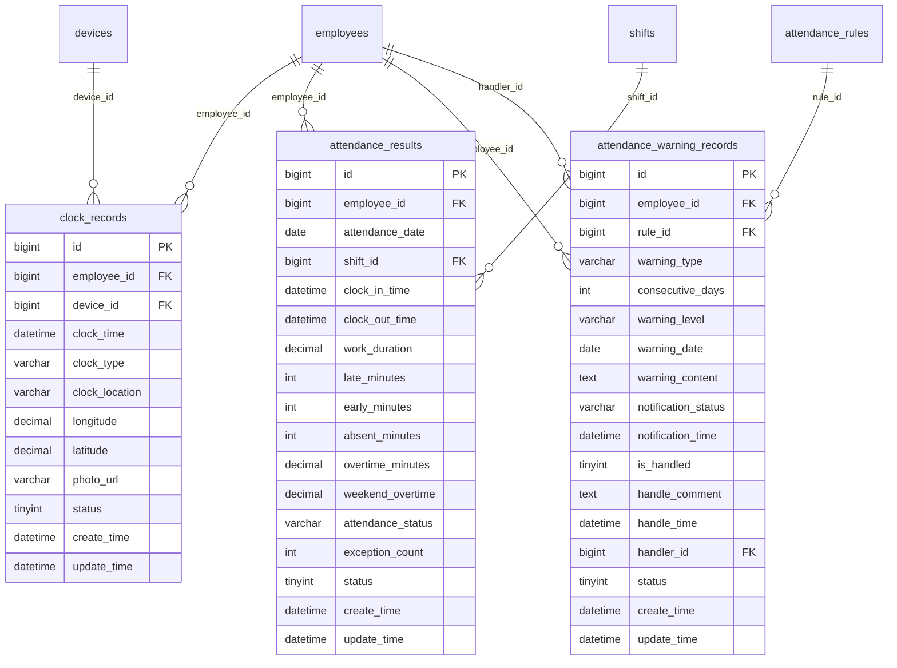

# 考勤数据采集与计算模块设计

## 模块概述
考勤数据采集与计算模块负责处理员工打卡数据的采集、验证、计算和存储，包括原始打卡记录管理、考勤结果计算、异常检测等功能，是考勤系统的核心数据处理模块。

## 涉及的核心数据表

### 1. clock_records（打卡记录表）
```sql
CREATE TABLE clock_records (
    bigint id PK "主键ID，自增长"
    bigint employee_id FK "员工ID，关联employees表"
    bigint device_id FK "设备ID，关联devices表"
    datetime clock_time "打卡时间，如：2024-01-15 09:00:00"
    varchar clock_type "打卡类型：上班/下班/外出/返回"
    varchar clock_location "打卡地点，如：一楼大厅"
    decimal longitude "经度坐标，用于GPS定位"
    decimal latitude "纬度坐标，用于GPS定位"
    varchar photo_url "打卡照片URL，用于验证和记录"
    tinyint status "状态：0-异常，1-正常"
    datetime create_time "创建时间，记录打卡记录创建时间"
    datetime update_time "更新时间，记录最后修改时间"
);
```

### 2. attendance_results（考勤计算结果表）
```sql
CREATE TABLE attendance_results (
    bigint id PK "主键ID，自增长"
    bigint employee_id FK "员工ID，关联employees表"
    date attendance_date "考勤日期，如：2024-01-15"
    bigint shift_id FK "班次ID，关联shifts表"
    datetime clock_in_time "上班打卡时间，如：09:00:00"
    datetime clock_out_time "下班打卡时间，如：18:00:00"
    decimal work_duration "工作时长(小时)，如：8.0小时"
    int late_minutes "迟到分钟数，如：15分钟"
    int early_minutes "早退分钟数，如：10分钟"
    int absent_minutes "旷工分钟数，如：480分钟"
    decimal overtime_minutes "加班分钟数，如：120.0分钟"
    decimal weekend_overtime "周末加班时长(小时)，如：4.0小时"
    varchar attendance_status "考勤状态：正常/迟到/早退/旷工/请假"
    int exception_count "异常次数，如：2次"
    tinyint status "状态：0-删除，1-正常"
    datetime create_time "创建时间，记录考勤结果创建时间"
    datetime update_time "更新时间，记录最后修改时间"
);
```

### 3. attendance_warning_records（考勤预警记录表）
```sql
CREATE TABLE attendance_warning_records (
    bigint id PK "主键ID，自增长"
    bigint employee_id FK "员工ID，关联employees表"
    bigint rule_id FK "考勤规则ID，关联attendance_rules表"
    varchar warning_type "预警类型：未打卡/考勤异常/频繁迟到"
    int consecutive_days "连续天数，如：3天"
    varchar warning_level "预警级别：high/medium/low"
    date warning_date "预警日期，如：2024-01-15"
    text warning_content "预警内容，详细说明预警原因"
    varchar notification_status "通知状态：0-未通知，1-已通知，2-通知失败"
    datetime notification_time "通知时间，记录通知发送时间"
    tinyint is_handled "是否已处理：0-未处理，1-已处理"
    text handle_comment "处理意见，处理人的处理说明"
    datetime handle_time "处理时间，记录处理完成时间"
    bigint handler_id FK "处理人ID，关联employees表"
    tinyint status "状态：0-删除，1-正常"
    datetime create_time "创建时间，记录预警创建时间"
    datetime update_time "更新时间，记录最后修改时间"
);
```

## 表之间的关联关系

### ER图关系


### 关联说明
1. **打卡记录关联**：打卡记录关联员工和设备信息
2. **考勤结果关联**：考勤结果关联员工和班次信息
3. **预警记录关联**：预警记录关联员工、规则和处理人信息

## 关键业务逻辑说明

### 1. 打卡数据采集逻辑
- **多渠道采集**：支持考勤机、移动端、门禁等多种打卡方式
- **实时验证**：打卡时实时验证位置、时间、权限等
- **数据校验**：验证打卡数据的有效性和完整性
- **异常处理**：处理打卡异常情况（重复打卡、时间异常等）

### 2. 考勤计算逻辑
- **时间匹配**：根据排班信息匹配打卡时间
- **时长计算**：精确计算工作时长、加班时长
- **异常判定**：根据规则判定迟到、早退、旷工等异常
- **状态汇总**：汇总当日考勤状态和异常次数

### 3. 异常检测逻辑
- **规则匹配**：根据预警规则检测异常模式
- **连续性分析**：分析连续异常情况
- **严重程度评估**：评估异常的严重程度和影响
- **自动处理**：支持异常的自动处理机制

### 4. 数据同步逻辑
- **实时同步**：打卡数据实时同步到计算引擎
- **批量计算**：定时批量计算考勤结果
- **增量更新**：支持增量数据更新和重新计算
- **数据一致性**：保证各类数据的一致性

## 数据流转过程

### 1. 打卡数据采集流程
```
员工发起打卡 -> 验证打卡权限 -> 获取位置信息 -> 拍照验证 -> 数据校验 -> 保存打卡记录 -> 触发实时计算
```

### 2. 考勤实时计算流程
```
接收打卡事件 -> 加载员工排班 -> 匹配打卡时间 -> 计算工作时长 -> 判定考勤状态 -> 生成考勤结果 -> 检测异常预警
```

### 3. 批量计算流程
```
启动批量任务 -> 获取待计算数据 -> 加载计算规则 -> 批量执行计算 -> 更新计算结果 -> 生成预警记录 -> 通知相关方
```

### 4. 异常检测流程
```
扫描考勤数据 -> 匹配预警规则 -> 计算异常指标 -> 生成预警记录 -> 确定预警级别 -> 执行通知动作 -> 跟踪处理状态
```

### 5. 数据修正流程
```
发现数据异常 -> 确定修正范围 -> 重新计算数据 -> 更新相关记录 -> 生成修正日志 -> 通知影响方
```

## 计算算法说明

### 1. 工作时长计算算法
```python
def calculate_work_duration(clock_in_time, clock_out_time, shift_config):
    """
    计算工作时长
    考虑弹性时间、核心时间、休息时间等因素
    """
    # 基础时长计算
    base_duration = clock_out_time - clock_in_time

    # 减去休息时间
    break_duration = calculate_break_duration(clock_in_time, clock_out_time, shift_config)

    # 弹性时间处理
    flexible_adjustment = calculate_flexible_adjustment(clock_in_time, clock_out_time, shift_config)

    # 最终工作时长
    work_duration = base_duration - break_duration + flexible_adjustment

    return max(work_duration, 0)
```

### 2. 迟到早退判定算法
```python
def determine_late_early(clock_time, schedule_time, tolerance):
    """
    判定迟到早退
    """
    if clock_time > schedule_time + tolerance:
        # 迟到
        late_minutes = (clock_time - schedule_time - tolerance).total_seconds() / 60
        return int(late_minutes), 0
    elif clock_time < schedule_time - tolerance:
        # 早退
        early_minutes = (schedule_time - tolerance - clock_time).total_seconds() / 60
        return 0, int(early_minutes)
    else:
        # 正常
        return 0, 0
```

### 3. 加班时间计算算法
```python
def calculate_overtime(work_duration, standard_hours, overtime_rules):
    """
    计算加班时间
    """
    if work_duration <= standard_hours:
        return 0

    overtime_hours = work_duration - standard_hours

    # 应用不同倍数
    if is_weekend():
        overtime_multiplier = overtime_rules.get('weekend_multiplier', 2.0)
    elif is_holiday():
        overtime_multiplier = overtime_rules.get('holiday_multiplier', 3.0)
    else:
        overtime_multiplier = 1.0

    return overtime_hours * overtime_multiplier
```

## 分表策略实现

### 1. 打卡记录分表
```sql
-- 按月分表的打卡记录表
clock_records_202401, clock_records_202402, clock_records_202403...

-- 分表路由规则
function getClockRecordTable(date) {
    const yearMonth = date.format('YYYYMM');
    return `clock_records_${yearMonth}`;
}
```

### 2. 考勤结果分表
```sql
-- 按月分表的考勤结果表
attendance_results_202401, attendance_results_202402, attendance_results_202403...

-- 分表查询优化
function getAttendanceResults(employeeId, startDate, endDate) {
    const tables = getTablesBetweenDates(startDate, endDate);
    const queries = tables.map(table =>
        `SELECT * FROM ${table} WHERE employee_id = ? AND attendance_date BETWEEN ? AND ?`
    );
    return executeUnionQuery(queries, [employeeId, startDate, endDate]);
}
```

## 模块间的接口依赖

### 1. 依赖其他模块
- **基础信息管理模块**：需要员工信息
- **排班管理模块**：需要排班信息进行匹配
- **考勤规则配置模块**：需要规则进行计算和判定
- **考勤设备区域管理模块**：需要设备和区域信息

### 2. 被其他模块依赖
- **考勤汇总报表模块**：需要计算结果进行统计
- **异常管理模块**：需要考勤数据作为申请依据
- **系统配置与通知模块**：需要预警记录发送通知

### 3. 核心接口定义

#### 打卡记录接口
```javascript
// 提交打卡记录
POST /api/clock-records
// 获取打卡记录
GET /api/clock-records?employee_id={id}&date_range={start,end}
// 修正打卡记录
PUT /api/clock-records/{id}/correct
// 批量导入打卡记录
POST /api/clock-records/import
// 获取打卡统计
GET /api/clock-records/statistics?employee_id={id}&period={period}
```

#### 考勤计算接口
```javascript
// 触发考勤计算
POST /api/attendance-calculation/trigger
// 批量重新计算
POST /api/attendance-calculation/recalculate
// 获取计算结果
GET /api/attendance-results?employee_id={id}&date_range={start,end}
// 修正考勤结果
PUT /api/attendance-results/{id}/correct
// 获取计算日志
GET /api/attendance-calculation/logs?task_id={id}
```

#### 预警管理接口
```javascript
// 获取预警记录
GET /api/attendance-warnings?employee_id={id}&warning_type={type}
// 手动处理预警
POST /api/attendance-warnings/{id}/handle
// 批量处理预警
POST /api/attendance-warnings/batch-handle
// 重新检测预警
POST /api/attendance-warnings/redetect
```

## 前端页面设计建议

### 1. 打卡管理页面
- **实时打卡**：移动端打卡界面
- **打卡记录**：展示员工打卡记录
- **打卡地图**：显示打卡位置信息
- **打卡统计**：打卡数据统计图表

### 2. 考勤计算页面
- **计算监控**：显示计算任务状态
- **结果查看**：查看考勤计算结果
- **异常修正**：修正计算异常数据
- **重新计算**：触发重新计算操作

### 3. 预警管理页面
- **预警列表**：显示各类预警记录
- **预警处理**：处理预警异常情况
- **预警统计**：预警数据统计分析
- **规则配置**：配置预警规则

## 开发优先级建议

### 1. 高优先级（核心功能）
- 打卡数据采集
- 基础考勤计算
- 简单异常检测
- 数据存储优化

### 2. 中优先级（增强功能）
- 复杂计算规则
- 预警系统
- 数据修正功能
- 批量处理

### 3. 低优先级（扩展功能）
- 高级分析功能
- 实时监控
- 性能优化
- 移动端优化

## 技术实现要点

### 1. 数据处理
- 大数据量处理优化
- 实时计算引擎
- 批量处理机制
- 数据一致性保证

### 2. 算法优化
- 计算算法优化
- 缓存策略
- 并发处理
- 容错机制

### 3. 存储优化
- 分表分库策略
- 索引优化
- 数据压缩
- 备份恢复

### 4. 性能监控
- 计算性能监控
- 数据质量监控
- 异常监控
- 系统健康检查