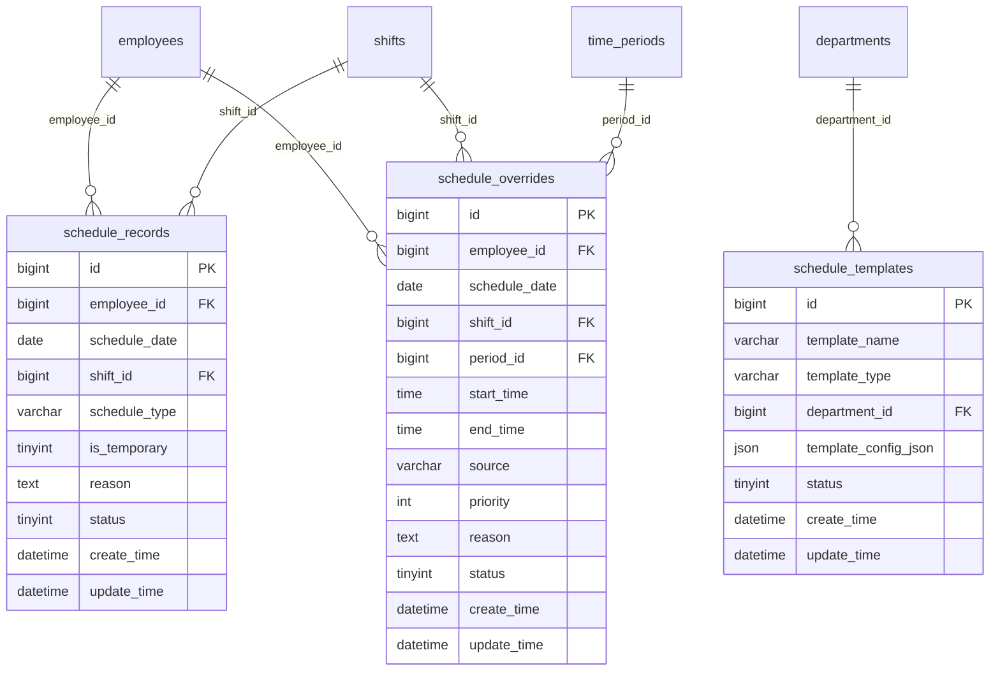

# 排班管理模块设计

## 模块概述
排班管理模块负责管理员工排班安排，包括正常排班、临时排班、排班模板和智能排班功能，支持多种排班策略和自动排班算法。

## 涉及的核心数据表

### 1. schedule_records（排班记录表）
```sql
CREATE TABLE schedule_records (
    bigint id PK "主键ID，自增长"
    bigint employee_id FK "员工ID，关联employees表"
    date schedule_date "排班日期，如：2024-01-15"
    bigint shift_id FK "班次ID，关联shifts表"
    varchar schedule_type "排班类型：正常排班/临时调班/加班排班"
    tinyint is_temporary "是否临时排班：0-正常，1-临时"
    text reason "排班原因，如：项目需要、人员调整"
    tinyint status "状态：0-取消，1-正常"
    datetime create_time "创建时间，记录排班创建时间"
    datetime update_time "更新时间，记录最后修改时间"
);
```

### 2. schedule_templates（排班模板表）
```sql
CREATE TABLE schedule_templates (
    bigint id PK "主键ID，自增长"
    varchar template_name "模板名称，如：技术部标准排班模板"
    varchar template_type "模板类型：部门模板/岗位模板/个人模板"
    bigint department_id FK "部门ID，关联departments表"
    json template_config_json "模板配置JSON，包含排班规则和周期"
    tinyint status "状态：0-禁用，1-启用"
    datetime create_time "创建时间，记录模板创建时间"
    datetime update_time "更新时间，记录最后修改时间"
);
```

### 3. schedule_overrides（临时排班覆盖表）
```sql
CREATE TABLE schedule_overrides (
    bigint id PK "主键ID，自增长"
    bigint employee_id FK "员工ID，关联employees表"
    date schedule_date "日期，如：2024-01-15"
    bigint shift_id FK "班次ID(可空)，用于整班覆盖"
    bigint period_id FK "时间段ID(可空)，关联time_periods表"
    time start_time "自定义开始时间(当不引用period时)"
    time end_time "自定义结束时间(当不引用period时)"
    varchar source "来源：manual/system/api"
    int priority "优先级(数值越大优先级越高)"
    text reason "原因，如：临时支援、临时会议"
    tinyint status "状态：0-取消，1-生效"
    datetime create_time "创建时间"
    datetime update_time "更新时间"
);
```

## 表之间的关联关系

### ER图关系


### 关联说明
1. **员工-排班关系**：员工与排班记录的一对多关系
2. **排班覆盖关系**：临时排班可覆盖正常排班，按优先级处理
3. **模板应用关系**：排班模板可批量应用到员工排班

## 关键业务逻辑说明

### 1. 正常排班逻辑
- **周期性排班**：基于班次配置的周期性排班安排
- **排班规则应用**：根据部门和岗位规则自动生成排班
- **排班冲突检测**：避免员工同一时间被安排多个班次
- **工作量均衡**：确保员工工作时长合理分配

### 2. 临时排班逻辑
- **优先级覆盖**：临时排班优先级高于正常排班
- **部分时段覆盖**：支持只覆盖班次的特定时间段
- **多种来源**：支持手动、系统、API等多种来源
- **实时生效**：临时排班变更实时生效

### 3. 排班模板逻辑
- **模板类型**：支持部门、岗位、个人三种模板类型
- **模板复用**：模板可多次应用到不同员工群体
- **模板版本**：支持模板的版本管理和历史追踪
- **模板继承**：支持模板之间的继承关系

### 4. 智能排班逻辑
- **算法优化**：基于遗传算法、模拟退火等优化算法
- **约束条件**：考虑员工技能、工作量、法律法规等约束
- **成本优化**：最小化人力成本，最大化工作效率
- **公平性**：确保排班分配的公平性和合理性

## JSON配置结构说明

### 1. template_config_json（模板配置）JSON结构
```json
{
  "template_name": "技术部标准排班模板",
  "cycle_type": "weekly",                    // 周期类型：daily/weekly/monthly
  "cycle_days": 7,                          // 周期天数
  "schedule_pattern": [                     // 排班模式
    {
      "day_of_week": 1,                     // 周几（1-7）
      "shift_id": 101,                      // 班次ID
      "required_employees": 5,              // 需要员工数
      "skill_requirements": ["开发", "测试"] // 技能要求
    },
    {
      "day_of_week": 2,
      "shift_id": 102,
      "required_employees": 3,
      "skill_requirements": ["运维"]
    }
  ],
  "rotation_rules": {                       // 轮班规则
    "auto_rotation": true,
    "rotation_frequency": "weekly",
    "fairness_factor": 0.8
  },
  "constraints": {                          // 约束条件
    "max_consecutive_days": 6,
    "min_rest_hours": 12,
    "weekend_balance": true,
    "holiday_preference": false
  },
  "applicable_employees": {                 // 适用员工
    "departments": [1, 2, 3],
    "positions": [10, 20],
    "exclude_employees": [1001, 1002]
  }
}
```

## 数据流转过程

### 1. 排班生成流程
```
选择排班周期 -> 确定适用员工 -> 应用排班规则 -> 生成排班记录 -> 冲突检测 -> 保存排班
```

### 2. 临时排班流程
```
选择员工日期 -> 设置覆盖内容 -> 指定优先级 -> 记录覆盖原因 -> 更新排班状态 -> 通知相关方
```

### 3. 模板应用流程
```
选择模板 -> 确定应用范围 -> 设置应用周期 -> 批量生成排班 -> 验证结果 -> 保存记录
```

### 4. 智能排班流程
```
设定优化目标 -> 配置约束条件 -> 选择优化算法 -> 执行排班计算 -> 评估结果 -> 调整参数 -> 生成最终排班
```

## 模块间的接口依赖

### 1. 依赖其他模块
- **基础信息管理模块**：需要员工和部门信息
- **班次时间管理模块**：需要班次和时间段配置

### 2. 被其他模块依赖
- **考勤数据采集模块**：需要排班信息进行打卡验证
- **考勤数据计算模块**：需要排班信息进行考勤计算
- **异常管理模块**：需要排班信息处理加班申请

### 3. 核心接口定义

#### 排班记录接口
```javascript
// 获取员工排班
GET /api/schedule-records?employee_id={id}&date_range={start,end}
// 创建排班记录
POST /api/schedule-records
// 批量创建排班
POST /api/schedule-records/batch
// 更新排班记录
PUT /api/schedule-records/{id}
// 删除排班记录
DELETE /api/schedule-records/{id}
// 获取排班日历
GET /api/schedule-calendar?department_id={id}&month={month}
```

#### 排班模板接口
```javascript
// 获取模板列表
GET /api/schedule-templates?type={type}
// 创建模板
POST /api/schedule-templates
// 更新模板
PUT /api/schedule-templates/{id}
// 应用模板
POST /api/schedule-templates/{id}/apply
// 复制模板
POST /api/schedule-templates/{id}/copy
```

#### 临时排班接口
```javascript
// 获取临时排班
GET /api/schedule-overrides?employee_id={id}&date={date}
// 创建临时排班
POST /api/schedule-overrides
// 批量创建临时排班
POST /api/schedule-overrides/batch
// 更新临时排班
PUT /api/schedule-overrides/{id}
// 删除临时排班
DELETE /api/schedule-overrides/{id}
```

#### 智能排班接口
```javascript
// 启动智能排班
POST /api/smart-scheduling/start
// 获取排班方案
GET /api/smart-scheduling/solutions/{task_id}
// 确认排班方案
POST /api/smart-scheduling/confirm/{task_id}
// 获取排班统计
GET /api/scheduling-statistics?department_id={id}&period={period}
```

## 前端页面设计建议

### 1. 排班日历页面
- **月历视图**：日历形式展示整月排班情况
- **员工视图**：按员工展示排班时间线
- **班次视图**：按班次展示人员安排

### 2. 排班编辑页面
- **拖拽排班**：拖拽方式进行排班调整
- **批量操作**：支持批量排班操作
- **冲突提示**：实时显示排班冲突

### 3. 模板管理页面
- **模板列表**：展示可用排班模板
- **模板配置**：可视化模板配置界面
- **模板预览**：预览模板应用效果

### 4. 智能排班页面
- **参数配置**：配置排班优化参数
- **结果展示**：展示智能排班结果
- **方案对比**：对比不同排班方案

## 开发优先级建议

### 1. 高优先级（核心功能）
- 基础排班管理
- 排班日历展示
- 临时排班功能
- 排班冲突检测

### 2. 中优先级（增强功能）
- 排班模板管理
- 批量排班操作
- 排班统计分析
- 数据导入导出

### 3. 低优先级（扩展功能）
- 智能排班算法
- 高级约束配置
- 排班优化建议
- 移动端支持

## 技术实现要点

### 1. 排班算法
- 轮班算法实现
- 冲突检测算法
- 工作量均衡算法
- 排班优化算法

### 2. 性能优化
- 排班数据缓存
- 日历渲染优化
- 批量操作优化
- 查询性能优化

### 3. 数据一致性
- 排班状态同步
- 并发操作控制
- 数据完整性保证
- 事务处理机制

### 4. 扩展性设计
- 排班规则可配置
- 算法插件化
- 模板可扩展
- 接口标准化