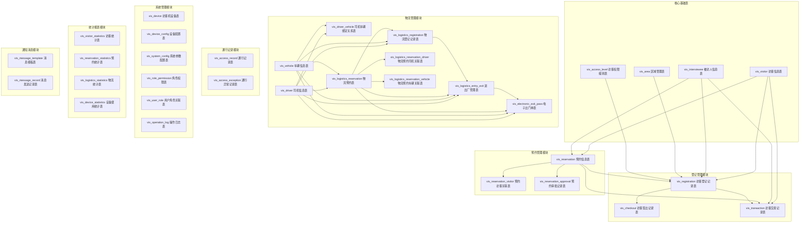

# 访客管理系统数据库设计文档

## 数据库概述

本文档基于访客管理系统完整功能设计，设计了完整的数据库架构，支持访客管理、预约管理、登记管理、物流管理、通行记录和系统管理等六大核心业务模块。

### 数据库基本信息
- **数据库名称**: zkbiosecurity_vis
- **数据库版本**: 3.11.1-RELEASE
- **字符集**: utf8mb4
- **存储引擎**: InnoDB
- **创建时间**: 2025-01-27

## 数据库架构图



## 表结构详细设计

### 1. 核心基础表

#### 1.1 vis_visitor (访客信息表)

**表说明**: 存储访客的基本信息、访问历史和状态管理

| 字段名 | 数据类型 | 主键 | 非空 | 唯一 | 默认值 | 说明 |
|--------|----------|------|------|------|--------|------|
| id | BIGINT | ✔ | ✔ | | AUTO_INCREMENT | 访客ID |
| visitor_code | VARCHAR(50) | | ✔ | ✔ | | 访客编号 |
| name | VARCHAR(100) | | ✔ | | | 姓名 |
| gender | TINYINT | | | | 1 | 性别(1:男 2:女) |
| id_card | VARCHAR(50) | | ✔ | ✔ | | 证件号 |
| phone | VARCHAR(20) | | | | | 手机号 |
| email | VARCHAR(100) | | | | | 邮箱 |
| company_name | VARCHAR(200) | | | | | 公司名称 |
| photo_url | VARCHAR(500) | | | | | 照片URL |
| visitor_level | VARCHAR(20) | | | | NORMAL | 访客等级 |
| blacklisted | TINYINT | | | | 0 | 是否黑名单 |
| blacklist_reason | TEXT | | | | | 黑名单原因 |
| blacklist_time | DATETIME | | | | | 加入黑名单时间 |
| blacklist_operator | VARCHAR(100) | | | | | 操作人 |
| last_visit_time | DATETIME | | | | | 最后访问时间 |
| access_level | BIGINT |      | | | | 访客权限ID |
| create_time | DATETIME | | | | CURRENT_TIMESTAMP | 创建时间 |
| update_time | DATETIME | | | | CURRENT_TIMESTAMP ON UPDATE | 更新时间 |
| remark | TEXT | | | | | 备注 |

**索引**:

- PRIMARY KEY (id)
- UNIQUE KEY uk_visitor_code (visitor_code)
- UNIQUE KEY uk_id_card (id_card)
- INDEX idx_phone (phone)
- INDEX idx_company (company_name)
- INDEX idx_blacklist (blacklisted)
- INDEX idx_visitor_level (visitor_level)
- INDEX idx_create_time (create_time)

#### 1.2 vis_interviewee (被访人信息表,功能是否启用可配置)

**表说明**: 存储公司内部员工信息，作为访客的被访对象

| 字段名 | 数据类型 | 主键 | 非空 | 唯一 | 默认值 | 说明 |
|--------|----------|------|------|------|--------|------|
| id | BIGINT | ✔ | ✔ | ✔ | AUTO_INCREMENT | 被访人ID |
| employee_id | VARCHAR(50) | | ✔ | ✔ | | 员工id |
| area_id | BIGINT | | | | | 所属区域ID |
| create_time | DATETIME | | | | CURRENT_TIMESTAMP | 创建时间 |
| update_time | DATETIME | | | | CURRENT_TIMESTAMP ON UPDATE | 更新时间 |

**外键**:
- (area_id) REFERENCES vis_area(id)

**索引**:
- PRIMARY KEY (id)
- UNIQUE KEY uk_employee_code (employee_code)
- INDEX idx_area_id (area_id)
- INDEX idx_status (status)

#### 1.3 vis_area (区域管理表)

**表说明**: 管理公司各个区域信息，支持层级结构和地图配置

| 字段名 | 数据类型 | 主键 | 非空 | 唯一 | 默认值 | 说明 |
|--------|----------|------|------|------|--------|------|
| id | BIGINT | ✔ | ✔ | | AUTO_INCREMENT | 区域ID |
| area_code | VARCHAR(50) | | ✔ | ✔ | | 区域编码 |
| area_name | VARCHAR(200) | | ✔ | | | 区域名称 |
| parent_area_id | BIGINT | | | | | 父区域ID |
| area_type | VARCHAR(50) | | | | | 区域类型 |
| building | VARCHAR(100) | | | | | 楼栋 |
| floor | VARCHAR(20) | | | | | 楼层 |
| capacity | INT | | | | | 容纳人数 |
| manager_name | VARCHAR(100) | | | | | 负责人 |
| manager_phone | VARCHAR(20) | | | | | 负责人电话 |
| description | TEXT | | | | | 区域描述 |
| map_file_url | VARCHAR(500) | | | | | 地图文件URL |
| access_level | VARCHAR(20) | | | | NORMAL | 访问权限级别 |
| status | TINYINT | | | | 1 | 状态(1:启用 0:禁用) |
| create_time | DATETIME | | | | CURRENT_TIMESTAMP | 创建时间 |
| update_time | DATETIME | | | | CURRENT_TIMESTAMP ON UPDATE | 更新时间 |

**外键**:
- (parent_area_id) REFERENCES vis_area(id)

**索引**:
- PRIMARY KEY (id)
- UNIQUE KEY uk_area_code (area_code)
- INDEX idx_parent_area (parent_area_id)
- INDEX idx_area_type (area_type)
- INDEX idx_building (building)
- INDEX idx_status (status)

#### 1.4 vis_access_level (访客权限级别表)

**表说明**: 定义不同类型访客的访问权限和时间限制

| 字段名 | 数据类型 | 主键 | 非空 | 唯一 | 默认值 | 说明 |
|--------|----------|------|------|------|--------|------|
| id | BIGINT | ✔ | ✔ | | AUTO_INCREMENT | 权限级别ID |
| level_code | VARCHAR(50) | | ✔ | ✔ | | 权限级别编码 |
| level_name | VARCHAR(100) | | ✔ | | | 权限级别名称 |
| level_type | VARCHAR(50) | | | | | 权限类型 |
| access_areas | TEXT | | | | | 可访问区域(区域ID列表) |
| time_limit_start | TIME | | | | | 时间限制开始 |
| time_limit_end | TIME | | | | | 时间限制结束 |
| weekday_access | TINYINT | | | | 1 | 工作日访问权限 |
| weekend_access | TINYINT | | | | 0 | 周末访问权限 |
| holiday_access | TINYINT | | | | 0 | 节假日访问权限 |
| require_escort | TINYINT | | | | 1 | 是否需要陪同 |
| special_permissions | TEXT | | | | | 特殊权限(JSON格式) |
| description | TEXT | | | | | 权限描述 |
| color_code | VARCHAR(20) | | | | | 显示颜色 |
| icon | VARCHAR(50) | | | | | 图标 |
| status | TINYINT | | | | 1 | 状态(1:启用 0:禁用) |
| create_time | DATETIME | | | | CURRENT_TIMESTAMP | 创建时间 |
| update_time | DATETIME | | | | CURRENT_TIMESTAMP ON UPDATE | 更新时间 |

**索引**:
- PRIMARY KEY (id)
- UNIQUE KEY uk_level_code (level_code)
- INDEX idx_level_type (level_type)
- INDEX idx_status (status)

### 2. 预约管理模块表

#### 2.1 vis_reservation (预约信息表)

**表说明**: 核心预约信息表，存储访客预约的详细信息

| 字段名 | 数据类型 | 主键 | 非空 | 唯一 | 默认值 | 说明 |
|--------|----------|------|------|------|--------|------|
| id | BIGINT | ✔ | ✔ | | AUTO_INCREMENT | 预约ID |
| visitor_name | VARCHAR(100) | | ✔ | | | 访客姓名 |
| id_card | VARCHAR(50) | | ✔ | ✔ | | 证件号 |
| interviewee_name | VARCHAR(50) | | ✔ | | | 被访人姓名 |
| purpose_detail | TEXT | | | | | 访问事由详细说明 |
| visit_date | DATE | | ✔ | | | 访问日期 |
| start_time | TIME | | ✔ | | | 开始时间 |
| end_time | TIME | | ✔ | | | 结束时间 |
| visit_area_id | BIGINT | | | | | 访问区域ID |
| visitor_count | INT | | | | 1 | 访客人数 |
| main_reservation_id | BIGINT | | | |  | 主访人id |
| car_number | VARCHAR(50) | | | |  | 车牌号 |
| status | VARCHAR(20) | | | | PENDING | 预约状态 |
| approve_user | VARCHAR(100) | | | | | 审批人 |
| approve_time | DATETIME | | | | | 审批时间 |
| approve_remark | TEXT | | | | | 审批意见 |
| reject_reason | TEXT | | | | | 拒绝原因 |
| create_time | DATETIME | | | | CURRENT_TIMESTAMP | 创建时间 |
| update_time | DATETIME | | | | CURRENT_TIMESTAMP ON UPDATE | 更新时间 |

**外键**:
-  (visitor_id) REFERENCES vis_visitor(id)
-  (interviewee_id) REFERENCES vis_interviewee(id)
-  (visit_area_id) REFERENCES vis_area(id)

**索引**:
- PRIMARY KEY (id)
- UNIQUE KEY uk_reservation_code (reservation_code)
- INDEX idx_visitor_id (visitor_id)
- INDEX idx_interviewee_id (interviewee_id)
- INDEX idx_visit_date (visit_date)
- INDEX idx_status (status)
- INDEX idx_approve_user (approve_user)
- INDEX idx_create_time (create_time)

### 3. 登记管理模块表

#### 3.1 vis_registration (访客登记记录表)

**表说明**: 存储访客登记的核心信息，是访客进入系统的关键记录

| 字段名 | 数据类型 | 主键 | 非空 | 唯一 | 默认值 | 说明 |
|--------|----------|------|------|------|--------|------|
| id | BIGINT | ✔ | ✔ | | AUTO_INCREMENT | 登记ID |
| visitor_name        | VARCHAR(100) |      | ✔    |      |                             | 访客姓名             |
| id_card             | VARCHAR(50)  |      | ✔    | ✔    |                             | 证件号               |
| interviewee_name    | VARCHAR(50)  |      | ✔    |      |                             | 被访人姓名           |
| visitor_card | VARCHAR(50) | | | |  | 访客卡号 |
| access_level_id | BIGINT | | | | | 访问权限级别ID |
| access_areas | TEXT | | | | | 访问区域(区域ID列表) |
| actual_leave_time | DATETIME | | | | | 实际离开时间 |
| registration_device | VARCHAR(100) | | | | | 登记设备 |
| check_in_photo_url | VARCHAR(500) | | | | | 签入照片URL |
| check_out_photo_url | VARCHAR(500) | | | | | 签出照片URL |
| status | VARCHAR(20) | | | | ACTIVE | 状态 |
| create_time | DATETIME | | | | CURRENT_TIMESTAMP | 登记时间 |
| update_time | DATETIME | | | | CURRENT_TIMESTAMP ON UPDATE | 更新时间 |

**外键**:
-  (reservation_id) REFERENCES vis_reservation(id)
-  (visitor_id) REFERENCES vis_visitor(id)
-  (interviewee_id) REFERENCES vis_interviewee(id)
-  (access_level_id) REFERENCES vis_access_level(id)

**索引**:

- PRIMARY KEY (id)
- UNIQUE KEY uk_registration_code (registration_code)
- INDEX idx_reservation_id (reservation_id)
- INDEX idx_visitor_id (visitor_id)
- INDEX idx_interviewee_id (interviewee_id)
- INDEX idx_status (status)
- INDEX idx_registration_time (create_time)
- INDEX idx_expected_leave_time (expected_leave_time)
- INDEX idx_visitor_card (visitor_card_number)

### 4. 物流管理模块表

#### 4.1 vis_logistics_reservation (物流预约表)

**表说明**: 存储物流预约的核心信息，支持司机车辆预约、货物预约等多种物流预约类型

| 字段名 | 数据类型 | 主键 | 非空 | 唯一 | 默认值 | 说明 |
|--------|----------|------|------|------|--------|------|
| id | BIGINT | ✔ | ✔ | | AUTO_INCREMENT | 预约ID |
| reservation_code | VARCHAR(50) | | ✔ | ✔ | | 预约编号 |
| driver_name | VARCHAR(50) | | ✔ |  | | 司机姓名 |
| id_card | VARCHAR(18) | | ✔ |  | | 证件号 |
| plate_number | VARCHAR(20) | | ✔ |  | | 车牌号 |
| transport_company | VARCHAR(200) | | ✔ | | | 运输公司名称 |
| contact_person | VARCHAR(100) | | ✔ | | | 联系人 |
| contact_phone | VARCHAR(20) | | ✔ | | | 联系电话 |
| reservation_type | VARCHAR(50) | | | | DELIVERY | 预约类型(DELIVERY:送货 PICKUP:提货 TRANSFER:转运) |
| goods_type | VARCHAR(100) | | ✔ | | | 货物类型 |
| goods_description | TEXT | | | | | 货物详细描述 |
| goods_weight | DECIMAL(10,2) | | | | | 货物重量(吨) |
| goods_volume | DECIMAL(10,2) | | | | | 货物体积(立方米) |
| goods_quantity | INT | | | | | 货物数量 |
| package_count | INT | | | | | 包装数量 |
| special_requirements | TEXT | | | | | 特殊要求(危险品、温控等) |
| operation_type | VARCHAR(50) | | | | LOADING | 作业类型(LOADING:装载 UNLOADING:卸载 BOTH:装卸) |
| operation_area_id | BIGINT | | ✔ | | | 作业区域ID |
| warehouse_location | VARCHAR(200) | | | | | 仓库位置 |
| expected_arrive_date | DATE | | ✔ | | | 预计到达日期 |
| expected_arrive_time_start | TIME | | ✔ | | | 预计到达开始时间 |
| expected_arrive_time_end | TIME | | ✔ | | | 预计到达结束时间 |
| estimated_operation_duration | INT | | | | | 预计作业时长(分钟) |
| interviewee_id | BIGINT | | ✔ | | | 被访人/接货人ID |
| purpose_detail | TEXT | | | | | 访问事由详细说明 |
| remarks | TEXT | | | | | 备注 |
| status | VARCHAR(20) | | | | PENDING | 预约状态 |
| approve_user | VARCHAR(100) | | | | | 审批人 |
| approve_time | DATETIME | | | | | 审批时间 |
| approve_remark | TEXT | | | | | 审批意见 |
| reject_reason | TEXT | | | | | 拒绝原因 |
| create_user | VARCHAR(100) | | | | | 创建人 |
| create_time | DATETIME | | | | CURRENT_TIMESTAMP | 创建时间 |
| update_time | DATETIME | | | | CURRENT_TIMESTAMP ON UPDATE | 更新时间 |

**外键**:

-  (operation_area_id) REFERENCES vis_area(id)
-  (interviewee_id) REFERENCES vis_interviewee(id)

**索引**:
- PRIMARY KEY (id)
- UNIQUE KEY uk_reservation_code (reservation_code)
- INDEX idx_transport_company (transport_company)
- INDEX idx_contact_phone (contact_phone)
- INDEX idx_expected_arrive_date (expected_arrive_date)
- INDEX idx_status (status)
- INDEX idx_approve_user (approve_user)
- INDEX idx_create_time (create_time)
- INDEX idx_interviewee_id (interviewee_id)

#### 4.2 vis_logistics_registration (物流登记记录表)

**表说明**: 存储物流车辆/司机的登记记录，记录实际进出厂信息

| 字段名 | 数据类型 | 主键 | 非空 | 唯一 | 默认值 | 说明 |
|--------|----------|------|------|------|--------|------|
| id | BIGINT | ✔ | ✔ | | AUTO_INCREMENT | 登记ID |
| registration_code | VARCHAR(50) | | ✔ | ✔ | | 登记编号 |
| reservation_id | BIGINT | | | | | 关联预约ID |
| driver_name           | VARCHAR(50)   |      | ✔    |      |                             | 司机姓名               |
| id_card               | VARCHAR(18)   |      | ✔    |      |                             | 证件号                 |
| plate_number | VARCHAR(20) | | ✔ | | | 车牌号 |
| registration_type | VARCHAR(50) | | | | NORMAL | 登记类型 |
| operation_area_id | BIGINT | | | | | 实际作业区域ID |
| warehouse_operator | VARCHAR(100) | | | | | 仓库操作员 |
| goods_verify_status | VARCHAR(20) | | | | PENDING | 货物验证状态 |
| actual_goods_info | TEXT | | | | | 实际货物信息(JSON格式) |
| weight_verify_result | VARCHAR(20) | | | | | 重量验证结果 |
| actual_weight | DECIMAL(10,2) | | | | | 实际重量 |
| package_verify_result | VARCHAR(20) | | | | | 包装验证结果 |
| actual_package_count | INT | | | | | 实际包装数量 |
| security_check_status | VARCHAR(20) | | | | PENDING | 安全检查状态 |
| security_check_items | TEXT | | | | | 安全检查项目(JSON格式) |
| security_check_user | VARCHAR(100) | | | | | 安全检查人 |
| escort_required | TINYINT | | | | 0 | 是否需要陪同 |
| escort_user | VARCHAR(100) | | | | | 陪同人 |
| registration_device | VARCHAR(100) | | | | | 登记设备 |
| driver_photo_url | VARCHAR(500) | | | | | 司机照片URL |
| vehicle_photo_urls | TEXT | | | | | 车辆照片URL(JSON格式) |
| goods_photo_urls | TEXT | | | | | 货物照片URL(JSON格式) |
| document_photo_urls | TEXT | | | | | 证件照片URL(JSON格式) |
| actual_arrive_time | DATETIME | | | | | 实际到达时间 |
| actual_depart_time | DATETIME | | | | | 实际离开时间 |
| operation_start_time | DATETIME | | | | | 作业开始时间 |
| operation_end_time | DATETIME | | | | | 作业结束时间 |
| status | VARCHAR(20) | | | | ACTIVE | 状态 |
| remarks | TEXT | | | | | 备注 |
| create_time | DATETIME | | | | CURRENT_TIMESTAMP | 登记时间 |
| update_time | DATETIME | | | | CURRENT_TIMESTAMP ON UPDATE | 更新时间 |

**外键**:

-  (reservation_id) REFERENCES vis_logistics_reservation(id)
-  (driver_id) REFERENCES vis_driver(id)
-  (vehicle_id) REFERENCES vis_vehicle(id)
-  (operation_area_id) REFERENCES vis_area(id)

**索引**:
- PRIMARY KEY (id)
- UNIQUE KEY uk_registration_code (registration_code)
- INDEX idx_reservation_id (reservation_id)
- INDEX idx_driver_id (driver_id)
- INDEX idx_vehicle_id (vehicle_id)
- INDEX idx_status (status)
- INDEX idx_registration_time (create_time)
- INDEX idx_actual_arrive_time (actual_arrive_time)
- INDEX idx_security_check_status (security_check_status)

#### 4.5 vis_driver (司机信息表)

**表说明**: 存储物流司机的基本信息和资质

| 字段名 | 数据类型 | 主键 | 非空 | 唯一 | 默认值 | 说明 |
|--------|----------|------|------|------|--------|------|
| id | BIGINT | ✔ | ✔ | | AUTO_INCREMENT | 司机ID |
| driver_code | VARCHAR(50) | | ✔ | ✔ | | 司机编号 |
| name | VARCHAR(100) | | ✔ | | | 姓名 |
| gender | TINYINT | | | | 1 | 性别(1:男 2:女) |
| id_card | VARCHAR(18) | | ✔ | ✔ | | 证件号 |
| phone | VARCHAR(20) | | ✔ | | | 手机号 |
| driver_license | VARCHAR(50) | | ✔ | | | 驾驶证号 |
| license_type | VARCHAR(20) | | | | | 驾照类型 |
| license_expire_date | DATE | | | | | 驾照有效期 |
| transport_company | VARCHAR(200) | | | | | 运输公司 |
| company_address | TEXT | | | | | 公司地址 |
| emergency_contact | VARCHAR(100) | | | | | 紧急联系人 |
| emergency_phone | VARCHAR(20) | | | | | 紧急联系电话 |
| photo_url | VARCHAR(500) | | | | | 照片URL |
| driver_status | VARCHAR(20) | | | | ACTIVE | 司机状态 |
| blacklist_reason | TEXT | | | | | 黑名单原因 |
| total_trips | INT | | | | 0 | 总运输次数 |
| last_trip_time | DATETIME | | | | | 最后运输时间 |
| create_time | DATETIME | | | | CURRENT_TIMESTAMP | 创建时间 |
| update_time | DATETIME | | | | CURRENT_TIMESTAMP ON UPDATE | 更新时间 |

**索引**:
- PRIMARY KEY (id)
- UNIQUE KEY uk_driver_code (driver_code)
- UNIQUE KEY uk_id_card (id_card)
- INDEX idx_phone (phone)
- INDEX idx_driver_license (driver_license)
- INDEX idx_transport_company (transport_company)
- INDEX idx_driver_status (driver_status)

#### 4.2 vis_vehicle (车辆信息表)

**表说明**: 存储物流车辆的详细信息和证件

| 字段名 | 数据类型 | 主键 | 非空 | 唯一 | 默认值 | 说明 |
|--------|----------|------|------|------|--------|------|
| id | BIGINT | ✔ | ✔ | | AUTO_INCREMENT | 车辆ID |
| plate_number | VARCHAR(20) | | ✔ | ✔ | | 车牌号 |
| vehicle_type | VARCHAR(50) | | ✔ | | | 车辆类型 |
| brand_model | VARCHAR(100) | | | | | 品牌型号 |
| vehicle_color | VARCHAR(20) | | | | | 车辆颜色 |
| load_capacity | DECIMAL(10,2) | | | | | 核载重量(吨) |
| seat_capacity | INT | | | | | 核载人数 |
| vehicle_length | DECIMAL(8,2) | | | | | 车长(米) |
| vehicle_width | DECIMAL(8,2) | | | | | 车宽(米) |
| vehicle_height | DECIMAL(8,2) | | | | | 车高(米) |
| registration_number | VARCHAR(50) | | | | | 行驶证号 |
| registration_date | DATE | | | | | 注册日期 |
| inspection_expire_date | DATE | | | | | 年检有效期 |
| insurance_expire_date | DATE | | | | | 保险有效期 |
| transport_permit | VARCHAR(50) | | | | | 运输许可证号 |
| permit_expire_date | DATE | | | | | 许可证有效期 |
| vehicle_status | VARCHAR(20) | | | | ACTIVE | 车辆状态 |
| current_driver_id | BIGINT | | | | | 当前司机ID |
| vehicle_photos | TEXT | | | | | 车辆照片URL(JSON格式) |
| create_time | DATETIME | | | | CURRENT_TIMESTAMP | 创建时间 |
| update_time | DATETIME | | | | CURRENT_TIMESTAMP ON UPDATE | 更新时间 |

**外键**:

- (current_driver_id) REFERENCES vis_driver(id)

**索引**:
- PRIMARY KEY (id)
- UNIQUE KEY uk_vehicle_code (vehicle_code)
- UNIQUE KEY uk_plate_number (plate_number)
- INDEX idx_vehicle_type (vehicle_type)
- INDEX idx_registration_number (registration_number)
- INDEX idx_vehicle_status (vehicle_status)
- INDEX idx_current_driver (current_driver_id)

#### 4.3 vis_electronic_exit_pass (电子出门单表)

**表说明**: 核心的电子出门单管理，支持被访人确认和保安检查流程

| 字段名 | 数据类型 | 主键 | 非空 | 唯一 | 默认值 | 说明 |
|--------|----------|------|------|------|--------|------|
| id | BIGINT | ✔ | ✔ | | AUTO_INCREMENT | 出门单ID |
| pass_code | VARCHAR(50) | | ✔ | ✔ | | 出门单编号 |
| vis_logistics_registration_code | VARCHAR(50) | | ✔ | | | 物流登记编号 |
| driver_name                     | VARCHAR(50)  |      | ✔    |      |                             | 司机姓名                  |
| id_card                         | VARCHAR(18)  |      | ✔    |      |                             | 证件号                    |
| plate_number                    | VARCHAR(20)  |      | ✔    |      |                             | 车牌号                    |
| operation_complete_time | DATETIME | | | | | 作业完成时间 |
| goods_info | TEXT | | | | | 货物信息(JSON格式) |
| load_status | VARCHAR(20) | | | | | 装载状态 |
| weight_info | TEXT | | | | | 重量信息(JSON格式) |
| warehouse_operator | VARCHAR(100) | | | | | 仓库操作员 |
| operation_photos | TEXT | | | | | 作业照片URL(JSON格式) |
| interviewee_confirm_user | VARCHAR(100) | | | | | 被访人确认人 |
| interviewee_confirm_time | DATETIME | | | | | 被访人确认时间 |
| interviewee_signature | VARCHAR(500) | | | | | 被访人电子签名 |
| confirm_remarks | TEXT | | | | | 确认备注 |
| guard_check_user | VARCHAR(100) | | | | | 保安检查人 |
| guard_check_time | DATETIME | | | | | 保安检查时间 |
| guard_check_result | VARCHAR(20) | | | | | 保安检查结果 |
| guard_photos | TEXT | | | | | 保安检查照片URL(JSON格式) |
| pass_status | VARCHAR(20) | | | | PENDING | 出门单状态 |
| release_time | DATETIME | | | | | 放行时间 |
| create_time | DATETIME | | | | CURRENT_TIMESTAMP | 创建时间 |
| update_time | DATETIME | | | | CURRENT_TIMESTAMP ON UPDATE | 更新时间 |

**外键**:
-  (logistics_reservation_id) REFERENCES vis_logistics_reservation(id)
-  (driver_id) REFERENCES vis_driver(id)
- (vehicle_id) REFERENCES vis_vehicle(id)

**索引**:
- PRIMARY KEY (id)
- UNIQUE KEY uk_pass_code (pass_code)
- INDEX idx_logistics_reservation (logistics_reservation_id)
- INDEX idx_driver_id (driver_id)
- INDEX idx_vehicle_id (vehicle_id)
- INDEX idx_pass_status (pass_status)
- INDEX idx_interviewee_confirm_time (interviewee_confirm_time)
- INDEX idx_guard_check_time (guard_check_time)
- INDEX idx_release_time (release_time)

### 5. 系统管理模块表

#### 5.1 vis_device (访客机设备表)

**表说明**: 管理系统中所有访客机设备的信息和状态

| 字段名 | 数据类型 | 主键 | 非空 | 唯一 | 默认值 | 说明 |
|--------|----------|------|------|------|--------|------|
| id | BIGINT | ✔ | ✔ | | AUTO_INCREMENT | 设备ID |
| serial_number | VARCHAR(50) | | ✔ | ✔ | | 序列号 |
| device_name | VARCHAR(200) | | ✔ | | | 设备名称 |
| device_model | VARCHAR(100) | | | | | 设备型号 |
| area_id | BIGINT | | | | | 所在区域ID |
| location_description | VARCHAR(500) | | | | | 位置描述 |
| ip_address | VARCHAR(50) | | | | | IP地址 |
| mac_address | VARCHAR(50) | | | | | MAC地址 |
| warranty_expire_date | DATE | | | | | 保修期到期日 |
| responsible_person | VARCHAR(100) | | | | | 负责人 |
| contact_phone | VARCHAR(20) | | | | | 联系电话 |
| create_time | DATETIME | | | | CURRENT_TIMESTAMP | 创建时间 |
| update_time | DATETIME | | | | CURRENT_TIMESTAMP ON UPDATE | 更新时间 |

**外键**:
- (area_id) REFERENCES vis_area(id)

**索引**:
- PRIMARY KEY (id)
- UNIQUE KEY uk_device_code (device_code)
- INDEX idx_device_type (device_type)
- INDEX idx_area_id (area_id)
- INDEX idx_ip_address (ip_address)
- INDEX idx_status (status)
- INDEX idx_device_group (device_group)
- INDEX idx_last_heartbeat (last_heartbeat_time)

## 数据库视图

### 1. v_current_logistics (当前在场物流车辆视图)

**视图说明**: 显示当前所有在场作业的物流车辆和司机信息，包括作业时长

```sql
CREATE VIEW v_current_logistics AS
SELECT
    lr.registration_id,
    lr.registration_code,
    d.name as driver_name,
    d.phone as driver_phone,
    v.plate_number,
    v.vehicle_type,
    lr.transport_company,
    lr.goods_type,
    lr.operation_area_id,
    a.area_name as operation_area_name,
    lr.warehouse_operator,
    lr.operation_start_time,
    TIMESTAMPDIFF(MINUTE, lr.operation_start_time, NOW()) as operation_minutes,
    lr.security_check_status,
    lr.goods_verify_status,
    lr.status
FROM vis_logistics_registration lr
INNER JOIN vis_driver d ON lr.driver_id = d.id
INNER JOIN vis_vehicle v ON lr.vehicle_id = v.id
LEFT JOIN vis_area a ON lr.operation_area_id = a.id
WHERE lr.status = 'ACTIVE';
```

### 2. v_current_visitors (当前在场访客视图)

**视图说明**: 显示当前所有在场的访客信息，包括停留时长

```sql
CREATE VIEW v_current_visitors AS
SELECT
    r.registration_id,
    r.registration_code,
    v.name as visitor_name,
    v.phone as visitor_phone,
    v.company_name,
    i.name as interviewee_name,
    i.department,
    a.area_name,
    r.check_in_photo_url,
    r.create_time as check_in_time,
    r.expected_leave_time,
    TIMESTAMPDIFF(MINUTE, r.create_time, NOW()) as stay_minutes
FROM vis_registration r
INNER JOIN vis_visitor v ON r.visitor_id = v.visitor_id
INNER JOIN vis_interviewee i ON r.interviewee_id = i.interviewee_id
LEFT JOIN vis_area a ON r.access_areas LIKE CONCAT('%"', a.area_id, '"%')
WHERE r.status = 'ACTIVE' AND r.expected_leave_time > NOW();
```

### 3. v_logistics_reservation_status (物流预约实时状态视图)

**视图说明**: 显示物流预约的实时状态，包括预约信息和登记状态

```sql
CREATE VIEW v_logistics_reservation_status AS
SELECT
    lres.id as reservation_id,
    lres.reservation_code,
    lres.transport_company,
    lres.contact_person,
    lres.contact_phone,
    lres.reservation_type,
    lres.goods_type,
    lres.expected_arrive_date,
    lres.expected_arrive_time_start,
    lres.expected_arrive_time_end,
    lres.status as reservation_status,
    i.name as interviewee_name,
    a.area_name as operation_area_name,
    lreg.registration_code,
    lreg.status as registration_status,
    lreg.actual_arrive_time,
    lreg.operation_start_time,
    lreg.operation_end_time,
    lreg.actual_depart_time,
    lreg.security_check_status,
    lreg.goods_verify_status,
    ep.pass_status,
    ep.interviewee_confirm_time,
    ep.guard_check_time
FROM vis_logistics_reservation lres
LEFT JOIN vis_interviewee i ON lres.interviewee_id = i.id
LEFT JOIN vis_area a ON lres.operation_area_id = a.id
LEFT JOIN vis_logistics_registration lreg ON lres.id = lreg.reservation_id
LEFT JOIN vis_electronic_exit_pass ep ON lres.id = ep.logistics_reservation_id
ORDER BY lres.expected_arrive_date DESC, lres.expected_arrive_time_start DESC;
```

### 4. v_logistics_operation_summary (物流作业汇总视图)

**视图说明**: 按日期汇总物流作业数据，包括预约数量、完成数量、作业类型统计

```sql
CREATE VIEW v_logistics_operation_summary AS
SELECT
    DATE(lres.create_time) as operation_date,
    COUNT(*) as total_reservations,
    COUNT(CASE WHEN lres.status = 'APPROVED' THEN 1 END) as approved_reservations,
    COUNT(CASE WHEN lres.status = 'COMPLETED' THEN 1 END) as completed_reservations,
    COUNT(CASE WHEN lres.reservation_type = 'DELIVERY' THEN 1 END) as delivery_count,
    COUNT(CASE WHEN lres.reservation_type = 'PICKUP' THEN 1 END) as pickup_count,
    COUNT(CASE WHEN lres.reservation_type = 'TRANSFER' THEN 1 END) as transfer_count,
    COUNT(lreg.id) as total_registrations,
    COUNT(CASE WHEN lreg.status = 'COMPLETED' THEN 1 END) as completed_registrations,
    AVG(TIMESTAMPDIFF(MINUTE, lreg.operation_start_time, lreg.operation_end_time)) as avg_operation_duration
FROM vis_logistics_reservation lres
LEFT JOIN vis_logistics_registration lreg ON lres.id = lreg.reservation_id
GROUP BY DATE(lres.create_time)
ORDER BY operation_date DESC;
```

## 存储过程

### 1. sp_check_visitor_timeout (访客超时检查)

**功能**: 检查并标记超时未离开的访客

```sql
DELIMITER //
CREATE PROCEDURE sp_check_visitor_timeout()
BEGIN
    DECLARE timeout_minutes INT DEFAULT 480; -- 默认8小时超时

    -- 获取系统配置的超时时间
    SELECT CAST(config_value AS UNSIGNED) INTO timeout_minutes
    FROM vis_system_config
    WHERE config_category = 'BUSINESS'
    AND config_key = 'visitor_timeout_minutes'
    AND config_value IS NOT NULL
    LIMIT 1;

    -- 标记超时访客
    UPDATE vis_registration
    SET status = 'TIMEOUT',
        over_time_reason = '超过允许停留时间',
        update_time = NOW()
    WHERE status = 'ACTIVE'
    AND expected_leave_time < DATE_SUB(NOW(), INTERVAL timeout_minutes MINUTE);

    -- 记录超时访客数量
    SELECT ROW_COUNT() as timeout_count;
END//
DELIMITER ;
```

### 2. sp_check_logistics_operation_timeout (物流作业超时检查)

**功能**: 检查并标记超时未完成作业的物流车辆

```sql
DELIMITER //
CREATE PROCEDURE sp_check_logistics_operation_timeout()
BEGIN
    DECLARE timeout_minutes INT DEFAULT 480; -- 默认8小时超时

    -- 获取系统配置的超时时间
    SELECT CAST(config_value AS UNSIGNED) INTO timeout_minutes
    FROM vis_system_config
    WHERE config_category = 'LOGISTICS'
    AND config_key = 'operation_timeout_minutes'
    AND config_value IS NOT NULL
    LIMIT 1;

    -- 标记超时物流作业
    UPDATE vis_logistics_registration
    SET status = 'TIMEOUT',
        remarks = CONCAT('超过允许作业时间超时 ', timeout_minutes, ' 分钟'),
        update_time = NOW()
    WHERE status = 'ACTIVE'
    AND operation_start_time IS NOT NULL
    AND operation_start_time < DATE_SUB(NOW(), INTERVAL timeout_minutes MINUTE);

    -- 记录超时作业数量
    SELECT ROW_COUNT() as timeout_count;
END//
DELIMITER ;
```

### 3. sp_generate_logistics_daily_report (物流日报生成)

**功能**: 生成每日物流作业统计报告

```sql
DELIMITER //
CREATE PROCEDURE sp_generate_logistics_daily_report(IN report_date DATE)
BEGIN
    -- 插入或更新日报数据
    INSERT INTO vis_logistics_statistics (
        stat_date,
        total_reservations,
        approved_reservations,
        completed_reservations,
        delivery_count,
        pickup_count,
        transfer_count,
        total_registrations,
        completed_registrations,
        avg_operation_duration,
        total_companies,
        create_time
    )
    SELECT
        report_date,
        COUNT(*) as total_reservations,
        COUNT(CASE WHEN status = 'APPROVED' THEN 1 END) as approved_reservations,
        COUNT(CASE WHEN status = 'COMPLETED' THEN 1 END) as completed_reservations,
        COUNT(CASE WHEN reservation_type = 'DELIVERY' THEN 1 END) as delivery_count,
        COUNT(CASE WHEN reservation_type = 'PICKUP' THEN 1 END) as pickup_count,
        COUNT(CASE WHEN reservation_type = 'TRANSFER' THEN 1 END) as transfer_count,
        (SELECT COUNT(*) FROM vis_logistics_registration lr
         WHERE DATE(lr.create_time) = report_date) as total_registrations,
        (SELECT COUNT(*) FROM vis_logistics_registration lr
         WHERE DATE(lr.create_time) = report_date AND lr.status = 'COMPLETED') as completed_registrations,
        (SELECT AVG(TIMESTAMPDIFF(MINUTE, operation_start_time, operation_end_time))
         FROM vis_logistics_registration lr
         WHERE DATE(lr.create_time) = report_date
         AND operation_start_time IS NOT NULL
         AND operation_end_time IS NOT NULL) as avg_operation_duration,
        COUNT(DISTINCT transport_company) as total_companies,
        NOW() as create_time
    FROM vis_logistics_reservation
    WHERE DATE(create_time) = report_date
    ON DUPLICATE KEY UPDATE
        approved_reservations = VALUES(approved_reservations),
        completed_reservations = VALUES(completed_reservations),
        delivery_count = VALUES(delivery_count),
        pickup_count = VALUES(pickup_count),
        transfer_count = VALUES(transfer_count),
        total_registrations = VALUES(total_registrations),
        completed_registrations = VALUES(completed_registrations),
        avg_operation_duration = VALUES(avg_operation_duration),
        total_companies = VALUES(total_companies),
        update_time = NOW();

    -- 返回生成的统计结果
    SELECT * FROM vis_logistics_statistics WHERE stat_date = report_date;
END//
DELIMITER ;
```

## 触发器

### 1. tr_visitor_visit_count_update (访客访问次数更新)

**功能**: 当访客登记时自动更新访问次数和最后访问时间

```sql
DELIMITER //
CREATE TRIGGER tr_visitor_visit_count_update
AFTER INSERT ON vis_registration
FOR EACH ROW
BEGIN
    UPDATE vis_visitor
    SET total_visits = total_visits + 1,
        last_visit_time = NEW.create_time
    WHERE visitor_id = NEW.visitor_id;
END//
DELIMITER ;
```

### 2. tr_reservation_status_change (预约状态变更记录)

**功能**: 当预约状态变更时自动记录审批日志

```sql
DELIMITER //
CREATE TRIGGER tr_reservation_status_change
BEFORE UPDATE ON vis_reservation
FOR EACH ROW
BEGIN
    IF OLD.status != NEW.status AND NEW.status IN ('APPROVED', 'REJECTED', 'CANCELLED') THEN
        INSERT INTO vis_reservation_approval (
            reservation_id,
            approver,
            action,
            comment,
            approve_time
        ) VALUES (
            NEW.reservation_id,
            NEW.approve_user,
            CASE NEW.status
                WHEN 'APPROVED' THEN 'APPROVE'
                WHEN 'REJECTED' THEN 'REJECT'
                WHEN 'CANCELLED' THEN 'CANCEL'
            END,
            NEW.approve_remark,
            NEW.approve_time
        );
    END IF;
END//
DELIMITER ;
```

### 3. tr_logistics_reservation_status_change (物流预约状态变更记录)

**功能**: 当物流预约状态变更时自动记录状态变更历史

```sql
DELIMITER //
CREATE TRIGGER tr_logistics_reservation_status_change
BEFORE UPDATE ON vis_logistics_reservation
FOR EACH ROW
BEGIN
    IF OLD.status != NEW.status AND NEW.status IN ('APPROVED', 'REJECTED', 'CANCELLED', 'COMPLETED') THEN
        INSERT INTO vis_operation_log (
            operation_type,
            target_id,
            target_type,
            operation_user,
            operation_content,
            old_value,
            new_value,
            operation_time
        ) VALUES (
            'LOGISTICS_RESERVATION_STATUS_CHANGE',
            NEW.id,
            'LOGISTICS_RESERVATION',
            NEW.approve_user,
            CONCAT('物流预约状态变更: ', OLD.status, ' -> ', NEW.status),
            OLD.status,
            NEW.status,
            NEW.approve_time
        );
    END IF;
END//
DELIMITER ;
```

### 4. tr_logistics_registration_operation_time (物流作业时间记录)

**功能**: 当物流登记开始作业时自动记录开始时间，结束作业时计算作业时长

```sql
DELIMITER //
CREATE TRIGGER tr_logistics_registration_operation_time
BEFORE UPDATE ON vis_logistics_registration
FOR EACH ROW
BEGIN
    -- 作业开始时记录开始时间
    IF OLD.operation_start_time IS NULL AND NEW.operation_start_time IS NOT NULL THEN
        UPDATE vis_logistics_reservation
        SET status = 'IN_PROGRESS',
            update_time = NOW()
        WHERE id = NEW.reservation_id;
    END IF;

    -- 作业结束时计算时长并更新预约状态
    IF OLD.operation_end_time IS NULL AND NEW.operation_end_time IS NOT NULL THEN
        UPDATE vis_logistics_reservation
        SET status = 'COMPLETED',
            update_time = NOW()
        WHERE id = NEW.reservation_id;

        -- 更新司机总运输次数
        UPDATE vis_driver
        SET total_trips = total_trips + 1,
            last_trip_time = NEW.operation_end_time
        WHERE id = NEW.driver_id;
    END IF;
END//
DELIMITER ;
```

## 数据库优化建议

### 1. 索引优化

**复合索引**:
- `vis_visitor(visitor_level, blacklisted, create_time)` - 优化访客查询
- `vis_reservation(visit_date, status, create_time)` - 优化预约查询
- `vis_registration(status, create_time, expected_leave_time)` - 优化在场访客查询
- `vis_transaction(transaction_time, transaction_type)` - 优化交易记录查询
- `vis_logistics_reservation(expected_arrive_date, status, create_time)` - 优化物流预约查询
- `vis_logistics_registration(status, actual_arrive_time, operation_start_time)` - 优化在场物流车辆查询
- `vis_logistics_registration(driver_id, vehicle_id, status)` - 优化司机车辆状态查询
- `vis_driver(driver_status, total_trips, create_time)` - 优化司机状态查询
- `vis_vehicle(vehicle_status, current_driver_id, create_time)` - 优化车辆状态查询

### 2. 分区策略

**建议按时间分区**:
- `vis_transaction` 按月分区
- `vis_access_record` 按月分区
- `vis_operation_log` 按月分区
- `vis_logistics_registration` 按月分区
- `vis_logistics_reservation` 按季度分区
- 各统计表按年分区

### 3. 数据归档策略

**建议归档周期**:
- 操作日志保留1年
- 通行记录保留2年
- 已完成预约记录保留6个月
- 已完成物流登记记录保留1年
- 物流预约记录保留2年
- 统计数据保留5年

## 数据安全

### 1. 敏感数据加密

**建议加密字段**:
- 证件号 (id_card)
- 手机号 (phone)
- 邮箱 (email)
- 人脸特征数据 (face_feature)
- 驾驶证号 (driver_license)
- 紧急联系电话 (emergency_phone)
- 车辆识别码 (vehicle_identification_number)

### 2. 权限控制

**数据库用户权限**:
- 应用用户: CRUD权限
- 只读用户: SELECT权限
- 管理用户: 所有权限

### 3. 审计日志

**重要操作记录**:
- 登录登出
- 数据修改
- 权限变更
- 敏感数据访问

## 总结

本数据库设计完整覆盖了访客管理系统的所有核心业务功能：

1. **完整性**: 涵盖访客、预约、登记、物流、通行、系统管理等所有模块，包括完整的物流预约和登记管理
2. **扩展性**: 支持区域管理、设备管理、统计分析等高级功能，物流模块支持多种运输类型和作业模式
3. **性能**: 合理的索引设计和查询优化，针对物流业务场景进行了专门优化
4. **安全**: 敏感数据保护和权限控制，包括物流相关的敏感信息加密
5. **维护**: 完整的日志记录和监控机制，支持物流业务的自动化管理

**物流管理特色**:
- 支持多种物流预约类型（送货、提货、转运）
- 完整的司机车辆管理体系
- 详细的货物信息跟踪和验证
- 安全检查和质量控制流程
- 电子出门单管理
- 作业时长监控和超时预警

该数据库设计能够支撑企业级访客管理系统的稳定运行，特别针对物流业务场景进行了优化，支持高并发访问和大数据量存储。