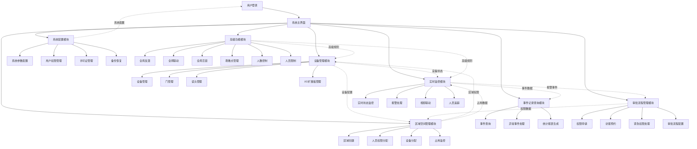

# ZKBioSecurity-ACC门禁系统 - 系统整体架构流程图

## 系统整体架构流程图

## 说明

本流程图展示了ZKBioSecurity-ACC门禁系统的整体架构，包含七大核心模块及其相互关系：

- **设备管理模块**：负责设备、门、读头、I/O扩展板的管理
- **区域空间管理模块**：处理区域创建、权限分配、设备分配和占用监控
- **实时监控模块**：提供实时状态监控、报警处理、视频联动和人员追踪
- **事件记录查询模块**：处理事件查询、异常处理和统计报表
- **审批流程管理模块**：管理权限申请、访客预约、紧急权限和流程配置
- **系统配置模块**：负责系统参数、用户权限、许可证和备份恢复
- **高级功能模块**：提供反潜、联动、互锁、疏散、容量控制和人员限制等高级功能

虚线箭头表示模块间的数据流和关联关系。