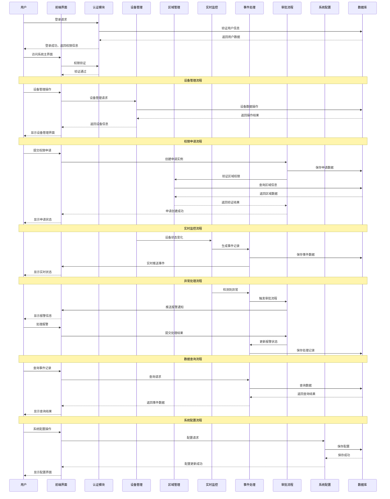

# ZKBioSecurity-ACC门禁系统 - 系统交互流程图

## 系统交互流程图

## 交互流程说明

### 用户认证流程
1. **登录请求**：用户输入用户名和密码
2. **用户验证**：认证模块验证用户信息
3. **权限返回**：返回用户的权限信息和菜单
4. **界面访问**：用户根据权限访问相应功能

### 设备管理交互
1. **设备操作**：用户在前端进行设备管理操作
2. **请求处理**：前端向后端发送设备管理请求
3. **数据操作**：后端操作数据库中的设备数据
4. **结果返回**：将操作结果返回给前端显示

### 权限申请交互
1. **申请提交**：用户提交权限申请
2. **实例创建**：系统创建审批实例
3. **权限验证**：验证申请的区域权限
4. **状态反馈**：向用户反馈申请状态

### 实时监控交互
1. **状态变化**：设备状态发生变化
2. **事件生成**：监控系统生成事件记录
3. **数据保存**：将事件数据保存到数据库
4. **实时推送**：向前端实时推送事件信息

### 异常处理交互
1. **异常检测**：监控系统检测到异常
2. **流程触发**：自动触发审批处理流程
3. **通知推送**：向相关用户推送报警通知
4. **处理记录**：记录用户的处理操作

### 数据查询交互
1. **查询请求**：用户查询历史事件记录
2. **数据处理**：后端处理查询请求
3. **数据检索**：从数据库检索相关数据
4. **结果展示**：在前端展示查询结果

### 系统配置交互
1. **配置操作**：管理员进行系统配置
2. **配置验证**：验证配置参数的有效性
3. **数据保存**：将配置保存到数据库
4. **配置生效**：配置更新立即生效

## 数据流说明

### 输入数据流
- **用户操作**：用户的界面操作和指令
- **设备数据**：门禁设备的实时数据
- **外部系统**：与外部系统的数据交换

### 处理数据流
- **业务逻辑**：各模块的业务处理逻辑
- **数据转换**：数据的格式转换和处理
- **规则引擎**：业务规则的判断和执行

### 输出数据流
- **界面展示**：向用户展示的处理结果
- **设备控制**：向设备发送的控制指令
- **通知消息**：向用户发送的通知信息

### 存储数据流
- **持久化存储**：数据库的读写操作
- **日志记录**：操作日志和审计信息
- **备份恢复**：数据的备份和恢复操作

## 接口规范

### RESTful API
- **GET**：数据查询接口
- **POST**：数据创建接口
- **PUT**：数据更新接口
- **DELETE**：数据删除接口

### WebSocket
- **实时推送**：设备状态实时推送
- **事件通知**：异常事件实时通知
- **系统消息**：系统消息推送

### 消息队列
- **异步处理**：耗时的异步任务处理
- **事件驱动**：基于事件的消息处理
- **解耦合**：模块间的松耦合通信

## 关键控制点
- 用户认证必须验证多重安全因素
- 数据操作必须进行权限检查
- 实时数据推送需要确保可靠性
- 异常处理必须建立完善的升级机制
- 系统配置变更需要记录完整的审计日志
- 模块间通信需要建立错误处理和重试机制

## 性能要求
- API响应时间：≤ 2秒
- 实时推送延迟：≤ 500毫秒
- 数据库查询：≤ 3秒
- 文件上传下载：≤ 10秒
- 系统启动时间：≤ 30秒

## 注意事项
- 接口设计需要考虑版本兼容性
- 数据传输需要加密保护敏感信息
- 需要建立完善的错误处理机制
- 系统监控需要覆盖所有关键接口
- 性能监控需要实时跟踪响应时间
- 安全审计需要记录所有接口访问