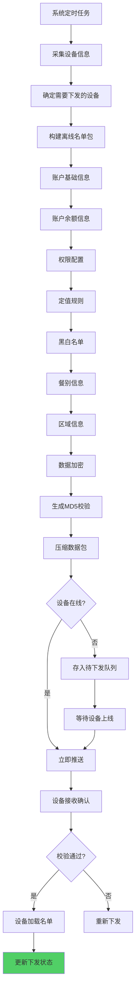
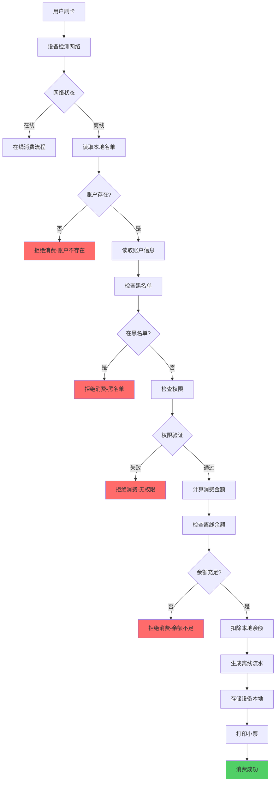
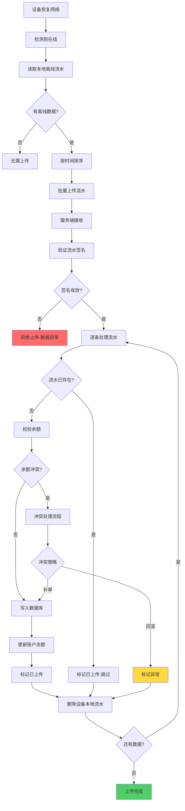
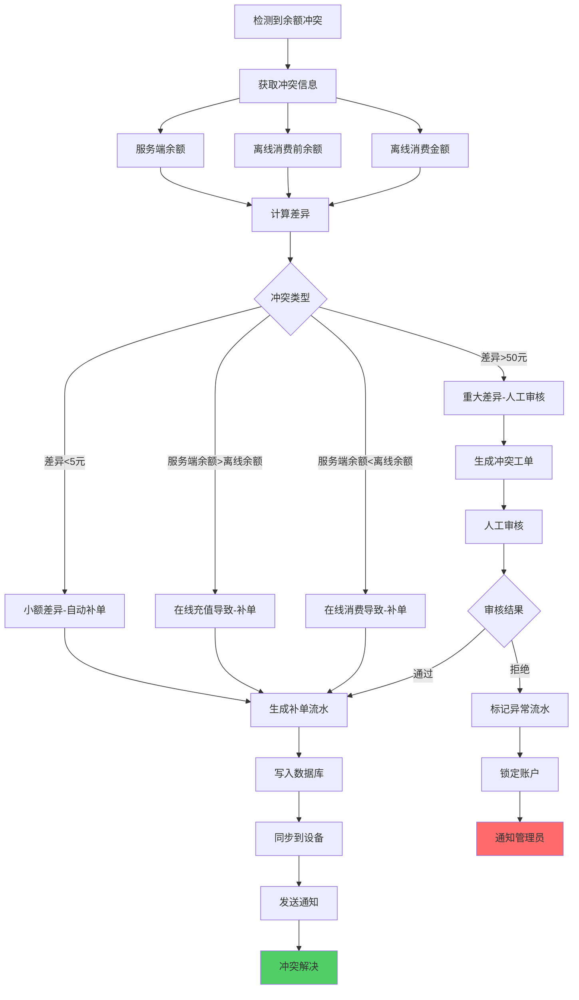
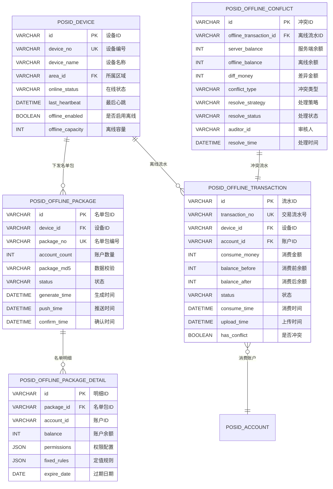
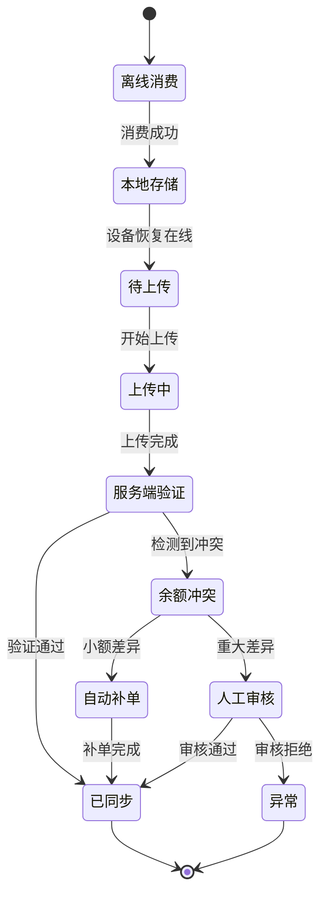

# 11-离线消费模块重构设计

## 📋 模块概述

**重构目标**：构建完整的离线消费体系，保障网络故障时业务连续性。

**核心问题**：
- 设备离线后无法消费
- 离线数据同步机制缺失
- 离线余额冲突无法处理
- 离线名单管理混乱
- **离线数据未包含新增配置字段**

**重构收益**：
- ✅ 设备离线也能正常消费
- ✅ 自动同步离线数据
- ✅ 智能处理余额冲突
- ✅ 完整的离线审计日志
- ✅ **离线数据结构完整，支持所有经营模式**

---

## 🏗️ 离线消费与经营模式

### 离线数据结构更新

**离线名单必须包含区域核心配置字段**：

| 字段 | 是否下发 | 下发原因 | 影响 |
|------|---------|---------|------|
| **manage_mode** | ✅ 必需 | 离线设备需判断消费模式 | 决定定值/商品/混合消费流程 |
| **area_sub_type** | ⚠️ 可选 | 用于离线统计分类 | 仅影响数据分析，可选 |
| **fixed_value_config** | ✅ 必需（餐别制） | 离线计算定值金额 | 餐别制区域必需，超市制不需要 |
| **meal_categories** | ✅ 必需（餐别制） | 离线验证餐别权限 | 餐别制区域必需，超市制不需要 |

### 不同经营模式的离线支持

| 经营模式 | 离线支持程度 | 必需数据 | 特殊处理 |
|---------|------------|---------|---------|
| **餐别制** | ✅ 完全支持 | 区域配置+餐别配置+定值配置 | 需下发完整餐别时间窗口 |
| **超市制** | ⚠️ 部分支持 | 区域配置+商品基础信息 | 商品价格可离线，库存需在线 |
| **混合模式** | ⚠️ 部分支持 | 两种模式数据均需下发 | 数据量较大，需压缩传输 |

**业务规则**：
1. **餐别制离线**：定值金额直接从离线配置读取，无需联网
2. **超市制离线**：商品价格可用，但库存扣减需上线后同步
3. **混合模式离线**：用户只能选择其中一种方式消费

---

## 🔄 业务流程设计
## 📋 IOE-DREAM七微服务架构

**核心架构组成**:
- **Gateway Service (8080)**: API网关
- **Common Service (8088)**: 公共模块微服务
- **DeviceComm Service (8087)**: 设备通讯微服务
- **OA Service (8089)**: OA微服务
- **Access Service (8090)**: 门禁服务
- **Attendance Service (8091)**: 考勤服务
- **Video Service (8092)**: 视频服务
- **Consume Service (8094)**: 消费服务
- **Visitor Service (8095)**: 访客服务

**架构特点**:
- 基于Spring Boot 3.5.8 + Java 17
- 严格遵循企业级微服务规范
- 支持高并发、高可用、水平扩展

**技术栈标准**:
- **数据库**: MySQL 8.0 + Druid连接池
- **缓存**: Redis + Caffeine多级缓存
- **注册中心**: Nacos
- **配置中心**: Nacos Config
- **认证授权**: Sa-Token

## 🏗️ 四层架构规范

**标准架构模式**:
```
Controller (接口控制层)
    ↓
Service (核心业务层)
    ↓
Manager (流程管理层)
    ↓
DAO (数据访问层)
```

**层级职责**:
- **Controller层**: HTTP请求处理、参数验证、权限控制
- **Service层**: 核心业务逻辑、事务管理、业务规则验证
- **Manager层**: 复杂流程编排、多数据组装、第三方服务集成
- **DAO层**: 数据库CRUD操作、SQL查询实现、数据访问边界

**严格禁止跨层访问**: Controller不能直接调用Manager/DAO！
### 1.1 离线名单下发流程
## ⚠️ IOE-DREAM零容忍规则（强制执行）

**必须遵守的架构规则**:
- ✅ **必须使用 @Resource 注入依赖**
- ✅ **必须使用 @Mapper 注解** (禁止@Repository)
- ✅ **必须使用 Dao 后缀** (禁止Repository)
- ✅ **必须使用 @RestController 注解**
- ✅ **必须使用 @Valid 参数校验**
- ✅ **必须返回统一ResponseDTO格式**
- ✅ **必须遵循四层架构边界**

**严格禁止事项**:
- ❌ **禁止使用 @Autowired 注入**
- ❌ **禁止使用 @Repository 注解**
- ❌ **禁止使用 Repository 后缀命名**
- ❌ **禁止跨层访问**
- ❌ **禁止在Controller中包含业务逻辑**
- ❌ **禁止直接访问数据库**

**违规后果**: P0级问题，立即修复，禁止合并！



### 1.2 离线消费流程



### 1.3 离线数据上传流程



### 1.4 余额冲突处理流程



---

## 🗄️ 数据库设计

### 2.1 ER关系图



### 2.2 离线名单包结构

```mermaid
graph TB
    subgraph 离线名单包
        A[名单包头]
        B[账户列表]
        C[权限配置]
        D[定值规则]
        E[黑白名单]
        F[餐别配置]
    end
    
    A --> A1[包编号]
    A --> A2[生成时间]
    A --> A3[有效期]
    A --> A4[MD5校验]
    
    B --> B1[账户ID]
    B --> B2[卡号]
    B --> B3[姓名]
    B --> B4[余额]
    B --> B5[账户类别]
    
    C --> C1[可用区域]
    C --> C2[可用餐别]
    C --> C3[日限额]
    C --> C4[次数限制]
    
    D --> D1[定值金额]
    D --> D2[消费次数]
    D --> D3[时间段]
    
    E --> E1[黑名单ID列表]
    E --> E2[白名单ID列表]
    
    F --> F1[餐别ID]
    F --> F2[餐别名称]
    F --> F3[时间段]
    
    style A fill:#4ecdc4
    style B fill:#ff6b6b
    style C fill:#ffd93d
    style D fill:#74b9ff
    style E fill:#a29bfe
    style F fill:#95e1d3
```



### 2.3 离线消费状态机



---

## 💾 缓存策略设计

### 3.1 核心缓存

| 缓存项 | Redis Key | 过期时间 | 说明 |
|-------|-----------|---------|------|
| 设备在线状态 | `device:online:{deviceId}` | 5分钟 | 心跳更新 |
| 待下发名单 | `offline:pending:{deviceId}` | 1小时 | 待推送队列 |
| 离线流水锁 | `lock:offline:{transactionNo}` | 5分钟 | 防重复上传 |
| 冲突处理队列 | `offline:conflict:queue` | 持久化 | 待处理冲突 |

---

## 📊 监控指标

### 4.1 核心指标

| 指标 | 说明 | 告警阈值 |
|------|------|---------|
| 设备离线率 | 离线设备/总设备 | > 10% |
| 名单下发成功率 | 成功/总推送 | < 95% |
| 离线流水上传延迟 | 上传时间-消费时间 | > 24小时 |
| 余额冲突率 | 冲突流水/离线流水 | > 5% |
| 冲突解决时长 | 平均处理时间 | > 1小时 |

### 4.2 业务报表

- **设备在线监控**：实时在线率、离线时长分布
- **离线消费统计**：离线消费笔数、金额、占比
- **名单下发日志**：下发频率、成功率、失败原因
- **冲突处理报告**：冲突类型分布、处理效率

---

## 🎯 总结

### 关键设计

✅ **离线名单**：完整的账户、权限、规则打包下发  
✅ **离线消费**：设备本地验证和扣款，无需网络  
✅ **数据同步**：恢复网络后自动批量上传  
✅ **冲突处理**：智能识别冲突类型，自动/人工处理  
✅ **审计追溯**：每笔离线消费都有完整日志

### 支持场景

- 🏔️ **山区工地**：网络不稳定，设备频繁离线
- 🚢 **船舶食堂**：长期离线，定期同步数据
- 🏭 **工厂车间**：网络隔离，只能离线消费
- 🎓 **临时活动**：无网络环境，移动设备消费

---

## 📝 更新说明

### v2.0 (2025-10-31)
- ✅ 新增"离线消费与经营模式"章节
- ✅ 更新离线数据结构，包含新增配置字段
- ✅ 明确不同经营模式的离线支持程度

---

**文档版本**：v2.0  
**创建时间**：2025-10-31  
**适用版本**：POSID v3.13.1+

