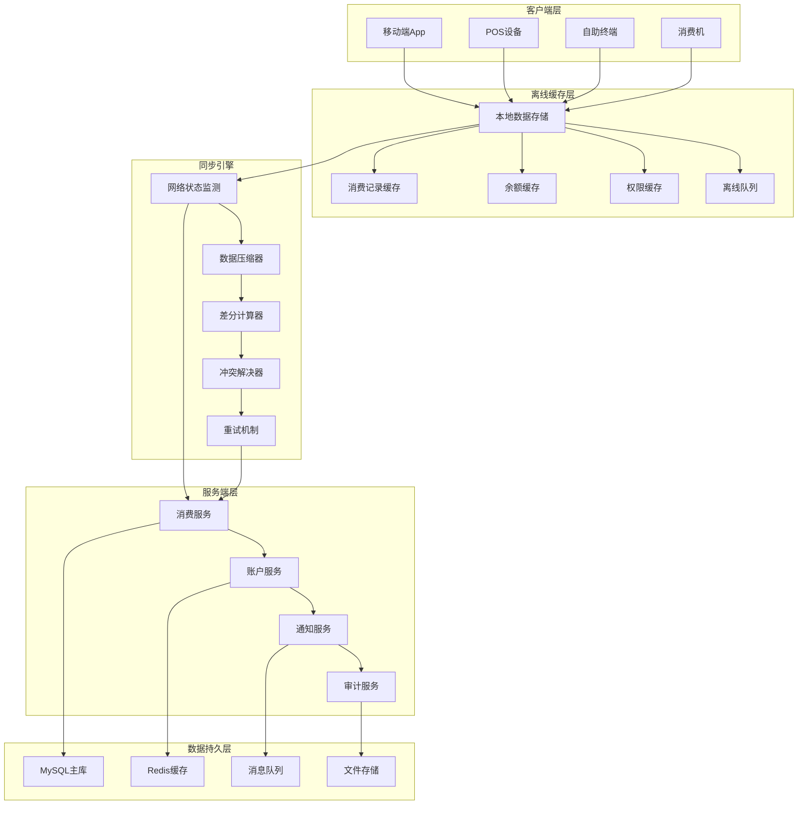
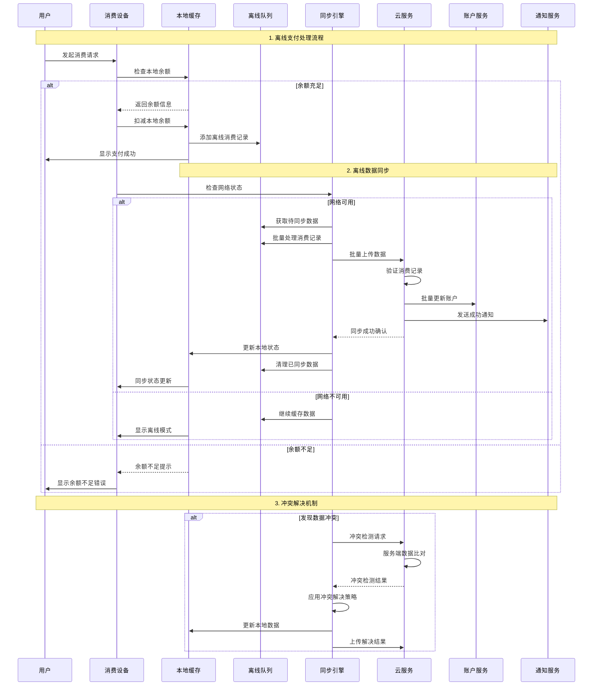
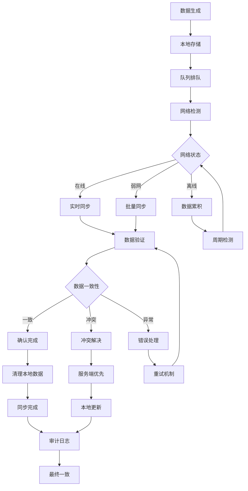
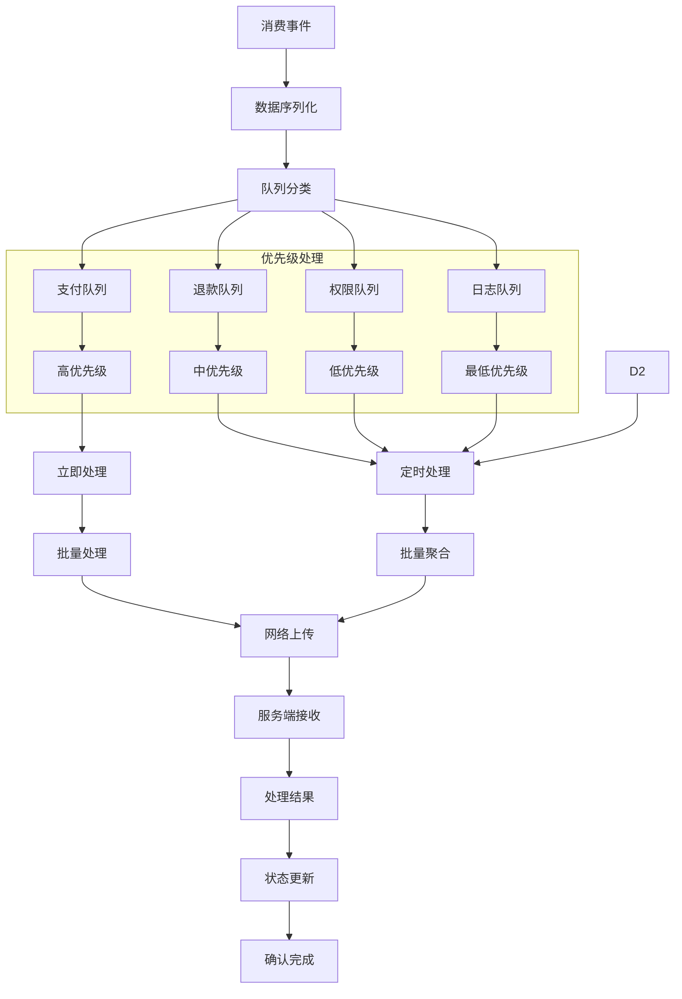
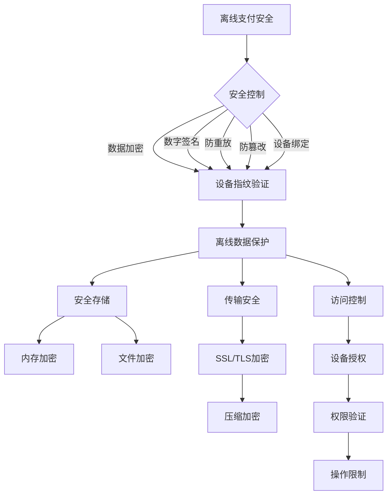
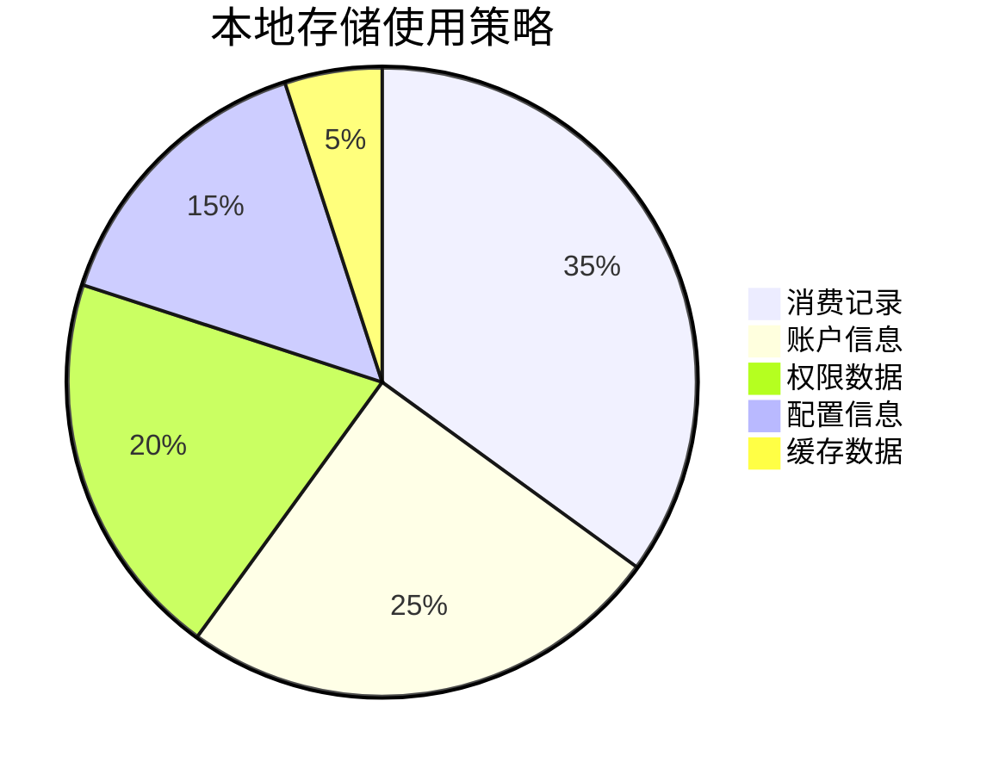
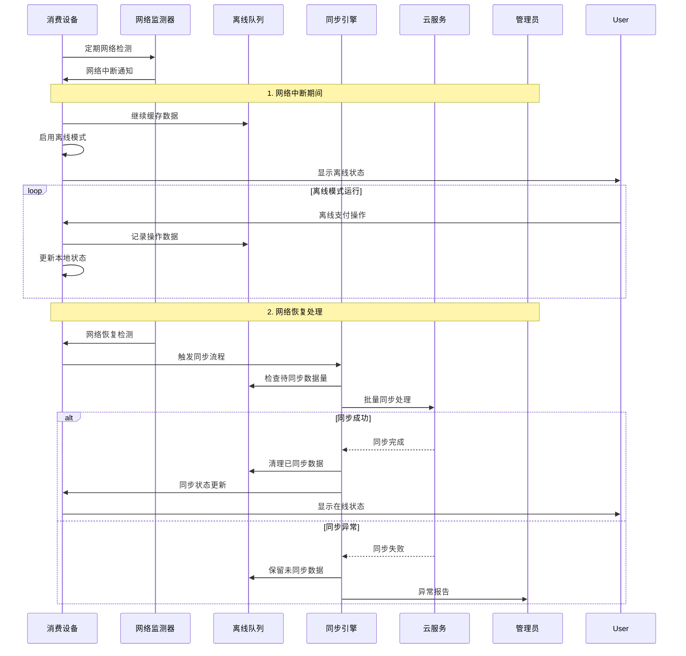
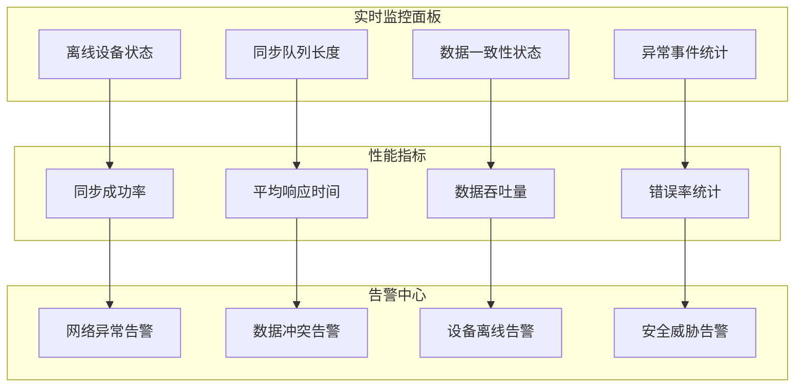

# 消费离线支付同步流程图

> **文档版本**: v1.0.0
> **创建日期**: 2025-12-16
> **业务范围**: 离线支付与数据同步
> **技术架构**: 本地缓存 + 队列同步 + 最终一致性

---

## 🔄 离线支付架构设计

### 离线支付系统架构



## 💳 离线支付完整流程

### 离线支付操作序列图



## 🔄 数据同步策略

### 最终一致性保障机制



## ⚡ 离线队列管理

### 队列数据处理流程



## 🔐 安全机制设计

### 离线安全防护策略



## 📊 性能优化策略

### 离线存储优化



### 同步性能优化

```mermaid
xychart-beta
    title 同步性能优化效果
    x-axis "数据量(条)"
    y-axis "同步时间(秒)"
    line [1, 0.5, 5, 1.2, 10, 2.1, 50, 4.8, 100, 9.5, 500, 32.5, 1000, 58.2]
    bar [1-10, 10, 11-50, 50, 51-100, 100, 101-500, 500, 501-1000, 1000]
```

## 🚨 异常处理与恢复

### 网络中断恢复流程



## 📋 监控指标体系

### 关键性能指标KPI

| 指标类别 | 监控指标 | 目标值 | 告警阈值 | 监控频率 |
|---------|----------|--------|----------|----------|
| **同步性能** | 数据同步延迟 | ≤30秒 | >60秒 | 实时 |
| **同步性能** | 同步成功率 | ≥99.5% | <98% | 实时 |
| **数据一致性** | 数据一致率 | ≥99.9% | <99% | 5分钟 |
| **离线功能** | 离线可用性 | 100% | <95% | 实时 |
| **系统性能** | 本地响应时间 | ≤200ms | >500ms | 实时 |

### 实时监控仪表板



---

## 🔧 配置参数参考

### 离线模式配置

```yaml
# 离线支付配置
offline-payment:
  # 本地存储配置
  local-storage:
    max-cache-size: 10000          # 最大缓存记录数
    data-retention-days: 7          # 数据保留天数
    encryption-enabled: true      # 启用数据加密
    compression-enabled: true     # 启用数据压缩

  # 同步配置
  sync:
    batch-size: 100                 # 批量同步大小
    sync-interval: 30              # 同步间隔(秒)
    max-retry-times: 3              # 最大重试次数
    timeout-seconds: 60            # 超时时间(秒)

  # 队列配置
  queue:
    max-queue-size: 50000          # 最大队列长度
    priority-levels: 4             # 优先级数量
    overflow-strategy: "oldest"     # 溢出策略

  # 安全配置
  security:
    data-encryption: "AES-256"     # 数据加密算法
    signature-algorithm: "RSA-2048"  # 签名算法
    device-binding: true           # 设备绑定验证
    anti-replay-window: 300        # 防重放时间窗口(秒)
```

---

**文档创建完成时间**: 2025-12-16
**流程图总数**: 6个核心流程图
**覆盖范围**: 离线支付全流程
**技术特点**: 最终一致性设计 + 高可用架构
**实施建议**: 基于此流程图立即完整实现离线支付同步功能