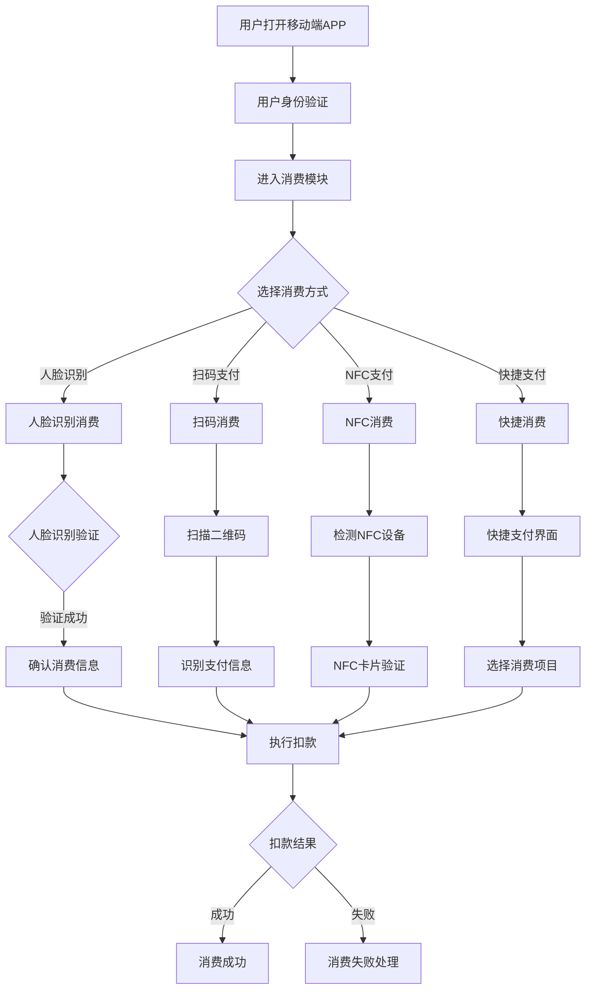
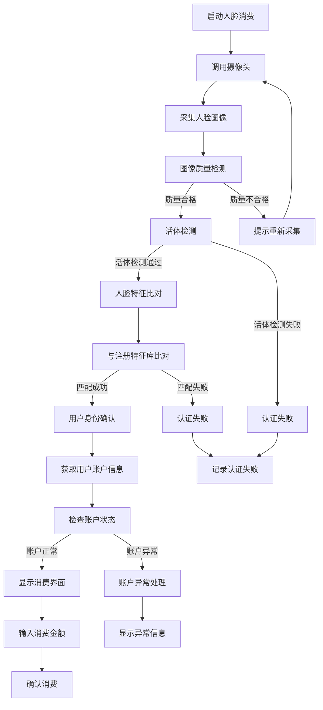
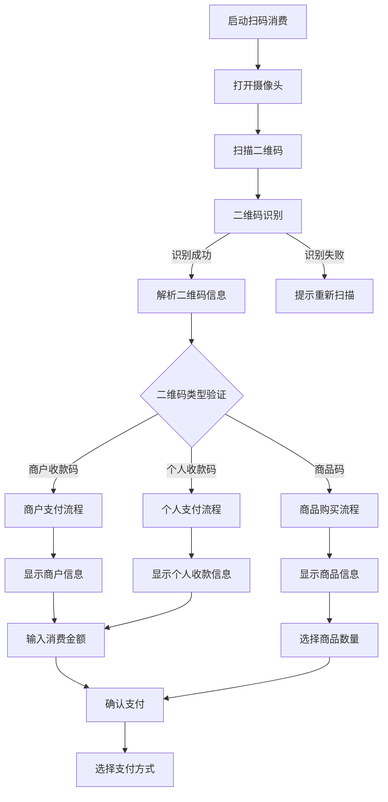
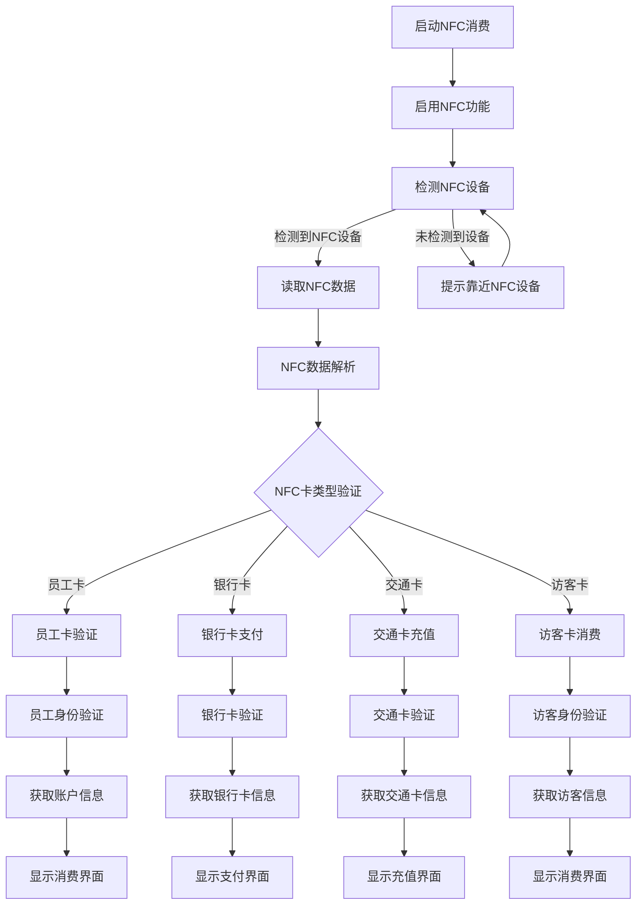
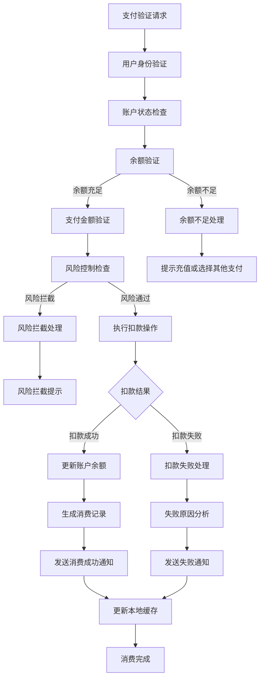
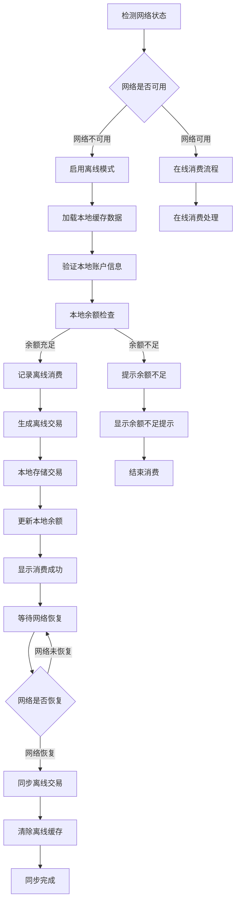
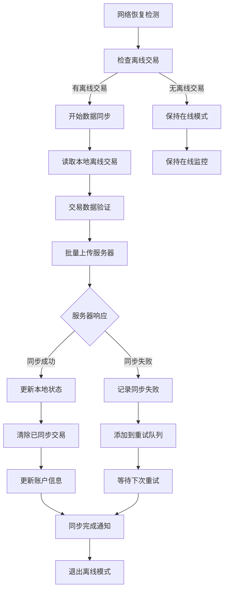

# 移动端消费流程图

## 流程概述

移动端消费是IOE-DREAM智慧园区一卡通管理平台的核心功能之一，为园区员工和访客提供便捷的移动支付体验。支持人脸识别、扫码支付、NFC近场通信等多种支付方式，确保支付的便捷性和安全性。

## 核心流程图

### 1. 移动端消费主流程

### 2. 人脸识别消费详细流程

### 3. 扫码消费详细流程

### 4. NFC消费详细流程

### 5. 支付验证与扣款流程

### 6. 离线消费流程

### 7. 消费数据同步流程

## 安全策略

### 支付安全

1. **多重验证**：身份验证 + 支付确认双重保障
2. **加密传输**：全程SSL/TLS加密传输
3. **风控系统**：实时风险监控和拦截
4. **限额控制**：单笔和累计支付限额

### 账户安全

1. **密码保护**：支付密码和登录密码分离
2. **生物识别**：人脸识别二次验证
3. **设备绑定**：设备指纹绑定
4. **异常检测**：异常登录和消费检测

### 数据安全

1. **数据加密**：敏感数据加密存储
2. **访问控制**：严格的权限控制
3. **审计日志**：完整的操作审计
4. **备份机制**：数据多重备份

## 性能优化

### 响应速度优化

1. **本地缓存**：常用数据本地缓存
2. **预加载**：用户数据预加载
3. **并行处理**：多步骤并行处理
4. **压缩传输**：数据压缩减少传输时间

### 离线能力

1. **本地数据库**：SQLite本地存储
2. **数据同步**：增量数据同步
3. **冲突处理**：数据冲突智能解决
4. **状态管理**：在线离线状态切换

## 集成方案

### 支付渠道集成

1. **银联支付**：标准银联接口
2. **支付宝**：支付宝移动支付
3. **微信支付**：微信支付接口
4. **Apple Pay**：Apple Pay集成

### 设备集成

1. **POS机**：标准POS协议对接
2. **扫码枪**：USB/蓝牙扫码枪
3. **NFC读卡器**：标准NFC设备
4. **指纹识别**：生物识别设备

### 系统集成

1. **ERP系统**：财务数据对接
2. **会员系统**：会员积分对接
3. **报表系统**：数据报表集成
4. **监控系统**：实时监控集成

## 业务场景

### 餐厅消费场景

1. **快速点餐**：扫码点餐支付
2. **自助结账**：移动端自助结账
3. **套餐购买**：月度套餐购买
4. **补贴消费**：员工补贴消费

### 商店消费场景

1. **商品购买**：园区商店购物
2. **服务支付**：园区服务缴费
3. **充值缴费**：账户充值服务
4. **活动报名**：活动报名缴费

### 访客消费场景

1. **访客充值**：访客临时充值
2. **临时消费**：访客临时消费
3. **访客结算**：访客离园结算
4. **异常处理**：消费异常处理

## 用户体验

### 操作体验

1. **简洁界面**：直观易用的操作界面
2. **快速响应**：毫秒级响应速度
3. **智能推荐**：个性化消费推荐
4. **一键支付**：一键快捷支付

### 反馈体验

1. **实时状态**：实时显示交易状态
2. **详细记录**：详细的消费记录
3. **异常提醒**：异常情况及时提醒
4. **成功确认**：支付成功明确确认

---

**文档版本**: v1.0.0
**创建日期**: 2025-12-16
**负责人**: IOE-DREAM架构团队
**审核人**: 产品团队、用户体验团队