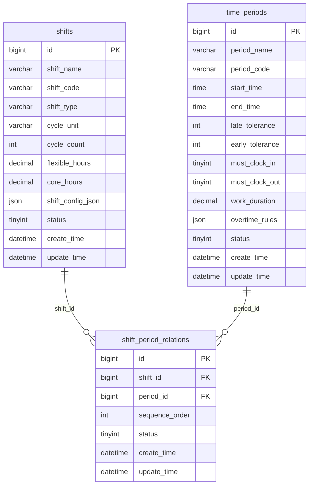

# 班次时间管理模块设计

## 模块概述
班次时间管理模块负责管理班次配置、时间段定义以及班次与时间段的关联关系，支持多种班次类型和灵活的时间配置，是排班管理和考勤计算的基础。

## 涉及的核心数据表

### 1. time_periods（时间段表）
```sql
CREATE TABLE time_periods (
    bigint id PK "主键ID，自增长"
    varchar period_name "时间段名称，如：上午班、下午班"
    varchar period_code "时间段编码，唯一标识，如：PERIOD001"
    time start_time "开始时间，如：09:00:00"
    time end_time "结束时间，如：18:00:00"
    int late_tolerance "迟到容忍分钟数，如：15分钟"
    int early_tolerance "早退容忍分钟数，如：15分钟"
    tinyint must_clock_in "是否必须签到：0-不必须，1-必须"
    tinyint must_clock_out "是否必须签退：0-不必须，1-必须"
    decimal work_duration "工作时长(小时)，如：8.0小时"
    json overtime_rules "加班规则配置JSON，包含加班计算规则"
    tinyint status "状态：0-禁用，1-启用"
    datetime create_time "创建时间，记录时间段创建时间"
    datetime update_time "更新时间，记录最后修改时间"
);
```

### 2. shifts（班次表）
```sql
CREATE TABLE shifts (
    bigint id PK "主键ID，自增长"
    varchar shift_name "班次名称，如：标准班、夜班、弹性班"
    varchar shift_code "班次编码，唯一标识，如：SHIFT001"
    varchar shift_type "班次类型：规律班次/弹性班次/三班倒/四班三倒"
    varchar cycle_unit "周期单位：天/周/月，用于轮班计算"
    int cycle_count "周期数，如：7天一个周期"
    decimal flexible_hours "弹性工作时间(小时)，如：2.0小时"
    decimal core_hours "核心工作时间(小时)，如：6.0小时"
    json shift_config_json "班次配置JSON，包含详细班次规则"
    tinyint status "状态：0-禁用，1-启用"
    datetime create_time "创建时间，记录班次创建时间"
    datetime update_time "更新时间，记录最后修改时间"
);
```

### 3. shift_period_relations（班次时间段关联表）
```sql
CREATE TABLE shift_period_relations (
    bigint id PK "主键ID，自增长"
    bigint shift_id FK "班次ID，关联shifts表"
    bigint period_id FK "时间段ID，关联time_periods表"
    int sequence_order "顺序号，用于排序时间段"
    tinyint status "状态：0-禁用，1-启用"
    datetime create_time "创建时间，记录关联创建时间"
    datetime update_time "更新时间，记录最后修改时间"
);
```

## 表之间的关联关系
## 📋 IOE-DREAM七微服务架构

**核心架构组成**:
- **Gateway Service (8080)**: API网关
- **Common Service (8088)**: 公共模块微服务
- **DeviceComm Service (8087)**: 设备通讯微服务
- **OA Service (8089)**: OA微服务
- **Access Service (8090)**: 门禁服务
- **Attendance Service (8091)**: 考勤服务
- **Video Service (8092)**: 视频服务
- **Consume Service (8094)**: 消费服务
- **Visitor Service (8095)**: 访客服务

**架构特点**:
- 基于Spring Boot 3.5.8 + Java 17
- 严格遵循企业级微服务规范
- 支持高并发、高可用、水平扩展

**技术栈标准**:
- **数据库**: MySQL 8.0 + Druid连接池
- **缓存**: Redis + Caffeine多级缓存
- **注册中心**: Nacos
- **配置中心**: Nacos Config
- **认证授权**: Sa-Token

## 🏗️ 四层架构规范

**标准架构模式**:
```
Controller (接口控制层)
    ↓
Service (核心业务层)
    ↓
Manager (流程管理层)
    ↓
DAO (数据访问层)
```

**层级职责**:
- **Controller层**: HTTP请求处理、参数验证、权限控制
- **Service层**: 核心业务逻辑、事务管理、业务规则验证
- **Manager层**: 复杂流程编排、多数据组装、第三方服务集成
- **DAO层**: 数据库CRUD操作、SQL查询实现、数据访问边界

**严格禁止跨层访问**: Controller不能直接调用Manager/DAO！
### ER图关系
## ⚠️ IOE-DREAM零容忍规则（强制执行）

**必须遵守的架构规则**:
- ✅ **必须使用 @Resource 注入依赖**
- ✅ **必须使用 @Mapper 注解** (禁止@Repository)
- ✅ **必须使用 Dao 后缀** (禁止Repository)
- ✅ **必须使用 @RestController 注解**
- ✅ **必须使用 @Valid 参数校验**
- ✅ **必须返回统一ResponseDTO格式**
- ✅ **必须遵循四层架构边界**

**严格禁止事项**:
- ❌ **禁止使用 @Autowired 注入**
- ❌ **禁止使用 @Repository 注解**
- ❌ **禁止使用 Repository 后缀命名**
- ❌ **禁止跨层访问**
- ❌ **禁止在Controller中包含业务逻辑**
- ❌ **禁止直接访问数据库**

**违规后果**: P0级问题，立即修复，禁止合并！


### 关联说明
1. **班次-时间段关联**：通过shift_period_relations表实现多对多关系
2. **时间段排序**：通过sequence_order字段控制时间段在班次中的顺序
3. **配置灵活性**：支持一个班次包含多个时间段的复杂班次配置

## 关键业务逻辑说明

### 1. 时间段管理逻辑
- **基础时间配置**：定义工作时间的开始和结束
- **容忍度设置**：配置迟到和早退的容忍时间
- **打卡要求**：控制是否必须签到和签退
- **加班规则**：配置加班时间的计算规则

### 2. 班次管理逻辑
- **班次类型支持**：
  - 规律班次：固定时间段的标准班次
  - 弹性班次：有弹性工作时间的班次
  - 三班倒：8小时一轮的三班制
  - 四班三倒：每天三班，四班轮换

- **轮班周期配置**：支持按天、周、月为周期的轮班
- **弹性时间设置**：核心工作时间和弹性工作时间分离

### 3. 班次时间段关联逻辑
- **多时间段支持**：一个班次可包含多个时间段（如：包含午休的班次）
- **时间段排序**：按顺序组织时间段，形成完整的工作时间
- **跨日班次支持**：支持跨天的工作时间配置

## 数据流转过程

### 1. 时间段创建流程
```
输入时间段信息 -> 设置时间范围 -> 配置容忍度 -> 定义加班规则 -> 创建时间段记录
```

### 2. 班次创建流程
```
选择班次类型 -> 配置轮班周期 -> 设置弹性时间 -> 关联时间段 -> 生成班次配置
```

### 3. 班次时间段关联流程
```
选择班次 -> 选择时间段 -> 设置排序顺序 -> 创建关联关系 -> 验证时间冲突
```

### 4. 班次配置验证流程
```
加载班次配置 -> 获取关联时间段 -> 验证时间冲突 -> 计算总工作时长 -> 返回配置结果
```

## JSON配置结构说明

### 1. overtime_rules（加班规则）JSON结构
```json
{
  "overtime_calculation_method": "daily_standard", // 计算方式：daily_standard/weekly/monthly
  "daily_standard_hours": 8.0,                     // 每日标准工时
  "weekly_standard_hours": 40.0,                   // 每周标准工时
  "overtime_threshold": 15,                        // 加班计算阈值（分钟）
  "weekend_multiplier": 2.0,                       // 周末加班倍数
  "holiday_multiplier": 3.0,                       // 节假日加班倍数
  "night_shift_start": "22:00",                    // 夜班开始时间
  "night_shift_end": "06:00",                      // 夜班结束时间
  "night_shift_multiplier": 1.5                    // 夜班加班倍数
}
```

### 2. shift_config_json（班次配置）JSON结构
```json
{
  "shift_pattern": "rotating",                     // 班次模式：fixed/rotating/flexible
  "rotation_sequence": [1, 2, 3],                 // 轮班序列（班次ID）
  "rotation_cycle_days": 7,                       // 轮班周期天数
  "flexible_start_time": "08:00",                 // 弹性开始时间
  "flexible_end_time": "20:00",                   // 弹性结束时间
  "core_start_time": "10:00",                     // 核心开始时间
  "core_end_time": "16:00",                       // 核心结束时间
  "break_duration": 60,                           // 休息时长（分钟）
  "break_times": [                                // 休息时间段
    {
      "start": "12:00",
      "end": "13:00"
    }
  ],
  "cross_day_enabled": true,                      // 是否支持跨日
  "max_continuous_days": 6,                       // 最大连续工作天数
  "min_rest_days": 1                              // 最少休息天数
}
```

## 模块间的接口依赖

### 1. 依赖其他模块
- **无外部依赖**：作为配置模块，为其他模块提供基础数据

### 2. 被其他模块依赖
- **排班管理模块**：需要班次信息进行排班安排
- **考勤数据计算模块**：需要班次时间段信息进行考勤计算
- **异常管理模块**：需要班次信息处理加班申请

### 3. 核心接口定义

#### 时间段管理接口
```javascript
// 获取时间段列表
GET /api/time-periods
// 创建时间段
POST /api/time-periods
// 更新时间段
PUT /api/time-periods/{id}
// 删除时间段
DELETE /api/time-periods/{id}
// 获取时间段详情
GET /api/time-periods/{id}
```

#### 班次管理接口
```javascript
// 获取班次列表
GET /api/shifts?type={type}&status={status}
// 创建班次
POST /api/shifts
// 更新班次
PUT /api/shifts/{id}
// 删除班次
DELETE /api/shifts/{id}
// 获取班次配置
GET /api/shifts/{id}/config
// 复制班次
POST /api/shifts/{id}/copy
```

#### 班次时间段关联接口
```javascript
// 获取班次的时间段
GET /api/shifts/{shift_id}/periods
// 添加时间段到班次
POST /api/shift-period-relations
// 更新时间段顺序
PUT /api/shift-period-relations/{id}/order
// 删除时间段关联
DELETE /api/shift-period-relations/{id}
// 预览班次时间线
GET /api/shifts/{shift_id}/timeline
```

## 前端页面设计建议

### 1. 时间段管理页面
- **时间段列表**：表格展示时间段信息
- **时间段编辑器**：可视化时间配置界面
- **加班规则配置**：表单式加班规则设置

### 2. 班次管理页面
- **班次类型选择**：标签页切换不同班次类型
- **班次配置器**：拖拽式班次配置界面
- **时间线预览**：可视化展示班次时间安排

### 3. 班次时间段关联页面
- **关联关系图**：可视化展示班次与时间段的关联
- **时间段排序**：拖拽式时间段顺序调整

## 开发优先级建议

### 1. 高优先级（核心功能）
- 基础时间段管理
- 标准班次配置
- 班次时间段关联
- 基础加班规则

### 2. 中优先级（增强功能）
- 弹性班次支持
- 轮班配置
- 复杂时间段组合
- 加班规则完善

### 3. 低优先级（扩展功能）
- 高级班次类型
- 可视化配置
- 班次模板
- 批量操作

## 技术实现要点

### 1. 时间计算
- 跨日时间处理
- 时间冲突检测
- 工作时长精确计算
- 加班时间算法

### 2. 配置验证
- 班次配置合理性验证
- 时间段冲突检测
- 轮班规则验证
- 数据完整性检查

### 3. 性能优化
- 班次配置缓存
- 时间计算优化
- 批量操作支持
- 配置预加载

### 4. 扩展性设计
- 班次类型可扩展
- 配置项灵活配置
- 规则引擎设计
- 插件化架构