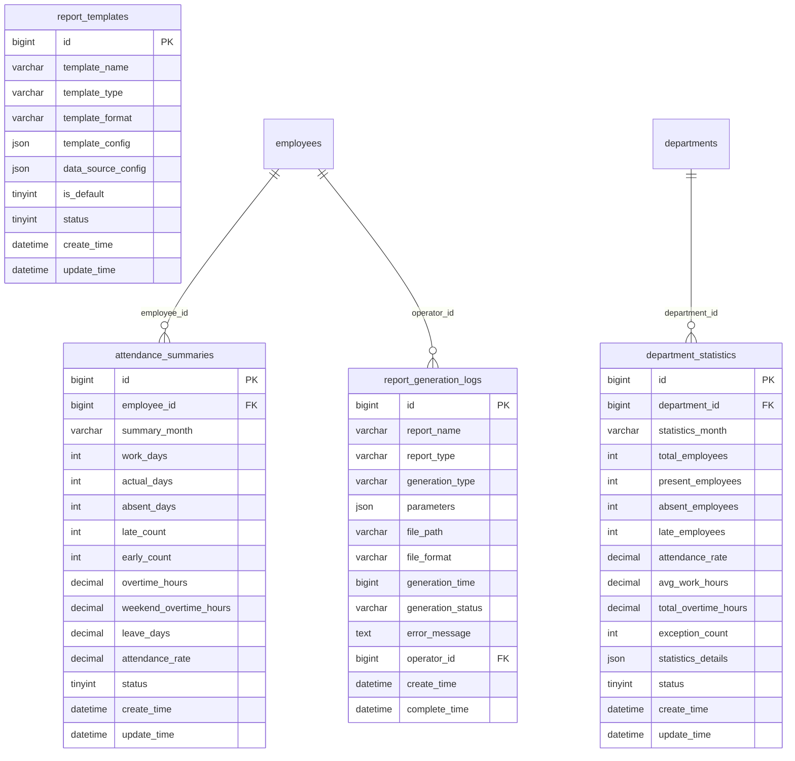

# 考勤汇总报表模块设计

## 模块概述
考勤汇总报表模块负责考勤数据的统计、汇总和报表生成，提供多维度的考勤分析功能，包括个人考勤汇总、部门考勤统计、异常考勤分析等，为管理决策提供数据支撑。

## 涉及的核心数据表

### 1. attendance_summaries（考勤汇总表）
```sql
CREATE TABLE attendance_summaries (
    bigint id PK "主键ID，自增长"
    bigint employee_id FK "员工ID，关联employees表"
    varchar summary_month "汇总月份，如：2024-01"
    int work_days "应工作天数，如：22天"
    int actual_days "实际出勤天数，如：20天"
    int absent_days "旷工天数，如：2天"
    int late_count "迟到次数，如：3次"
    int early_count "早退次数，如：1次"
    decimal overtime_hours "加班时长(小时)，如：16.0小时"
    decimal weekend_overtime_hours "周末加班时长(小时)，如：8.0小时"
    decimal leave_days "请假天数，如：1.5天"
    decimal attendance_rate "出勤率，如：0.95表示95%"
    tinyint status "状态：0-删除，1-正常"
    datetime create_time "创建时间，记录汇总创建时间"
    datetime update_time "更新时间，记录最后修改时间"
);
```

### 2. department_statistics（部门统计表）
```sql
CREATE TABLE department_statistics (
    bigint id PK "主键ID，自增长"
    bigint department_id FK "部门ID，关联departments表"
    varchar statistics_month "统计月份，如：2024-01"
    int total_employees "部门总人数"
    int present_employees "出勤人数"
    int absent_employees "缺勤人数"
    int late_employees "迟到人数"
    decimal attendance_rate "部门出勤率"
    decimal avg_work_hours "平均工作时长"
    decimal total_overtime_hours "总加班时长"
    int exception_count "异常次数"
    json statistics_details "统计详情JSON，包含各类详细统计"
    tinyint status "状态：0-删除，1-正常"
    datetime create_time "创建时间，记录统计创建时间"
    datetime update_time "更新时间，记录最后修改时间"
);
```

### 3. report_templates（报表模板表）
```sql
CREATE TABLE report_templates (
    bigint id PK "主键ID，自增长"
    varchar template_name "模板名称，如：月度考勤报表模板"
    varchar template_type "模板类型：个人报表/部门报表/公司报表"
    varchar template_format "模板格式：PDF/Excel/HTML"
    json template_config "模板配置JSON，包含报表结构和样式"
    json data_source_config "数据源配置JSON，包含数据查询规则"
    tinyint is_default "是否默认模板：0-否，1-是"
    tinyint status "状态：0-禁用，1-启用"
    datetime create_time "创建时间，记录模板创建时间"
    datetime update_time "更新时间，记录最后修改时间"
);
```

### 4. report_generation_logs（报表生成日志表）
```sql
CREATE TABLE report_generation_logs (
    bigint id PK "主键ID，自增长"
    varchar report_name "报表名称"
    varchar report_type "报表类型：个人汇总/部门统计/异常分析"
    varchar generation_type "生成类型：手动/定时/批量"
    json parameters "生成参数JSON，包含筛选条件和时间范围"
    varchar file_path "生成文件路径"
    varchar file_format "文件格式：PDF/Excel/CSV"
    bigint generation_time "生成耗时(毫秒)"
    varchar generation_status "生成状态：成功/失败/进行中"
    text error_message "错误信息，生成失败时的错误描述"
    bigint operator_id FK "操作人ID，关联employees表"
    datetime create_time "创建时间，记录生成开始时间"
    datetime complete_time "完成时间，记录生成完成时间"
);
```

## 表之间的关联关系
## 📋 IOE-DREAM七微服务架构

**核心架构组成**:
- **Gateway Service (8080)**: API网关
- **Common Service (8088)**: 公共模块微服务
- **DeviceComm Service (8087)**: 设备通讯微服务
- **OA Service (8089)**: OA微服务
- **Access Service (8090)**: 门禁服务
- **Attendance Service (8091)**: 考勤服务
- **Video Service (8092)**: 视频服务
- **Consume Service (8094)**: 消费服务
- **Visitor Service (8095)**: 访客服务

**架构特点**:
- 基于Spring Boot 3.5.8 + Java 17
- 严格遵循企业级微服务规范
- 支持高并发、高可用、水平扩展

**技术栈标准**:
- **数据库**: MySQL 8.0 + Druid连接池
- **缓存**: Redis + Caffeine多级缓存
- **注册中心**: Nacos
- **配置中心**: Nacos Config
- **认证授权**: Sa-Token

## 🏗️ 四层架构规范

**标准架构模式**:
```
Controller (接口控制层)
    ↓
Service (核心业务层)
    ↓
Manager (流程管理层)
    ↓
DAO (数据访问层)
```

**层级职责**:
- **Controller层**: HTTP请求处理、参数验证、权限控制
- **Service层**: 核心业务逻辑、事务管理、业务规则验证
- **Manager层**: 复杂流程编排、多数据组装、第三方服务集成
- **DAO层**: 数据库CRUD操作、SQL查询实现、数据访问边界

**严格禁止跨层访问**: Controller不能直接调用Manager/DAO！
### ER图关系
## ⚠️ IOE-DREAM零容忍规则（强制执行）

**必须遵守的架构规则**:
- ✅ **必须使用 @Resource 注入依赖**
- ✅ **必须使用 @Mapper 注解** (禁止@Repository)
- ✅ **必须使用 Dao 后缀** (禁止Repository)
- ✅ **必须使用 @RestController 注解**
- ✅ **必须使用 @Valid 参数校验**
- ✅ **必须返回统一ResponseDTO格式**
- ✅ **必须遵循四层架构边界**

**严格禁止事项**:
- ❌ **禁止使用 @Autowired 注入**
- ❌ **禁止使用 @Repository 注解**
- ❌ **禁止使用 Repository 后缀命名**
- ❌ **禁止跨层访问**
- ❌ **禁止在Controller中包含业务逻辑**
- ❌ **禁止直接访问数据库**

**违规后果**: P0级问题，立即修复，禁止合并！


### 关联说明
1. **员工-汇总关系**：员工与考勤汇总记录的一对多关系
2. **部门-统计关系**：部门与部门统计记录的一对多关系
3. **模板-报表关系**：报表模板用于生成各类报表
4. **操作-日志关系**：报表生成操作记录到日志表

## 关键业务逻辑说明

### 1. 个人考勤汇总逻辑
- **月度汇总**：按月汇总员工考勤数据
- **多维度统计**：统计出勤、迟到、早退、加班等维度
- **出勤率计算**：计算个人出勤率和工作效能
- **趋势分析**：分析个人考勤趋势变化

### 2. 部门考勤统计逻辑
- **部门汇总**：按部门汇总考勤统计数据
- **层级统计**：支持多级部门层级统计
- **对比分析**：部门间考勤数据对比分析
- **绩效关联**：考勤数据与绩效数据关联分析

### 3. 异常考勤分析逻辑
- **异常识别**：识别各类考勤异常模式
- **原因分析**：分析异常产生的原因
- **影响评估**：评估异常对工作的影响
- **改进建议**：提供改进建议和措施

### 4. 报表生成逻辑
- **模板管理**：管理各类报表模板
- **数据聚合**：从原始数据聚合统计信息
- **格式转换**：支持多种输出格式转换
- **定时生成**：支持定时自动生成报表

### 5. 数据钻取逻辑
- **层级钻取**：从公司到部门到个人的数据钻取
- **时间钻取**：从年度到月度到日的时间钻取
- **维度钻取**：不同统计维度的数据钻取
- **交互分析**：支持交互式数据分析

## JSON配置结构说明

### 1. statistics_details（统计详情）JSON结构
```json
{
  "attendance_breakdown": {
    "normal_days": 18,
    "late_days": 2,
    "early_days": 1,
    "absent_days": 1,
    "leave_days": 2
  },
  "time_analysis": {
    "avg_work_hours": 8.2,
    "total_work_hours": 184.5,
    "avg_overtime_hours": 1.5,
    "total_overtime_hours": 33.0
  },
  "exception_analysis": {
    "late_patterns": [
      {
        "frequency": "monday_morning",
        "count": 3,
        "avg_delay": 15
      }
    ],
    "absence_patterns": [
      {
        "reason": "sick_leave",
        "count": 1,
        "duration": 1
      }
    ]
  },
  "trend_analysis": {
    "attendance_trend": "stable",
    "overtime_trend": "increasing",
    "performance_score": 85.5
  }
}
```

### 2. template_config（模板配置）JSON结构
```json
{
  "template_name": "月度个人考勤报表",
  "layout": {
    "page_size": "A4",
    "orientation": "portrait",
    "margins": {
      "top": 20,
      "bottom": 20,
      "left": 15,
      "right": 15
    }
  },
  "sections": [
    {
      "section_id": "header",
      "type": "header",
      "content": {
        "title": "员工月度考勤汇总报表",
        "subtitle": "{{month}} {{year}}",
        "company_logo": "logo.png"
      }
    },
    {
      "section_id": "employee_info",
      "type": "employee_info",
      "fields": ["employee_name", "employee_no", "department", "position"]
    },
    {
      "section_id": "attendance_summary",
      "type": "summary_table",
      "title": "考勤汇总",
      "metrics": [
        {"key": "work_days", "label": "应出勤天数"},
        {"key": "actual_days", "label": "实际出勤天数"},
        {"key": "attendance_rate", "label": "出勤率", "format": "percentage"}
      ]
    },
    {
      "section_id": "detail_table",
      "type": "detail_table",
      "title": "详细考勤记录",
      "columns": [
        {"key": "date", "label": "日期", "width": 80},
        {"key": "shift_name", "label": "班次", "width": 100},
        {"key": "clock_in", "label": "上班打卡", "width": 100},
        {"key": "clock_out", "label": "下班打卡", "width": 100},
        {"key": "work_hours", "label": "工作时长", "width": 80},
        {"key": "status", "label": "状态", "width": 80}
      ]
    }
  ],
  "styles": {
    "font_family": "Arial",
    "font_size": 10,
    "header_color": "#333333",
    "table_border": true,
    "alternating_row_colors": ["#FFFFFF", "#F8F8F8"]
  }
}
```

### 3. data_source_config（数据源配置）JSON结构
```json
{
  "data_sources": [
    {
      "source_id": "employee_summary",
      "type": "aggregation",
      "query": {
        "table": "attendance_summaries",
        "joins": [
          {
            "table": "employees",
            "on": "attendance_summaries.employee_id = employees.id"
          }
        ],
        "filters": [
          {"field": "summary_month", "operator": "=", "value": "{{month}}"},
          {"field": "employee_id", "operator": "=", "value": "{{employee_id}}"}
        ],
        "aggregations": [
          {"field": "work_days", "function": "sum"},
          {"field": "actual_days", "function": "sum"},
          {"field": "attendance_rate", "function": "avg"}
        ]
      }
    },
    {
      "source_id": "daily_details",
      "type": "detail",
      "query": {
        "table": "attendance_results",
        "filters": [
          {"field": "employee_id", "operator": "=", "value": "{{employee_id}}"},
          {"field": "attendance_date", "operator": "between", "value": ["{{start_date}}", "{{end_date}}"]}
        ],
        "order_by": [{"field": "attendance_date", "direction": "asc"}]
      }
    }
  ]
}
```

## 数据流转过程

### 1. 数据汇总流程
```
触发汇总任务 -> 获取原始数据 -> 执行数据聚合 -> 计算统计指标 -> 生成汇总记录 -> 验证数据准确性 -> 保存汇总结果
```

### 2. 报表生成流程
```
选择报表模板 -> 配置生成参数 -> 获取数据源 -> 应用模板样式 -> 生成报表文件 -> 验证报表完整性 -> 保存报表文件
```

### 3. 统计分析流程
```
确定分析维度 -> 提取相关数据 -> 执行统计分析 -> 生成分析结果 -> 可视化展示 -> 导出分析报告
```

### 4. 数据钻取流程
```
选择汇总数据 -> 确定钻取维度 -> 获取明细数据 -> 分析明细情况 -> 生成钻取报表 -> 返回分析结果
```

## 模块间的接口依赖

### 1. 依赖其他模块
- **基础信息管理模块**：需要员工和部门信息
- **考勤数据采集与计算模块**：需要原始考勤数据
- **异常管理模块**：需要异常申请数据

### 2. 被其他模块依赖
- **系统配置与通知模块**：需要报表数据发送通知
- **前端展示模块**：需要统计数据展示图表

### 3. 核心接口定义

#### 考勤汇总接口
```javascript
// 获取个人考勤汇总
GET /api/attendance-summaries?employee_id={id}&month={month}
// 生成个人汇总
POST /api/attendance-summaries/generate
// 获取部门统计
GET /api/department-statistics?department_id={id}&month={month}
// 生成部门统计
POST /api/department-statistics/generate
// 获取公司整体统计
GET /api/company-statistics?month={month}
```

#### 报表管理接口
```javascript
// 获取报表模板列表
GET /api/report-templates?type={type}
// 创建报表模板
POST /api/report-templates
// 更新报表模板
PUT /api/report-templates/{id}
// 删除报表模板
DELETE /api/report-templates/{id}
// 预览报表
POST /api/report-templates/{id}/preview
```

#### 报表生成接口
```javascript
// 生成报表
POST /api/reports/generate
// 获取报表列表
GET /api/reports?type={type}&status={status}
// 下载报表
GET /api/reports/{id}/download
// 获取报表生成状态
GET /api/reports/{id}/status
// 删除报表文件
DELETE /api/reports/{id}
```

#### 统计分析接口
```javascript
// 获取考勤趋势分析
GET /api/attendance-trends?employee_id={id}&period={period}
// 获取异常分析
GET /api/exception-analysis?department_id={id}&period={period}
// 获取对比分析
GET /api/comparison-analysis?type={type}&period={period}
// 获取预测分析
GET /api/prediction-analysis?employee_id={id}&period={period}
```

## 前端页面设计建议

### 1. 考勤汇总页面
- **个人汇总卡片**：展示个人考勤关键指标
- **部门汇总仪表板**：部门整体考勤情况
- **汇总表格**：详细的汇总数据表格
- **趋势图表**：考勤趋势变化图表

### 2. 报表管理页面
- **模板管理**：报表模板的增删改查
- **报表生成**：报表生成参数配置
- **报表列表**：已生成报表的管理
- **预览功能**：报表预览和下载

### 3. 统计分析页面
- **分析仪表板**：多维度数据可视化
- **对比分析**：不同维度数据对比
- **趋势分析**：时间序列趋势展示
- **异常分析**：异常模式识别展示

### 4. 数据钻取页面
- **层级钻取**：组织架构层级钻取
- **时间钻取**：时间维度钻取分析
- **明细查看**：汇总数据明细展示
- **交互分析**：交互式数据分析

## 开发优先级建议

### 1. 高优先级（核心功能）
- 基础汇总统计
- 简单报表生成
- 数据表格展示
- 基础图表展示

### 2. 中优先级（增强功能）
- 复杂统计分析
- 自定义报表模板
- 数据钻取功能
- 趋势分析

### 3. 低优先级（扩展功能）
- 预测分析
- 高级可视化
- 智能分析
- 性能优化

## 技术实现要点

### 1. 数据聚合
- 高效聚合算法
- 大数据量处理
- 实时统计计算
- 缓存策略优化

### 2. 报表生成
- 模板引擎设计
- 多格式支持
- 异步生成机制
- 文件存储管理

### 3. 数据可视化
- 图表库集成
- 交互式图表
- 响应式设计
- 性能优化

### 4. 分析算法
- 统计算法实现
- 趋势分析算法
- 异常检测算法
- 预测模型设计