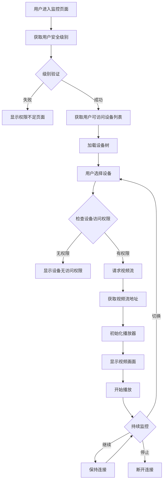
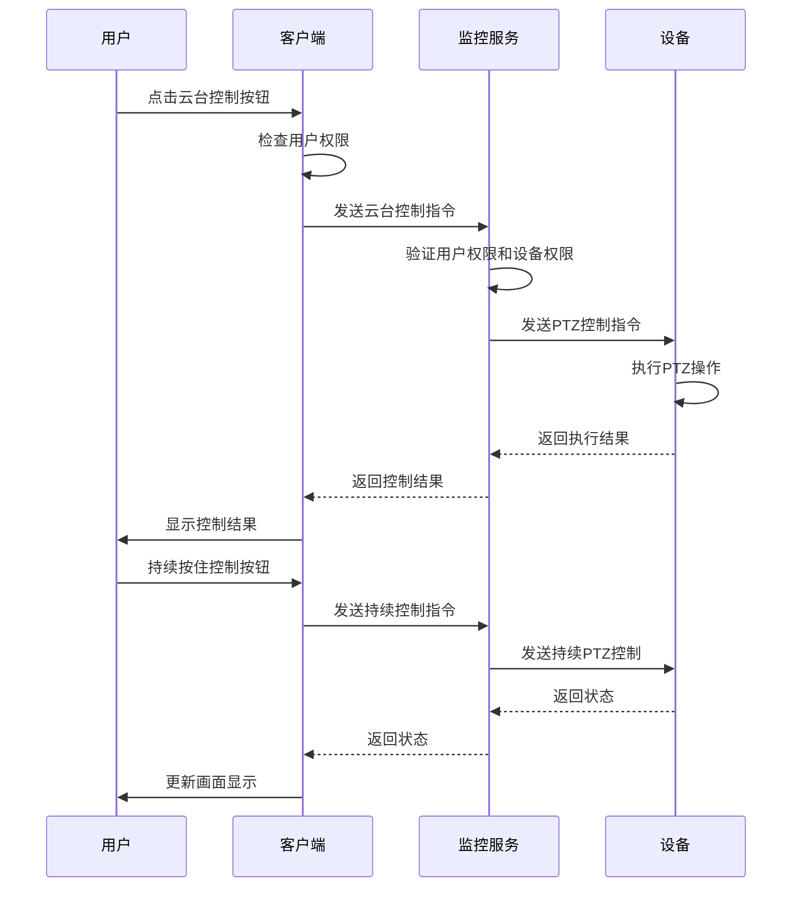
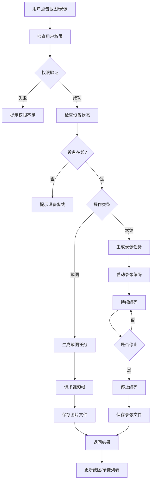
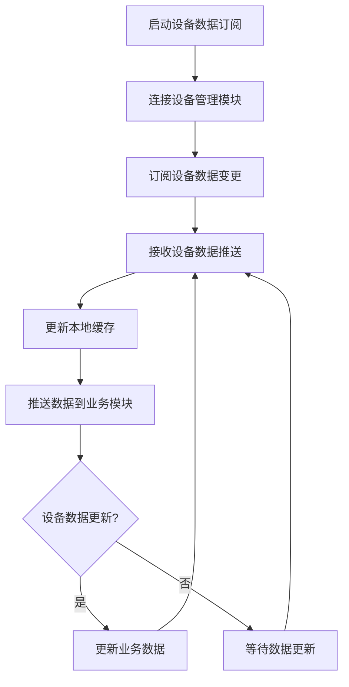
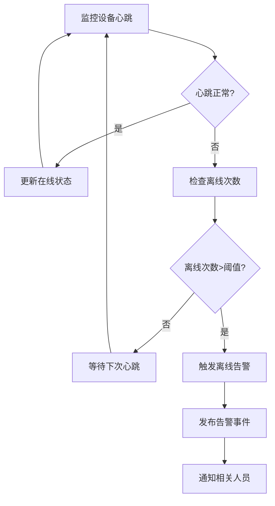
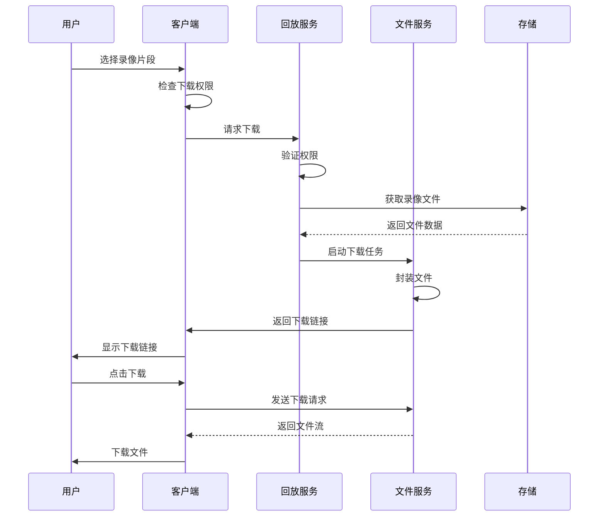

# 功能模块详细设计文档

## 📋 概述

本文档详细定义了智能视频模块的各个功能模块，包括功能点清单、业务流程、权限控制等内容。每个模块都按照安全级别进行权限控制，确保不同级别用户访问相应权限的功能。

---

## 1. 实时监控模块

### 1.1 功能概述

实时监控模块提供实时视频预览、云台控制、截图录像等核心监控功能，支持多画面布局、多协议视频流接入。

### 1.2 功能清单

#### 1.2.1 视频预览功能

| 功能项 | 功能描述 | 绝密级 | 机密级 | 秘密级 | 内部级 | 公开级 |
|--------|---------|--------|--------|--------|--------|--------|
| 单画面预览 | 单个视频画面预览 | ✅ | ✅ | ✅ | ✅ | ✅ |
| 4画面预览 | 4个视频画面同时预览 | ✅ | ✅ | ✅ | ✅ | ❌ |
| 9画面预览 | 9个视频画面同时预览 | ✅ | ✅ | ✅ | ✅ | ❌ |
| 16画面预览 | 16个视频画面同时预览 | ✅ | ✅ | ✅ | ❌ | ❌ |
| 25画面预览 | 25个视频画面同时预览 | ✅ | ✅ | ❌ | ❌ | ❌ |
| 全屏预览 | 全屏显示单个画面 | ✅ | ✅ | ✅ | ✅ | ✅ |
| 画中画预览 | 主画面+小窗口预览 | ✅ | ✅ | ✅ | ✅ | ❌ |
| 轮巡预览 | 按计划自动切换预览 | ✅ | ✅ | ✅ | ❌ | ❌ |

#### 1.2.2 云台控制功能

| 功能项 | 功能描述 | 绝密级 | 机密级 | 秘密级 | 内部级 | 公开级 |
|--------|---------|--------|--------|--------|--------|--------|
| 方向控制 | 上下左右方向控制 | ✅ | ✅ | ✅ | ✅ | ❌ |
| 变焦控制 | 光学变焦、数字变焦 | ✅ | ✅ | ✅ | ✅ | ❌ |
| 预置位设置 | 设置监控预置位 | ✅ | ✅ | ✅ | ❌ | ❌ |
| 预置位调用 | 调用预置位 | ✅ | ✅ | ✅ | ✅ | ❌ |
| 巡航设置 | 设置巡航路径 | ✅ | ✅ | ✅ | ❌ | ❌ |
| 巡航启动 | 启动/停止巡航 | ✅ | ✅ | ✅ | ❌ | ❌ |
| 缩放控制 | 画面缩放控制 | ✅ | ✅ | ✅ | ✅ | ❌ |
| 焦点控制 | 自动/手动对焦 | ✅ | ✅ | ✅ | ❌ | ❌ |

#### 1.2.3 截图录像功能

| 功能项 | 功能描述 | 绝密级 | 机密级 | 秘密级 | 内部级 | 公开级 |
|--------|---------|--------|--------|--------|--------|--------|
| 实时截图 | 实时视频截图 | ✅ | ✅ | ✅ | ✅ | ❌ |
| 批量截图 | 多个画面截图 | ✅ | ✅ | ✅ | ❌ | ❌ |
| 定时截图 | 按时间间隔截图 | ✅ | ✅ | ✅ | ❌ | ❌ |
| 手动录像 | 手动开始/停止录像 | ✅ | ✅ | ✅ | ❌ | ❌ |
| 定时录像 | 按计划录像 | ✅ | ✅ | ✅ | ❌ | ❌ |
| 报警录像 | 报警触发录像 | ✅ | ✅ | ✅ | ✅ | ❌ |
| 截图管理 | 截图查看、下载、删除 | ✅ | ✅ | ✅ | ✅ | ❌ |
| 录像管理 | 录像查看、播放、下载 | ✅ | ✅ | ✅ | ✅ | ❌ |

#### 1.2.4 画面控制功能

| 功能项 | 功能描述 | 绝密级 | 机密级 | 秘密级 | 内部级 | 公开级 |
|--------|---------|--------|--------|--------|--------|--------|
| 画面旋转 | 画面旋转角度控制 | ✅ | ✅ | ✅ | ✅ | ❌ |
| 画面镜像 | 画面水平/垂直镜像 | ✅ | ✅ | ✅ | ✅ | ❌ |
| 画面翻转 | 画面上下翻转 | ✅ | ✅ | ✅ | ✅ | ❌ |
| 亮度调节 | 画面亮度调节 | ✅ | ✅ | ✅ | ✅ | ❌ |
| 对比度调节 | 画面对比度调节 | ✅ | ✅ | ✅ | ✅ | ❌ |
| 饱和度调节 | 画面饱和度调节 | ✅ | ✅ | ✅ | ✅ | ❌ |
| 色调调节 | 画面色调调节 | ✅ | ✅ | ✅ | ✅ | ❌ |
| 电子放大 | 画面电子放大 | ✅ | ✅ | ✅ | ✅ | ✅ |

### 1.3 业务流程设计

#### 1.3.1 视频预览流程



#### 1.3.2 云台控制流程



#### 1.3.3 截图录像流程



### 1.4 技术实现

#### 1.4.1 视频流协议支持

```java
// 视频流协议枚举
public enum VideoStreamProtocol {
    RTSP("rtsp", "RTSP协议"),
    RTMP("rtmp", "RTMP协议"),
    HLS("http", "HLS协议"),
    WEBRTC("webrtc", "WebRTC协议"),
    HTTP_FLV("http", "HTTP-FLV协议");

    private final String prefix;
    private final String description;

    VideoStreamProtocol(String prefix, String description) {
        this.prefix = prefix;
        this.description = description;
    }
}

// 视频流管理器
@Service
public class VideoStreamManager {

    // 获取视频流地址
    public String getStreamUrl(Device device, String streamType) {
        VideoStreamProtocol protocol = getDeviceProtocol(device);
        switch (protocol) {
            case RTSP:
                return buildRtspUrl(device, streamType);
            case RTMP:
                return buildRtmpUrl(device, streamType);
            case HLS:
                return buildHlsUrl(device, streamType);
            case WEBRTC:
                return buildWebrtcUrl(device, streamType);
            default:
                throw new UnsupportedProtocolException("不支持的视频协议");
        }
    }

    // 构建RTSP地址
    private String buildRtspUrl(Device device, String streamType) {
        return String.format("rtsp://%s:%s/%s/%s",
            device.getIp(),
            device.getPort(),
            device.getChannel(),
            streamType);
    }
}
```

#### 1.4.2 实时预览服务

```java
@RestController
@RequestMapping("/api/monitor")
@SecurityLevel(value = 2) // 需要Level 2以上权限
public class MonitorController {

    @Resource
    private DeviceService deviceService;

    @Resource
    private PermissionService permissionService;

    @GetMapping("/devices")
    public Result<List<DeviceVO>> getUserDevices() {
        Long userId = getCurrentUserId();
        int userLevel = getCurrentUserLevel(userId);

        List<Device> devices;
        if (userLevel >= 4) {
            // Level 4及以上可访问所有设备
            devices = deviceService.getAllDevices();
        } else {
            // Level 3及以下只能访问分配设备
            devices = deviceService.getAssignedDevices(userId);
        }

        return Result.success(devices);
    }

    @GetMapping("/stream/{deviceId}")
    public Result<Map<String, String>> getStreamUrl(@PathVariable Long deviceId) {
        Long userId = getCurrentUserId();
        int userLevel = getCurrentUserLevel(userId);

        // 检查设备访问权限
        if (!permissionService.hasDevicePermission(userId, deviceId, "view")) {
            throw new ForbiddenException("无设备访问权限");
        }

        Device device = deviceService.getById(deviceId);
        String streamUrl = videoStreamManager.getStreamUrl(device, "main");

        Map<String, String> result = new HashMap<>();
        result.put("streamUrl", streamUrl);
        result.put("playUrl", transformPlayUrl(streamUrl));

        return Result.success(result);
    }

    @PostMapping("/ptz/{deviceId}/control")
    public Result<Void> ptzControl(@PathVariable Long deviceId,
                                   @RequestBody PtzControlRequest request) {
        Long userId = getCurrentUserId();
        int userLevel = getCurrentUserLevel(userId);

        // 检查云台控制权限（Level 2以上）
        if (userLevel < 2) {
            throw new ForbiddenException("无云台控制权限");
        }

        // 检查设备操作权限
        if (!permissionService.hasDevicePermission(userId, deviceId, "control")) {
            throw new ForbiddenException("无设备控制权限");
        }

        ptzService.control(deviceId, request);
        return Result.success();
    }
}
```

---

## 2. 设备管理交互模块（从公共模块获取）
## 📋 IOE-DREAM七微服务架构

**核心架构组成**:
- **Gateway Service (8080)**: API网关
- **Common Service (8088)**: 公共模块微服务
- **DeviceComm Service (8087)**: 设备通讯微服务
- **OA Service (8089)**: OA微服务
- **Access Service (8090)**: 门禁服务
- **Attendance Service (8091)**: 考勤服务
- **Video Service (8092)**: 视频服务
- **Consume Service (8094)**: 消费服务
- **Visitor Service (8095)**: 访客服务

**架构特点**:
- 基于Spring Boot 3.5.8 + Java 17
- 严格遵循企业级微服务规范
- 支持高并发、高可用、水平扩展

**技术栈标准**:
- **数据库**: MySQL 8.0 + Druid连接池
- **缓存**: Redis + Caffeine多级缓存
- **注册中心**: Nacos
- **配置中心**: Nacos Config
- **认证授权**: Sa-Token

## 🏗️ 四层架构规范

**标准架构模式**:
```
Controller (接口控制层)
    ↓
Service (核心业务层)
    ↓
Manager (流程管理层)
    ↓
DAO (数据访问层)
```

**层级职责**:
- **Controller层**: HTTP请求处理、参数验证、权限控制
- **Service层**: 核心业务逻辑、事务管理、业务规则验证
- **Manager层**: 复杂流程编排、多数据组装、第三方服务集成
- **DAO层**: 数据库CRUD操作、SQL查询实现、数据访问边界

**严格禁止跨层访问**: Controller不能直接调用Manager/DAO！
### 2.1 功能概述
## ⚠️ IOE-DREAM零容忍规则（强制执行）

**必须遵守的架构规则**:
- ✅ **必须使用 @Resource 注入依赖**
- ✅ **必须使用 @Mapper 注解** (禁止@Repository)
- ✅ **必须使用 Dao 后缀** (禁止Repository)
- ✅ **必须使用 @RestController 注解**
- ✅ **必须使用 @Valid 参数校验**
- ✅ **必须返回统一ResponseDTO格式**
- ✅ **必须遵循四层架构边界**

**严格禁止事项**:
- ❌ **禁止使用 @Autowired 注入**
- ❌ **禁止使用 @Repository 注解**
- ❌ **禁止使用 Repository 后缀命名**
- ❌ **禁止跨层访问**
- ❌ **禁止在Controller中包含业务逻辑**
- ❌ **禁止直接访问数据库**

**违规后果**: P0级问题，立即修复，禁止合并！

设备管理交互模块负责与公共设备管理模块进行数据交互，获取设备信息、监控设备状态、处理设备离线告警等功能。**注意：设备管理功能由公共模块实现，本模块仅负责数据获取和交互。**

### 2.2 功能清单

#### 2.2.1 设备数据获取功能

| 功能项 | 功能描述 | 绝密级 | 机密级 | 秘密级 | 内部级 | 公开级 |
|--------|---------|--------|--------|--------|--------|--------|
| 设备数据订阅 | 从设备管理模块订阅设备信息 | ✅ | ✅ | ✅ | ✅ | ✅ |
| 设备列表同步 | 同步设备列表数据 | ✅ | ✅ | ✅ | ✅ | ✅ |
| 设备详情查询 | 查询设备详细信息 | ✅ | ✅ | ✅ | ✅ | ✅ |
| 设备数据缓存 | 缓存热点设备数据 | ✅ | ✅ | ✅ | ✅ | ✅ |
| 数据更新推送 | 接收设备数据更新推送 | ✅ | ✅ | ✅ | ✅ | ✅ |
| 设备搜索 | 搜索可用设备 | ✅ | ✅ | ✅ | ✅ | ✅ |
| 设备筛选 | 按条件筛选设备 | ✅ | ✅ | ✅ | ✅ | ✅ |

#### 2.2.2 设备状态监控功能

| 功能项 | 功能描述 | 绝密级 | 机密级 | 秘密级 | 内部级 | 公开级 |
|--------|---------|--------|--------|--------|--------|--------|
| 设备心跳监控 | 监控设备心跳状态 | ✅ | ✅ | ✅ | ✅ | ✅ |
| 设备性能监控 | 监控CPU/内存/网络 | ✅ | ✅ | ✅ | ✅ | ❌ |
| 设备离线检测 | 检测设备离线状态 | ✅ | ✅ | ✅ | ✅ | ✅ |
| 设备离线告警 | **设备离线触发告警** | ✅ | ✅ | ✅ | ✅ | ❌ |
| 设备在线统计 | 统计设备在线率 | ✅ | ✅ | ✅ | ✅ | ✅ |
| 故障诊断 | 设备故障自动诊断 | ✅ | ✅ | ✅ | ❌ | ❌ |
| 状态历史记录 | 记录设备状态历史 | ✅ | ✅ | ✅ | ✅ | ❌ |

#### 2.2.3 设备联动抓拍功能

| 功能项 | 功能描述 | 绝密级 | 机密级 | 秘密级 | 内部级 | 公开级 |
|--------|---------|--------|--------|--------|--------|--------|
| 联动规则配置 | 配置联动抓拍规则 | ✅ | ✅ | ✅ | ❌ | ❌ |
| **低延时抓拍** | **联动抓拍响应<200ms** | ✅ | ✅ | ✅ | ✅ | ❌ |
| 抓拍任务触发 | 触发抓拍任务 | ✅ | ✅ | ✅ | ✅ | ❌ |
| 抓拍结果推送 | 推送抓拍结果 | ✅ | ✅ | ✅ | ✅ | ❌ |
| 抓拍历史查询 | 查询抓拍历史记录 | ✅ | ✅ | ✅ | ✅ | ✅ |
| 抓拍性能监控 | 监控抓拍延时性能 | ✅ | ✅ | ✅ | ❌ | ❌ |
| 批量抓拍 | 批量执行抓拍任务 | ✅ | ✅ | ✅ | ❌ | ❌ |

#### 2.2.4 设备数据缓存功能

| 功能项 | 功能描述 | 绝密级 | 机密级 | 秘密级 | 内部级 | 公开级 |
|--------|---------|--------|--------|--------|--------|--------|
| 热点数据缓存 | 缓存热点设备数据 | ✅ | ✅ | ✅ | ✅ | ✅ |
| 缓存更新策略 | 智能更新缓存数据 | ✅ | ✅ | ✅ | ✅ | ✅ |
| 缓存失效机制 | 自动失效过期缓存 | ✅ | ✅ | ✅ | ✅ | ✅ |
| 缓存性能优化 | 优化缓存访问性能 | ✅ | ✅ | ✅ | ✅ | ✅ |
| 缓存监控告警 | 监控缓存命中率 | ✅ | ✅ | ✅ | ✅ | ❌ |
| 缓存预热 | 系统启动预热缓存 | ✅ | ✅ | ✅ | ✅ | ✅ |

### 2.3 业务流程设计

#### 2.3.1 设备数据订阅流程



#### 2.3.2 设备离线告警流程


    K -->|有权限| J
    J --> M[更新设备分组]
    M --> N[更新分组统计]
    N --> O[记录操作日志]
    O --> P[返回分组结果]
```

### 2.4 技术实现

```java
@RestController
@RequestMapping("/api/device")
@SecurityLevel(value = 3) // 需要Level 3以上权限
public class DeviceController {

    @Resource
    private DeviceService deviceService;

    @Resource
    private PermissionService permissionService;

    @GetMapping("/list")
    public Result<Page<DeviceVO>> getDeviceList(DeviceQueryParam param) {
        Long userId = getCurrentUserId();
        int userLevel = getCurrentUserLevel(userId);

        // 根据安全级别过滤设备
        if (userLevel >= 4) {
            param.setIncludeAll(true);
        } else {
            param.setUserId(userId);
        }

        Page<DeviceVO> result = deviceService.getDeviceList(param);
        return Result.success(result);
    }

    @PostMapping("/add")
    public Result<Long> addDevice(@RequestBody DeviceAddRequest request) {
        Long userId = getCurrentUserId();

        // 检查添加权限
        if (!permissionService.hasPermission(userId, "device:add")) {
            throw new ForbiddenException("无设备添加权限");
        }

        Device device = new Device();
        BeanUtils.copyProperties(request, device);
        device.setCreateBy(userId);
        device.setCreateTime(new Date());

        Long deviceId = deviceService.addDevice(device);
        return Result.success(deviceId);
    }

    @PutMapping("/{deviceId}")
    public Result<Void> updateDevice(@PathVariable Long deviceId,
                                     @RequestBody DeviceUpdateRequest request) {
        Long userId = getCurrentUserId();

        // 检查设备权限
        if (!permissionService.hasDevicePermission(userId, deviceId, "update")) {
            throw new ForbiddenException("无设备修改权限");
        }

        Device device = deviceService.getById(deviceId);
        BeanUtils.copyProperties(request, device);
        device.setUpdateBy(userId);
        device.setUpdateTime(new Date());

        deviceService.updateDevice(device);
        return Result.success();
    }

    @DeleteMapping("/{deviceId}")
    public Result<Void> deleteDevice(@PathVariable Long deviceId) {
        Long userId = getCurrentUserId();

        // 检查删除权限
        if (!permissionService.hasPermission(userId, "device:delete")) {
            throw new ForbiddenException("无设备删除权限");
        }

        deviceService.deleteDevice(deviceId);
        return Result.success();
    }

    @PostMapping("/{deviceId}/reboot")
    public Result<Void> rebootDevice(@PathVariable Long deviceId) {
        Long userId = getCurrentUserId();
        int userLevel = getCurrentUserLevel(userId);

        // 检查重启权限（Level 2以上）
        if (userLevel < 2) {
            throw new ForbiddenException("无设备重启权限");
        }

        // 检查设备操作权限
        if (!permissionService.hasDevicePermission(userId, deviceId, "reboot")) {
            throw new ForbiddenException("无设备操作权限");
        }

        deviceService.rebootDevice(deviceId);
        return Result.success();
    }
}
```

---

## 3. 录像回放模块

### 3.1 功能概述

录像回放模块提供录像的查询、回放、下载、管理等功能，支持多条件查询、精准定位、快速回放。

### 3.2 功能清单

#### 3.2.1 录像查询功能

| 功能项 | 功能描述 | 绝密级 | 机密级 | 秘密级 | 内部级 | 公开级 |
|--------|---------|--------|--------|--------|--------|--------|
| 时间段查询 | 按时间范围查询录像 | ✅ | ✅ | ✅ | ✅ | ✅ |
| 设备查询 | 按设备查询录像 | ✅ | ✅ | ✅ | ✅ | ✅ |
| 事件查询 | 按事件类型查询录像 | ✅ | ✅ | ✅ | ✅ | ❌ |
| 标签查询 | 按标签查询录像 | ✅ | ✅ | ✅ | ✅ | ✅ |
| 高级查询 | 多条件组合查询 | ✅ | ✅ | ✅ | ✅ | ❌ |
| 快速查询 | 快捷查询模板 | ✅ | ✅ | ✅ | ✅ | ✅ |
| 收藏查询 | 收藏查询条件 | ✅ | ✅ | ✅ | ✅ | ❌ |
| 搜索历史 | 查看搜索历史 | ✅ | ✅ | ✅ | ✅ | ✅ |

#### 3.2.2 回放控制功能

| 功能项 | 功能描述 | 绝密级 | 机密级 | 秘密级 | 内部级 | 公开级 |
|--------|---------|--------|--------|--------|--------|--------|
| 播放/暂停 | 开始/暂停回放 | ✅ | ✅ | ✅ | ✅ | ✅ |
| 倍速播放 | 0.25x-8x倍速 | ✅ | ✅ | ✅ | ✅ | ✅ |
| 时间跳转 | 跳转到指定时间 | ✅ | ✅ | ✅ | ✅ | ✅ |
| 进度拖拽 | 拖拽进度条跳转 | ✅ | ✅ | ✅ | ✅ | ✅ |
| 单帧播放 | 逐帧播放 | ✅ | ✅ | ✅ | ✅ | ❌ |
| 倒放 | 倒序播放 | ✅ | ✅ | ✅ | ✅ | ❌ |
| 循环播放 | 循环播放录像 | ✅ | ✅ | ✅ | ✅ | ❌ |
| 书签标记 | 添加/删除书签 | ✅ | ✅ | ✅ | ✅ | ❌ |

#### 3.2.3 录像下载功能

| 功能项 | 功能描述 | 绝密级 | 机密级 | 秘密级 | 内部级 | 公开级 |
|--------|---------|--------|--------|--------|--------|--------|
| 单片段下载 | 下载指定片段 | ✅ | ✅ | ✅ | ❌ | ❌ |
| 多片段下载 | 批量下载片段 | ✅ | ✅ | ✅ | ❌ | ❌ |
| 定时下载 | 定时下载任务 | ✅ | ✅ | ✅ | ❌ | ❌ |
| 下载任务管理 | 查看/暂停下载任务 | ✅ | ✅ | ✅ | ❌ | ❌ |
| 下载进度查看 | 查看下载进度 | ✅ | ✅ | ✅ | ❌ | ❌ |
| 下载历史 | 查看下载历史 | ✅ | ✅ | ✅ | ❌ | ❌ |
| 下载格式选择 | 选择下载格式 | ✅ | ✅ | ✅ | ❌ | ❌ |
| 下载水印 | 添加水印 | ✅ | ✅ | ✅ | ❌ | ❌ |

#### 3.2.4 录像管理功能

| 功能项 | 功能描述 | 绝密级 | 机密级 | 秘密级 | 内部级 | 公开级 |
|--------|---------|--------|--------|--------|--------|--------|
| 录像列表 | 查看录像列表 | ✅ | ✅ | ✅ | ✅ | ✅ |
| 录像详情 | 查看录像详情 | ✅ | ✅ | ✅ | ✅ | ✅ |
| 录像删除 | 删除录像 | ✅ | ✅ | ❌ | ❌ | ❌ |
| 录像备份 | 备份录像 | ✅ | ✅ | ✅ | ❌ | ❌ |
| 录像恢复 | 恢复录像 | ✅ | ✅ | ✅ | ❌ | ❌ |
| 录像归档 | 归档历史录像 | ✅ | ✅ | ✅ | ❌ | ❌ |
| 录像统计 | 录像统计分析 | ✅ | ✅ | ✅ | ✅ | ❌ |
| 存储分析 | 存储使用分析 | ✅ | ✅ | ✅ | ✅ | ❌ |

### 3.3 业务流程设计

#### 3.3.1 录像查询回放流程

```mermaid
flowchart TD
    A[用户进入回放页面] --> B[检查用户权限]
    B --> C[获取用户安全级别]
    C --> D{权限验证}
    D -->|失败| E[提示权限不足]
    D -->|成功| F[选择查询条件]
    F --> G[选择设备]
    G --> H[选择时间范围]
    H --> I[选择事件类型(可选)]
    I --> J[执行查询]
    J --> K[查询录像数据]
    K --> L[返回录像列表]
    L --> M[用户选择录像]
    M --> N[检查录像访问权限]
    N --> O{有权限?}
    O -->|否| P[提示无访问权限]
    O -->|是| Q[加载录像文件]
    Q --> R[初始化播放器]
    R --> S[开始回放]
    S --> T{回放控制}
    T -->|暂停| U[暂停播放]
    T -->|快进| V[调整播放速度]
    T -->|跳转| W[跳转到指定时间]
    T -->|正常| S
```

#### 3.3.2 录像下载流程



### 3.4 技术实现

```java
@RestController
@RequestMapping("/api/playback")
@SecurityLevel(value = 2) // 需要Level 2以上权限
public class PlaybackController {

    @Resource
    private PlaybackService playbackService;

    @Resource
    private PermissionService permissionService;

    @GetMapping("/records")
    public Result<Page<RecordVO>> getRecords(RecordQueryParam param) {
        Long userId = getCurrentUserId();
        int userLevel = getCurrentUserLevel(userId);

        // 根据安全级别过滤设备
        if (userLevel < 4) {
            List<Long> deviceIds = permissionService.getAccessibleDevices(userId);
            param.setDeviceIds(deviceIds);
        }

        Page<RecordVO> result = playbackService.getRecords(param);
        return Result.success(result);
    }

    @GetMapping("/stream/{recordId}")
    public Result<Map<String, String>> getPlaybackStream(@PathVariable Long recordId) {
        Long userId = getCurrentUserId();

        // 检查录像访问权限
        Record record = playbackService.getRecordById(recordId);
        if (!permissionService.hasDevicePermission(userId, record.getDeviceId(), "view")) {
            throw new ForbiddenException("无录像访问权限");
        }

        String streamUrl = playbackService.getRecordStreamUrl(recordId);
        Map<String, String> result = new HashMap<>();
        result.put("streamUrl", streamUrl);
        return Result.success(result);
    }

    @PostMapping("/download")
    public Result<Long> downloadRecord(@RequestBody DownloadRequest request) {
        Long userId = getCurrentUserId();
        int userLevel = getCurrentUserLevel(userId);

        // 检查下载权限（Level 3以上）
        if (userLevel < 3) {
            throw new ForbiddenException("无录像下载权限");
        }

        // 检查录像权限
        Record record = playbackService.getRecordById(request.getRecordId());
        if (!permissionService.hasDevicePermission(userId, record.getDeviceId(), "download")) {
            throw new ForbiddenException("无下载权限");
        }

        Long taskId = playbackService.createDownloadTask(userId, request);
        return Result.success(taskId);
    }
}
```

---

## 4. 行为分析模块

### 4.1 功能概述

行为分析模块集成AI算法，提供人脸识别、行为分析、异常检测等智能分析功能，支持算法配置、规则管理、结果查看。

### 4.2 功能清单

#### 4.2.1 算法管理功能

| 功能项 | 功能描述 | 绝密级 | 机密级 | 秘密级 | 内部级 | 公开级 |
|--------|---------|--------|--------|--------|--------|--------|
| 算法模型管理 | 模型的CRUD操作 | ✅ | ✅ | ❌ | ❌ | ❌ |
| 算法参数配置 | 配置算法参数 | ✅ | ✅ | ✅ | ❌ | ❌ |
| 算法版本管理 | 管理算法版本 | ✅ | ✅ | ❌ | ❌ | ❌ |
| 算法性能调优 | 性能参数调优 | ✅ | ✅ | ❌ | ❌ | ❌ |
| 模型训练 | 训练自定义模型 | ✅ | ✅ | ❌ | ❌ | ❌ |
| 模型更新 | 更新算法模型 | ✅ | ✅ | ❌ | ❌ | ❌ |
| 模型评估 | 评估模型性能 | ✅ | ✅ | ✅ | ❌ | ❌ |
| 算法监控 | 监控算法运行状态 | ✅ | ✅ | ✅ | ❌ | ❌ |

#### 4.2.2 检测规则功能

| 功能项 | 功能描述 | 绝密级 | 机密级 | 秘密级 | 内部级 | 公开级 |
|--------|---------|--------|--------|--------|--------|--------|
| 检测区域设置 | 设置检测区域 | ✅ | ✅ | ✅ | ❌ | ❌ |
| 检测规则配置 | 配置检测规则 | ✅ | ✅ | ✅ | ❌ | ❌ |
| 告警阈值设置 | 设置告警阈值 | ✅ | ✅ | ✅ | ❌ | ❌ |
| 检测时间段 | 设置检测时间段 | ✅ | ✅ | ✅ | ❌ | ❌ |
| 目标过滤 | 过滤检测目标 | ✅ | ✅ | ✅ | ❌ | ❌ |
| 规则模板 | 管理规则模板 | ✅ | ✅ | ✅ | ❌ | ❌ |
| 批量规则配置 | 批量配置规则 | ✅ | ✅ | ✅ | ❌ | ❌ |
| 规则优先级 | 设置规则优先级 | ✅ | ✅ | ✅ | ❌ | ❌ |

#### 4.2.3 分析结果功能

| 功能项 | 功能描述 | 绝密级 | 机密级 | 秘密级 | 内部级 | 公开级 |
|--------|---------|--------|--------|--------|--------|--------|
| 实时分析结果 | 查看实时分析结果 | ✅ | ✅ | ✅ | ✅ | ✅ |
| 历史分析结果 | 查看历史分析结果 | ✅ | ✅ | ✅ | ✅ | ✅ |
| 结果筛选 | 筛选分析结果 | ✅ | ✅ | ✅ | ✅ | ❌ |
| 结果导出 | 导出分析结果 | ✅ | ✅ | ✅ | ❌ | ❌ |
| 结果详情 | 查看结果详情 | ✅ | ✅ | ✅ | ✅ | ✅ |
| 结果确认 | 确认/驳回结果 | ✅ | ✅ | ✅ | ✅ | ❌ |
| 结果删除 | 删除分析结果 | ✅ | ✅ | ❌ | ❌ | ❌ |
| 结果统计 | 统计分析结果 | ✅ | ✅ | ✅ | ✅ | ❌ |

### 4.3 技术实现

```java
@RestController
@RequestMapping("/api/analysis")
@SecurityLevel(value = 3) // 需要Level 3以上权限
public class AnalysisController {

    @Resource
    private AnalysisService analysisService;

    @GetMapping("/algorithms")
    public Result<List<AlgorithmVO>> getAlgorithms() {
        return Result.success(analysisService.getAlgorithms());
    }

    @PostMapping("/rules")
    public Result<Long> createAnalysisRule(@RequestBody AnalysisRuleRequest request) {
        Long userId = getCurrentUserId();

        // 检查规则创建权限
        if (!permissionService.hasPermission(userId, "analysis:rule:create")) {
            throw new ForbiddenException("无规则创建权限");
        }

        AnalysisRule rule = new AnalysisRule();
        BeanUtils.copyProperties(request, rule);
        rule.setCreateBy(userId);

        Long ruleId = analysisService.createRule(rule);
        return Result.success(ruleId);
    }

    @GetMapping("/results")
    public Result<Page<AnalysisResultVO>> getAnalysisResults(ResultQueryParam param) {
        Long userId = getCurrentUserId();
        int userLevel = getCurrentUserLevel(userId);

        // 根据安全级别过滤设备
        if (userLevel < 4) {
            List<Long> deviceIds = permissionService.getAccessibleDevices(userId);
            param.setDeviceIds(deviceIds);
        }

        Page<AnalysisResultVO> result = analysisService.getResults(param);
        return Result.success(result);
    }
}
```

---

## 5. 告警管理模块

### 5.1 功能概述

告警管理模块提供告警配置、事件处理、联动控制等功能，支持实时告警、规则配置、智能联动。

### 5.2 功能清单

#### 5.2.1 告警配置功能

| 功能项 | 功能描述 | 绝密级 | 机密级 | 秘密级 | 内部级 | 公开级 |
|--------|---------|--------|--------|--------|--------|--------|
| 告警规则配置 | 配置告警规则 | ✅ | ✅ | ✅ | ❌ | ❌ |
| 告警联动配置 | 配置告警联动 | ✅ | ✅ | ✅ | ❌ | ❌ |
| 告警通知配置 | 配置通知方式 | ✅ | ✅ | ❌ | ❌ | ❌ |
| 告警模板管理 | 管理告警模板 | ✅ | ✅ | ✅ | ❌ | ❌ |
| 告警级别设置 | 设置告警级别 | ✅ | ✅ | ✅ | ❌ | ❌ |
| 告警抑制配置 | 配置告警抑制 | ✅ | ✅ | ✅ | ❌ | ❌ |
| 告警升级配置 | 配置告警升级 | ✅ | ✅ | ✅ | ❌ | ❌ |
| 告警过滤配置 | 配置告警过滤 | ✅ | ✅ | ✅ | ❌ | ❌ |

#### 5.2.2 告警处理功能

| 功能项 | 功能描述 | 绝密级 | 机密级 | 秘密级 | 内部级 | 公开级 |
|--------|---------|--------|--------|--------|--------|--------|
| 实时告警查看 | 查看实时告警 | ✅ | ✅ | ✅ | ✅ | ✅ |
| 历史告警查询 | 查询历史告警 | ✅ | ✅ | ✅ | ✅ | ✅ |
| 告警确认 | 确认告警 | ✅ | ✅ | ✅ | ✅ | ❌ |
| 告警处理 | 处理告警 | ✅ | ✅ | ✅ | ✅ | ❌ |
| 告警反馈 | 反馈处理结果 | ✅ | ✅ | ✅ | ✅ | ❌ |
| 告警转发 | 转发告警 | ✅ | ✅ | ✅ | ✅ | ❌ |
| 告警合并 | 合并重复告警 | ✅ | ✅ | ✅ | ❌ | ❌ |
| 告警屏蔽 | 临时屏蔽告警 | ✅ | ✅ | ✅ | ❌ | ❌ |

### 5.3 技术实现

```java
@RestController
@RequestMapping("/api/alarm")
@SecurityLevel(value = 2) // 需要Level 2以上权限
public class AlarmController {

    @Resource
    private AlarmService alarmService;

    @GetMapping("/realtime")
    public Result<List<AlarmVO>> getRealtimeAlarms() {
        Long userId = getCurrentUserId();
        int userLevel = getCurrentUserLevel(userId);

        List<Alarm> alarms = alarmService.getRealtimeAlarms();

        // 根据安全级别过滤告警
        if (userLevel < 4) {
            List<Long> deviceIds = permissionService.getAccessibleDevices(userId);
            alarms = alarms.stream()
                .filter(alarm -> deviceIds.contains(alarm.getDeviceId()))
                .collect(Collectors.toList());
        }

        return Result.success(alarms);
    }

    @PostMapping("/{alarmId}/confirm")
    public Result<Void> confirmAlarm(@PathVariable Long alarmId,
                                     @RequestBody AlarmConfirmRequest request) {
        Long userId = getCurrentUserId();
        int userLevel = getCurrentUserLevel(userId);

        // 检查确认权限（Level 2以上可确认，Level 1只能查看）
        Alarm alarm = alarmService.getById(alarmId);
        if (!permissionService.hasDevicePermission(userId, alarm.getDeviceId(), "alarm:confirm")) {
            throw new ForbiddenException("无告警确认权限");
        }

        alarmService.confirmAlarm(alarmId, userId, request.getNote());
        return Result.success();
    }
}
```

---

## 6. 解码上墙模块

### 6.1 功能概述

解码上墙模块提供解码器管理、大屏控制、多屏联动等功能，支持实时视频上墙、回放画面上墙。

### 6.2 功能清单

| 功能项 | 功能描述 | 绝密级 | 机密级 | 秘密级 | 内部级 | 公开级 |
|--------|---------|--------|--------|--------|--------|--------|
| 解码器注册 | 注册解码器设备 | ✅ | ✅ | ✅ | ❌ | ❌ |
| 解码器配置 | 配置解码器参数 | ✅ | ✅ | ✅ | ❌ | ❌ |
| 大屏布局配置 | 配置大屏布局 | ✅ | ✅ | ✅ | ❌ | ❌ |
| 窗口管理 | 管理显示窗口 | ✅ | ✅ | ✅ | ✅ | ❌ |
| 实时视频上墙 | 上墙实时视频 | ✅ | ✅ | ✅ | ✅ | ✅ |
| 录像回放上墙 | 上墙回放画面 | ✅ | ✅ | ✅ | ✅ | ❌ |
| 图片上墙 | 上墙图片 | ✅ | ✅ | ✅ | ✅ | ❌ |
| 多屏联动 | 配置多屏联动 | ✅ | ✅ | ✅ | ❌ | ❌ |

### 6.3 技术实现

```java
@RestController
@RequestMapping("/api/wall")
@SecurityLevel(value = 2) // 需要Level 2以上权限
public class WallController {

    @Resource
    private WallService wallService;

    @PostMapping("/{wallId}/display")
    public Result<Void> displayVideo(@PathVariable Long wallId,
                                     @RequestBody DisplayRequest request) {
        Long userId = getCurrentUserId();

        // 检查上墙权限
        if (!permissionService.hasWallPermission(userId, wallId, "display")) {
            throw new ForbiddenException("无上墙权限");
        }

        wallService.displayVideo(wallId, request);
        return Result.success();
    }
}
```

---

## 7. 消息中心模块

### 7.1 功能概述

消息中心模块是系统的消息枢纽，负责事件订阅、消息推送、通知管理，支持多种通知渠道。

### 7.2 功能清单

| 功能项 | 功能描述 |
|--------|---------|
| 事件订阅管理 | 管理事件订阅规则 |
| 消息推送机制 | 实时消息推送 |
| 通知渠道配置 | 配置短信、邮件、APP推送 |
| 消息模板管理 | 管理消息模板 |
| 推送记录统计 | 统计推送记录 |
| 消息队列管理 | 管理消息队列 |
| 失败重试机制 | 失败消息重试 |
| 推送性能监控 | 监控推送性能 |

### 7.3 技术实现

```java
@Service
public class MessageCenterService {

    @Resource
    private RabbitTemplate rabbitTemplate;

    // 发布事件
    public void publishEvent(Event event) {
        // 查找订阅者
        List<Subscription> subscriptions = subscriptionService.getSubscriptions(event.getType());

        for (Subscription subscription : subscriptions) {
            // 检查订阅条件
            if (matchesCondition(subscription, event)) {
                // 发送消息
                sendMessage(subscription, event);
            }
        }

        // 记录事件
        eventLogService.recordEvent(event);
    }

    // 发送消息
    private void sendMessage(Subscription subscription, Event event) {
        Message message = new Message();
        message.setSubscriberId(subscription.getSubscriberId());
        message.setEventType(event.getType());
        message.setContent(transformContent(event, subscription.getTemplate()));

        // 根据渠道发送
        for (String channel : subscription.getChannels()) {
            switch (channel) {
                case "SMS":
                    smsService.send(message);
                    break;
                case "EMAIL":
                    emailService.send(message);
                    break;
                case "APP":
                    appPushService.send(message);
                    break;
            }
        }
    }
}
```

---

## 8. 地图显示模块

### 8.1 功能概述

地图显示模块提供GIS地图展示、设备定位、区域管理、地图联动等功能。

### 8.2 功能清单

| 功能项 | 功能描述 |
|--------|---------|
| GIS地图显示 | 显示地图界面 |
| 设备位置标注 | 在地图上标注设备 |
| 区域管理 | 管理监控区域 |
| 轨迹回放 | 设备轨迹回放 |
| 地图联动 | 点击地图联动视频 |
| 框选功能 | 框选区域设备 |
| 测距功能 | 地图测距 |
| 标注管理 | 管理地图标注 |

### 8.3 技术实现

```java
@RestController
@RequestMapping("/api/map")
@SecurityLevel(value = 1) // Level 1以上权限
public class MapController {

    @GetMapping("/devices")
    public Result<List<DeviceLocationVO>> getDeviceLocations() {
        Long userId = getCurrentUserId();
        int userLevel = getCurrentUserLevel(userId);

        List<Device> devices;
        if (userLevel >= 4) {
            devices = deviceService.getAllDevices();
        } else {
            devices = deviceService.getAssignedDevices(userId);
        }

        List<DeviceLocationVO> locations = devices.stream()
            .filter(d -> d.getLatitude() != null && d.getLongitude() != null)
            .map(d -> {
                DeviceLocationVO vo = new DeviceLocationVO();
                vo.setDeviceId(d.getId());
                vo.setDeviceName(d.getName());
                vo.setLatitude(d.getLatitude());
                vo.setLongitude(d.getLongitude());
                vo.setStatus(d.getStatus());
                return vo;
            })
            .collect(Collectors.toList());

        return Result.success(locations);
    }
}
```

---

## 📝 总结

本功能模块详细设计文档覆盖了智能视频模块的所有核心功能：

1. **实时监控模块**：视频预览、云台控制、截图录像、画面上墙
2. **设备管理模块**：设备注册、配置、操作、分组管理
3. **录像回放模块**：录像查询、回放控制、下载、管理
4. **行为分析模块**：算法管理、检测规则、分析结果
5. **告警管理模块**：告警配置、事件处理、联动控制
6. **解码上墙模块**：解码器管理、大屏控制、多屏联动
7. **消息中心模块**：事件订阅、消息推送、通知管理
8. **地图显示模块**：地图展示、设备定位、区域管理

每个模块都按照5级安全体系进行权限设计，确保不同级别用户访问相应权限的功能。

**下一步**：创建界面原型图设计文档，详细展示每个页面的设计。

---

*本文档详细定义了智能视频模块的所有功能点、业务流程和技术实现。*
