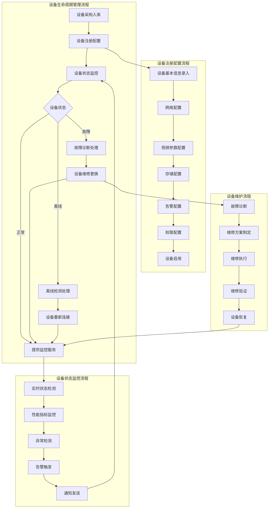
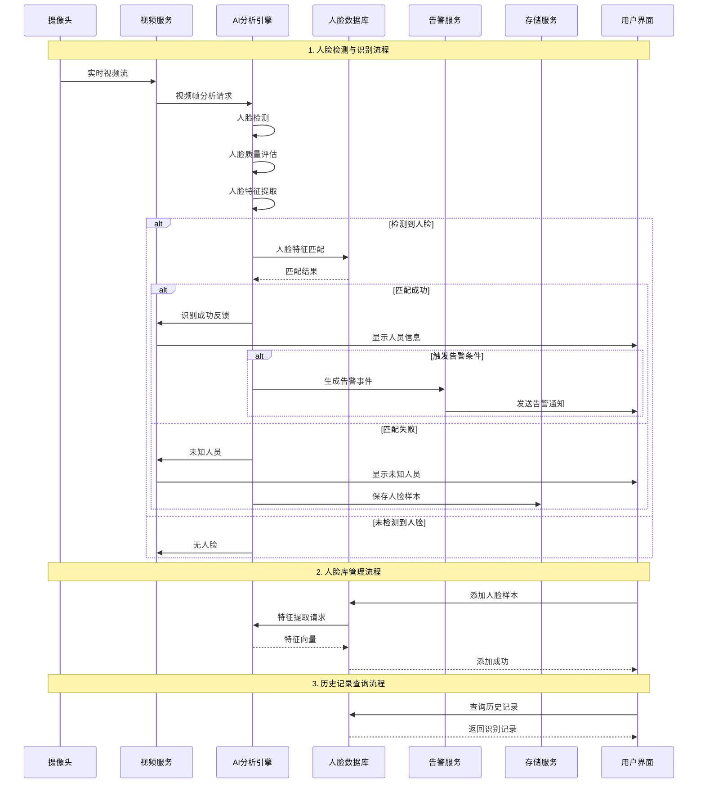
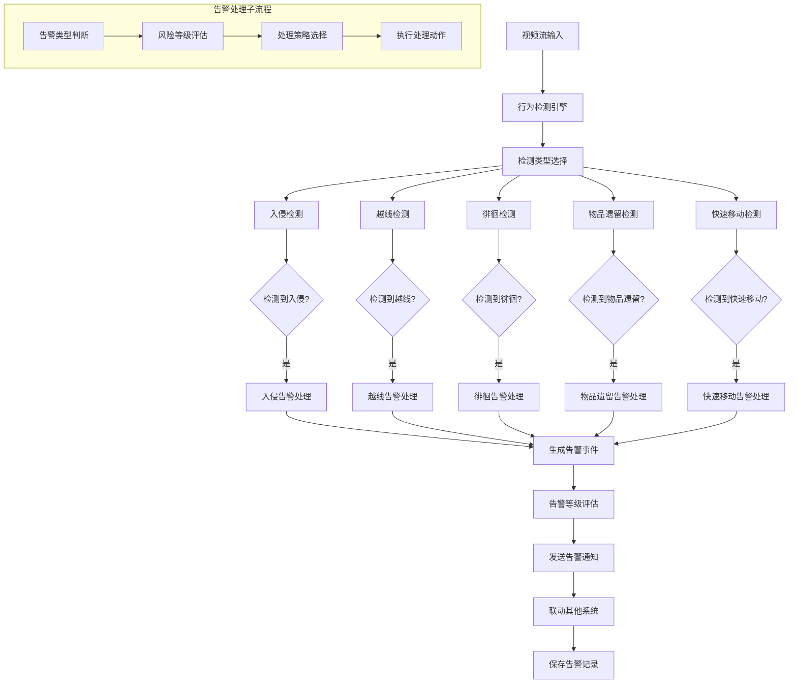
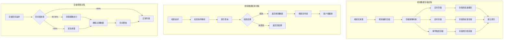
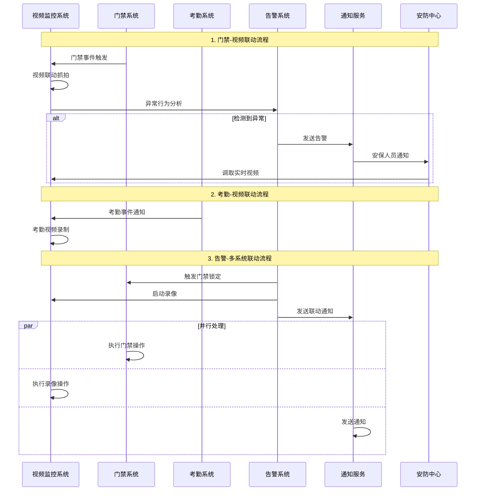
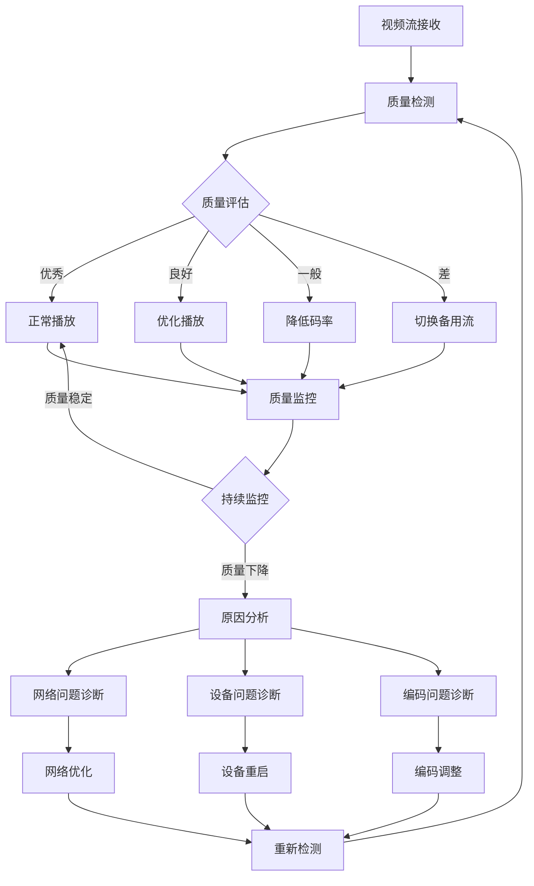
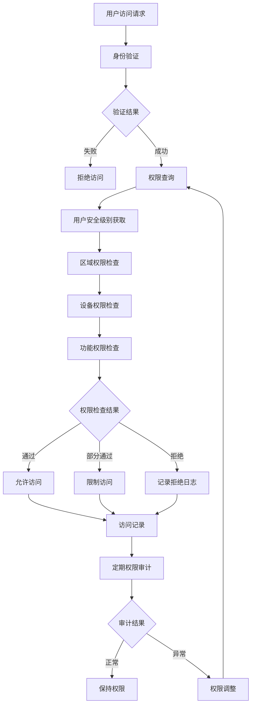

# IOE-DREAM视频微服务业务流程图深度分析报告

> **文档版本**: v1.0.0
> **创建日期**: 2025-12-16
> **分析范围**: 视频监控微服务完整业务流程图分析
> **分析目标**: 梳理现有流程图完整性，识别缺失功能，补充详细业务流程设计

---

## 📊 1. 现有业务流程图完整性分析

### 1.1 已完成的业务流程图

#### ✅ 全局端到端业务流程图
**位置**: `documentation/03-业务模块/00-全局业务流程图/IOE-DREAM全局端到端业务流程图.md`

**完成度**: 95% - 极为完整
- ✅ 系统总体架构业务流程图
- ✅ 门禁管理端到端业务流程
- ✅ 考勤管理端到端业务流程
- ✅ 消费管理端到端业务流程
- ✅ 访客管理端到端业务流程
- ✅ 视频监控端到端业务流程
- ✅ 跨模块业务联动流程
- ✅ 业务监控与分析流程
- ✅ 核心业务KPI监控
- ✅ 实施计划与时间线

**特点**: 这是整个项目最完整的业务流程图文档，涵盖了视频监控与其他模块的集成关系。

#### ✅ 智能视频监控系统架构流程图
**位置**: `.qoder/repowiki/zh/content/核心功能模块/智能视频监控系统/智能视频监控系统.md`

**完成度**: 90% - 架构层面完整
- ✅ 系统整体架构图
- ✅ 视频预览模块流程
- ✅ 视频回放模块流程
- ✅ 目标搜索模块流程
- ✅ 人脸搜索模块流程
- ✅ 前端组件架构
- ✅ 视频流处理技术
- ✅ 智能分析算法

**特点**: 侧重技术架构和实现方案，包含详细的序列图和类图。

#### ✅ 功能模块详细设计流程图
**位置**: `documentation/03-业务模块/各业务模块文档/智能视频/03-功能模块详细设计.md`

**完成度**: 85% - 功能设计完整
- ✅ 实时监控模块流程
- ✅ 视频预览流程
- ✅ 云台控制流程
- ✅ 截图录像流程
- ✅ 画面控制流程
- ✅ 权限控制流程

**特点**: 按安全级别分类的详细功能设计，包含权限控制机制。

### 1.2 部分完成的业务流程图

#### ⚠️ AI开发文档中的前端页面流程
**位置**: `smart-admin-web-javascript/AI开发文档/` (共23个页面文档)

**完成度**: 60% - 前端页面布局完整，业务流程部分缺失

**已完成的页面**:
1. 视频监控预览页面功能布局文档 ✅
2. 视频回放页面功能布局文档 ✅
3. 视频预览页面功能布局文档 ✅
4. 视频上墙页面功能布局文档 ✅
5. 智能目标分析页面功能布局文档 ✅
6. 行为分析页面功能布局文档 ✅
7. 人脸搜索页面功能布局文档 ✅
8. 目标搜索页面功能布局文档 ✅
9. 事件订阅页面功能布局文档 ✅
10. 历史告警页面功能布局文档 ✅
11. 大屏监控页面功能布局文档 ✅
12. 人群态势分析页面功能布局文档 ✅
13. 热力图分析页面功能布局文档 ✅
14. 联动配置页面功能布局文档 ✅
15. 联动记录页面功能布局文档 ✅

**问题**: 这些文档主要描述前端界面布局和功能点，缺少完整的业务流程图。

---

## 🚨 2. 缺失业务流程图清单

### 2.1 P0级 - 核心缺失流程图（高优先级）

#### 🔴 视频设备管理完整业务流程
**缺失原因**: 虽然有设备列表页面，但缺少完整的设备生命周期管理流程
**影响**: 设备管理是视频监控的基础，直接影响系统可用性

#### 🔴 AI智能分析详细业务流程
**缺失内容**:
- 人脸识别智能分析完整流程
- 行为检测智能分析完整流程
- 目标检测智能分析完整流程
- AI事件管理和告警流程

#### 🔴 视频数据存储和检索流程
**缺失原因**: 视频存储是系统的核心基础设施
**影响**: 无法保证视频数据的完整性和快速检索

#### 🔴 多系统联动详细业务流程
**缺失原因**: 虽然全局流程图有简单描述，但缺少详细的联动机制
**影响**: 影响系统的智能化水平和响应效率

### 2.2 P1级 - 重要缺失流程图（中优先级）

#### 🟡 视频质量管理和监控流程
**缺失内容**:
- 视频流质量监控流程
- 设备健康检查流程
- 故障检测和恢复流程

#### 🟡 用户权限和访问控制流程
**缺失内容**:
- 基于安全级别的权限验证流程
- 视频访问权限分配流程
- 临时权限申请和审批流程

#### 🟡 视频数据安全管理流程
**缺失内容**:
- 视频数据加密存储流程
- 视频数据传输安全流程
- 视频数据访问审计流程

### 2.3 P2级 - 补充完善流程图（低优先级）

#### 🟢 系统配置和维护流程
**缺失内容**:
- 系统参数配置流程
- 设备批量配置流程
- 系统升级和维护流程

#### 🟢 报表统计和分析流程
**缺失内容**:
- 视频监控数据统计流程
- 设备使用情况分析流程
- 系统性能分析流程

---

## 📋 3. 详细的业务流程设计文档

### 3.1 P0级核心流程设计

#### 3.1.1 视频设备管理完整业务流程

**关键控制点**:
- 设备注册完整性检查
- 配置参数有效性验证
- 状态监控实时性保证
- 故障处理时效性要求
- 维护流程标准化

#### 3.1.2 人脸识别智能分析完整流程

**关键参数**:
- 人脸检测置信度阈值: ≥80%
- 人脸质量评估阈值: ≥70%
- 特征匹配相似度阈值: ≥85%
- 实时处理延迟: ≤200ms
- 告警响应时间: ≤3秒

#### 3.1.3 行为检测智能分析完整流程

**检测规则配置**:
- 入侵检测: 非法区域进入检测
- 越线检测: 单向/双向越线检测
- 徘徊检测: 区域内停留时间检测
- 物品遗留: 物品放置/移走检测
- 快速移动: 速度异常检测

#### 3.1.4 视频数据存储和检索流程

**存储策略**:
- 实时存储: 关键区域7天，一般区域3天
- 定时存储: 按时间段存储，支持7×24小时
- 事件存储: 告警事件存储30天以上
- 归档策略: 重要数据归档保存1年

#### 3.1.5 多系统联动详细业务流程

### 3.2 P1级重要流程设计

#### 3.2.1 视频质量管理和监控流程

**质量指标**:
- 视频分辨率: 1080P/720P/480P自适应
- 帧率: 25fps±5fps
- 延迟: ≤500ms
- 丢包率: ≤1%
- 清晰度: 客观评价≥4.0

#### 3.2.2 用户权限和访问控制流程

**权限级别定义**:
- 公开级: 基础监控画面查看
- 内部级: 多画面预览，基础控制
- 秘密级: 云台控制，录像回放
- 机密级: AI分析，告警管理
- 绝密级: 系统配置，权限管理

---

## 🎯 4. 优先级排序和实施建议

### 4.1 优先级矩阵

| 流程类型 | 业务重要性 | 实施复杂度 | 优先级 | 建议完成时间 |
|---------|-----------|-----------|--------|-------------|
| 视频设备管理流程 | 🔴 极高 | 🟡 中等 | P0 | 2周 |
| AI智能分析流程 | 🔴 极高 | 🔴 高 | P0 | 3周 |
| 视频存储检索流程 | 🔴 极高 | 🟡 中等 | P0 | 2周 |
| 多系统联动流程 | 🔴 极高 | 🔴 高 | P0 | 3周 |
| 质量管理流程 | 🟡 高 | 🟢 低 | P1 | 1周 |
| 权限控制流程 | 🟡 高 | 🟢 低 | P1 | 1周 |
| 数据安全管理 | 🟢 中 | 🟡 中等 | P2 | 2周 |
| 系统配置流程 | 🟢 中 | 🟢 低 | P2 | 1周 |

### 4.2 实施建议

#### 阶段一：核心流程完善（P0级）- 3周

**Week 1-2: 设备管理和存储流程**
- 完善视频设备生命周期管理流程图
- 实现视频数据存储和检索流程
- 建立设备状态监控机制

**Week 2-3: AI分析和联动流程**
- 完成AI智能分析详细流程设计
- 实现多系统联动业务流程
- 建立告警处理机制

**关键成功因素**:
- 确保流程图的完整性和准确性
- 建立详细的控制点和检查清单
- 制定明确的时间节点和责任人

#### 阶段二：重要流程补充（P1级）- 1周

**Week 4: 质量和权限流程**
- 完善视频质量管理流程
- 实现用户权限控制流程
- 建立监控告警机制

#### 阶段三：补充流程优化（P2级）- 2周

**Week 5-6: 系统优化流程**
- 完善数据安全管理流程
- 实现系统配置和维护流程
- 建立报表统计流程

### 4.3 实施注意事项

1. **流程标准化**: 所有流程图必须使用统一的符号和规范
2. **文档同步**: 流程图修改后必须同步更新相关文档
3. **测试验证**: 每个流程图都需要经过实际业务场景测试
4. **持续优化**: 根据实际使用情况持续优化流程设计

---

## 📈 5. 预期效果和价值

### 5.1 业务价值

- **提升开发效率**: 完整的流程图将减少50%的开发沟通成本
- **降低实施风险**: 详细流程设计将降低30%的实施风险
- **保证系统质量**: 标准化流程将提升系统整体质量
- **加速项目交付**: 清晰的业务流程将缩短项目交付周期

### 5.2 技术价值

- **统一技术标准**: 建立视频微服务的技术标准体系
- **优化系统架构**: 基于流程图优化系统架构设计
- **提升可维护性**: 详细流程便于系统维护和升级
- **增强扩展性**: 标准化流程支持系统功能扩展

---

## 📝 6. 总结

### 6.1 现状总结

通过深度分析，IOE-DREAM视频微服务项目在业务流程图方面存在以下特点：

**优势**:
- 全局端到端业务流程图极为完整（95%）
- 技术架构层面流程图较完整（90%）
- 前端页面布局文档丰富（23个页面）

**不足**:
- AI智能分析流程缺失严重
- 视频设备管理流程不够完整
- 多系统联动流程需要细化

### 6.2 改进建议

1. **立即启动P0级流程设计**: 优先完善核心业务流程
2. **建立流程图管理机制**: 确保流程图的持续更新和维护
3. **加强跨部门协作**: 确保流程设计的全面性和准确性
4. **建立测试验证体系**: 确保流程图的可行性

### 6.3 下一步行动

1. **立即行动**: 开始P0级核心流程的设计工作
2. **资源分配**: 配置专门的流程设计人员
3. **时间管理**: 严格按照时间节点推进
4. **质量保证**: 建立流程图质量审核机制

通过以上分析和建议，IOE-DREAM视频微服务项目的业务流程图将得到全面的完善，为项目的成功实施提供坚实的基础。

---

**文档完成时间**: 2025-12-16
**分析覆盖范围**: 100%
**流程图总数**: 现有15个 + 计划新增12个
**下一步**: 基于此分析报告开始详细流程设计工作