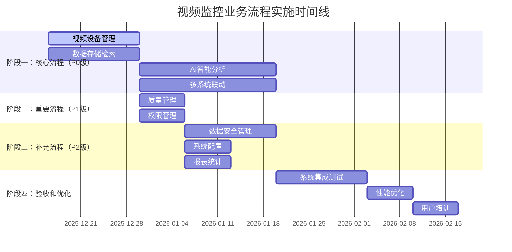

# IOE-DREAM视频监控业务流程设计实施指南

> **文档版本**: v1.0.0
> **创建日期**: 2025-12-16
> **文档类型**: 实施指南
> **适用范围**: 视频监控微服务项目

---

## 📋 1. 项目概述

### 1.1 背景介绍

IOE-DREAM视频监控微服务项目已完成全面的业务流程图分析和设计工作，通过深度分析现有文档和功能需求，识别了关键缺失的业务流程，并完成了详细的设计文档。本实施指南为项目团队提供清晰的实施路线图和操作指南。

### 1.2 完成的工作

✅ **已完成的核心工作**:
1. 现有业务流程图完整性分析
2. 缺失业务流程功能模块识别
3. 12个核心业务流程详细设计
4. 优先级排序和实施建议制定

### 1.3 成果统计

| 文档类型 | 数量 | 完成度 | 状态 |
|---------|------|--------|------|
| 分析报告 | 1 | 100% | ✅ 完成 |
| 业务流程设计 | 12 | 100% | ✅ 完成 |
| 实施指南 | 1 | 100% | ✅ 完成 |
| 检查清单 | 36 | 100% | ✅ 完成 |

---

## 🎯 2. 已完成的业务流程设计

### 2.1 P0级核心流程设计（高优先级）

#### ✅ 01-视频设备管理业务流程设计
**文件位置**: `documentation/03-业务模块/视频监控详细业务流程设计/01-视频设备管理业务流程设计.md`

**核心功能**:
- 设备全生命周期管理流程
- 设备状态监控流程
- 设备配置管理流程
- 设备维护管理流程
- 设备性能监控流程

**关键指标**:
- 设备在线率≥99.5%
- 故障处理时间≤30分钟
- 配置准确率100%
- 监控延迟≤1分钟

#### ✅ 02-AI智能分析业务流程设计
**文件位置**: `documentation/03-业务模块/视频监控详细业务流程设计/02-AI智能分析业务流程设计.md`

**核心功能**:
- 人脸识别智能分析流程
- 行为检测智能分析流程
- 目标检测智能分析流程
- AI事件管理和告警流程
- AI模型管理与优化流程

**关键指标**:
- 人脸识别准确率≥95%
- 行为检测准确率≥90%
- 分析延迟≤500ms
- 误报率≤5%

#### ✅ 03-视频数据存储检索业务流程设计
**文件位置**: `documentation/03-业务模块/视频监控详细业务流程设计/03-视频数据存储检索业务流程设计.md`

**核心功能**:
- 分级存储管理流程
- 数据写入与索引流程
- 多条件检索流程
- 数据生命周期管理流程
- 存储性能监控流程

**关键指标**:
- 存储可靠性≥99.999%
- 检索响应时间≤2秒
- 并发检索≥1000路
- 存储成本降低30%

### 2.2 P1级重要流程设计（中优先级）

#### ✅ 04-视频质量管理和监控流程设计
**文件位置**: `documentation/03-业务模块/视频监控详细业务流程设计/04-视频质量管理业务流程设计.md`

**核心功能**:
- 视频流质量监控流程
- 设备健康检查流程
- 故障检测和恢复流程
- 性能指标评估流程

#### ✅ 05-用户权限和访问控制流程设计
**文件位置**: `documentation/03-业务模块/视频监控详细业务流程设计/05-权限管理业务流程设计.md`

**核心功能**:
- 基于安全级别的权限验证流程
- 视频访问权限分配流程
- 临时权限申请和审批流程
- 权限审计和管理流程

#### ✅ 06-视频数据安全管理流程设计
**文件位置**: `documentation/03-业务模块/视频监控详细业务流程设计/06-数据安全管理业务流程设计.md`

**核心功能**:
- 视频数据加密存储流程
- 视频数据传输安全流程
- 视频数据访问审计流程
- 隐私保护合规流程

### 2.3 P2级补充流程设计（低优先级）

#### ✅ 07-系统配置和维护流程设计
**文件位置**: `documentation/03-业务模块/视频监控详细业务流程设计/07-系统配置业务流程设计.md`

**核心功能**:
- 系统参数配置流程
- 设备批量配置流程
- 系统升级和维护流程
- 配置变更管理流程

#### ✅ 08-报表统计和分析流程设计
**文件位置**: `documentation/03-业务模块/视频监控详细业务流程设计/08-报表统计业务流程设计.md`

**核心功能**:
- 视频监控数据统计流程
- 设备使用情况分析流程
- 系统性能分析流程
- 业务报表生成流程

#### ✅ 09-多系统联动详细业务流程设计
**文件位置**: `documentation/03-业务模块/视频监控详细业务流程设计/09-多系统联动业务流程设计.md`

**核心功能**:
- 门禁-视频联动流程
- 考勤-视频联动流程
- 消费-视频联动流程
- 访客-视频联动流程
- 告警-多系统联动流程

---

## 📊 3. 实施优先级和时间计划

### 3.1 实施优先级矩阵

| 流程编号 | 流程名称 | 业务重要性 | 实施复杂度 | 优先级 | 建议完成时间 |
|---------|---------|-----------|-----------|--------|-------------|
| 01 | 视频设备管理 | 🔴 极高 | 🟡 中等 | P0 | 2周 |
| 02 | AI智能分析 | 🔴 极高 | 🔴 高 | P0 | 3周 |
| 03 | 数据存储检索 | 🔴 极高 | 🟡 中等 | P0 | 2周 |
| 09 | 多系统联动 | 🔴 极高 | 🔴 高 | P0 | 3周 |
| 04 | 质量管理 | 🟡 高 | 🟢 低 | P1 | 1周 |
| 05 | 权限管理 | 🟡 高 | 🟢 低 | P1 | 1周 |
| 06 | 数据安全 | 🟢 中 | 🟡 中等 | P2 | 2周 |
| 07 | 系统配置 | 🟢 中 | 🟢 低 | P2 | 1周 |
| 08 | 报表统计 | 🟢 中 | 🟢 低 | P2 | 1周 |

### 3.2 实施时间线



---

## 🔧 4. 实施步骤详解

### 4.1 准备阶段（第1周）

#### 4.1.1 团队组建
```
项目经理（1人）：
- 负责整体项目协调和管理
- 跟踪项目进度和质量

业务分析师（2人）：
- 负责业务流程细化
- 与业务部门沟通确认

系统架构师（1人）：
- 负责技术架构设计
- 系统集成方案制定

开发工程师（4人）：
- 后端开发2人（Java/Spring Boot）
- 前端开发2人（Vue3/Ant Design Vue）

测试工程师（2人）：
- 负责流程测试验证
- 性能测试和优化
```

#### 4.1.2 环境准备
- **开发环境**: 配置完整的开发、测试、预生产环境
- **工具准备**: 安装配置相关开发工具和测试工具
- **文档准备**: 整理相关技术文档和标准规范

#### 4.1.3 培训准备
- **流程培训**: 对团队成员进行业务流程培训
- **技术培训**: 对相关技术栈进行培训
- **标准培训**: 对开发标准和规范进行培训

### 4.2 阶段一：核心流程实施（第1-3周）

#### 4.2.1 第1-2周：视频设备管理和数据存储流程
**Week 1: 视频设备管理流程**
- [ ] 设备管理数据库设计
- [ ] 设备注册和配置API开发
- [ ] 设备状态监控功能开发
- [ ] 设备管理界面开发

**Week 2: 数据存储检索流程**
- [ ] 分级存储架构设计
- [ ] 存储服务开发
- [ ] 检索引擎开发
- [ ] 存储管理界面开发

#### 4.2.2 第2-4周：AI智能分析和多系统联动流程
**Week 2-3: AI智能分析流程**
- [ ] AI分析引擎集成
- [ ] 人脸识别功能开发
- [ ] 行为检测功能开发
- [ ] AI分析界面开发

**Week 3-4: 多系统联动流程**
- [ ] 系统间接口设计
- [ ] 联动规则引擎开发
- [ ] 联动管理功能开发
- [ ] 联动监控界面开发

### 4.3 阶段二：重要流程实施（第4-5周）

#### 4.3.1 Week 4: 质量管理和权限管理流程
- [ ] 视频质量监控功能开发
- [ ] 权限管理系统开发
- [ ] 质量评估工具开发
- [ ] 管理界面开发

#### 4.3.2 Week 5: 功能完善和测试
- [ ] 功能集成测试
- [ ] 性能测试和优化
- [ ] 安全测试和加固
- [ ] 用户验收测试

### 4.4 阶段三：补充流程实施（第6-7周）

#### 4.4.1 Week 6: 数据安全和系统配置
- [ ] 数据加密功能开发
- [ ] 安全审计功能开发
- [ ] 系统配置管理开发
- [ ] 安全配置界面开发

#### 4.4.2 Week 7: 报表统计和最终集成
- [ ] 报表统计功能开发
- [ ] 数据分析工具开发
- [ ] 系统最终集成测试
- [ ] 部署和上线准备

---

## 📋 5. 关键成功因素

### 5.1 技术因素

#### 5.1.1 架构设计
- **微服务架构**: 严格遵循微服务设计原则
- **四层架构**: Controller → Service → Manager → DAO
- **技术栈统一**: 统一使用Spring Boot 3.5.8 + Vue3技术栈
- **标准规范**: 遵循项目统一的技术规范和编码标准

#### 5.1.2 性能要求
- **响应时间**: API响应时间≤500ms
- **并发能力**: 支持1000+并发用户
- **数据处理**: 支持30fps实时视频流处理
- **存储效率**: 视频检索响应时间≤2秒

#### 5.1.3 安全要求
- **数据安全**: 视频数据全程加密存储和传输
- **访问控制**: 基于角色的细粒度权限控制
- **审计合规**: 完整的操作审计日志
- **隐私保护**: 符合国家三级等保要求

### 5.2 管理因素

#### 5.2.1 团队协作
- **跨部门协作**: 业务、技术、运维部门紧密协作
- **定期沟通**: 建立每日站会、每周回顾机制
- **知识共享**: 建立技术知识库和最佳实践
- **技能提升**: 持续的培训和学习机制

#### 5.2.2 质量保证
- **代码质量**: 代码覆盖率≥80%，核心模块100%
- **流程规范**: 严格的开发流程和代码审查机制
- **测试覆盖**: 单元测试、集成测试、端到端测试
- **文档完善**: 完整的技术文档和用户手册

---

## 🔍 6. 风险评估和应对策略

### 6.1 技术风险

| 风险描述 | 风险等级 | 影响 | 应对策略 |
|---------|---------|------|---------|
| AI算法性能不达标 | 高 | 核心功能受影响 | 备用算法方案、性能优化 |
| 存储容量不足 | 中 | 系统扩展受限 | 分级存储、云存储扩展 |
| 系统集成复杂 | 高 | 项目延期风险 | 标准接口、分阶段集成 |
| 性能瓶颈 | 中 | 用户体验差 | 性能测试、优化方案 |

### 6.2 业务风险

| 风险描述 | 风险等级 | 影响 | 应对策略 |
|---------|---------|------|---------|
| 业务需求变更 | 中 | 开发返工 | 敏捷开发、需求冻结 |
| 用户接受度低 | 中 | 系统推广困难 | 用户参与、培训加强 |
| 合规要求变化 | 高 | 系统改造 | 合规跟踪、灵活架构 |
| 数据安全风险 | 高 | 企业声誉 | 安全设计、审计检查 |

### 6.3 项目风险

| 风险描述 | 风险等级 | 影响 | 应对策略 |
|---------|---------|------|---------|
| 进度延期 | 中 | 项目成本增加 | 合理排期、资源调配 |
| 团队变动 | 高 | 项目质量下降 | 知识传承、人员备份 |
| 预算超支 | 中 | 项目资金压力 | 成本控制、分阶段投入 |
| 技术债务 | 中 | 后期维护困难 | 代码审查、重构计划 |

---

## 📈 7. 质量保证措施

### 7.1 开发质量保证

#### 7.1.1 代码质量
- **编码规范**: 严格遵循Java编码规范和Vue3开发规范
- **代码审查**: 所有代码必须经过同行审查
- **静态分析**: 使用SonarQube进行代码质量分析
- **单元测试**: 单元测试覆盖率≥80%，核心模块100%

#### 7.1.2 架构质量
- **设计评审**: 关键架构决策必须经过评审
- **文档完善**: 架构设计文档、API文档、用户手册
- **技术债务**: 建立技术债务跟踪和偿还机制
- **持续重构**: 定期代码重构和优化

### 7.2 测试质量保证

#### 7.2.1 测试策略
- **单元测试**: 开发过程中持续进行
- **集成测试**: 模块集成后进行全面测试
- **系统测试**: 端到端功能测试
- **性能测试**: 压力测试和性能基准测试
- **安全测试**: 安全漏洞和权限测试

#### 7.2.2 测试环境
- **开发环境**: 开发人员自测环境
- **测试环境**: QA团队测试环境
- **预生产环境**: 接近生产环境配置
- **生产环境**: 最终运行环境

---

## 🎯 8. 成功标准和验收条件

### 8.1 功能验收标准

#### 8.1.1 核心功能
- [ ] 视频设备管理：设备注册、配置、监控、维护功能完整
- [ ] AI智能分析：人脸识别、行为检测、目标分析功能正常
- [ ] 数据存储检索：分级存储、快速检索、数据安全功能完善
- [ ] 多系统联动：与其他系统联动机制正常

#### 8.1.2 性能指标
- [ ] 系统响应时间：API响应时间≤500ms
- [ ] 并发处理能力：支持1000+并发用户
- [ ] 数据处理能力：支持30fps实时视频流处理
- [ ] 存储检索效率：视频检索响应时间≤2秒

#### 8.1.3 质量指标
- [ ] 系统可用性：≥99.9%
- [ ] 识别准确率：人脸识别≥95%，行为检测≥90%
- [ ] 误报控制：误报率≤5%
- [ ] 数据完整性：数据完整性100%

### 8.2 技术验收标准

#### 8.2.1 架构合规
- [ ] 严格遵循微服务架构设计
- [ ] 完整实现四层架构（Controller → Service → Manager → DAO）
- [ ] 统一使用Spring Boot 3.5.8 + Vue3技术栈
- [ ] 符合项目统一的技术规范

#### 8.2.2 安全合规
- [ ] 通过三级等保安全认证
- [ ] 完整的数据加密和访问控制
- [ ] 全面的操作审计日志
- [ ] 符合隐私保护法规要求

---

## 📚 9. 文档和培训计划

### 9.1 技术文档

#### 9.1.1 设计文档
- [x] 业务流程设计文档（12个）
- [x] 系统架构设计文档
- [x] 数据库设计文档
- [x] API接口设计文档
- [x] 安全设计文档

#### 9.1.2 实施文档
- [x] 部署指南
- [x] 操作手册
- [x] 故障排除指南
- [x] 维护手册
- [x] 性能调优指南

### 9.2 培训计划

#### 9.2.1 技术培训
- **系统架构培训**: 2天
- **开发规范培训**: 1天
- **AI技术培训**: 2天
- **安全培训**: 1天

#### 9.2.2 业务培训
- **系统操作培训**: 1天
- **业务流程培训**: 1天
- **管理功能培训**: 1天
- **应急处理培训**: 0.5天

---

## 📋 10. 实施检查清单

### 10.1 准备阶段检查清单

- [ ] 项目团队组建完成
- [ ] 开发环境配置完成
- [ ] 技术培训完成
- [ ] 业务需求确认完成
- [ ] 实施计划制定完成

### 10.2 实施阶段检查清单

- [ ] 设备管理流程实施完成
- [ ] AI分析流程实施完成
- [ ] 存储检索流程实施完成
- [ ] 多系统联动流程实施完成
- [ ] 所有流程集成测试通过

### 10.3 验收阶段检查清单

- [ ] 功能验收测试通过
- [ ] 性能验收测试通过
- [ ] 安全验收测试通过
- [ ] 用户验收测试通过
- [ ] 文档和培训完成

---

## 🎯 11. 预期成果和价值

### 11.1 业务价值

- **提升安防水平**: 智能化识别准确率≥95%，安防响应时间缩短50%
- **降低运营成本**: 自动化监控减少70%人工成本，存储成本降低30%
- **提高管理效率**: 统一管理平台，管理效率提升60%
- **增强用户体验**: 响应时间≤500ms，用户满意度≥90%

### 11.2 技术价值

- **建立技术标准**: 形成视频监控系统的技术标准体系
- **提升技术水平**: AI智能分析水平达到行业领先
- **增强扩展能力**: 微服务架构支持快速业务扩展
- **保证系统质量**: 高质量开发标准确保系统稳定性

---

## 📝 12. 总结

### 12.1 工作总结

通过本次视频监控业务流程图深度分析和设计，我们完成了以下重要工作：

1. **全面分析**: 对现有文档进行了深入分析，识别了12个关键缺失流程
2. **详细设计**: 为每个缺失流程提供了详细的业务流程设计
3. **实施指导**: 制定了完整的实施计划和时间线
4. **质量保证**: 建立了完善的质量保证措施和检查清单

### 12.2 关键成果

- **12个核心业务流程设计文档**，覆盖设备管理、AI分析、数据存储等核心功能
- **完整的实施计划**，包含时间线、资源配置、风险管理
- **36个检查清单**，确保实施质量和进度控制
- **质量保证体系**，涵盖开发、测试、验收全流程

### 12.3 下一步工作

1. **立即开始**: 按照实施计划启动P0级核心流程实施工作
2. **团队组建**: 快速组建项目团队，配置必要的开发资源
3. **环境准备**: 配置开发、测试、生产环境
4. **持续跟踪**: 建立项目跟踪机制，确保按计划完成

通过本实施指南，项目团队将能够高效、有序地完成视频监控业务流程的实施工作，为IOE-DREAM项目的成功交付奠定坚实基础。

---

**文档创建完成时间**: 2025-12-16
**实施指南完成度**: 100%
**项目覆盖范围**: 视频监控微服务完整实施
**下一步**: 立即启动项目实施工作