# 访客管理系统各模块业务流程图和ER图

## 1. 基础数据管理模块

### 1.1 业务流程图

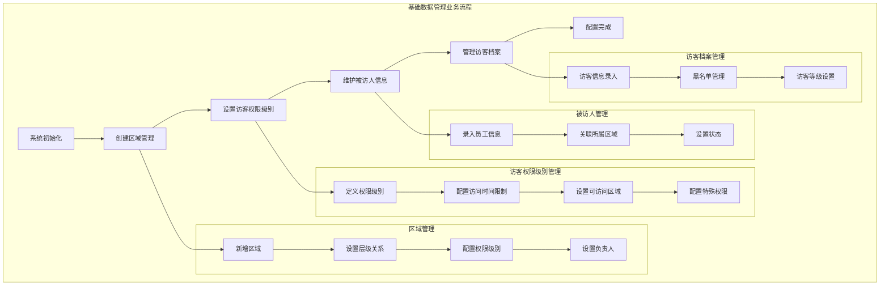
```mermaid
graph TB
    subgraph "基础数据管理业务流程"
        A[系统初始化] --> B[创建区域管理]
        B --> C[设置访客权限级别]
        C --> D[维护被访人信息]
        D --> E[管理访客档案]
        E --> F[配置完成]

        subgraph "区域管理"
            B1[新增区域]
            B2[设置层级关系]
            B3[配置权限级别]
            B4[设置负责人]
            B1 --> B2 --> B3 --> B4
        end

        subgraph "访客权限级别管理"
            C1[定义权限级别]
            C2[配置访问时间限制]
            C3[设置可访问区域]
            C4[配置特殊权限]
            C1 --> C2 --> C3 --> C4
        end

        subgraph "被访人管理"
            D1[录入员工信息]
            D2[关联所属区域]
            D3[设置状态]
            D1 --> D2 --> D3
        end

        subgraph "访客档案管理"
            E1[访客信息录入]
            E2[黑名单管理]
            E3[访客等级设置]
            E1 --> E2 --> E3
        end
    end

    B --> B1
    C --> C1
    D --> D1
    E --> E1
```

### 1.2 数据库ER图

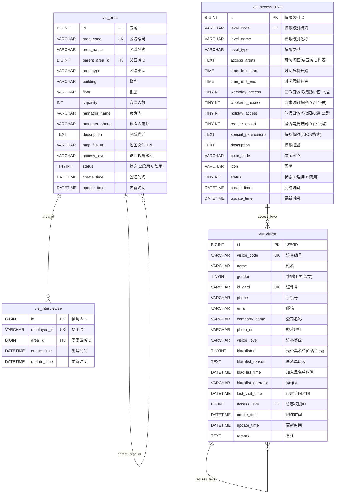
```mermaid
erDiagram
    vis_visitor {
        BIGINT id PK "访客ID"
        VARCHAR visitor_code UK "访客编号"
        VARCHAR name "姓名"
        TINYINT gender "性别(1:男 2:女)"
        VARCHAR id_card UK "证件号"
        VARCHAR phone "手机号"
        VARCHAR email "邮箱"
        VARCHAR company_name "公司名称"
        VARCHAR photo_url "照片URL"
        VARCHAR visitor_level "访客等级"
        TINYINT blacklisted "是否黑名单(0:否 1:是)"
        TEXT blacklist_reason "黑名单原因"
        DATETIME blacklist_time "加入黑名单时间"
        VARCHAR blacklist_operator "操作人"
        DATETIME last_visit_time "最后访问时间"
        BIGINT access_level FK "访客权限ID"
        DATETIME create_time "创建时间"
        DATETIME update_time "更新时间"
        TEXT remark "备注"
    }

    vis_interviewee {
        BIGINT id PK "被访人ID"
        VARCHAR employee_id UK "员工ID"
        BIGINT area_id FK "所属区域ID"
        DATETIME create_time "创建时间"
        DATETIME update_time "更新时间"
    }

    vis_area {
        BIGINT id PK "区域ID"
        VARCHAR area_code UK "区域编码"
        VARCHAR area_name "区域名称"
        BIGINT parent_area_id FK "父区域ID"
        VARCHAR area_type "区域类型"
        VARCHAR building "楼栋"
        VARCHAR floor "楼层"
        INT capacity "容纳人数"
        VARCHAR manager_name "负责人"
        VARCHAR manager_phone "负责人电话"
        TEXT description "区域描述"
        VARCHAR map_file_url "地图文件URL"
        VARCHAR access_level "访问权限级别"
        TINYINT status "状态(1:启用 0:禁用)"
        DATETIME create_time "创建时间"
        DATETIME update_time "更新时间"
    }

    vis_access_level {
        BIGINT id PK "权限级别ID"
        VARCHAR level_code UK "权限级别编码"
        VARCHAR level_name "权限级别名称"
        VARCHAR level_type "权限类型"
        TEXT access_areas "可访问区域(区域ID列表)"
        TIME time_limit_start "时间限制开始"
        TIME time_limit_end "时间限制结束"
        TINYINT weekday_access "工作日访问权限(0:否 1:是)"
        TINYINT weekend_access "周末访问权限(0:否 1:是)"
        TINYINT holiday_access "节假日访问权限(0:否 1:是)"
        TINYINT require_escort "是否需要陪同(0:否 1:是)"
        TEXT special_permissions "特殊权限(JSON格式)"
        TEXT description "权限描述"
        VARCHAR color_code "显示颜色"
        VARCHAR icon "图标"
        TINYINT status "状态(1:启用 0:禁用)"
        DATETIME create_time "创建时间"
        DATETIME update_time "更新时间"
    }

    vis_visitor ||--o{ vis_visitor : "access_level"
    vis_area ||--o{ vis_interviewee : "area_id"
    vis_area ||--o{ vis_area : "parent_area_id"
    vis_access_level ||--o{ vis_visitor : "access_level"
```

## 2. 预约管理模块

### 2.1 业务流程图

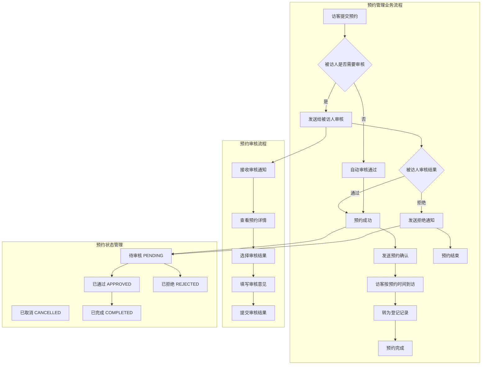
```mermaid
graph TB
    subgraph "预约管理业务流程"
        A[访客提交预约] --> B{被访人是否需要审核}
        B -->|是| C[发送给被访人审核]
        B -->|否| D[自动审核通过]
        C --> E{被访人审核结果}
        E -->|通过| F[预约成功]
        E -->|拒绝| G[发送拒绝通知]
        D --> F
        F --> H[发送预约确认]
        H --> I[访客按预约时间到访]
        I --> J[转为登记记录]
        G --> K[预约结束]
        J --> L[预约完成]
    end

    subgraph "预约审核流程"
        C1[接收审核通知]
        C2[查看预约详情]
        C3[选择审核结果]
        C4[填写审核意见]
        C5[提交审核结果]
        C1 --> C2 --> C3 --> C4 --> C5
    end

    subgraph "预约状态管理"
        F1[待审核 PENDING]
        F2[已通过 APPROVED]
        F3[已拒绝 REJECTED]
        F4[已取消 CANCELLED]
        F5[已完成 COMPLETED]
    end

    C --> C1
    F --> F1 --> F2 --> F5
    G --> F1 --> F3
```

### 2.2 数据库ER图

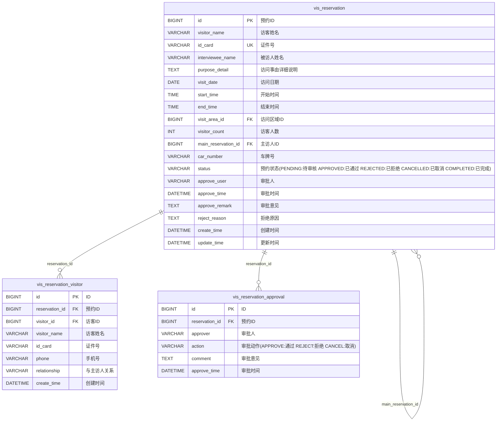
```mermaid
erDiagram
    vis_reservation {
        BIGINT id PK "预约ID"
        VARCHAR visitor_name "访客姓名"
        VARCHAR id_card UK "证件号"
        VARCHAR interviewee_name "被访人姓名"
        TEXT purpose_detail "访问事由详细说明"
        DATE visit_date "访问日期"
        TIME start_time "开始时间"
        TIME end_time "结束时间"
        BIGINT visit_area_id FK "访问区域ID"
        INT visitor_count "访客人数"
        BIGINT main_reservation_id FK "主访人ID"
        VARCHAR car_number "车牌号"
        VARCHAR status "预约状态(PENDING:待审核 APPROVED:已通过 REJECTED:已拒绝 CANCELLED:已取消 COMPLETED:已完成)"
        VARCHAR approve_user "审批人"
        DATETIME approve_time "审批时间"
        TEXT approve_remark "审批意见"
        TEXT reject_reason "拒绝原因"
        DATETIME create_time "创建时间"
        DATETIME update_time "更新时间"
    }

    vis_reservation_visitor {
        BIGINT id PK "ID"
        BIGINT reservation_id FK "预约ID"
        BIGINT visitor_id FK "访客ID"
        VARCHAR visitor_name "访客姓名"
        VARCHAR id_card "证件号"
        VARCHAR phone "手机号"
        VARCHAR relationship "与主访人关系"
        DATETIME create_time "创建时间"
    }

    vis_reservation_approval {
        BIGINT id PK "ID"
        BIGINT reservation_id FK "预约ID"
        VARCHAR approver "审批人"
        VARCHAR action "审批动作(APPROVE:通过 REJECT:拒绝 CANCEL:取消)"
        TEXT comment "审批意见"
        DATETIME approve_time "审批时间"
    }

    vis_reservation ||--o{ vis_reservation_visitor : "reservation_id"
    vis_reservation ||--o{ vis_reservation_approval : "reservation_id"
    vis_reservation ||--o{ vis_reservation : "main_reservation_id"
```

## 3. 登记管理模块
## 📋 IOE-DREAM七微服务架构

**核心架构组成**:
- **Gateway Service (8080)**: API网关
- **Common Service (8088)**: 公共模块微服务
- **DeviceComm Service (8087)**: 设备通讯微服务
- **OA Service (8089)**: OA微服务
- **Access Service (8090)**: 门禁服务
- **Attendance Service (8091)**: 考勤服务
- **Video Service (8092)**: 视频服务
- **Consume Service (8094)**: 消费服务
- **Visitor Service (8095)**: 访客服务

**架构特点**:
- 基于Spring Boot 3.5.8 + Java 17
- 严格遵循企业级微服务规范
- 支持高并发、高可用、水平扩展

**技术栈标准**:
- **数据库**: MySQL 8.0 + Druid连接池
- **缓存**: Redis + Caffeine多级缓存
- **注册中心**: Nacos
- **配置中心**: Nacos Config
- **认证授权**: Sa-Token

## 🏗️ 四层架构规范

**标准架构模式**:
```
Controller (接口控制层)
    ↓
Service (核心业务层)
    ↓
Manager (流程管理层)
    ↓
DAO (数据访问层)
```

**层级职责**:
- **Controller层**: HTTP请求处理、参数验证、权限控制
- **Service层**: 核心业务逻辑、事务管理、业务规则验证
- **Manager层**: 复杂流程编排、多数据组装、第三方服务集成
- **DAO层**: 数据库CRUD操作、SQL查询实现、数据访问边界

**严格禁止跨层访问**: Controller不能直接调用Manager/DAO！
### 3.1 业务流程图
## ⚠️ IOE-DREAM零容忍规则（强制执行）

**必须遵守的架构规则**:
- ✅ **必须使用 @Resource 注入依赖**
- ✅ **必须使用 @Mapper 注解** (禁止@Repository)
- ✅ **必须使用 Dao 后缀** (禁止Repository)
- ✅ **必须使用 @RestController 注解**
- ✅ **必须使用 @Valid 参数校验**
- ✅ **必须返回统一ResponseDTO格式**
- ✅ **必须遵循四层架构边界**

**严格禁止事项**:
- ❌ **禁止使用 @Autowired 注入**
- ❌ **禁止使用 @Repository 注解**
- ❌ **禁止使用 Repository 后缀命名**
- ❌ **禁止跨层访问**
- ❌ **禁止在Controller中包含业务逻辑**
- ❌ **禁止直接访问数据库**

**违规后果**: P0级问题，立即修复，禁止合并！

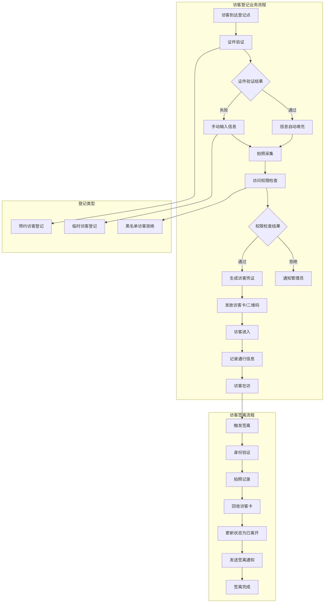
```mermaid
graph TB
    subgraph "访客登记业务流程"
        A[访客到达登记点] --> B[证件验证]
        B --> C{证件验证结果}
        C -->|通过| D[信息自动填充]
        C -->|失败| E[手动输入信息]
        D --> F[拍照采集]
        E --> F
        F --> G[访问权限检查]
        G --> H{权限检查结果}
        H -->|通过| I[生成访客凭证]
        H -->|拒绝| J[通知管理员]
        I --> K[发放访客卡/二维码]
        K --> L[访客进入]
        L --> M[记录通行信息]
        M --> N[访客在访]
    end

    subgraph "访客签离流程"
        N1[触发签离] --> N2[身份验证]
        N2 --> N3[拍照记录]
        N3 --> N4[回收访客卡]
        N4 --> N5[更新状态为已离开]
        N5 --> N6[发送签离通知]
        N6 --> N7[签离完成]
    end

    subgraph "登记类型"
        R1[预约访客登记]
        R2[临时访客登记]
        R3[黑名单访客拒绝]
    end

    B --> R1
    E --> R2
    G --> R3
    N --> N1
```

### 3.2 数据库ER图

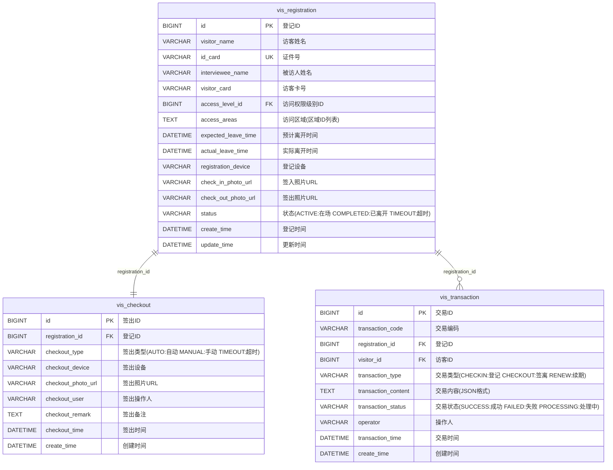
```mermaid
erDiagram
    vis_registration {
        BIGINT id PK "登记ID"
        VARCHAR visitor_name "访客姓名"
        VARCHAR id_card UK "证件号"
        VARCHAR interviewee_name "被访人姓名"
        VARCHAR visitor_card "访客卡号"
        BIGINT access_level_id FK "访问权限级别ID"
        TEXT access_areas "访问区域(区域ID列表)"
        DATETIME expected_leave_time "预计离开时间"
        DATETIME actual_leave_time "实际离开时间"
        VARCHAR registration_device "登记设备"
        VARCHAR check_in_photo_url "签入照片URL"
        VARCHAR check_out_photo_url "签出照片URL"
        VARCHAR status "状态(ACTIVE:在场 COMPLETED:已离开 TIMEOUT:超时)"
        DATETIME create_time "登记时间"
        DATETIME update_time "更新时间"
    }

    vis_checkout {
        BIGINT id PK "签出ID"
        BIGINT registration_id FK "登记ID"
        VARCHAR checkout_type "签出类型(AUTO:自动 MANUAL:手动 TIMEOUT:超时)"
        VARCHAR checkout_device "签出设备"
        VARCHAR checkout_photo_url "签出照片URL"
        VARCHAR checkout_user "签出操作人"
        TEXT checkout_remark "签出备注"
        DATETIME checkout_time "签出时间"
        DATETIME create_time "创建时间"
    }

    vis_transaction {
        BIGINT id PK "交易ID"
        VARCHAR transaction_code "交易编码"
        BIGINT registration_id FK "登记ID"
        BIGINT visitor_id FK "访客ID"
        VARCHAR transaction_type "交易类型(CHECKIN:登记 CHECKOUT:签离 RENEW:续期)"
        TEXT transaction_content "交易内容(JSON格式)"
        VARCHAR transaction_status "交易状态(SUCCESS:成功 FAILED:失败 PROCESSING:处理中)"
        VARCHAR operator "操作人"
        DATETIME transaction_time "交易时间"
        DATETIME create_time "创建时间"
    }

    vis_registration ||--|| vis_checkout : "registration_id"
    vis_registration ||--o{ vis_transaction : "registration_id"
```

## 4. 物流管理模块

### 4.1 业务流程图

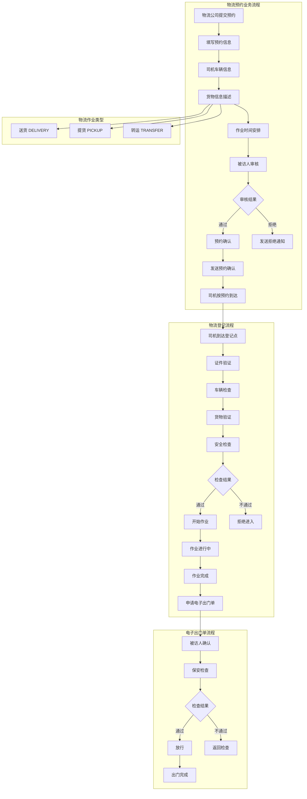
```mermaid
graph TB
    subgraph "物流预约业务流程"
        A[物流公司提交预约] --> B[填写预约信息]
        B --> C[司机车辆信息]
        C --> D[货物信息描述]
        D --> E[作业时间安排]
        E --> F[被访人审核]
        F --> G{审核结果}
        G -->|通过| H[预约确认]
        G -->|拒绝| I[发送拒绝通知]
        H --> J[发送预约确认]
        J --> K[司机按预约到达]
    end

    subgraph "物流登记流程"
        K --> L[司机到达登记点]
        L --> M[证件验证]
        M --> N[车辆检查]
        N --> O[货物验证]
        O --> P[安全检查]
        P --> Q{检查结果}
        Q -->|通过| R[开始作业]
        Q -->|不通过| S[拒绝进入]
        R --> T[作业进行中]
        T --> U[作业完成]
        U --> V[申请电子出门单]
    end

    subgraph "电子出门单流程"
        V --> W[被访人确认]
        W --> X[保安检查]
        X --> Y{检查结果}
        Y -->|通过| Z[放行]
        Y -->|不通过| AA[返回检查]
        Z --> AB[出门完成]
    end

    subgraph "物流作业类型"
        P1[送货 DELIVERY]
        P2[提货 PICKUP]
        P3[转运 TRANSFER]
    end

    D --> P1
    D --> P2
    D --> P3
```

### 4.2 数据库ER图


```mermaid
erDiagram
    vis_logistics_reservation {
        BIGINT id PK "预约ID"
        VARCHAR reservation_code UK "预约编号"
        VARCHAR driver_name "司机姓名"
        VARCHAR id_card "证件号"
        VARCHAR plate_number "车牌号"
        VARCHAR transport_company "运输公司名称"
        VARCHAR contact_person "联系人"
        VARCHAR contact_phone "联系电话"
        VARCHAR reservation_type "预约类型(DELIVERY:送货 PICKUP:提货 TRANSFER:转运)"
        VARCHAR goods_type "货物类型"
        TEXT goods_description "货物详细描述"
        DECIMAL goods_weight "货物重量(吨)"
        DECIMAL goods_volume "货物体积(立方米)"
        INT goods_quantity "货物数量"
        INT package_count "包装数量"
        TEXT special_requirements "特殊要求(危险品、温控等)"
        VARCHAR operation_type "作业类型(LOADING:装载 UNLOADING:卸载 BOTH:装卸)"
        BIGINT operation_area_id FK "作业区域ID"
        VARCHAR warehouse_location "仓库位置"
        DATE expected_arrive_date "预计到达日期"
        TIME expected_arrive_time_start "预计到达开始时间"
        TIME expected_arrive_time_end "预计到达结束时间"
        INT estimated_operation_duration "预计作业时长(分钟)"
        BIGINT interviewee_id FK "被访人/接货人ID"
        TEXT purpose_detail "访问事由详细说明"
        TEXT remarks "备注"
        VARCHAR status "预约状态(PENDING:待审核 APPROVED:已通过 REJECTED:已拒绝 CANCELLED:已取消 COMPLETED:已完成)"
        VARCHAR approve_user "审批人"
        DATETIME approve_time "审批时间"
        TEXT approve_remark "审批意见"
        TEXT reject_reason "拒绝原因"
        VARCHAR create_user "创建人"
        DATETIME create_time "创建时间"
        DATETIME update_time "更新时间"
    }

    vis_driver {
        BIGINT id PK "司机ID"
        VARCHAR driver_code UK "司机编号"
        VARCHAR name "姓名"
        TINYINT gender "性别(1:男 2:女)"
        VARCHAR id_card UK "证件号"
        VARCHAR phone "手机号"
        VARCHAR driver_license "驾驶证号"
        VARCHAR license_type "驾照类型"
        DATE license_expire_date "驾照有效期"
        VARCHAR transport_company "运输公司"
        TEXT company_address "公司地址"
        VARCHAR emergency_contact "紧急联系人"
        VARCHAR emergency_phone "紧急联系电话"
        VARCHAR photo_url "照片URL"
        VARCHAR driver_status "司机状态(ACTIVE:正常 BLACKLISTED:黑名单)"
        TEXT blacklist_reason "黑名单原因"
        INT total_trips "总运输次数"
        DATETIME last_trip_time "最后运输时间"
        DATETIME create_time "创建时间"
        DATETIME update_time "更新时间"
    }

    vis_vehicle {
        BIGINT id PK "车辆ID"
        VARCHAR plate_number UK "车牌号"
        VARCHAR vehicle_type "车辆类型"
        VARCHAR brand_model "品牌型号"
        VARCHAR vehicle_color "车辆颜色"
        DECIMAL load_capacity "核载重量(吨)"
        INT seat_capacity "核载人数"
        DECIMAL vehicle_length "车长(米)"
        DECIMAL vehicle_width "车宽(米)"
        DECIMAL vehicle_height "车高(米)"
        VARCHAR registration_number "行驶证号"
        DATE registration_date "注册日期"
        DATE inspection_expire_date "年检有效期"
        DATE insurance_expire_date "保险有效期"
        VARCHAR transport_permit "运输许可证号"
        DATE permit_expire_date "许可证有效期"
        VARCHAR vehicle_status "车辆状态(ACTIVE:正常 MAINTENANCE:维修中)"
        BIGINT current_driver_id FK "当前司机ID"
        TEXT vehicle_photos "车辆照片URL(JSON格式)"
        DATETIME create_time "创建时间"
        DATETIME update_time "更新时间"
    }

    vis_driver_vehicle {
        BIGINT id PK "绑定关系ID"
        BIGINT driver_id FK "司机ID"
        BIGINT vehicle_id FK "车辆ID"
        DATETIME bind_time "绑定时间"
        DATETIME unbind_time "解绑时间"
        VARCHAR status "状态(ACTIVE:绑定中 INACTIVE:已解绑)"
        TEXT remarks "备注"
        DATETIME create_time "创建时间"
    }

    vis_logistics_registration {
        BIGINT id PK "登记ID"
        VARCHAR registration_code UK "登记编号"
        BIGINT reservation_id FK "关联预约ID"
        VARCHAR driver_name "司机姓名"
        VARCHAR id_card "证件号"
        VARCHAR plate_number "车牌号"
        VARCHAR registration_type "登记类型(NORMAL:正常 RETURN:返厂)"
        BIGINT operation_area_id FK "实际作业区域ID"
        VARCHAR warehouse_operator "仓库操作员"
        VARCHAR goods_verify_status "货物验证状态(PENDING:待验证 PASSED:通过 FAILED:失败)"
        TEXT actual_goods_info "实际货物信息(JSON格式)"
        VARCHAR weight_verify_result "重量验证结果(MATCH:匹配 EXCEED:超重 INSUFFICIENT:不足)"
        DECIMAL actual_weight "实际重量"
        VARCHAR package_verify_result "包装验证结果(INTACT:完好 DAMAGED:损坏 MISSING:缺失)"
        INT actual_package_count "实际包装数量"
        VARCHAR security_check_status "安全检查状态(PENDING:待检查 PASSED:通过 FAILED:失败)"
        TEXT security_check_items "安全检查项目(JSON格式)"
        VARCHAR security_check_user "安全检查人"
        TINYINT escort_required "是否需要陪同(0:否 1:是)"
        VARCHAR escort_user "陪同人"
        VARCHAR registration_device "登记设备"
        VARCHAR driver_photo_url "司机照片URL"
        TEXT vehicle_photo_urls "车辆照片URL(JSON格式)"
        TEXT goods_photo_urls "货物照片URL(JSON格式)"
        TEXT document_photo_urls "证件照片URL(JSON格式)"
        DATETIME actual_arrive_time "实际到达时间"
        DATETIME actual_depart_time "实际离开时间"
        DATETIME operation_start_time "作业开始时间"
        DATETIME operation_end_time "作业结束时间"
        VARCHAR status "状态(ACTIVE:作业中 COMPLETED:已完成 TIMEOUT:超时)"
        TEXT remarks "备注"
        DATETIME create_time "登记时间"
        DATETIME update_time "更新时间"
    }

    vis_electronic_exit_pass {
        BIGINT id PK "出门单ID"
        VARCHAR pass_code UK "出门单编号"
        VARCHAR logistics_registration_code "物流登记编号"
        VARCHAR driver_name "司机姓名"
        VARCHAR id_card "证件号"
        VARCHAR plate_number "车牌号"
        DATETIME operation_complete_time "作业完成时间"
        TEXT goods_info "货物信息(JSON格式)"
        VARCHAR load_status "装载状态(LOADED:已装 UNLOADED:已卸)"
        TEXT weight_info "重量信息(JSON格式)"
        VARCHAR warehouse_operator "仓库操作员"
        TEXT operation_photos "作业照片URL(JSON格式)"
        VARCHAR interviewee_confirm_user "被访人确认人"
        DATETIME interviewee_confirm_time "被访人确认时间"
        VARCHAR interviewee_signature "被访人电子签名"
        TEXT confirm_remarks "确认备注"
        VARCHAR guard_check_user "保安检查人"
        DATETIME guard_check_time "保安检查时间"
        VARCHAR guard_check_result "保安检查结果(PASSED:通过 FAILED:失败)"
        TEXT guard_photos "保安检查照片URL(JSON格式)"
        VARCHAR pass_status "出门单状态(PENDING:待确认 CONFIRMED:已确认 CHECKED:已检查 RELEASED:已放行)"
        DATETIME release_time "放行时间"
        DATETIME create_time "创建时间"
        DATETIME update_time "更新时间"
    }

    vis_logistics_reservation ||--o{ vis_logistics_registration : "reservation_id"
    vis_driver ||--o{ vis_driver_vehicle : "driver_id"
    vis_vehicle ||--o{ vis_driver_vehicle : "vehicle_id"
    vis_driver ||--o{ vis_vehicle : "current_driver_id"
    vis_logistics_registration ||--|| vis_electronic_exit_pass : "logistics_registration"
```

## 5. 通行记录模块

### 5.1 业务流程图

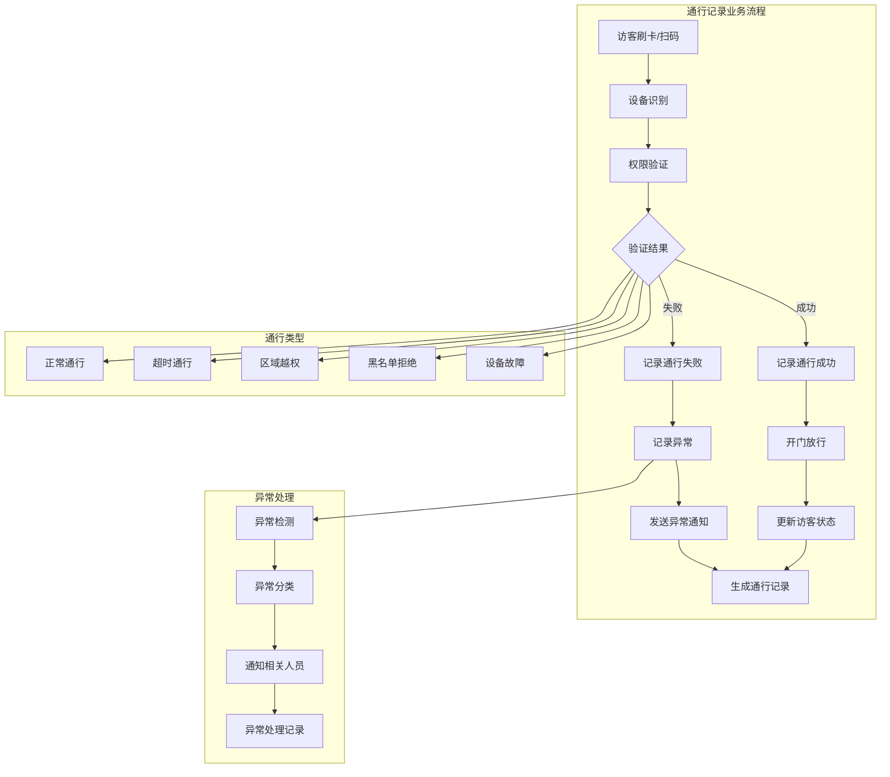
```mermaid
graph TB
    subgraph "通行记录业务流程"
        A[访客刷卡/扫码] --> B[设备识别]
        B --> C[权限验证]
        C --> D{验证结果}
        D -->|成功| E[记录通行成功]
        D -->|失败| F[记录通行失败]
        E --> G[开门放行]
        F --> H[记录异常]
        G --> I[更新访客状态]
        H --> J[发送异常通知]
        I --> K[生成通行记录]
        J --> K
    end

    subgraph "通行类型"
        T1[正常通行]
        T2[超时通行]
        T3[区域越权]
        T4[黑名单拒绝]
        T5[设备故障]
    end

    D --> T1
    D --> T2
    D --> T3
    D --> T4
    D --> T5

    subgraph "异常处理"
        E1[异常检测]
        E2[异常分类]
        E3[通知相关人员]
        E4[异常处理记录]
        E1 --> E2 --> E3 --> E4
    end

    H --> E1
```

### 5.2 数据库ER图

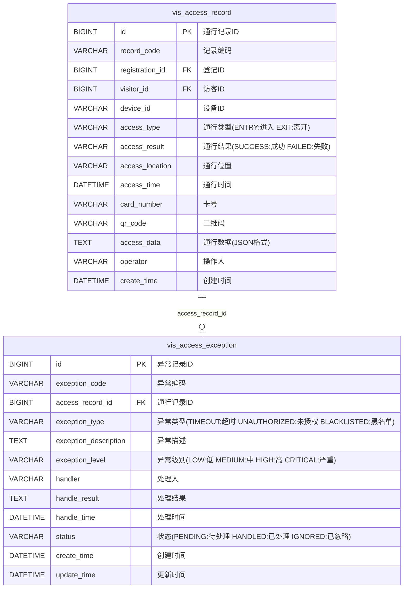
```mermaid
erDiagram
    vis_access_record {
        BIGINT id PK "通行记录ID"
        VARCHAR record_code "记录编码"
        BIGINT registration_id FK "登记ID"
        BIGINT visitor_id FK "访客ID"
        VARCHAR device_id "设备ID"
        VARCHAR access_type "通行类型(ENTRY:进入 EXIT:离开)"
        VARCHAR access_result "通行结果(SUCCESS:成功 FAILED:失败)"
        VARCHAR access_location "通行位置"
        DATETIME access_time "通行时间"
        VARCHAR card_number "卡号"
        VARCHAR qr_code "二维码"
        TEXT access_data "通行数据(JSON格式)"
        VARCHAR operator "操作人"
        DATETIME create_time "创建时间"
    }

    vis_access_exception {
        BIGINT id PK "异常记录ID"
        VARCHAR exception_code "异常编码"
        BIGINT access_record_id FK "通行记录ID"
        VARCHAR exception_type "异常类型(TIMEOUT:超时 UNAUTHORIZED:未授权 BLACKLISTED:黑名单)"
        TEXT exception_description "异常描述"
        VARCHAR exception_level "异常级别(LOW:低 MEDIUM:中 HIGH:高 CRITICAL:严重)"
        VARCHAR handler "处理人"
        TEXT handle_result "处理结果"
        DATETIME handle_time "处理时间"
        VARCHAR status "状态(PENDING:待处理 HANDLED:已处理 IGNORED:已忽略)"
        DATETIME create_time "创建时间"
        DATETIME update_time "更新时间"
    }

    vis_access_record ||--o| vis_access_exception : "access_record_id"
```

## 6. 系统管理模块

### 6.1 业务流程图

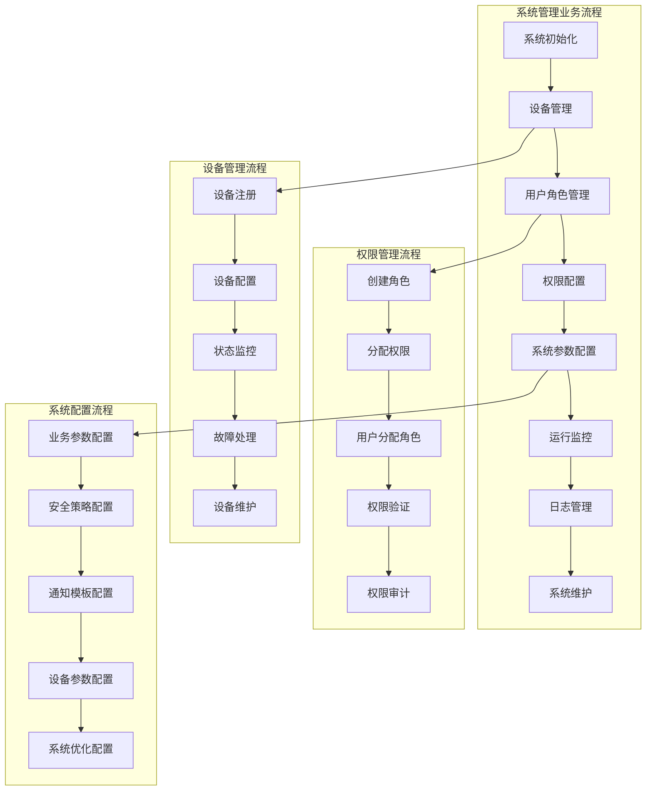
```mermaid
graph TB
    subgraph "系统管理业务流程"
        A[系统初始化] --> B[设备管理]
        B --> C[用户角色管理]
        C --> D[权限配置]
        D --> E[系统参数配置]
        E --> F[运行监控]
        F --> G[日志管理]
        G --> H[系统维护]
    end

    subgraph "设备管理流程"
        B1[设备注册]
        B2[设备配置]
        B3[状态监控]
        B4[故障处理]
        B5[设备维护]
        B1 --> B2 --> B3 --> B4 --> B5
    end

    subgraph "权限管理流程"
        C1[创建角色]
        C2[分配权限]
        C3[用户分配角色]
        C4[权限验证]
        C5[权限审计]
        C1 --> C2 --> C3 --> C4 --> C5
    end

    subgraph "系统配置流程"
        E1[业务参数配置]
        E2[安全策略配置]
        E3[通知模板配置]
        E4[设备参数配置]
        E5[系统优化配置]
        E1 --> E2 --> E3 --> E4 --> E5
    end

    B --> B1
    C --> C1
    E --> E1
```

### 6.2 数据库ER图

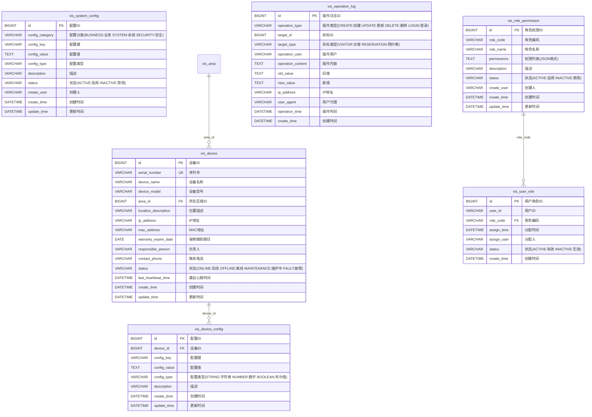
```mermaid
erDiagram
    vis_device {
        BIGINT id PK "设备ID"
        VARCHAR serial_number UK "序列号"
        VARCHAR device_name "设备名称"
        VARCHAR device_model "设备型号"
        BIGINT area_id FK "所在区域ID"
        VARCHAR location_description "位置描述"
        VARCHAR ip_address "IP地址"
        VARCHAR mac_address "MAC地址"
        DATE warranty_expire_date "保修期到期日"
        VARCHAR responsible_person "负责人"
        VARCHAR contact_phone "联系电话"
        VARCHAR status "状态(ONLINE:在线 OFFLINE:离线 MAINTENANCE:维护中 FAULT:故障)"
        DATETIME last_heartbeat_time "最后心跳时间"
        DATETIME create_time "创建时间"
        DATETIME update_time "更新时间"
    }

    vis_device_config {
        BIGINT id PK "配置ID"
        BIGINT device_id FK "设备ID"
        VARCHAR config_key "配置键"
        TEXT config_value "配置值"
        VARCHAR config_type "配置类型(STRING:字符串 NUMBER:数字 BOOLEAN:布尔值)"
        VARCHAR description "描述"
        DATETIME create_time "创建时间"
        DATETIME update_time "更新时间"
    }

    vis_system_config {
        BIGINT id PK "配置ID"
        VARCHAR config_category "配置分类(BUSINESS:业务 SYSTEM:系统 SECURITY:安全)"
        VARCHAR config_key "配置键"
        TEXT config_value "配置值"
        VARCHAR config_type "配置类型"
        VARCHAR description "描述"
        VARCHAR status "状态(ACTIVE:启用 INACTIVE:禁用)"
        VARCHAR create_user "创建人"
        DATETIME create_time "创建时间"
        DATETIME update_time "更新时间"
    }

    vis_role_permission {
        BIGINT id PK "角色权限ID"
        VARCHAR role_code "角色编码"
        VARCHAR role_name "角色名称"
        TEXT permissions "权限列表(JSON格式)"
        VARCHAR description "描述"
        VARCHAR status "状态(ACTIVE:启用 INACTIVE:禁用)"
        VARCHAR create_user "创建人"
        DATETIME create_time "创建时间"
        DATETIME update_time "更新时间"
    }

    vis_user_role {
        BIGINT id PK "用户角色ID"
        VARCHAR user_id "用户ID"
        VARCHAR role_code FK "角色编码"
        DATETIME assign_time "分配时间"
        VARCHAR assign_user "分配人"
        VARCHAR status "状态(ACTIVE:有效 INACTIVE:无效)"
        DATETIME create_time "创建时间"
    }

    vis_operation_log {
        BIGINT id PK "操作日志ID"
        VARCHAR operation_type "操作类型(CREATE:创建 UPDATE:更新 DELETE:删除 LOGIN:登录)"
        BIGINT target_id "目标ID"
        VARCHAR target_type "目标类型(VISITOR:访客 RESERVATION:预约等)"
        VARCHAR operation_user "操作用户"
        TEXT operation_content "操作内容"
        TEXT old_value "旧值"
        TEXT new_value "新值"
        VARCHAR ip_address "IP地址"
        VARCHAR user_agent "用户代理"
        DATETIME operation_time "操作时间"
        DATETIME create_time "创建时间"
    }

    vis_device ||--o{ vis_device_config : "device_id"
    vis_area ||--o{ vis_device : "area_id"
    vis_role_permission ||--o{ vis_user_role : "role_code"
```

## 7. 统计报表模块

### 7.1 业务流程图

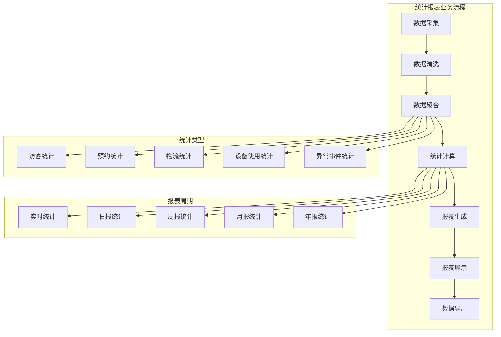
```mermaid
graph TB
    subgraph "统计报表业务流程"
        A[数据采集] --> B[数据清洗]
        B --> C[数据聚合]
        C --> D[统计计算]
        D --> E[报表生成]
        E --> F[报表展示]
        F --> G[数据导出]
    end

    subgraph "统计类型"
        S1[访客统计]
        S2[预约统计]
        S3[物流统计]
        S4[设备使用统计]
        S5[异常事件统计]
    end

    subgraph "报表周期"
        P1[实时统计]
        P2[日报统计]
        P3[周报统计]
        P4[月报统计]
        P5[年报统计]
    end

    C --> S1
    C --> S2
    C --> S3
    C --> S4
    C --> S5

    D --> P1
    D --> P2
    D --> P3
    D --> P4
    D --> P5
```

### 7.2 数据库ER图

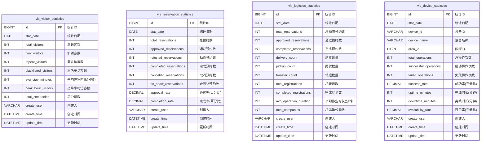
```mermaid
erDiagram
    vis_visitor_statistics {
        BIGINT id PK "统计ID"
        DATE stat_date "统计日期"
        INT total_visitors "总访客数"
        INT new_visitors "新访客数"
        INT repeat_visitors "重复访客数"
        INT blacklisted_visitors "黑名单访客数"
        INT avg_stay_minutes "平均停留时长(分钟)"
        INT peak_hour_visitors "高峰小时访客数"
        INT total_companies "总公司数"
        VARCHAR create_user "创建人"
        DATETIME create_time "创建时间"
        DATETIME update_time "更新时间"
    }

    vis_reservation_statistics {
        BIGINT id PK "统计ID"
        DATE stat_date "统计日期"
        INT total_reservations "总预约数"
        INT approved_reservations "通过预约数"
        INT rejected_reservations "拒绝预约数"
        INT completed_reservations "完成预约数"
        INT cancelled_reservations "取消预约数"
        INT no_show_reservations "未到访预约数"
        DECIMAL approval_rate "通过率(百分比)"
        DECIMAL completion_rate "完成率(百分比)"
        VARCHAR create_user "创建人"
        DATETIME create_time "创建时间"
        DATETIME update_time "更新时间"
    }

    vis_logistics_statistics {
        BIGINT id PK "统计ID"
        DATE stat_date "统计日期"
        INT total_reservations "总物流预约数"
        INT approved_reservations "通过预约数"
        INT completed_reservations "完成预约数"
        INT delivery_count "送货数量"
        INT pickup_count "提货数量"
        INT transfer_count "转运数量"
        INT total_registrations "总登记数"
        INT completed_registrations "完成登记数"
        INT avg_operation_duration "平均作业时长(分钟)"
        INT total_companies "总运输公司数"
        VARCHAR create_user "创建人"
        DATETIME create_time "创建时间"
        DATETIME update_time "更新时间"
    }

    vis_device_statistics {
        BIGINT id PK "统计ID"
        DATE stat_date "统计日期"
        VARCHAR device_id "设备ID"
        VARCHAR device_name "设备名称"
        BIGINT area_id "区域ID"
        INT total_operations "总操作次数"
        INT successful_operations "成功操作次数"
        INT failed_operations "失败操作次数"
        DECIMAL success_rate "成功率(百分比)"
        INT uptime_minutes "在线时长(分钟)"
        INT downtime_minutes "离线时长(分钟)"
        DECIMAL availability_rate "可用率(百分比)"
        VARCHAR create_user "创建人"
        DATETIME create_time "创建时间"
        DATETIME update_time "更新时间"
    }
```

## 8. 通知消息模块

### 8.1 业务流程图

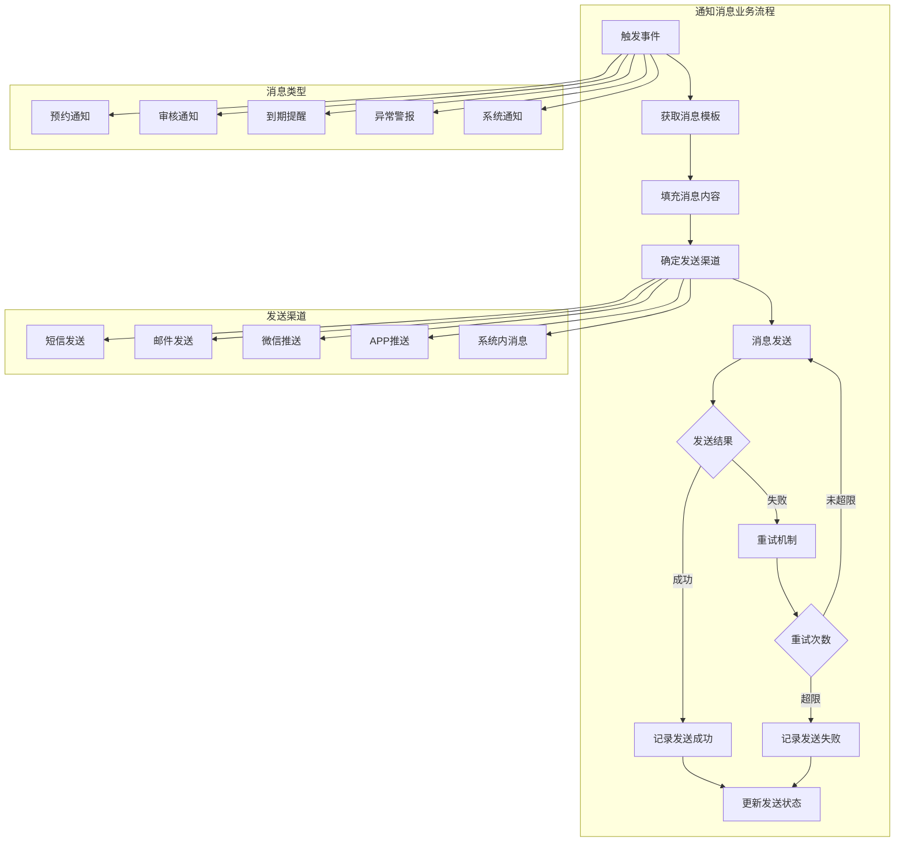
```mermaid
graph TB
    subgraph "通知消息业务流程"
        A[触发事件] --> B[获取消息模板]
        B --> C[填充消息内容]
        C --> D[确定发送渠道]
        D --> E[消息发送]
        E --> F{发送结果}
        F -->|成功| G[记录发送成功]
        F -->|失败| H[重试机制]
        H --> I{重试次数}
        I -->|未超限| E
        I -->|超限| J[记录发送失败]
        G --> K[更新发送状态]
        J --> K
    end

    subgraph "消息类型"
        M1[预约通知]
        M2[审核通知]
        M3[到期提醒]
        M4[异常警报]
        M5[系统通知]
    end

    subgraph "发送渠道"
        C1[短信发送]
        C2[邮件发送]
        C3[微信推送]
        C4[APP推送]
        C5[系统内消息]
    end

    A --> M1
    A --> M2
    A --> M3
    A --> M4
    A --> M5

    D --> C1
    D --> C2
    D --> C3
    D --> C4
    D --> C5
```

### 8.2 数据库ER图

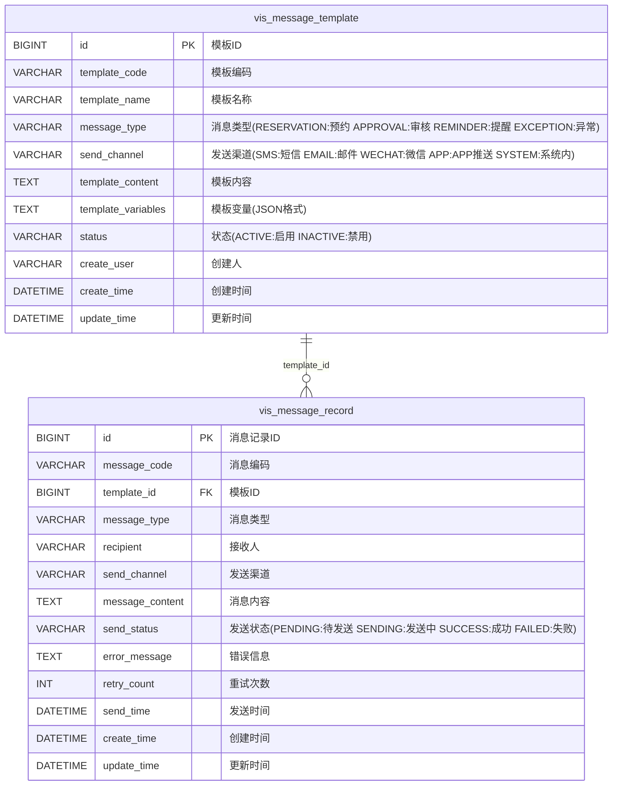
```mermaid
erDiagram
    vis_message_template {
        BIGINT id PK "模板ID"
        VARCHAR template_code "模板编码"
        VARCHAR template_name "模板名称"
        VARCHAR message_type "消息类型(RESERVATION:预约 APPROVAL:审核 REMINDER:提醒 EXCEPTION:异常)"
        VARCHAR send_channel "发送渠道(SMS:短信 EMAIL:邮件 WECHAT:微信 APP:APP推送 SYSTEM:系统内)"
        TEXT template_content "模板内容"
        TEXT template_variables "模板变量(JSON格式)"
        VARCHAR status "状态(ACTIVE:启用 INACTIVE:禁用)"
        VARCHAR create_user "创建人"
        DATETIME create_time "创建时间"
        DATETIME update_time "更新时间"
    }

    vis_message_record {
        BIGINT id PK "消息记录ID"
        VARCHAR message_code "消息编码"
        BIGINT template_id FK "模板ID"
        VARCHAR message_type "消息类型"
        VARCHAR recipient "接收人"
        VARCHAR send_channel "发送渠道"
        TEXT message_content "消息内容"
        VARCHAR send_status "发送状态(PENDING:待发送 SENDING:发送中 SUCCESS:成功 FAILED:失败)"
        TEXT error_message "错误信息"
        INT retry_count "重试次数"
        DATETIME send_time "发送时间"
        DATETIME create_time "创建时间"
        DATETIME update_time "更新时间"
    }

    vis_message_template ||--o{ vis_message_record : "template_id"
```

## 总结

以上图表详细展示了访客管理系统各个模块的业务流程和数据库结构：

1. **基础数据管理模块** - 提供系统运行的基础数据支撑
2. **预约管理模块** - 处理访客预约的完整生命周期
3. **登记管理模块** - 管理访客的进入和离开流程
4. **物流管理模块** - 专门处理物流相关的预约和登记
5. **通行记录模块** - 记录和管理访客的通行行为
6. **系统管理模块** - 提供系统运行的管理和维护功能
7. **统计报表模块** - 提供数据分析和报表功能
8. **通知消息模块** - 负责系统的消息推送和通知

每个模块都有清晰的业务流程和数据结构，模块间通过外键关联实现数据的一致性和完整性。