# 访客管理端到端流程图

> **文档版本**: v1.0.0
> **创建日期**: 2025-12-16
> **业务范围**: 访客预约、审批、门禁、追踪全流程
> **技术架构**: 移动端 + Web端 + 门禁集成 + 生物识别

---

## 🎯 访客管理整体架构

### 访客管理生态系统架构

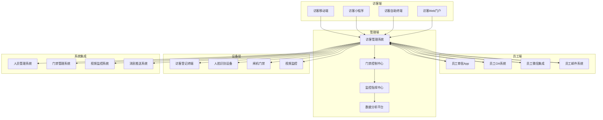

## 📱 访客预约完整流程

### 访客预约全链路序列图

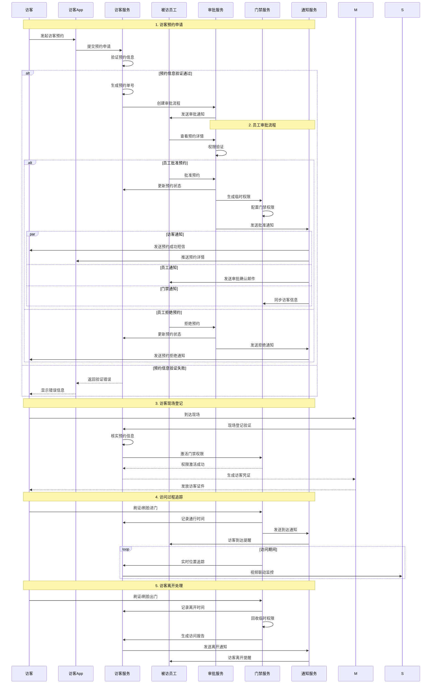

## 🏢 访客现场管理流程

### 访客现场登记与验证

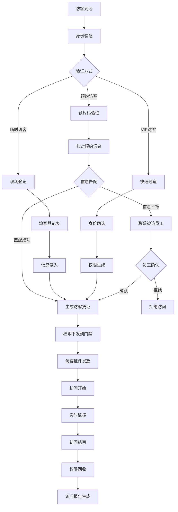

### 访客身份认证流程

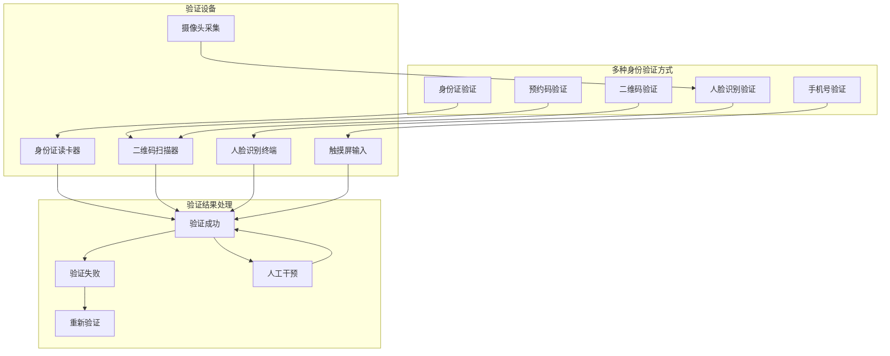

## 🚪 门禁集成控制流程

### 访客门禁权限管理

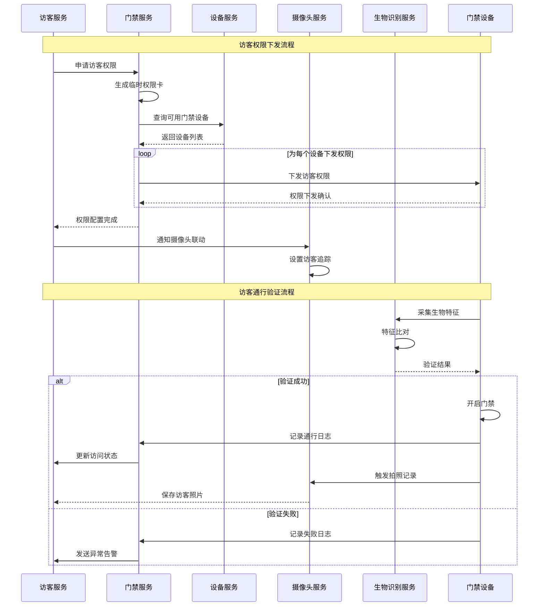

### 访客权限时序控制

```mermaid
gantt
    title 访客权限时间轴控制
    dateFormat  HH:mm
    axisFormat %H:%M

    section 权限生命周期
    预约审批    :a1, 09:00, 30m
    权限生成    :a2, after a1, 15m
    权限下发    :a3, after a2, 10m
    访问开始    :a4, after a3, 1h
    权限激活    :a5, after a3, 2h
    访问结束    :a6, after a5, 4h
    权限回收    :a7, after a6, 10m

    section 通知时序
    预约确认    :b1, 09:30, 5m
    到达提醒    :b2, 11:00, 5m
    访问中提醒  :b3, after b2, 1h
    离开提醒    :b4, after b3, 2h
```

## 📊 访客数据分析流程

### 访客数据统计分析

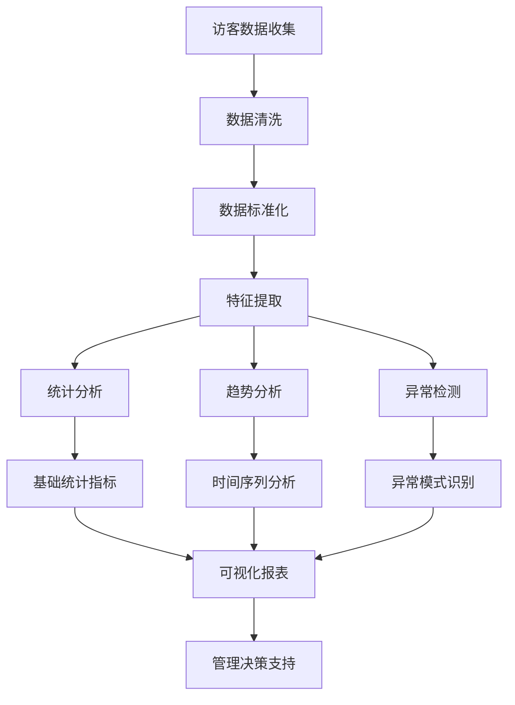

### 访客流量分析仪表板

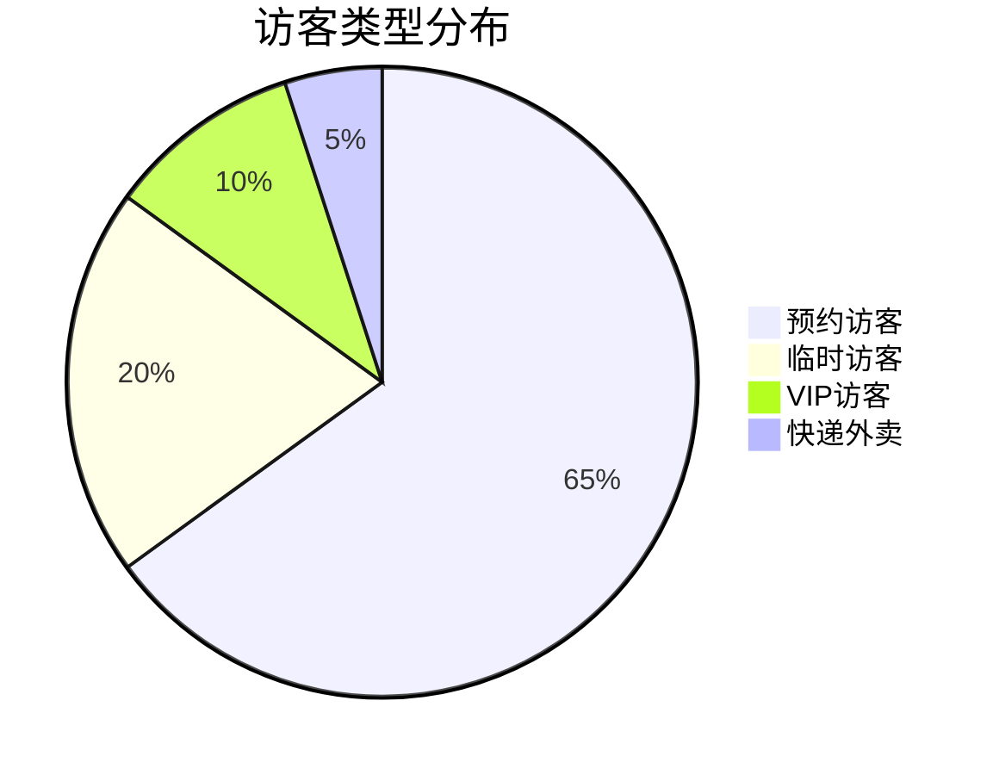

```mermaid
xychart-beta
    title 访客流量趋势分析
    x-axis "时间(小时)"
    y-axis "访客数量"
    line [5, 12, 25, 35, 45, 50, 42, 38, 30, 20, 15, 8]
    bar [10, 15, 30, 40, 55, 65, 48, 45, 35, 25, 18, 12]
```

## 🔔 智能通知与提醒

### 多渠道通知系统

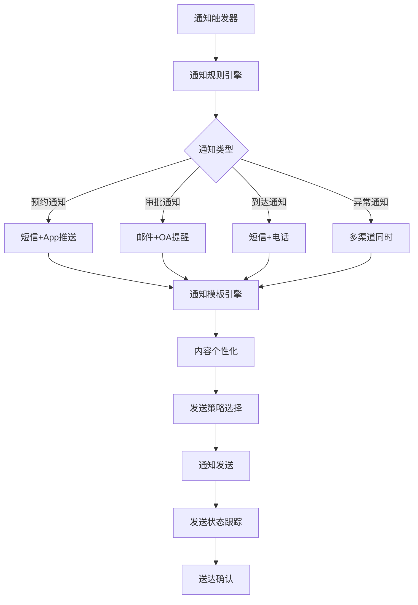

### 通知模板管理

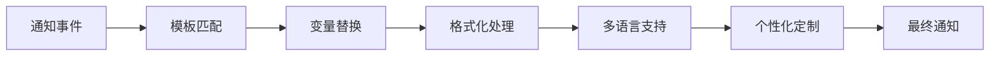

## 🛡️ 安全风险控制流程

### 访客安全风险评估

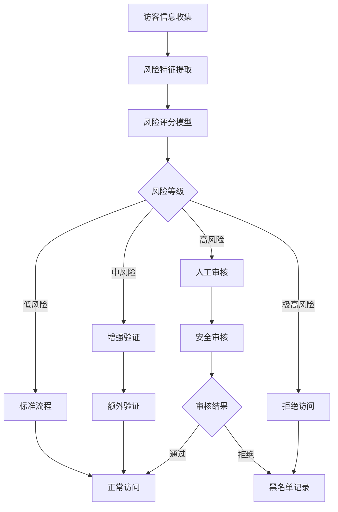

### 实时安全监控

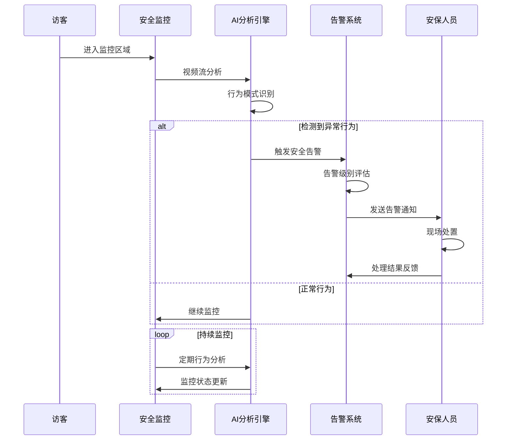

## 📱 移动端功能流程

### 访客App完整功能

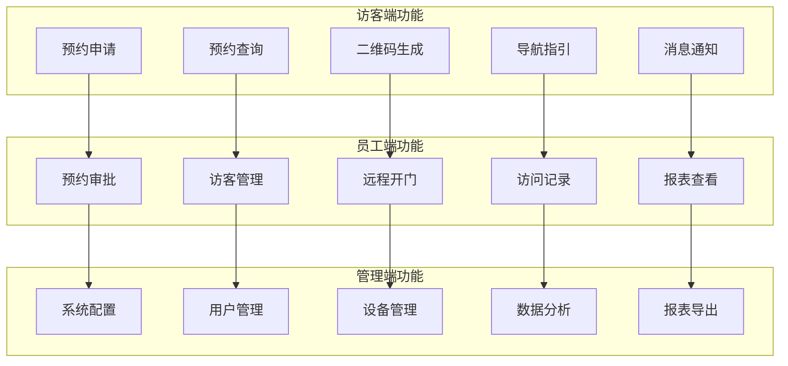

### 移动端用户体验流程

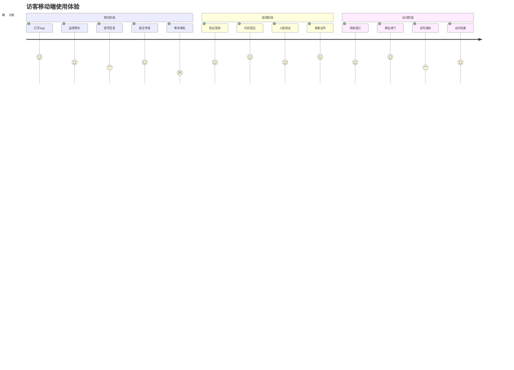

## 🔗 系统集成接口流程

### 第三方系统集成

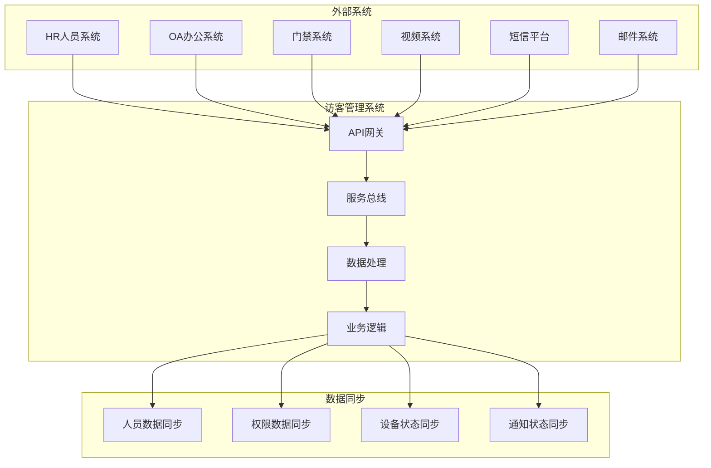

### API接口设计规范

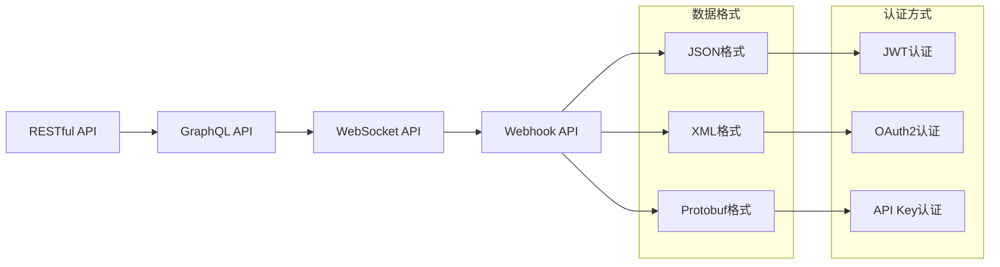

## 📋 访客管理配置参考

### 访客管理系统配置

```yaml
# 访客管理系统配置
visitor-management:
  # 预约配置
  appointment:
    max-advance-days: 30          # 最大提前预约天数
    min-advance-hours: 2          # 最小提前预约小时数
    max-visit-duration: 8         # 最大访问时长(小时)
    auto-approval-enabled: false  # 自动审批开关

    # 预约时间段配置
    time-slots:
      morning: "09:00-12:00"
      afternoon: "14:00-18:00"
      evening: "18:00-20:00"

  # 权限配置
  access-control:
    temp-access-duration: 24       # 临时权限有效期(小时)
    access-areas:
      - "lobby"
      - "meeting_room_a"
      - "cafeteria"

    # 设备权限配置
    device-permissions:
      turnstiles: ["gate_01", "gate_02"]
      doors: ["door_01", "door_02"]
      elevators: ["elevator_01"]

  # 安全配置
  security:
    blacklist-check: true        # 黑名单检查
    risk-scoring-enabled: true    # 风险评分
    face-recognition-threshold: 0.8
    id-verification-required: true

    # 风险等级配置
    risk-levels:
      low: 0.3
      medium: 0.6
      high: 0.8
      critical: 0.9

  # 通知配置
  notification:
    # 短信配置
    sms:
      provider: "aliyun"
      template-appointment: "SMS_001"
      template-approval: "SMS_002"
      template-arrival: "SMS_003"

    # 邮件配置
    email:
      smtp-server: "smtp.company.com"
      smtp-port: 587
      sender: "visitor@company.com"

    # App推送配置
    push:
      provider: "jpush"
      app-key: "your_app_key"
      master-secret: "your_master_secret"

  # 数据保留配置
  data-retention:
    visit-records: 365           # 访问记录保留天数
    photo-data: 90               # 照片数据保留天数
    video-data: 30               # 视频数据保留天数
    log-data: 180                # 日志数据保留天数

  # 集成配置
  integration:
    # HR系统集成
    hr-system:
      api-url: "http://hr.company.com/api"
      api-key: "hr_api_key"
      sync-interval: 3600        # 同步间隔(秒)

    # 门禁系统集成
    access-system:
      api-url: "http://access.company.com/api"
      protocol: "http"
      timeout: 5000              # 超时时间(毫秒)

    # 视频系统集成
    video-system:
      api-url: "http://video.company.com/api"
      streaming-url: "rtsp://video.company.com"
      storage-path: "/data/visitor_videos"
```

---

**文档创建完成时间**: 2025-12-16
**流程图总数**: 15个核心流程图
**覆盖范围**: 访客管理全流程
**技术特点**: 移动端集成 + 多渠道通知 + 智能分析
**实施建议**: 基于此流程图立即完整实现访客管理功能