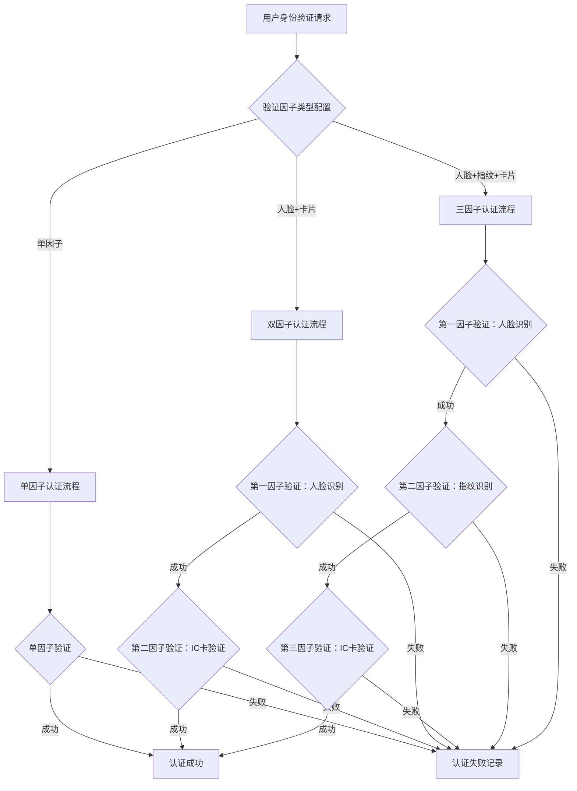
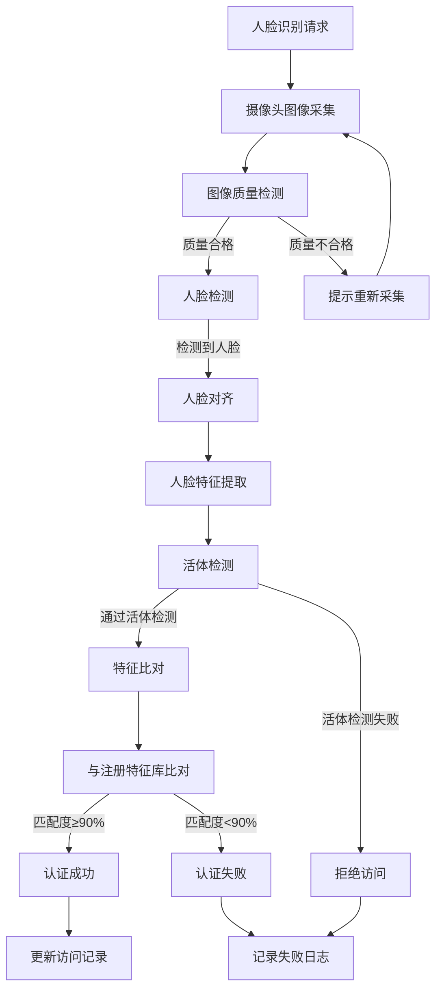
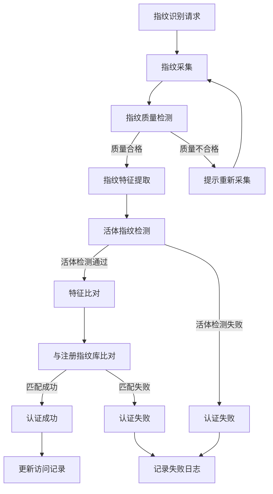
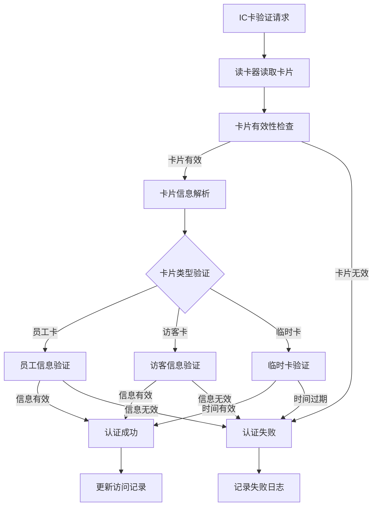
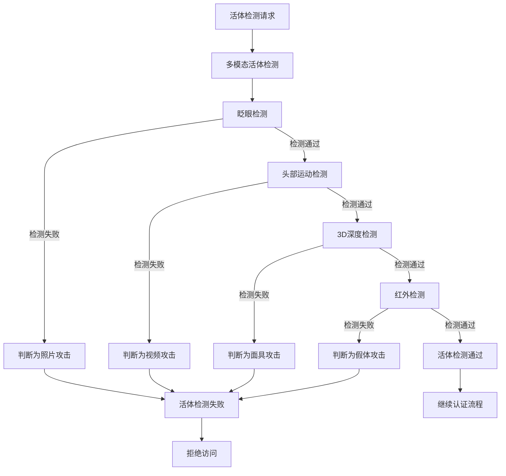
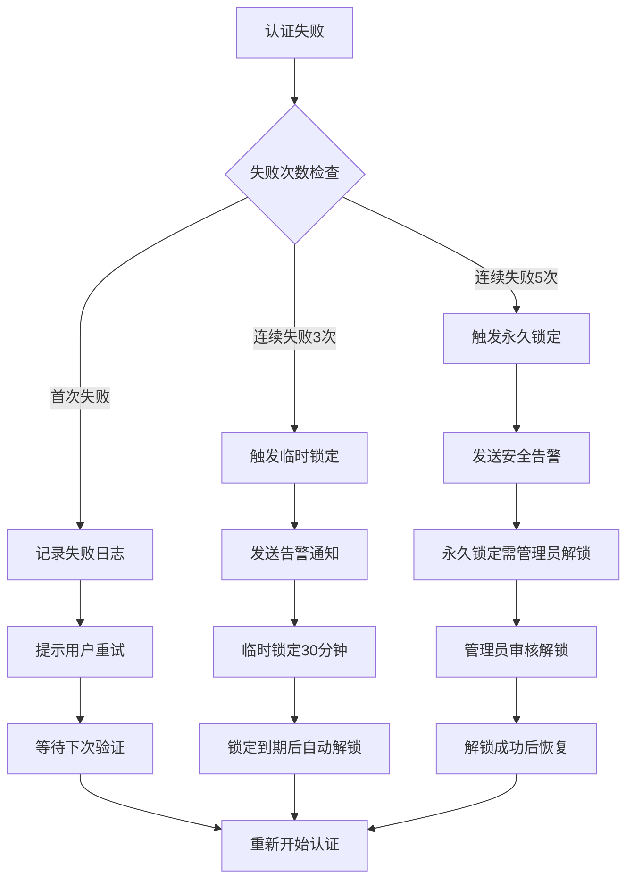
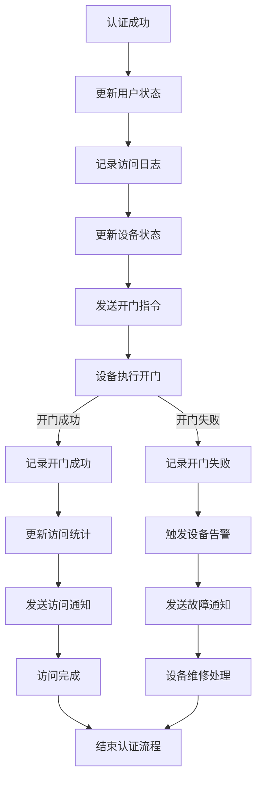

# 多因子认证流程图

## 流程概述

多因子认证（MFA）是IOE-DREAM智慧园区一卡通管理平台的核心安全功能，通过结合多种身份验证方式，确保门禁系统的安全性，满足国家三级等保要求。

## 核心流程图

### 1. 多因子认证主流程

### 2. 人脸识别详细流程

### 3. 指纹识别详细流程

### 4. IC卡验证详细流程

### 5. 活体检测流程

### 6. 认证失败处理流程

### 7. 认证成功处理流程

## 安全策略

### 认证策略配置

1. **默认策略**：人脸识别 + IC卡验证
2. **高安全区域**：人脸识别 + 指纹识别 + IC卡验证
3. **普通区域**：人脸识别或IC卡验证
4. **紧急情况**：单一快速验证方式

### 风险控制措施

1. **连续失败锁定**：连续3次失败临时锁定30分钟
2. **高风险锁定**：连续5次失败永久锁定
3. **异常行为监控**：实时监控异常认证行为
4. **安全审计**：完整的认证过程审计日志

### 性能优化

1. **并行验证**：多因子可并行验证提高效率
2. **本地缓存**：常用特征本地缓存减少网络请求
3. **预加载**：常用用户特征预加载
4. **降级策略**：网络异常时的降级验证方案

## 系统集成

### 门禁设备集成

- **人脸识别终端**：支持多厂商设备接入
- **指纹识别器**：支持多种指纹技术
- **IC卡读卡器**：支持多种卡类型
- **门禁控制器**：标准协议对接

### 监控系统集成

- **实时监控**：认证过程视频联动
- **录像存储**：异常事件自动录像
- **告警推送**：安全事件实时告警
- **数据分析**：认证行为数据分析

### 第三方系统集成

- **HR系统**：员工信息同步
- **访客系统**：访客信息验证
- **安防系统**：统一安防管理
- **OA系统**：访问记录同步

## 业务价值

### 安全价值

1. **多重保护**：多因子验证提供多重安全保护
2. **防伪能力**：活体检测有效防止身份伪造
3. **审计能力**：完整的认证过程可追溯
4. **风险控制**：智能风险识别和控制

### 业务价值

1. **提高安全性**：显著提升园区安全水平
2. **提升体验**：无感认证提升用户体验
3. **降低风险**：减少安全事故风险
4. **合规要求**：满足等保合规要求

---

**文档版本**: v1.0.0
**创建日期**: 2025-12-16
**负责人**: IOE-DREAM架构团队
**审核人**: 安全团队、产品团队