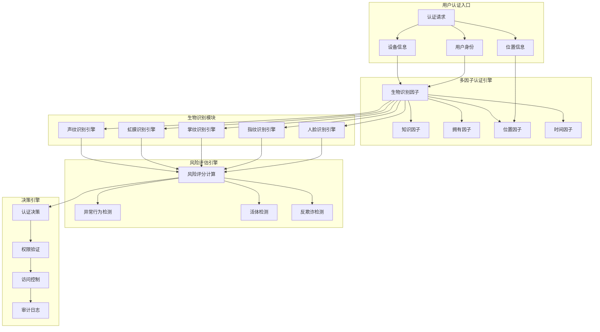
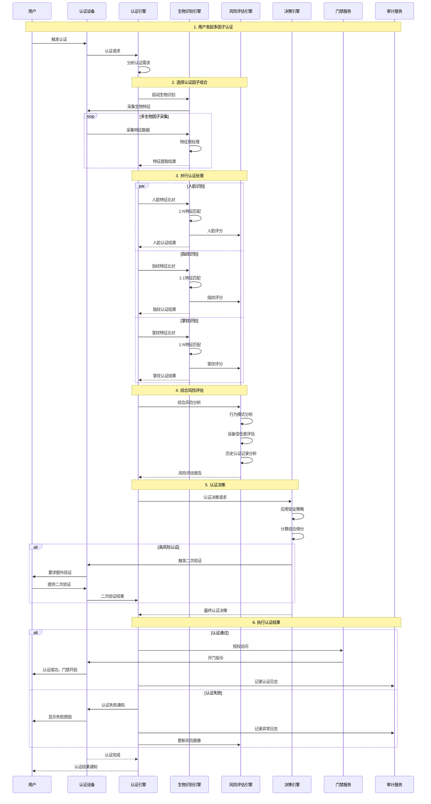
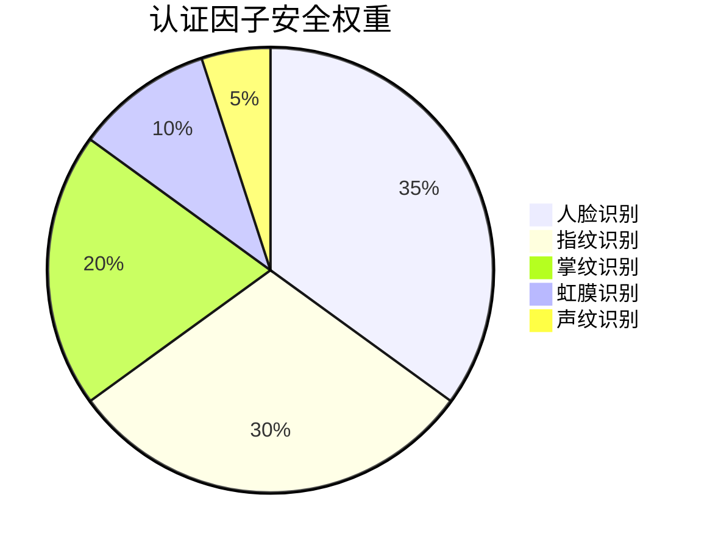
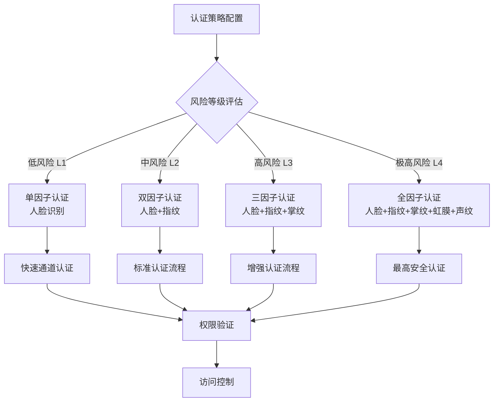
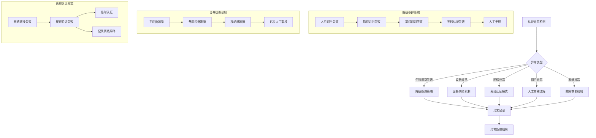
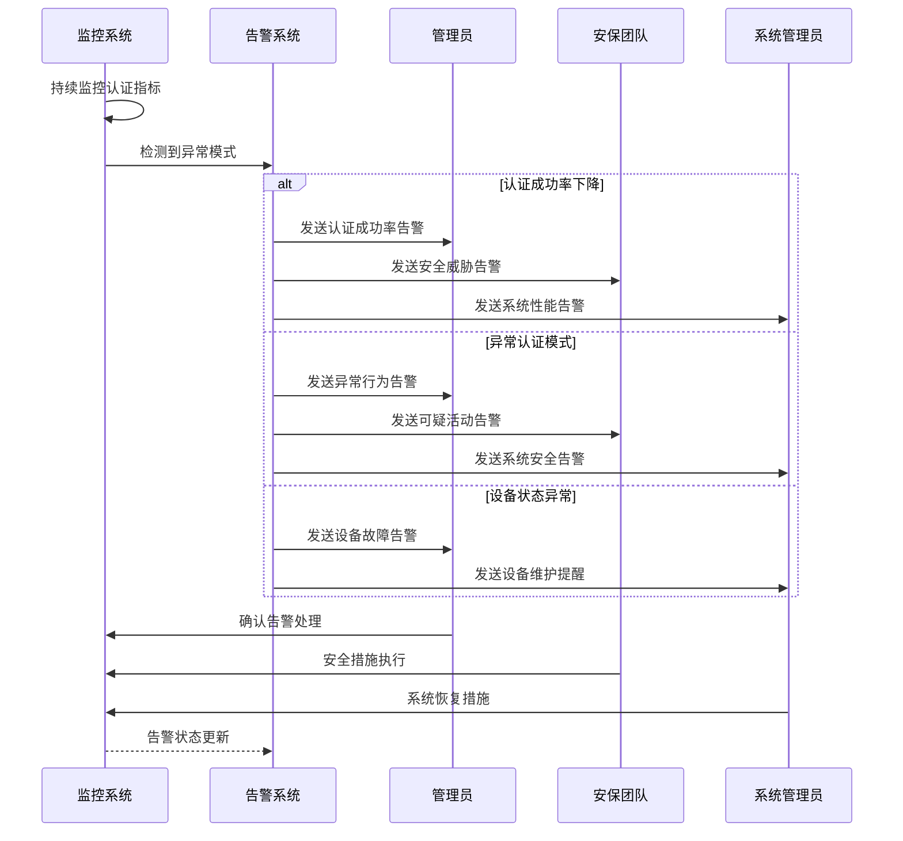
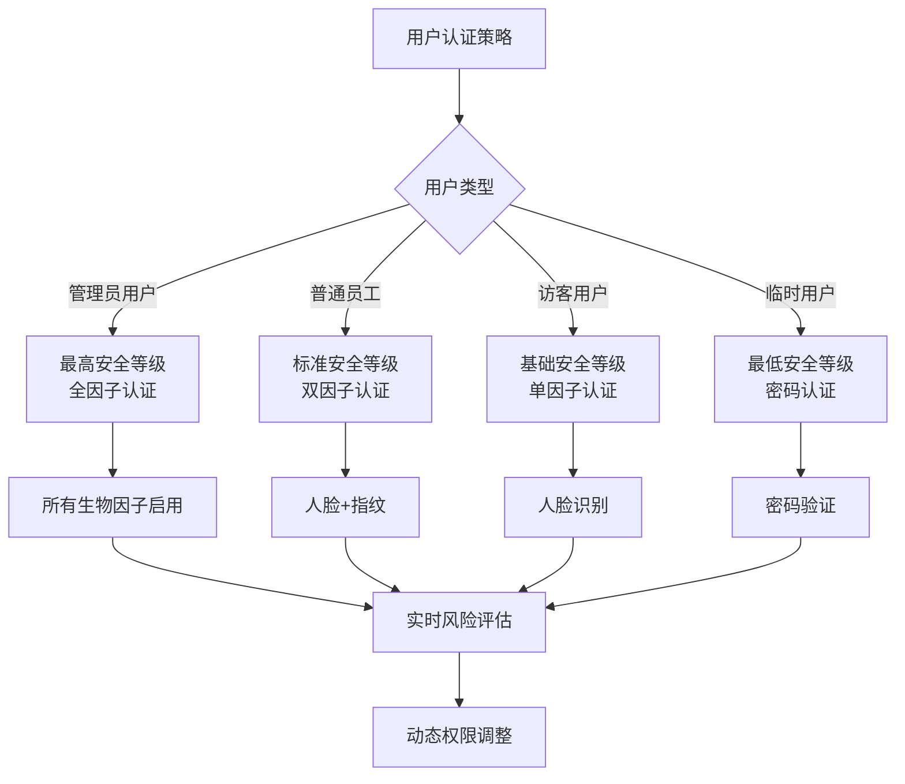

# 生物识别多因子认证流程图

> **文档版本**: v1.0.0
> **创建日期**: 2025-12-16
> **业务范围**: 多模态生物识别认证
> **技术架构**: 人脸+指纹+掌纹+虹膜+声纹

---

## 🎯 多因子认证架构设计

### 整体认证流程架构



## 🔄 详细认证流程

### 多因子认证完整序列图



## 🔐 安全认证策略

### 认证因子权重配置



### 动态认证策略



## 🚨 异常处理流程

### 认证异常处理机制



## 📊 性能指标与监控

### 认证性能指标

```mermaid
gauge
    title 认证成功率指标
    caption 实时监控认证成功率
    min 0
    max 100
    value 98.5
    orange 80
    red 90
```

### 响应时间监控

```mermaid
xychart-beta
    title 认证响应时间分布
    x-axis "响应时间(ms)"
    y-axis "请求量"
    line [50, 20, 100, 45, 150, 80, 200, 120, 300, 60, 500, 25, 1000, 15]
    bar [0-100, 1200, 100-200, 800, 200-300, 450, 300-500, 300, 500-1000, 200, >1000, 50]
```

## 🔄 实时监控告警

### 认证异常告警流程



## 📋 认证配置管理

### 认证策略配置表

| 配置项 | 配置值 | 说明 | 生效范围 |
|--------|---------|------|----------|
| 最小认证因子数 | 2 | 最低认证要求 | 全局 |
| 最大认证尝试次数 | 3 | 连续失败限制 | 单用户 |
| 认证超时时间 | 30秒 | 单次认证时限 | 全局 |
| 风险评分阈值 | 70 | 触发二次验证 | 全局 |
| 活体检测强度 | 高 | 防伪造要求 | 全局 |
| 设备信任期限 | 7天 | 设备认证有效期 | 全局 |

### 用户认证策略配置



---

**文档创建完成时间**: 2025-12-16
**流程图总数**: 5个核心认证流程图
**覆盖范围**: 多因子认证全流程
**安全等级**: 企业级金融安全标准
**实施建议**: 基于此流程图立即完整实现多因子认证功能