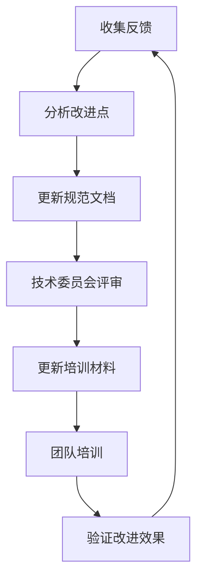
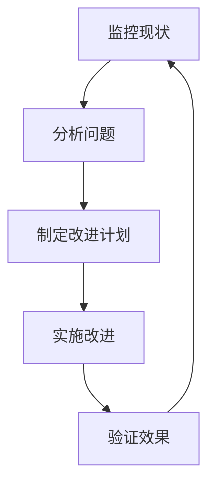

# IOE-DREAM 架构规范持续维护机制

> **目标**: 确保架构规范的长期有效执行和持续改进
> **适用范围**: 全体开发团队、架构组、质量保障团队
> **维护周期**: 持续进行
> **更新时间**: 2025-12-01

---

## 🔄 维护工作流程

### **1. 日常监控 (每日)**

#### **1.1 自动化检查**
```yaml
# .github/workflows/daily-architecture-check.yml
name: 每日架构合规检查

on:
  schedule:
    - cron: '0 9 * * 1-5'  # 工作日早上9点

jobs:
  daily-compliance-check:
    runs-on: ubuntu-latest
    steps:
    - name: 检查代码规范遵循情况
      run: |
        # 统计违规使用
        AUTOVIOLATIONS=$(find . -name "*.java" -exec grep -l "@Autowired\|javax\." {} \; | wc -l)
        echo "当前违规数量: $AUTOVIOLATIONS"

        if [ $AUTOVIOLATIONS -gt 0 ]; then
          # 发送告警
          curl -X POST "${SLACK_WEBHOOK}" \
            -H 'Content-type: application/json' \
            --data "{\"text\":\"🚨 架构规范违规: 发现 $AUTOVIOLATIONS 处违规使用\"}"
        fi
```

#### **1.2 质量指标监控**
```yaml
# 监控指标
- 架构合规率: 目标 ≥ 95%
- 新增代码违规率: 目标 ≤ 1%
- 规范培训覆盖率: 目标 100%
- 文档更新及时性: 目标 ≤ 7天
```

### **2. 周期性审查 (每周)**

#### **2.1 代码审查清单**
```markdown
## 周代码审查清单

### ✅ 必检项目
- [ ] 无 @Autowired 使用
- [ ] 无 javax.* 包导入
- [ ] 无 FeignClient 直接调用
- [ ] 无 Consul/Eureka 配置
- [ ] Repository层只使用 @Repository
- [ ] 启动类配置 @MapperScan
- [ ] 依赖注入使用 @Resource

### ⚠️ 重点检查
- [ ] GatewayServiceClient 使用规范
- [ ] 服务边界是否清晰
- [ ] 数据库连接池使用 Druid
- [ ] Nacos 配置是否标准
- [ ] 端口分配是否符合标准表

### 📊 统计报告
- 架构违规数量统计
- 违规类型分布
- 改进趋势分析
- 团队规范遵循度排名
```

#### **2.2 周报机制**
```java
@Component
@Slf4j
public class WeeklyArchitectureReport {

    @Scheduled(cron = "0 17 * * FRI")  # 每周五17:00
    public void generateWeeklyReport() {
        // 生成架构合规性周报
        WeeklyReport report = analyzeCompliance();

        // 发送报告
        emailService.sendReport(report);

        // 保存报告记录
        reportRepository.save(report);
    }
}
```

### **3. 月度改进 (每月)**

#### **3.1 规范更新流程**


#### **3.2 月度改进计划模板**
```markdown
# 月份架构规范改进计划

## 🔍 本月问题分析
## 📋 IOE-DREAM七微服务架构

**核心架构组成**:
- **Gateway Service (8080)**: API网关
- **Common Service (8088)**: 公共模块微服务
- **DeviceComm Service (8087)**: 设备通讯微服务
- **OA Service (8089)**: OA微服务
- **Access Service (8090)**: 门禁服务
- **Attendance Service (8091)**: 考勤服务
- **Video Service (8092)**: 视频服务
- **Consume Service (8094)**: 消费服务
- **Visitor Service (8095)**: 访客服务

**架构特点**:
- 基于Spring Boot 3.5.8 + Java 17
- 严格遵循企业级微服务规范
- 支持高并发、高可用、水平扩展

**技术栈标准**:
- **数据库**: MySQL 8.0 + Druid连接池
- **缓存**: Redis + Caffeine多级缓存
- **注册中心**: Nacos
- **配置中心**: Nacos Config
- **认证授权**: Sa-Token
- 发现的主要问题
## 🏗️ 四层架构规范

**标准架构模式**:
```
Controller (接口控制层)
    ↓
Service (核心业务层)
    ↓
Manager (流程管理层)
    ↓
DAO (数据访问层)
```

**层级职责**:
- **Controller层**: HTTP请求处理、参数验证、权限控制
- **Service层**: 核心业务逻辑、事务管理、业务规则验证
- **Manager层**: 复杂流程编排、多数据组装、第三方服务集成
- **DAO层**: 数据库CRUD操作、SQL查询实现、数据访问边界

**严格禁止跨层访问**: Controller不能直接调用Manager/DAO！
- 违规类型统计
## ⚠️ IOE-DREAM零容忍规则（强制执行）

**必须遵守的架构规则**:
- ✅ **必须使用 @Resource 注入依赖**
- ✅ **必须使用 @Mapper 注解** (禁止@Repository)
- ✅ **必须使用 Dao 后缀** (禁止Repository)
- ✅ **必须使用 @RestController 注解**
- ✅ **必须使用 @Valid 参数校验**
- ✅ **必须返回统一ResponseDTO格式**
- ✅ **必须遵循四层架构边界**

**严格禁止事项**:
- ❌ **禁止使用 @Autowired 注入**
- ❌ **禁止使用 @Repository 注解**
- ❌ **禁止使用 Repository 后缀命名**
- ❌ **禁止跨层访问**
- ❌ **禁止在Controller中包含业务逻辑**
- ❌ **禁止直接访问数据库**

**违规后果**: P0级问题，立即修复，禁止合并！
- 影响范围评估

## 🎯 改进目标
- 下月合规率目标
- 重点改进领域
- 具体行动计划

## 📋 行动计划
### 技术改进
- [ ] 更新检查工具
- [ ] 优化IDE插件
- [ ] 完善CI/CD规则

### 流程改进
- [ ] 优化审查流程
- [ ] 完善培训机制
- [ ] 加强监控告警

### 培训改进
- [ ] 更新培训材料
- [ ] 组织专项培训
- [ ] 建立导师机制

## 📊 预期效果
- 预计合规率提升
- 开发效率提升
- 代码质量改善
```

---

## 🛠️ 工具和机制

### **1. 自动化工具链**

#### **1.1 代码检查工具**
```bash
# architecture-compliance-checker.sh
#!/bin/bash
# 架构合规性检查工具

# 检查Java文件
check_java_files() {
    echo "检查Java文件架构合规性..."

    find . -name "*.java" -type f | while read file; do
        violations=0

        # 检查违规使用
        if grep -q "@Autowired" "$file"; then
            echo "❌ $file: @Autowired 使用违规"
            violations=$((violations + 1))
        fi

        if grep -q "javax\." "$file"; then
            echo "❌ $file: javax. 包导入违规"
            violations=$((violations + 1))
        fi

        if [ $violations -gt 0 ]; then
            echo "  📊 违规数量: $violations"
        fi
    done
}

# 检查配置文件
check_config_files() {
    echo "检查配置文件合规性..."

    find microservices -name "application*.yml" -o -name "bootstrap*.yml" | while read file; do
        if grep -q -E "consul:|eureka:" "$file"; then
            echo "❌ $file: 发现禁用的注册中心配置"
        fi

        if ! grep -q "nacos:" "$file"; then
            echo "⚠️  $file: 缺少Nacos配置"
        fi
    done
}
```

#### **1.2 IDE插件配置**
```xml
<!-- .idea/codeStyles/Project.xml -->
<component name="ProjectCodeStyleConfiguration">
  <code_scheme name="IOE-DREAM" version="173">
    <JavaCodeStyleSettings>
      <option name="IMPORT_LAYOUT_TABLE">
        <value>
          <package name="jakarta" withSubpackages="true" static="false"/>
          <package name="org.springframework" withSubpackages="true" static="false"/>
          <package name="com.ioedream" withSubpackages="true" static="false"/>
        </value>
      </option>
    </JavaCodeStyleSettings>
  </code_scheme>
</component>
```

### **2. 监控和告警**

#### **2.1 Prometheus监控指标**
```yaml
# architecture-metrics.yml
groups:
  - name: architecture_compliance
    rules:
      - alert: architecture_violations
        expr: increase(architecture_violations_total[1h]) > 10
        for: 5m
        labels:
          severity: warning

      - alert: compliance_rate_low
        expr: architecture_compliance_rate < 0.95
        for: 10m
        labels:
          severity: critical
```

#### **2.2 Grafana仪表板**
```json
{
  "dashboard": {
    "title": "架构规范遵循情况",
    "panels": [
      {
        "title": "架构违规数量趋势",
        "type": "graph",
        "targets": [
          {
            "expr": "architecture_violations_total",
            "legendFormat": "{{legend}}"
          }
        ]
      },
      {
        "title": "合规率",
        "type": "stat",
        "targets": [
          {
            "expr": "architecture_compliance_rate",
            "legendFormat": "{{legend}}"
          }
        ]
      }
    ]
  }
}
```

---

## 📋 质量指标体系

### **KPI指标**

#### **核心指标**
- **架构合规率**: ≥ 95%
- **违规代码增长率**: ≤ 1%
- **规范培训覆盖率**: 100%
- **文档更新及时性**: ≤ 7天
- **新员工培训通过率**: 100%

#### **质量指标**
- **代码审查通过率**: ≥ 98%
- **自动化检查覆盖率**: ≥ 90%
- **CI/CD构建成功率**: ≥ 99%
- **技术债务控制**: 维持在可接受范围

#### **效率指标**
- **代码开发效率**: 持续提升
- **问题修复时间**: ≤ 24小时
- **规范遵循成本**: 持续降低
- **团队协作效率**: 持续改善

### **监控机制**

#### **实时监控**
```java
@Component
public class ArchitectureMetrics {

    @Autowired
    private MeterRegistry meterRegistry;

    public void recordViolation(String type) {
        Counter.builder("architecture_violations_total")
            .tag("type", type)
            .register(meterRegistry)
            .increment();
    }

    public void recordComplianceCheck(int total, int compliant) {
        double rate = (double) compliant / total;
        Gauge.builder("architecture_compliance_rate")
            .register(meterRegistry, rate);
    }
}
```

#### **定期报告**
```java
@Scheduled(cron = "0 0 * * *")
public class DailyMetricsReporter {

    public void reportDailyMetrics() {
        // 收集当日指标
        ArchitectureMetrics metrics = collectDailyMetrics();

        // 生成报告
        DailyReport report = generateReport(metrics);

        // 发送到管理层
        managementService.sendReport(report);

        // 更新仪表板
        dashboardService.updateMetrics(metrics);
    }
}
```

---

## 🎯 持续改进机制

### **改进循环**


### **反馈收集**
```markdown
## 反馈收集渠道

### 开发团队反馈
- 代码审查反馈
- 技术讨论会反馈
- 问题跟踪系统
- 匿名意见箱

### 外部反馈
- 用户反馈
- 客户满意度调查
- 第三方评估
- 行业标准对比

### 自动反馈
- 工具监控数据
- 自动化测试结果
- 性能监控数据
- 质量指标分析
```

### **改进评估**
```markdown
## 改进效果评估

### 量化评估
- 合规率变化趋势
- 违规数量减少情况
- 开发效率提升数据
- 代码质量改善指标

### 定性评估
- 团队规范意识提升
- 开发习惯改善
- 协作效率提升
- 技术债务减少

### 成本效益分析
- 维护成本降低
- 开发成本控制
- 质量成本优化
- ROI分析报告
```

---

## 📞 联系方式

**架构维护负责人**: architecture@ioedream.com
**技术支持团队**: tech-support@ioedream.com
**质量保障团队**: quality@ioedream.com

**紧急联系方式**: [技术支持热线] (24/7)

---

**文档维护人**: 架构组 + DevOps团队
**审核人**: 技术委员会
**生效时间**: 2025-12-01
**更新频率**: 每月更新