# IOE-DREAM 智能门禁管理系统业务流程图

## 1. 门禁管理模块业务流程概览

### 1.1 门禁管理业务架构
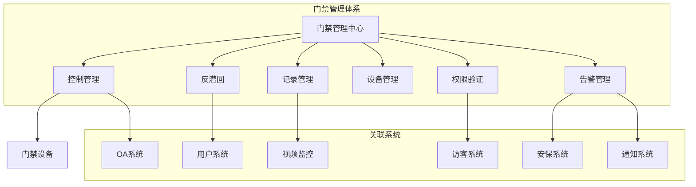

### 1.2 门禁管理数据流程
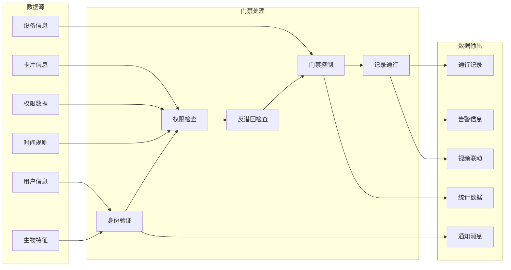

## 2. 门禁管理核心业务流程

### 2.1 门禁控制流程
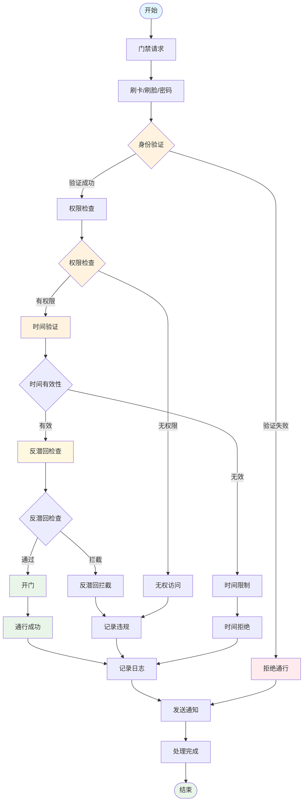

### 2.2 反潜回算法流程
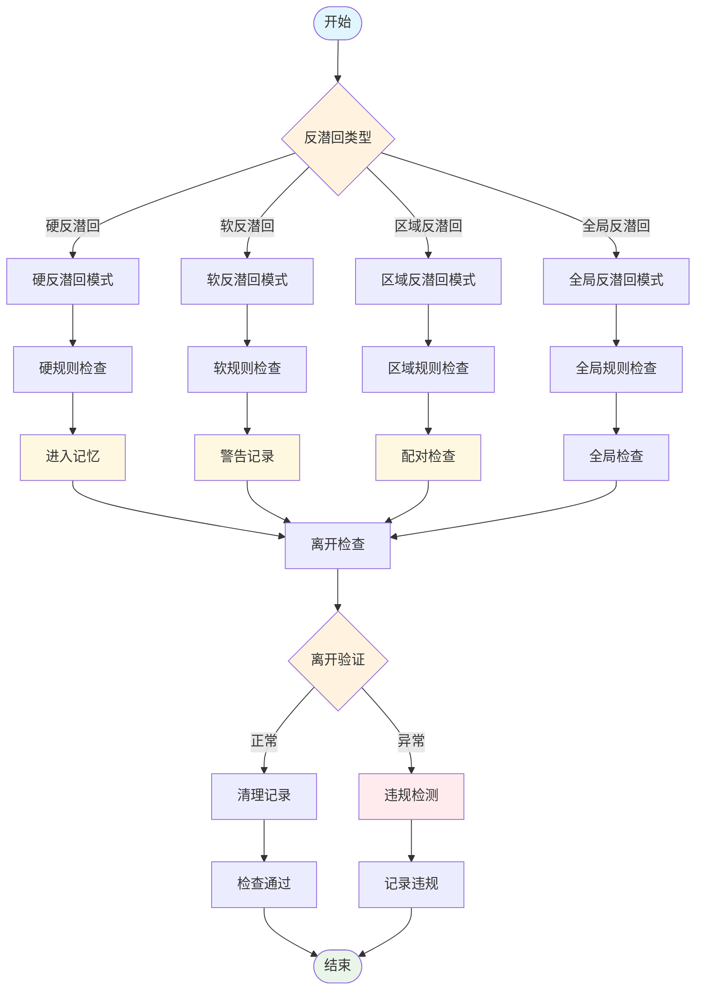

### 2.3 通行记录管理流程
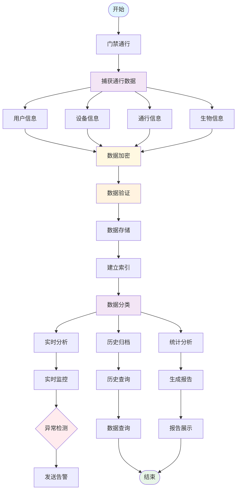

### 2.4 设备管理流程
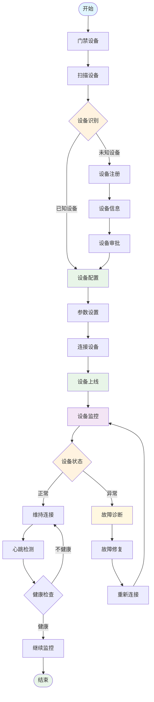

### 2.5 权限管理流程
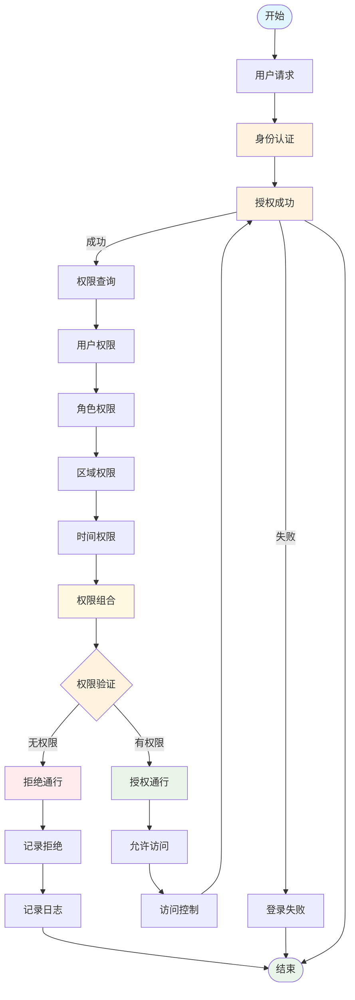

## 3. 门禁管理智能功能流程

### 3.1 智能异常检测流程
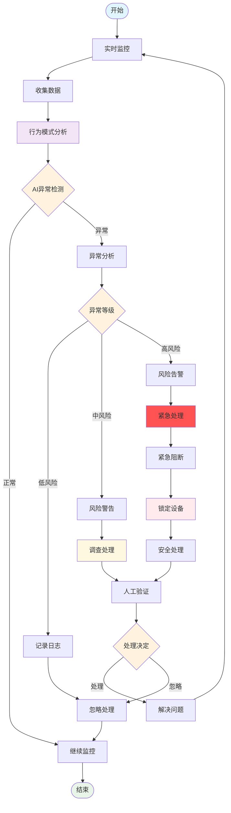

### 3.2 视频联动分析流程
```mermaid
flowchart TD
    START([开始]) --> ACCESS[门禁事件]
    ACCESS --> TRIGGER[触发联动]

    TRIGGER --> VIDEO_CHECK[视频系统检查]
    VIDEO_CHECK --> ONLINE{视频在线}

    ONLINE -->|在线| CAPTURE[捕获视频]
    ONLINE -->|离线| QUEUE[加入队列]

    CAPTURE --> ANALYZE[视频分析]
    QUEUE --> WAIT[等待上线]

    ANALYZE --> FACE[人脸识别]
    ANALYZE --> OBJECT[物体识别]
    ANALYZE --> BEHAVIOR[行为分析]

    FACE --> MATCH[人脸匹配]
    OBJECT --> TRACK[物体追踪]
    BEHAVIOR --> ANOMALY[异常检测]

    MATCH --> CONFIRM[身份确认]
    TRACK --> RECORD[轨迹记录]
    ANOMALY -> RISK[风险评估]

    CONFIRM --> SUCCESS[确认成功]
    RECORD --> SUCCESS
    RISK --> ALARM[触发告警]

    SUCCESS --> INTEGRATE[数据集成]
    WAIT --> CAPTURE
    ALARM -> SECURITY[安全响应]

    INTEGRATE --> COMPLETE[联动完成]
    SECURITY --> COMPLETE

    COMPLETE --> END([结束])
    WAIT --> END

    style START fill:#e1f5fe
    style END fill:#e8f5e8
    style TRIGGER fill:#fff3e0
    style ONLINE fill:#fff3e0
    style ANALYZE fill:#f3e5f5
    style MATCH fill:#fff8e1
    style CONFIRM fill:#e8f5e8
    style INTEGRATE fill:#8f5e8
    style ALARM fill:#ffebee
```

### 3.3 智能调度流程
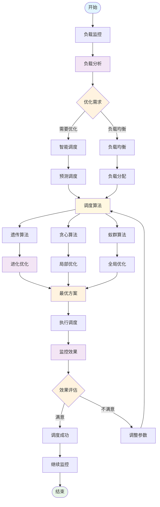

## 4. 门禁管理集成流程

### 4.1 访客系统集成流程
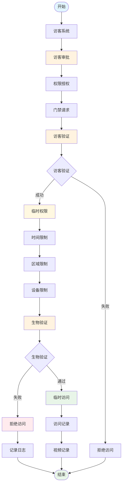

### 4.2 OA系统集成流程
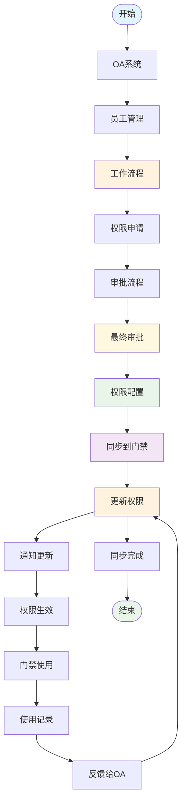

## 5. 门禁管理数据分析流程

### 5.1 通行统计分析流程
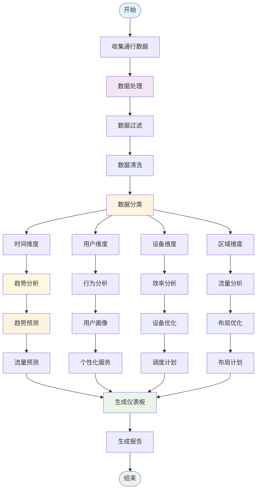

### 5.2 安全审计流程
```mermaid
flowchart TD
    START([开始]) --> AUDIT[审计范围]
    AUDIT --> PERIOD[审计周期]
    PERIOD --> SCOPE[审计范围]

    SCOPE --> COLLECT[收集审计数据]
    COLLECT --> RECORD[记录数据]
    COLLECT --> LOG[日志数据]

    RECORD --> CHECK[合规检查]
    LOG --> CHECK
    RECORD --> CHECK

    CHECK --> VIOLATION{违规检查}
    VIOLATION -->|无违规| COMPLIANT[合规处理]
    VIOLATION -->|有违规| VIOLATION_HANDLE[违规处理]

    COMPLIANT --> REPORT[生成合规报告]
    VIOLATION --> INVESTIGATE[违规调查]

    INVESTIGATE --> ROOT_CAUSE[根因分析]
    ROOT_CAUSE --> CORRECTIVE[纠正措施]

    CORRECTIVE --> IMPLEMENT[实施措施]
    REPORT --> REVIEW[报告审核]

    IMPLEMENT --> MONITOR[监控效果]
    REVIEW --> PUBLISH[发布结果]

    MONITOR --> EVALUATE[效果评估]
    PUBLISH --> END([结束])

    EVALUATE --> PUBLISH

    style START fill:#e1f5fe
    style END fill:#e8f5e8
    style AUDIT fill:#f3e5f5
    scope fill:#fff3e0
    style CHECK fill:#fff3e0
    style VIOLATION fill:#ffebee
    style INVESTIGATE fill:#fff8e1
    style CORRECTIVE fill:#f3e5f5
    style IMPLEMENT fill:#8f5e8
```

## 6. 门禁管理实施状态分析

### 6.1 功能实现现状
| 功能模块 | 实现状态 | 完成度 | 关键特性 |
|---------|---------|--------|----------|
| **门禁控制** | 部分实现 | 70% | 基础控制、权限检查 |
| **反潜回算法** | 未实现 | 25% | 基础概念、无完整实现 |
| **通行记录** | 部分实现 | 80% | 基础记录、查询功能 |
| **设备管理** | 部分实现 | 65% | 设备连接、状态监控 |
| **权限管理** | 部分实现 | 60% | 基础权限、角色管理 |
| **智能检测** | 未实现 | 30% | 异常检测、AI分析 |
| **视频联动** | 规划中 | 40% | 视频集成、人脸识别 |
| **智能调度** | 未实现 | 20% | 负载均衡、AI优化 |

### 6.2 数据库表结构需求
```sql
-- 门禁通行记录表
CREATE TABLE IF NOT EXISTS `t_access_record` (
    `record_id` BIGINT NOT NULL AUTO_INCREMENT COMMENT '记录ID',
    `user_id` BIGINT NOT NULL COMMENT '用户ID',
    `card_id` VARCHAR(50) COMMENT '卡片ID',
    `device_id` BIGINT NOT NULL COMMENT '设备ID',
    `device_code` VARCHAR(50) COMMENT '设备编码',
    `area_id` BIGINT COMMENT '区域ID',
    `area_name` VARCHAR(200) COMMENT '区域名称',
    `access_type` TINYINT NOT NULL COMMENT '通行类型：1-进入 2-离开',
    `access_method` TINYINT NOT NULL COMMENT '验证方式：1-刷卡 2-密码 3-人脸 4-指纹 5-虹膜',
    `access_result` TINYINT NOT NULL COMMENT '通行结果：1-成功 2-失败 3-异常',
    `access_time` DATETIME NOT NULL COMMENT '通行时间',
    `duration` INT DEFAULT 0 COMMENT '停留时长（秒）',
    `temperature` DECIMAL(4,1) COMMENT '体温值',
    `face_image_url` VARCHAR(500) COMMENT '人脸图片URL',
    `card_status` TINYINT COMMENT '卡片状态：1-正常 2-挂失 3-注销',
    `violation_level` TINYINT DEFAULT 0 COMMENT '违规级别：0-无 1-轻微 2-一般 3-严重',
    `anti_passback_check` TINYINT DEFAULT 0 COMMENT '反潜回检查：0-未检查 1-通过 2-拦截',
    `risk_score` INT DEFAULT 0 COMMENT '风险评分（0-100）',
    `visitor_id` BIGINT COMMENT '访客ID',
    `employee_id` BIGINT COMMENT '员工ID',
    `biometric_id` VARCHAR(100) COMMENT '生物特征ID',
    `client_ip` VARCHAR(45) COMMENT '客户端IP',
    `user_agent` VARCHAR(500) COMMENT '用户代理',
    `create_time` DATETIME NOT NULL DEFAULT CURRENT_TIMESTAMP COMMENT '创建时间',
    `update_time` DATETIME NOT NULL DEFAULT CURRENT_TIMESTAMP ON UPDATE CURRENT_TIMESTAMP COMMENT '更新时间',
    PRIMARY KEY (`record_id`),
    KEY `idx_user_access` (`user_id`, `access_time`, `deleted_flag`),
    KEY `idx_device_access` (`device_id`, `access_time`, `deleted_flag`),
    KEY `idx_card_access` (`card_id`, `access_time`, `deleted_flag`),
    KEY `idx_area_access` (`area_id`, `access_time`, `deleted_flag`),
    KEY `idx_access_type` (`access_type`, `access_time`, `deleted_flag`),
    KEY `idx_access_result` (`access_result`, `access_time`, `deleted_flag`),
    KEY `idx_create_time` (`create_time`, `deleted_flag`)
) ENGINE=InnoDB DEFAULT CHARSET=utf8mb4 COLLATE=utf8mb4_unicode_ci COMMENT='门禁通行记录表';

-- 反潜回记录表
CREATE TABLE IF NOT EXISTS `t_anti_passback_record` (
    `record_id` BIGINT NOT NULL AUTO_INCREMENT COMMENT '记录ID',
    `user_id` BIGINT NOT NULL COMMENT '用户ID',
    `device_id` BIGINT NOT NULL COMMENT '设备ID',
    `anti_passback_type` TINYINT NOT NULL COMMENT '反潜回类型：1-硬反潜回 2-软反潜回 3-区域反潜回 4-全局反潜回',
    `entry_device_id` BIGINT COMMENT '进入设备ID',
    `exit_device_id` BIGINT COMMENT '离开设备ID',
    `entry_time` DATETIME NOT NULL COMMENT '进入时间',
    `exit_time` DATETIME COMMENT '离开时间',
    `entry_area_id` BIGINT COMMENT '进入区域ID',
    `exit_area_id` BIGINT COMMENT '离开区域ID',
    `violation_type` TINYINT NOT NULL COMMENT '违规类型：1-重复进入 2-未配对进出 3-跨区域异常',
    `violation_level` TINYINT NOT NULL COMMENT '违规级别：1-轻微 2-一般 3-严重',
    `auto_cleared` TINYINT DEFAULT 0 COMMENT '自动清除：0-未清除 1-已清除',
    `clear_time` DATETIME COMMENT '清除时间',
    `risk_assessment` TEXT COMMENT '风险评估（JSON格式）',
    `recommended_action` VARCHAR(500) COMMENT '建议处理方式',
    `create_time` DATETIME NOT NULL DEFAULT CURRENT_TIMESTAMP COMMENT '创建时间',
    `update_time` DATETIME NOT NULL DEFAULT CURRENT_TIMESTAMP ON UPDATE CURRENT_TIMESTAMP COMMENT '更新时间',
    PRIMARY KEY (`record_id`),
    KEY `idx_user_anti_passback` (`user_id`, `anti_passback_type`, `create_time`),
    KEY `idx_device_anti_passback` (`device_id`, `create_time`),
    KEY `idx_entry_exit_time` (`entry_time`, `exit_time`),
    KEY `idx_violation_type` (`violation_type`, `create_time`),
    KEY `idx_auto_cleared` (`auto_cleared`, `create_time`)
) ENGINE=InnoDB DEFAULT CHARSET=utf8mb4 COLLATE=utf8mb4_unicode_ci COMMENT='反潜回记录表';
```

### 6.3 关键技术实现要求

#### 6.3.1 反潜回引擎接口
```java
// 反潜回引擎接口
public interface AntiPassbackEngine {

    /**
     * 执行反潜回检查
     */
    @CircuitBreaker(name = "antiPassback")
    CompletableFuture<ResponseDTO<AntiPassbackResult>> performAntiPassbackCheck(
            Long userId,
            Long deviceId,
            Long areaId,
            AccessType accessType
    );

    /**
     * 检查区域反潜回
     */
    CompletableFuture<ResponseDTO<AntiPassbackResult>> checkAreaAntiPassback(
            Long userId,
            Long entryAreaId,
            Long exitAreaId,
            String direction
    );

    /**
     * 清理用户反潜回记录
     */
    CompletableFuture<ResponseDTO<Void>> clearUserAntiPassbackRecords(
            Long userId,
            Long deviceId
    );
}
```

#### 6.3.2 门禁控制服务
```java
// 门禁控制服务接口
public interface AccessControlService {

    /**
     * 验证门禁权限
     */
    @CircuitBreaker(name = "accessControl")
    CompletableFuture<ResponseDTO<AccessResult>> validateAccessPermission(
            Long userId,
            Long deviceId,
            List<Long> areaIds,
            AccessType accessType
    );

    /**
     * 执行门禁控制
     */
    CompletableFuture<ResponseDTO<Void>> executeAccessControl(
            Long deviceId,
            AccessCommand command
    );

    /**
     * 获取设备状态
     */
    CompletableFuture<ResponseDTO<DeviceStatus>> getDeviceStatus(
            Long deviceId
    );
}
```

## 7. 门禁管理优化建议

### 7.1 性能优化
- **缓存策略**: Redis缓存用户权限、设备状态、反潜回记录
- **批量处理**: 支持批量权限验证和设备控制
- **异步处理**: 使用异步处理提高并发性能
- **数据库优化**: 合理索引设计、分区表策略

### 7.2 安全增强
- **多因子认证**: 支持多种生物识别和卡片验证
- **数据加密**: 敏感数据加密存储和传输
- **实时监控**: 异常检测和实时告警机制
- **审计追踪**: 完整的操作审计链

### 7.3 智能化提升
- **AI异常检测**: 机器学习算法识别异常行为
- **智能调度**: 基于负载和时间的智能设备调度
- **预测分析**: 通行趋势预测和容量规划
- **自适应优化**: 根据使用模式自动优化参数

---

**文档版本**: v1.0.0
**创建时间**: 2025-12-16
**维护团队**: IOE-DREAM门禁管理团队
**下次更新**: 根据实际实施进度定期更新