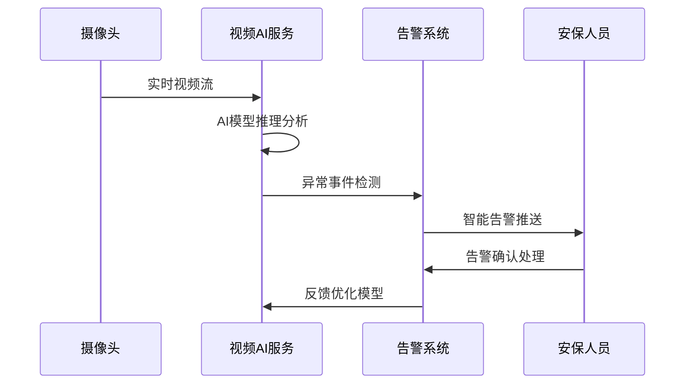

# IOE-DREAM AI智能分析业务指南

**文档版本**: v2.0.0
**更新日期**: 2025-12-16
**业务模块**: AI智能分析
**服务名称**: ioedream-video-service (AI分析模块) + ioedream-common-service (数据分析模块)
**端口**: 8092, 8088

---

## 📋 业务概述

### 业务定义
AI智能分析是IOE-DREAM智慧园区管理平台的核心智能模块，通过人工智能技术提供视频分析、数据分析、行为预测、异常检测等智能服务，赋能园区的智能化管理。

### 业务价值
- **智能监控**: AI视频监控替代人工，提高监控效率
- **预测预警**: 基于历史数据预测安全风险
- **决策支持**: 数据洞察支持管理决策
- **运营优化**: 通过AI优化园区运营效率

### 核心特性
- ✅ **视频AI分析**: 人脸识别、行为分析、车辆识别
- ✅ **数据挖掘**: 大数据分析、趋势预测、模式识别
- ✅ **异常检测**: 实时异常行为检测、智能告警
- ✅ **智能预警**: 基于AI的风险预警和安全防护
- ✅ **决策支持**: AI驱动的管理决策支持系统

---

## 🎯 业务场景

### 1. 安防监控智能分析场景

#### 场景描述
通过AI视频分析技术，实现园区的智能安防监控，替代传统人工监控。

#### 典型应用
- **人脸识别**: 实时人脸检测和身份识别
- **行为分析**: 异常行为自动检测和告警
- **车辆识别**: 车牌识别、车辆类型分析
- **入侵检测**: 非法闯入、周界入侵检测
- **物品识别**: 遗留物品检测、可疑物品识别

**AI分析流程**:


### 2. 运营数据智能分析场景

#### 场景描述
基于园区运营数据，通过大数据分析和机器学习，提供运营洞察和优化建议。

#### 典型应用
- **访客流量分析**: 访客流量预测和优化
- **资源利用率**: 设备和空间利用率分析
- **能耗分析**: 建筑能耗优化和节能建议
- **服务效率**: 各类服务效率分析和改进

### 3. 业务流程智能优化场景

#### 场景描述
通过AI优化业务流程，提高工作效率和服务质量。

#### 典型应用
- **智能排班**: 基于历史数据和预测的智能排班
- **流程自动化**: 重复性工作自动化处理
- **质量检测**: 服务质量智能评估
- **用户画像**: 基于行为数据的用户画像分析

---

## 🏗️ 系统架构

### AI分析架构
```
AI智能分析平台
├── 视频AI分析模块 (ioedream-video-service:8092)
│   ├── 人脸识别服务
│   ├── 行为分析服务
│   ├── 车辆识别服务
│   ├── 物体检测服务
│   └── 异常检测服务
├── 数据分析模块 (ioedream-common-service:8088)
│   ├── 数据采集服务
│   ├── 数据清洗服务
│   ├── 机器学习服务
│   ├── 预测分析服务
│   └── 报表生成服务
├── AI模型管理
│   ├── 模型训练平台
│   ├── 模型部署服务
│   ├── 模型监控服务
│   └── 模型版本管理
└── AI基础平台
    ├── GPU计算资源
    ├── 分布式存储
    ├── 消息队列
    └── 监控告警
```

### 技术栈
- **深度学习**: TensorFlow, PyTorch, OpenCV
- **机器学习**: Scikit-learn, XGBoost, LightGBM
- **数据处理**: Apache Spark, Pandas, NumPy
- **数据存储**: Hadoop HDFS, MongoDB, InfluxDB
- **实时计算**: Apache Flink, Kafka, Redis
- **模型服务**: TensorFlow Serving, ONNX Runtime

### 部署架构
- **GPU集群**: NVIDIA GPU服务器集群
- **容器化**: Docker + Kubernetes
- **微服务**: AI服务微服务化部署
- **边缘计算**: 边缘AI推理节点

---

## 📊 AI分析数据模型

### 核心实体

#### 1. AI分析任务实体 (AIAnalysisTaskEntity)
```java
@Entity
@Table(name = "t_ai_analysis_task")
public class AIAnalysisTaskEntity extends BaseEntity {
    @TableId(type = IdType.ASSIGN_ID)
    private Long taskId;                   // 任务ID

    @NotBlank
    @Size(max = 100)
    @TableField("task_name")
    private String taskName;               // 任务名称

    @NotNull
    @TableField("task_type")
    private Integer taskType;               // 任务类型(1-视频分析 2-数据分析 3-预测分析)

    @NotNull
    @TableField("analysis_type")
    private Integer analysisType;           // 分析类型

    @TableField("model_id")
    private String modelId;                // 模型ID

    @TableField("model_version")
    private String modelVersion;           // 模型版本

    @TableField("input_data")
    private String inputData;              // 输入数据(JSON)

    @TableField("config_params")
    private String configParams;           // 配置参数(JSON)

    @NotNull
    @TableField("status")
    private Integer status;                 // 状态(1-待处理 2-处理中 3-已完成 4-失败)

    @TableField("start_time")
    private LocalDateTime startTime;         // 开始时间

    @TableField("end_time")
    private LocalDateTime endTime;           // 结束时间

    @TableField("result_data")
    private String resultData;             // 结果数据(JSON)

    @TableField("confidence")
    private BigDecimal confidence;          // 置信度

    @TableField("execute_time")
    private Long executeTime;              // 执行耗时(毫秒)

    @TableField("resource_usage")
    private String resourceUsage;          // 资源使用情况(JSON)
}
```

#### 2. 视频AI分析结果实体 (VideoAIAnalysisEntity)
```java
@Entity
@Table(name = "t_video_ai_analysis")
public class VideoAIAnalysisEntity extends BaseEntity {
    @TableId(type = IdType.ASSIGN_ID)
    private Long analysisId;                // 分析ID

    @NotNull
    @TableField("task_id")
    private Long taskId;                   // 任务ID

    @NotNull
    @TableField("camera_id")
    private Long cameraId;                 // 摄像头ID

    @TableField("camera_name")
    private String cameraName;             // 摄像头名称

    @NotNull
    @TableField("analysis_time")
    private LocalDateTime analysisTime;    // 分析时间

    @NotNull
    @TableField("analysis_type")
    private Integer analysisType;          // 分析类型(1-人脸 2-行为 3-车辆 4-物体)

    @TableField("detection_results")
    private String detectionResults;      // 检测结果(JSON)

    @TableField("confidence")
    private BigDecimal confidence;          // 置信度

    @TableField("bbox_coordinates")
    private String bboxCoordinates;        // 边界框坐标(JSON)

    @TableField("attributes")
    private String attributes;             // 属性信息(JSON)

    @TableField("image_url")
    private String imageUrl;               // 截图URL

    @TableField("video_url")
    private String videoUrl;               // 视频片段URL

    @NotNull
    @TableField("alert_level")
    private Integer alertLevel;            // 告警级别(1-正常 2-注意 3-警告 4-紧急)

    @TableField("alert_message")
    private String alertMessage;           // 告警信息

    @TableField("is_processed")
    private Boolean isProcessed;           // 是否已处理

    @TableField("process_time")
    private LocalDateTime processTime;      // 处理时间

    @TableField("process_user_id")
    private Long processUserId;            // 处理人ID

    @TableField("process_note")
    private String processNote;            // 处理备注
}
```

#### 3. 预测模型实体 (PredictionModelEntity)
```java
@Entity
@Table(name = "t_prediction_model")
public class PredictionModelEntity extends BaseEntity {
    @TableId(type = IdType.ASSIGN_ID)
    private Long modelId;                  // 模型ID

    @NotBlank
    @Size(max = 100)
    @TableField("model_name")
    private String modelName;              // 模型名称

    @NotBlank
    @Size(max = 50)
    @TableField("model_code")
    private String modelCode;              // 模型编码

    @NotNull
    @TableField("model_type")
    private Integer modelType;              // 模型类型(1-分类 2-回归 3-聚类 4-时间序列)

    @NotNull
    @TableField("prediction_type")
    private Integer predictionType;        // 预测类型(1-流量预测 2-行为预测 3-异常预测)

    @TableField("algorithm")
    private String algorithm;              // 算法名称

    @TableField("model_path")
    private String modelPath;              // 模型文件路径

    @TableField("model_params")
    private String modelParams;            // 模型参数(JSON)

    @TableField("feature_columns")
    private String featureColumns;         // 特征字段(JSON)

    @TableField("target_column")
    private String targetColumn;           // 目标字段

    @NotNull
    @TableField("status")
    private Integer status;                 // 状态(1-训练中 2-已完成 3-已部署 4-已失效)

    @TableField("accuracy")
    private BigDecimal accuracy;            // 准确率

    @TableField("precision")
    private BigDecimal precision;           // 精确率

    @TableField("recall")
    private BigDecimal recall;              // 召回率

    @TableField("f1_score")
    private BigDecimal f1Score;             // F1分数

    @TableField("training_time")
    private LocalDateTime trainingTime;     // 训练时间

    @TableField("last_update_time")
    private LocalDateTime lastUpdateTime;   // 最后更新时间

    @TableField("prediction_count")
    private Long predictionCount;          // 预测次数

    @TableField("success_count")
    private Long successCount;             // 成功预测次数
}
```

---

## 🔧 AI功能详解

### 1. 视频AI分析

#### 1.1 人脸识别
**功能描述**: 实时人脸检测、特征提取和身份识别。

**技术实现**:
```python
# 人脸识别核心算法
class FaceRecognitionService:

    def __init__(self):
        self.face_detector = MTCNN()
        self.face_encoder = FaceNet()
        self.face_database = FaceDatabase()

    def recognize_face(self, image):
        # 人脸检测
        faces = self.face_detector.detect(image)

        results = []
        for face in faces:
            # 特征提取
            embedding = self.face_encoder.extract(image, face)

            # 身份识别
            identity = self.face_database.search(embedding)

            results.append({
                'bbox': face.bbox,
                'confidence': face.confidence,
                'identity': identity,
                'embedding': embedding
            })

        return results
```

**应用场景**:
- **门禁控制**: 人脸识别门禁验证
- **访客管理**: 访客身份自动识别
- **考勤管理**: 人脸识别考勤打卡
- **黑名单预警**: 可疑人员自动告警

#### 1.2 行为分析
**功能描述**: 基于姿态估计和行为识别，分析人员行为模式。

**行为类型**:
- **正常行为**: 行走、站立、坐立
- **异常行为**: 跌倒、奔跑、打斗、徘徊
- **危险行为**: 爬高、翻越、破坏
- **违规行为**: 吸烟、打电话、违规操作

**技术实现**:
```python
class BehaviorAnalysisService:

    def __init__(self):
        self.pose_estimator = OpenPose()
        self.behavior_classifier = BehaviorClassifier()

    def analyze_behavior(self, video_frames):
        # 姿态估计
        poses = self.pose_estimator.extract_poses(video_frames)

        # 行为识别
        behaviors = []
        for pose_sequence in poses:
            behavior = self.behavior_classifier.classify(pose_sequence)
            behaviors.append(behavior)

        return behaviors

    def detect_anomaly(self, behaviors):
        # 异常检测
        anomalies = []
        for behavior in behaviors:
            if behavior.is_anomaly:
                anomalies.append({
                    'type': behavior.type,
                    'confidence': behavior.confidence,
                    'location': behavior.location,
                    'timestamp': behavior.timestamp
                })

        return anomalies
```

#### 1.3 车辆识别
**功能描述**: 车辆检测、车牌识别、车型分类。

**识别能力**:
- **车辆检测**: 汽车、卡车、摩托车、自行车
- **车牌识别**: 车牌号码识别和颜色识别
- **车型分类**: 品牌型号、颜色、用途分类
- **行为分析**: 违章停车、超速检测、轨迹分析

### 2. 数据分析

#### 2.1 访客流量分析
**功能描述**: 基于历史访客数据，进行流量预测和优化建议。

**分析维度**:
- **时间维度**: 日流量、周流量、月流量趋势
- **空间维度**: 各区域访客分布
- **来源分析**: 访客来源渠道分析
- **行为分析**: 访客行为路径分析

**预测模型**:
```python
class VisitorFlowPrediction:

    def __init__(self):
        self.lstm_model = LSTM_Predictor()
        self.feature_extractor = FeatureExtractor()

    def predict_visitor_flow(self, historical_data, prediction_days=7):
        # 特征工程
        features = self.feature_extractor.extract(historical_data)

        # LSTM预测
        predictions = self.lstm_model.predict(features, prediction_days)

        # 置信区间计算
        confidence_intervals = self.calculate_confidence_intervals(predictions)

        return {
            'predictions': predictions,
            'confidence_intervals': confidence_intervals,
            'trend_analysis': self.analyze_trend(predictions)
        }
```

#### 2.2 异常检测
**功能描述**: 基于机器学习的异常行为检测和预警。

**检测方法**:
- **统计异常**: 基于统计分布的异常检测
- **孤立森林**: 基于树模型的异常检测
- **自编码器**: 基于神经网络的异常检测
- **时序异常**: 基于时间序列的异常检测

**异常检测流程**:
```python
class AnomalyDetectionService:

    def __init__(self):
        self.isolation_forest = IsolationForest()
        self.autoencoder = AutoEncoder()
        self.statistical_detector = StatisticalDetector()

    def detect_anomaly(self, data, method='ensemble'):
        if method == 'statistical':
            return self.statistical_detector.detect(data)
        elif method == 'isolation_forest':
            return self.isolation_forest.detect(data)
        elif method == 'autoencoder':
            return self.autoencoder.detect(data)
        elif method == 'ensemble':
            # 集成多个检测结果
            results = []
            results.append(self.statistical_detector.detect(data))
            results.append(self.isolation_forest.detect(data))
            results.append(self.autoencoder.detect(data))
            return self.ensemble_results(results)
```

### 3. 预测分析

#### 3.1 需求预测
**功能描述**: 预测各类资源需求，优化资源配置。

**预测类型**:
- **访客量预测**: 日访客量、周访客量预测
- **设备需求预测**: 门禁设备、停车位需求
- **服务需求预测**: 餐厅、会议室需求
- **能耗预测**: 电力、水资源消耗预测

#### 3.2 风险预警
**功能描述**: 基于AI的风险评估和预警系统。

**风险类型**:
- **安全风险**: 入侵风险、设备故障风险
- **运营风险**: 服务中断风险、资源不足风险
- **合规风险**: 违规行为风险、数据安全风险
- **财务风险**: 成本超支风险、效率下降风险

---

## 📱 AI应用集成

### 移动端AI功能
```javascript
// AI功能移动端集成
class AIFeatureManager {

    // 人脸识别登录
    async faceLogin(imageData) {
        try {
            const response = await uni.request({
                url: '/api/v1/ai/face/recognition',
                method: 'POST',
                data: {
                    image: imageData,
                    purpose: 'login'
                }
            });

            if (response.data.code === 200) {
                const { userId, confidence } = response.data.data;
                if (confidence > 0.8) {
                    return this.handleLoginSuccess(userId);
                } else {
                    throw new Error('人脸识别置信度不足');
                }
            }
        } catch (error) {
            uni.showToast({
                title: '人脸识别失败',
                icon: 'none'
            });
        }
    }

    // 智能推荐
    async getSmartRecommendations(userBehavior) {
        const response = await uni.request({
            url: '/api/v1/ai/recommendation',
            method: 'POST',
            data: {
                behavior: userBehavior,
                scene: 'home'
            }
        });

        return response.data.data;
    }
}
```

### 实时AI分析
```vue
<template>
  <view class="ai-analysis">
    <!-- 实时行为分析 -->
    <view class="behavior-analysis">
      <text class="title">实时行为分析</text>
      <view class="analysis-result">
        <text>当前状态: {{ analysisResult.status }}</text>
        <text>置信度: {{ analysisResult.confidence }}%</text>
        <text>异常检测: {{ analysisResult.anomaly ? '是' : '否' }}</text>
      </view>
    </view>

    <!-- 智能推荐 -->
    <view class="smart-recommendations">
      <text class="title">智能推荐</text>
      <view class="recommendation-list">
        <view
          v-for="item in recommendations"
          :key="item.id"
          class="recommendation-item"
          @click="handleRecommendation(item)">
          <text class="title">{{ item.title }}</text>
          <text class="description">{{ item.description }}</text>
          <text class="confidence">推荐度: {{ item.confidence }}%</text>
        </view>
      </view>
    </view>
  </view>
</template>
```

---

## 💻 管理端AI功能

### AI模型管理
- **模型训练**: 支持在线模型训练和调优
- **模型部署**: 一键部署模型到生产环境
- **模型监控**: 实时监控模型性能和准确率
- **模型版本**: 模型版本管理和回滚

### AI分析报告
```vue
<template>
  <div class="ai-analysis-dashboard">
    <!-- AI模型状态 -->
    <div class="model-status">
      <h3>AI模型状态</h3>
      <el-row :gutter="20">
        <el-col :span="6" v-for="model in models" :key="model.id">
          <el-card class="model-card">
            <div class="model-info">
              <h4>{{ model.name }}</h4>
              <p>准确率: {{ model.accuracy }}%</p>
              <p>状态: {{ model.status | statusFilter }}</p>
              <p>最后更新: {{ model.lastUpdate }}</p>
            </div>
          </el-card>
        </el-col>
      </el-row>
    </div>

    <!-- AI分析结果 -->
    <div class="analysis-results">
      <h3>AI分析结果</h3>
      <el-tabs v-model="activeTab">
        <el-tab-pane label="视频分析" name="video">
          <video-analysis-results :data="videoResults" />
        </el-tab-pane>
        <el-tab-pane label="数据预测" name="prediction">
          <prediction-results :data="predictionResults" />
        </el-tab-pane>
        <el-tab-pane label="异常检测" name="anomaly">
          <anomaly-detection-results :data="anomalyResults" />
        </el-tab-pane>
      </el-tabs>
    </div>
  </div>
</template>
```

---

## 🔗 AI系统集成

### 1. 视频系统AI集成
```java
@Service
public class VideoAIIntegrationService {

    @Resource
    private VideoAIAnalysisService aiAnalysisService;

    @Resource
    private CameraService cameraService;

    @Async("aiAnalysisExecutor")
    public void analyzeVideoStream(Long cameraId) {
        // 获取实时视频流
        VideoStream stream = cameraService.getVideoStream(cameraId);

        // AI分析
        AIAnalysisTask task = AIAnalysisTask.builder()
                .cameraId(cameraId)
                .analysisType(AnalysisType.VIDEO)
                .inputData(stream.getUrl())
                .build();

        AIAnalysisResult result = aiAnalysisService.analyze(task);

        // 处理分析结果
        processAIResult(result);
    }

    private void processAIResult(AIAnalysisResult result) {
        if (result.hasAnomaly()) {
            // 发送告警
            alertService.sendAlert(result.getAnomaly());
        }

        // 存储分析结果
        analysisResultRepository.save(result);
    }
}
```

### 2. 数据分析系统集成
```java
@Service
public class DataAnalysisIntegrationService {

    @Resource
    private PredictionService predictionService;

    public void scheduleDailyPrediction() {
        // 每日定时预测任务
        List<PredictionTask> tasks = Arrays.asList(
                PredictionTask.builder()
                        .type(PredictionType.VISITOR_FLOW)
                        .timeRange(TimeRange.NEXT_WEEK)
                        .build(),
                PredictionTask.builder()
                        .type(PredictionType.RESOURCE_USAGE)
                        .timeRange(TimeRange.NEXT_WEEK)
                        .build()
        );

        tasks.parallelStream().forEach(predictionService::predict);
    }
}
```

---

## 📊 性能优化

### 1. AI模型优化
- **模型压缩**: 减少模型大小，提高推理速度
- **量化优化**: 8位量化，降低计算资源
- **批处理**: 批量推理，提高吞吐量
- **缓存机制**: 缓存常用特征和结果

### 2. 计算资源优化
- **GPU调度**: 智能GPU资源调度
- **负载均衡**: 多节点负载均衡
- **弹性扩容**: 根据负载自动扩容
- **资源监控**: 实时监控资源使用

### 3. 数据处理优化
- **流式处理**: 实时流式数据处理
- **并行计算**: 多核并行计算
- **数据预处理**: 高效的数据预处理
- **内存管理**: 优化内存使用

---

## 🔒 AI安全管控

### 1. 数据隐私保护
- **数据脱敏**: 敏感数据自动脱敏
- **加密存储**: 模型数据加密存储
- **访问控制**: 基于角色的数据访问
- **审计日志**: 完整的AI操作审计

### 2. 模型安全
- **模型验证**: 模型安全性和可靠性验证
- **防攻击**: 对抗性攻击防护
- **版本控制**: 模型版本安全管理
- **备份恢复**: 模型备份和恢复机制

### 3. 算法公平性
- **偏差检测**: 算法偏差检测和修正
- **公平性评估**: 算法公平性定期评估
- **透明度**: 算法决策过程透明化
- **可解释性**: AI决策可解释性

---

## 📈 AI监控告警

### 1. 模型监控
- **准确率监控**: 实时监控模型准确率
- **性能监控**: 推理延迟和吞吐量监控
- **数据漂移**: 数据分布漂移检测
- **模型退化**: 模型性能退化预警

### 2. 资源监控
- **GPU使用率**: GPU资源使用监控
- **内存使用**: 内存使用情况监控
- **网络带宽**: 网络带宽使用监控
- **存储空间**: 存储空间使用监控

### 3. 业务监控
- **分析数量**: AI分析任务数量统计
- **准确率统计**: 各类AI分析准确率
- **异常检测**: 异常事件统计和趋势
- **用户满意度**: AI服务满意度调查

---

## 🚀 AI运维管理

### 1. 模型生命周期管理
- **模型开发**: 模型开发环境和工具
- **模型训练**: 分布式模型训练
- **模型部署**: 自动化模型部署
- **模型监控**: 模型性能和健康监控
- **模型更新**: 模型持续优化和更新

### 2. 数据管理
- **数据收集**: 多源数据收集和整合
- **数据清洗**: 自动化数据清洗
- **数据标注**: 高质量数据标注
- **数据存储**: 高效数据存储管理

### 3. 平台运维
- **容器编排**: Kubernetes容器编排
- **服务发现**: 微服务自动发现
- **负载均衡**: 智能负载均衡
- **故障恢复**: 自动故障检测和恢复

---

## 🔮 AI未来规划

### 1. 技术升级
- **大模型应用**: 集成大规模预训练模型
- **多模态AI**: 融合视觉、语音、文本的多模态分析
- **边缘AI**: 边缘设备AI推理优化
- **联邦学习**: 保护隐私的分布式学习

### 2. 能力扩展
- **语音识别**: 语音转文字和语音指令识别
- **自然语言处理**: 智能客服和文档理解
- **计算机视觉**: 更高级的视觉理解能力
- **知识图谱**: 领域知识图谱构建和应用

### 3. 应用创新
- **数字孪生**: 园区数字孪生系统
- **智能决策**: AI驱动的智能决策系统
- **预测性维护**: 设备预测性维护
- **个性化服务**: 基于AI的个性化服务推荐

---

## 📞 AI支持与服务

### 技术支持
- **AI咨询**: AI技术咨询服务
- **模型定制**: 定制化AI模型开发
- **培训服务**: AI技术培训和支持
- **专家服务**: AI专家技术支持

### 平台服务
- **API服务**: 丰富的AI API接口
- **SDK支持**: 多语言SDK支持
- **开发者工具**: AI开发工具和平台
- **社区支持**: AI开发者社区

---

**文档维护**: IOE-DREAM AI智能分析团队
**最后更新**: 2025-12-16
**版本**: v2.0.0
**审核状态**: 已审核