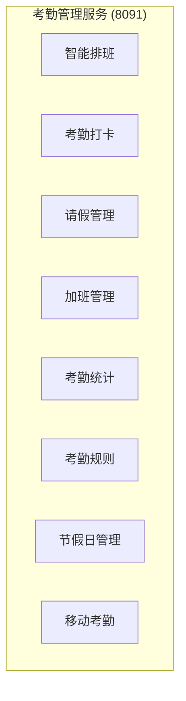
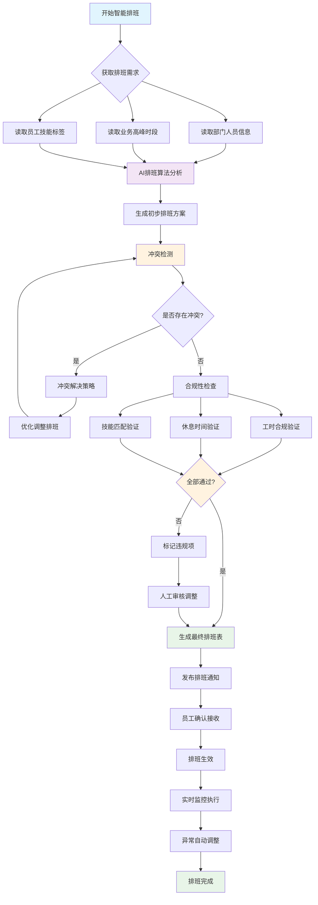
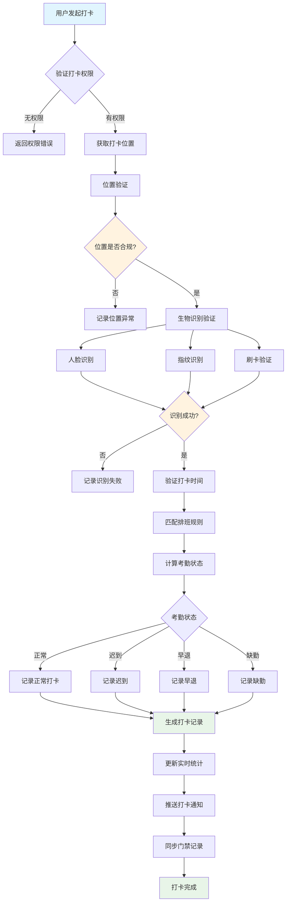
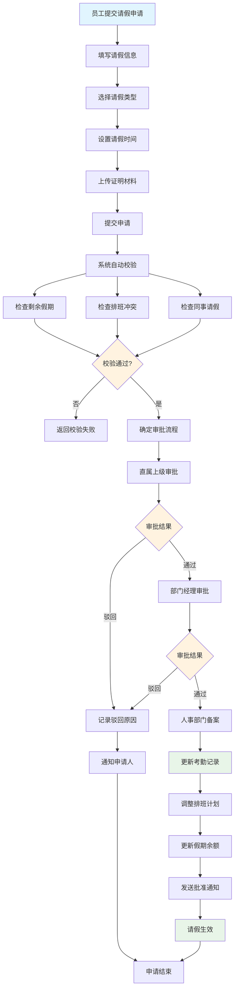
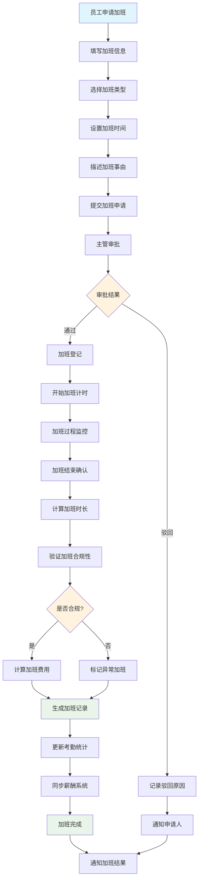
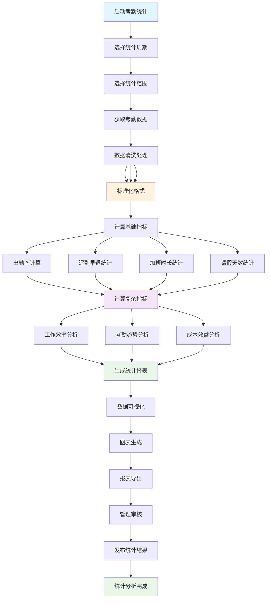
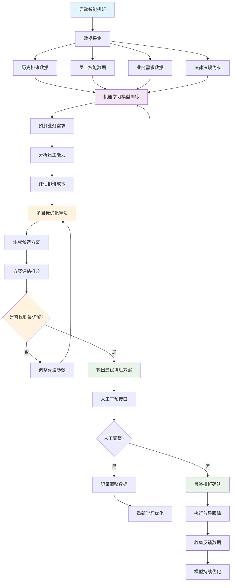
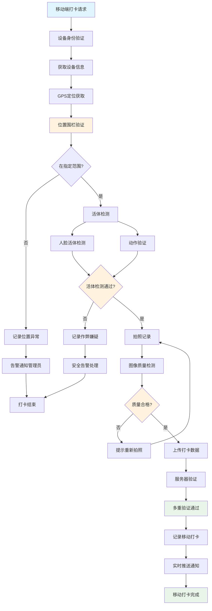
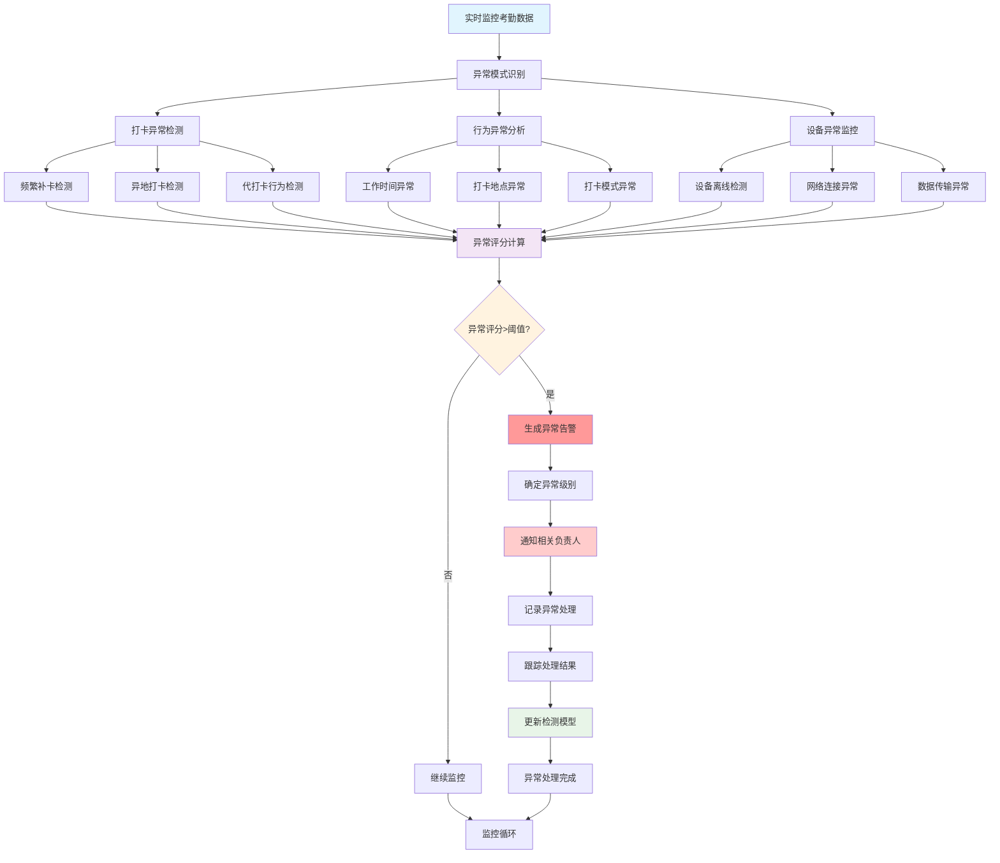

# IOE-DREAM 考勤管理业务流程图

> **模块名称**: ioedream-attendance-service
> **端口**: 8091
> **完成度**: 65%
> **P0级缺失功能**: 智能排班引擎、移动考勤支持
> **创建时间**: 2025-12-16
> **业务场景**: 智能考勤管理，支持多种排班模式和生物识别打卡

---

## 📋 考勤管理业务架构

### 核心功能模块



### 系统边界

- **输入**: 用户打卡、排班配置、请假申请、加班记录
- **输出**: 考勤记录、统计报表、异常告警、薪资计算数据
- **集成**: 门禁系统、OA系统、人力资源系统、移动APP

---

## 🔄 核心业务流程

### 1. 智能排班管理流程



**流程说明**:
- 基于AI算法的智能排班，考虑业务需求、员工技能、法律法规
- 自动冲突检测和解决，确保排班的合理性
- 多维度合规性检查，包括工时、休息时间、技能匹配
- 支持人工审核和调整，确保排班方案的可执行性

### 2. 考勤打卡管理流程



**流程说明**:
- 支持多种验证方式：人脸、指纹、刷卡、移动端
- 智能位置验证，确保在指定地点打卡
- 自动匹配排班规则，判断考勤状态
- 实时统计和通知，提高考勤管理效率

### 3. 请假审批管理流程



**流程说明**:
- 多级审批流程：直属上级 → 部门经理 → 人事部门
- 智能冲突检测：排班冲突、同事重叠请假
- 自动假期余额管理，实时更新剩余天数
- 审批通过后自动调整考勤记录和排班计划

### 4. 加班管理流程



**流程说明**:
- 加班申请审批流程，确保加班的必要性
- 实时加班计时和过程监控
- 加班合规性验证，符合劳动法规要求
- 自动计算加班费用，同步薪酬系统

### 5. 考勤统计分析流程



**流程说明**:
- 多维度考勤数据统计和分析
- 智能数据清洗，确保统计准确性
- 复杂指标计算：工作效率、考勤趋势、成本效益
- 丰富的可视化报表，支持决策分析

---

## 🧠 智能功能流程

### 1. 智能排班算法流程



### 2. 移动考勤支持流程



### 3. 考勤异常智能检测流程



---

## 💾 数据库设计

### 核心表结构

#### 1. 考勤记录表 (t_attendance_record)

```sql
CREATE TABLE `t_attendance_record` (
    `record_id` BIGINT NOT NULL AUTO_INCREMENT COMMENT '记录ID',
    `user_id` BIGINT NOT NULL COMMENT '用户ID',
    `department_id` BIGINT NOT NULL COMMENT '部门ID',
    `attendance_date` DATE NOT NULL COMMENT '考勤日期',
    `clock_type` TINYINT NOT NULL COMMENT '打卡类型 1-上班 2-下班 3-加班开始 4-加班结束',
    `clock_time` DATETIME NOT NULL COMMENT '打卡时间',
    `clock_location` VARCHAR(100) COMMENT '打卡位置',
    `latitude` DECIMAL(10,6) COMMENT '纬度',
    `longitude` DECIMAL(10,6) COMMENT '经度',
    `verify_method` TINYINT NOT NULL COMMENT '验证方式 1-人脸 2-指纹 3-刷卡 4-密码 5-移动端',
    `verify_result` TINYINT NOT NULL COMMENT '验证结果 1-成功 2-失败',
    `attendance_status` TINYINT NOT NULL COMMENT '考勤状态 1-正常 2-迟到 3-早退 4-缺勤 5-请假 6-出差',
    `work_shift_id` BIGINT COMMENT '班次ID',
    `schedule_time` DATETIME COMMENT '应打卡时间',
    `late_minutes` INT DEFAULT 0 COMMENT '迟到分钟数',
    `early_leave_minutes` INT DEFAULT 0 COMMENT '早退分钟数',
    `overtime_hours` DECIMAL(4,2) DEFAULT 0.00 COMMENT '加班小时数',
    `photo_path` VARCHAR(500) COMMENT '打卡照片路径',
    `device_id` VARCHAR(50) COMMENT '打卡设备ID',
    `ip_address` VARCHAR(50) COMMENT 'IP地址',
    `remark` VARCHAR(500) COMMENT '备注',
    `create_time` DATETIME NOT NULL DEFAULT CURRENT_TIMESTAMP COMMENT '创建时间',
    `update_time` DATETIME NOT NULL DEFAULT CURRENT_TIMESTAMP ON UPDATE CURRENT_TIMESTAMP COMMENT '更新时间',
    `deleted_flag` TINYINT DEFAULT 0 COMMENT '删除标记 0-未删除 1-已删除',
    PRIMARY KEY (`record_id`),
    KEY `idx_user_attendance_date` (`user_id`, `attendance_date`),
    KEY `idx_department_date` (`department_id`, `attendance_date`),
    KEY `idx_clock_time` (`clock_time`),
    KEY `idx_attendance_status` (`attendance_status`),
    KEY `idx_work_shift_id` (`work_shift_id`),
    KEY `idx_create_time` (`create_time`)
) ENGINE=InnoDB DEFAULT CHARSET=utf8mb4 COLLATE=utf8mb4_unicode_ci COMMENT='考勤记录表';
```

#### 2. 排班管理表 (t_work_shift)

```sql
CREATE TABLE `t_work_shift` (
    `shift_id` BIGINT NOT NULL AUTO_INCREMENT COMMENT '班次ID',
    `shift_name` VARCHAR(100) NOT NULL COMMENT '班次名称',
    `shift_type` TINYINT NOT NULL COMMENT '班次类型 1-正常班 2-弹性班 3-轮班 4-夜班',
    `work_start_time` TIME NOT NULL COMMENT '上班时间',
    `work_end_time` TIME NOT NULL COMMENT '下班时间',
    `work_duration` DECIMAL(4,2) NOT NULL COMMENT '工作时长(小时)',
    `break_duration` DECIMAL(4,2) DEFAULT 0.00 COMMENT '休息时长(小时)',
    `late_tolerance` INT DEFAULT 0 COMMENT '迟到容忍(分钟)',
    `early_leave_tolerance` INT DEFAULT 0 COMMENT '早退容忍(分钟)',
    `overtime_enabled` TINYINT DEFAULT 1 COMMENT '是否允许加班 1-允许 0-不允许',
    `flexible_enabled` TINYINT DEFAULT 0 COMMENT '是否弹性班制 1-是 0-否',
    `flexible_start_time` TIME COMMENT '弹性最早时间',
    `flexible_end_time` TIME COMMENT '弹性最晚时间',
    `night_shift_allowance` DECIMAL(10,2) DEFAULT 0.00 COMMENT '夜班补贴',
    `weekend_work` TINYINT DEFAULT 0 COMMENT '是否周末工作 1-是 0-否',
    `holiday_work` TINYINT DEFAULT 0 COMMENT '是否节假日工作 1-是 0-否',
    `status` TINYINT DEFAULT 1 COMMENT '状态 1-启用 0-禁用',
    `sort_order` INT DEFAULT 0 COMMENT '排序',
    `remark` VARCHAR(500) COMMENT '备注',
    `create_time` DATETIME NOT NULL DEFAULT CURRENT_TIMESTAMP COMMENT '创建时间',
    `update_time` DATETIME NOT NULL DEFAULT CURRENT_TIMESTAMP ON UPDATE CURRENT_TIMESTAMP COMMENT '更新时间',
    `deleted_flag` TINYINT DEFAULT 0 COMMENT '删除标记 0-未删除 1-已删除',
    PRIMARY KEY (`shift_id`),
    KEY `idx_shift_name` (`shift_name`),
    KEY `idx_shift_type` (`shift_type`),
    KEY `idx_status` (`status`),
    KEY `idx_create_time` (`create_time`)
) ENGINE=InnoDB DEFAULT CHARSET=utf8mb4 COLLATE=utf8mb4_unicode_ci COMMENT='排班管理表';
```

#### 3. 员工排班表 (t_employee_schedule)

```sql
CREATE TABLE `t_employee_schedule` (
    `schedule_id` BIGINT NOT NULL AUTO_INCREMENT COMMENT '排班ID',
    `user_id` BIGINT NOT NULL COMMENT '用户ID',
    `department_id` BIGINT NOT NULL COMMENT '部门ID',
    `shift_id` BIGINT NOT NULL COMMENT '班次ID',
    `schedule_date` DATE NOT NULL COMMENT '排班日期',
    `work_date` DATE NOT NULL COMMENT '工作日期',
    `start_time` DATETIME NOT NULL COMMENT '开始时间',
    `end_time` DATETIME NOT NULL COMMENT '结束时间',
    `work_hours` DECIMAL(4,2) NOT NULL COMMENT '工作时长',
    `schedule_type` TINYINT NOT NULL COMMENT '排班类型 1-正常排班 2-加班排班 3-替班排班',
    `schedule_status` TINYINT DEFAULT 1 COMMENT '排班状态 1-生效 2-待确认 3-已取消',
    `is_overtime` TINYINT DEFAULT 0 COMMENT '是否加班 1-是 0-否',
    `overtime_hours` DECIMAL(4,2) DEFAULT 0.00 COMMENT '加班时长',
    `replace_user_id` BIGINT COMMENT '替班人员ID',
    `schedule_source` TINYINT DEFAULT 1 COMMENT '排班来源 1-系统排班 2-人工排班 3-员工申请',
    `ai_optimized` TINYINT DEFAULT 0 COMMENT '是否AI优化 1-是 0-否',
    `optimization_score` DECIMAL(5,2) COMMENT '优化评分',
    `conflict_flag` TINYINT DEFAULT 0 COMMENT '冲突标记 1-有冲突 0-无冲突',
    `remark` VARCHAR(500) COMMENT '备注',
    `create_time` DATETIME NOT NULL DEFAULT CURRENT_TIMESTAMP COMMENT '创建时间',
    `update_time` DATETIME NOT NULL DEFAULT CURRENT_TIMESTAMP ON UPDATE CURRENT_TIMESTAMP COMMENT '更新时间',
    `deleted_flag` TINYINT DEFAULT 0 COMMENT '删除标记 0-未删除 1-已删除',
    PRIMARY KEY (`schedule_id`),
    UNIQUE KEY `uk_user_schedule_date` (`user_id`, `schedule_date`),
    KEY `idx_department_date` (`department_id`, `schedule_date`),
    KEY `idx_shift_id` (`shift_id`),
    KEY `idx_schedule_type` (`schedule_type`),
    KEY `idx_schedule_status` (`schedule_status`),
    KEY `idx_ai_optimized` (`ai_optimized`),
    KEY `idx_create_time` (`create_time`)
) ENGINE=InnoDB DEFAULT CHARSET=utf8mb4 COLLATE=utf8mb4_unicode_ci COMMENT='员工排班表';
```

#### 4. 请假申请表 (t_leave_application)

```sql
CREATE TABLE `t_leave_application` (
    `application_id` BIGINT NOT NULL AUTO_INCREMENT COMMENT '申请ID',
    `user_id` BIGINT NOT NULL COMMENT '申请人ID',
    `department_id` BIGINT NOT NULL COMMENT '部门ID',
    `leave_type` TINYINT NOT NULL COMMENT '请假类型 1-事假 2-病假 3-年假 4-婚假 5-产假 6-丧假 7-其他',
    `start_time` DATETIME NOT NULL COMMENT '开始时间',
    `end_time` DATETIME NOT NULL COMMENT '结束时间',
    `leave_days` DECIMAL(4,2) NOT NULL COMMENT '请假天数',
    `leave_hours` DECIMAL(4,2) NOT NULL COMMENT '请假小时数',
    `reason` TEXT COMMENT '请假原因',
    `attachment_path` VARCHAR(500) COMMENT '附件路径',
    `approver_id` BIGINT COMMENT '审批人ID',
    `approval_status` TINYINT DEFAULT 0 COMMENT '审批状态 0-待审批 1-审批中 2-已通过 3-已驳回',
    `approval_time` DATETIME COMMENT '审批时间',
    `approval_comment` VARCHAR(500) COMMENT '审批意见',
    `final_approver_id` BIGINT COMMENT '最终审批人ID',
    `final_approval_status` TINYINT DEFAULT 0 COMMENT '最终审批状态',
    `final_approval_time` DATETIME COMMENT '最终审批时间',
    `final_approval_comment` VARCHAR(500) COMMENT '最终审批意见',
    `affected_schedules` TEXT COMMENT '影响的排班(JSON格式)',
    `annual_leave_used` DECIMAL(4,2) DEFAULT 0.00 COMMENT '使用年假天数',
    `sick_leave_used` DECIMAL(4,2) DEFAULT 0.00 COMMENT '使用病假天数',
    `personal_leave_used` DECIMAL(4,2) DEFAULT 0.00 COMMENT '使用事假天数',
    `salary_deduction` DECIMAL(10,2) DEFAULT 0.00 COMMENT '扣减薪资',
    `create_time` DATETIME NOT NULL DEFAULT CURRENT_TIMESTAMP COMMENT '创建时间',
    `update_time` DATETIME NOT NULL DEFAULT CURRENT_TIMESTAMP ON UPDATE CURRENT_TIMESTAMP COMMENT '更新时间',
    `deleted_flag` TINYINT DEFAULT 0 COMMENT '删除标记 0-未删除 1-已删除',
    PRIMARY KEY (`application_id`),
    KEY `idx_user_leave_date` (`user_id`, `start_time`, `end_time`),
    KEY `idx_department_status` (`department_id`, `approval_status`),
    KEY `idx_leave_type` (`leave_type`),
    KEY `idx_approver_id` (`approver_id`),
    KEY `idx_create_time` (`create_time`)
) ENGINE=InnoDB DEFAULT CHARSET=utf8mb4 COLLATE=utf8mb4_unicode_ci COMMENT='请假申请表';
```

---

## 🔧 技术接口设计

### 1. 智能排班引擎接口

```java
/**
 * 智能排班引擎
 */
public interface IntelligentSchedulingEngine {

    /**
     * 生成智能排班方案
     * @param request 排班请求
     * @return 排班方案
     */
    SchedulingResult generateSchedule(SchedulingRequest request);

    /**
     * 优化现有排班
     * @param currentSchedule 当前排班
     * @param optimizationType 优化类型
     * @return 优化后的排班
     */
    SchedulingResult optimizeSchedule(ScheduleEntity currentSchedule, OptimizationType optimizationType);

    /**
     * 检测排班冲突
     * @param schedule 排班方案
     * @return 冲突检测结果
     */
    ConflictDetectionResult detectConflicts(ScheduleEntity schedule);

    /**
     * 预测人员需求
     * @param predictionRequest 预测请求
     * @return 人员需求预测
     */
    StaffingPrediction predictStaffingNeeds(StaffingPredictionRequest predictionRequest);

    /**
     * 评估排班效果
     * @param schedule 排班方案
     * @param actualData 实际数据
     * @return 评估结果
     */
    ScheduleEvaluationResult evaluateSchedule(ScheduleEntity schedule, AttendanceDataEntity actualData);
}

/**
 * 排班请求
 */
@Data
public class SchedulingRequest {
    private Long departmentId;           // 部门ID
    private List<Long> userIds;          // 员工ID列表
    private LocalDate startDate;         // 开始日期
    private LocalDate endDate;           // 结束日期
    private List<BusinessConstraint> businessConstraints;  // 业务约束
    private List<PolicyConstraint> policyConstraints;      // 政策约束
    private OptimizationObjective objective;               // 优化目标
    private SchedulingPolicy policy;      // 排班策略
}

/**
 * 排班结果
 */
@Data
public class SchedulingResult {
    private List<EmployeeScheduleEntity> schedules;        // 排班列表
    private ScheduleMetrics metrics;      // 排班指标
    private List<ConflictInfo> conflicts; // 冲突信息
    private Double optimizationScore;     // 优化评分
    private Map<String, Object> insights; // 洞察分析
}
```

### 2. 考勤管理服务接口

```java
/**
 * 考勤管理服务
 */
public interface AttendanceManagementService {

    /**
     * 处理打卡请求
     * @param request 打卡请求
     * @return 打卡结果
     */
    AttendanceResult processClockIn(ClockInRequest request);

    /**
     * 获取考勤记录
     * @param query 查询条件
     * @return 考勤记录分页
     */
    PageResult<AttendanceRecordEntity> getAttendanceRecords(AttendanceQuery query);

    /**
     * 计算考勤统计
     * @param statisticsRequest 统计请求
     * @return 统计结果
     */
    AttendanceStatistics calculateStatistics(AttendanceStatisticsRequest statisticsRequest);

    /**
     * 处理异常考勤
     * @param exceptionId 异常ID
     * @param action 处理动作
     * @return 处理结果
     */
    AttendanceExceptionResult handleException(Long exceptionId, ExceptionAction action);

    /**
     * 导出考勤报表
     * @param exportRequest 导出请求
     * @return 导出文件路径
     */
    String exportAttendanceReport(AttendanceExportRequest exportRequest);
}

/**
 * 打卡请求
 */
@Data
public class ClockInRequest {
    private Long userId;                 // 用户ID
    private Integer clockType;           // 打卡类型
    private String location;             // 打卡位置
    private BigDecimal latitude;         // 纬度
    private BigDecimal longitude;        // 经度
    private Integer verifyMethod;        // 验证方式
    private String verifyData;           // 验证数据
    private String deviceInfo;           // 设备信息
    private String ipAddress;            // IP地址
}
```

### 3. 移动考勤支持接口

```java
/**
 * 移动考勤支持
 */
public interface MobileAttendanceSupport {

    /**
     * 移动端打卡
     * @param request 移动打卡请求
     * @return 打卡结果
     */
    MobileClockInResult mobileClockIn(MobileClockInRequest request);

    /**
     * 位置验证
     * @param userId 用户ID
     * @param location 位置信息
     * @return 验证结果
     */
    LocationVerificationResult verifyLocation(Long userId, LocationInfo location);

    /**
     * 活体检测
     * @param imageData 图像数据
     * @return 检测结果
     */
    LivenessDetectionResult detectLiveness(byte[] imageData);

    /**
     * 获取附近打卡点
     * @param userId 用户ID
     * @param coordinate 坐标
     * @return 附近打卡点列表
     */
    List<ClockInPointEntity> getNearbyClockInPoints(Long userId, Coordinate coordinate);

    /**
     * 离线打卡同步
     * @param userId 用户ID
     * @param offlineRecords 离线记录
     * @return 同步结果
     */
    OfflineSyncResult syncOfflineRecords(Long userId, List<OfflineAttendanceRecord> offlineRecords);
}
```

---

## 📊 功能完成度分析

### 已实现功能 (65%)

#### ✅ 基础功能完成
- **考勤记录管理**: 基础打卡、记录查询、数据统计
- **用户管理**: 员工信息维护、权限管理
- **班次管理**: 基础班次配置、工作时间设定
- **数据统计**: 基础考勤统计、报表生成
- **数据库设计**: 完整的表结构和索引设计

#### 🔄 部分实现功能
- **请假管理**: 基础申请流程，缺少智能审批
- **加班管理**: 基础加班记录，缺少合规性检查
- **移动支持**: 基础移动端接口，缺少安全验证
- **异常处理**: 基础异常检测，缺少智能分析

### 未实现功能 (35%)

#### ❌ P0级缺失功能
- **智能排班引擎**: AI算法驱动的人员排班优化
- **移动考勤安全**: GPS定位验证、活体检测
- **考勤异常检测**: 智能行为分析和异常识别
- **高级统计分析**: 多维度数据分析和趋势预测

#### ❌ P1级缺失功能
- **排班冲突解决**: 自动冲突检测和智能解决
- **多因子验证**: 人脸+指纹+位置的复合验证
- **实时监控推送**: 考勤状态实时监控和告警
- **数据可视化**: 高级图表和仪表板展示

#### ❌ P2级缺失功能
- **预测分析**: 基于历史数据的趋势预测
- **智能推荐**: 排班优化建议和异常处理建议
- **集成接口**: 与HR、薪酬系统的深度集成
- **性能优化**: 大规模并发处理优化

---

## 🚀 实施计划

### 第一阶段：P0级功能实现 (2-3周)

1. **智能排班引擎开发**
   - AI算法模型训练和优化
   - 排班冲突检测和解决
   - 多目标优化算法实现
   - 排班效果评估机制

2. **移动考勤安全增强**
   - GPS定位围栏验证
   - 人脸活体检测算法
   - 设备安全认证机制
   - 离线打卡数据同步

3. **考勤异常智能检测**
   - 行为模式分析算法
   - 异常评分计算模型
   - 实时监控和告警系统
   - 异常处理工作流

### 第二阶段：P1级功能完善 (2-3周)

1. **排班管理系统完善**
   - 可视化排班界面
   - 排班模板管理
   - 批量排班操作
   - 排班变更通知

2. **统计分析功能增强**
   - 多维度数据分析
   - 趋势预测模型
   - 自定义报表生成
   - 数据可视化展示

3. **系统集成优化**
   - HR系统集成
   - 薪酬系统对接
   - 门禁系统联动
   - 第三方考勤设备集成

### 第三阶段：P2级功能优化 (1-2周)

1. **性能优化和稳定性**
   - 高并发处理优化
   - 数据库查询优化
   - 缓存策略优化
   - 系统监控和告警

2. **用户体验优化**
   - 移动端界面优化
   - 操作流程简化
   - 多语言支持
   - 无障碍访问支持

---

## 📈 技术架构要求

### 性能要求
- **并发处理**: 支持1000+并发打卡请求
- **响应时间**: 打卡响应时间<500ms
- **数据处理**: 单日处理10万+考勤记录
- **统计分析**: 复杂统计查询<3秒

### 可靠性要求
- **系统可用性**: 99.9%以上
- **数据准确性**: 99.99%以上
- **故障恢复**: <5分钟快速恢复
- **数据备份**: 实时备份，支持快速恢复

### 安全性要求
- **身份认证**: 多因子生物识别认证
- **数据加密**: 传输和存储加密
- **权限控制**: 细粒度权限管理
- **审计追踪**: 完整的操作审计日志

---

## 📋 验收标准

### 功能验收
- ✅ 所有P0级功能100%实现
- ✅ 智能排班准确率≥90%
- ✅ 移动考勤验证通过率≥95%
- ✅ 异常检测准确率≥85%

### 性能验收
- ✅ 并发打卡处理能力≥1000/秒
- ✅ 统计查询响应时间≤3秒
- ✅ 系统可用性≥99.9%
- ✅ 数据处理准确率≥99.99%

### 用户体验验收
- ✅ 移动端打卡操作≤3步完成
- ✅ 排班调整实时生效≤1分钟
- ✅ 异常告警推送延迟≤30秒
- ✅ 用户满意度≥90%

---

**文档版本**: v1.0.0
**创建时间**: 2025-12-16
**适用范围**: IOE-DREAM考勤管理模块
**下次更新**: 功能实现完成后更新