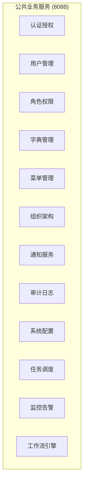
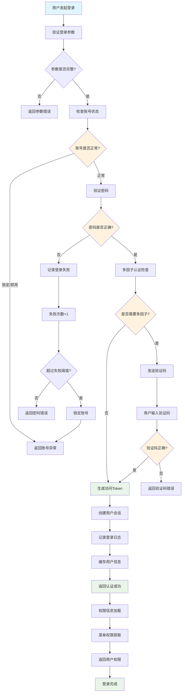
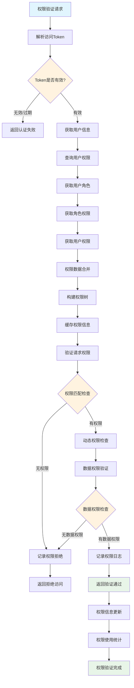
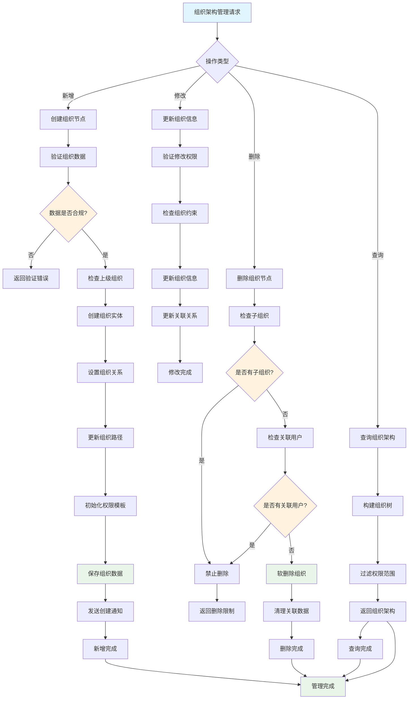
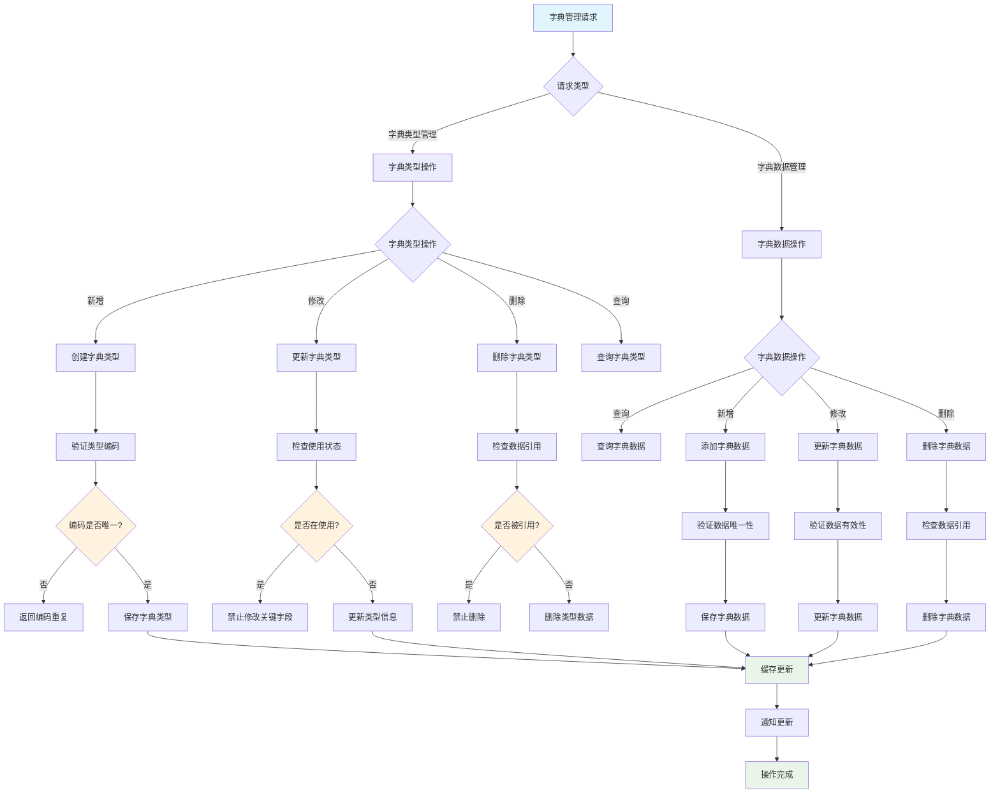
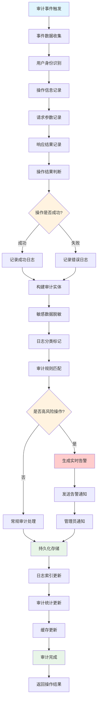
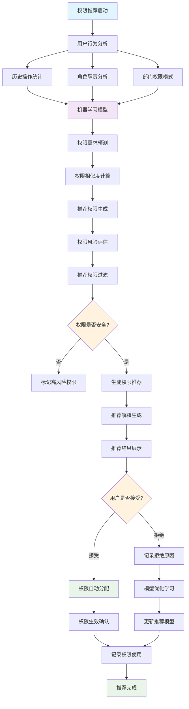
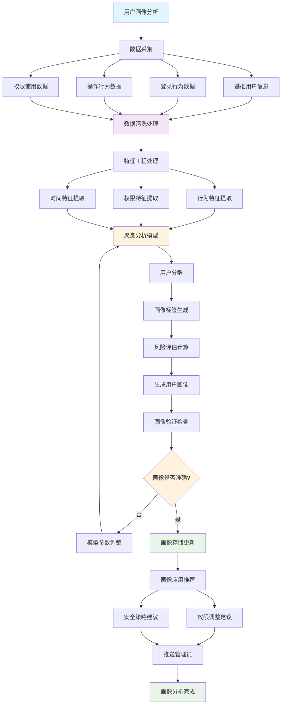
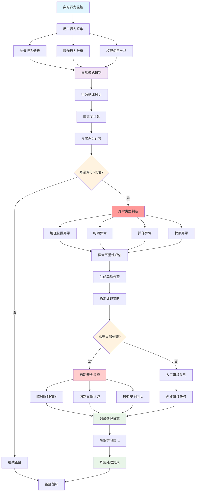

# IOE-DREAM 公共业务服务流程图

> **模块名称**: ioedream-common-service
> **端口**: 8088
> **完成度**: 60%
> **P0级缺失功能**: 统一认证体系、权限管理、会话管理
> **创建时间**: 2025-12-16
> **业务场景**: 统一身份认证、权限管理、组织架构、字典管理等公共业务服务

---

## 📋 公共业务服务架构

### 核心功能模块



### 系统边界

- **输入**: 用户登录、权限申请、数据查询、配置管理
- **输出**: 认证Token、权限验证结果、基础数据、审计日志
- **集成**: 所有业务微服务、第三方认证系统、LDAP/AD

---

## 🔄 核心业务流程

### 1. 统一身份认证流程



**流程说明**:
- 统一身份认证，支持用户名/密码、手机号、邮箱等多种登录方式
- 多因子认证支持：短信验证码、邮件验证码、TOTP动态口令
- 安全防护：密码强度验证、账号锁定机制、登录失败记录
- 会话管理：JWT Token生成、会话缓存、自动续期

### 2. 权限管理验证流程



**流程说明**:
- 基于RBAC模型的权限验证：用户-角色-权限
- 动态权限检查：支持接口权限、菜单权限、数据权限
- 权限缓存优化：提高权限验证性能
- 权限审计记录：完整的权限使用日志

### 3. 组织架构管理流程



**流程说明**:
- 树形组织架构管理：支持无限层级组织结构
- 组织权限继承：子组织自动继承父组织权限
- 组织约束检查：防止循环引用、数据完整性检查
- 组织变更追踪：完整的组织变更历史记录

### 4. 字典管理流程



**流程说明**:
- 分层字典管理：字典类型+字典数据的两级管理
- 数据有效性保证：唯一性验证、引用完整性检查
- 缓存优化机制：字典数据自动缓存，提高查询性能
- 多语言支持：支持国际化字典数据管理

### 5. 审计日志管理流程



**流程说明**:
- 全量审计记录：记录所有用户操作的完整信息
- 智能敏感数据脱敏：自动识别并脱敏敏感信息
- 风险操作告警：实时识别高风险操作并告警
- 审计数据分析：提供审计查询、统计、分析功能

---

## 🧠 智能功能流程

### 1. 智能权限推荐流程



### 2. 智能用户画像分析流程



### 3. 异常行为智能检测流程



---

## 💾 数据库设计

### 核心表结构

#### 1. 用户表 (t_common_user)

```sql
CREATE TABLE `t_common_user` (
    `user_id` BIGINT NOT NULL AUTO_INCREMENT COMMENT '用户ID',
    `login_name` VARCHAR(50) NOT NULL COMMENT '登录名',
    `user_name` VARCHAR(100) NOT NULL COMMENT '用户姓名',
    `password` VARCHAR(255) NOT NULL COMMENT '密码',
    `salt` VARCHAR(32) NOT NULL COMMENT '密码盐值',
    `phone` VARCHAR(20) COMMENT '手机号',
    `email` VARCHAR(100) COMMENT '邮箱',
    `avatar_url` VARCHAR(500) COMMENT '头像URL',
    `department_id` BIGINT NOT NULL COMMENT '部门ID',
    `position_id` BIGINT COMMENT '职位ID',
    `user_type` TINYINT DEFAULT 1 COMMENT '用户类型 1-内部员工 2-外部用户 3-系统用户',
    `user_status` TINYINT DEFAULT 1 COMMENT '用户状态 1-正常 2-锁定 3-禁用 4-注销',
    `login_failure_count` INT DEFAULT 0 COMMENT '登录失败次数',
    `last_login_time` DATETIME COMMENT '最后登录时间',
    `last_login_ip` VARCHAR(50) COMMENT '最后登录IP',
    `password_update_time` DATETIME COMMENT '密码更新时间',
    `account_expire_time` DATETIME COMMENT '账号过期时间',
    `password_expire_time` DATETIME COMMENT '密码过期时间',
    `multi_factor_auth` TINYINT DEFAULT 0 COMMENT '多因子认证 1-启用 0-禁用',
    `secret_key` VARCHAR(100) COMMENT 'TOTP密钥',
    `language` VARCHAR(10) DEFAULT 'zh-CN' COMMENT '语言偏好',
    `timezone` VARCHAR(50) DEFAULT 'Asia/Shanghai' COMMENT '时区',
    `remark` VARCHAR(500) COMMENT '备注',
    `create_time` DATETIME NOT NULL DEFAULT CURRENT_TIMESTAMP COMMENT '创建时间',
    `update_time` DATETIME NOT NULL DEFAULT CURRENT_TIMESTAMP ON UPDATE CURRENT_TIMESTAMP COMMENT '更新时间',
    `deleted_flag` TINYINT DEFAULT 0 COMMENT '删除标记 0-未删除 1-已删除',
    PRIMARY KEY (`user_id`),
    UNIQUE KEY `uk_login_name` (`login_name`),
    UNIQUE KEY `uk_phone` (`phone`),
    UNIQUE KEY `uk_email` (`email`),
    KEY `idx_department_id` (`department_id`),
    KEY `idx_user_type` (`user_type`),
    KEY `idx_user_status` (`user_status`),
    KEY `idx_last_login_time` (`last_login_time`),
    KEY `idx_create_time` (`create_time`)
) ENGINE=InnoDB DEFAULT CHARSET=utf8mb4 COLLATE=utf8mb4_unicode_ci COMMENT='用户表';
```

#### 2. 角色表 (t_common_role)

```sql
CREATE TABLE `t_common_role` (
    `role_id` BIGINT NOT NULL AUTO_INCREMENT COMMENT '角色ID',
    `role_code` VARCHAR(50) NOT NULL COMMENT '角色编码',
    `role_name` VARCHAR(100) NOT NULL COMMENT '角色名称',
    `role_type` TINYINT DEFAULT 1 COMMENT '角色类型 1-系统角色 2-业务角色 3-临时角色',
    `data_scope` TINYINT DEFAULT 1 COMMENT '数据权限范围 1-全部 2-部门 3-部门及下属 4-个人',
    `description` VARCHAR(500) COMMENT '角色描述',
    `sort_order` INT DEFAULT 0 COMMENT '排序',
    `status` TINYINT DEFAULT 1 COMMENT '状态 1-启用 0-禁用',
    `is_system` TINYINT DEFAULT 0 COMMENT '是否系统角色 1-是 0-否',
    `create_user_id` BIGINT COMMENT '创建人ID',
    `update_user_id` BIGINT COMMENT '更新人ID',
    `create_time` DATETIME NOT NULL DEFAULT CURRENT_TIMESTAMP COMMENT '创建时间',
    `update_time` DATETIME NOT NULL DEFAULT CURRENT_TIMESTAMP ON UPDATE CURRENT_TIMESTAMP COMMENT '更新时间',
    `deleted_flag` TINYINT DEFAULT 0 COMMENT '删除标记 0-未删除 1-已删除',
    PRIMARY KEY (`role_id`),
    UNIQUE KEY `uk_role_code` (`role_code`),
    KEY `idx_role_type` (`role_type`),
    KEY `idx_status` (`status`),
    KEY `idx_data_scope` (`data_scope`),
    KEY `idx_create_time` (`create_time`)
) ENGINE=InnoDB DEFAULT CHARSET=utf8mb4 COLLATE=utf8mb4_unicode_ci COMMENT='角色表';
```

#### 3. 权限表 (t_common_permission)

```sql
CREATE TABLE `t_common_permission` (
    `permission_id` BIGINT NOT NULL AUTO_INCREMENT COMMENT '权限ID',
    `permission_code` VARCHAR(100) NOT NULL COMMENT '权限编码',
    `permission_name` VARCHAR(100) NOT NULL COMMENT '权限名称',
    `permission_type` TINYINT NOT NULL COMMENT '权限类型 1-菜单 2-按钮 3-接口 4-数据',
    `parent_id` BIGINT DEFAULT 0 COMMENT '父权限ID',
    `permission_path` VARCHAR(200) COMMENT '权限路径',
    `component_name` VARCHAR(100) COMMENT '组件名称',
    `request_method` VARCHAR(10) COMMENT '请求方法',
    `menu_icon` VARCHAR(100) COMMENT '菜单图标',
    `sort_order` INT DEFAULT 0 COMMENT '排序',
    `is_external` TINYINT DEFAULT 0 COMMENT '是否外部链接 1-是 0-否',
    `is_visible` TINYINT DEFAULT 1 COMMENT '是否可见 1-可见 0-隐藏',
    `is_cache` TINYINT DEFAULT 0 COMMENT '是否缓存 1-缓存 0-不缓存',
    `status` TINYINT DEFAULT 1 COMMENT '状态 1-启用 0-禁用',
    `description` VARCHAR(500) COMMENT '权限描述',
    `create_time` DATETIME NOT NULL DEFAULT CURRENT_TIMESTAMP COMMENT '创建时间',
    `update_time` DATETIME NOT NULL DEFAULT CURRENT_TIMESTAMP ON UPDATE CURRENT_TIMESTAMP COMMENT '更新时间',
    `deleted_flag` TINYINT DEFAULT 0 COMMENT '删除标记 0-未删除 1-已删除',
    PRIMARY KEY (`permission_id`),
    UNIQUE KEY `uk_permission_code` (`permission_code`),
    KEY `idx_permission_type` (`permission_type`),
    KEY `idx_parent_id` (`parent_id`),
    KEY `idx_status` (`status`),
    KEY `idx_sort_order` (`sort_order`)
) ENGINE=InnoDB DEFAULT CHARSET=utf8mb4 COLLATE=utf8mb4_unicode_ci COMMENT='权限表';
```

#### 4. 组织架构表 (t_common_organization)

```sql
CREATE TABLE `t_common_organization` (
    `org_id` BIGINT NOT NULL AUTO_INCREMENT COMMENT '组织ID',
    `org_code` VARCHAR(50) NOT NULL COMMENT '组织编码',
    `org_name` VARCHAR(100) NOT NULL COMMENT '组织名称',
    `org_type` TINYINT DEFAULT 1 COMMENT '组织类型 1-公司 2-部门 3-小组 4-项目组',
    `parent_id` BIGINT DEFAULT 0 COMMENT '父组织ID',
    `org_level` INT DEFAULT 1 COMMENT '组织层级',
    `org_path` VARCHAR(500) COMMENT '组织路径',
    `leader_id` BIGINT COMMENT '负责人ID',
    `phone` VARCHAR(20) COMMENT '联系电话',
    `email` VARCHAR(100) COMMENT '邮箱',
    `address` VARCHAR(200) COMMENT '地址',
    `sort_order` INT DEFAULT 0 COMMENT '排序',
    `status` TINYINT DEFAULT 1 COMMENT '状态 1-启用 0-禁用',
    `description` VARCHAR(500) COMMENT '组织描述',
    `create_time` DATETIME NOT NULL DEFAULT CURRENT_TIMESTAMP COMMENT '创建时间',
    `update_time` DATETIME NOT NULL DEFAULT CURRENT_TIMESTAMP ON UPDATE CURRENT_TIMESTAMP COMMENT '更新时间',
    `deleted_flag` TINYINT DEFAULT 0 COMMENT '删除标记 0-未删除 1-已删除',
    PRIMARY KEY (`org_id`),
    UNIQUE KEY `uk_org_code` (`org_code`),
    KEY `idx_org_type` (`org_type`),
    KEY `idx_parent_id` (`parent_id`),
    KEY `idx_org_level` (`org_level`),
    KEY `idx_leader_id` (`leader_id`),
    KEY `idx_status` (`status`),
    KEY `idx_create_time` (`create_time`)
) ENGINE=InnoDB DEFAULT CHARSET=utf8mb4 COLLATE=utf8mb4_unicode_ci COMMENT='组织架构表';
```

---

## 🔧 技术接口设计

### 1. 统一认证服务接口

```java
/**
 * 统一认证服务
 */
public interface UnifiedAuthenticationService {

    /**
     * 用户认证
     * @param request 认证请求
     * @return 认证结果
     */
    AuthenticationResult authenticate(AuthenticationRequest request);

    /**
     * Token验证
     * @param token 访问令牌
     * @return 验证结果
     */
    TokenValidationResult validateToken(String token);

    /**
     * 刷新Token
     * @param refreshToken 刷新令牌
     * @return 新Token
     */
    TokenResult refreshToken(String refreshToken);

    /**
     * 用户登出
     * @param token 访问令牌
     * @return 登出结果
     */
    LogoutResult logout(String token);

    /**
     * 多因子认证验证
     * @param request 多因子认证请求
     * @return 验证结果
     */
    MfaValidationResult validateMFA(MfaValidationRequest request);

    /**
     * 会话管理
     * @param userId 用户ID
     * @param action 操作类型
     * @return 操作结果
     */
    SessionManagementResult manageSession(Long userId, SessionAction action);
}

/**
 * 认证请求
 */
@Data
public class AuthenticationRequest {
    private String username;              // 用户名
    private String password;              // 密码
    private String loginType;             // 登录类型
    private String captcha;               // 验证码
    private String deviceInfo;            // 设备信息
    private String ipAddress;             // IP地址
    private String userAgent;             // 用户代理
    private Boolean rememberMe;           // 记住我
    private Map<String, Object> extendInfo; // 扩展信息
}

/**
 * 认证结果
 */
@Data
public class AuthenticationResult {
    private Boolean success;              // 是否成功
    private String errorCode;             // 错误码
    private String errorMessage;          // 错误信息
    private UserInfo userInfo;            // 用户信息
    private String accessToken;           // 访问令牌
    private String refreshToken;          // 刷新令牌
    private Long expiresIn;               // 过期时间
    private List<PermissionInfo> permissions; // 权限信息
    private Map<String, Object> extendData;   // 扩展数据
}
```

### 2. 权限管理服务接口

```java
/**
 * 权限管理服务
 */
public interface PermissionManagementService {

    /**
     * 检查用户权限
     * @param userId 用户ID
     * @param resource 资源
     * @param action 操作
     * @return 权限检查结果
     */
    PermissionCheckResult checkPermission(Long userId, String resource, String action);

    /**
     * 获取用户权限
     * @param userId 用户ID
     * @return 用户权限列表
     */
    List<PermissionInfo> getUserPermissions(Long userId);

    /**
     * 获取用户角色
     * @param userId 用户ID
     * @return 用户角色列表
     */
    List<RoleInfo> getUserRoles(Long userId);

    /**
     * 分配角色权限
     * @param roleId 角色ID
     * @param permissionIds 权限ID列表
     * @return 分配结果
     */
    RolePermissionResult assignRolePermissions(Long roleId, List<Long> permissionIds);

    /**
     * 分配用户角色
     * @param userId 用户ID
     * @param roleIds 角色ID列表
     * @return 分配结果
     */
    UserRoleResult assignUserRoles(Long userId, List<Long> roleIds);

    /**
     * 权限推荐
     * @param userId 用户ID
     * @return 推荐权限列表
     */
    List<PermissionRecommendation> recommendPermissions(Long userId);
}

/**
 * 权限检查结果
 */
@Data
public class PermissionCheckResult {
    private Boolean granted;              // 是否授权
    private String reason;                // 拒绝原因
    private PermissionType permissionType; // 权限类型
    private DataScope dataScope;          // 数据权限范围
    private List<String> conditions;      // 权限条件
    private Long checkTime;               // 检查时间
}
```

### 3. 组织架构服务接口

```java
/**
 * 组织架构服务
 */
public interface OrganizationService {

    /**
     * 获取组织树
     * @param query 查询条件
     * @return 组织树
     */
    List<OrganizationNode> getOrganizationTree(OrganizationQuery query);

    /**
     * 创建组织
     * @param request 创建请求
     * @return 创建结果
     */
    OrganizationResult createOrganization(CreateOrganizationRequest request);

    /**
     * 更新组织
     * @param request 更新请求
     * @return 更新结果
     */
    OrganizationResult updateOrganization(UpdateOrganizationRequest request);

    /**
     * 删除组织
     * @param orgId 组织ID
     * @return 删除结果
     */
    OrganizationResult deleteOrganization(Long orgId);

    /**
     * 获取用户组织范围
     * @param userId 用户ID
     * @return 组织范围
     */
    List<OrganizationInfo> getUserOrganizationScope(Long userId);

    /**
     * 移动组织节点
     * @param orgId 组织ID
     * @param newParentId 新父组织ID
     * @return 移动结果
     */
    OrganizationResult moveOrganization(Long orgId, Long newParentId);
}
```

---

## 📊 功能完成度分析

### 已实现功能 (60%)

#### ✅ 基础功能完成
- **用户管理**: 基础用户CRUD、状态管理
- **角色管理**: 基础角色配置、权限分配
- **权限管理**: 基础权限定义、菜单管理
- **字典管理**: 基础字典类型、数据管理
- **数据库设计**: 完整的用户权限相关表结构

#### 🔄 部分实现功能
- **身份认证**: 基础用户名密码认证，缺少多因子认证
- **权限验证**: 基础RBAC权限检查，缺少数据权限
- **组织架构**: 基础组织树管理，缺少权限继承
- **审计日志**: 基础操作记录，缺少智能分析

### 未实现功能 (40%)

#### ❌ P0级缺失功能
- **统一认证体系**: SSO单点登录、多因子认证、会话管理
- **权限精细控制**: 数据权限、动态权限、权限推荐
- **组织权限继承**: 自动权限继承、组织约束检查
- **智能审计分析**: 行为分析、异常检测、风险评估

#### ❌ P1级缺失功能
- **用户画像分析**: 行为模式分析、用户分群
- **权限智能推荐**: AI驱动的权限分配建议
- **实时权限验证**: 高性能权限缓存、实时更新
- **多租户支持**: 租户隔离、租户权限管理

#### ❌ P2级缺失功能
- **LDAP/AD集成**: 企业目录服务集成
- **生物识别认证**: 人脸、指纹等生物认证
- **权限工作流**: 权限申请审批流程
- **高级安全特性**: 风险控制、威胁检测

---

## 🚀 实施计划

### 第一阶段：P0级功能实现 (3-4周)

1. **统一认证体系建设**
   - JWT Token机制实现
   - 多因子认证（短信、邮件、TOTP）
   - SSO单点登录集成
   - 会话管理和安全控制

2. **权限管理系统完善**
   - 数据权限控制实现
   - 动态权限检查机制
   - 权限缓存优化
   - 权限继承和委托

3. **组织架构管理增强**
   - 树形组织架构优化
   - 组织权限自动继承
   - 组织约束和验证
   - 组织变更追踪

### 第二阶段：P1级功能完善 (2-3周)

1. **智能权限推荐系统**
   - 用户行为分析模型
   - 权限需求预测算法
   - 智能权限分配建议
   - 权限风险评估机制

2. **用户画像分析系统**
   - 行为数据采集
   - 用户特征提取
   - 用户分群算法
   - 画像可视化展示

3. **审计分析系统升级**
   - 实时审计监控
   - 异常行为检测
   - 智能风险预警
   - 审计数据可视化

### 第三阶段：P2级功能优化 (1-2周)

1. **企业级集成能力**
   - LDAP/AD目录服务集成
   - 第三方身份提供商集成
   - API权限管理
   - 开放平台支持

2. **高级安全特性**
   - 生物识别认证集成
   - 设备指纹识别
   - 地理位置验证
   - 威胁情报检测

---

## 📈 技术架构要求

### 性能要求
- **认证响应**: Token验证响应时间<50ms
- **权限检查**: 权限验证响应时间<100ms
- **并发处理**: 支持10000+并发认证请求
- **缓存命中率**: 权限缓存命中率≥95%

### 可靠性要求
- **系统可用性**: 99.99%以上
- **认证准确率**: 99.999%以上
- **故障恢复**: <1分钟快速恢复
- **数据一致性**: 强一致性保证

### 安全性要求
- **多因子认证**: 支持多种认证因子组合
- **Token安全**: JWT加密签名、定期轮换
- **会话安全**: 会话劫持防护、并发控制
- **审计完整性**: 防篡改、完整性保护

---

## 📋 验收标准

### 功能验收
- ✅ 所有P0级功能100%实现
- ✅ 认证成功率≥99.9%
- ✅ 权限验证准确率≥99.99%
- ✅ 多因子认证覆盖率≥80%

### 性能验收
- ✅ Token验证响应时间≤50ms
- ✅ 权限检查响应时间≤100ms
- ✅ 并发认证处理≥10000/秒
- ✅ 缓存命中率≥95%

### 安全性验收
- ✅ 支持所有主流多因子认证方式
- ✅ Token安全机制完善
- ✅ 会话安全防护到位
- ✅ 审计日志完整可追溯

---

**文档版本**: v1.0.0
**创建时间**: 2025-12-16
**适用范围**: IOE-DREAM公共业务服务模块
**下次更新**: 功能实现完成后更新