# IOE-DREAM 智慧消费管理系统业务流程图

## 1. 消费管理模块业务流程概览

### 1.1 消费管理业务架构
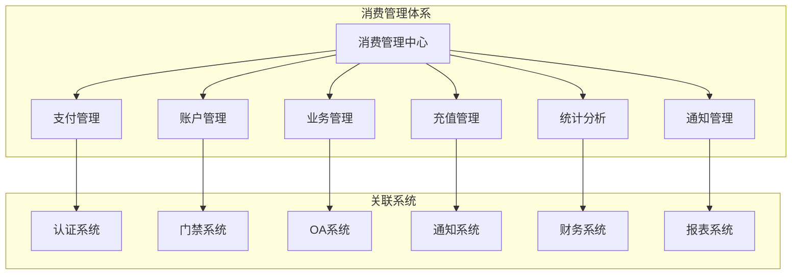

### 1.2 消费管理数据流程
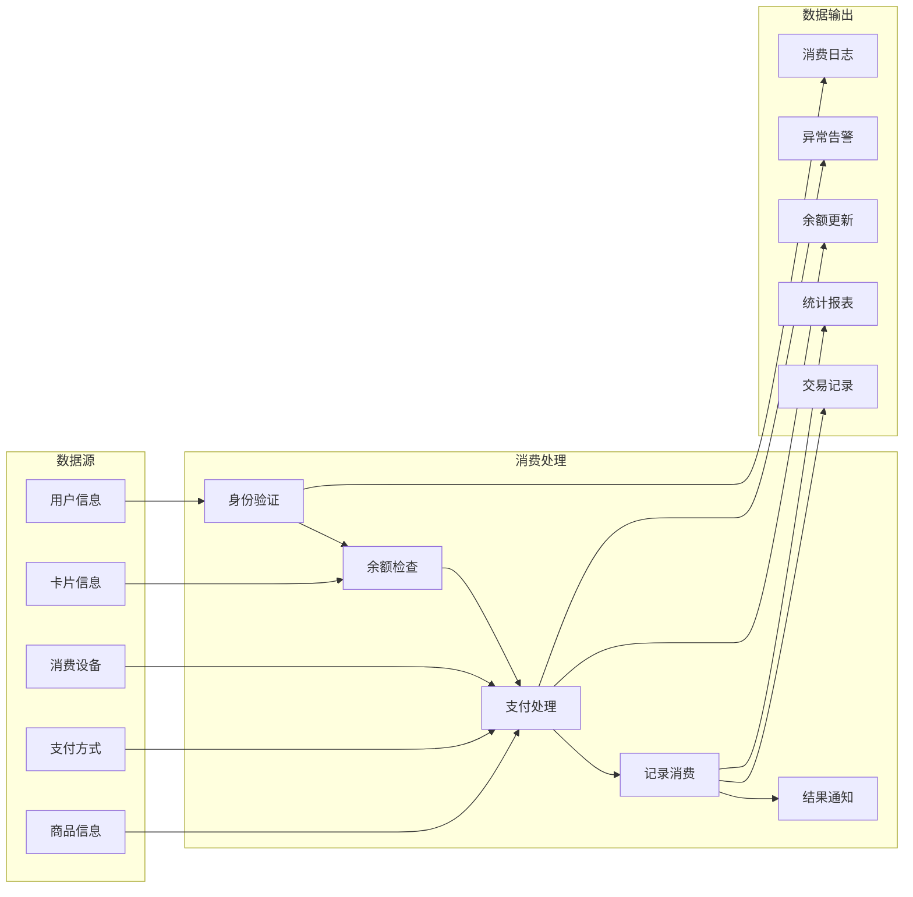

## 2. 消费管理核心业务流程

### 2.1 消费支付流程
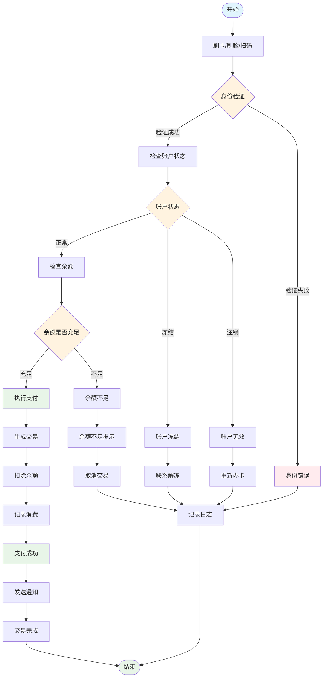

### 2.2 账户管理流程
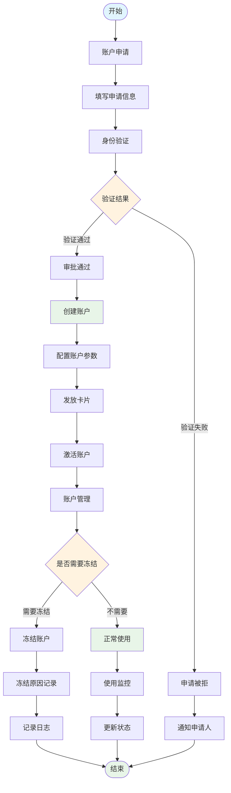

### 2.3 充值管理流程
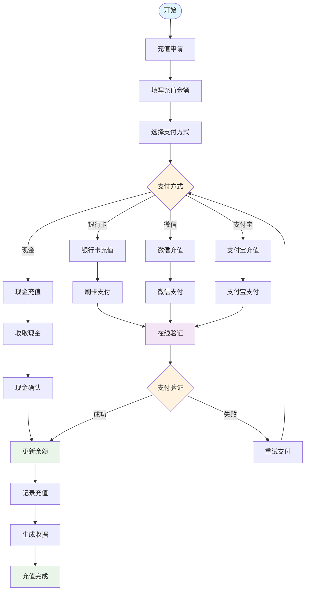

### 2.4 退款管理流程
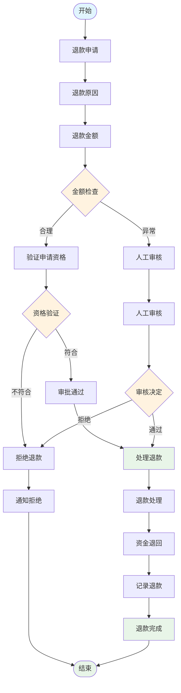

### 2.5 余额管理流程
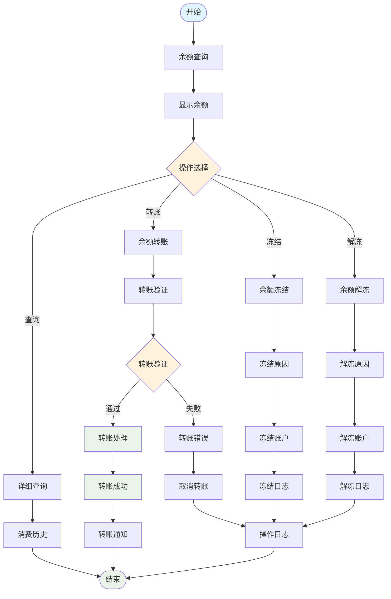

## 3. 消费管理智能功能流程

### 3.1 智能推荐流程
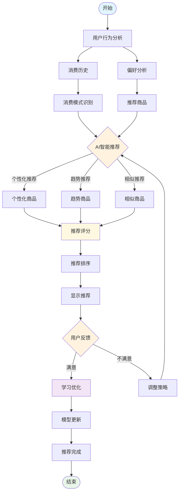

### 3.2 风险监控流程
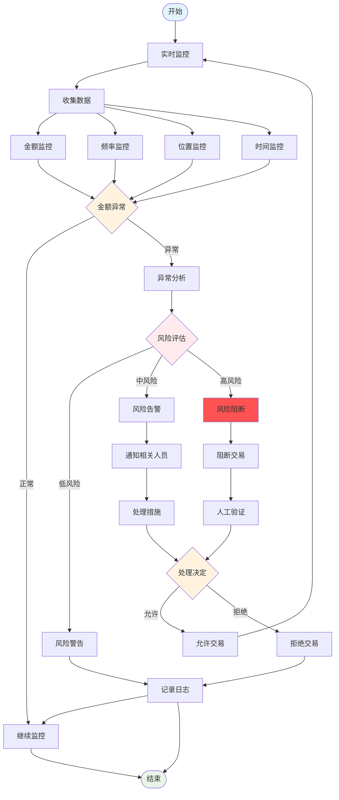

### 3.3 离线消费流程
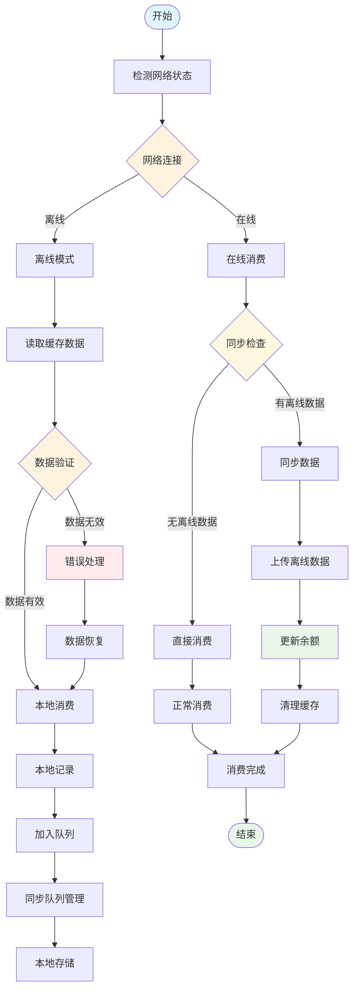

## 4. 消费管理集成流程

### 4.1 门禁系统集成流程
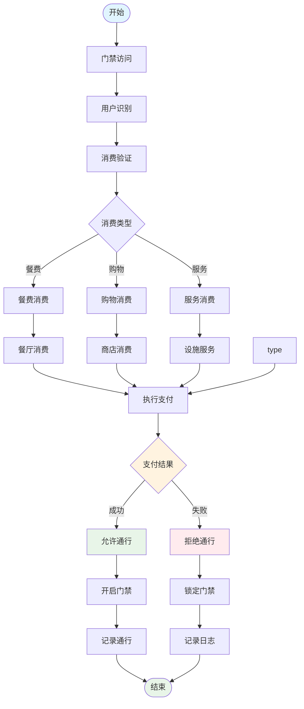

### 4.2 OA系统集成流程
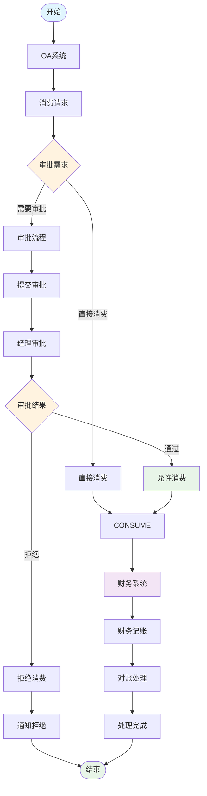

## 5. 消费管理数据分析流程

### 5.1 消费统计分析流程
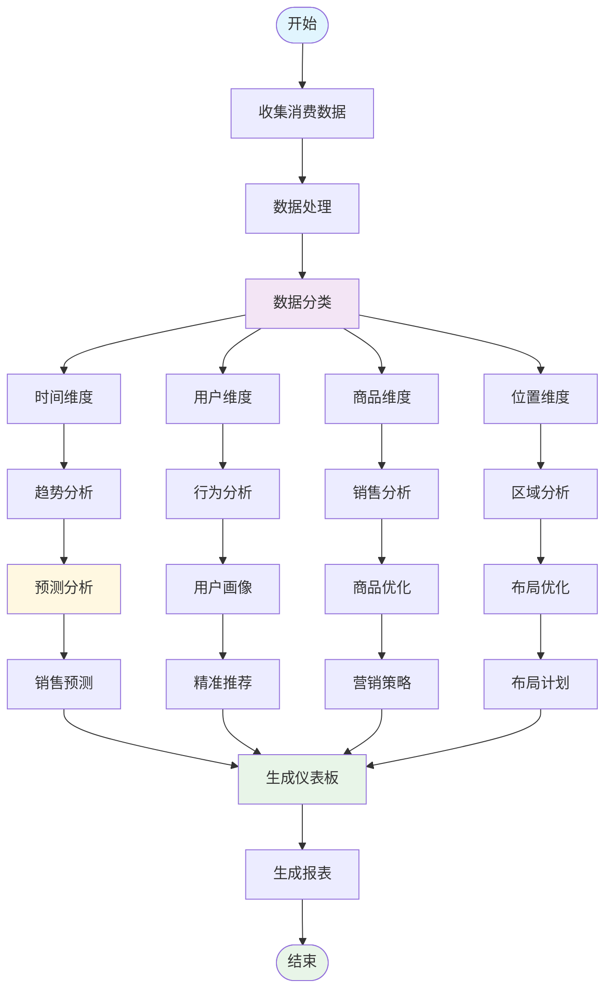

### 5.2 财务对账流程
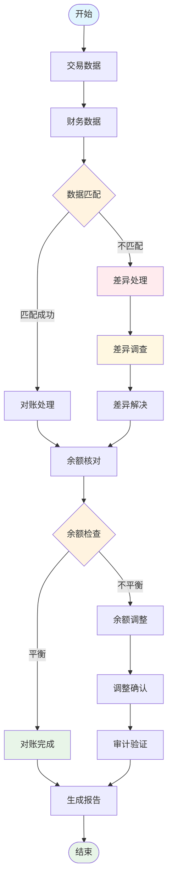

## 6. 消费管理实施状态分析

### 6.1 功能实现现状
| 功能模块 | 实现状态 | 完成度 | 关键特性 |
|---------|---------|--------|----------|
| **支付管理** | 部分实现 | 70% | 基础支付、余额检查 |
| **账户管理** | 部分实现 | 80% | 账户创建、状态管理 |
| **充值管理** | 部分实现 | 75% | 多种充值方式 |
| **消费记录** | 已实现 | 90% | 完整记录查询 |
| **退款管理** | 部分实现 | 60% | 基础退款流程 |
| **余额管理** | 部分实现 | 65% | 余额查询、冻结 |
| **风险监控** | 未实现 | 30% | 异常检测、风险控制 |
| **智能推荐** | 未实现 | 20% | 个性化推荐 |
| **离线消费** | 未实现 | 25% | 离线支持、数据同步 |

### 6.2 数据库表结构需求
```sql
-- 消费交易表
CREATE TABLE IF NOT EXISTS `t_consume_transaction` (
    `transaction_id` BIGINT NOT NULL AUTO_INCREMENT COMMENT '交易ID',
    `transaction_no` VARCHAR(50) NOT NULL COMMENT '交易编号',
    `user_id` BIGINT NOT NULL COMMENT '用户ID',
    `account_id` BIGINT NOT NULL COMMENT '账户ID',
    `card_id` VARCHAR(50) COMMENT '卡片ID',
    `device_id` BIGINT COMMENT '设备ID',
    `device_type` TINYINT DEFAULT 1 COMMENT '设备类型：1-消费机 2-POS机 3-移动端',
    `transaction_type` TINYINT NOT NULL COMMENT '交易类型：1-消费 2-充值 3-退款 4-转账',
    `payment_method` TINYINT NOT NULL COMMENT '支付方式：1-现金 2-银行卡 3-微信 4-支付宝 5-余额',
    `original_amount` DECIMAL(12,2) NOT NULL COMMENT '原始金额',
    `discount_amount` DECIMAL(12,2) DEFAULT 0 COMMENT '优惠金额',
    `actual_amount` DECIMAL(12,2) NOT NULL COMMENT '实际金额',
    `before_balance` DECIMAL(12,2) NOT NULL COMMENT '交易前余额',
    `after_balance` DECIMAL(12,2) NOT NULL COMMENT '交易后余额',
    `transaction_status` TINYINT DEFAULT 1 COMMENT '交易状态：1-处理中 2-成功 3-失败 4-已取消',
    `failure_reason` VARCHAR(500) COMMENT '失败原因',
    `merchant_id` BIGINT COMMENT '商户ID',
    `merchant_name` VARCHAR(200) COMMENT '商户名称',
    `category_id` BIGINT COMMENT '商品分类ID',
    `category_name` VARCHAR(100) COMMENT '商品分类名称',
    `product_id` VARCHAR(100) COMMENT '商品ID',
    `product_name` VARCHAR(200) COMMENT '商品名称',
    `quantity` INT DEFAULT 1 COMMENT '数量',
    `unit_price` DECIMAL(10,2) COMMENT '单价',
    `location_id` BIGINT COMMENT '位置ID',
    `location_name` VARCHAR(200) COMMENT '位置名称',
    `consumer_ip` VARCHAR(45) COMMENT '消费IP',
    `risk_level` TINYINT DEFAULT 1 COMMENT '风险等级：1-低 2-中 3-高',
    `offline_flag` TINYINT DEFAULT 0 COMMENT '离线标志：0-在线 1-离线',
    `sync_status` TINYINT DEFAULT 0 COMMENT '同步状态：0-未同步 1-已同步 2-同步失败',
    `create_time` DATETIME NOT NULL DEFAULT CURRENT_TIMESTAMP COMMENT '创建时间',
    `update_time` DATETIME NOT NULL DEFAULT CURRENT_TIMESTAMP ON UPDATE CURRENT_TIMESTAMP COMMENT '更新时间',
    `create_user_id` BIGINT COMMENT '创建人ID',
    `update_user_id` BIGINT COMMENT '更新人ID',
    `deleted_flag` TINYINT DEFAULT 0 COMMENT '删除标识',
    PRIMARY KEY (`transaction_id`),
    UNIQUE KEY `uk_transaction_no` (`transaction_no`, `deleted_flag`),
    KEY `idx_user_transaction` (`user_id`, `transaction_time`, `deleted_flag`),
    KEY `idx_account_transaction` (`account_id`, `transaction_time`, `deleted_flag`),
    KEY `idx_card_transaction` (`card_id`, `transaction_time`, `deleted_flag`),
    KEY `idx_device_transaction` (`device_id`, `transaction_time`, `deleted_flag`),
    KEY `idx_transaction_type` (`transaction_type`, `transaction_status`, `deleted_flag`),
    KEY `idx_payment_method` (`payment_method`, `deleted_flag`),
    KEY `idx_create_time` (`create_time`, `deleted_flag`),
    KEY `idx_merchant` (`merchant_id`, `deleted_flag`)
) ENGINE=InnoDB DEFAULT CHARSET=utf8mb4 COLLATE=utf8mb4_unicode_ci COMMENT='消费交易表';

-- 账户信息表
CREATE TABLE IF NOT EXISTS `t_consume_account` (
    `account_id` BIGINT NOT NULL AUTO_INCREMENT COMMENT '账户ID',
    `user_id` BIGINT NOT NULL COMMENT '用户ID',
    `account_no` VARCHAR(50) NOT NULL COMMENT '账户编号',
    `account_type` TINYINT DEFAULT 1 COMMENT '账户类型：1-个人 2-团体 3-临时',
    `account_status` TINYINT DEFAULT 1 COMMENT '账户状态：1-正常 2-冻结 3-注销 4-挂失',
    `current_balance` DECIMAL(12,2) DEFAULT 0 COMMENT '当前余额',
    `available_balance` DECIMAL(12,2) DEFAULT 0 COMMENT '可用余额',
    `frozen_amount` DECIMAL(12,2) DEFAULT 0 COMMENT '冻结金额',
    `credit_limit` DECIMAL(12,2) DEFAULT 0 COMMENT '信用额度',
    `monthly_limit` DECIMAL(12,2) DEFAULT 0 COMMENT '月度限额',
    `daily_limit` DECIMAL(12,2) DEFAULT 0 COMMENT '日度限额',
    `single_limit` DECIMAL(12,2) DEFAULT 0 COMMENT '单笔限额',
    `card_count` INT DEFAULT 0 COMMENT '卡片数量',
    `primary_card_id` VARCHAR(50) COMMENT '主卡片ID',
    `enable_online` TINYINT DEFAULT 1 COMMENT '启用在线支付：0-禁用 1-启用',
    `enable_offline` TINYINT DEFAULT 1 COMMENT '启用离线支付：0-禁用 1-启用',
    `last_consume_time` DATETIME COMMENT '最后消费时间',
    `last_login_time` DATETIME COMMENT '最后登录时间',
    `password_salt` VARCHAR(100) COMMENT '密码盐值',
    `security_question` VARCHAR(200) COMMENT '安全问题',
    `security_answer` VARCHAR(200) COMMENT '安全问题答案',
    `remark` VARCHAR(1000) COMMENT '备注',
    `create_time` DATETIME NOT NULL DEFAULT CURRENT_TIMESTAMP COMMENT '创建时间',
    `update_time` DATETIME NOT NULL DEFAULT CURRENT_TIMESTAMP ON UPDATE CURRENT_TIMESTAMP COMMENT '更新时间',
    `create_user_id` BIGINT COMMENT '创建人ID',
    `update_user_id` BIGINT COMMENT '更新人ID',
    `deleted_flag` TINYINT DEFAULT 0 COMMENT '删除标识',
    PRIMARY KEY (`account_id`),
    UNIQUE KEY `uk_account_no` (`account_no`, `deleted_flag`),
    UNIQUE KEY `uk_user_account` (`user_id`, `deleted_flag`),
    KEY `idx_account_status` (`account_status`, `deleted_flag`),
    KEY `idx_card_id` (`primary_card_id`, `deleted_flag`),
    KEY `idx_create_time` (`create_time`, `deleted_flag`)
) ENGINE=InnoDB DEFAULT CHARSET=utf8mb4 COLLATE=utf8mb4_unicode_ci COMMENT='账户信息表';
```

### 6.3 关键技术实现要求

#### 6.3.1 支付管理引擎
```java
// 支付管理引擎接口
public interface ConsumePaymentEngine {

    /**
     * 执行支付
     */
    @CircuitBreaker(name = "consumePayment")
    CompletableFuture<ResponseDTO<PaymentResult>> executePayment(
            PaymentRequest request
    );

    /**
     * 处理退款
     */
    @CircuitBreaker(name = "consumeRefund")
    CompletableFuture<ResponseDTO<RefundResult>> processRefund(
            RefundRequest request
    );

    /**
     * 风险检测
     */
    CompletableFuture<ResponseDTO<RiskAssessment>> assessRisk(
            PaymentRequest request
    );
}
```

#### 6.3.2 账户管理服务
```java
// 账户管理服务接口
public interface ConsumeAccountService {

    /**
     * 创建账户
     */
    @CircuitBreaker(name = "consumeAccount")
    CompletableFuture<ResponseDTO<AccountResult>> createAccount(
            AccountCreateForm form
    );

    /**
     * 余额操作
     */
    CompletableFuture<ResponseDTO<BalanceUpdateResult>> updateBalance(
            Long accountId,
            BigDecimal amount,
            BalanceOperation operation
    );

    /**
     * 账户冻结/解冻
     */
    CompletableFuture<ResponseDTO<Void>> freezeAccount(
            Long accountId,
            FreezeType type,
            String reason
    );
}
```

## 7. 消费管理优化建议

### 7.1 性能优化
- **支付优化**: 支持异步支付、批量处理、预扣费机制
- **缓存策略**: Redis缓存用户余额、商户信息、商品信息
- **数据库优化**: 分区表设计、索引优化、读写分离
- **并发控制**: 分布式锁、乐观锁、幂等性保证

### 7.2 安全增强
- **交易安全**: 交易签名、防重放攻击、交易限额
- **数据加密**: 敏感信息加密存储和传输
- **审计追踪**: 完整的交易审计链和操作日志
- **风险控制**: 实时风控、异常检测、自动阻断

### 7.3 用户体验优化
- **离线支持**: 完善的离线消费和数据同步机制
- **智能推荐**: 个性化商品推荐和营销策略
- **多端支持**: Web端、移动端、POS机多端统一
- **实时通知**: 支付成功、余额变动、异常告警实时通知

---

**文档版本**: v1.0.0
**创建时间**: 2025-12-16
**维护团队**: IOE-DREAM消费管理团队
**下次更新**: 根据实际实施进度定期更新