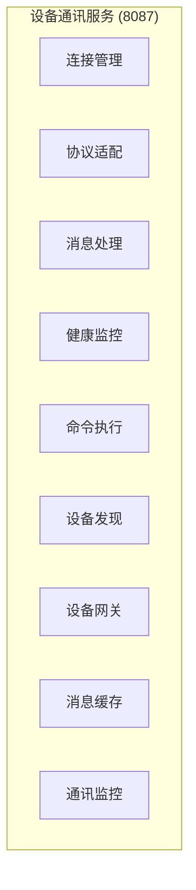
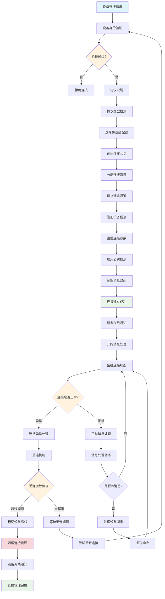
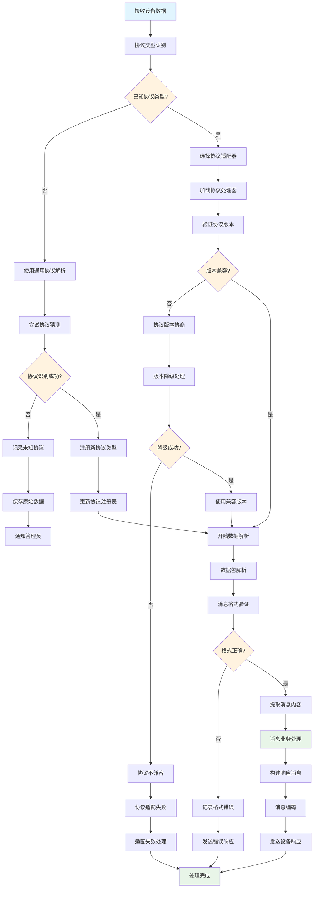
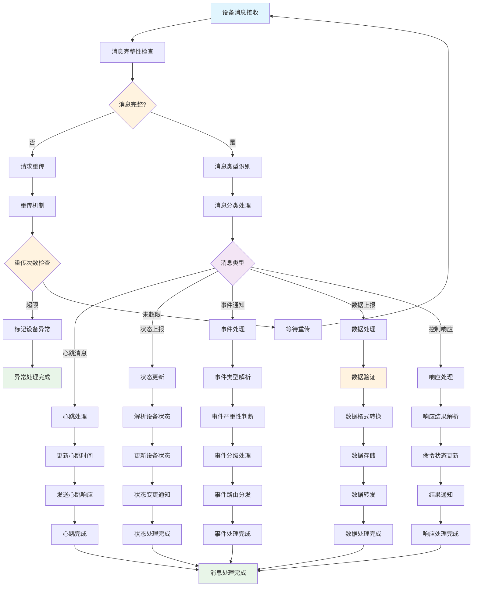
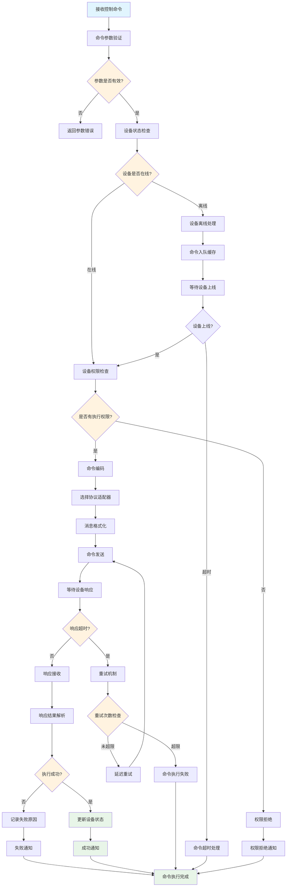
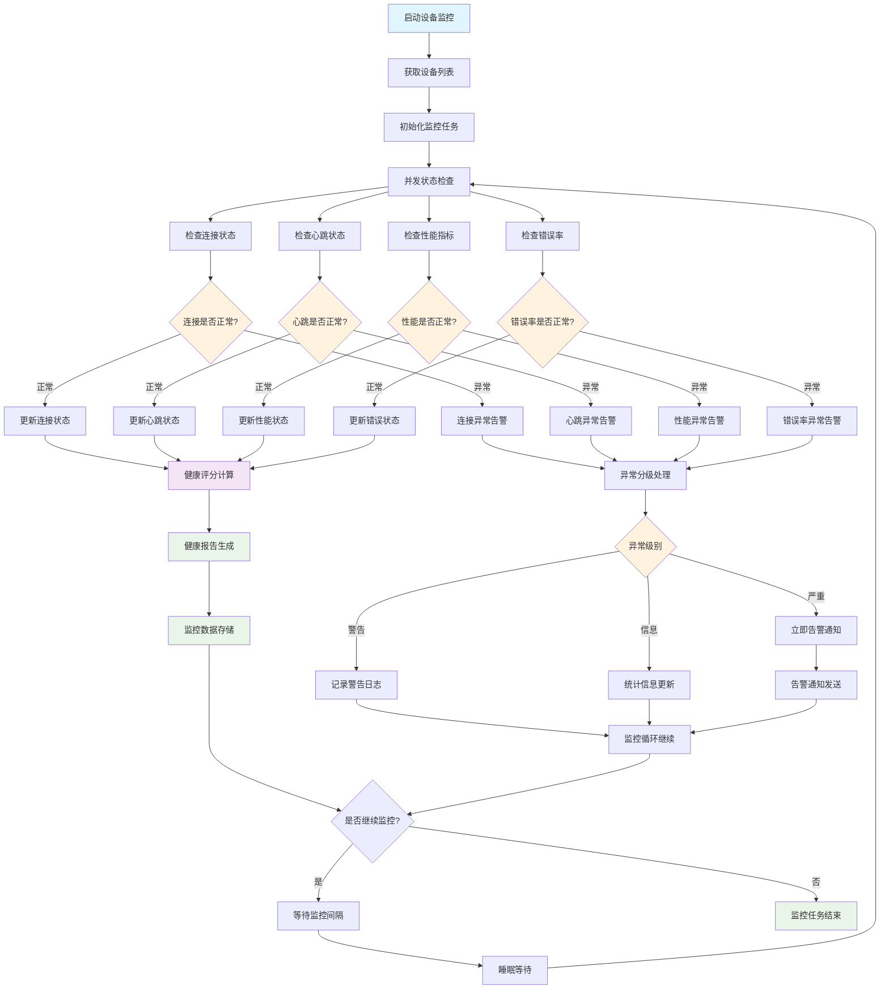
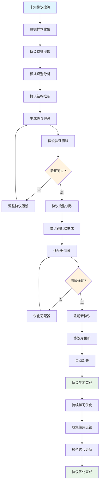
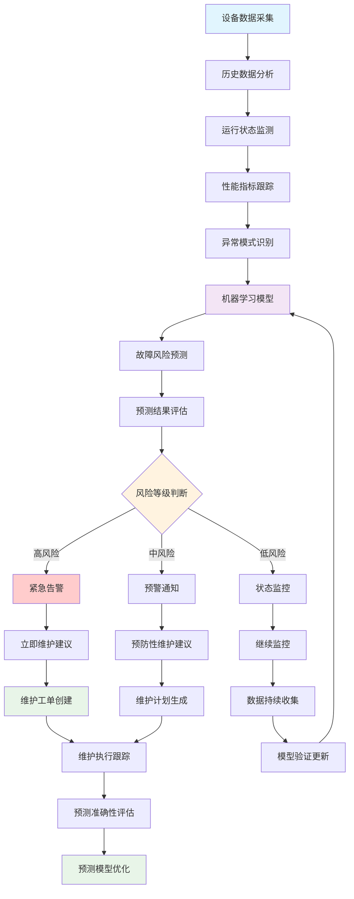
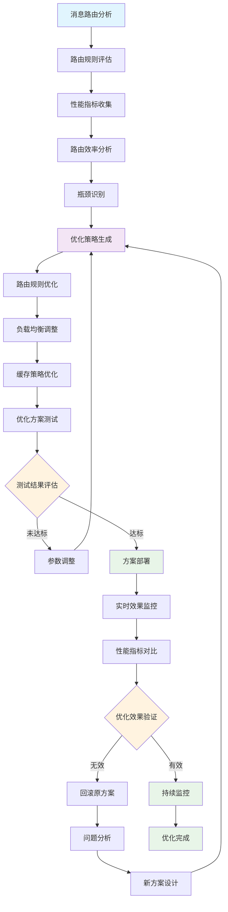

# IOE-DREAM 设备通讯业务流程图

> **模块名称**: ioedream-device-comm-service
> **端口**: 8087
> **完成度**: 40%
> **P0级缺失功能**: 协议适配能力、设备连接管理、实时消息处理
> **创建时间**: 2025-12-16
> **业务场景**: 设备协议适配、连接管理、消息处理、设备监控的统一通讯平台

---

## 📋 设备通讯服务架构

### 核心功能模块



### 系统边界

- **输入**: 设备连接请求、协议消息、控制命令、状态查询
- **输出**: 设备响应、状态数据、事件通知、控制结果
- **集成**: 门禁设备、考勤设备、消费设备、视频设备、第三方设备

---

## 🔄 核心业务流程

### 1. 设备连接管理流程



**流程说明**:
- 统一设备接入管理，支持多种协议的设备连接
- 智能协议识别和适配，自动选择合适的协议处理器
- 连接状态监控和自动重连机制，确保设备连接稳定性
- 资源管理和清理，防止连接泄漏和资源浪费

### 2. 协议适配处理流程



**流程说明**:
- 智能协议识别，支持已知协议自动识别和未知协议学习
- 协议版本兼容性管理，自动版本协商和降级处理
- 消息格式验证和解析，确保数据完整性和正确性
- 协议扩展机制，支持新协议类型的动态注册

### 3. 设备消息处理流程



**流程说明**:
- 多类型消息统一处理，支持心跳、状态、事件、数据等多种消息类型
- 消息完整性保证，重传机制和超时处理
- 智能消息路由，根据消息类型自动分发到对应处理器
- 实时状态更新，设备状态变更的实时同步和通知

### 4. 设备命令执行流程



**流程说明**:
- 设备命令统一调度，支持不同协议设备的命令执行
- 离线命令缓存，设备上线后自动执行待处理命令
- 命令执行状态跟踪，实时监控命令执行进度和结果
- 失败重试机制，自动重试失败的命令并记录详细原因

### 5. 设备健康监控流程



**流程说明**:
- 多维度设备健康监控，连接、心跳、性能、错误率全方位监控
- 智能异常分级，根据异常严重程度自动分级处理
- 实时健康评分，综合评估设备健康状况
- 预测性维护，基于历史数据预测设备故障风险

---

## 🧠 智能功能流程

### 1. 智能协议自学习流程



### 2. 设备故障预测流程



### 3. 消息路由优化流程



---

## 💾 数据库设计

### 核心表结构

#### 1. 设备信息表 (t_device_info)

```sql
CREATE TABLE `t_device_info` (
    `device_id` BIGINT NOT NULL AUTO_INCREMENT COMMENT '设备ID',
    `device_code` VARCHAR(100) NOT NULL COMMENT '设备编码',
    `device_name` VARCHAR(200) NOT NULL COMMENT '设备名称',
    `device_type` TINYINT NOT NULL COMMENT '设备类型 1-门禁 2-考勤 3-消费 4-视频 5-访客',
    `protocol_type` VARCHAR(50) NOT NULL COMMENT '协议类型',
    `protocol_version` VARCHAR(20) COMMENT '协议版本',
    `manufacturer` VARCHAR(100) COMMENT '设备厂商',
    `model` VARCHAR(100) COMMENT '设备型号',
    `serial_number` VARCHAR(100) COMMENT '设备序列号',
    `ip_address` VARCHAR(50) COMMENT 'IP地址',
    `port` INT COMMENT '端口号',
    `mac_address` VARCHAR(20) COMMENT 'MAC地址',
    `location_id` BIGINT COMMENT '位置ID',
    `department_id` BIGINT COMMENT '所属部门ID',
    `device_status` TINYINT DEFAULT 1 COMMENT '设备状态 1-在线 2-离线 3-故障 4-维护',
    `last_online_time` DATETIME COMMENT '最后在线时间',
    `last_heartbeat_time` DATETIME COMMENT '最后心跳时间',
    `connection_count` INT DEFAULT 0 COMMENT '连接次数',
    `message_count` BIGINT DEFAULT 0 COMMENT '消息总数',
    `error_count` INT DEFAULT 0 COMMENT '错误次数',
    `install_date` DATE COMMENT '安装日期',
    `warranty_expire_date` DATE COMMENT '保修到期日',
    `config_data` TEXT COMMENT '设备配置数据(JSON)',
    `extended_attributes` TEXT COMMENT '扩展属性(JSON)',
    `remark` VARCHAR(500) COMMENT '备注',
    `create_time` DATETIME NOT NULL DEFAULT CURRENT_TIMESTAMP COMMENT '创建时间',
    `update_time` DATETIME NOT NULL DEFAULT CURRENT_TIMESTAMP ON UPDATE CURRENT_TIMESTAMP COMMENT '更新时间',
    `deleted_flag` TINYINT DEFAULT 0 COMMENT '删除标记 0-未删除 1-已删除',
    PRIMARY KEY (`device_id`),
    UNIQUE KEY `uk_device_code` (`device_code`),
    KEY `idx_device_type` (`device_type`),
    KEY `idx_protocol_type` (`protocol_type`),
    KEY `idx_device_status` (`device_status`),
    KEY `idx_ip_address` (`ip_address`),
    KEY `idx_location_id` (`location_id`),
    KEY `idx_department_id` (`department_id`),
    KEY `idx_last_online_time` (`last_online_time`),
    KEY `idx_create_time` (`create_time`)
) ENGINE=InnoDB DEFAULT CHARSET=utf8mb4 COLLATE=utf8mb4_unicode_ci COMMENT='设备信息表';
```

#### 2. 设备连接记录表 (t_device_connection)

```sql
CREATE TABLE `t_device_connection` (
    `connection_id` BIGINT NOT NULL AUTO_INCREMENT COMMENT '连接ID',
    `device_id` BIGINT NOT NULL COMMENT '设备ID',
    `session_id` VARCHAR(100) NOT NULL COMMENT '会话ID',
    `connection_type` TINYINT NOT NULL COMMENT '连接类型 1-TCP 2-UDP 3-HTTP 4-WebSocket 5-MQTT',
    `local_address` VARCHAR(50) COMMENT '本地地址',
    `remote_address` VARCHAR(50) NOT NULL COMMENT '远程地址',
    `remote_port` INT COMMENT '远程端口',
    `connect_time` DATETIME NOT NULL COMMENT '连接时间',
    `disconnect_time` DATETIME COMMENT '断开时间',
    `connection_duration` BIGINT COMMENT '连接时长(秒)',
    `data_transferred` BIGINT DEFAULT 0 COMMENT '传输数据量(字节)',
    `message_count` INT DEFAULT 0 COMMENT '消息数量',
    `error_count` INT DEFAULT 0 COMMENT '错误次数',
    `disconnect_reason` VARCHAR(200) COMMENT '断开原因',
    `connection_status` TINYINT DEFAULT 1 COMMENT '连接状态 1-连接中 2-已连接 3-断开 4-异常',
    `protocol_info` TEXT COMMENT '协议信息(JSON)',
    `ssl_enabled` TINYINT DEFAULT 0 COMMENT '是否SSL连接 1-是 0-否',
    `compression_enabled` TINYINT DEFAULT 0 COMMENT '是否启用压缩 1-是 0-否',
    `create_time` DATETIME NOT NULL DEFAULT CURRENT_TIMESTAMP COMMENT '创建时间',
    `update_time` DATETIME NOT NULL DEFAULT CURRENT_TIMESTAMP ON UPDATE CURRENT_TIMESTAMP COMMENT '更新时间',
    PRIMARY KEY (`connection_id`),
    UNIQUE KEY `uk_session_id` (`session_id`),
    KEY `idx_device_id` (`device_id`),
    KEY `idx_connection_type` (`connection_type`),
    KEY `idx_connect_time` (`connect_time`),
    KEY `idx_connection_status` (`connection_status`),
    KEY `idx_remote_address` (`remote_address`),
    KEY `idx_create_time` (`create_time`)
) ENGINE=InnoDB DEFAULT CHARSET=utf8mb4 COLLATE=utf8mb4_unicode_ci COMMENT='设备连接记录表';
```

#### 3. 设备消息记录表 (t_device_message)

```sql
CREATE TABLE `t_device_message` (
    `message_id` BIGINT NOT NULL AUTO_INCREMENT COMMENT '消息ID',
    `device_id` BIGINT NOT NULL COMMENT '设备ID',
    `session_id` VARCHAR(100) COMMENT '会话ID',
    `message_type` TINYINT NOT NULL COMMENT '消息类型 1-心跳 2-状态 3-事件 4-数据 5-控制',
    `message_direction` TINYINT NOT NULL COMMENT '消息方向 1-上行 2-下行',
    `protocol_type` VARCHAR(50) NOT NULL COMMENT '协议类型',
    `message_code` VARCHAR(50) COMMENT '消息编码',
    `raw_data` MEDIUMTEXT COMMENT '原始数据',
    `parsed_data` MEDIUMTEXT COMMENT '解析后数据(JSON)',
    `message_size` INT DEFAULT 0 COMMENT '消息大小(字节)',
    `process_time` INT DEFAULT 0 COMMENT '处理耗时(毫秒)',
    `process_status` TINYINT DEFAULT 1 COMMENT '处理状态 1-成功 2-失败 3-部分成功',
    `error_code` VARCHAR(50) COMMENT '错误码',
    `error_message` VARCHAR(500) COMMENT '错误信息',
    `response_required` TINYINT DEFAULT 0 COMMENT '是否需要响应 1-是 0-否',
    `response_message_id` BIGINT COMMENT '响应消息ID',
    `retry_count` INT DEFAULT 0 COMMENT '重试次数',
    `priority` TINYINT DEFAULT 5 COMMENT '优先级 1-最高 9-最低',
    `business_module` VARCHAR(50) COMMENT '业务模块',
    `trace_id` VARCHAR(100) COMMENT '追踪ID',
    `create_time` DATETIME NOT NULL DEFAULT CURRENT_TIMESTAMP COMMENT '创建时间',
    `update_time` DATETIME NOT NULL DEFAULT CURRENT_TIMESTAMP ON UPDATE CURRENT_TIMESTAMP COMMENT '更新时间',
    PRIMARY KEY (`message_id`),
    KEY `idx_device_id` (`device_id`),
    KEY `idx_session_id` (`session_id`),
    KEY `idx_message_type` (`message_type`),
    KEY `idx_message_direction` (`message_direction`),
    KEY `idx_protocol_type` (`protocol_type`),
    KEY `idx_process_status` (`process_status`),
    KEY `idx_create_time` (`create_time`),
    KEY `idx_trace_id` (`trace_id`),
    KEY `idx_business_module` (`business_module`)
) ENGINE=InnoDB DEFAULT CHARSET=utf8mb4 COLLATE=utf8mb4_unicode_ci COMMENT='设备消息记录表';
```

#### 4. 协议适配器表 (t_protocol_adapter)

```sql
CREATE TABLE `t_protocol_adapter` (
    `adapter_id` BIGINT NOT NULL AUTO_INCREMENT COMMENT '适配器ID',
    `protocol_name` VARCHAR(100) NOT NULL COMMENT '协议名称',
    `protocol_type` VARCHAR(50) NOT NULL COMMENT '协议类型',
    `protocol_version` VARCHAR(20) COMMENT '协议版本',
    `adapter_class` VARCHAR(200) NOT NULL COMMENT '适配器类名',
    `device_types` VARCHAR(200) COMMENT '支持设备类型(逗号分隔)',
    `connection_types` VARCHAR(100) COMMENT '支持连接类型(逗号分隔)',
    `message_format` VARCHAR(50) COMMENT '消息格式 1-JSON 2-XML 3-Binary 4-Custom',
    `encoding_type` VARCHAR(20) DEFAULT 'UTF-8' COMMENT '编码类型',
    `checksum_enabled` TINYINT DEFAULT 0 COMMENT '是否启用校验和 1-是 0-否',
    `compression_enabled` TINYINT DEFAULT 0 COMMENT '是否启用压缩 1-是 0-否',
    `encryption_enabled` TINYINT DEFAULT 0 COMMENT '是否启用加密 1-是 0-否',
    `heartbeat_interval` INT DEFAULT 60 COMMENT '心跳间隔(秒)',
    `timeout_config` TEXT COMMENT '超时配置(JSON)',
    `parser_config` TEXT COMMENT '解析器配置(JSON)',
    `adapter_config` TEXT COMMENT '适配器配置(JSON)',
    `status` TINYINT DEFAULT 1 COMMENT '状态 1-启用 0-禁用',
    `is_system` TINYINT DEFAULT 0 COMMENT '是否系统适配器 1-是 0-否',
    `version_control` TINYINT DEFAULT 0 COMMENT '是否版本控制 1-是 0-否',
    `auto_load` TINYINT DEFAULT 1 COMMENT '是否自动加载 1-是 0-否',
    `load_order` INT DEFAULT 0 COMMENT '加载顺序',
    `description` VARCHAR(500) COMMENT '描述',
    `create_time` DATETIME NOT NULL DEFAULT CURRENT_TIMESTAMP COMMENT '创建时间',
    `update_time` DATETIME NOT NULL DEFAULT CURRENT_TIMESTAMP ON UPDATE CURRENT_TIMESTAMP COMMENT '更新时间',
    `deleted_flag` TINYINT DEFAULT 0 COMMENT '删除标记 0-未删除 1-已删除',
    PRIMARY KEY (`adapter_id`),
    UNIQUE KEY `uk_protocol_type_version` (`protocol_type`, `protocol_version`),
    KEY `idx_protocol_name` (`protocol_name`),
    KEY `idx_device_types` (`device_types`),
    KEY `idx_status` (`status`),
    KEY `idx_auto_load` (`auto_load`),
    KEY `idx_load_order` (`load_order`),
    KEY `idx_create_time` (`create_time`)
) ENGINE=InnoDB DEFAULT CHARSET=utf8mb4 COLLATE=utf8mb4_unicode_ci COMMENT='协议适配器表';
```

---

## 🔧 技术接口设计

### 1. 设备连接管理接口

```java
/**
 * 设备连接管理服务
 */
public interface DeviceConnectionService {

    /**
     * 建立设备连接
     * @param request 连接请求
     * @return 连接结果
     */
    DeviceConnectionResult connectDevice(DeviceConnectRequest request);

    /**
     * 断开设备连接
     * @param deviceId 设备ID
     * @param sessionId 会话ID
     * @return 断开结果
     */
    DeviceDisconnectionResult disconnectDevice(Long deviceId, String sessionId);

    /**
     * 获取设备连接状态
     * @param deviceId 设备ID
     * @return 连接状态
     */
    DeviceConnectionStatus getConnectionStatus(Long deviceId);

    /**
     * 获取所有连接信息
     * @param query 查询条件
     * @return 连接列表
     */
    List<DeviceConnectionInfo> getAllConnections(DeviceConnectionQuery query);

    /**
     * 连接健康检查
     * @param deviceId 设备ID
     * @return 健康检查结果
     */
    HealthCheckResult checkConnectionHealth(Long deviceId);

    /**
     * 批量连接操作
     * @param requests 连接请求列表
     * @return 批量操作结果
     */
    BatchConnectionResult batchConnect(List<DeviceConnectRequest> requests);
}

/**
 * 设备连接请求
 */
@Data
public class DeviceConnectRequest {
    private Long deviceId;               // 设备ID
    private String deviceCode;           // 设备编码
    private String protocolType;         // 协议类型
    private String connectionString;     // 连接字符串
    private Map<String, Object> connectionParams; // 连接参数
    private Integer timeout;             // 超时时间
    private Boolean autoReconnect;       // 自动重连
    private Integer maxRetryCount;       // 最大重试次数
    private Map<String, String> customHeaders; // 自定义头部
}
```

### 2. 协议适配服务接口

```java
/**
 * 协议适配服务
 */
public interface ProtocolAdapterService {

    /**
     * 识别协议类型
     * @param data 原始数据
     * @return 协议识别结果
     */
    ProtocolIdentificationResult identifyProtocol(byte[] data);

    /**
     * 创建协议适配器
     * @param protocolType 协议类型
     * @param version 版本
     * @return 协议适配器
     */
    ProtocolAdapter createAdapter(String protocolType, String version);

    /**
     * 解析消息
     * @param adapter 协议适配器
     * @param rawMessage 原始消息
     * @return 解析结果
     */
    MessageParseResult parseMessage(ProtocolAdapter adapter, RawMessage rawMessage);

    /**
     * 编码消息
     * @param adapter 协议适配器
     * @param message 消息对象
     * @return 编码结果
     */
    MessageEncodeResult encodeMessage(ProtocolAdapter adapter, Object message);

    /**
     * 注册新协议
     * @param protocolInfo 协议信息
     * @return 注册结果
     */
    ProtocolRegistrationResult registerProtocol(ProtocolInfo protocolInfo);

    /**
     * 获取支持的协议列表
     * @return 协议列表
     */
    List<ProtocolInfo> getSupportedProtocols();

    /**
     * 协议版本升级
     * @param protocolType 协议类型
     * @param fromVersion 源版本
     * @param toVersion 目标版本
     * @return 升级结果
     */
    ProtocolUpgradeResult upgradeProtocol(String protocolType, String fromVersion, String toVersion);
}

/**
 * 协议适配器
 */
public interface ProtocolAdapter {

    /**
     * 初始化适配器
     * @param config 配置参数
     */
    void initialize(AdapterConfig config);

    /**
     * 解析消息
     * @param rawMessage 原始消息
     * @return 解析后的消息
     */
    ParsedMessage parseMessage(RawMessage rawMessage);

    /**
     * 编码消息
     * @param message 消息对象
     * @return 编码后的消息
     */
    byte[] encodeMessage(Object message);

    /**
     * 验证消息
     * @param message 消息
     * @return 验证结果
     */
    ValidationResult validateMessage(Object message);

    /**
     * 获取协议信息
     * @return 协议信息
     */
    ProtocolInfo getProtocolInfo();
}
```

### 3. 设备消息处理接口

```java
/**
 * 设备消息处理服务
 */
public interface DeviceMessageService {

    /**
     * 处理设备消息
     * @param message 设备消息
     * @return 处理结果
     */
    MessageProcessResult processMessage(DeviceMessage message);

    /**
     * 发送消息到设备
     * @param deviceId 设备ID
     * @param message 消息内容
     * @return 发送结果
     */
    MessageSendResult sendMessage(Long deviceId, Object message);

    /**
     * 广播消息
     * @param deviceIds 设备ID列表
     * @param message 消息内容
     * @return 广播结果
     */
    BroadcastMessageResult broadcastMessage(List<Long> deviceIds, Object message);

    /**
     * 获取消息历史
     * @param query 查询条件
     * @return 消息列表
     */
    PageResult<DeviceMessage> getMessageHistory(MessageQuery query);

    /**
     * 消息重发
     * @param messageId 消息ID
     * @return 重发结果
     */
    MessageResendResult resendMessage(Long messageId);

    /**
     * 消息统计
     * @param statisticsRequest 统计请求
     * @return 统计结果
     */
    MessageStatistics getStatistics(MessageStatisticsRequest statisticsRequest);
}
```

---

## 📊 功能完成度分析

### 已实现功能 (40%)

#### ✅ 基础功能完成
- **设备信息管理**: 基础设备CRUD、状态管理
- **连接记录管理**: 基础连接信息记录、状态跟踪
- **消息记录管理**: 基础消息记录、简单的上行下行处理
- **数据库设计**: 完整的设备通讯相关表结构

#### 🔄 部分实现功能
- **协议适配**: 基础协议识别、简单的协议处理器
- **连接管理**: 基础连接建立、断开，缺少智能重连
- **消息路由**: 基础消息分发，缺少智能路由优化
- **设备监控**: 基础状态检查，缺少健康评分和预测

### 未实现功能 (60%)

#### ❌ P0级缺失功能
- **智能协议适配**: AI驱动的协议自学习和自动适配
- **大规模连接管理**: 高并发设备连接、连接池管理
- **实时消息处理**: 高性能消息队列、实时路由分发
- **设备故障预测**: 基于机器学习的故障预测和预防性维护

#### ❌ P1级缺失功能
- **协议自动发现**: 未知协议的自动识别和学习
- **消息路由优化**: 智能路由算法、负载均衡
- **设备健康管理**: 多维度健康监控、健康评分
- **连接安全加固**: SSL/TLS加密、设备认证机制

#### ❌ P2级缺失功能
- **边缘计算支持**: 本地消息处理、边缘节点管理
- **设备虚拟化**: 设备模拟、虚拟设备管理
- **通讯协议标准化**: 行业标准协议支持
- **性能监控分析**: 详细的性能指标分析和优化

---

## 🚀 实施计划

### 第一阶段：P0级功能实现 (4-5周)

1. **智能协议适配系统开发**
   - 协议特征提取算法实现
   - 机器学习协议识别模型
   - 自动协议适配器生成
   - 协议版本兼容性管理

2. **大规模连接管理系统**
   - 高性能连接池实现
   - 连接状态监控和管理
   - 自动重连和故障恢复
   - 连接负载均衡机制

3. **实时消息处理引擎**
   - 高性能消息队列实现
   - 消息优先级处理
   - 实时消息路由和分发
   - 消息持久化和恢复

### 第二阶段：P1级功能完善 (3-4周)

1. **协议自动发现功能**
   - 未知协议数据采集
   - 协议模式识别算法
   - 协议库动态扩展
   - 协议兼容性测试

2. **智能路由优化系统**
   - 路由性能监控
   - 负载均衡算法优化
   - 路由规则自动调整
   - 缓存策略优化

3. **设备健康管理系统**
   - 多维度健康指标监控
   - 健康评分算法实现
   - 预测性维护模型
   - 故障自动诊断

### 第三阶段：P2级功能优化 (2-3周)

1. **边缘计算集成**
   - 边缘节点部署
   - 本地消息处理
   - 边缘设备管理
   - 云边协同机制

2. **安全加固和优化**
   - 端到端加密通讯
   - 设备身份认证
   - 安全通讯协议
   - 威胁检测和防护

---

## 📈 技术架构要求

### 性能要求
- **并发连接**: 支持10000+设备同时连接
- **消息处理**: 支持100000+消息/秒处理
- **响应时间**: 消息处理延迟<100ms
- **连接建立**: 新连接建立时间<1秒

### 可靠性要求
- **系统可用性**: 99.95%以上
- **消息可靠性**: 99.999%消息不丢失
- **故障恢复**: <30秒自动恢复
- **数据一致性**: 强一致性保证

### 扩展性要求
- **水平扩展**: 支持动态扩容
- **协议扩展**: 支持新协议热插拔
- **设备扩展**: 支持设备数量动态增长
- **功能扩展**: 模块化设计，支持功能扩展

---

## 📋 验收标准

### 功能验收
- ✅ 所有P0级功能100%实现
- ✅ 协议识别准确率≥95%
- ✅ 设备连接成功率≥99.9%
- ✅ 消息处理准确率≥99.99%

### 性能验收
- ✅ 并发连接数≥10000
- ✅ 消息处理能力≥100000/秒
- ✅ 消息处理延迟≤100ms
- ✅ 连接建立时间≤1秒

### 可靠性验收
- ✅ 系统可用性≥99.95%
- ✅ 消息丢失率≤0.001%
- ✅ 故障恢复时间≤30秒
- ✅ 数据一致性100%

---

**文档版本**: v1.0.0
**创建时间**: 2025-12-16
**适用范围**: IOE-DREAM设备通讯模块
**下次更新**: 功能实现完成后更新